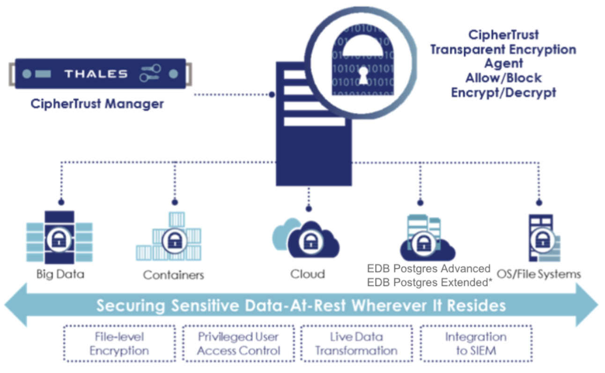

Thales CipherTrust Transparent Encryption (CTE) is designed to meet data security compliance and best practice requirements with minimal disruption. The CTE agents are installed at the operating file-system or device layer, and encryption and decryption is transparent to all applications that run above it. CTE agents are installed on EDB Postgres Advanced and Postgres Extended database servers and protect the database directories. The solution works in conjunction with the FIPS 140-2 up to Level 3 compliant CipherTrust Manager, which centralizes encryption key and policy management for the CipherTrust Data Security Platform.

  

!!! Note
    EDB Postgres Extended with BDR (Bi-Directional Replication)