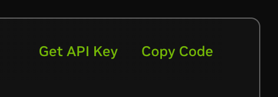

To use a Nvidia NIM that is hosted in your own environemtn, you first need a instance of the model. For this tutorial, we will show how to configure an AWS hosted instance with the Nvidia NIM model. In this tutorial, we will use the Nvidia NIM model llama-3.3-70b-instruct.

## Prerequisites

* An Nvidia NGC account. (If you don't have one, you can create one [here](https://build.nvidia.com/explore/discover/))

## Configuring the Nvidia cloud

### 1. Select a Model

Choose a model from [Nvidia's model library](https://build.nvidia.com/models). For this example, we will used the [llama-3.3-70b-instruct](https://build.nvidia.com/meta/llama3-70b) model.

### 2. Generate an API Key

API keys can be created from the model’s page.



Click on the `Get API Key` button to generate an API key. If you have not logged in, you will be prompted to log in and if you have not signed up, you will be invited to do so. You will recieve an API key that you can use to interact with the model. We will refer to this key as the `<NIM API KEY>` in the following steps.

## Integrating the Model with AI Accelerator

### 1. Enable AI Accelerator in EDB Postgres AI

With an EDB Postgres Advanced Server instance running, connect to the database and enable the AI Accelerator extension:

```sql
CREATE EXTENSION aidb CASCADE;
```

### 2. Register the Model

```sql
SELECT aidb.create_model( \
    'my_nim_llm', \
    'nim_completions', \
    '{"model": "meta/llama-3.3-70b-instruct"}', \
    '{"api_key":"<NIM API KEY>"}'::JSONB \
);
```

### 3. Run the Model

Execute the following query to interact with the model:

```sql
SELECT aidb.decode_text('my_nim_llm', 'Tell me a short, one sentence story');
__OUTPUT__
                                          decode_text                                       
    ----------------------------------------------------------------------------------------
     As the clock struck midnight, a single tear fell from the porcelain doll's glassy eye.
```

Your output may vary. You have successfully used Nvidia NIM models, running on Nvidia's cloud, via EDB’s AI Accelerator.
