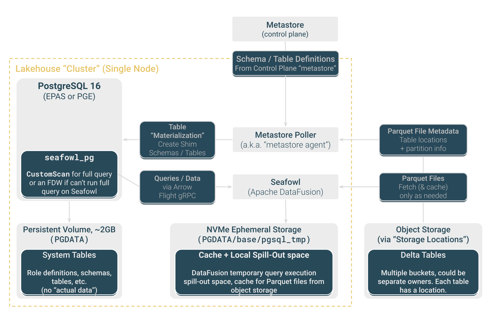

EDB Postgres AI HCP Lakehouse is the solution for running rapid analytics against
operational data on the EDB Postgres® AI HCP platform.

## Major concepts

-   *Lakehouse nodes* query *Lakehouse tables* in *managed storage locations*.

The figure shows how it fits together:

### Lakehouse node

A Postgres Lakehouse node is Postgres with a vectorized query engine that's
optimized to query Lakehouse tables but still fall back to Postgres for full
compatibility.

Lakehouse nodes are stateless and ephemeral. Scale them up or down based on
workload requirements.

### Lakehouse tables

Lakehouse tables are stored using highly compressible columnar storage formats
optimized for analytics and interoperable with the rest of the Analytics ecosystem.
Currently, Postgres Lakehouse nodes can read tables stored using the Delta
protocol (*Delta Tables*).

### Managed storage location

A *managed storage location* is where you can organize Lakehouse tables in
object storage so that Postgres Lakehouse can query them.

A managed storage location is a location in object storage where we control
the file layout and write Lakehouse tables on your behalf. Technically, it's an
implementation detail that we store these in buckets. This is really a subset
of an upcoming *storage location* feature that will also support
*external storage locations*, where you bring your own bucket.

## Terminology

### Lakehouse

The
"[Lakehouse architecture](https://15721.courses.cs.cmu.edu/spring2023/papers/02-modern/armbrust-cidr21.pdf)"
is a data engineering practice, "Lakehouse" a portmanteau of "data lake" and "data
warehouse," offering the best of both. The central tenet of the architecture is
that data is stored in object storage, generally in columnar formats like
Parquet. Different query engines can then process it for their own specialized
purposes, using the optimal compute resources for a given query.

### Vectorized query engine

A vectorized query engine is a query engine that's optimized for running queries
on columnar data. Most analytics engines use vectorized query execution.
Postgres Lakehouse uses [Apache DataFusion](https://datafusion.apache.org/).

### Delta Tables

We use the term *Lakehouse tables* to avoid committing to a particular
format, since we might eventually support, for example, Iceberg or Hudi. But
technically, we're using [Delta Tables](https://delta.io/). A Delta Table
is a well-defined container of Parquet files and JSON metadata, according to
the Delta Lake spec and open protocol. Delta Lake is a Linux Foundation project.

## How it works

Postgres Lakehouse is built using a number of technologies:

-   PostgreSQL
-   [Seafowl](https://seafowl.io/), an analytical database
-   [Apache DataFusion](https://datafusion.apache.org/), the query engine used by Seafowl
-   [Delta Lake](https://delta.io) (and specifically [delta-rs](https://github.com/delta-io/delta-rs)),
    for implementing the storage and retrieval layer of Delta Tables

### Level 100

The most important thing to understand about Postgres Lakehouse is that it
separates storage from compute. This design allows you to scale them independently,
which is ideal for analytical workloads where queries can be unpredictable and
spiky. You wouldn't want to keep a machine mostly idle just to hold data on
its attached hard drives. Instead, you can keep data in object storage (and also
in highly compressible formats), and only provision the compute needed to query
it when necessary.

On the compute side, a vectorized query engine is optimized to query Lakehouse
tables but still fall back to Postgres for full compatibility.

On the storage side, Lakehouse tables are stored using highly compressible
columnar storage formats optimized for analytics.

### Level 200

Here's a slightly more comprehensive diagram of how these services fit together:

### Level 300

Here's the more detailed, zoomed-in view of "what's in the box":

