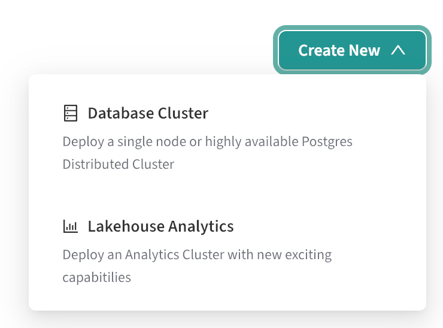

In this guide, you will:

1. Create a Lakehouse node
2. Connect to the node with your preferred Postgres client
3. Query sample data (TPC-H, TPC-DS, Clickbench, or 1BRC) in object storage

For more details and advanced use cases, see [reference](./reference).

## Introduction

Postgres Lakehouse is a new type of Postgres “cluster” (it's really just one
node) that you can provision in EDB Postgres® AI Cloud Services (formerly known
as "BigAnimal"). It includes a vectorized query engine (based on Apache
[DataFusion](https://github.com/apache/datafusion)) for fast queries over
columnar “Lakehouse Tables” in object storage
(using [Delta Lake protocol](https://delta.io/)).

### What to know

For more details, see [concepts](./concepts) and [reference](./reference),
but this should cover the gist of it:

* Postgres Lakehouse nodes are ephemeral, but they have NVMe hard drives for
local cache and spill out space. Currently we support deploying them to
EDB-hosted regions in AWS.
* Postgres Lakehouse nodes are pre-configured to query benchmark datasets
in object storage.
* Postgres Lakehouse is generally “read-only,” but otherwise supports all
valid Postgres queries.
* System tables are writable, so you can create users and roles. These tables
are stored on the attached block storage, so they will persist between instance
restarts and will be saved as part of backup/restore operations. Otherwise,
Lakehouse tables will not be part of backups, since they are ultimately stored
in object storage.

### Basic architecture

Here's what's in the box of a Lakehouse node:

[](images/level-300.svg)

## Getting started

You will need an EDB Postgres AI account. Once you've logged in and created
a project, you can create a cluster.

### Create a Lakehouse node

You will see a “Lakehouse Analytics” option under the “Create New” dropdown
on your project page:

<center>
<a href="./images/create-cluster-dropdown.svg"></a>
</center>

Selecting the "Lakehouse Analytics" button starts a configuration wizard that looks like this:


Provisioning the cluster may take 10-15 minutes.

A few notes:

* You will need to provide your own password. Create a secure password and save
it to your password manager. We will not save it on our side.
* Only AWS is supported, in BigAnimal Hosted regions.
* You can choose EDB Postgres Advanced Server (EPAS) or EDB Postgres Extended (PGE),
and the pricing calculator uses the same formula with license costs as it
would for a normal EPAS or PGE single-node cluster.
* Only instances with NVMe drives are supported. This is the M6ID family.
The NVMe drives are used for spill-out space while processing queries.
All data on the NVMe drives will be lost on cluster shutdown.
Persistent data in system tables (users, roles, etc) is stored in an attached
block storage device and will survive a restart or backup/restore cycle.
* Only Postgres 16 is supported.

For more notes about supported instance sizes,see [Reference - Supported AWS instances](./reference/instances).

## Operating a Lakehouse node

### Connect to the node

You can connect to the Lakehouse node with any Postgres client, in the same way that you connect to any other cluster from EDB Postgres AI Cloud Service (formerly known as BigAnimal): navigate to the cluster detail page and copy its connection string.

For example, you might copy the `.pgpass` blob into `~/.pgpass` (making sure to replace `$YOUR_PASSWORD` with the password you provided when launching the cluster).
Then you can copy the connection string and use it as an argument to `psql` or `pgcli`.

In general, you should be able to connect to the database with any Postgres client.
We expect all introspection queries to work, and if you find one that doesn't, then that's a bug.

### Understand the constraints

* Every cluster uses EPAS or PGE. So expect to see boilerplate tables from those flavors in the installation when you connect.
* Queryable data (like the benchmarking datasets) is stored in object storage as Delta Tables. Every cluster comes pre-loaded to point to a storage bucket with benchmarking data inside (TPC-H, TPC-DS, Clickbench) at scale factors 1 and 10.
* Only AWS is supported at the moment. Bring Your Own Account (BYOA) is not supported.
* You can deploy a cluster in any region that is activated in your EDB Postgres AI Account. Each region has a bucket with a copy of the
benchmarking data, and so when you launch a cluster, it will use the benchmarking data in the location closest to it.
* The cluster is ephemeral. None of the data is stored on the hard drive, except for data in system tables, e.g. roles and users and grants.
If you restart the cluster, or backup the cluster and then restore it, it will restore these system tables. But the data in object storage will
remain untouched.
* The cluster supports READ ONLY queries of the data in object storage (but it supports write queries to system tables for creating users,
etc.). You cannot write directly to object storage. You cannot create new tables.
* If you want to load your own data into object storage, see [Reference - Bring your own data](reference/loadingdata).

## Inspect the benchmark datasets

Inspect the Benchmark Datasets. Every cluster has some benchmarking data
available out of the box. If you are using pgcli, you can run `\dn` to see
the available tables.

The available benchmarking datasets are:

* TPC-H, at scale factors 1, 10, 100 and 1000
* TPC-DS, at scale factors 1, 10, 100 and 1000
* Clickbench, 100 million rows
* 1 Billion Row Challenge

For more details on benchmark datasets,
see Reference - Available benchmarking datasets](./reference/datasets).

## Query the benchmark datasets

You can try running some basic queries:

```sql
edb_admin> select count(*) from clickbench.hits;
+----------+
| count    |
|----------|
| 99997497 |
+----------+
SELECT 1
Time: 0.945s


edb_admin> select count(*) from brc_1b.measurements;
+------------+
| count      |
|------------|
| 1000000000 |
+------------+
SELECT 1
Time: 0.651s
```

Note: Do not use `search_path`! Read the [reference](./reference)
page for more gotchas and information about syntax/query compatibility.
