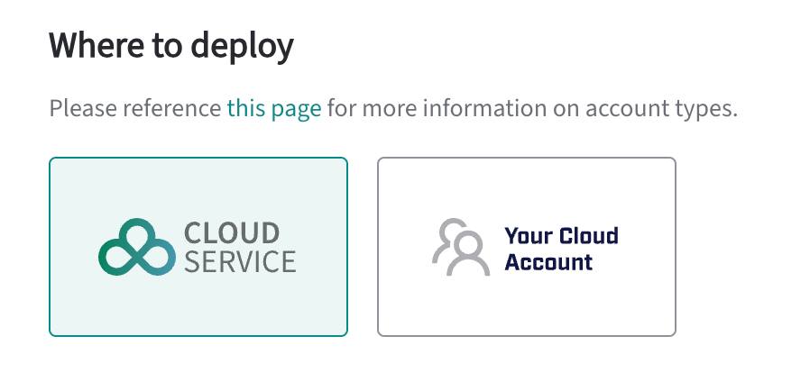

If you are looking for a fully hosted database solution, the Hosted option of the EDB Postgres AI Cloud Service provides a fully managed database service that allows you to focus on your applications and data, while EDB manages the database infrastructure. All you need to provide is the data and EDB manages the rest. 

The advantage of the Hosted option is that the database deploys within the EDB cloud infrastructure, so you have full control over the data. EDB's cloud infrastructure globally spans the major cloud service providers making it easy to co-locate the database with other services.

EDB manages the database infrastructure, including backups, monitoring, and updates, and provides a single pane of glass for managing your databases, monitoring performance, and accessing logs and metrics. All of this is visible through the [EDB Postgres AI Console](../console) and its single pane of glass which provides a unified view of your fully managed databases, self-managed databases (through the [EDB Postgres AI Agent](../console/agent)), analytics lakehouses, S3 stores and machine learning services. 

Hosted, fully managed databases are also quick to deploy and easy to scale. You can start with a small database and scale up as your data grows. EDB manages the scaling and performance of the database, so you can focus on your applications and data.

The Hosted option is ideal for organizations that want a fully managed database solution without the complexity of managing the database infrastructure or that want to quickly deploy a database and start building applications without having to provision and manage the database infrastructure.

The Hosted option is available for EDB Postgres Advanced Server (EPAS) and EDB Postgres Extended Server (PGE) databases.To get a fully hosted cluster, select EDB Postgres AI Cloud Service as the deployment option when you create a new database:

You can deploy EDB's Postgres Advanced Server (EPAS) or Postgres Extended Server (PGE) databases as hosted databases, with a range of [deployment options](deployment) for high availability and fault tolerance. 
