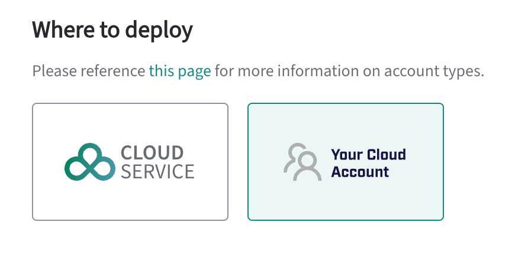

To deploy database clusters with Your Cloud Account:

- Understand what it means to use [Your Cloud Account](#your-cloud-account). 
- Understand the requirements of [deploying a cluster with Your Cloud Account](#deploying-a-cluster-with-your-cloud-account). 

## Your Cloud Account 

For many organizations, managing databases can be a complex and time-consuming task. The Managed option of the EDB Postgres AI Cloud Service provides a fully managed database service that allows you to focus on your applications and data, while EDB manages the database infrastructure. All you need to provide is the cloud account for EDB to deploy into.

The advantage of the Managed option is that the database can deploy directly into your cloud infrastructure, so you have full control over the cloud account and the data. EDB manages the database infrastructure, including backups, monitoring, and updates, and provides a single pane of glass for managing your databases, monitoring performance, and accessing logs and metrics.

## Deploying a cluster with Your Cloud Account 

When deploying in your cloud account, you need to set up your cloud service provider. You can use your AWS, Azure, or Google Cloud account. In this deployment model, you are responsible for managing your cloud resources and connecting your cloud to EDB Postgres AI Cloud Service. To set up your cloud service provider, see [Checking your cloud readiness](/biganimal/latest/getting_started/preparing_cloud_account/). 

