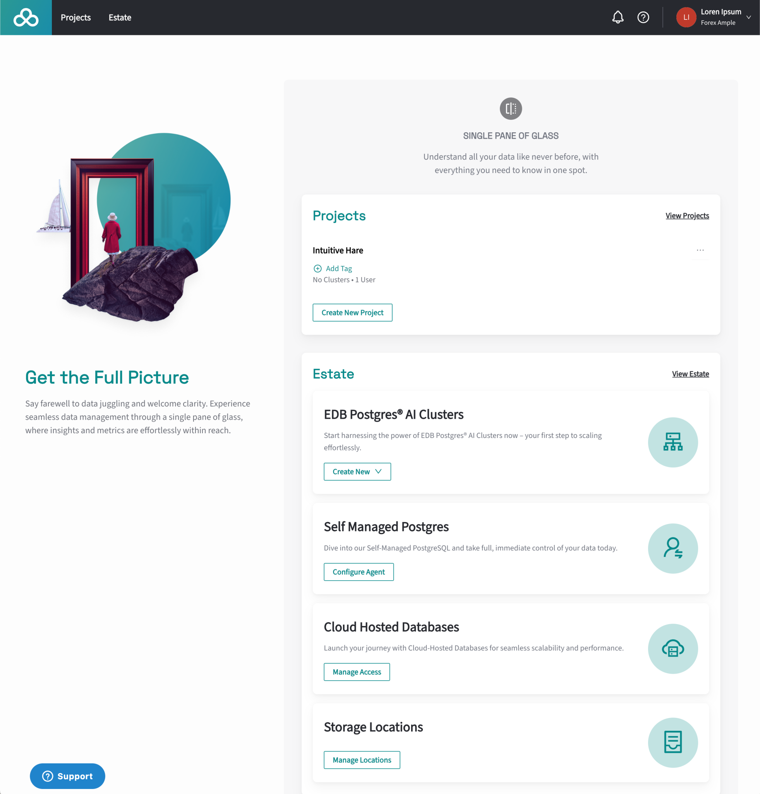

TL;DR: Jump straight to the [Quickstart](quickstart) to create your first database cluster.

The EDB Postgres® AI Console is a web-based user interface that provides a single pane of glass for managing and monitoring EDB Postgres AI Database Cloud Service, EDB Postgres AI databases, non-EDB Postgres such as AWS RDS, and any other Postgres installation. The EDB Postgres AI Console provides a unified view of the EDB Postgres AI Database Cloud Service and EDB Postgres AI databases, allowing users to manage and monitor their databases, users, and resources from a single interface.

## Accessing the EDB Postgres AI Console

To access the Console, you need to have an account with the EDB Postgres AI Database Cloud Service. If you don't have an account, you can sign up for one at [registration page](https://www.enterprisedb.com/accounts/register/biganimal).

Once you have your account, you can access the Console by navigating to [the EDB Postgres AI console](https://portal.biganimal.com) and logging in with your EDB Postgres AI credentials.

## Start using the Console 

Once you have logged in to your EDB account, you’ll be able to go to the EDB Postgres AI Console.

The Console opens by default on overview page for your account and the “single pane of glass” for all your EDB Postgres AI services. You can get to this overview page by selecting the EDB logo in the top right hand corner.

## Exploring the Overview

In the body of the overview page, you can see two summaries of the [__Project__](#projects) and [__Estate__](#estate) views. 

You can directly access the full __Project__ and __Estate__ views by selecting the **Projects** or **Estate** buttons next to the EDB logo. 

## Projects

To create and manage resources, you’ll need a project. A project associates organizationally related resources together which enables simpler administration and access.

In the overview's view of projects, you can see the name of each project, an option to add tags, the number of clusters within the project and the number of users who have access to that project.

Selecting **View Projects** takes you to the Projects view.

If you are an owner of the organization, you can create new projects by selecting the **Create New Project** button

## Estate	

The Estate view is your everything view of every resource - clusters, hosted, and managed, self-managed, analytics lakehouses, and managed storage locations - in every project. It cuts through the Projects demarcation to give a single unified view of all your resources. 

Rather than grouped into projects, the Estate overview grouped into types of resources.

Each resource shows its type, the number of instances of that resource and, on the right of the pane, a graphical representation or breakdown of those instances.

### EDB Postgres AI Clusters

This is any Postgres cluster created by and managed by EDB Postgres AI. EDB Postgres AI can host these clusters on any supported cloud service provider (AWS, Azure, GCP), or it can host them using  by your own account on any cloud service provider. 

Also included in this view are EDB Postgres AI Lakehouse analytics clusters. 

The graphical view shows a color coded snapshot of the clusters, along with a textual description of which cloud service providers are in use and how many are Cloud Service Hosted by EDB or Managed but not hosted by EDB.

The **Create New** button allows you to create a new Database cluster or Lakehouse analytics cluster in any of your projects. First, select between creating a Database cluster or a  Lakehouse analytics node. If you only have one project, the creation operation automatically uses it. If you have more than one project, a menu of available projects to create your cluster in pops-up for you to select which project the cluster should appear in.

Selecting the **EDB Postgres AI Clusters** title takes you to the __EDB Postgres AI Cluster__ pane of the full Estate view.

### Self Managed Postgres

Using an agent you can include self-managed Postgres clusters installed both on-premises and in the cloud as part of your EDB Estate view by using an agent. The agent collects metrics from an associated cluster and feed it to the EDB Estate. It’s in this pane that the information appears.

The **Configure Agent** button takes you through the steps needed to configure the Estate to receive data from an agent. See the [Agent](../agent) documentation for more details and in particular [Install Agent](../agent/install-agent) on how to install the agent on your platform.

Selecting the **Self Managed Postgres** title takes you to the __Self Managed Postgres__ pane of the full Estate view.

### Cloud Hosted Databases

Cloud Hosted Databases currently displays all the AWS S3 buckets and RDS instances that are available in selected AWS accounts. 

The **Manage Access** button takes you through the steps required to enable the Estate to collect this information from AWS. See [Integrating AWS](../estate/integrating/integrate_aws.mdx) for more details.

Selecting the **Cloud Hosted Databases** title takes you to the __Cloud Hosted Databases__ pane of the full Estate view.

### Storage Locations

Storage Locations, also known as Managed Storage Locations, are data repositories for EDB Postgres AI Analytics. You sync and migrate data to these locations for analysis from Postgres databases or S3 storage. The data is then optimized for fast query, aggregation, and analysis. 

The **Manage Locations** button takes you the __Storage Locations__ view where you can search for, view, and add storage locations.

Selecting the **Storage Locations** title take you to the __Storage Locations__ pane of the full Estate view.
