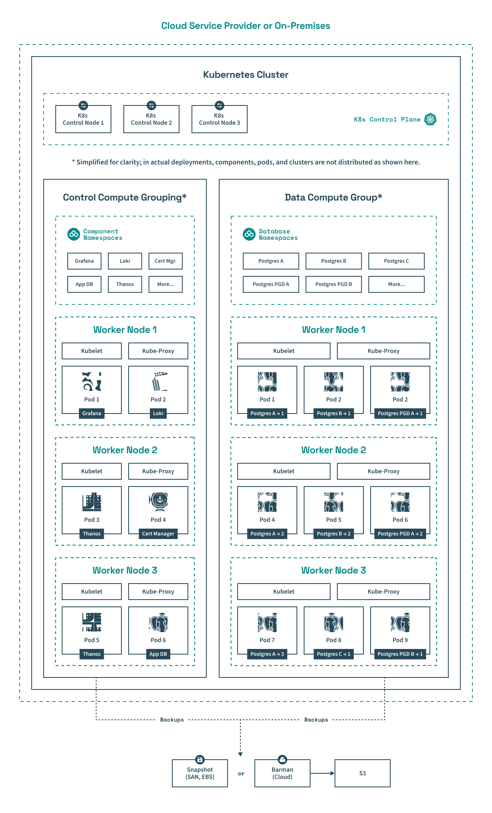

The outermost containers of the diagram illustrate a Kubernetes cluster running on a cloud service provider's infrastructure, such as [EKS on AWS](https://aws.amazon.com/eks/) or [GKE on GCP](https://cloud.google.com/kubernetes-engine), or on-premises infrastructure. "On-premises" in this context includes deployments on physical servers (bare metal), virtual machines, or private clouds hosted within an organization’s infrastructure. 

Working inward through the diagram, the three main logical groupings are:

1.  **Kubernetes control plane**: The Kubernetes control plane is comprised of the core Kubernetes components and implemented by two or three Kubernetes control nodes. Examples of core components are `kube-apiserver`, `etcd`, `kube-scheduler`, `kube-controller-manager`, and, if on a cloud setup, `cloud-controller-manager`.

2.  **Control compute grouping**: The control compute grouping of HM is a logical grouping of 70+ pods running on 2 or 3 Kubernetes worker nodes. It implements HM's core management components, such as Grafana, Loki, Thanos, Prometheus for observability, Cert Manager for certification management, Istio for networking, a trust manager for securing software releases, and many others.

    The 70+ pods for the components are distributed across the worker nodes according to how the `kube-scheduler` places them, which isn't as simply as pictured in the diagram.

    If needed, you can add more worker nodes to support more database-as-a-service resources.

3.  **Data compute grouping**: The data compute grouping of HM is a logical grouping of Postgres clusters organized by namespaces. It runs on a number of pods distributed across at least 3 Kubernetes worker nodes as the `kube-scheduler` places them, which may not be as simply as pictured.

    You can increase the number of worker nodes from three as more databases are added using HM. However, to do this automatically may require either adding the worker nodes manually or configuring auto-scaling alongside your infrastructure.

Both the control compute grouping's worker nodes and the data compute grouping's worker nodes are backed up nightly to either snapshots (on-premises using a SAN or using EBS with EKS) or S3-compatible object store using [Barman for the cloud](https://docs.pgbarman.org/release/3.12.0/user_guide/barman_cloud.html).

### Scalability

To support scalability, HM integrates with Kubernetes auto-scaling capabilities.
This means that on platforms like AWS, worker nodes in the data compute grouping can be automatically added to the cluster as needed using AWS's managed service [Auto Scaling groups](https://docs.aws.amazon.com/autoscaling/ec2/userguide/auto-scaling-groups.html).
However, you can disable HM's Kubernetes auto-scaling capability to control costs.
In addition, it's important to know that enabling auto-scaling functionality for on-premises deployments requires additional infrastructure configuration. That's because there's no out-of-the-box auto-scaling feature for on-premises deployments as there is for AWS's Auto Scaling groups.

You can monitor the distribution and resource usage of pods and worker nodes implementing the database clusters using the [included Grafana dashboards](../using_hybrid_manager/cluster_management/manage-clusters/trace-clusters/#grafana-hardware-utilization-dashboard) or by [using Kubernetes `kubectl` commands](../using_hybrid_manager/cluster_management/manage-clusters/trace-clusters/#using-kubectl-to-check-underlying-cluster-resources).

### Backup architecture

HM provides robust backup options to ensure data integrity and recoverability.
Each HM worker node in the data compute grouping performs nightly backups by default, stored using Barman (for the cloud) or using snapshot backups.

Snapshot backups are available for faster recovery times but require a compatible CSI driver in the storage layer (for both cloud-based snapshots and local disk snapshots).
Given the constraints of logical volume manager (LVM) setups, snapshots are optimal for local recovery but may face limitations when used in multi-site or global recovery scenarios setups due to the lack of shared access across sites.

For more robust, multi-availability zone recovery, Barman cloud backups can be stored in object stores like AWS S3, which natively supports multi-zone replication.
Alternatively, local object stores might require additional configuration to ensure backups are replicated to remote sites.
Stretch clusters mitigate these limitations by enabling data replication and redundancy across geographically dispersed locations.

### High availability and resilience

HM leverages Kubernetes' proven technologies to ensure high availability through automated failover mechanisms.
These mechanisms function within stretch clusters, across availability zones, or between zones in the same region.
The architecture supports faster backups, via snapshot backups, as well as recovery for large datasets, though multi-site recovery capabilities depend on the underlying storage infrastructure.
For customers with advanced storage configurations, such as storage area networks (SANs) spanning multiple racks or data centers, HM can leverage the infrastructure to enhance resilience and ensure rapid failover. However, these configurations may not be common among all users.
