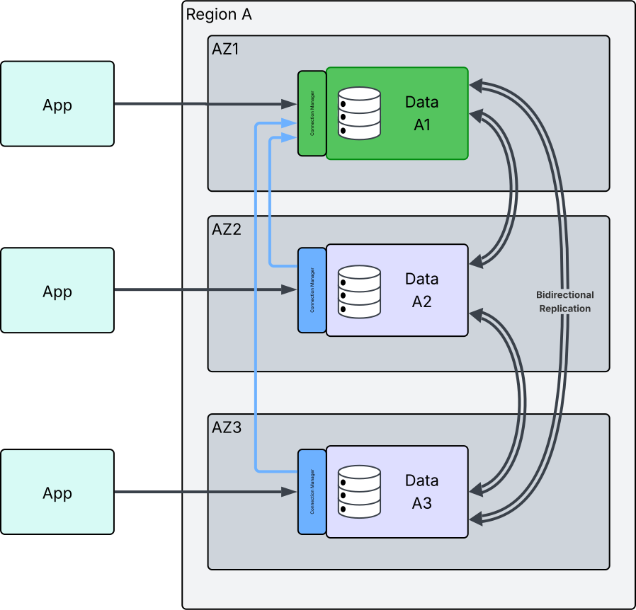

Advanced high-availability clusters are powered by [EDB Postgres Distributed](https://enterprisedb.com/docs/pgd/latest/) and are based on the Essential edition of PGD. Unlike [distributed high-availability clusters](./distributed_highavailability), advanced high-availability clusters use a single region and are designed to provide high availability within that region. 

They are designed for users who want a simpler setup and fewer configuration options than distributed high-availability clusters, while still benefiting from the advanced features of EDB Postgres Distributed and the ability to easily migrate to distributed high-availability clusters in the future.

AHA clusters are ideal for applications that require robust failover capabilities without the complexity of multi-region deployments. The underlying architecture of advanced high-availability clusters is similar to that of distributed high-availability clusters, but requires the users to connect via the PGD Connection Manager (embedded in every node) to ensure connections go to the current write leader node. This eliminates the need to manage conflicts across the cluster making application development easier.

In this diagram, you can see the applications connecting to the PGD cluster through the Connection Manager ports. The Connection Manager is responsible for routing the read and write transactions to the appropriate nodes in the group. The write leader is responsible for handling all write transactions and is shown at the top in AZ1 in green.

The other nodes in the group are read-only nodes that replicate data from the write leader. Applications connecting to the read-only nodes' Connection Manager read/write ports will have their queries and changes routed to the write leader. All the time, the nodes are communicating with each other, replicating data to ensure they are in sync.

AHA clusters support both EDB Postgres Advanced Server and EDB Postgres Extended Server database distributions. They do not support Community PostgreSQL distributions.

