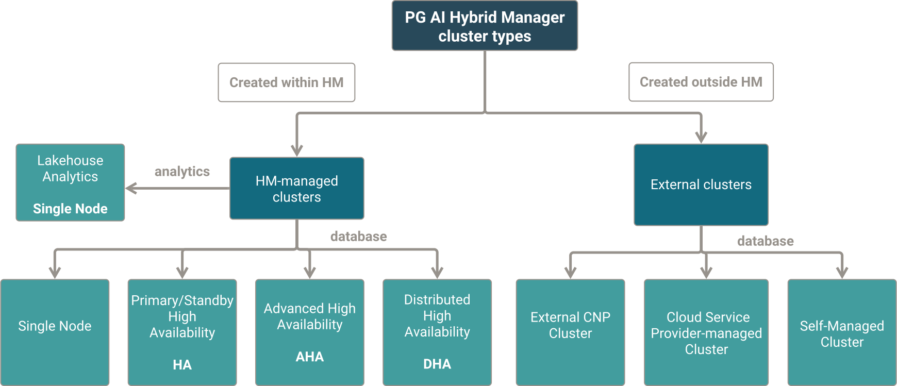

Review these terms to understand and leverage PG AI Hybrid Manager capabilities.

## PG AI Hybrid Manager

PG AI Hybrid Manager is the name given to EDB's solution for deployment, management, monitoring and automation of Postgres and Lakehouse databases and sovereign AI systems. 

It is a Kubernetes-based software stack that simplifies the lifecycle of deployed database clusters by making best use of modern private cloud, public cloud, multi-cloud or on-premise infrastructures, allowing developers to self-manage databases for their applications through a Private or Sovereign Database-as-a-Service (DBaaS) model. 

### Private Database-as-a-Service (DBaaS)

A key feature of the PG AI Hybrid Manager is the abililty to provision and manage databases on Kubernetes. This capability is referred to as a Private Database-as-a-Service (DBaaS). 

Through this capability, the Hybrid Manager becomes a self-managed, internal database service within your infrastructure, which gives you the agility of a public cloud DBaaS with the control and security of a private environment. 

This approach enables developers to perform self-service provisioning, observability and troubleshooting.

### Engineered System

The Engineered System is PG AI Hybrid Manager in a box, a ready-to-go physical server that you can slot into a rack and deploy as a containerized appliance. This deployment method offers a flexible and portable solution for organizations seeking to streamline their database operations in a hybrid or multi-cloud world.

## PG AI Console

The PG AI Console is a web-based graphical interface that provides users with a centralized point of interaction for the PG AI Hybrid Manager. From this dashboard, you will be able to deploy and manage databases, connect and monitor external databases, perform data migrations, manage user permissions, deploy AI workloads and more.

For an overview of the PG AI Console's functionality, see [About the PG AI Console](/use/index.md).

### Projects

In the PG AI Hybrid Manager, **Projects** serve as fundamental organizational units that provide isolation for managing and creating resources. You can create and manage your clusters within these individual projects. Use projects to manage resource per team (engineering, operations, data science), per environment (development, staging, production), per product, per customer, etc.

See [Projects](projects) for more information.

### Estate

In the PG AI Hybrid Manager, **Estate** serves as a fundamental overview of all database resources it has access to. Whether you created a database or Analytics cluster with the PG AI Hybrid Manager, or connected an external database for monitoring, it becomes part of your Estate.

See [Estate](/using_hybrid_manager/hm_overview/using-portal/#monitoring-resources-in-your-estate) for more information.

### Launchpad

The Launchpad gives access to a number of third-party services which can be used to enhance the capabilities of the PG AI Hybrid Manager.

See [Launchpad](../using_hybrid_manager/hm_overview/using-portal.mdx/#launchpad) for more information.

## Clusters (disambiguation)

The term **cluster** in computing refers to a group of interconnected components that work together as a unified system to achieve a common goal. As many technologies adopt this approach, the term **cluster** becomes widely spread to refer to systems where multiple individual components are managed in a unified way.

### Kubernetes cluster

Within the scope of the PG AI Hybrid Manager, a Kubernetes cluster represents the foundational infrastructure upon which the PG AI Hybrid Manager software itself is deployed as a self-contained instance. PG AI Hybrid Manager leverages the capabilities of this underlying Kubernetes cluster to manage Postgres database deployments, with [CloudNativePG](https://www.enterprisedb.com/docs/supported-open-source/cloud_native_pg/) as its tool for orchestrating Postgres on Kubernetes.

Not to be confused with [*Postgres* cluster](hm_terminology.mdx#postgres-cluster), or [*Database* cluster](hm_terminology.mdx#database-cluster).

### Kubernetes stretch cluster

This is a subtype of a Kubernetes cluster that you can also use to deploy the PG AI Hybrid Manager.

!!!note

    This functionality will be added in a later version.

Typically, all nodes of a Kubernetes cluster reside in a single Availability Zone. For PG AI Hybrid Manager deployments with high availability (HA), advanced high availability (AHA) or distributed high availability (DHA) enabled, the platform automatically handles primary node failures by initiating a seamless takeover by a standby node.

However, this built-in failover mechanism is insufficient when an entire Availability Zone experiences an outage. This is where **Kubernetes stretch clusters** become crucial. They extend or "strecth" a Kubernetes cluster across multiple Availability Zones or geographically separated locations, ensuring that if one zone fails, application workloads can continue to be served by healthy nodes in other locations. This setup requires the use of AZ-independent, shared storage to maintain data accessibility during an AZ failure.

### Postgres cluster

In Postgres, a cluster is a single [instance of Postgres](hm_terminology.mdx#postgres-instance), also known as a Postgres server. This single occurrence of a Postgres instance can contain one or multiple different databases. For example, a server for MYCOMPANY with databases *HR*, *FINANCE* and *LEGAL*.

This term is not used in Hybrid Manager documentation, as the usage of "cluster" in this context could be ambiguous. Here, we'll refer to it as Postgres instance. 

Not to be confused with [*Kubernetes* cluster](hm_terminology.mdx#kubernetes-cluster), or [*Database* cluster](hm_terminology.mdx#database-cluster).

### Database cluster

In PG AI Hybrid Manager documentation, **database cluster** refers to multiple instances of Postgres using replication capabilities to support database resiliency and improve performance. Since such cluster-based systems are essential features of modern enterprise Postgres operations, the Hybrid Manager is built around database clusters. For this reason, even single-node Postgres instances are represented as clusters.

For example, if a postgres server for MYCOMPANY contains the databases *HR*, *FINANCE* and *LEGAL*, and then the same server gets replicated for redundancy and failover, we refer to the whole system as a database cluster. In a scenario with two instances, you would have a database server A with *HR*, *FINANCE*, and *LEGAL* and a replica server B with *HR*, *FINANCE*, and *LEGAL*, where server A and B have the same data. Each server in this replication setup lives on its own data node.

Database clusters can either be created within the PG AI Hybrid Manager or created externally but then connected to the PG AI Hybrid Manager for observability. See [Database cluster types in the PG AI Hybrid Manager](hm_terminology.mdx#database-cluster-types-in-the-pg-ai-hybrid-manager) for an overview of all cluster types you can create or connect to the PG AI Hybrid Manager.

Not to be confused with [*Kubernetes* cluster](hm_terminology.mdx#kubernetes-cluster) or [*Postgres* cluster](hm_terminology.mdx#postgres-cluster).

## Database cluster types in the PG AI Hybrid Manager

The PG AI Hybrid Manager instance is a centralized pane of glass that can host, manage and monitor several database cluster categories. Some database clusters are created and completely maintained within the PG AI Hybrid Manager, while others are created externally but connected to the PG AI Hybrid Manager to provide monitoring and migration capabilities.

Currently, you can:

-   Create [HM-managed clusters](hm_terminology.mdx#hm-managed-clusters)

or, 

-   Connect [External clusters](hm_terminology.mdx#external-clusters).

### HM-managed clusters

HM-managed clusters are database servers you created with the PG AI Hybrid Manager. They are deployed in the same Kubernetes cluster as the Hybrid Manager, using its provisioning capabilities. In the **Estate** page, HM-managed clusters have the **Hybrid Manager** label under the **Management** column.

**Examples**: Single Node, Primary/Standby High Availability (HA), Advanced High Availability (AHA), or Distributed High Availability (PGD) database instances with PostgreSQL, EDB Postgres Advanced Server, or EDB Postgres Extended Server that were deployed using the PG AI Hybrid Manager.

EDB offers the following database topology options. 

**Single Node:** This option creates a single Postgres instance. See [Single-node cluster](../database_types/single_node.mdx) for more information.

**Primary/Standby High Availability:** Also called HA, this topology option hosts a Postgres instance and replicates it on at least one additional node. See [Primary/standby high availability cluster](../database_types/primary_standby_highavailability.mdx) for more information.

**Advanced High Availability:** Also called AHA, this topology hosts at least two groups of a Postgres instance and its replicas across availability zones in a single region.

**Distributed High Availability:** Also called DHA, this topology hosts at least two groups of a Postgres instance and its replicas across availability zones in multiple regions. See [Distributed high availability cluster](../database_types/distributed_highavailability.mdx) for more information.

**Lakehouse Analytics - Single Node:** You can also create [Lakehouse Analytics](../../analytics/overview.mdx) clusters with the PG AI Hybrid Manager. PG AI Lakehouse Analytics clusters provide an environment for querying and analyzing data stored in open lakehouse formats (like Delta Lake) within object storage. Leveraging the PG AI Hybrid Manager's unified control plane, users can easily deploy and manage these specialized clusters optimized for fast analytical queries. 

The PG AI Hybrid Manager simplifies the deployment and operation of these analytics engines, accelerating data-driven decision-making.

### External clusters

You can connect clusters that were provisioned externally.

#### Self-managed cluster

Self-managed clusters are external Postgres, or Oracle clusters (created outside of the PG AI Hybrid Manager). They are deployed using other provisioning capabilities than the PG AI Hybrid Manager (e.g. manually), and are often deployed on a different machine than the PG AI Hybrid Manager. 

In the **Estate** page, Self-managed clusters have the **Self-Managed** label under the **Management** column.

You can connect self-managed clusters to the PG AI Hybrid Manager for observability with the [PG AI Agent](monitoring/mon_ext_dbs/mon_with_agent) and perform migrations with the [Data Migration Service](../../migration-etl/data-migration-service).

**Examples**: PostgreSQL, EDB Postgres Advanced Server, EDB Postgres Extended Server, or Oracle database instances deployed by yourself on a physical server, virtual machine or similar. In the case of virtual machines, they can run on cloud infrastructures, but the provisioning of the database cluster is managed by you, and not by the Cloud Service Provider.

!!!note

    Self-managed Oracle databases that you connect to the PG AI Hybrid Manager don't appear under **Estate** > **Postgres**. Switch to **Estate** > **Migrations** to see information.

#### Cloud Service Provider-managed cluster

Cloud Service Provider-managed clusters or CSP-managed clusters are external clusters (created outside of the PG AI Hybrid Manager) that host one or more occurrences of a Postgres instance. They are deployed using Cloud Service Provider (CSP) provisioning capabilities and their major operational tasks are handled by the CSP (backups, upgrades, failover, etc). However, architecture, developer, and application-specific activities are handled by you.

In the **Estate** page, Cloud Hosted Database clusters have the **Cloud Hosted Databases** label under the **Management** column.

You can [connect CSP-managed clusters to the PG AI Hybrid Manager for observability](monitoring/mon_ext_dbs/mon_ext_csp) and perform migrations with the [Data Migration Service](../../migration-etl/data-migration-service).

**Examples**: Postgres on AWS RDS.

#### External CNPG cluster

External CNPG database clusters are external database clusters created on a Kubernetes environment outside of the PG AI Hybrid Manager with CloudNativePG. They are deployed using the provisioning capabilities of open-source CloudNativePG, EDB CloudNativePG Cluster or EDB CloudNativePG Global Cluster. 

In the **Estate** page, External CNPG clusters have the **External CNP Cluster** label under the **Management** column.

**Examples**: PostgreSQL, EDB Postgres Advanced Server, or EDB Postgres Extended Server database instances deployed with CloudNativePG, EDB CloudNativePG Cluster or EDB CloudNativePG Global Cluster.

## Other terms

### Data node

The term "data node" is used to refer to a Kubernetes worker node specifically designated to host Postgres database instances managed by the PG AI Hybrid Manager.

### Postgres instance

A Postgres server that can host multiple databases. It starts on a specific data directory containing all data and files required to run that instance. In high-availability deployments, at least one additional instance is replicated on a different Availability Zone.
