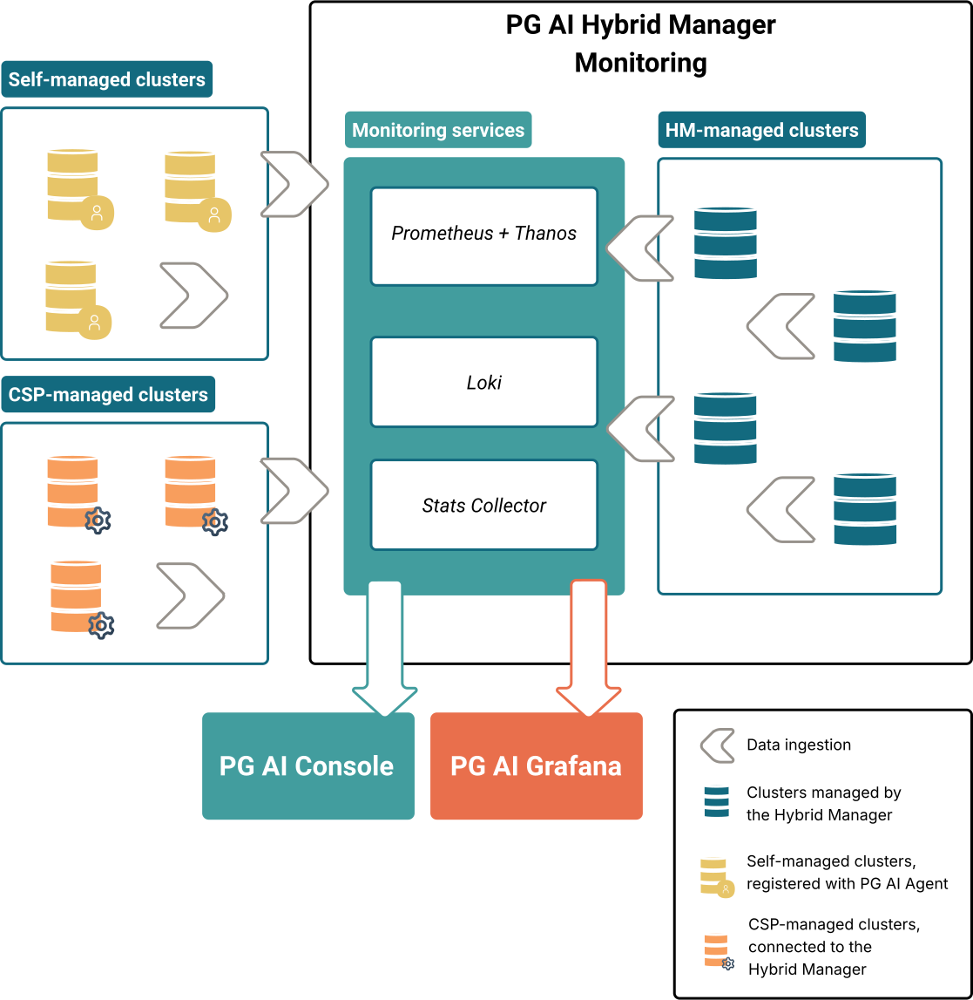

With the Hybrid Manager you can collect a wide range of metrics (host metrics, Kubernetes metrics, postgres database data, query data, as well as logging data). You can visualize the collected data with the console or Grafana instance to analyze trends, configure alerting, improve the efficiency of databases, perform troubleshooting and much more.

## Understanding the monitoring architecture

The Hybrid Manager has three main internal pipelines that provide monitoring capabilities.

-   Prometheus and Thanos collect metrics. 
-   Loki collects logs.
-   Stats Collector collects query data. 

All these services come with their own dedicated stores, which means that the collected data is kept within the Hybrid Manager. These services and stores are deployed by default. 

These collected metrics become available to you through two interfaces: 

-   The [**Grafana**](monitoring_grafana) dashboard.
-   The [**Console**](monitoring_console), for example, in the Estate tab or [Cluster view](../cluster_management/view_clusters/).

### Enabling database monitoring

The monitoring services that come with the Hybrid Manager require access to the databases you want to monitor, as well as some extensions to enable the Stats Collector.

-   For **HM-managed** clusters (created with the **Hybrid Manager**), the default setup already provides access to the monitoring stack. 

-   For external **self-managed** clusters, each of the databases must be [registered with the **Agent**](mon_ext_dbs/mon_with_agent) to enable data collection. By default, the agent provides the configuration to collect Prometheus, Thanos and Loki data. Additionally, the agent provides configuration parameters so you can control whether to enable or disable the extensions required for the Stats Collector (collection of query data), namely `edb_wait_states_data`, `edb_stat_monitor`, `edb_query_advisor`, and `pg_stat_statements`.

-   For external **CSP-managed** databases (cloud service provider-managed), such as **AWS RDS**, the Hybrid Manager needs to get access to the database through a Kubernetes `Secret` resource to enable data collection. See [Monitoring CSP-managed databases](mon_ext_dbs/mon_ext_csp) for more information. Query data with the Stats Collector is not available for CSP-managed databases at this moment.

### Monitoring data ingestion and scope

Because of the different levels of access the Hybrid Manager has to the variety of cluster types, the way that data is ingested and the scope of collected data is varied.

-   For **HM-managed** clusters (created with the **Hybrid Manager**), the databases automatically push host metrics, Postgres metrics, cluster metrics, query metrics, data required for recommendations, as well as logs to the corresponding Prometheus, Thanos, Loki and Stats Collector stores.

-   For external **self-managed** databases, the agent pushes host metrics, Postgres metrics, cluster metrics, query metrics, data required for recommendations, as well as logs to the corresponding Prometheus, Thanos, Stats Collector stores at configurable intervals.

-   For external cloud service provider-managed databases (CSP-managed databases), such as **AWS RDS**, the Hybrid Manager leverages the Manager-to-database connection to pull host, and Postgres metrics to the central stores. Query data with the Stats Collector is not available for CSP-managed databases at this moment.

For more information, see [Metrics support scope](monitoring_console/support_scope.mdx).

### Monitoring refresh frequency

The refresh intervals for the metrics that are collected by the Hybrid Manager vary depending on the metric and database type. This difference is due to the varying methods of data collection and integration of Prometheus/Thanos, Loki, and Stats Collector services.

See [Metrics refresh intervals](monitoring_console/metrics_latency.mdx) to understand how often metrics are updated and how to customize the frequency.

## Connecting data into external tools

Currently, EDB doesn't support plugging metrics and log data collected by the Hybrid Manager into external tools or enterprise systems.

## Related topics

-   [Enabling monitoring](mon_ext_dbs) ► Install the agent or connect your database to the Hybrid Manager to enable monitoring on external databases.
-   [Metrics refresh intervals](monitoring_console/metrics_latency.mdx) ► Understand how often metrics are updated and how to customize the frequency.
-   [Monitoring with Grafana](monitoring_grafana) ► Use Grafana to monitor your databases.
-   [Monitoring console](monitoring_console) ► Use the console to monitor your databases.
-   [Notifications](notifications.mdx) ► Configure notifications. 
