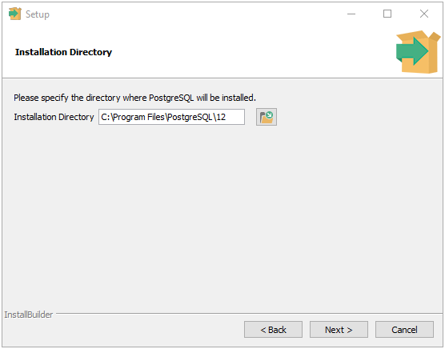
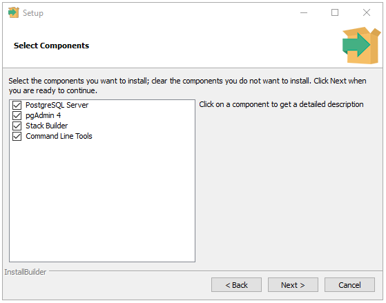
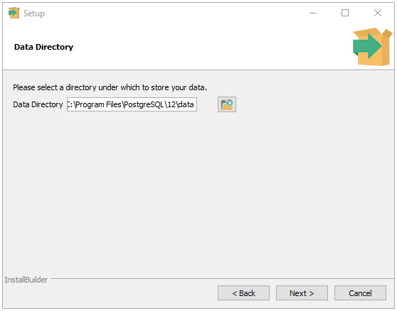
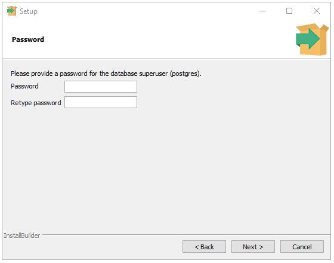
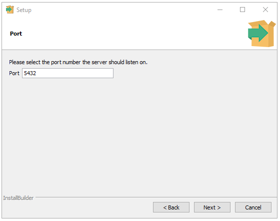
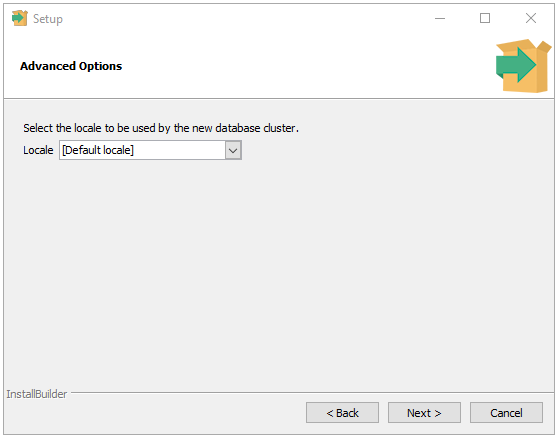
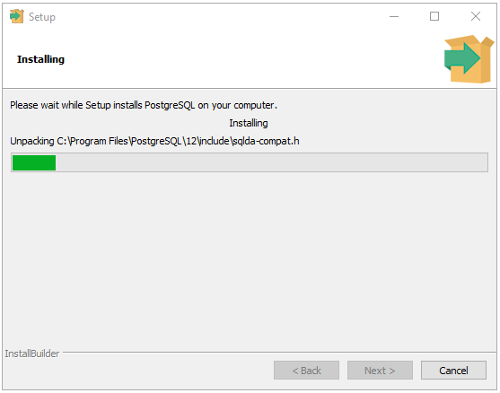

Windows installers for PostgreSQL are provided by EDB at [enterprisedb.com](https://www.enterprisedb.com/downloads/postgres-postgresql-downloads) - choose the version of PostgreSQL and Windows that you need. 

## Using the Graphical installer

Upon running the installer, you should be prompted to allow Administrator access; if you do not have Administrator access on the machine where you wish to install PostgreSQL you will need to request assistance from someone who does.

The installer presents graphical "wizard" which prompts you for various configuration parameters. On each page, you may click the "Next" button to confirm each page of options, "Back" to return to the previous page of options, or "Cancel" to abort the installation. 

Some pages have only informational text; read it and click "Next" to continue.

### Installation directory



This option specifies the filesystem location where the PostgreSQL binaries, documentation, add-ons, development libraries and header files, uninstaller, and other associated files will be stored.

Accept the default installation directory, or specify an alternate location and click Next to continue.

### Components



Use the checkboxes to select the software to be installed. You may choose:

- PostgreSQL Server to install the PostgreSQL database server.

- pgAdmin 4 to install the graphical interface for administrating and monitoring PostgreSQL. [More about pgAdmin](https://www.pgadmin.org/faq/)

- Stack Builder to install the Stack Builder utility; for more information about the Stack Builder utility, see [Using Stackbuilder](https://www.enterprisedb.com/edb-docs/d/postgresql/installation-getting-started/installation-guide-installers/12/using_stackbuilder.html#using-stackbuilder).

- Command Line Tools to install PostgreSQL tools such as:

   - psql, pg_isready, and pgbench

   - clusterdb, createdb, and dropdb

   - createuser and dropuser

   - pg_basebackup, pg_dump, pg_dumpall, and pg_restore

   - reindexdb, vacuumdb, and vacuumlo

   (This is not a comprehensive list; the command line tools installed may vary by platform.)

Select the components you want and then click Next to continue.

### Data directory



This option specifies the filesystem location where the PostgreSQL database and configuration will be stored. It defaults to a directory named "data" under the installation directory configured in a previous step, but you may specify an alternate location. 

Be sure to choose a location with enough free space for the data you expect to store! Then click Next to continue.

### Password



PostgreSQL uses the password specified on this page for both the database superuser and the PostgreSQL service account.

PostgreSQL runs as a service in the background; the PostgreSQL service account is named `postgres`. If you have already created a service account with the name `postgres`, you must specify same password as the existing password for the `postgres` service account.

The specified password must conform to any security policies existing on the PostgreSQL host. After entering a password in the Password field, and confirming the password in the Retype Password field, click Next to continue.

### Port 



Use the Port field to specify the port number on which the server should listen. The default listener port is 5432. If this is already in use then you should specify a different number. Click Next to continue.

### Locale



Use the Locale field to specify the locale that will be used by the new database cluster. The `Default locale` option is the operating system locale. 

Click Next to continue: you will be presented with a summary of the options that you have chosen. Click Next twice more to start the installation.

A progress bar will be displayed while PostgreSQL is installed:



Once installation has completed, you will be shown an option to launch Stack Builder. You may do so to install additional tools, add-ons and drivers. For details, see: [Using Stack Builder](https://www.enterprisedb.com/edb-docs/d/postgresql/installation-getting-started/installation-guide-installers/12/using_stackbuilder.html)

If you plan on developing software on the machine where you've installed PostgreSQL, please refer to the section [Configuring Command Line Tools](#configuring-command-line-tools), below.

## Installing EDB Postgres Advanced Server 

If you're installing EDB's Postgres Advanced Server, [instructions for Windows systems can be found on this site](https://www.enterprisedb.com/edb-docs/d/edb-postgres-advanced-server/installation-getting-started/installation-guide-for-windows/12/toc.html).


## Configuring Command Line Tools

By default, the installer does not modify the system path. If you wish to use the command line tools (such as psql), you'll want to add PostgreSQL to the path after installation.

1. Open the System Properties control panel and select the Advanced tab (or run SystemPropertiesAdvanced.exe)
2. Activate the "Environment Variables..." button to open the envornment variables editor
3. Find the `Path` variable under the "System variables" heading, and click "Edit..."
4. Add the path that you specified as the installation directory during installation, with `\bin` appended (by default: `c:\program files\postgresql\12\bin`, where <i>12</i> is the version of PostgreSQL that you installed). 

To test your installation, open a new command prompt and run,

```shell
psql -U postgres
```

You'll be prompted for the password you provided during installation. [More about psql...](http://postgresguide.com/utilities/psql.html)

## Development Tools

To develop applications which connect to a PostgreSQL server, you'll need libraries for this purpose. For details, see: [Connecting to Postgres](/getting-started/connecting_to_postgres).
