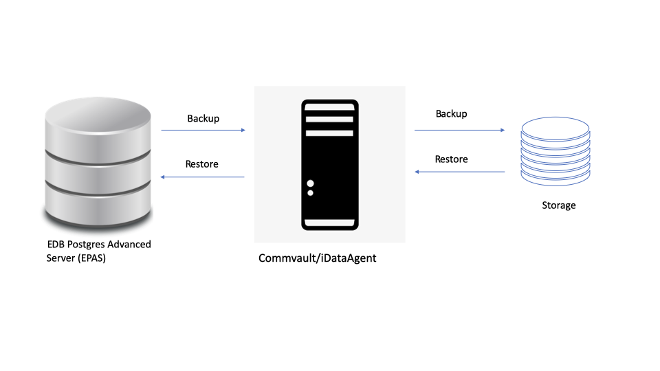

Commvault enables businesses to proactively simplify and manage the complexity of their continuously evolving and growing data environments, whether your data is on-premises or in the cloud.

Commvault PostgreSQL/EDB Postgres Advanced Server (EPAS) iDataAgent provides the flexibility to backup the PostgreSQL/EDB Postgres Advanced Server (EPAS) databases in different modes and restore them in minimal time. Whether you need to perform a full or log backup or restore of the entire PostgreSQL/EDB Postgres Advanced Server (EPAS) server or individual databases or archive logs at any point of time, you have full control.

Managing your data means knowing that it is protected and being able to effectively report on success or failure.  Through an easy to use interface, you can quickly check on the progress of your jobs to ensure things are moving as expected.  You can also use pre-built reports in an on-demand fashion, or scheduled, to keep you in the know.

  

