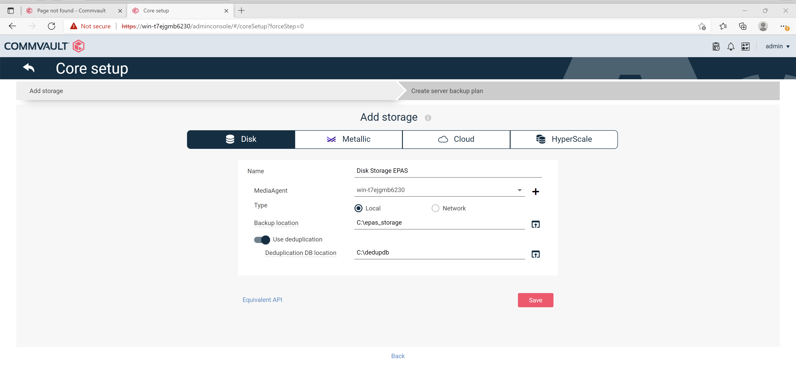
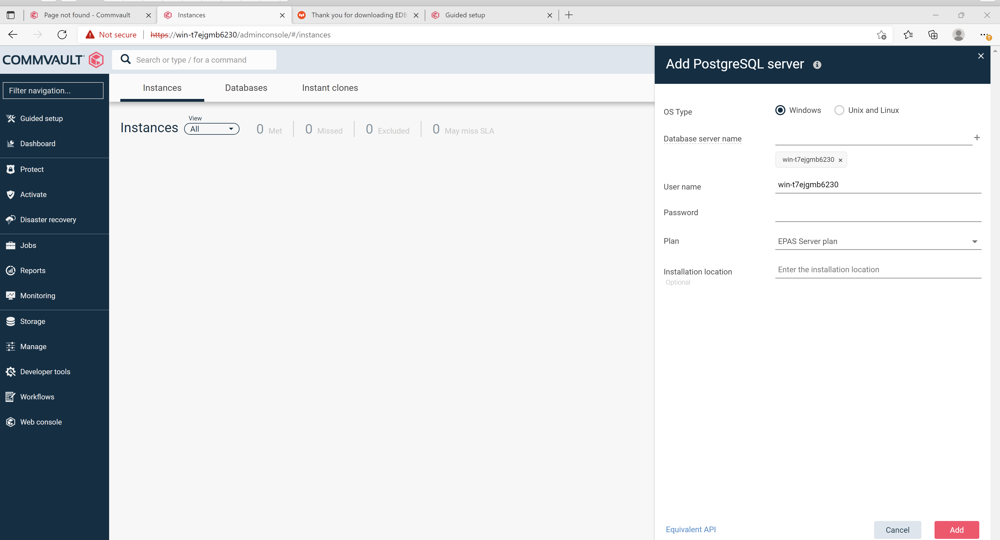
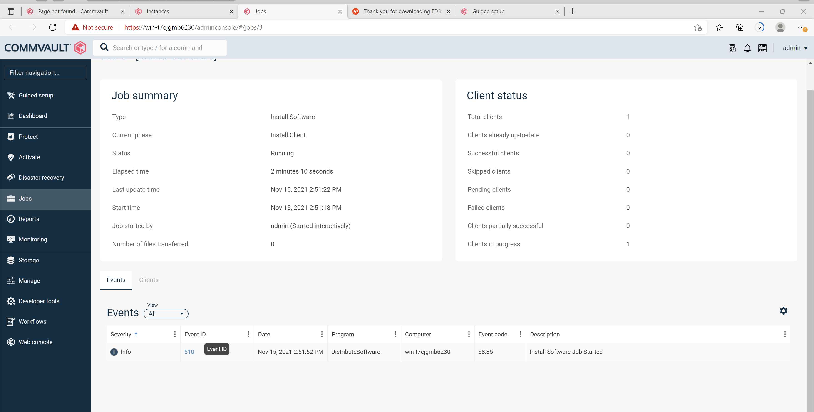
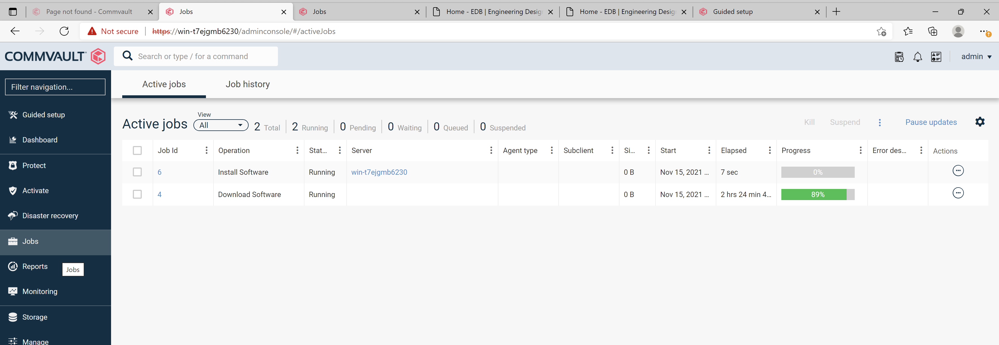
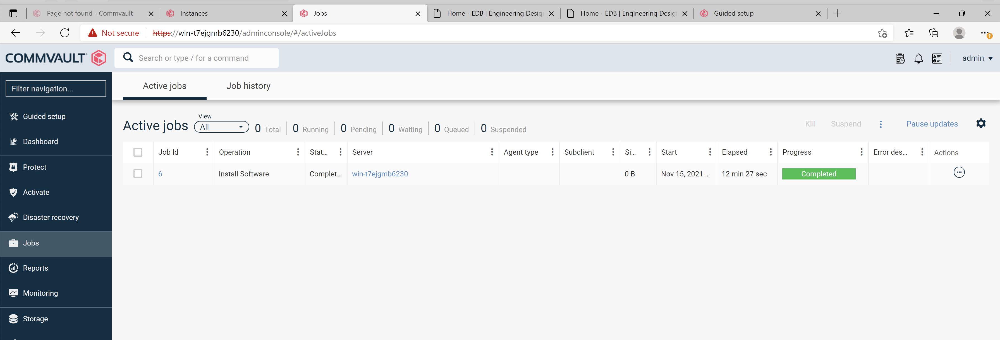
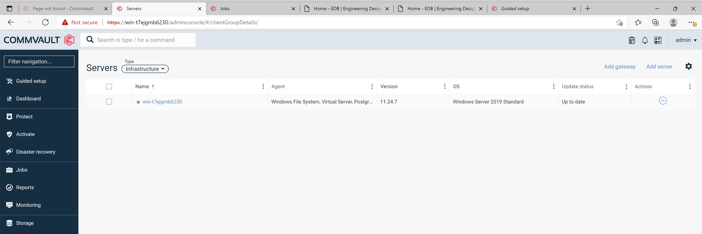
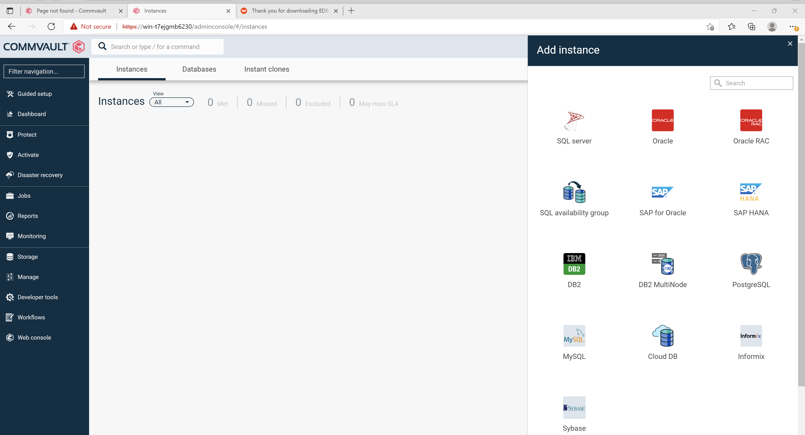
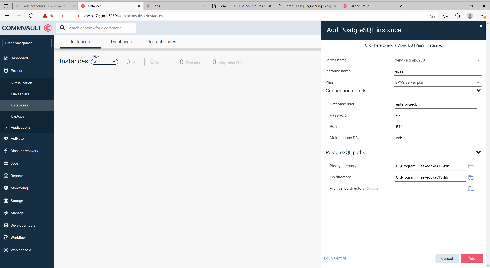
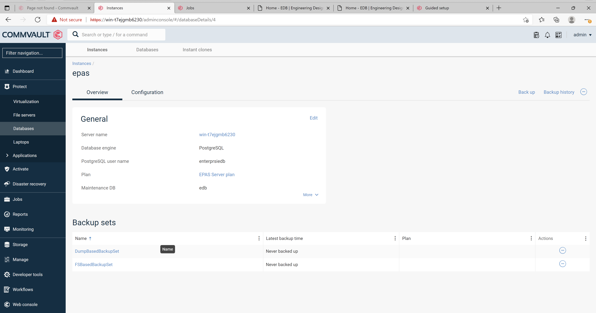
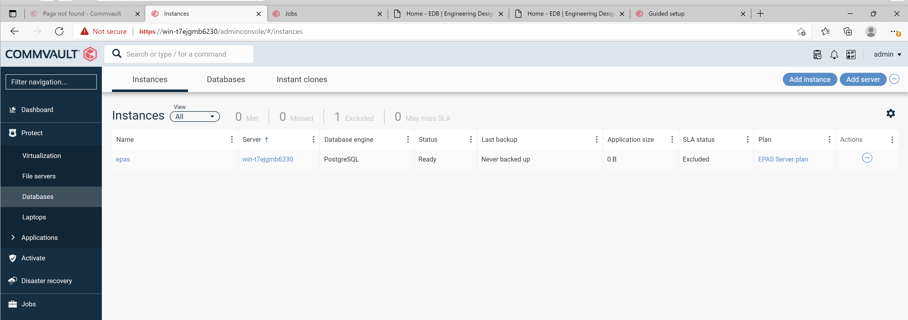

Implementing Commvault Backup & Recovery with EDB Postgres Advanced Server requires the following components:

- EDB Postgres Advanced Server
- Commvault Backup & Recovery software

## Prerequisites

- A running EDB Postgres Advanced Server instance.
- Commvault Backup & Recovery installed.
- EDB Postgres Advanced Server application path and library directory path (e.g. c:\Program Files\edb\as13\bin and c:\Program Files\edb\as13\lib).
- The login credentials used to access the EDB Postgres Advanced Server database.
- EDB Postgres Advanced Server archive log directory configured.

## Configure Commvault Backup & Recovery for EDB Postgres Advanced Server

### Core Setup Wizard
1. Run the Core Setup Wizard from Commvault Backup & Recovery's Command Centre from the Machine where Commvault Backup & Recovery is installed, the wizard helps to set up a disk storage pool and to modify the server backup plan according to your requirements.
2. Setup Storage Pool/Disk Storage: From the Welcome page, click Let's get started. On the Disk tab, in the Name box, enter a name for the storage pool.
3. In the MediaAgent box, accept the default value.
4. Click Local on the radio button for Type.
5. In the Backup location box, click Browse to assign a path where backups will be stored.
6. To enable deduplication on the storage, move the Use deduplication toggle key to  the right, and in the Deduplication DB location box, browse to select the path to  the deduplication database.
7. To move to the next setup option, click Save

  

8. Creating a Server Backup Plan in Core Setup: In the server backup plan, define where data is stored and how often to back up data.
9. In the Plan name box,type the name of the plan e.g EPAS Server Plan.
10. In the Backup destinations section, select the Storage and Retention Period.
11. In the RPO section, select the Backup frequency and Start time for the backup to start as per the backup frequency.

  

### Setup PostgreSQL Database Server
1. From the navigation pane, go to Protect > Databases.
2. Click Add server.
3. Select the database type which in this case is PostgreSQL.

  

4. In the Database server name box, enter the server name.
5. In the Username and Password boxes, enter the credentials to connect to the server.
6. From the Plan list, select the server plan to use for the database server.

  

7. Once server is added, then a Job will run to install client on the Server. Below screenshots display the entire process were a Job is created to install Client on the Server and then Dowloaded it and installed it.

  

  

  

  

### Setup EDB Postgres Advanced Server Instance
1. From the navigation pane, go to Protect > Databases > DB Instances.
2. Click Add instance, and then select PostgreSQL.

  

3. From the Server name list, select a server where you want to create the new instance.
4. In the Instance Name box, type the EDB Postgres Advanced Server instance name.
5. From the Plan list, select a server plan.
6. Under Connection details, enter the following information
   - In the Database user box, type the user name to access the EDB Postgres Advanced Server instance.
   - In the Password box, type the EDB Postgres Advanced Server user account password.
   - In the Port box, type the port to open the communication between EDB Postgres Advanced Server Server and the clients.
   - In the Maintenance DB box, type the name of a system database which is used as a maintenance database.
   - In PostgreSQL section enter paths for Binary Directory, Lib Directory and Archive Log Directory.

  

7. Your database instance to backup is now created. You can now view it's configuration.

  

  

