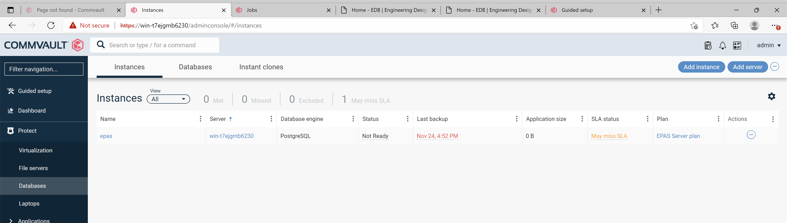
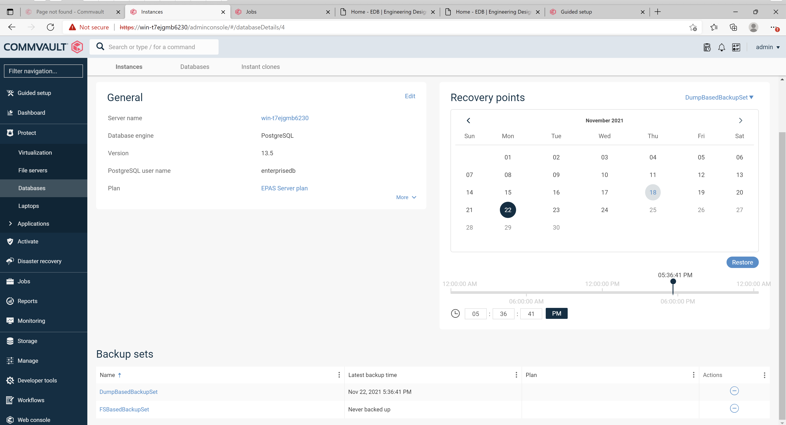
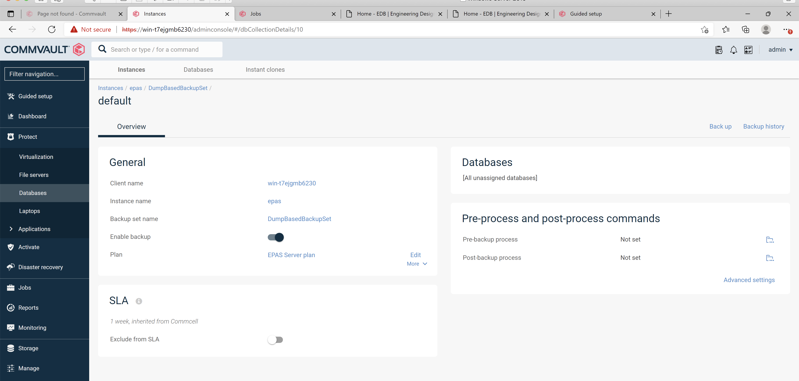
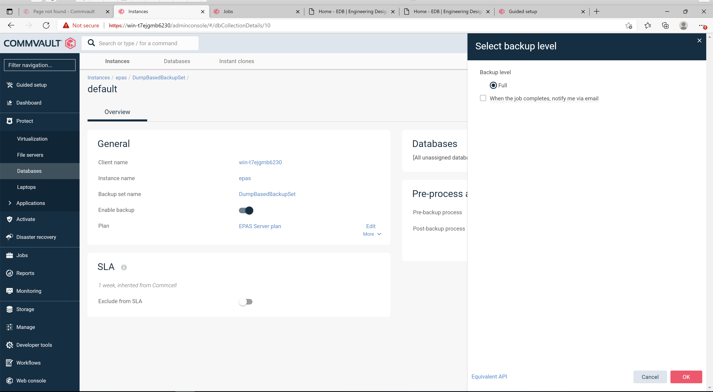
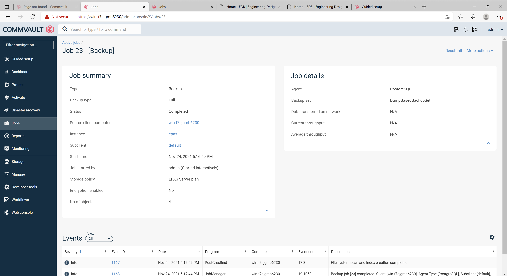
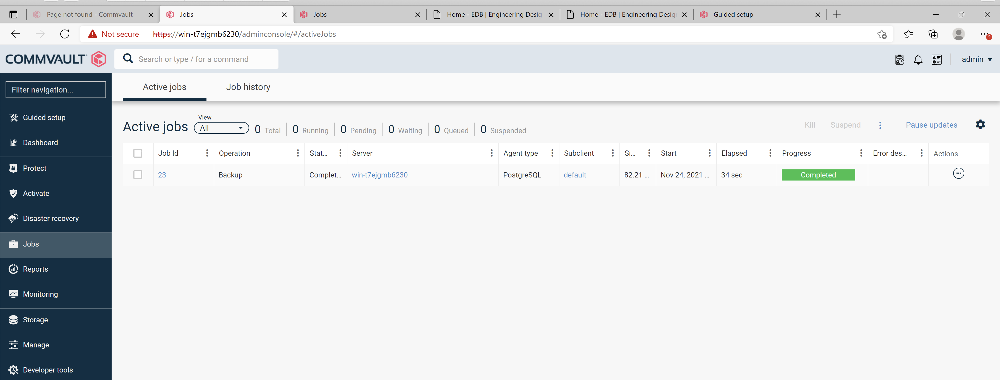
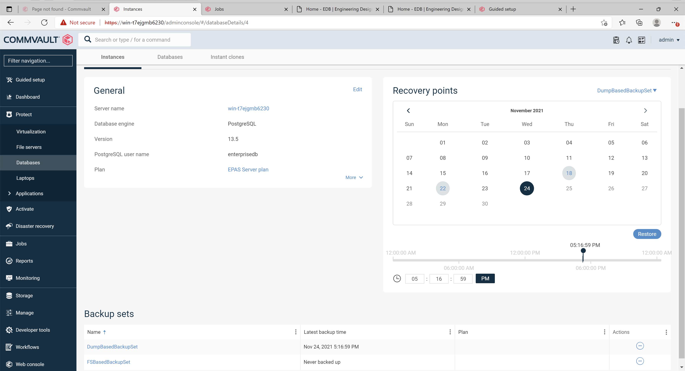
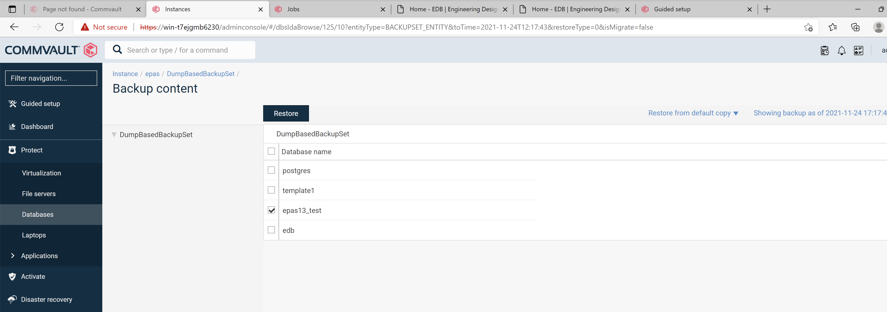
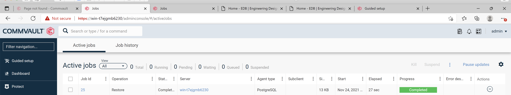
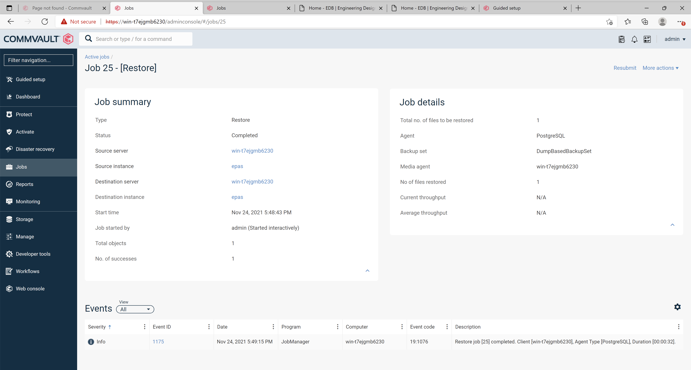

How to backups and restore from EDB Postgres Advanced Server using Commvault Backup & Recovery.

## Using Commvault Backup & Recovery

Commvault provides the two methods of taking the backup from EDB Postgres Advanced Server and restoring it.

1. DumpBasedBackupSet Backup and Restore
2. FSBasedBackupSet Backup and Restore

Following examples shows how to use both methods of taking and restoring the backups.

### DumpBasedBackupSet Backup and Restore

Dump based backup uses the pg_dump Utility to take the backup.

#### Taking DumpBasedBackupSet Backup 

1. Open Commvault Backup & Recovery's Command Centre and from the navigation pane, go to Protect > Databases.

<p align="center">
  
</p>

2. Click on the required instance.
3. In the Backup sets section, click on DumpBasedBackupSet backup set.

<p align="center">
  
</p>

4. In the Database groups section, click the database group that you want to back up. In this case its default.

<p align="center">
  
</p>

5. In the Backup section, click Back up now.

<p align="center">
  
</p>

6. Select Full in the Select Backup Level Screen.

<p align="center">
  
</p>

7. A Job will be created to take the backup.

<p align="center">
  
</p>

8. Once the Backup Job is completed then its status will be changed to Completed.

<p align="center">
  
</p>

#### Restoring DumpBasedBackupSet Backup 

DumpBased backupset can be used to restore the individual databases.

1. From the navigation pane, go to Protect > Databases.
2. Click the instance that you want to restore.
3. In the Recovery points calendar, select DumpBasedBackupSet.

<p align="center">
  
</p>

4. Select a date from the calendar, and then click Restore.
5. Backup Content Screen will display the databases to be restored, select the required database to restore or select all of them to restore all.

<p align="center">
  
</p>

6. Click Restore.
7. From Restore Options Screen, select the Destination Server and Destination Instance and click on submit.

<p align="center">
  
</p>

8. A Job will be created to restore the backup.

<p align="center">
  
</p>

<p align="center">
  
</p>

9. Once the Restore is completed successfully, login to the EDB Postgres Advanced Server Instance and check the restore operation recovered the data.

```bash
edb=#
edb=# \l
                                                           List of databases
    Name     |    Owner     | Encoding |          Collate           |           Ctype            | ICU |       Access privileges
-------------+--------------+----------+----------------------------+----------------------------+-----+-------------------------------
 edb         | enterprisedb | UTF8     | English_United States.1252 | English_United States.1252 |     |
 epas13_test | enterprisedb | UTF8     | English_United States.1252 | English_United States.1252 |     |
 postgres    | enterprisedb | UTF8     | English_United States.1252 | English_United States.1252 |     |
 template0   | enterprisedb | UTF8     | English_United States.1252 | English_United States.1252 |     | =c/enterprisedb              +
             |              |          |                            |                            |     | enterprisedb=CTc/enterprisedb
 template1   | enterprisedb | UTF8     | English_United States.1252 | English_United States.1252 |     | =c/enterprisedb              +
             |              |          |                            |                            |     | enterprisedb=CTc/enterprisedb
(5 rows)


edb=#
edb=# \c epas13_test
You are now connected to database "epas13_test" as user "enterprisedb".
epas13_test=# \dt
                List of relations
 Schema |       Name       | Type  |    Owner
--------+------------------+-------+--------------
 public | tp_department_db | table | enterprisedb
 public | tp_sales_db      | table | enterprisedb
(2 rows)


epas13_test=# select * from  tp_department_db;
 deptno |    dname    | location
--------+-------------+----------
     10 | Development | Pakistan
     20 | Testing     | Pakistan
     30 | CM          | Pakistan
     40 | Marketing   | India
(4 rows)


epas13_test=# select * from  tp_sales_db;
 salesman_id | salesman_name | sales_region | sales_amount | deptno
-------------+---------------+--------------+--------------+--------
         100 | Person 1      | CITY 1       |            1 |     10
         110 | Person 2      | CITY 2       |            2 |     20
         120 | Person 3      | CITY 3       |            3 |     30
         130 | Person 4      | CITY 4       |        10000 |     40
(4 rows)


epas13_test=# select * from v1;
 dept_no |  dept_name  | sales_no | sales_name | sales_salary | sales_dept_no
---------+-------------+----------+------------+--------------+---------------
      10 | Development |      100 | Person 1   |            1 |            10
      20 | Testing     |      110 | Person 2   |            2 |            20
      30 | CM          |      120 | Person 3   |            3 |            30
      40 | Marketing   |      130 | Person 4   |        10000 |            40
(4 rows)


epas13_test=# desc  tp_sales_db;
                                 Table "public.tp_sales_db"
    Column     |         Type          | Collation | Nullable |           Default
---------------+-----------------------+-----------+----------+------------------------------
 salesman_id   | integer               |           |          |
 salesman_name | character varying(30) |           |          |
 sales_region  | character varying(30) |           |          |
 sales_amount  | integer               |           |          | nextval('sal_seq'::regclass)
 deptno        | integer               |           |          |
Indexes:
    "lower_reg_idx" btree (lower(sales_region::text))
    "reg1_idx" btree (salesman_id)
Foreign-key constraints:
    "department_employee_fk" FOREIGN KEY (deptno) REFERENCES tp_department_db(deptno)


epas13_test=#
epas13_test=#

```

### FSBasedBackupSet Backup and Restore

At this time there is a known issue with FSBased Restore that does not allow for proper restoration of the database. See the known issues section of the guide for more information.

#### Known Issues:
1. FSBaseBadkupSet Restore has an issue if the *:\Program files\edb has been deleted, after the restore is done, the permissions on the restored directories are not recovered, and it instead inherits the permissions from the parent directory which does not allow EDB Postgres Advanced Server services to start on the restored directory. We are working with Commvault to resolve the issue.