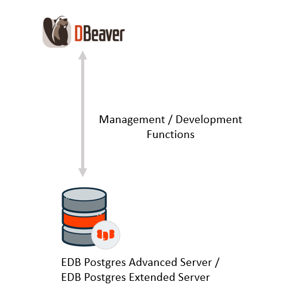

DBeaver provides deep integration with Postgres and Postgres-based databases such as EDB Postgres Advanced Server. With DBeaver, you can manipulate your data like in a regular spreadsheet, create analytical reports based on records from different data storages, export information in an appropriate format. DBeaver includes a SQL-editor, administration features, abilities of data and schema migration, monitoring database connection sessions, and other features. Besides the support of all Postgres data types in the DBeaver interface, there is also integration with native tools for backup and restore, session, locks and permission managers, and execution plan visualization.

  

