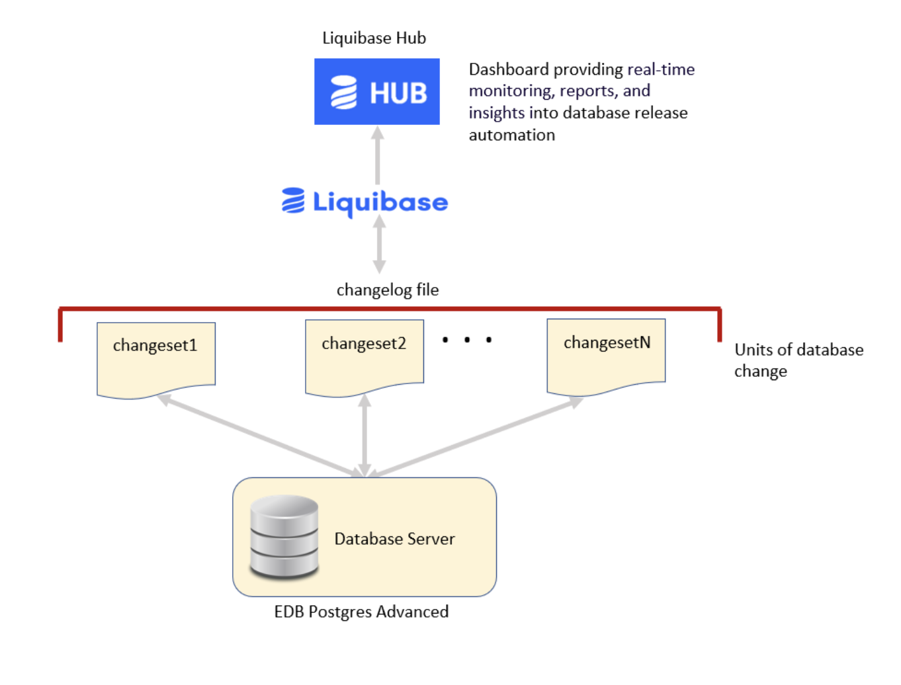

Easily track, version, and deploy EDB Postgres Advanced schema changes with Liquibase. Liquibase enables your team to deploy safer, faster, automated database releases across all your environments. Liquibase integrates with most application build and deployment tools to help track, version, and deploy EDB Postgres Advanced database changes.

The desired changes are applied on EDB Postgres Advanced using Liquibase changesets. The details of the changes can be stored on the Liquibase Hub to provide analysis of the changes.

  

