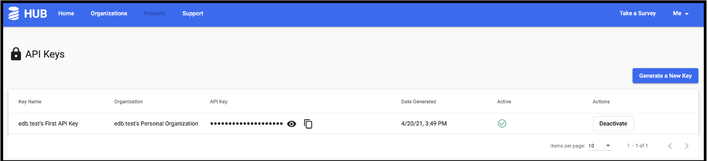

Implementing Liquibase  with EDB Postgres Advanced requires the following components:

- EDB Postgres Advanced
- Liquibase software

## Prerequisites

- A running EDB Postgres Advanced (EPAS) instance
- User account created on Liquibase Hub
- Liquibase Pro (CLI) installed

## Configure Liquibase for EDB Postgres Advanced

1. Download the postgresql JAR from https://jdbc.postgresql.org/download.html.
2. Move the postgresql JAR to the Liquibase Pro directory.
3. Log in to your Liquibase Hub account and select the **Settings** icon on the left side of the page to access the API key.
4. Copy the API key, which connects the information generated by your changelogs and other operations to your Liquibase Hub projects.

  

5. Create a liquibase.properties file in the Liquibase Pro directory to contain:

   - Driver class path

   - Database connection string

   - User authentication information for the database you want to capture

   - Liquibase Pro license key

   - Liquibase Hub API key

See a sample [liquibase.properties](07-Appendix.mdx) file in the appendix for configuring Liquibase for EDB Postgres Advanced.