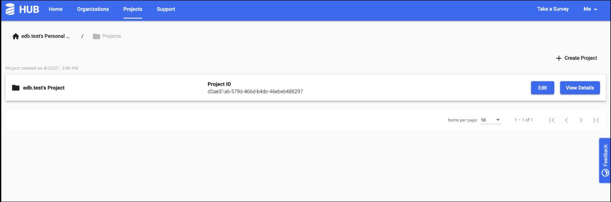
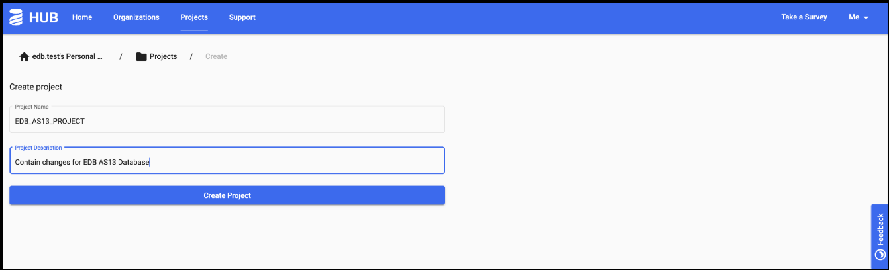
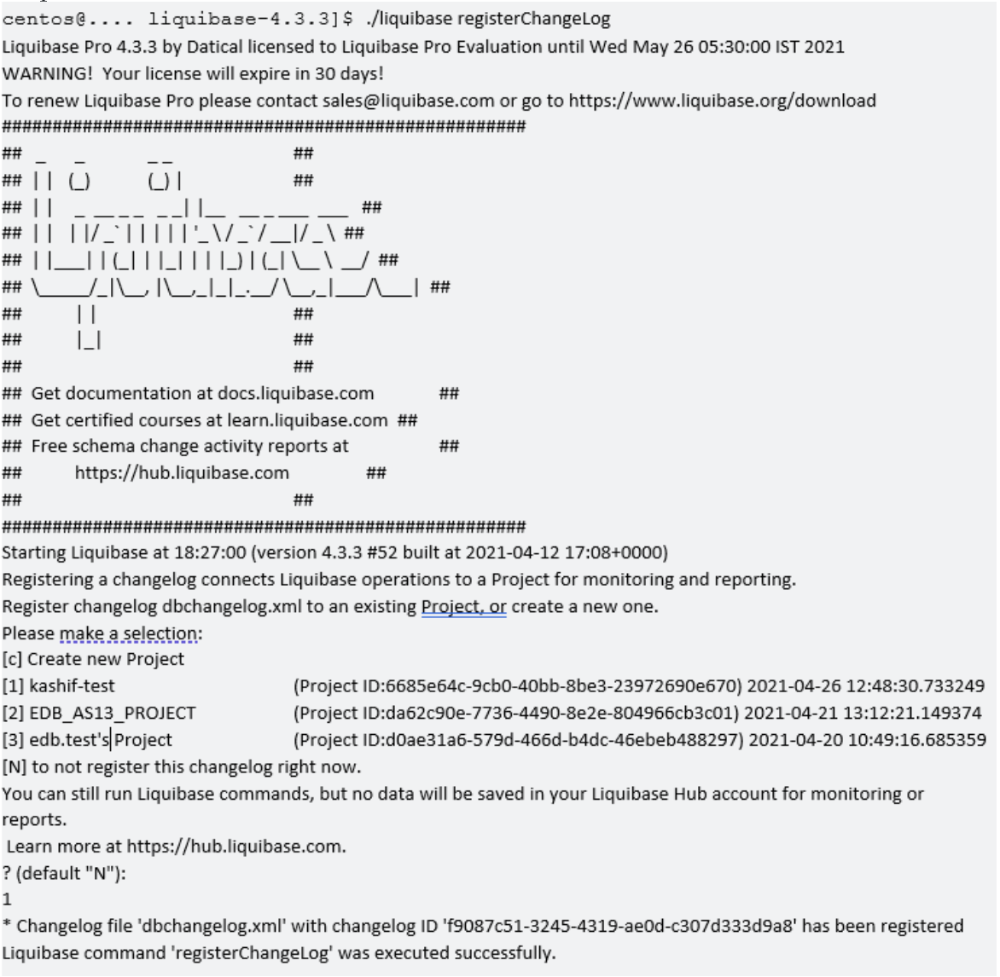
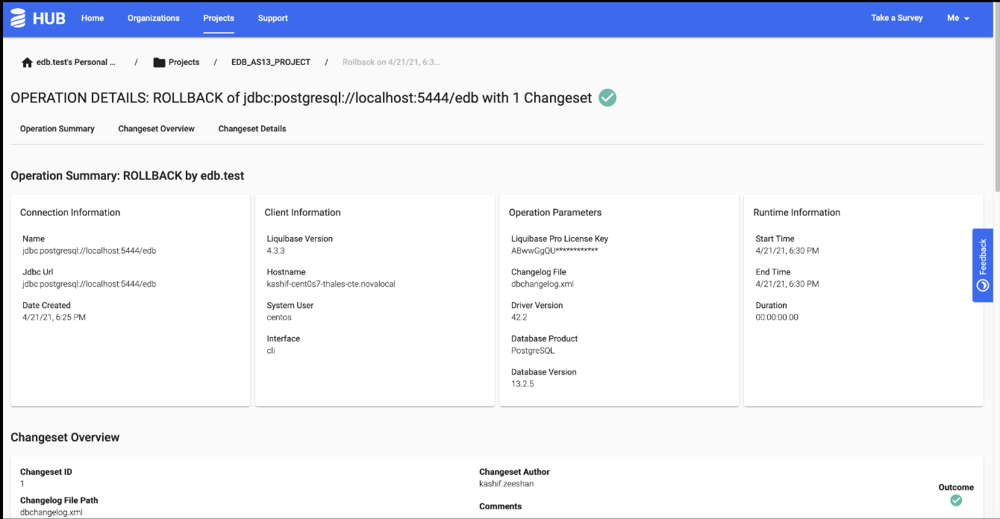
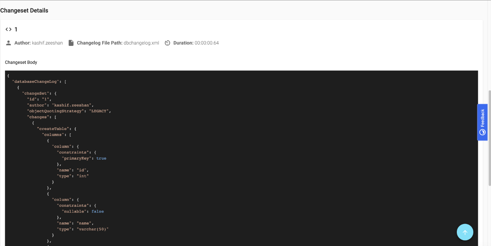

This section shows how database changes are applied on EDB Postgres Advanced using the Liquibase CLI and viewed on the Liquibase Hub.

### Creating a Project on Liquibase Hub

Use the following steps to create a project for the target database instance on the Liquibase Hub. All data related to the target database will be stored in this project.
    
1. Login to the Liquibase Hub console.

2. Select the `Projects` menu.

3. Create a Project on the Liquibase Hub by clicking on the `Create Project` button.


The diagram below shows the `Projects` page.

<p align="center">
  
</p>


4. On the `Create Project` page, enter the name and description of the project.

5. Click on the `Create Project` button.

The diagram below shows the `Create Project` screen.

<p align="center">
  
</p>

### Applying Database Changes

This section provides the following examples of applying database change using Liquibase changesets:

- Updating tables

- Rolling back changes


Refer to the [Liquibase documentation](https://docs.liquibase.com/change-types/home.html) for available change types.

!!! Note
    All Liquibase commands in the examples are executed from the directory where Liquibase Pro is installed.

The initial database objects and data for these examples are created using the sample script below:

```bash
CREATE SEQUENCE sal_seq MINVALUE 1 START WITH 1 INCREMENT BY 1 NOCACHE;

CREATE TABLE tp_sales_db (
salesman_id INT4,
salesman_name VARCHAR2(30),
sales_region VARCHAR2(30),
sales_amount INT4 DEFAULT sal_seq.nextval,
deptno INT4
);

CREATE TABLE tp_department_db
(
deptno INT4 Primary Key,
dname VARCHAR(50),
location VARCHAR(100)
);
INSERT INTO tp_sales_db VALUES (100,&#39;Person 1&#39;,&#39;CITY 1&#39;,DEFAULT,10);
INSERT INTO tp_department_db VALUES (10,&#39;Development&#39;,&#39;Pakistan&#39;);
```

#### Updating Tables 
1. Create a changelog file. See sample changelog file below for the example shown in the guide. For detailed information on changelogs, refer to the [changelog documentation](https://docs.liquibase.com/concepts/basic/xml-format.html) from Liquibase.

```bash
xml version="1.0" encoding="UTF-8"?>
  <databaseChangeLog
      xmlns="http://www.liquibase.org/xml/ns/dbchangelog"
      xmlns:xsi="http://www.w3.org/2001/XMLSchema-instance"
      xmlns:pro="http://www.liquibase.org/xml/ns/pro"
      xsi:schemaLocation="http://www.liquibase.org/xml/ns/dbchangelog
http://www.liquibase.org/xml/ns/dbchangelog/dbchangelog-4.2.xsd
http://www.liquibase.org/xml/ns/pro
http://www.liquibase.org/xml/ns/pro/liquibase-pro-4.2.xsd " changeLogId="9e43abe4-
4a9b-4d38-a485-c68af935bc44">
<changeSet author="kashif" id="100">
  <insert catalogName="edb"
    dbms="postgresql"
    schemaName="public"
    tableName="tp_department_db">
  <column name="deptno" value="20"/>
  <column name="dname" value="QMG"/>
  <column name="location" value="India"/>
  </insert>
  <insert catalogName="edb"
    dbms="postgresql"
    schemaName="public"
    tableName="tp_department_db">
  <column name="deptno" value="30"/>
  <column name="dname" value="CM"/>
  <column name="location" value="Pakistan"/>
  </insert>
  <update catalogName="edb"
  schemaName="public"
  tableName="tp_department_db">
  <column name="dname" value="UPDATED NAME...."/>
  <where>deptno=30</where>
  </update>
  <delete catalogName="edb"
    chemaName="public"
    tableName="tp_department_db">
  <where>deptno=10</where>
  </delete>
<rollback>
DELETE FROM public.tp_department_db WHERE deptno=20;
DELETE FROM public.tp_department_db WHERE deptno=30;
INSERT INTO public.tp_department_db (deptno, dname, location) VALUES ('10',
'Development', 'Pakistan');
</rollback>
</changeSet>
</databaseChangeLog>
```

You can also generate a changelog file using the following command: `./liquibase --changeLogFile=edb_dbchangelog.xml generateChangeLog`

!!! Note
    Before the command is run Liquibase will take a snapshot of the database, which is an essential step in the process.

2. For each database change desired, a changeset entry is added to the changelog file. For detailed information on changesets, refer to the [changeset documentation](https://docs.liquibase.com/concepts/basic/changeset.html?__hstc=128893969.8ca9a9f8d7d5d8d684aac6cd417ffd04.1625139651397.1625246103494.1625257119630.4&amp;__hssc=128893969.1.1625257119630&amp;__hsfp=3718144884&amp;_ga=2.245054725.1619392786.1625139438-28195040.1625139438&amp;_gac=1.123026681.1625233402.Cj0KCQjw8vqGBhC_ARIsADMSd1AVyJsGu4_9-E-Pvh8OdNFqVt5qHR8FHhUyvRnYbA2ODKYlPHr3ujcaAijVEALw_wcB) from Liquibase.

3. Execute the command below to register the changelog with the Liquibase Hub and provide the project name when prompted: `./liquibase registerChangeLog`

Sample output shown below:

<p align="center">
  
</p>

4. Update table in the target database: `./liquibase update`

#### Rolling Back Changes

1. Roll back changes made to the table using the sample changelog file shown earlier: `./liquibase rollbackCount 1`

#### Viewing Database Changes On Liquibase Hub

To view the details of the changes made on the target database, click on a ChangeLog link and its details will be displayed below.

<p align="center">
  
</p>

The diagram below shows the details for the selected changeset.

<p align="center">
  
</p>