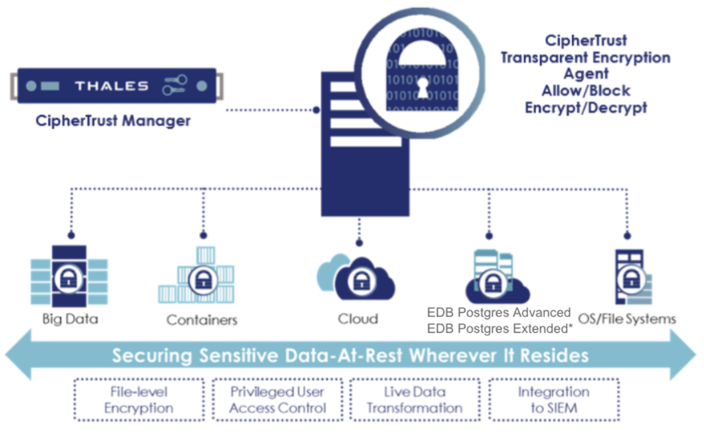

Thales’ CipherTrust Transparent Encryption secures data at-rest for Postgres databases and backups
with file system-level encryption backed by centralized key management, privileged user access controls, and
detailed data access audit logging. CipherTrust Transparent Encryption allows customers to adopt Postgres
for highly-sensitive and regulated data both on-premises and in the cloud while also meeting their compliance
obligations. CipherTrust Transparent Encryption has been certified with EDB Postgres Advanced Server,
and with EDB Postgres Extended Server as part of a BDR (bi-directional replication) cluster, and with Barman.

  

!!! Note
    EDB Postgres Extended Server represents EDB Postgres Extended Server* with BDR (Bi-Directional Replication) and Barman.
