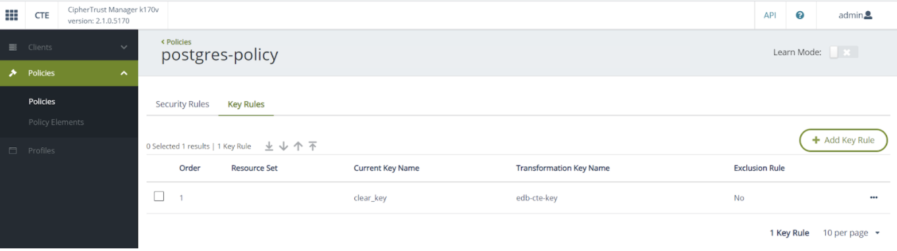
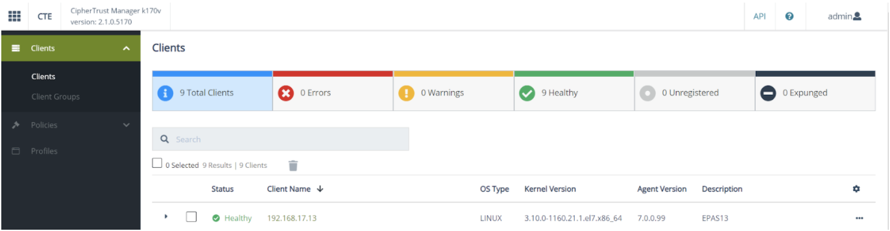

**Implementing the CipherTrust Transparent Encryption (CTE) solution requires the following components:**

  - Postgres server installed and operational.
  - CipherTrust Manager installed and operational.
  - A CTE agent installed on the Postgres host registered to the CipherTrust Manager.


**The following diagram shows the basic flow of the CTE solution:**

<p align="center">
  
</p>

### 3.1 Prerequisites
#### Postgres Host
1. Ensure that the Postgres server is installed and running.

2. For CentOS 7, you need to install the following repository:

```bash
sudo yum install -y lsof
```

#### CipherTrust Manager
1. Ensure CipherTrust Manager is installed and running.

<p align="center">
  
</p>

### 3.2 Configuring CipherTrust Manager
Logon to the CipherTrust Manager (CM) Web GUI and perform the following steps:

1. Create a registration token.

  a. Navigate to **Key and Access Management** and select **Registration Tokens**. This token is used for the CTE agent enrollment to CM. 

  b. Select **New Registration Token** to create a new registration token. 
  

The following screenshot shows a registration token created with the name **edb**.


<p align="center">
  
</p>

2. Create user sets.

  a. Navigate to CTE and select Policies, Policy Elements and then User Sets. 

  b. Select Create User Set to create a new user set. 
    
Create the Postgres, EnterpriseDB and Barman user sets as shown in the following screenshots.


<p align="center">
  
</p>
<p align="center">
  
</p>
<p align="center">
  
</p>

3. **Create Policies**

    a. Navigate back to **Policies** and select **Create Policy**.

    
**The following screenshots show Live Data Transformation (LDT) policies postgres-policy, epas-policy and barman-policy.**


<p align="center">
  
</p>
<p align="center">
  
</p>
<p align="center">
  
</p>

!!! Note
    The policies include the User Sets **Postgres** and **EnterpriseDB** respectively created in Step 2 and the same Key Rule for the policies:

<p align="center">
  
</p>

### 3.3 Installing CTE Agent

Refer to the following guides from Thales for installing the CTE agent on the Postgres host:

[CTE Agent Quick Start Guide](https://thalesdocs.com/ctp/cte/Books/Online-Files/7.0.0/CTE_Agent_Linux_Quick_Start_Guide_v7.0.0_Doc_v1.pdf)

[*CTE Agent Advanced Installation Guide*](https://thalesdocs.com/ctp/cte/Books/Online-Files/7.0.0/CTE_Agent_Linux_Adv_Config_Integration_Guide_v7.0.0_Doc_v6.pdf)

!!! Note
    You will need the Registration Token and host address of the CipherTrust Manager during the installation.

After the CTE agent is successfully installed, verify the Postgres host is registered with CM.
1. Log on to the CM Web GUI and navigate to **CTE**.
2. Select **Clients**. The client status should appear as **Healthy** as shown below (you may have to wait a few seconds for the status to get updated).

The following screenshot shows clients registered with the CipherTrust Manager.

<p align="center">
  
</p>
