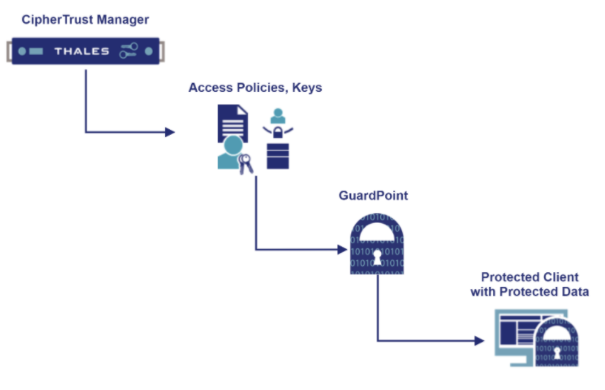
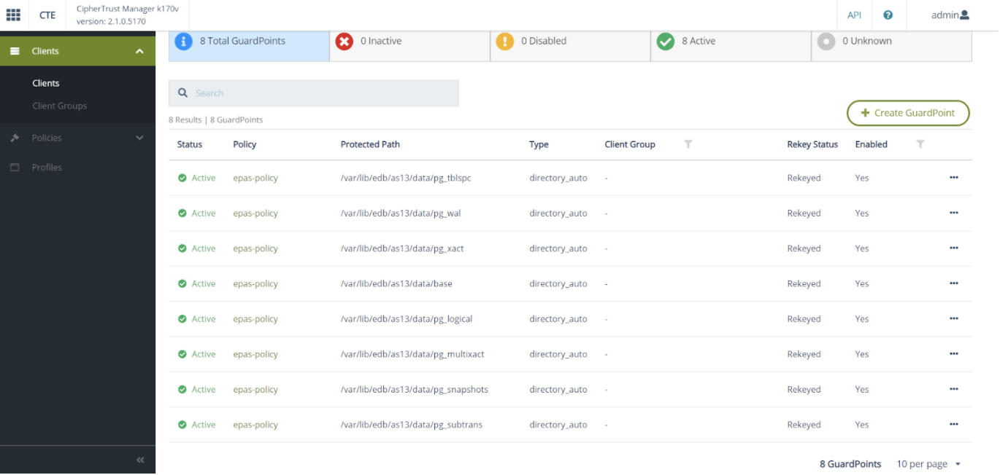
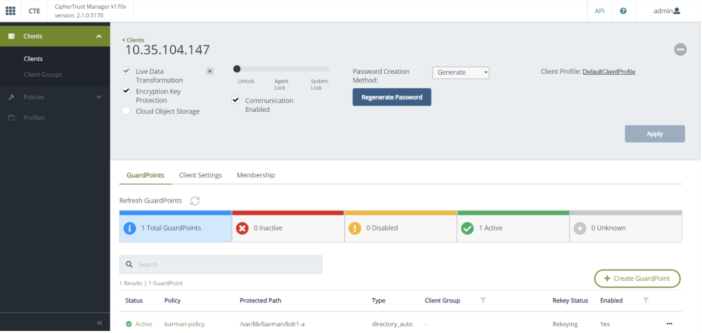

CTE protects data either at the file level or at the storage device level. A CTE Agent running on the (Postgres) host manages the files behind a GuardPoint by enforcing the policy associated with it, and communicates data access events to the CipherTrust Manager for logging. A GuardPoint is usually associated with a Linux mount point or a Windows volume, but may also be associated with a directory subtree.

**The following diagram shows the CTE architecture.**

  

### 4.1 Sample User Scenarios

This section describes sample user scenarios of deploying CTE solutions on EDB Postgres Advanced Server and EDB Postgres Extended with BDR hosts.
- **EDB Postgres Advanced Server**
- **EDB Postgres Extended with BDR**

**EDB Postgres Advanced Server (Single Instance)**

1. Install CTE agent on the Postgres host. 
2. Login to the Postgres host and stop the postgres server.
3. Create the GuardPoints via the CM Web GUI using the **epas-policy** Policy on the postgres host. Set the following directories as the **Protected Path** on the EDB Postgres Advanced Server host (assuming PGDATA is set /var/lib/edb/as13/data on the host):

  

4. Restart the Postgres server on the Postgres host as the user **enterprisedb**.  Make sure you are logged in using ssh (not sudo).

**EDB Postgres Extended with BDR-Always-ON**

The following diagram shows the BDR-Always-ON architecture. For more details, refer to the [BDR-Always-ON Architecture](https://documentation.2ndquadrant.com/tpa/release/21.1-1/architecture-BDR-Always-ON/) documentation.
 
!!! Note
    The documentation requires EDB access credentials.

  

1. Install CTE agents on all the postgres and barman nodes.

2. Create a GuardPoint via the CM Web GUI using the `barman-policy` Policy on the directory  `/var/lib/barman/<server-name>`  on the barman node in data center A (DC A). The following screenshot shows a GuardPoint created for the barman node.

  

3. Login to the Standby node in data center A and stop the postgres server.

4. Create a GuardPoint on the Standby node via the CM Web GUI using the postgres-policy Policy on the PGDATA directory `/opt/postgres/data`. 

5. Restart the Postgres server on the Standby node as the user **postgres**.  Make sure you are logged in using ssh (not sudo).

6. Login to the Shadow Master node in data center A and stop the postgres server.

7. Create a GuardPoint on the Shadow Master node via the CM Web GUI using the postgres-policy Policy on the PGDATA directory `/opt/postgres/data`. 

8. Restart the Postgres server on the Shadow Master node as the user **postgres**.  Make sure you are logged in using ssh (not sudo).

9. Login to the Lead Master node in data center A and stop the postgres server.

10. Create a GuardPoint on the Lead Master node via the CM Web GUI using the `postgres-policy` Policy on the PGDATA directory `/opt/postgres/data`. 

11. Restart the Postgres server on the Lead Master node as the user `postgres`.  Make sure you are logged in using ssh (not sudo).

The following screenshot shows a GuardPoint created for Lead Master in data center A.

  

12. Repeat steps 2 through 11 for postgres and barman nodes in data center B (DC B).
