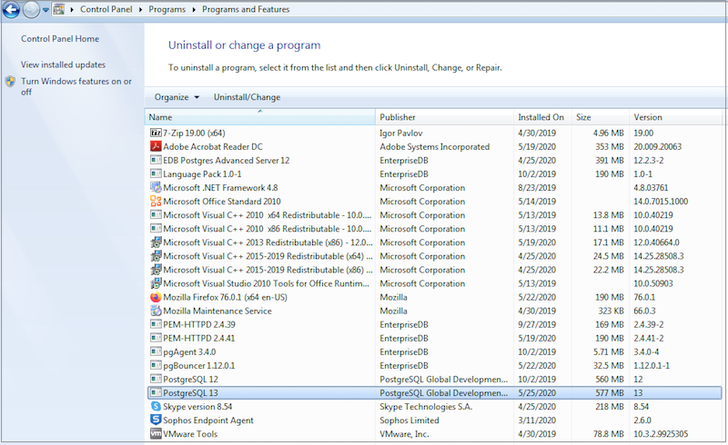
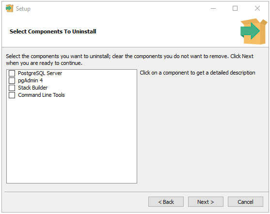

The PostgreSQL installer creates an uninstaller in the PostgreSQL installation directory.

## Uninstalling PostgreSQL on a Windows System

You can use the graphical interface provided by Windows to uninstall PostgreSQL. Navigate through the Windows `Control Panel` to open the Windows `Uninstall or change a program` dialog.

Right click on `PostgreSQL 13`, and select `Uninstall/Change` from the context menu.

If you wish to remove the `Entire application`, click `Next` to continue. If you choose to remove `Individual components`, a selection screen opens, allowing you to select which components you wish to uninstall.

Select the components you wish to uninstall, and click `Next` to start uninstalling components.

A progress bar will keep you informed as PostgreSQL is removed.

When the uninstaller completes, an `Info` dialog opens to confirm. Click `OK` to exit.

## Uninstalling PostgreSQL on a Mac System

To uninstall PostgreSQL on a Mac system, assume the identity of an operating system superuser, and navigate into the folder in which the uninstaller resides:

> `/Library/PostgreSQL/13`

Then, invoke the uninstaller with the command:

> `open uninstall-postgres.app`

If prompted, provide a password that allows the uninstaller to make changes to your system. The uninstaller will open, asking you if you wish to uninstall the `Entire application` or `Individual components`.

If you wish to remove the `Entire application`, click `Next` to continue. If you choose to remove `Individual components`, a selection screen opens, allowing you to select which components you wish to uninstall.

Select the components you wish to uninstall, and click `Next` to start uninstalling components. Progress bars are displayed as each component is removed; an `Info` popup informs you when the uninstallation is complete.

Click `OK` to exit the uninstaller.
