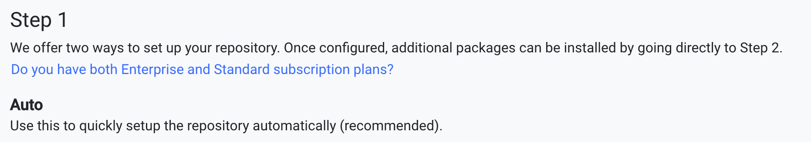

You can add your repository using the web interface. (Alternatively, you can add the repository using the command line. See [Getting started using the CLE](../with_cli/).)

1. Go to [https://www.enterprisedb.com/repos-downloads](https://www.enterprisedb.com/repos-downloads).

1. If you're not already logged in, log in to your EDB account. Go to the Account Profile page. On the Account Profile page, select **Repo Access**.

1. Select **Access Repos 2.0**.

1. On the next page, select the platform you want to download packages to.

1. From the list of EDB software on the left side, select the software you want to add.

    On the right side, instructions to install that software appear.

    

1. Go to **Step 1** and copy the Auto command. This is a ready-to-run repository installer for your system. Run alone, it installs only the EDB repositories for Repos 2.0. EDB's website has already personalized the command by embedding your Repos token into the command, so you can run it as is.

1. Paste the command into your terminal.

    Once the operation is complete, your system can download packages from EDB.

!!! Note 
    If you have any issues, see [Troubleshooting](../troubleshooting). 
