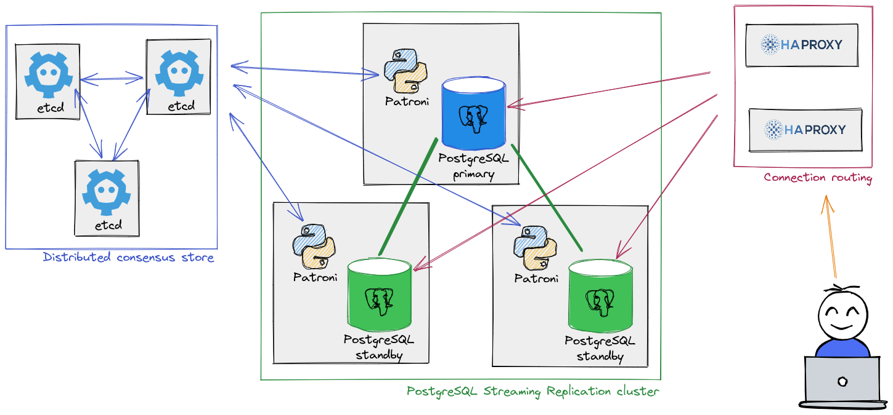

### Description

Main HA components:
* Postgres cluster: the database cluster, usually consisting of a primary and two or more replicas
* Patroni: used as the failover management utility
* etcd: used as a distributed configuration store (DCS), containing cluster information such as configuration, health, and current status

#### Postgres

EDB currently only supports using Patroni and Postgres _Streaming Replication_ (physical) with a primary server and two or more replicas.

#### Patroni

Patroni is installed on the Postgres nodes. EDB supports the [latest release](https://patroni.readthedocs.io/en/latest/releases.html#releases).

#### Etcd

Etcd is a strongly consistent, distributed key-value store that provides a reliable way to store data that needs to be accessed by a distributed system or cluster of machines.

Head over to [https://etcd.io](https://etcd.io/docs/) documentation for more information.

!!! Note
  For production environments, it is recommended to setup a three nodes cluster. One etcd cluster can serve multiple Postgres/Patroni clusters.

See the [Etcd installation guide](98-etcd/) to install and setup etcd.

#### Watchdog

To avoid split-brain situations, Patroni supports [watchdog](https://patroni.readthedocs.io/en/latest/watchdog.html) devices.

> Watchdog devices are software or hardware mechanisms that will reset the whole system when they do not get a keepalive heartbeat within a specified timeframe. This adds an additional layer of fail safe in case usual Patroni split-brain protection mechanisms fail.

!!! Note
  While the use of a watchdog mechanism with Patroni is optional, it is recommended to use it for production environments.

### HAProxy

Instead of connecting directly to the database server, it is possible to setup HAProxy so the application will be connecting to the proxy instead, which will then forward the request to Postgres. When HAProxy is used for this, it is also possible to route read-only requests to one or more replicas, for load balancing.

HAProxy can be installed as an independent server but it can also be installed on the application server or the database server itself.

!!! Note
  For production environments, it is recommended to setup at least two HAProxy servers. Using various ports, one HAProxy server can serve multiple Postgres/Patroni clusters.

### Security considerations

Security considerations are beyond the scope of this documentation but more details about the distributed configuration storage (DCS) and the Patroni REST API can be found in the [patroni official documentation](https://patroni.readthedocs.io/en/latest/security.html).

HTTPS can also be used with HAProxy while not covered in this guide.
