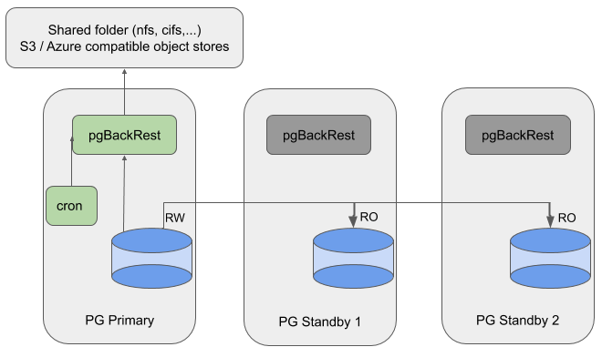

### Description

* pgBackRest runs locally on database servers and stores repository on remote storage (NFS, S3, Azure or GCS compatible object stores).
* Cron task active on the node where to take backups.
* Manually reconfigure cron task to take backup from another server.



---

### Configuration

#### Global Section

The `[global]` section will contain the:
* repository location;
* recommended settings;
* retention policy.

This section's settings should be the same for all the nodes (primary and standbys).

##### Mount Points

Set `repo1-type` to **posix** or **cifs** and specify the `repo1-path` location to store backups and archives on a shared space:

```ini
repo1-type=posix
repo1-path=/backup_space
```

##### S3-compatible Object Stores

```ini
repo1-type=s3
repo1-path=/repo1
repo1-s3-bucket=bucket-name
repo1-s3-endpoint=...
repo1-s3-key=accessKey1
repo1-s3-key-secret=***
repo1-s3-region=...
```

The backups and archives will be stored in `bucket-name/repo1`.

It is possible to automatically retrieve temporary credentials when the AWS instance is associated with an IAM role. Credentials are automatically updated when they are <= 5 minutes from expiring.

To do this, instead of setting `repo1-s3-key` and `repo1-s3-key-secret`, use:

```ini
repo1-s3-key-type=auto
repo1-s3-role=authrole
```

To automatically retrieve web identity credentials, set the `repo1-s3-key-type=web-id` option and define the `AWS_ROLE_ARN` and `AWS_WEB_IDENTITY_TOKEN_FILE` environment variables.

Set the `repo1-s3-kms-key-id` option to enable server-side encryption using the specified AWS key management service key.

##### Azure-compatible Object Stores

```ini
repo1-type=azure
repo1-azure-key-type=shared
repo1-path=/repo1
repo1-azure-container=container-name
repo1-azure-account=pgbackrest
repo1-azure-key=***
```

To use the shared access signatures, set the `repo1-azure-key-type` option to **sas** and the `repo1-azure-key` option to the shared access signature token.

##### GCS-compatible Object Stores

```ini
repo1-type=gcs
repo1-gcs-key-type=service
repo1-path=/repo1
repo1-gcs-bucket=bucket-name
repo1-gcs-key=/etc/pgbackrest/gcs-key.json
```

`repo1-gcs-key` is a **token** or **service** key file depending on the `repo1-gcs-key-type` option.

##### Recommended Settings

Use those settings to enable encryption, parallel operations and ensure displaying enough information in the console and in the log file:

```ini
repo1-cipher-type=aes-256-cbc
repo1-cipher-pass=FIXME
process-max=FIXME
log-level-console=info
log-level-file=debug
start-fast=y
delta=y
```

Adjust the encryption passphrase and the maximum number of processes to use for compression usage and file transfer.

See the [Recommended settings](04-recommended_settings) page for more details.

##### Retention Policy

To be able to delete old backups and archives, you have to define a retention policy. Use the following setting to only keep the latest full backup:

```ini
repo1-retention-full=1
```

See the [Retention policy](05-retention_policy) page for more options and details.

#### Stanza Section

The `[demo]` stanza section will be different on each database server and should contain:

* the location of the **PostgreSQL** configuration files

```ini
pg1-path=/var/lib/pgsql/13/data
```

or for **EDB Postgres Advanced Server**

```ini
pg1-path=/var/lib/edb/as13/data
pg1-user=enterprisedb
pg1-port=5444
```

* for every other **PostgreSQL** node

```ini
pg2-host=other_node_hostname_or_ip
pg2-path=/var/lib/pgsql/13/data
```

or for **EDB Postgres Advanced Server**

```ini
pg2-host=other_node_hostname_or_ip
pg2-host-user=enterprisedb
pg2-path=/var/lib/edb/as13/data
```

* specific recovery option to set the replication `primary_conninfo` after the restore command is executed:

```ini
recovery-option=primary_conninfo=host=primary_vip user=replication_user ...
```

#### Setup Archiving

Once pgBackRest is configured, set up the database archiver process on each node:

```ini
# postgresql.conf
archive_mode = on
archive_command = 'pgbackrest --stanza=demo archive-push %p'
```

As changing the `archive_mode` parameter requires a service restart, and changing the `archive_command` only requires a configuration reload, we recommend enabling `archive_mode` with an empty `archive_command` (or pointing to /bin/true) when initiating a new database cluster.

See the [Quick start](03-quick_start) page to set up a simple **demo** stanza configuration.

Assume the identity of the system user (`postgres` or `enterprisedb`) and initiate the pgBackRest repository from the primary server:

```bash
$ pgbackrest --stanza=demo stanza-create
```

Check the configuration and the archiving process:

```bash
$ pgbackrest --stanza=demo check
```

### Backup and Restore

See the **Quick start** [backups](03-quick_start#backups) and [restore](03-quick_start#restore) sections for more details about those two commands.

### Glossary

#### pgBackRest

[`delta`](https://pgbackrest.org/configuration.html#section-general/option-delta)
[`log-level-console`](https://pgbackrest.org/configuration.html#section-log/option-log-level-console)
[`log-level-file`](https://pgbackrest.org/configuration.html#section-log/option-log-level-file)
[`pg-host-user`](https://pgbackrest.org/configuration.html#section-stanza/option-pg-host-user)
[`pg-host`](https://pgbackrest.org/configuration.html#section-stanza/option-pg-host)
[`pg-path`](https://pgbackrest.org/configuration.html#section-stanza/option-pg-path)
[`pg-port`](https://pgbackrest.org/configuration.html#section-stanza/option-pg-port)
[`pg-user`](https://pgbackrest.org/configuration.html#section-stanza/option-pg-user)
[`process-max`](https://pgbackrest.org/configuration.html#section-general/option-process-max)
[`recovery-option`](https://pgbackrest.org/configuration.html#section-restore/option-recovery-option)
[`repo-azure-account`](https://pgbackrest.org/configuration.html#section-repository/option-repo-azure-account)
[`repo-azure-container`](https://pgbackrest.org/configuration.html#section-repository/option-repo-azure-container)
[`repo-azure-key-type`](https://pgbackrest.org/configuration.html#section-repository/option-repo-azure-key-type)
[`repo-azure-key`](https://pgbackrest.org/configuration.html#section-repository/option-repo-azure-key)
[`repo-cipher-pass`](https://pgbackrest.org/configuration.html#section-repository/option-repo-cipher-pass)
[`repo-cipher-type`](https://pgbackrest.org/configuration.html#section-repository/option-repo-cipher-type)
[`repo-path`](https://pgbackrest.org/configuration.html#section-repository/option-repo-path)
[`repo-retention-full`](https://pgbackrest.org/configuration.html#section-repository/option-repo-retention-full)
[`repo-s3-bucket`](https://pgbackrest.org/configuration.html#section-repository/option-repo-s3-bucket)
[`repo-s3-endpoint`](https://pgbackrest.org/configuration.html#section-repository/option-repo-s3-endpoint)
[`repo-s3-key-secret`](https://pgbackrest.org/configuration.html#section-repository/option-repo-s3-key-secret)
[`repo-s3-key-type`](https://pgbackrest.org/configuration.html#section-repository/option-repo-s3-key-type)
[`repo-s3-key`](https://pgbackrest.org/configuration.html#section-repository/option-repo-s3-key)
[`repo-s3-kms-key-id`](https://pgbackrest.org/configuration.html#section-repository/option-repo-s3-kms-key-id)
[`repo-s3-region`](https://pgbackrest.org/configuration.html#section-repository/option-repo-s3-region)
[`repo-s3-role`](https://pgbackrest.org/configuration.html#section-repository/option-repo-s3-role)
[`repo-type`](https://pgbackrest.org/configuration.html#section-repository/option-repo-type)
[`start-fast`](https://pgbackrest.org/configuration.html#section-backup/option-start-fast)

#### PostgreSQL

[`archive_command`](https://www.postgresql.org/docs/current/runtime-config-wal.html#GUC-ARCHIVE-COMMAND)
[`archive_mode`](https://www.postgresql.org/docs/current/runtime-config-wal.html#GUC-ARCHIVE-MODE)
[`primary_conninfo`](https://www.postgresql.org/docs/current/runtime-config-replication.html#GUC-PRIMARY-CONNINFO)
