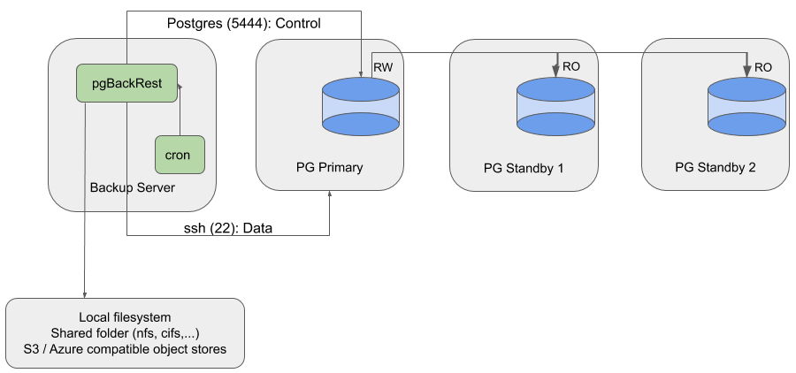

### Description

* pgBackRest runs on a dedicated backup server and stores repository on local or remote storage (NFS, S3, or Azure object stores).
* Cron task active to take backups from the primary database cluster.
* Manually reconfigure cron task to take backup from another server.



### Create a Dedicated User on the Repository Host

The `pgbackrest` user is created to own the backups and archives repository. Any user can own the repository, but it is recommended not to use `postgres` or `enterprisedb` to avoid confusion.

```bash
$ sudo groupadd pgbackrest
$ sudo adduser -g pgbackrest -n pgbackrest
$ sudo chown pgbackrest: /var/log/pgbackrest
```

### Setup Passwordless SSH Connection

pgBackRest requires a passwordless SSH connection to enable communication between the hosts.

The following example SSH commands should succeed without prompting you for a password:

```bash
# From the PostgreSQL nodes
$ sudo -u postgres ssh pgbackrest@backup-server

# From the EDB Postgres Advanced Server nodes
$ sudo -u enterprisedb ssh pgbackrest@backup-server

# From the repository host
$ sudo -u pgbackrest ssh postgres@postgres-node-1
$ sudo -u pgbackrest ssh postgres@postgres-node-2
$ ...
```

### Configuration

#### Backup Server

The repository should be reachable from the backup server. It can be located on the various supported types described in the [first use case](06-use_case_1#global-section).

For example, let us create `/backup_space` to store our backups and archives locally:

```bash
$ sudo mkdir /backup_space
$ sudo chown pgbackrest: /backup_space
```

The `[global]` section of the configuration file will look like this:

```ini
[global]
repo1-path=/backup_space
repo1-retention-full=2
repo1-cipher-type=aes-256-cbc
repo1-cipher-pass=FIXME
process-max=FIXME
log-level-console=info
log-level-file=debug
start-fast=y
delta=y
```

Adjust the encryption passphrase and the maximum number of processes to use for compression usage and file transfer.

See the [Recommended settings](05-retention_policy) pages for more details.

The `[demo]` stanza section will contain specific `pg-` options for each database node.

* the primary database server configuration for **PostgreSQL**

```ini
pg1-host=postgres-node-1
pg1-path=/var/lib/pgsql/13/data
```

or for **EDB Postgres Advanced Server**

```ini
pg1-host=postgres-node-1
pg1-host-user=enterprisedb
pg1-path=/var/lib/edb/as13/data
```

* for every other **PostgreSQL** node

```ini
pg2-host=other_node_hostname_or_ip
pg2-path=/var/lib/pgsql/13/data
```

or for **EDB Postgres Advanced Server**

```ini
pg2-host=other_node_hostname_or_ip
pg2-host-user=enterprisedb
pg2-path=/var/lib/edb/as13/data
```

Define multiple nodes using `pg2`, `pg3`,... to reach standby servers only when those servers are available.

#### Database server(s)

Update the pgBackRest configuration file on the database server(s):

```ini
# pgbackrest.conf
[global]
repo1-host=backup-server
repo1-host-user=pgbackrest
log-level-console=info
log-level-file=debug
delta=y

[demo]
pg1-path=/var/lib/pgsql/13/data
recovery-option=primary_conninfo=host=primary_vip user=replication_user ...
```

The `[demo]` stanza section will be different for **PostgreSQL** or for **EDB Postgres Advanced Server**, and the `recovery-option` is used to set the replication `primary_conninfo` after executing the restore command. For more details, please refer to the [Use case 1](06-use_case_1#stanza-section) page for more details.

#### Setup Archiving

Once pgBackRest is configured, set up the database archiver process on each node:

```ini
# postgresql.conf
archive_mode = on
archive_command = 'pgbackrest --stanza=demo archive-push %p'
```

As changing the `archive_mode` parameter requires a service restart, and changing the `archive_command` only requires a configuration reload, we recommend enabling `archive_mode` with an empty `archive_command` (or pointing to /bin/true) when initiating a new database cluster.

From the backup server (also called repository host), initiate the pgBackRest repository with the system user we created earlier:

```bash
$ sudo -u pgbackrest pgbackrest --stanza=demo stanza-create
```

Check the configuration and the archiving process:

```bash
$ sudo -u pgbackrest pgbackrest --stanza=demo check
```

### Backup and Restore

See the **Quick start** [backups](03-quick_start#backups) and [restore](03-quick_start#restore) sections for more details about those two commands.

The `backup` command will be executed on the repository host (aka. _backup-server_), while the `restore` command should be executed on database nodes (aka. _postgres-node-1_,...).

### Glossary

#### pgBackRest

[`delta`](https://pgbackrest.org/configuration.html#section-general/option-delta)
[`log-level-console`](https://pgbackrest.org/configuration.html#section-log/option-log-level-console)
[`log-level-file`](https://pgbackrest.org/configuration.html#section-log/option-log-level-file)
[`pg-host`](https://pgbackrest.org/configuration.html#section-stanza/option-pg-host)
[`pg-path`](https://pgbackrest.org/configuration.html#section-stanza/option-pg-path)
[`pg-port`](https://pgbackrest.org/configuration.html#section-stanza/option-pg-port)
[`pg-user`](https://pgbackrest.org/configuration.html#section-stanza/option-pg-user)
[`process-max`](https://pgbackrest.org/configuration.html#section-general/option-process-max)
[`recovery-option`](https://pgbackrest.org/configuration.html#section-restore/option-recovery-option)
[`repo-cipher-pass`](https://pgbackrest.org/configuration.html#section-repository/option-repo-cipher-pass)
[`repo-cipher-type`](https://pgbackrest.org/configuration.html#section-repository/option-repo-cipher-type)
[`repo-host`](https://pgbackrest.org/configuration.html#section-repository/option-repo-host)
[`repo-host-user`](https://pgbackrest.org/configuration.html#section-repository/option-repo-host-user)
[`repo-path`](https://pgbackrest.org/configuration.html#section-repository/option-repo-path)
[`repo-retention-full`](https://pgbackrest.org/configuration.html#section-repository/option-repo-retention-full)
[`start-fast`](https://pgbackrest.org/configuration.html#section-backup/option-start-fast)

#### PostgreSQL

[`archive_command`](https://www.postgresql.org/docs/current/runtime-config-wal.html#GUC-ARCHIVE-COMMAND)
[`archive_mode`](https://www.postgresql.org/docs/current/runtime-config-wal.html#GUC-ARCHIVE-MODE)
[`primary_conninfo`](https://www.postgresql.org/docs/current/runtime-config-replication.html#GUC-PRIMARY-CONNINFO)
