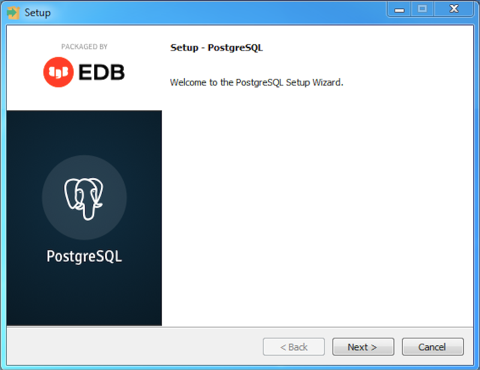
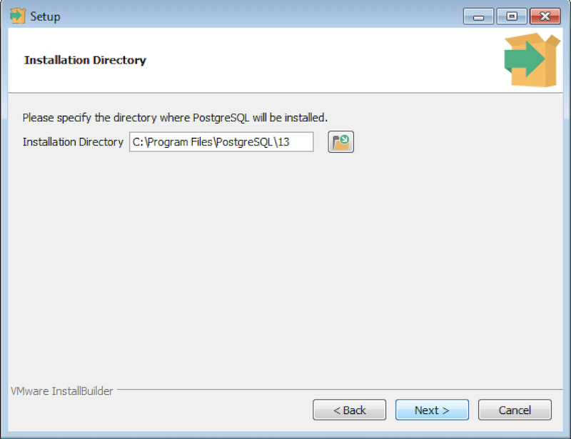
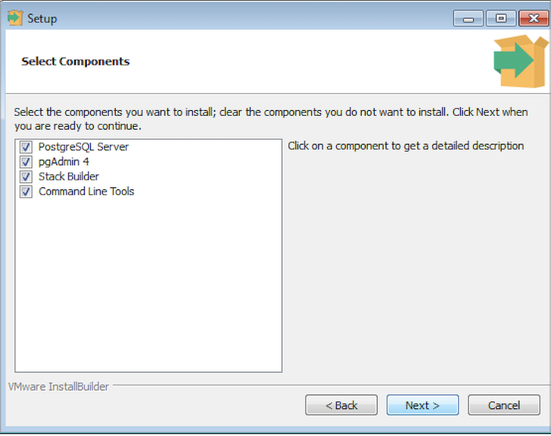
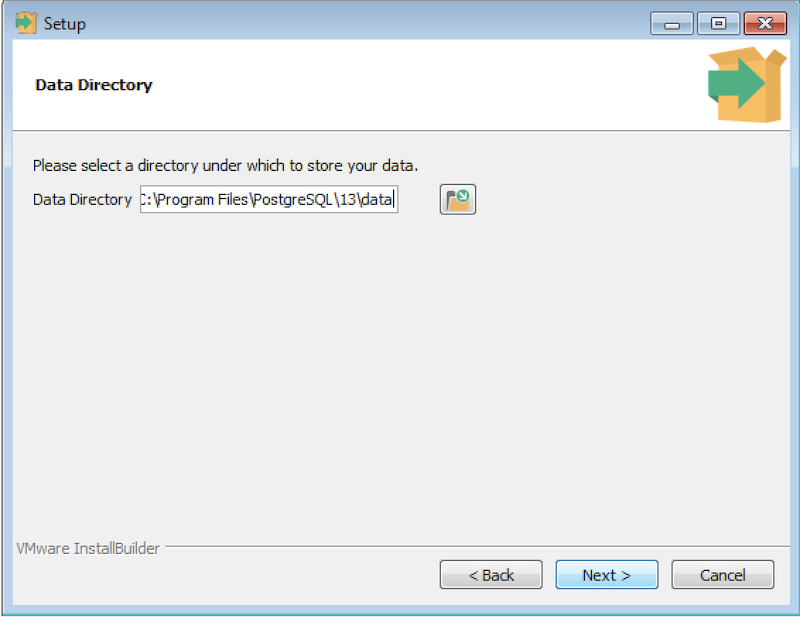
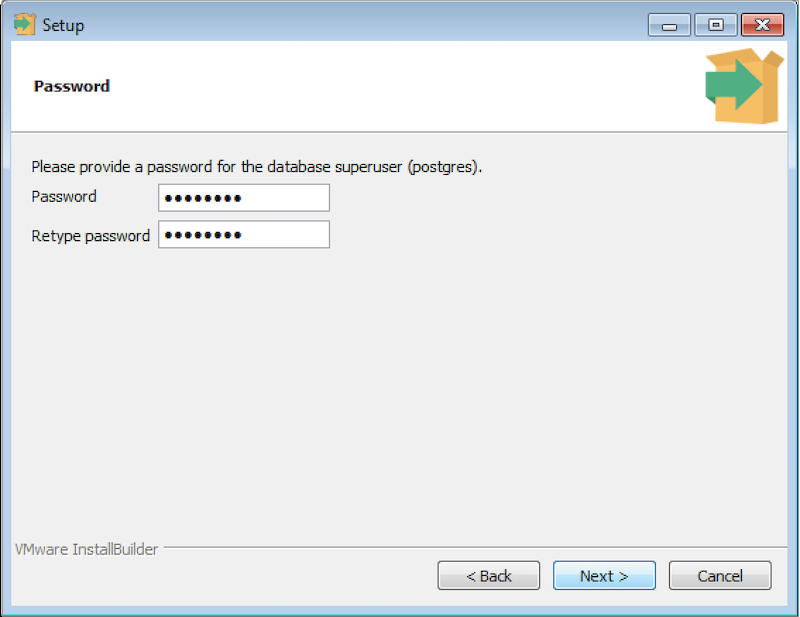
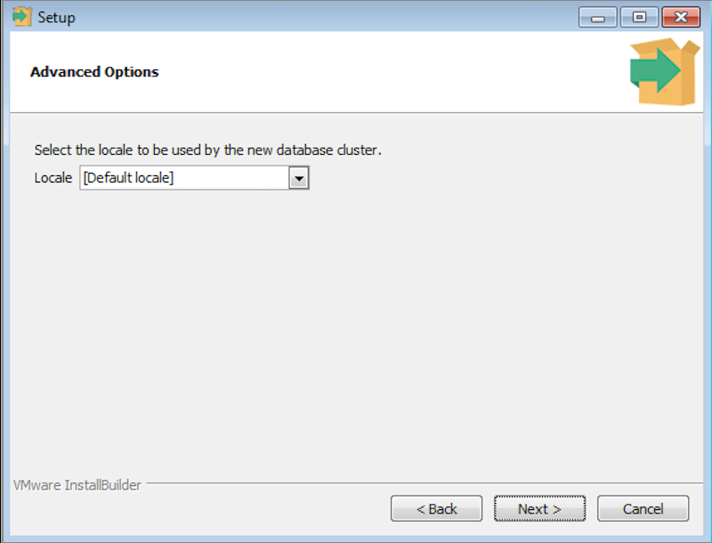
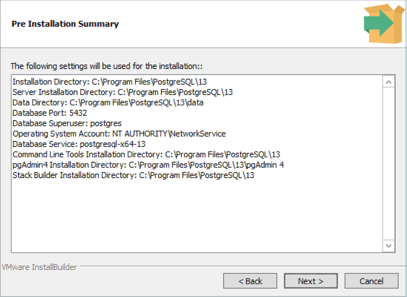
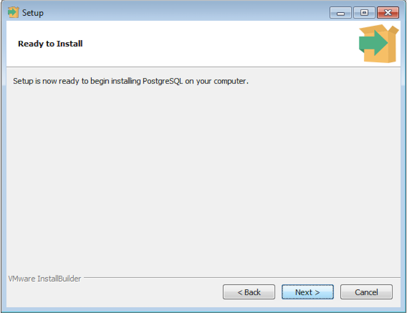
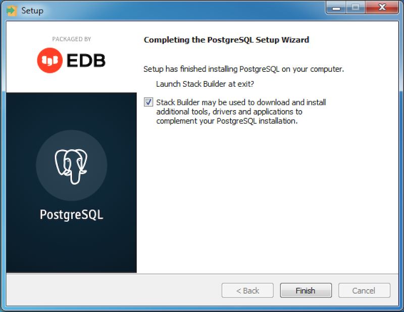

The following section describes how to use the graphical installation wizard to install PostgreSQL on Windows. For information about preparing to use command line tools after installation, see [Command line tools](#command-line-tools).

## Installing PostgreSQL

To perform an installation using the graphical installation wizard, you must have superuser or administrator privileges. To start the installation wizard, assume sufficient privileges and double-click the installer icon; if prompted, provide a password.

In some versions of Windows, to invoke the installer with Administrator privileges, you must right-click on the installer icon and select **Run as Administrator** from the context menu.

The PostgreSQL setup wizard opens. Select **Next** to continue.



Fig. 1: The PostgreSQL setup wizard welcome dialog box

The Installation Directory window opens. Accept the default installation directory, or specify an alternate location and select **Next** to continue.



Fig. 2: The Installation Directory dialog box

Use options on the Select Components dialog box to choose which software components are installed.

Select:

-   **PostgreSQL Server** to install the PostgreSQL database server.
-   **pgAdmin 4** to install pgAdmin 4. This option is available for PostgreSQL version 13.0 and later.
-   **Stack Builder** to install the Stack Builder utility; for more information, see [Using Stack Builder](../03_using_stackbuilder).
-   **Command Line Tools** to install PostgreSQL tools such as `psql`, `pg_isready`, and `pgbench`, `clusterdb`, `createdb`, and `dropdb`, `createuser` and `dropuser`, `pg_basebackup`, `pg_dump`, `pg_dumpall`, and `pg_restore`, `reindexdb`, `vacuumdb`, and `vacuumlo`. This is not a comprehensive list; the command line tools installed may vary by platform.



Fig. 3: Select Components

Select **Next** to continue.

The Data Directory window opens. Accept the default location or specify the name of the alternate directory where you want to store data files.



Fig. 4: The Data Directory dialog box

Select **Next** to continue.

The Password window opens.



Fig. 5: The Password dialog box

PostgreSQL uses the password specified on the Password window for both the database superuser and the PostgreSQL service account.

PostgreSQL runs as a service in the background; the PostgreSQL service account is named `postgres`. If you have already created a service account with the name `postgres`, you must specify the same password as the existing password for the `postgres` service account.

The specified password must conform to any security policies existing on the PostgreSQL host. After entering a password in the **Password** field, and confirming the password in the **Retype Password** field, select **Next** to continue.

The Port window opens.


Fig. 6: The Port dialog box

Use the **Port** field to specify the port number on which the server should listen. The default listener port is `5432`. Select **Next** to continue.

The Advanced Options window opens.



Fig. 7: The Advanced Options dialog box

Use the **Locale** field to specify the locale that will be used by the new database cluster. The **Default locale** is the operating system locale. Select **Next** to continue.

The Pre Installation Summary window opens.



Fig. 8: The Pre Installation Summary dialog box

The Pre Installation Summary dialog box displays the installation preferences that you have specified with the installation wizard. Review the settings; you can use the **Back** button to return to a previous dialog box to modify a setting, or select **Next** to continue.

The wizard informs you that it has the information required to install PostgreSQL; select **Next** to continue.



Fig. 9: The Ready to Install dialog box

During the installation, the setup wizard confirms the installation progress of PostgreSQL via a series of progress bars.


Fig. 10: The Installing dialog box

Before the setup wizard completes the PostgreSQL installation, it offers to launch Stack Builder at exit. The Stack Builder utility provides a graphical interface that downloads and installs applications and drivers that work with PostgreSQL. You can optionally uncheck the **Stack Builder** box and select **Finish** to complete the PostgreSQL installation or accept the default and launch Stack Builder.



Fig. 11: The installation wizard offers to Launch Stack Builder at exit

## Command line tools

By default, the installer does not modify the system path. If you want to use command line tools (such as `psql`), you can add PostgreSQL to the path after installation.

1.  Open the System Properties control panel and select the **Advanced** tab (or run `SystemPropertiesAdvanced.exe`).
2.  Select **Environment Variables** to open the environment variables editor.
3.  Find the `Path` variable under the **System variables** heading and select **Edit**.
4.  Add the path that you specified as the installation directory during installation, with `\bin` appended (by default: `c:\program files\postgresql\15\bin`, where `15` is the version of PostgreSQL that you installed).

To test your installation, open a new command prompt and run this command:

```shell
psql -U postgres
```

You are prompted for the password you provided during installation. 

For more information about the PostgreSQL interactive terminal `psql` [click here](http://postgresguide.com/utilities/psql.html).

