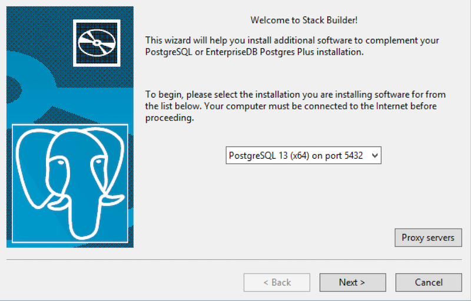
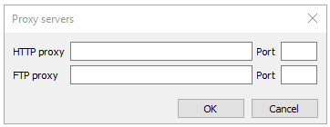
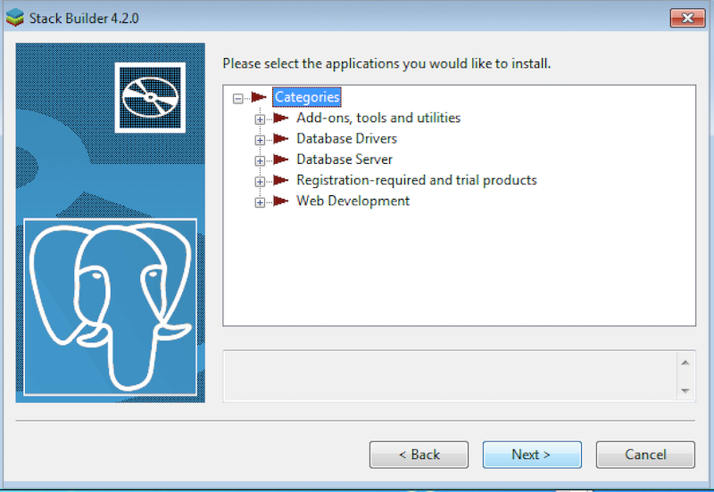
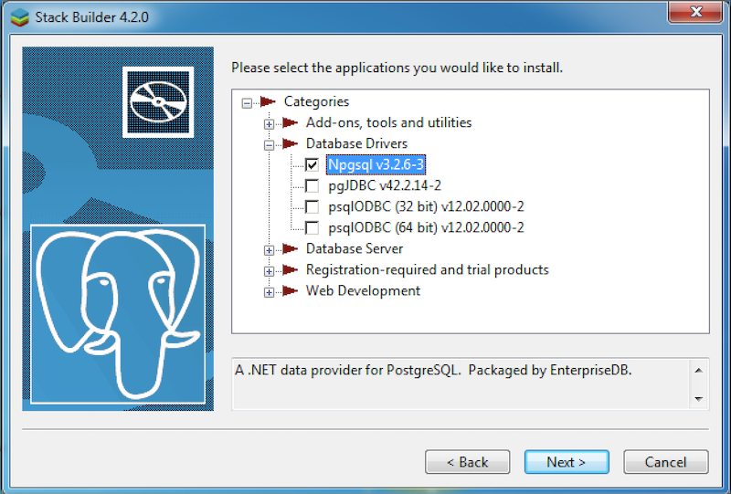
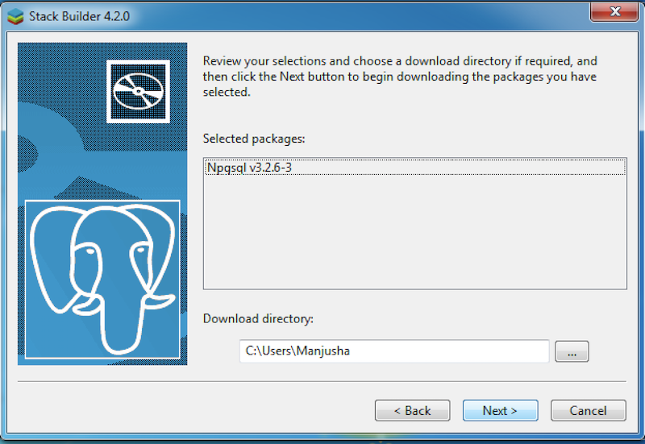
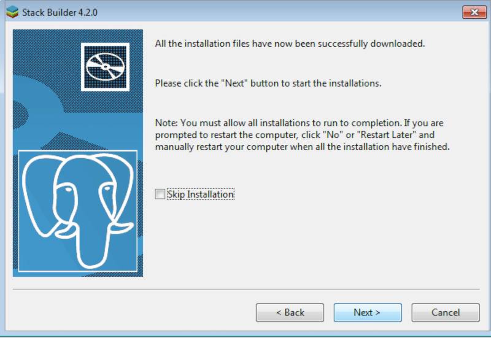

The Stack Builder utility provides a graphical interface that simplifies the process of downloading and installing modules that complement your PostgreSQL installation. When you install a module with Stack Builder, Stack Builder automatically resolves any software dependencies.

Stack Builder requires Internet access; if your installation of PostgreSQL resides behind a firewall (with restricted Internet access), Stack Builder can download program installers through a proxy server. The module provider determines if the module can be accessed through an HTTP proxy or an FTP proxy; currently, all updates are transferred via an HTTP proxy and the FTP proxy information is not used.

You can invoke Stack Builder at any time after the installation has completed by selecting the `Application Stack Builder` menu option from the `PostgreSQL 13` menu. Enter your system password (if prompted), and the Stack Builder welcome window opens.

Use the drop-down listbox on the welcome window to select your PostgreSQL installation.

Fig. 1: The Stack Builder welcome window

If the selected PostgreSQL installation has restricted Internet access, use the `Proxy Servers` button on the `Welcome` window to open the Proxy servers dialog.

Enter the IP address and port number of the proxy server in the `HTTP proxy` or `FTP proxy` fields on the Proxy servers dialog. Currently, all Stack Builder modules are distributed via HTTP proxy (FTP proxy information is ignored). Click `OK` to continue.

Fig. 2: The Proxy servers dialog

The tree control on the Stack Builder module selection window contains a node for each module category. Click on a category heading to expose the modules within that category.

Fig. 3: The Stack Builder module selection window

Each entry within the tree control is the name of a module that can be installed with Stack Builder.

-   If the module is installed, you will see the word (`installed`) to the right of the module name.
-   Boxes next to the modules that are already installed, but eligible for update are automatically checked.
-   To add new modules to the selected PostgreSQL installation, check the box to the left of the module name and click `Next`.

Fig. 4: Check the box to add new module

The `Selected packages` window confirms the packages selected.

Fig. 5: A summary window displays a list of selected packages

The package installers are downloaded to the directory specified in the `Download directory` field. Use the button to the right of the `Download directory` field to open a file selector, and choose an alternate location to store the downloaded installers.

Click `Next` to connect to the server and download the required installation files.

When the downloads complete, a window opens confirming that the installation files have been downloaded and are ready for installation.

Fig. 6: Confirmation that the download process is complete

You can check the box next to `Skip Installation` and select `Next` to exit Stack Builder without installing the downloaded files, or leave the box unchecked and click `Next` to start the installation process.

Each downloaded installer has different requirements. As the installers execute, they may prompt you to confirm acceptance of license agreements, to enter passwords, and enter configuration information.

During the installation process, you may be prompted by one (or more) of the installers to restart your system. Select `No` or `Restart Later` until all installations are completed. When the last installation has completed, re-boot the system to apply all of the updates.

You may occasionally encounter packages that don’t install successfully. If a package fails to install, Stack Builder will alert you to the installation error with a popup dialog, and write a message to the log file stored in `%TEMP%`.

When the installation is complete, the installer will alert you to the success or failure of the installations of the requested packages. If you were prompted by an installer to restart your computer, re-boot now.

!!! Note
    The modules supported by Stack Builder are subject to change and vary by platform.
