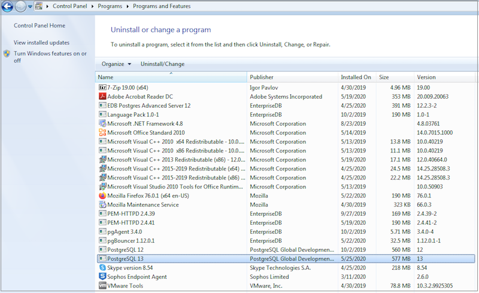
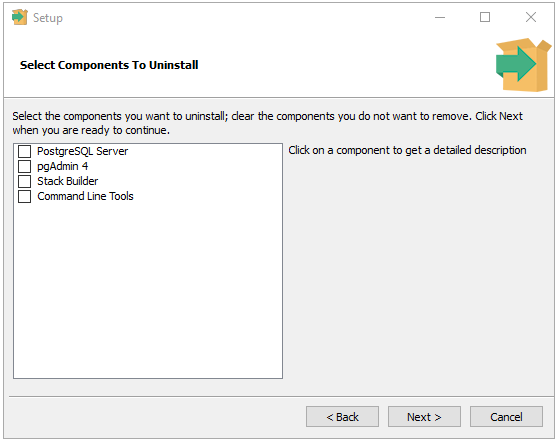
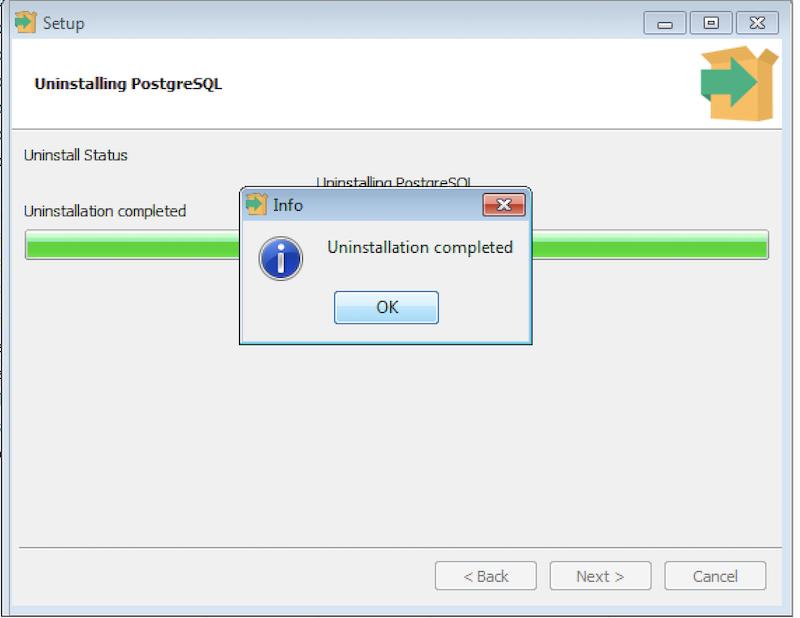
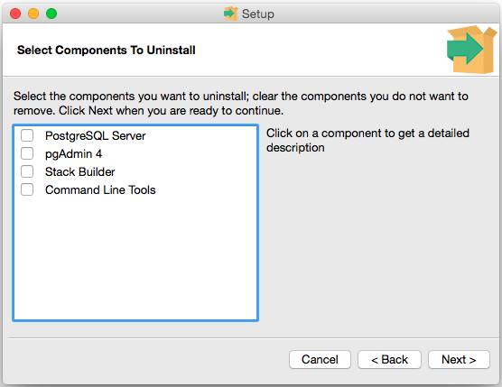

The PostgreSQL installer creates an uninstaller in the PostgreSQL installation directory. This section walks you through uninstalling PostgreSQL on a Windows as well as a Mac host.

## Uninstalling PostgreSQL on Windows

To uninstall PostgreSQL, navigate to the Windows `Control Panel` to open the `Uninstall or change a program` dialog and Right-click the `PostgreSQL 13` and select `Uninstall/Change` from the context menu.

Fig. 1: The Uninstall or change a program dialog

You can either remove the entire application or individual components.

-   If you wish to remove the entire application, select the `Entire application` option and click `Next` to start uninstalling components.
-   If you wish to remove individual components, select the `Individual components` option and click `Next`, a selection screen opens, allowing you to select which components you wish to uninstall. Select the components you wish to uninstall, and click `Next` to start uninstalling components.

Fig. 2: Confirm that you wish to uninstall PostgreSQL

Select the components you want to uninstall. Click `Next` when you are ready to continue.

Fig. 3: Select the components to uninstall
s
A progress bar will keep you informed as PostgreSQL is removed.

Fig. 4: Uninstalling PostgreSQL

When the uninstaller completes, click `OK` to exit.

Fig. 5: An Info dialog confirms the uninstallation

## Uninstalling PostgreSQL on Mac

To uninstall PostgreSQL on a Mac system, assume the identity of an operating system superuser, and navigate into the folder in which the uninstaller resides:

`/Library/PostgreSQL/13`

Then, invoke the uninstaller with the command:

`open uninstall-postgres.app`

If prompted, provide a password that allows the uninstaller to make changes to your system. The uninstaller will open, asking you if you wish to uninstall the entire application or individual components.

To remove the entire application, select the `Entire application` option and click `Next` to start uninstalling components.

To remove individual components, select the `Individual components` option, a selection screen opens allowing you to select which components you wish to uninstall.

Fig. 6: Remove the entire application or components

Select the components you wish to uninstall, and click `Next` to start uninstalling components.

Fig. 7: Selecting the components to uninstall

Progress bars are displayed as each component is removed. When the uninstaller completes, click `OK` to exit the uninstaller.

Fig. 8: The Uninstallation is completed
