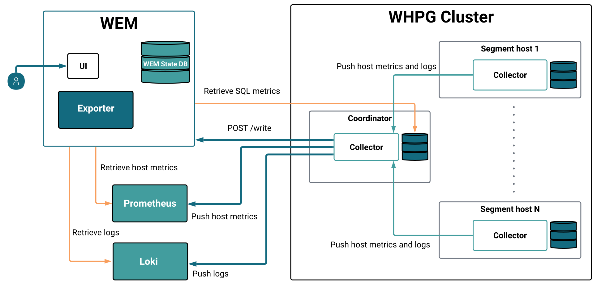

The WarehousePG Enterprise Manager (WEM) architecture is built upon a streamlined telemetry pipeline: an internal data collection layer, dedicated storage services, and the unified WEM application.

## Components

### Collector

The Collector is a service based on Grafana Alloy that runs on the WarehousePG (WHPG) coordinator, standby, and segments. Each Collector service on the WHPG cluster collects host metrics and log files, and sends them to the Collector service on the coordinator. The Collector service on the coordinator temporarily stores these metrics in memory, then pushes the host metrics to Prometheus, and the log files to Loki.

### WEM

WEM is the central management and visualization service. It includes Exporter as a native service, eliminating the need for a separate installation.

WEM performs the following core functions:

- **Database extraction:** The integrated Exporter engine runs SQL queries against heap and catalog tables to capture deep database metrics.
- **Data routing:** Pushes captured SQL and cluster metrics to Prometheus for historical analysis. The `/prom/metrics` endpoint is always available for Prometheus to scrape, even if `PROMETHEUS_URL` is not configured.
- **Remote write receiver (optional):** WEM can accept inbound time-series data from Grafana Alloy or any Prometheus-compatible remote write client via a `POST /write` endpoint. Received metrics are held in memory and exposed at `/prom/metrics` alongside WEM's own cluster metrics, providing a single scrape target for your Prometheus instance.
- **Unified visualization:** Aggregates live data directly from the internal Exporter engine and historical data from Prometheus and Loki into a single dashboard.

### Storage services: Prometheus and Loki

WEM leverages industry-standard storage engines to handle high-velocity telemetry. You can deploy dedicated instances for WEM or integrate with your existing enterprise monitoring stack:

- **Prometheus:** The time-series database for all numerical data. It receives host metrics from the Collector and SQL/Cluster metrics from the internal WEM Exporter.
- **Loki:** The log aggregation engine. It receives high-volume log streams directly from the Collector on the coordinator.

!!! Note 
    While WEM can function as a standalone tool, its capabilities are limited to real-time cluster status and SQL execution data. Historical trends, host-level metrics, and log aggregation require Prometheus and Loki.

## WEM operational workflow

The system processes telemetry across four distinct phases:

1. **Collection:** Collector agents on every node harvest raw OS metrics and log entries, and the data is tunneled to the coordinator node.

2. **Export & routing:** 
    - **System & logs:** The Collector on the coordinator pushes system metrics to Prometheus and logs to Loki.
    - **Database metrics:** The internal WEM Exporter engine probes the WHPG engine to capture the state of queries, transactions, and resource usage. Metrics are exposed at `/prom/metrics` for Prometheus to scrape regardless of whether `PROMETHEUS_URL` is configured.
    - **Inbound metrics (optional):** If the remote write receiver is enabled, Grafana Alloy or other Prometheus-compatible clients can push additional time-series data to WEM via `POST /write`. WEM aggregates these with its own metrics at `/prom/metrics`.

3. **Storage:** Data is indexed and stored externally within Prometheus and Loki. This ensures that even if the database cluster faces downtime, its historical metrics and logs remain available for root-cause analysis.

4. **Visualization:** WEM assembles the operational picture by pulling from three sources:
    - **Prometheus:** For hardware performance and historical SQL trends.
    - **Loki:** For searchable log files across the cluster.
    - **Exporter:** For the real-time view of active sessions and current cluster status.