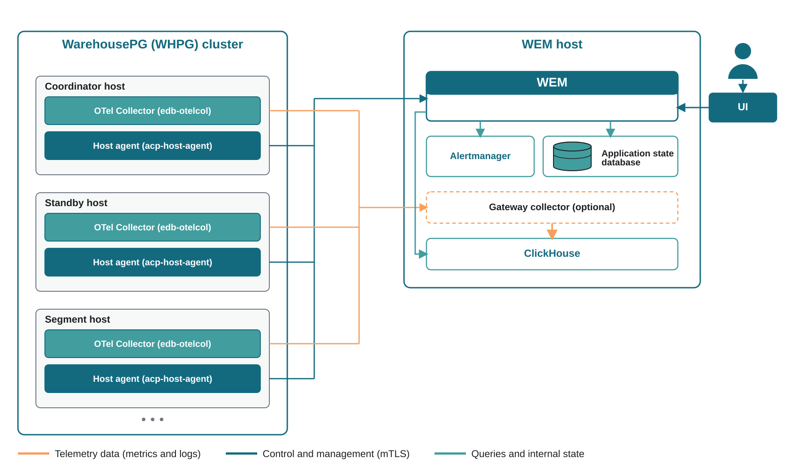

WarehousePG Enterprise Manager (WEM)'s architecture centers on a telemetry pipeline that collects, stores, and visualizes cluster data. Collectors running on every WarehousePG (WHPG) node gather host metrics and logs, host agents carry out privileged operations on WEM's behalf, ClickHouse stores historical metrics and logs, and the WEM application ties it all together into a single dashboard that combines real-time and historical views.

For the full list of what WEM can monitor and manage, see [Key capabilities](../#key-capabilities). 

## Components

### Host agent

The host agent (`acp-host-agent`) is a background service that runs on all WHPG hosts and executes privileged operations, such as editing `pg_hba.conf` and starting the OTel Collector, on behalf of WEM. WEM dispatches these operations through its internal job-execution engine, which ensures they're reliable and recoverable even when connectivity is interrupted.

The host agent is installed on every WHPG node, coordinator, standby, and segments alike. On first connection, an agent registers itself with WEM and waits in a pending state until an Admin approves it from the **Host Agents** tab. Every connection between an approved agent and WEM authenticates with mutual TLS. WEM doesn't use host agent features unless both the host agent and WEM's internal job-execution engine are running and connected.

### OTel Collector

The OTel Collector (`edb-otelcol`) is an OpenTelemetry Collector service that runs alongside the host agent on all WHPG hosts. Each node's collector gathers host metrics and tails the WHPG log files, then forwards them to a gateway collector, which writes it into ClickHouse.

### Gateway collector (optional)

The gateway collector is a centralized instance of the OTel Collector (`edb-otelcol`) that terminates OpenTelemetry Protocol (OTLP) telemetry from every per-node collector and writes it into ClickHouse. WEM auto-provisions and configures one by default for a WHPG cluster, dispatching its configuration to each host agent as it registers, whether WEM and ClickHouse run inside the WHPG cluster or on a separate host.

Install a dedicated gateway collector only when multiple systems or clusters send observability data to the same ClickHouse instance, or when applications outside your WHPG cluster need to ship telemetry to ClickHouse.

### WEM

WEM is the central management and visualization service. It performs the following core functions:

- **Database extraction:** An integrated engine runs SQL queries against heap and catalog tables on the monitored WHPG cluster to capture real-time database metrics, independent of ClickHouse.
- **Metrics and log queries:** WEM queries ClickHouse for host metrics, SQL and cluster metrics, and WHPG logs collected by the OTel Collector, and uses the same data to evaluate alert rules.
- **Unified visualization:** Aggregates live data directly from the internal database extraction engine and historical data from ClickHouse into a single dashboard.
- **Alerting:** WEM evaluates alert rules against ClickHouse-backed data itself, then pushes firing alerts to Alertmanager, bundled as an internal managed subprocess, which handles notification routing, deduplication, and silencing.

!!! Note
    While WEM can function as a standalone tool, its capabilities are limited to real-time cluster status and SQL execution data. Historical trends, host-level metrics, and log search require ClickHouse.

### Application state database

WEM stores its own configuration, dashboards, alert rules, and user accounts in a dedicated Postgres database, separate from the WHPG cluster it monitors. Host this database on a standalone instance, or reuse an existing Postgres server you already manage. 

### ClickHouse

WEM queries ClickHouse for all historical metrics and log data. You can deploy ClickHouse on the same host as WEM, either the standby coordinator or a dedicated monitoring host outside the cluster, or point WEM at an existing instance you already manage elsewhere. 

## WEM operational workflow

The system processes telemetry across four distinct phases:

1. **Collection:** The OTel Collector on every node harvests raw OS metrics and tails WHPG log files.

2. **Export and routing:**
    - **System metrics and logs:** Each node's OTel Collector forwards its telemetry to the gateway collector, which writes it into ClickHouse.
    - **Database metrics:** WEM's internal database extraction engine probes the WHPG engine directly to capture the real-time state of queries, transactions, and resource usage, independent of the ClickHouse pipeline.
    - **Privileged host operations:** When WEM triggers a host-level action, such as updating `pg_hba.conf` or starting the OTel Collector service, WEM dispatches the request to the host agent through its internal job-execution engine, which tracks the operation and retries automatically if the connection is interrupted.

3. **Storage:** Metrics and logs are indexed and stored in ClickHouse. This setup ensures that even if the database cluster faces downtime, its historical metrics and logs remain available for root-cause analysis.

4. **Visualization:** WEM assembles the operational picture by pulling from two sources:
    - **ClickHouse:** For hardware performance, historical SQL trends, and searchable log files across the cluster.
    - **Database extraction engine:** For the real-time view of active sessions and current cluster status.
