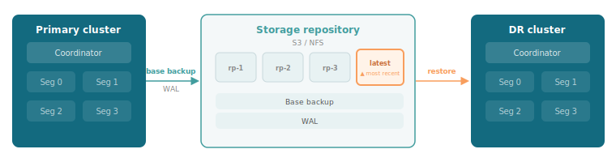
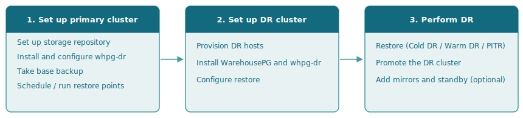

WarehousePG Disaster Recovery (`whpg-dr`) protects WarehousePG clusters against data-center-level failures such as a fire, a flood, or a complete site loss. Segment mirroring and redundant hardware handle individual node failures, but they can't help if the entire data center goes offline. `whpg-dr` fills that gap, complementing [gpbackup's logical backups](/warehousepg/latest/admin_guide/backup_restore/) with physical, full-cluster failover capability.

## Disaster recovery objectives

Any DR strategy is shaped by two objectives that capture what an organization can tolerate:

- **Recovery Time Objective (RTO)** is the maximum allowable time between declaring a failure and having the DR cluster active and queryable. A lower RTO means faster recovery and less downtime.
- **Recovery Point Objective (RPO)** is the maximum allowable amount of data loss, measured as the age of the most recent consistent snapshot in storage at the moment of failure. A lower RPO means less data lost.

These two objectives are in tension with infrastructure cost. A DR cluster that's continuously kept current costs more to run than one that's provisioned only at failure time. The right choice depends on how critical the data is and what your organization's risk tolerance allows.

## WarehousePG Disaster Recovery modes

`whpg-dr` supports three recovery modes, each targeting a different point on the RTO/RPO/cost curve.

### Cold DR

The DR cluster doesn't need to exist until a failure occurs. Backups and WAL accumulate in storage, and you restore on demand when a failure is declared. RTO is high because you need to provision the DR cluster and run a full restore before it's usable. Infrastructure cost is lowest.

Cold DR is a good fit when infrastructure cost is the primary concern and the organization can tolerate a longer recovery time.

### PITR (point-in-time recovery)

Point-in-time recovery (PITR) restores the cluster to any restore point in storage, not just the latest one. It's the mechanism underlying all DR modes and can be used independently, for example to recover from data corruption or to inspect the database as it was at a specific past point without any primary failure having occurred.

### Warm DR

A DR cluster is pre-provisioned and continuously kept near-current by two coordinated scheduled jobs: one on the primary creates a new restore point on a schedule, and one on the DR cluster applies it at a slight offset. The DR cluster stays in recovery mode, not queryable, until you promote it. At failover time, most of the WAL is already applied, so RTO is low.

RPO is determined by the replay interval. A job that runs every 15 minutes gives an RPO of approximately 15 minutes.

| Mode | RTO | RPO | DR cluster pre-provisioned? |
|------|-----|-----|-----------------------------|
| Cold DR | High | Configurable | No (provisioned at failover) |
| PITR | Depends on setup | Configurable | Optional |
| Warm DR | Low | Configurable | Yes (continuously current) |

## How whpg-dr implements recovery

### Base backups

A base backup is a physical snapshot of the coordinator and all primary segment data directories at a consistent point in time. It's the starting point for any restore. `whpg-dr` uses [Barman](/supported-open-source/barman/) as its backup engine. Backups and restores run across all segments in parallel, so time scales with the size of the largest segment rather than the number of segments.

### WAL and restore points

Because WarehousePG is a distributed system, each segment has its own independent WAL stream. A restore point marks a named, consistent position across all those streams that the cluster can be replayed to. Given a base backup and the WAL archived since it was taken, `whpg-dr` replays the cluster forward to the target restore point. `whpg-dr` coordinates restore point creation across all segments simultaneously, recording each one as a small metadata file in the storage repository. Restore points aren't standalone. They belong to the base backup that was current when they were created.

### Storage repository

The storage repository is the sole artifact shared between the primary and DR sites. The two clusters have no direct network path to each other. The repository also records the source cluster's segment topology, which fixes the DR cluster's segment count. `whpg-dr` supports two storage backends:

| Backend | WarehousePG version | Notes |
|---------|:-------------------:|-------|
| POSIX (NFS/shared filesystem) | 6.x, 7.x | Path must be mounted read-write on all primary and DR hosts. |
| S3-compatible (AWS S3, MinIO, SeaweedFS) | 7.x only | S3 endpoint must be reachable from all primary and DR hosts. |

## End-to-end workflow

The `whpg-dr` workflow can be divided into three phases.

Phase 1 is the ongoing steady state. Once configured, the primary archives WAL to the storage repository and accumulates restore points while your production cluster runs normally. Phases 2 and 3 apply only when testing your recovery plan or when a failure occurs, and how much upfront preparation Phase 2 requires depends on your DR mode.

- **Phase 1 — Set up the primary cluster.** Install `whpg-dr` on all primary hosts, configure WAL archiving and storage, and run backups and restore points. See [Setting up the primary cluster](../setting-up-primary).

- **Phase 2 — Set up the DR cluster.** Provision the DR hosts, install `whpg-dr`, and configure the restore YAML. When you complete these steps depends on your DR mode. In cold DR and PITR, these steps happen at recovery time. In warm DR, you provision the DR cluster in advance and keep it ready for failover. See [Setting up the DR cluster](../configuring-dr).

- **Phase 3 — Configure and run recovery.** Run restores on the DR cluster and promote it to a writable primary. In cold DR and PITR, restoration is a single operation to the target recovery point. In warm DR, configure scheduled restores to keep the cluster current, then promote it when ready to fail over. See [Choosing a recovery method](../performing-disaster-recovery).
