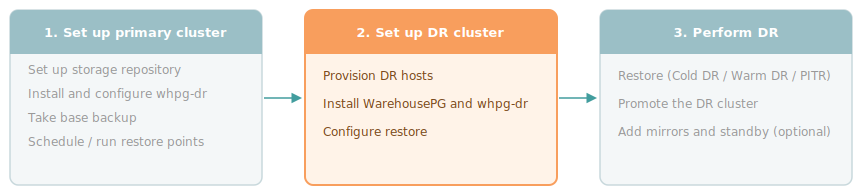

Prepare the DR cluster for recovery. Install WarehousePG and `whpg-dr`, create a restore configuration file, and run `whpg-dr configure restore` to prepare the cluster to receive restores from the storage repository. Run all commands as `gpadmin` on the DR coordinator.

<div style="text-align: center; margin-bottom: 1.5rem;"></div>

!!! Note
You don't need a pre-provisioned DR cluster and can configure it at recovery time. However, some of the information you'll need to do that can't be retrieved once the primary cluster is down. Record the following before a failure occurs and store it somewhere accessible without the primary, such as the storage repository, a secrets manager, or version control:

- The exact WHPG patch version and OS installed on the primary
- The number of primary segments
- The source cluster name (as set in the [backup YAML](../reference/configuration#backup-configuration-yaml))
- Storage credentials and bucket or path details
If you do prepare the restore YAML in advance, store it in the same safe location.
!!!

!!! Note
This page covers installing and configuring `whpg-dr` on the DR cluster, not performing a restore. To perform a restore after configuration, see [Cold DR](cold-dr), [Warm DR](warm-dr), or [Point-in-time recovery](pitr).
!!!

## Prerequisites

Confirm that the DR cluster meets these requirements before starting:

- DR hosts provisioned and reachable from the DR coordinator over SSH as `gpadmin`. You need one coordinator host and enough segment hosts to hold all primary segments. The host count doesn't need to match the primary, but the segment count must. The DR hosts don't need to be the same hardware type as the primary — you can restore to different instance types or cloud providers, as long as the OS and WarehousePG version match.
- Access to the storage repository from all DR hosts. For NFS, the path must be mounted read-write. For S3, credentials must be available on all hosts. S3 requires WarehousePG 7.x.
- No standalone `barman` or `barman-cli` packages installed on any DR host. The `edb-whpg-dr` RPM conflicts with them.
## Installing WarehousePG on the DR cluster

Install WarehousePG on all DR hosts at the exact same patch version and OS as the primary cluster. Follow the [WarehousePG install guide](/warehousepg/latest/install_guide/) through [Creating the Data Storage Areas](/warehousepg/latest/install_guide/create_data_dirs/), then stop. When creating data directories, create only the coordinator and primary segment directories and leave them empty, as `whpg-dr restore` populates them from the base backup and rejects non-empty targets. Don't create mirror directories, and don't run `gpinitsystem`. Mirrors and standby coordinators aren't part of the restored cluster.

Install any extension software that the primary cluster uses. Extension data is restored automatically as part of the cluster state, but the software packages and libraries must already be present on the DR hosts before the restore starts. Anything listed in `shared_preload_libraries` is loaded at startup, and the cluster won't start if those libraries are missing.

## Installing whpg-dr

Install the `edb-whpg-dr` RPM on the DR coordinator and all DR segment hosts. Run these steps as `gpadmin` on the DR coordinator.

1. Download the `edb-whpg-dr` package to the DR coordinator:

    ```bash
    export EDB_SUBSCRIPTION_TOKEN=<your-token>
    curl -1sSLf "https://downloads.enterprisedb.com/$EDB_SUBSCRIPTION_TOKEN/gpsupp/setup.rpm.sh" | sudo -E bash
    sudo dnf download edb-whpg-dr
    ```

1. Create a file `all_hosts` listing every DR host:

    ```ini
    cdw-dr
    sdw1-dr
    sdw2-dr
    sdw3-dr
    ```

1. Copy the RPM to all DR hosts:

    <TabContainer syncKey="whpg-version">
    <Tab title="WHPG 7">

    ```bash
    gpsync -f all_hosts edb-whpg-dr-<version>.el9.x86_64.rpm =:/tmp/
    ```

    </Tab>
    <Tab title="WHPG 6">

    ```bash
    gpscp -f all_hosts edb-whpg-dr-<version>.el9.x86_64.rpm =:/tmp/
    ```

    </Tab>
    </TabContainer>

1. Install the package on all DR hosts:

    ```bash
    gpssh -f all_hosts -u gpadmin -e "sudo dnf install -y /tmp/edb-whpg-dr-<version>.el9.x86_64.rpm"
    ```

1. Add the `whpg-dr` bin directory to `gpadmin`'s `PATH`:

    ```bash
    echo 'export PATH=$PATH:/usr/edb/whpg-dr/bin' >> ~/.bashrc && source ~/.bashrc
    ```

1. Verify the installation on the DR coordinator:

    ```bash
    whpg-dr --version
    ```

By default, `whpg-dr` stores its configuration, state, and logs under `$HOME/.whpg-dr`. To change this on the DR cluster, set `WHPG_DR_HOME` as described in [Customizing the home directory](../setting-up-primary/configuring-primary#customizing-the-home-directory-optional).

## Creating the restore configuration file

Create a YAML file that describes the storage repository and the DR cluster topology, then run `whpg-dr configure restore` to prepare the cluster. The storage block must point to the [same repository the primary cluster writes to](../setting-up-primary/configuring-primary#creating-the-backup-configuration-file).

The cluster name and storage configuration must match your primary cluster. The restore YAML also includes fields that don't exist in the backup configuration: `coordinator_host`, `coordinator_data_directory`, `segment_hosts`, `data_directory`, and `data_directory_prefix`. These fields describe your DR environment and can be set to match your infrastructure. The DR cluster doesn't need to match the primary's host layout, hostname scheme, or directory structure.

### Using POSIX storage

Create a restore YAML file with `storage.type: posix` when the DR hosts can mount the same NFS path as the primary:

```yaml
source_cluster_name: my_cluster

storage:
  type: posix
  path: /data/backups/whpg-dr

coordinator_host: cdw-dr
coordinator_data_directory: /data/coordinator

segment_hosts:
  - sdw1-dr
  - sdw2-dr
  - sdw3-dr

data_directory: /data/primary
data_directory_prefix: gpseg
```

For a full description of all available fields, see [Restore configuration YAML](../reference/configuration#restore-configuration-yaml).

### Using S3 storage

Create a restore YAML file with `storage.type: s3` if all DR hosts have network access to the S3 endpoint. S3 requires WarehousePG 7.x.

```yaml
source_cluster_name: my_cluster

storage:
  type: s3
  bucket: my-dr-bucket
  prefix: whpg/my_cluster
  region: us-east-1
  access_key_id: your_aws_access_key_id
  secret_access_key: your_aws_secret_access_key

coordinator_host: cdw-dr
coordinator_data_directory: /data/coordinator

segment_hosts:
  - sdw1-dr
  - sdw2-dr
  - sdw3-dr

data_directory: /data/primary
data_directory_prefix: gpseg
```

For a full description of all fields including other credential methods, see [Restore configuration YAML](../reference/configuration#restore-configuration-yaml).

## Preparing the DR cluster for restore

Run `whpg-dr configure restore` to set up the DR cluster for restore operations. The command doesn't restore any data, but generates the necessary configuration files to run a restore:

```bash
whpg-dr configure restore /home/gpadmin/restore.yaml
```

The command:

- Reads `segment_configuration.csv` from the storage repository to map source segments to DR hosts. The segment count always matches the source, but the DR host count can differ, with content IDs distributed round-robin across `segment_hosts`.
- Generates Barman configuration files under `$WHPG_DR_HOME/<cluster_name>/restore/barman_conf/` and distributes them to the coordinator and all DR segment hosts. For S3 storage, also writes AWS credential files to all hosts.
- Saves a copy of the restore YAML to `$WHPG_DR_HOME/<cluster_name>/restore/config.yaml`.
- Saves the segment mapping to `$WHPG_DR_HOME/<cluster_name>/restore/restore.json`.

Use `--dry-run` to preview what files will be generated without writing anything:

```bash
whpg-dr configure restore /home/gpadmin/restore.yaml --dry-run
```

After the command completes, check what backups and restore points are available in the repository:

```bash
whpg-dr list-backup my_cluster
```

By default, `configure restore` targets the backup associated with the latest restore point. To target a different backup, re-run the command with `--backup-name` using one of the names returned by `list-backup`:

```bash
whpg-dr configure restore /home/gpadmin/restore.yaml --backup-name 20260601T120000_base_backup
```

The DR cluster is now ready for restore operations. See [Cold DR](cold-dr), [Warm DR](warm-dr), or [Point-in-time recovery](pitr) for next steps.