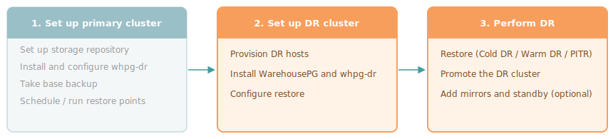

Before performing a restore, install `whpg-dr` on the DR cluster and run `whpg-dr configure restore` to prepare it. See [Configuring the DR cluster](configuring-dr).

Once the DR cluster is configured, choose the recovery scenario that matches your infrastructure and recovery objectives. For an explanation of RTO, RPO, and other key concepts, see [Concepts](../overview/concepts).

- **[Cold DR](cold-dr)** — The DR cluster doesn't exist until a failure occurs. You restore on demand from a base backup and WAL. Infrastructure cost is lowest, but Recovery Time Objective (RTO) is highest because provisioning and a full restore are required when a failure occurs.

- **[Point-in-time recovery (PITR)](pitr)** — You restore the cluster to a specific named restore point: for example, to roll back data corruption caused by a bad ETL load or an accidental `DROP TABLE`. The DR cluster may or may not be pre-provisioned. PITR requires restore points created in advance on the primary cluster.

- **[Warm DR](warm-dr)** — A pre-provisioned DR cluster is kept continuously current by replaying WAL at a regular interval. The cluster stays in recovery mode until you promote it. RTO is low because most of the WAL is already applied when a failure occurs.
