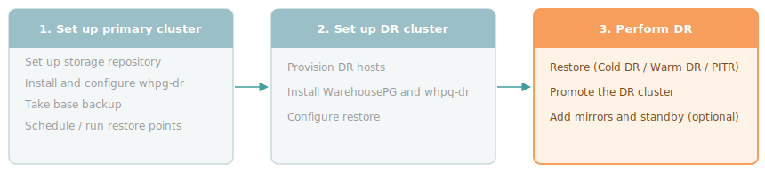

Use warm DR when you need a short Recovery Time Objective (RTO) and can keep a pre-provisioned DR cluster running continuously. The DR cluster runs continuously in recovery mode, staying close to current by applying WAL from the primary at regular intervals. When a failure occurs, promote the DR cluster.

!!! Note
The DR cluster remains in recovery mode after performing a restore and doesn't accept client connections. To bring it online, [promote the cluster](#promoting-the-dr-cluster) and start it with `gpstart`.
!!!

<div style="text-align: center; margin-bottom: 1.5rem;"></div>

## Prerequisites

Configure the DR cluster for restore before proceeding. See [Installing and configuring the DR cluster](configuring-dr).

## Setting up warm DR

Setting up warm DR involves running a one-time full restore to establish the DR cluster's baseline state, then scheduling two coordinated cron jobs to keep it current. One job on the primary creates a new restore point on a schedule, and one on the DR cluster applies it at a slight offset to ensure it's in storage before the DR job runs.

The restore-point interval determines your RPO. For example, a 15-minute interval gives at most 15 minutes of data loss. RTO is determined by the time for the final delta restore plus promotion, which is low when the WAL gap is small.

### Running the initial restore

Before the delta schedule can run, the DR cluster needs a baseline state. Run all commands as the WarehousePG cluster owner, typically `gpadmin` on the DR coordinator.

1. Check what restore points are available:

    ```bash
    whpg-dr list-backup my_cluster
    ```

2. Run a full restore to the latest restore point:

    ```bash
    whpg-dr restore my_cluster --target-name latest
    ```

    The full restore requires empty target data directories. If the directories already contain data from a previous restore, clear them first.

### Scheduling restore points on the primary cluster

As the WarehousePG cluster owner, typically `gpadmin`, add the following entry to the crontab (`crontab -e`) on the primary to create a restore point, for example every 15 minutes:

```cron
*/15 * * * * source /usr/edb/whpg7/greenplum_path.sh && /usr/edb/whpg-dr/bin/whpg-dr create-restore-point my_cluster --suffix scheduled >> $HOME/gpAdminLogs/whpg-dr-crp.log 2>&1
```

### Scheduling delta restores on the DR cluster

As the WarehousePG cluster owner, typically `gpadmin`, add the following entry to the crontab (`crontab -e`) on the DR coordinator to apply the latest restore point, offset by a few minutes to allow archiving to complete:

```cron
5,20,35,50 * * * * source /usr/edb/whpg7/greenplum_path.sh && /usr/edb/whpg-dr/bin/whpg-dr restore my_cluster --target-name latest --delta >> $HOME/gpAdminLogs/whpg-dr-restore.log 2>&1
```

!!! Note
The offset between the two jobs (5 minutes in this example) must be long enough for the restore point to be fully archived to storage before the DR job runs. If `create-restore-point` takes longer than the offset on your cluster, increase the offset accordingly.
!!!

## Verifying warm DR

To check what restore points the primary cluster has created, run on the primary coordinator:

```bash
whpg-dr list-backup my_cluster
__OUTPUT__
Full backup: 20260624T195641_base_backup
└── Restore Points:
    ├── 20260624-195718R_whpgdr_full_backup: 2026-06-24 19:57:18
    ├── 20260624-200623R_delta_test: 2026-06-24 20:06:23
    └── 20260625-141506R_scheduled: 2026-06-25 14:15:06
```

To check which restore point the DR cluster has applied and how far each segment has replayed WAL, run on the DR coordinator:

```bash
whpg-dr list-restore my_cluster
__OUTPUT__
Latest Completed Restore
------------------------
Restore point: 20260625-141506R_scheduled
Backup name: 20260624T195641_base_backup
Restore time: 2026-06-25 14:20:14

Recovery Cluster Segment Status
-------------------------------
Content ID   Status                 Replay End LSN  Host          Path
----------   ------                 --------------  ----          ----
coordinator  shut down in recovery  0/98091348      cdw           /data/coordinator/gpseg-1
segment 0    shut down in recovery  0/80000120      sdw1          /data1/primary/gpseg0
segment 1    shut down in recovery  0/80000120      sdw1          /data1/primary/gpseg1
segment 2    shut down in recovery  0/78000120      sdw2          /data1/primary/gpseg2
segment 3    shut down in recovery  0/78000120      sdw2          /data1/primary/gpseg3
```

When the DR cluster is current, the restore-point name in `list-restore` matches the latest entry in `list-backup`. The `Replay End LSN` values advance with each delta restore cycle.

## Promoting the DR cluster

When the primary cluster fails or becomes unavailable, promote the DR cluster to take over as the new primary. The DR cluster is already close to current, at most one restore-point interval behind, so the Recovery Time Objective (RTO) is low.

1. Stop the delta restore cron job on the DR coordinator (`crontab -r`, or comment out the `whpg-dr` line) to prevent a partial restore from interfering with promotion. If the primary is still accessible, stop its restore-point cron job too.

1. Optionally, apply one final delta restore to catch up to the latest available restore point:

    ```bash
    whpg-dr restore my_cluster --target-name latest --delta
    ```

1. Promote the DR cluster:

    ```bash
    whpg-dr promote my_cluster
    ```

1. Start the cluster. Source the WarehousePG environment and set `COORDINATOR_DATA_DIRECTORY` before running `gpstart`:

```bash
source /usr/edb/whpg7/greenplum_path.sh
export COORDINATOR_DATA_DIRECTORY=<coordinator_data_directory>
gpstart -a
```

Rebuild system indexes and collect statistics on each database. Without this step, queries generate warnings about missing table statistics. Repeat for each database in the cluster, replacing `<database_name>` accordingly:

```bash
reindexdb --system -d <database_name> -e
analyzedb -as pg_catalog -d <database_name> -p 10 -v
analyzedb -d <database_name> -p 10 -v
```

After these steps, the cluster accepts connections. Extension data is restored as part of the cluster state.

## Adding mirrors and standby coordinator

Optionally, add mirrors and a standby coordinator after promotion. `whpg-dr` doesn't restore these components, so the promoted cluster has only primary segments. See the WarehousePG documentation for [enabling segment mirroring](/warehousepg/latest/admin_guide/managing/ha/enabling-mirroring-in-warehousepg/enabling-segment-mirroring/) and [enabling coordinator mirroring](/warehousepg/latest/admin_guide/managing/ha/enabling-mirroring-in-warehousepg/enabling-coordinator-mirroring/).

