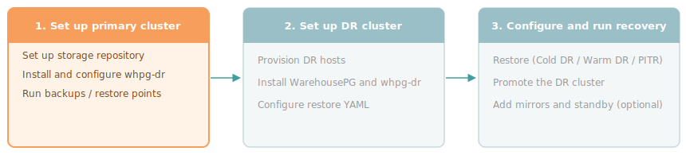

Get the primary cluster protected and ready for disaster recovery. Set up the storage repository, install and configure `whpg-dr` on the primary cluster, and start taking backups.

## Steps

1. [Set up the storage repository](storage) — provision an NFS share or S3 bucket that both clusters can reach. The primary cluster writes to it and the DR cluster reads from it.

1. [Install and configure the primary cluster](configuring-primary) — install the `whpg-dr` package, create a backup configuration file, and run `whpg-dr configure backup` to enable WAL archiving.

1. [Perform backups](backups) — run backups and restore points. At least one backup must exist before the DR cluster can be configured.

Once the primary is backing up, set up the DR cluster and choose a recovery scenario. See [Choosing a recovery method](../performing-disaster-recovery).
