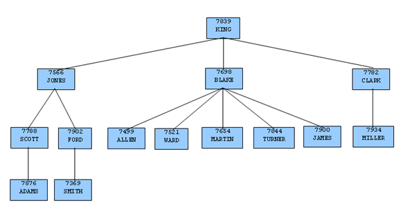

This section is an introduction to the SQL language for those new to relational database management systems. Basic operations such as creating, populating, querying, and updating tables are discussed along with examples.

More advanced concepts such as view, foreign keys, and transactions are discussed as well.

## Getting Started

Advanced Server is a *relational database management system* (RDBMS). That means it is a system for managing data stored in *relations*. A relation is essentially a mathematical term for a *table*. The notion of storing data in tables is so commonplace today that it might seem inherently obvious, but there are a number of other ways of organizing databases. Files and directories on Unix-like operating systems form an example of a hierarchical database. A more modern development is the object-oriented database.

Each table is a named collection of *rows*. Each row of a given table has the same set of named *columns*, and each column is of a specific *data type*. Whereas columns have a fixed order in each row, it is important to remember that SQL does not guarantee the order of the rows within the table in any way (although they can be explicitly sorted for display).

Tables are grouped into *databases*, and a collection of databases managed by a single Advanced Server instance constitutes a database *cluster*.

### Sample Database

Throughout this documentation we will be working with a sample database to help explain some basic to advanced level database concepts.

#### Sample Database Installation

When Advanced Server is installed a sample database named, edb, is automatically created. This sample database contains the tables and programs used throughout this document.

The tables and programs in the sample database can be re-created at any time by executing the script, edb-sample.sql, located in the samples subdirectory of the Advanced Server home directory.

This script does the following:
 - Creates the sample tables and programs in the currently connected database
 - Grants all permissions on the tables to the PUBLIC group

The tables and programs will be created in the first schema of the search path in which the current user has permission to create tables and procedures. You can display the search path by issuing the command:

SHOW SEARCH\_PATH;

Altering the search path can be done using commands in PSQL.

#### Sample Database Description

The sample database represents employees in an organization.

It contains three types of records: employees, departments, and historical records of employees.

Each employee has an identification number, name, hire date, salary, and manager. Some employees earn a commission in addition to their salary. All employee-related information is stored in the emp table.

The sample company is regionally diverse, so the database keeps track of the location of the departments. Each company employee is assigned to a department. Each department is identified by a unique department number and a short name. Each department is associated with one location. All department-related information is stored in the dept table.

The company also tracks information about jobs held by the employees. Some employees have been with the company for a long time and have held different positions, received raises, switched departments, etc. When a change in employee status occurs, the company records the end date of the former position. A new job record is added with the start date and the new job title, department, salary, and the reason for the status change. All employee history is maintained in the jobhist table.

The following is an entity relationship diagram of the sample database tables.

The following is the edb-sample.sql script.

\--

\-- Script that creates the 'sample' tables, views, procedures,

\-- functions, triggers, etc.

\--

\-- Start new transaction - commit all or nothing

\--

BEGIN;

/

\--

\-- Create and load tables used in the documentation examples.

\--

\-- Create the 'dept' table

\--

CREATE TABLE dept (

deptno NUMBER(2) NOT NULL CONSTRAINT dept\_pk PRIMARY KEY,

dname VARCHAR2(14) CONSTRAINT dept\_dname\_uq UNIQUE,

loc VARCHAR2(13)

);

\--

\-- Create the 'emp' table

\--

CREATE TABLE emp (

empno NUMBER(4) NOT NULL CONSTRAINT emp\_pk PRIMARY KEY,

ename VARCHAR2(10),

job VARCHAR2(9),

mgr NUMBER(4),

hiredate DATE,

sal NUMBER(7,2) CONSTRAINT emp\_sal\_ck CHECK (sal \> 0),

comm NUMBER(7,2),

deptno NUMBER(2) CONSTRAINT emp\_ref\_dept\_fk

REFERENCES dept(deptno)

);

\--

\-- Create the 'jobhist' table

\--

CREATE TABLE jobhist (

empno NUMBER(4) NOT NULL,

startdate DATE NOT NULL,

enddate DATE,

job VARCHAR2(9),

sal NUMBER(7,2),

comm NUMBER(7,2),

deptno NUMBER(2),

chgdesc VARCHAR2(80),

CONSTRAINT jobhist\_pk PRIMARY KEY (empno, startdate),

CONSTRAINT jobhist\_ref\_emp\_fk FOREIGN KEY (empno)

REFERENCES emp(empno) ON DELETE CASCADE,

CONSTRAINT jobhist\_ref\_dept\_fk FOREIGN KEY (deptno)

REFERENCES dept (deptno) ON DELETE SET NULL,

CONSTRAINT jobhist\_date\_chk CHECK (startdate \<= enddate)

);

\--

\-- Create the 'salesemp' view

\--

CREATE OR REPLACE VIEW salesemp AS

SELECT empno, ename, hiredate, sal, comm FROM emp WHERE job = 'SALESMAN';

\--

\-- Sequence to generate values for function 'new\_empno'.

\--

CREATE SEQUENCE next\_empno START WITH 8000 INCREMENT BY 1;

\--

\-- Issue PUBLIC grants

\--

GRANT ALL ON emp TO PUBLIC;

GRANT ALL ON dept TO PUBLIC;

GRANT ALL ON jobhist TO PUBLIC;

GRANT ALL ON salesemp TO PUBLIC;

GRANT ALL ON next\_empno TO PUBLIC;

\--

\-- Load the 'dept' table

\--

INSERT INTO dept VALUES (10,'ACCOUNTING','NEW YORK');

INSERT INTO dept VALUES (20,'RESEARCH','DALLAS');

INSERT INTO dept VALUES (30,'SALES','CHICAGO');

INSERT INTO dept VALUES (40,'OPERATIONS','BOSTON');

\--

\-- Load the 'emp' table

\--

INSERT INTO emp VALUES (7369,'SMITH','CLERK',7902,'17-DEC-80',800,NULL,20);

INSERT INTO emp VALUES (7499,'ALLEN','SALESMAN',7698,'20-FEB-81',1600,300,30);

INSERT INTO emp VALUES (7521,'WARD','SALESMAN',7698,'22-FEB-81',1250,500,30);

INSERT INTO emp VALUES (7566,'JONES','MANAGER',7839,'02-APR-81',2975,NULL,20);

INSERT INTO emp VALUES (7654,'MARTIN','SALESMAN',7698,'28-SEP-81',1250,1400,30);

INSERT INTO emp VALUES (7698,'BLAKE','MANAGER',7839,'01-MAY-81',2850,NULL,30);

INSERT INTO emp VALUES (7782,'CLARK','MANAGER',7839,'09-JUN-81',2450,NULL,10);

INSERT INTO emp VALUES (7788,'SCOTT','ANALYST',7566,'19-APR-87',3000,NULL,20);

INSERT INTO emp VALUES (7839,'KING','PRESIDENT',NULL,'17-NOV-81',5000,NULL,10);

INSERT INTO emp VALUES (7844,'TURNER','SALESMAN',7698,'08-SEP-81',1500,0,30);

INSERT INTO emp VALUES (7876,'ADAMS','CLERK',7788,'23-MAY-87',1100,NULL,20);

INSERT INTO emp VALUES (7900,'JAMES','CLERK',7698,'03-DEC-81',950,NULL,30);

INSERT INTO emp VALUES (7902,'FORD','ANALYST',7566,'03-DEC-81',3000,NULL,20);

INSERT INTO emp VALUES (7934,'MILLER','CLERK',7782,'23-JAN-82',1300,NULL,10);

\--

\-- Load the 'jobhist' table

\--

INSERT INTO jobhist VALUES (7369,'17-DEC-80',NULL,'CLERK',800,NULL,20,'New Hire');

INSERT INTO jobhist VALUES (7499,'20-FEB-81',NULL,'SALESMAN',1600,300,30,'New Hire');

INSERT INTO jobhist VALUES (7521,'22-FEB-81',NULL,'SALESMAN',1250,500,30,'New Hire');

INSERT INTO jobhist VALUES (7566,'02-APR-81',NULL,'MANAGER',2975,NULL,20,'New Hire');

INSERT INTO jobhist VALUES (7654,'28-SEP-81',NULL,'SALESMAN',1250,1400,30,'New Hire');

INSERT INTO jobhist VALUES (7698,'01-MAY-81',NULL,'MANAGER',2850,NULL,30,'New Hire');

INSERT INTO jobhist VALUES (7782,'09-JUN-81',NULL,'MANAGER',2450,NULL,10,'New Hire');

INSERT INTO jobhist VALUES (7788,'19-APR-87','12-APR-88','CLERK',1000,NULL,20,'New Hire');

INSERT INTO jobhist VALUES (7788,'13-APR-88','04-MAY-89','CLERK',1040,NULL,20,'Raise');

INSERT INTO jobhist VALUES (7788,'05-MAY-90',NULL,'ANALYST',3000,NULL,20,'Promoted to Analyst');

INSERT INTO jobhist VALUES (7839,'17-NOV-81',NULL,'PRESIDENT',5000,NULL,10,'New Hire');

INSERT INTO jobhist VALUES (7844,'08-SEP-81',NULL,'SALESMAN',1500,0,30,'New Hire');

INSERT INTO jobhist VALUES (7876,'23-MAY-87',NULL,'CLERK',1100,NULL,20,'New Hire');

INSERT INTO jobhist VALUES (7900,'03-DEC-81','14-JAN-83','CLERK',950,NULL,10,'New Hire');

INSERT INTO jobhist VALUES (7900,'15-JAN-83',NULL,'CLERK',950,NULL,30,'Changed to Dept 30');

INSERT INTO jobhist VALUES (7902,'03-DEC-81',NULL,'ANALYST',3000,NULL,20,'New Hire');

INSERT INTO jobhist VALUES (7934,'23-JAN-82',NULL,'CLERK',1300,NULL,10,'New Hire');

\--

\-- Populate statistics table and view (pg\_statistic/pg\_stats)

\--

ANALYZE dept;

ANALYZE emp;

ANALYZE jobhist;

\--

\-- Procedure that lists all employees' numbers and names

\-- from the 'emp' table using a cursor.

\--

CREATE OR REPLACE PROCEDURE list\_emp

IS

v\_empno NUMBER(4);

v\_ename VARCHAR2(10);

CURSOR emp\_cur IS

SELECT empno, ename FROM emp ORDER BY empno;

BEGIN

OPEN emp\_cur;

DBMS\_OUTPUT.PUT\_LINE('EMPNO ENAME');

DBMS\_OUTPUT.PUT\_LINE('----- -------');

LOOP

FETCH emp\_cur INTO v\_empno, v\_ename;

EXIT WHEN emp\_cur%NOTFOUND;

DBMS\_OUTPUT.PUT\_LINE(v\_empno || ' ' || v\_ename);

END LOOP;

CLOSE emp\_cur;

END;

/

\--

\-- Procedure that selects an employee row given the employee

\-- number and displays certain columns.

\--

CREATE OR REPLACE PROCEDURE select\_emp (

p\_empno IN NUMBER

)

IS

v\_ename emp.ename%TYPE;

v\_hiredate emp.hiredate%TYPE;

v\_sal emp.sal%TYPE;

v\_comm emp.comm%TYPE;

v\_dname dept.dname%TYPE;

v\_disp\_date VARCHAR2(10);

BEGIN

SELECT ename, hiredate, sal, NVL(comm, 0), dname

INTO v\_ename, v\_hiredate, v\_sal, v\_comm, v\_dname

FROM emp e, dept d

WHERE empno = p\_empno

AND e.deptno = d.deptno;

v\_disp\_date := TO\_CHAR(v\_hiredate, 'MM/DD/YYYY');

DBMS\_OUTPUT.PUT\_LINE('Number : ' || p\_empno);

DBMS\_OUTPUT.PUT\_LINE('Name : ' || v\_ename);

DBMS\_OUTPUT.PUT\_LINE('Hire Date : ' || v\_disp\_date);

DBMS\_OUTPUT.PUT\_LINE('Salary : ' || v\_sal);

DBMS\_OUTPUT.PUT\_LINE('Commission: ' || v\_comm);

DBMS\_OUTPUT.PUT\_LINE('Department: ' || v\_dname);

EXCEPTION

WHEN NO\_DATA\_FOUND THEN

DBMS\_OUTPUT.PUT\_LINE('Employee ' || p\_empno || ' not found');

WHEN OTHERS THEN

DBMS\_OUTPUT.PUT\_LINE('The following is SQLERRM:');

DBMS\_OUTPUT.PUT\_LINE(SQLERRM);

DBMS\_OUTPUT.PUT\_LINE('The following is SQLCODE:');

DBMS\_OUTPUT.PUT\_LINE(SQLCODE);

END;

/

\--

\-- Procedure that queries the 'emp' table based on

\-- department number and employee number or name. Returns

\-- employee number and name as IN OUT parameters and job,

\-- hire date, and salary as OUT parameters.

\--

CREATE OR REPLACE PROCEDURE emp\_query (

p\_deptno IN NUMBER,

p\_empno IN OUT NUMBER,

p\_ename IN OUT VARCHAR2,

p\_job OUT VARCHAR2,

p\_hiredate OUT DATE,

p\_sal OUT NUMBER

)

IS

BEGIN

SELECT empno, ename, job, hiredate, sal

INTO p\_empno, p\_ename, p\_job, p\_hiredate, p\_sal

FROM emp

WHERE deptno = p\_deptno

AND (empno = p\_empno

OR ename = UPPER(p\_ename));

END;

/

\--

\-- Procedure to call 'emp\_query\_caller' with IN and IN OUT

\-- parameters. Displays the results received from IN OUT and

\-- OUT parameters.

\--

CREATE OR REPLACE PROCEDURE emp\_query\_caller

IS

v\_deptno NUMBER(2);

v\_empno NUMBER(4);

v\_ename VARCHAR2(10);

v\_job VARCHAR2(9);

v\_hiredate DATE;

v\_sal NUMBER;

BEGIN

v\_deptno := 30;

v\_empno := 0;

v\_ename := 'Martin';

emp\_query(v\_deptno, v\_empno, v\_ename, v\_job, v\_hiredate, v\_sal);

DBMS\_OUTPUT.PUT\_LINE('Department : ' || v\_deptno);

DBMS\_OUTPUT.PUT\_LINE('Employee No: ' || v\_empno);

DBMS\_OUTPUT.PUT\_LINE('Name : ' || v\_ename);

DBMS\_OUTPUT.PUT\_LINE('Job : ' || v\_job);

DBMS\_OUTPUT.PUT\_LINE('Hire Date : ' || v\_hiredate);

DBMS\_OUTPUT.PUT\_LINE('Salary : ' || v\_sal);

EXCEPTION

WHEN TOO\_MANY\_ROWS THEN

DBMS\_OUTPUT.PUT\_LINE('More than one employee was selected');

WHEN NO\_DATA\_FOUND THEN

DBMS\_OUTPUT.PUT\_LINE('No employees were selected');

END;

/

\--

\-- Function to compute yearly compensation based on semimonthly

\-- salary.

\--

CREATE OR REPLACE FUNCTION emp\_comp (

p\_sal NUMBER,

p\_comm NUMBER

) RETURN NUMBER

IS

BEGIN

RETURN (p\_sal + NVL(p\_comm, 0)) \* 24;

END;

/

\--

\-- Function that gets the next number from sequence, 'next\_empno',

\-- and ensures it is not already in use as an employee number.

\--

CREATE OR REPLACE FUNCTION new\_empno RETURN NUMBER

IS

v\_cnt INTEGER := 1;

v\_new\_empno NUMBER;

BEGIN

WHILE v\_cnt \> 0 LOOP

SELECT next\_empno.nextval INTO v\_new\_empno FROM dual;

SELECT COUNT(\*) INTO v\_cnt FROM emp WHERE empno = v\_new\_empno;

END LOOP;

RETURN v\_new\_empno;

END;

/

\--

\-- EDB-SPL function that adds a new clerk to table 'emp'. This function

\-- uses package 'emp\_admin'.

\--

CREATE OR REPLACE FUNCTION hire\_clerk (

p\_ename VARCHAR2,

p\_deptno NUMBER

) RETURN NUMBER

IS

v\_empno NUMBER(4);

v\_ename VARCHAR2(10);

v\_job VARCHAR2(9);

v\_mgr NUMBER(4);

v\_hiredate DATE;

v\_sal NUMBER(7,2);

v\_comm NUMBER(7,2);

v\_deptno NUMBER(2);

BEGIN

v\_empno := new\_empno;

INSERT INTO emp VALUES (v\_empno, p\_ename, 'CLERK', 7782,

TRUNC(SYSDATE), 950.00, NULL, p\_deptno);

SELECT empno, ename, job, mgr, hiredate, sal, comm, deptno INTO

v\_empno, v\_ename, v\_job, v\_mgr, v\_hiredate, v\_sal, v\_comm, v\_deptno

FROM emp WHERE empno = v\_empno;

DBMS\_OUTPUT.PUT\_LINE('Department : ' || v\_deptno);

DBMS\_OUTPUT.PUT\_LINE('Employee No: ' || v\_empno);

DBMS\_OUTPUT.PUT\_LINE('Name : ' || v\_ename);

DBMS\_OUTPUT.PUT\_LINE('Job : ' || v\_job);

DBMS\_OUTPUT.PUT\_LINE('Manager : ' || v\_mgr);

DBMS\_OUTPUT.PUT\_LINE('Hire Date : ' || v\_hiredate);

DBMS\_OUTPUT.PUT\_LINE('Salary : ' || v\_sal);

DBMS\_OUTPUT.PUT\_LINE('Commission : ' || v\_comm);

RETURN v\_empno;

EXCEPTION

WHEN OTHERS THEN

DBMS\_OUTPUT.PUT\_LINE('The following is SQLERRM:');

DBMS\_OUTPUT.PUT\_LINE(SQLERRM);

DBMS\_OUTPUT.PUT\_LINE('The following is SQLCODE:');

DBMS\_OUTPUT.PUT\_LINE(SQLCODE);

RETURN -1;

END;

/

\--

\-- PostgreSQL PL/pgSQL function that adds a new salesman

\-- to table 'emp'.

\--

CREATE OR REPLACE FUNCTION hire\_salesman (

p\_ename VARCHAR,

p\_sal NUMERIC,

p\_comm NUMERIC

) RETURNS NUMERIC

AS $$

DECLARE

v\_empno NUMERIC(4);

v\_ename VARCHAR(10);

v\_job VARCHAR(9);

v\_mgr NUMERIC(4);

v\_hiredate DATE;

v\_sal NUMERIC(7,2);

v\_comm NUMERIC(7,2);

v\_deptno NUMERIC(2);

BEGIN

v\_empno := new\_empno();

INSERT INTO emp VALUES (v\_empno, p\_ename, 'SALESMAN', 7698,

CURRENT\_DATE, p\_sal, p\_comm, 30);

SELECT INTO

v\_empno, v\_ename, v\_job, v\_mgr, v\_hiredate, v\_sal, v\_comm, v\_deptno

empno, ename, job, mgr, hiredate, sal, comm, deptno

FROM emp WHERE empno = v\_empno;

RAISE INFO 'Department : %', v\_deptno;

RAISE INFO 'Employee No: %', v\_empno;

RAISE INFO 'Name : %', v\_ename;

RAISE INFO 'Job : %', v\_job;

RAISE INFO 'Manager : %', v\_mgr;

RAISE INFO 'Hire Date : %', v\_hiredate;

RAISE INFO 'Salary : %', v\_sal;

RAISE INFO 'Commission : %', v\_comm;

RETURN v\_empno;

EXCEPTION

WHEN OTHERS THEN

RAISE INFO 'The following is SQLERRM:';

RAISE INFO '%', SQLERRM;

RAISE INFO 'The following is SQLSTATE:';

RAISE INFO '%', SQLSTATE;

RETURN -1;

END;

$$ LANGUAGE 'plpgsql';

/

\--

\-- Rule to INSERT into view 'salesemp'

\--

CREATE OR REPLACE RULE salesemp\_i AS ON INSERT TO salesemp

DO INSTEAD

INSERT INTO emp VALUES (NEW.empno, NEW.ename, 'SALESMAN', 7698,

NEW.hiredate, NEW.sal, NEW.comm, 30);

\--

\-- Rule to UPDATE view 'salesemp'

\--

CREATE OR REPLACE RULE salesemp\_u AS ON UPDATE TO salesemp

DO INSTEAD

UPDATE emp SET empno = NEW.empno,

ename = NEW.ename,

hiredate = NEW.hiredate,

sal = NEW.sal,

comm = NEW.comm

WHERE empno = OLD.empno;

\--

\-- Rule to DELETE from view 'salesemp'

\--

CREATE OR REPLACE RULE salesemp\_d AS ON DELETE TO salesemp

DO INSTEAD

DELETE FROM emp WHERE empno = OLD.empno;

\--

\-- After statement-level trigger that displays a message after

\-- an insert, update, or deletion to the 'emp' table. One message

\-- per SQL command is displayed.

\--

CREATE OR REPLACE TRIGGER user\_audit\_trig

AFTER INSERT OR UPDATE OR DELETE ON emp

DECLARE

v\_action VARCHAR2(24);

BEGIN

IF INSERTING THEN

v\_action := ' added employee(s) on ';

ELSIF UPDATING THEN

v\_action := ' updated employee(s) on ';

ELSIF DELETING THEN

v\_action := ' deleted employee(s) on ';

END IF;

DBMS\_OUTPUT.PUT\_LINE('User ' || USER || v\_action || TO\_CHAR(SYSDATE,'YYYY-MM-DD'));

END;

/

\--

\-- Before row-level trigger that displays employee number and

\-- salary of an employee that is about to be added, updated,

\-- or deleted in the 'emp' table.

\--

CREATE OR REPLACE TRIGGER emp\_sal\_trig

BEFORE DELETE OR INSERT OR UPDATE ON emp

FOR EACH ROW

DECLARE

sal\_diff NUMBER;

BEGIN

IF INSERTING THEN

DBMS\_OUTPUT.PUT\_LINE('Inserting employee ' || :NEW.empno);

DBMS\_OUTPUT.PUT\_LINE('..New salary: ' || :NEW.sal);

END IF;

IF UPDATING THEN

sal\_diff := :NEW.sal - :OLD.sal;

DBMS\_OUTPUT.PUT\_LINE('Updating employee ' || :OLD.empno);

DBMS\_OUTPUT.PUT\_LINE('..Old salary: ' || :OLD.sal);

DBMS\_OUTPUT.PUT\_LINE('..New salary: ' || :NEW.sal);

DBMS\_OUTPUT.PUT\_LINE('..Raise : ' || sal\_diff);

END IF;

IF DELETING THEN

DBMS\_OUTPUT.PUT\_LINE('Deleting employee ' || :OLD.empno);

DBMS\_OUTPUT.PUT\_LINE('..Old salary: ' || :OLD.sal);

END IF;

END;

/

\--

\-- Package specification for the 'emp\_admin' package.

\--

CREATE OR REPLACE PACKAGE emp\_admin

IS

FUNCTION get\_dept\_name (

p\_deptno NUMBER

) RETURN VARCHAR2;

FUNCTION update\_emp\_sal (

p\_empno NUMBER,

p\_raise NUMBER

) RETURN NUMBER;

PROCEDURE hire\_emp (

p\_empno NUMBER,

p\_ename VARCHAR2,

p\_job VARCHAR2,

p\_sal NUMBER,

p\_hiredate DATE,

p\_comm NUMBER,

p\_mgr NUMBER,

p\_deptno NUMBER

);

PROCEDURE fire\_emp (

p\_empno NUMBER

);

END emp\_admin;

/

\--

\-- Package body for the 'emp\_admin' package.

\--

CREATE OR REPLACE PACKAGE BODY emp\_admin

IS

\--

\-- Function that queries the 'dept' table based on the department

\-- number and returns the corresponding department name.

\--

FUNCTION get\_dept\_name (

p\_deptno IN NUMBER

) RETURN VARCHAR2

IS

v\_dname VARCHAR2(14);

BEGIN

SELECT dname INTO v\_dname FROM dept WHERE deptno = p\_deptno;

RETURN v\_dname;

EXCEPTION

WHEN NO\_DATA\_FOUND THEN

DBMS\_OUTPUT.PUT\_LINE('Invalid department number ' || p\_deptno);

RETURN '';

END;

\--

\-- Function that updates an employee's salary based on the

\-- employee number and salary increment/decrement passed

\-- as IN parameters. Upon successful completion the function

\-- returns the new updated salary.

\--

FUNCTION update\_emp\_sal (

p\_empno IN NUMBER,

p\_raise IN NUMBER

) RETURN NUMBER

IS

v\_sal NUMBER := 0;

BEGIN

SELECT sal INTO v\_sal FROM emp WHERE empno = p\_empno;

v\_sal := v\_sal + p\_raise;

UPDATE emp SET sal = v\_sal WHERE empno = p\_empno;

RETURN v\_sal;

EXCEPTION

WHEN NO\_DATA\_FOUND THEN

DBMS\_OUTPUT.PUT\_LINE('Employee ' || p\_empno || ' not found');

RETURN -1;

WHEN OTHERS THEN

DBMS\_OUTPUT.PUT\_LINE('The following is SQLERRM:');

DBMS\_OUTPUT.PUT\_LINE(SQLERRM);

DBMS\_OUTPUT.PUT\_LINE('The following is SQLCODE:');

DBMS\_OUTPUT.PUT\_LINE(SQLCODE);

RETURN -1;

END;

\--

\-- Procedure that inserts a new employee record into the 'emp' table.

\--

PROCEDURE hire\_emp (

p\_empno NUMBER,

p\_ename VARCHAR2,

p\_job VARCHAR2,

p\_sal NUMBER,

p\_hiredate DATE,

p\_comm NUMBER,

p\_mgr NUMBER,

p\_deptno NUMBER

)

AS

BEGIN

INSERT INTO emp(empno, ename, job, sal, hiredate, comm, mgr, deptno)

VALUES(p\_empno, p\_ename, p\_job, p\_sal,

p\_hiredate, p\_comm, p\_mgr, p\_deptno);

END;

\--

\-- Procedure that deletes an employee record from the 'emp' table based

\-- on the employee number.

\--

PROCEDURE fire\_emp (

p\_empno NUMBER

)

AS

BEGIN

DELETE FROM emp WHERE empno = p\_empno;

END;

END;

/

COMMIT;

### Creating a New Table

A new table is created by specifying the table name, along with all column names and their types. The following is a simplified version of the emp sample table with just the minimal information needed to define a table.

CREATE TABLE emp (

empno NUMBER(4),

ename VARCHAR2(10),

job VARCHAR2(9),

mgr NUMBER(4),

hiredate DATE,

sal NUMBER(7,2),

comm NUMBER(7,2),

deptno NUMBER(2)

);

You can enter this into PSQL with line breaks. PSQL will recognize that the command is not terminated until the semicolon.

White space (i.e., spaces, tabs, and newlines) may be used freely in SQL commands. That means you can type the command aligned differently than the above, or even all on one line. Two dashes ("--") introduce comments. Whatever follows them is ignored up to the end of the line. SQL is case insensitive about key words and identifiers, except when identifiers are double-quoted to preserve the case (not done above).

VARCHAR2(10) specifies a data type that can store arbitrary character strings up to 10 characters in length. NUMBER(7,2) is a fixed point number with precision 7 and scale 2. NUMBER(4) is an integer number with precision 4 and scale 0.

Advanced Server supports the usual SQL data types INTEGER, SMALLINT, NUMBER, REAL, DOUBLE PRECISION, CHAR, VARCHAR2, DATE, and TIMESTAMP as well as various synonyms for these types.

If you don’t need a table any longer or want to recreate it differently you can remove it using the following command:

DROP TABLE *tablename*;

### Populating a Table With Rows

The INSERT statement is used to populate a table with rows:

INSERT INTO emp VALUES (7369,'SMITH','CLERK',7902,'17-DEC-80',800,NULL,20);

Note that all data types use rather obvious input formats. Constants that are not simple numeric values usually must be surrounded by single quotes ('), as in the example. The DATE type is actually quite flexible in what it accepts, but for this tutorial we will stick to the unambiguous format shown here.

The syntax used so far requires you to remember the order of the columns. An alternative syntax allows you to list the columns explicitly:

INSERT INTO emp(empno,ename,job,mgr,hiredate,sal,comm,deptno)

VALUES (7499,'ALLEN','SALESMAN',7698,'20-FEB-81',1600,300,30);

You can list the columns in a different order if you wish or even omit some columns, e.g., if the commission is unknown:

INSERT INTO emp(empno,ename,job,mgr,hiredate,sal,deptno)

VALUES (7369,'SMITH','CLERK',7902,'17-DEC-80',800,20);

Many developers consider explicitly listing the columns better style than relying on the order implicitly.

### Querying a Table

To retrieve data from a table, the table is *queried*. An SQL SELECT statement is used to do this. The statement is divided into a select list (the part that lists the columns to be returned), a table list (the part that lists the tables from which to retrieve the data), and an optional qualification (the part that specifies any restrictions). The following query lists all columns of all employees in the table in no particular order.

SELECT \* FROM emp;

Here, “\*” in the select list means all columns. The following is the output from this query.

empno | ename | job | mgr | hiredate | sal | comm | deptno

\-------+--------+-----------+------+--------------------+---------+---------+--------

7369 | SMITH | CLERK | 7902 | 17-DEC-80 00:00:00 | 800.00 | | 20

7499 | ALLEN | SALESMAN | 7698 | 20-FEB-81 00:00:00 | 1600.00 | 300.00 | 30

7521 | WARD | SALESMAN | 7698 | 22-FEB-81 00:00:00 | 1250.00 | 500.00 | 30

7566 | JONES | MANAGER | 7839 | 02-APR-81 00:00:00 | 2975.00 | | 20

7654 | MARTIN | SALESMAN | 7698 | 28-SEP-81 00:00:00 | 1250.00 | 1400.00 | 30

7698 | BLAKE | MANAGER | 7839 | 01-MAY-81 00:00:00 | 2850.00 | | 30

7782 | CLARK | MANAGER | 7839 | 09-JUN-81 00:00:00 | 2450.00 | | 10

7788 | SCOTT | ANALYST | 7566 | 19-APR-87 00:00:00 | 3000.00 | | 20

7839 | KING | PRESIDENT | | 17-NOV-81 00:00:00 | 5000.00 | | 10

7844 | TURNER | SALESMAN | 7698 | 08-SEP-81 00:00:00 | 1500.00 | 0.00 | 30

7876 | ADAMS | CLERK | 7788 | 23-MAY-87 00:00:00 | 1100.00 | | 20

7900 | JAMES | CLERK | 7698 | 03-DEC-81 00:00:00 | 950.00 | | 30

7902 | FORD | ANALYST | 7566 | 03-DEC-81 00:00:00 | 3000.00 | | 20

7934 | MILLER | CLERK | 7782 | 23-JAN-82 00:00:00 | 1300.00 | | 10

(14 rows)

You may specify any arbitrary expression in the select list. For example, you can do:

SELECT ename, sal, sal \* 24 AS yearly\_salary, deptno FROM emp;

ename | sal | yearly\_salary | deptno

\--------+---------+---------------+--------

SMITH | 800.00 | 19200.00 | 20

ALLEN | 1600.00 | 38400.00 | 30

WARD | 1250.00 | 30000.00 | 30

JONES | 2975.00 | 71400.00 | 20

MARTIN | 1250.00 | 30000.00 | 30

BLAKE | 2850.00 | 68400.00 | 30

CLARK | 2450.00 | 58800.00 | 10

SCOTT | 3000.00 | 72000.00 | 20

KING | 5000.00 | 120000.00 | 10

TURNER | 1500.00 | 36000.00 | 30

ADAMS | 1100.00 | 26400.00 | 20

JAMES | 950.00 | 22800.00 | 30

FORD | 3000.00 | 72000.00 | 20

MILLER | 1300.00 | 31200.00 | 10

(14 rows)

Notice how the AS clause is used to re-label the output column. (The AS clause is optional.)

A query can be qualified by adding a WHERE clause that specifies which rows are wanted. The WHERE clause contains a Boolean (truth value) expression, and only rows for which the Boolean expression is true are returned. The usual Boolean operators (AND, OR, and NOT) are allowed in the qualification. For example, the following retrieves the employees in department 20 with salaries over $1000.00:

SELECT ename, sal, deptno FROM emp WHERE deptno = 20 AND sal \> 1000;

ename | sal | deptno

\-------+---------+--------

JONES | 2975.00 | 20

SCOTT | 3000.00 | 20

ADAMS | 1100.00 | 20

FORD | 3000.00 | 20

(4 rows)

You can request that the results of a query be returned in sorted order:

SELECT ename, sal, deptno FROM emp ORDER BY ename;

ename | sal | deptno

\--------+---------+--------

ADAMS | 1100.00 | 20

ALLEN | 1600.00 | 30

BLAKE | 2850.00 | 30

CLARK | 2450.00 | 10

FORD | 3000.00 | 20

JAMES | 950.00 | 30

JONES | 2975.00 | 20

KING | 5000.00 | 10

MARTIN | 1250.00 | 30

MILLER | 1300.00 | 10

SCOTT | 3000.00 | 20

SMITH | 800.00 | 20

TURNER | 1500.00 | 30

WARD | 1250.00 | 30

(14 rows)

You can request that duplicate rows be removed from the result of a query:

SELECT DISTINCT job FROM emp;

job

\-----------

ANALYST

CLERK

MANAGER

PRESIDENT

SALESMAN

(5 rows)

The following section shows how to obtain rows from more than one table in a single query.

### Joins Between Tables

Thus far, our queries have only accessed one table at a time. Queries can access multiple tables at once, or access the same table in such a way that multiple rows of the table are being processed at the same time. A query that accesses multiple rows of the same or different tables at one time is called a *join* query. For example, say you wish to list all the employee records together with the name and location of the associated department. To do that, we need to compare the deptno column of each row of the emp table with the deptno column of all rows in the dept table, and select the pairs of rows where these values match. This would be accomplished by the following query:

SELECT emp.ename, emp.sal, dept.deptno, dept.dname, dept.loc FROM emp, dept WHERE emp.deptno = dept.deptno;

ename | sal | deptno | dname | loc

\--------+---------+--------+------------+----------

MILLER | 1300.00 | 10 | ACCOUNTING | NEW YORK

CLARK | 2450.00 | 10 | ACCOUNTING | NEW YORK

KING | 5000.00 | 10 | ACCOUNTING | NEW YORK

SCOTT | 3000.00 | 20 | RESEARCH | DALLAS

JONES | 2975.00 | 20 | RESEARCH | DALLAS

SMITH | 800.00 | 20 | RESEARCH | DALLAS

ADAMS | 1100.00 | 20 | RESEARCH | DALLAS

FORD | 3000.00 | 20 | RESEARCH | DALLAS

WARD | 1250.00 | 30 | SALES | CHICAGO

TURNER | 1500.00 | 30 | SALES | CHICAGO

ALLEN | 1600.00 | 30 | SALES | CHICAGO

BLAKE | 2850.00 | 30 | SALES | CHICAGO

MARTIN | 1250.00 | 30 | SALES | CHICAGO

JAMES | 950.00 | 30 | SALES | CHICAGO

(14 rows)

Observe two things about the result set:
 - There is no result row for department 40. This is because there is no matching entry in the emp table for department 40, so the join ignores the unmatched rows in the dept table. Shortly we will see how this can be fixed.
 - It is more desirable to list the output columns qualified by table name rather than using \* or leaving out the qualification as follows:

SELECT ename, sal, dept.deptno, dname, loc FROM emp, dept WHERE emp.deptno = dept.deptno;

Since all the columns had different names (except for deptno which therefore must be qualified), the parser automatically found out which table they belong to, but it is good style to fully qualify column names in join queries:

Join queries of the kind seen thus far can also be written in this alternative form:

SELECT emp.ename, emp.sal, dept.deptno, dept.dname, dept.loc FROM emp INNER JOIN dept ON emp.deptno = dept.deptno;

This syntax is not as commonly used as the one above, but we show it here to help you understand the following topics.

You will notice that in all the above results for joins no employees were returned that belonged to department 40 and as a consequence, the record for department 40 never appears. Now we will figure out how we can get the department 40 record in the results despite the fact that there are no matching employees. What we want the query to do is to scan the dept table and for each row to find the matching emp row. If no matching row is found we want some “empty” values to be substituted for the emp table’s columns. This kind of query is called an *outer join*. (The joins we have seen so far are *inner joins*.) The command looks like this:

SELECT emp.ename, emp.sal, dept.deptno, dept.dname, dept.loc FROM dept LEFT OUTER JOIN emp ON emp.deptno = dept.deptno;

ename | sal | deptno | dname | loc

\--------+---------+--------+------------+----------

MILLER | 1300.00 | 10 | ACCOUNTING | NEW YORK

CLARK | 2450.00 | 10 | ACCOUNTING | NEW YORK

KING | 5000.00 | 10 | ACCOUNTING | NEW YORK

SCOTT | 3000.00 | 20 | RESEARCH | DALLAS

JONES | 2975.00 | 20 | RESEARCH | DALLAS

SMITH | 800.00 | 20 | RESEARCH | DALLAS

ADAMS | 1100.00 | 20 | RESEARCH | DALLAS

FORD | 3000.00 | 20 | RESEARCH | DALLAS

WARD | 1250.00 | 30 | SALES | CHICAGO

TURNER | 1500.00 | 30 | SALES | CHICAGO

ALLEN | 1600.00 | 30 | SALES | CHICAGO

BLAKE | 2850.00 | 30 | SALES | CHICAGO

MARTIN | 1250.00 | 30 | SALES | CHICAGO

JAMES | 950.00 | 30 | SALES | CHICAGO

| | 40 | OPERATIONS | BOSTON

(15 rows)

This query is called a *left outer join* because the table mentioned on the left of the join operator will have each of its rows in the output at least once, whereas the table on the right will only have those rows output that match some row of the left table. When a left-table row is selected for which there is no right-table match, empty (NULL) values are substituted for the right-table columns.

An alternative syntax for an outer join is to use the outer join operator, “(+)”, in the join condition within the WHERE clause. The outer join operator is placed after the column name of the table for which null values should be substituted for unmatched rows. So for all the rows in the dept table that have no matching rows in the emp table, Advanced Server returns null for any select list expressions containing columns of emp. Hence the above example could be rewritten as:

SELECT emp.ename, emp.sal, dept.deptno, dept.dname, dept.loc FROM dept, emp WHERE emp.deptno(+) = dept.deptno;

ename | sal | deptno | dname | loc

\--------+---------+--------+------------+----------

MILLER | 1300.00 | 10 | ACCOUNTING | NEW YORK

CLARK | 2450.00 | 10 | ACCOUNTING | NEW YORK

KING | 5000.00 | 10 | ACCOUNTING | NEW YORK

SCOTT | 3000.00 | 20 | RESEARCH | DALLAS

JONES | 2975.00 | 20 | RESEARCH | DALLAS

SMITH | 800.00 | 20 | RESEARCH | DALLAS

ADAMS | 1100.00 | 20 | RESEARCH | DALLAS

FORD | 3000.00 | 20 | RESEARCH | DALLAS

WARD | 1250.00 | 30 | SALES | CHICAGO

TURNER | 1500.00 | 30 | SALES | CHICAGO

ALLEN | 1600.00 | 30 | SALES | CHICAGO

BLAKE | 2850.00 | 30 | SALES | CHICAGO

MARTIN | 1250.00 | 30 | SALES | CHICAGO

JAMES | 950.00 | 30 | SALES | CHICAGO

| | 40 | OPERATIONS | BOSTON

(15 rows)

We can also join a table against itself. This is called a *self join*. As an example, suppose we wish to find the name of each employee along with the name of that employee’s manager. So we need to compare the mgr column of each emp row to the empno column of all other emp rows.

SELECT e1.ename || ' works for ' || e2.ename AS "Employees and their Managers" FROM emp e1, emp e2 WHERE e1.mgr = e2.empno;

Employees and their Managers

\------------------------------

FORD works for JONES

SCOTT works for JONES

WARD works for BLAKE

TURNER works for BLAKE

MARTIN works for BLAKE

JAMES works for BLAKE

ALLEN works for BLAKE

MILLER works for CLARK

ADAMS works for SCOTT

CLARK works for KING

BLAKE works for KING

JONES works for KING

SMITH works for FORD

(13 rows)

Here, the emp table has been re-labeled as e1 to represent the employee row in the select list and in the join condition, and also as e2 to represent the matching employee row acting as manager in the select list and in the join condition. These kinds of aliases can be used in other queries to save some typing, for example:

SELECT e.ename, e.mgr, d.deptno, d.dname, d.loc FROM emp e, dept d WHERE e.deptno = d.deptno;

ename | mgr | deptno | dname | loc

\--------+------+--------+------------+----------

MILLER | 7782 | 10 | ACCOUNTING | NEW YORK

CLARK | 7839 | 10 | ACCOUNTING | NEW YORK

KING | | 10 | ACCOUNTING | NEW YORK

SCOTT | 7566 | 20 | RESEARCH | DALLAS

JONES | 7839 | 20 | RESEARCH | DALLAS

SMITH | 7902 | 20 | RESEARCH | DALLAS

ADAMS | 7788 | 20 | RESEARCH | DALLAS

FORD | 7566 | 20 | RESEARCH | DALLAS

WARD | 7698 | 30 | SALES | CHICAGO

TURNER | 7698 | 30 | SALES | CHICAGO

ALLEN | 7698 | 30 | SALES | CHICAGO

BLAKE | 7839 | 30 | SALES | CHICAGO

MARTIN | 7698 | 30 | SALES | CHICAGO

JAMES | 7698 | 30 | SALES | CHICAGO

(14 rows)

This style of abbreviating will be encountered quite frequently.

### Aggregate Functions

Like most other relational database products, Advanced Server supports aggregate functions. An aggregate function computes a single result from multiple input rows. For example, there are aggregates to compute the COUNT, SUM, AVG (average), MAX (maximum), and MIN (minimum) over a set of rows.

As an example, the highest and lowest salaries can be found with the following query:

SELECT MAX(sal) highest\_salary, MIN(sal) lowest\_salary FROM emp;

highest\_salary | lowest\_salary

\----------------+---------------

5000.00 | 800.00

(1 row)

If we wanted to find the employee with the largest salary, we may be tempted to try:

SELECT ename FROM emp WHERE sal = MAX(sal);

ERROR: aggregates not allowed in WHERE clause

This does not work because the aggregate function, MAX, cannot be used in the WHERE clause. This restriction exists because the WHERE clause determines the rows that will go into the aggregation stage so it has to be evaluated before aggregate functions are computed. However, the query can be restated to accomplish the intended result by using a *subquery*:

SELECT ename FROM emp WHERE sal = (SELECT MAX(sal) FROM emp);

ename

\-------

KING

(1 row)

The subquery is an independent computation that obtains its own result separately from the outer query.

Aggregates are also very useful in combination with the GROUP BY clause. For example, the following query gets the highest salary in each department.

SELECT deptno, MAX(sal) FROM emp GROUP BY deptno;

deptno | max

\--------+---------

10 | 5000.00

20 | 3000.00

30 | 2850.00

(3 rows)

This query produces one output row per department. Each aggregate result is computed over the rows matching that department. These grouped rows can be filtered using the HAVING clause.

SELECT deptno, MAX(sal) FROM emp GROUP BY deptno HAVING AVG(sal) \> 2000;

deptno | max

\--------+---------

10 | 5000.00

20 | 3000.00

(2 rows)

This query gives the same results for only those departments that have an average salary greater than 2000.

Finally, the following query takes into account only the highest paid employees who are analysts in each department.

SELECT deptno, MAX(sal) FROM emp WHERE job = 'ANALYST' GROUP BY deptno HAVING AVG(sal) \> 2000;

deptno | max

\--------+---------

20 | 3000.00

(1 row)

There is a subtle distinction between the WHERE and HAVING clauses. The WHERE clause filters out rows before grouping occurs and aggregate functions are applied. The HAVING clause applies filters on the results after rows have been grouped and aggregate functions have been computed for each group.

So in the previous example, only employees who are analysts are considered. From this subset, the employees are grouped by department and only those groups where the average salary of analysts in the group is greater than 2000 are in the final result. This is true of only the group for department 20 and the maximum analyst salary in department 20 is 3000.00.

### Updates

The column values of existing rows can be changed using the UPDATE command. For example, the following sequence of commands shows the before and after results of giving everyone who is a manager a 10% raise:

SELECT ename, sal FROM emp WHERE job = 'MANAGER';

ename | sal

\-------+---------

JONES | 2975.00

BLAKE | 2850.00

CLARK | 2450.00

(3 rows)

UPDATE emp SET sal = sal \* 1.1 WHERE job = 'MANAGER';

SELECT ename, sal FROM emp WHERE job = 'MANAGER';

ename | sal

\-------+---------

JONES | 3272.50

BLAKE | 3135.00

CLARK | 2695.00

(3 rows)

### Deletions

Rows can be removed from a table using the DELETE command. For example, the following sequence of commands shows the before and after results of deleting all employees in department 20.

SELECT ename, deptno FROM emp;

ename | deptno

\--------+--------

SMITH | 20

ALLEN | 30

WARD | 30

JONES | 20

MARTIN | 30

BLAKE | 30

CLARK | 10

SCOTT | 20

KING | 10

TURNER | 30

ADAMS | 20

JAMES | 30

FORD | 20

MILLER | 10

(14 rows)

DELETE FROM emp WHERE deptno = 20;

SELECT ename, deptno FROM emp;

ename | deptno

\--------+--------

ALLEN | 30

WARD | 30

MARTIN | 30

BLAKE | 30

CLARK | 10

KING | 10

TURNER | 30

JAMES | 30

MILLER | 10

(9 rows)

Be extremely careful of giving a DELETE command without a WHERE clause such as the following:

DELETE FROM *tablename*;

This statement will remove all rows from the given table, leaving it completely empty. The system will not request confirmation before doing this.

### The SQL Language

Advanced Server supports SQL language that is compatible with Oracle syntax as well as syntax and commands for extended functionality (functionality that does not provide database compatibility for Oracle or support Oracle-styled applications).

The Reference Guide that supports the Database Compatibility for Oracle Developer's Guide provides detailed information about:
 - Compatible SQL syntax and language elements
 - Data types
 - Supported SQL command syntax

To review a copy of the Reference Guide, visit the Advanced Server website at:

<http://www.enterprisedb.com/products-services-training/products/documentation>

## Advanced Concepts

The previous section discussed the basics of using SQL to store and access your data in Advanced Server. This section discusses more advanced SQL features that may simplify management and prevent loss or corruption of your data.

### Views

Consider the following SELECT command.

SELECT ename, sal, sal \* 24 AS yearly\_salary, deptno FROM emp;

ename | sal | yearly\_salary | deptno

\--------+---------+---------------+--------

SMITH | 800.00 | 19200.00 | 20

ALLEN | 1600.00 | 38400.00 | 30

WARD | 1250.00 | 30000.00 | 30

JONES | 2975.00 | 71400.00 | 20

MARTIN | 1250.00 | 30000.00 | 30

BLAKE | 2850.00 | 68400.00 | 30

CLARK | 2450.00 | 58800.00 | 10

SCOTT | 3000.00 | 72000.00 | 20

KING | 5000.00 | 120000.00 | 10

TURNER | 1500.00 | 36000.00 | 30

ADAMS | 1100.00 | 26400.00 | 20

JAMES | 950.00 | 22800.00 | 30

FORD | 3000.00 | 72000.00 | 20

MILLER | 1300.00 | 31200.00 | 10

(14 rows)

If this is a query that is used repeatedly, a shorthand method of reusing this query without re-typing the entire SELECT command each time is to create a *view* as shown below.

CREATE VIEW employee\_pay AS SELECT ename, sal, sal \* 24 AS yearly\_salary, deptno FROM emp;

The view name, employee\_pay, can now be used like an ordinary table name to perform the query.

SELECT \* FROM employee\_pay;

ename | sal | yearly\_salary | deptno

\--------+---------+---------------+--------

SMITH | 800.00 | 19200.00 | 20

ALLEN | 1600.00 | 38400.00 | 30

WARD | 1250.00 | 30000.00 | 30

JONES | 2975.00 | 71400.00 | 20

MARTIN | 1250.00 | 30000.00 | 30

BLAKE | 2850.00 | 68400.00 | 30

CLARK | 2450.00 | 58800.00 | 10

SCOTT | 3000.00 | 72000.00 | 20

KING | 5000.00 | 120000.00 | 10

TURNER | 1500.00 | 36000.00 | 30

ADAMS | 1100.00 | 26400.00 | 20

JAMES | 950.00 | 22800.00 | 30

FORD | 3000.00 | 72000.00 | 20

MILLER | 1300.00 | 31200.00 | 10

(14 rows)

Making liberal use of views is a key aspect of good SQL database design. Views provide a consistent interface that encapsulate details of the structure of your tables which may change as your application evolves.

Views can be used in almost any place a real table can be used. Building views upon other views is not uncommon.

### Foreign Keys

Suppose you want to make sure all employees belong to a valid department. This is called maintaining the *referential integrity* of your data. In simplistic database systems this would be implemented (if at all) by first looking at the dept table to check if a matching record exists, and then inserting or rejecting the new employee record. This approach has a number of problems and is very inconvenient. Advanced Server can make it easier for you.

A modified version of the emp table presented in Section 2.1.2 is shown in this section with the addition of a foreign key constraint. The modified emp table looks like the following:

CREATE TABLE emp (

empno NUMBER(4) NOT NULL CONSTRAINT emp\_pk PRIMARY KEY,

ename VARCHAR2(10),

job VARCHAR2(9),

mgr NUMBER(4),

hiredate DATE,

sal NUMBER(7,2),

comm NUMBER(7,2),

deptno NUMBER(2) CONSTRAINT emp\_ref\_dept\_fk

REFERENCES dept(deptno)

);

If an attempt is made to issue the following INSERT command in the sample emp table, the foreign key constraint, emp\_ref\_dept\_fk, ensures that department 50 exists in the dept table. Since it does not, the command is rejected.

INSERT INTO emp VALUES (8000,'JONES','CLERK',7902,'17-AUG-07',1200,NULL,50);

ERROR: insert or update on table "emp" violates foreign key constraint "emp\_ref\_dept\_fk"

DETAIL: Key (deptno)=(50) is not present in table "dept".

The behavior of foreign keys can be finely tuned to your application. Making correct use of foreign keys will definitely improve the quality of your database applications, so you are strongly encouraged to learn more about them.

### The ROWNUM Pseudo-Column

ROWNUM is a pseudo-column that is assigned an incremental, unique integer value for each row based on the order the rows were retrieved from a query. Therefore, the first row retrieved will have ROWNUM of 1; the second row will have ROWNUM of 2 and so on.

This feature can be used to limit the number of rows retrieved by a query. This is demonstrated in the following example:

SELECT empno, ename, job FROM emp WHERE ROWNUM \< 5;

empno | ename | job

\-------+-------+----------

7369 | SMITH | CLERK

7499 | ALLEN | SALESMAN

7521 | WARD | SALESMAN

7566 | JONES | MANAGER

(4 rows)

The ROWNUM value is assigned to each row before any sorting of the result set takes place. Thus, the result set is returned in the order given by the ORDER BY clause, but the ROWNUM values may not necessarily be in ascending order as shown in the following example:

SELECT ROWNUM, empno, ename, job FROM emp WHERE ROWNUM \< 5 ORDER BY ename;

rownum | empno | ename | job

\--------+-------+-------+----------

2 | 7499 | ALLEN | SALESMAN

4 | 7566 | JONES | MANAGER

1 | 7369 | SMITH | CLERK

3 | 7521 | WARD | SALESMAN

(4 rows)

The following example shows how a sequence number can be added to every row in the jobhist table. First a new column named, seqno, is added to the table and then seqno is set to ROWNUM in the UPDATE command.

ALTER TABLE jobhist ADD seqno NUMBER(3);

UPDATE jobhist SET seqno = ROWNUM;

The following SELECT command shows the new seqno values.

SELECT seqno, empno, TO\_CHAR(startdate,'DD-MON-YY') AS start, job FROM jobhist;

seqno | empno | start | job

\-------+-------+-----------+-----------

1 | 7369 | 17-DEC-80 | CLERK

2 | 7499 | 20-FEB-81 | SALESMAN

3 | 7521 | 22-FEB-81 | SALESMAN

4 | 7566 | 02-APR-81 | MANAGER

5 | 7654 | 28-SEP-81 | SALESMAN

6 | 7698 | 01-MAY-81 | MANAGER

7 | 7782 | 09-JUN-81 | MANAGER

8 | 7788 | 19-APR-87 | CLERK

9 | 7788 | 13-APR-88 | CLERK

10 | 7788 | 05-MAY-90 | ANALYST

11 | 7839 | 17-NOV-81 | PRESIDENT

12 | 7844 | 08-SEP-81 | SALESMAN

13 | 7876 | 23-MAY-87 | CLERK

14 | 7900 | 03-DEC-81 | CLERK

15 | 7900 | 15-JAN-83 | CLERK

16 | 7902 | 03-DEC-81 | ANALYST

17 | 7934 | 23-JAN-82 | CLERK

(17 rows)

### Synonyms

A *synonym* is an identifier that can be used to reference another database object in a SQL statement. A synonym is useful in cases where a database object would normally require full qualification by schema name to be properly referenced in a SQL statement. A synonym defined for that object simplifies the reference to a single, unqualified name.

Advanced Server supports synonyms for:
 - tables
 - views
 - materialized views
 - sequences
 - procedures
 - functions
 - types
 - objects that are accessible through a database link
 - other synonyms

Neither the referenced schema or referenced object must exist at the time that you create the synonym; a synonym may refer to a non-existent object or schema. A synonym will become invalid if you drop the referenced object or schema. You must explicitly drop a synonym to remove it.

As with any other schema object, Advanced Server uses the search path to resolve unqualified synonym names. If you have two synonyms with the same name, an unqualified reference to a synonym will resolve to the first synonym with the given name in the search path. If public is in your search path, you can refer to a synonym in that schema without qualifying that name.

When Advanced Server executes an SQL command, the privileges of the current user are checked against the synonym’s underlying database object; if the user does not have the proper permissions for that object, the SQL command will fail.

Deleting a Synonym

To delete a synonym, use the command, DROP SYNONYM. The syntax is:

> DROP \[PUBLIC\] SYNONYM \[*schema*.\] *syn\_name*

Parameters:

*syn\_name*

> *syn\_name* is the name of the synonym. A synonym name must be unique within a schema.

*schema*

> *schema* specifies the name of the schema in which the synonym resides.

Like any other object that can be schema-qualified, you may have two synonyms with the same name in your search path. To disambiguate the name of the synonym that you are dropping, include a schema name. Unless a synonym is schema qualified in the DROP SYNONYM command, Advanced Server deletes the first instance of the synonym it finds in your search path.

You can optionally include the PUBLIC clause to drop a synonym that resides in the public schema. Compatible with Oracle databases, the DROP PUBLIC SYNONYM command drops a synonym that resides in the public schema:

> DROP PUBLIC SYNONYM *syn*\_*name*;

The following example drops the synonym, personnel:

DROP SYNONYM personnel;

### Hierarchical Queries

A *hierarchical query* is a type of query that returns the rows of the result set in a hierarchical order based upon data forming a parent-child relationship. A hierarchy is typically represented by an inverted tree structure. The tree is comprised of interconnected *nodes*. Each node may be connected to none, one, or multiple *child* nodes. Each node is connected to one *parent* node except for the top node which has no parent. This node is the *root* node. Each tree has exactly one root node. Nodes that don’t have any children are called *leaf* nodes. A tree always has at least one leaf node - e.g., the trivial case where the tree is comprised of a single node. In this case it is both the root and the leaf.

In a hierarchical query the rows of the result set represent the nodes of one or more trees.

**Note**: It is possible that a single, given row may appear in more than one tree and thus appear more than once in the result set.

The hierarchical relationship in a query is described by the CONNECT BY clause which forms the basis of the order in which rows are returned in the result set. The context of where the CONNECT BY clause and its associated optional clauses appear in the SELECT command is shown below.

SELECT *select\_list* FROM *table\_expression* \[ WHERE ...\]

\[ START WITH *start\_expression* \]

CONNECT BY { PRIOR *parent\_expr* = *child\_expr* |

*child\_expr* = PRIOR *parent\_expr* }

\[ ORDER SIBLINGS BY *column1* \[ ASC | DESC \]

\[, *column2* \[ ASC | DESC \] \] ...

\[ GROUP BY ...\]

\[ HAVING ...\]

\[ *other* ...\]

*select\_list* is one or more expressions that comprise the fields of the result set. *table\_expression* is one or more tables or views from which the rows of the result set originate. *other* is any additional legal SELECT command clauses. The clauses pertinent to hierarchical queries, START WITH, CONNECT BY, and ORDER SIBLINGS BY are described in the following sections.

**Note:** At this time, Advanced Server does not support the use of AND (or other operators) in the CONNECT BY clause.

#### Defining the Parent/Child Relationship

For any given row, its parent and its children are determined by the CONNECT BY clause. The CONNECT BY clause must consist of two expressions compared with the equals (=) operator. In addition, one of these two expressions must be preceded by the keyword, PRIOR.

For any given row, to determine its children:

1.  Evaluate *parent\_expr* on the given row

2.  Evaluate *child\_expr* on any other row resulting from the evaluation of *table\_expression*

3.  If *parent\_expr* = *child\_expr*, then this row is a child node of the given parent row

4.  Repeat the process for all remaining rows in *table\_expression*. All rows that satisfy the equation in step 3 are the children nodes of the given parent row.

**Note**: The evaluation process to determine if a row is a child node occurs on every row returned by *table\_expression* before the WHERE clause is applied to *table\_expression*.

By iteratively repeating this process treating each child node found in the prior steps as a parent, an inverted tree of nodes is constructed. The process is complete when the final set of child nodes has no children of their own - these are the leaf nodes.

A SELECT command that includes a CONNECT BY clause typically includes the START WITH clause. The START WITH clause determines the rows that are to be the root nodes - i.e., the rows that are the initial parent nodes upon which the algorithm described previously is to be applied. This is further explained in the following section.

#### Selecting the Root Nodes

The START WITH clause is used to determine the row(s) selected by *table\_expression* that are to be used as the root nodes. All rows selected by *table\_expression* where *start\_expression* evaluates to true become a root node of a tree. Thus, the number of potential trees in the result set is equal to the number of root nodes. As a consequence, if the START WITH clause is omitted, then every row returned by *table\_expression* is a root of its own tree.

#### Organization Tree in the Sample Application

Consider the emp table of the sample application. The rows of the emp table form a hierarchy based upon the mgr column which contains the employee number of the employee’s manager. Each employee has at most, one manager. KING is the president of the company so he has no manager, therefore KING’s mgr column is null. Also, it is possible for an employee to act as a manager for more than one employee. This relationship forms a typical, tree-structured, hierarchical organization chart as illustrated below.

Figure 2 Employee Organization Hierarchy

To form a hierarchical query based upon this relationship, the SELECT command includes the clause, CONNECT BY PRIOR empno = mgr. For example, given the company president, KING, with employee number 7839, any employee whose mgr column is 7839 reports directly to KING which is true for JONES, BLAKE, and CLARK (these are the child nodes of KING). Similarly, for employee, JONES, any other employee with mgr column equal to 7566 is a child node of JONES - these are SCOTT and FORD in this example.

The top of the organization chart is KING so there is one root node in this tree. The START WITH mgr IS NULL clause selects only KING as the initial root node.

The complete SELECT command is shown below.

SELECT ename, empno, mgr

FROM emp

START WITH mgr IS NULL

CONNECT BY PRIOR empno = mgr;

The rows in the query output traverse each branch from the root to leaf moving in a top-to-bottom, left-to-right order. Below is the output from this query.

ename | empno | mgr

\--------+-------+------

KING | 7839 |

JONES | 7566 | 7839

SCOTT | 7788 | 7566

ADAMS | 7876 | 7788

FORD | 7902 | 7566

SMITH | 7369 | 7902

BLAKE | 7698 | 7839

ALLEN | 7499 | 7698

WARD | 7521 | 7698

MARTIN | 7654 | 7698

TURNER | 7844 | 7698

JAMES | 7900 | 7698

CLARK | 7782 | 7839

MILLER | 7934 | 7782

(14 rows)

#### Node Level

LEVEL is a pseudo-column that can be used wherever a column can appear in the SELECT command. For each row in the result set, LEVEL returns a non-zero integer value designating the depth in the hierarchy of the node represented by this row. The LEVEL for root nodes is 1. The LEVEL for direct children of root nodes is 2, and so on.

The following query is a modification of the previous query with the addition of the LEVEL pseudo-column. In addition, using the LEVEL value, the employee names are indented to further emphasize the depth in the hierarchy of each row.

SELECT LEVEL, LPAD (' ', 2 \* (LEVEL - 1)) || ename "employee", empno, mgr

FROM emp START WITH mgr IS NULL

CONNECT BY PRIOR empno = mgr;

The output from this query follows.

level | employee | empno | mgr

\-------+-------------+-------+------

1 | KING | 7839 |

2 | JONES | 7566 | 7839

3 | SCOTT | 7788 | 7566

4 | ADAMS | 7876 | 7788

3 | FORD | 7902 | 7566

4 | SMITH | 7369 | 7902

2 | BLAKE | 7698 | 7839

3 | ALLEN | 7499 | 7698

3 | WARD | 7521 | 7698

3 | MARTIN | 7654 | 7698

3 | TURNER | 7844 | 7698

3 | JAMES | 7900 | 7698

2 | CLARK | 7782 | 7839

3 | MILLER | 7934 | 7782

(14 rows)

Nodes that share a common parent and are at the same level are called *siblings*. For example in the above output, employees ALLEN, WARD, MARTIN, TURNER, and JAMES are siblings since they are all at level three with parent, BLAKE. JONES, BLAKE, and CLARK are siblings since they are at level two and KING is their common parent.

#### Ordering the Siblings

The result set can be ordered so the siblings appear in ascending or descending order by selected column value(s) using the ORDER SIBLINGS BY clause. This is a special case of the ORDER BY clause that can be used only with hierarchical queries.

The previous query is further modified with the addition of ORDER SIBLINGS BY ename ASC.

SELECT LEVEL, LPAD (' ', 2 \* (LEVEL - 1)) || ename "employee", empno, mgr

FROM emp START WITH mgr IS NULL

CONNECT BY PRIOR empno = mgr

ORDER SIBLINGS BY ename ASC;

The output from the prior query is now modified so the siblings appear in ascending order by name. Siblings BLAKE, CLARK, and JONES are now alphabetically arranged under KING. Siblings ALLEN, JAMES, MARTIN, TURNER, and WARD are alphabetically arranged under BLAKE, and so on.

level | employee | empno | mgr

\-------+-------------+-------+------

1 | KING | 7839 |

2 | BLAKE | 7698 | 7839

3 | ALLEN | 7499 | 7698

3 | JAMES | 7900 | 7698

3 | MARTIN | 7654 | 7698

3 | TURNER | 7844 | 7698

3 | WARD | 7521 | 7698

2 | CLARK | 7782 | 7839

3 | MILLER | 7934 | 7782

2 | JONES | 7566 | 7839

3 | FORD | 7902 | 7566

4 | SMITH | 7369 | 7902

3 | SCOTT | 7788 | 7566

4 | ADAMS | 7876 | 7788

(14 rows)

This final example adds the WHERE clause and starts with three root nodes. After the node tree is constructed, the WHERE clause filters out rows in the tree to form the result set.

SELECT LEVEL, LPAD (' ', 2 \* (LEVEL - 1)) || ename "employee", empno, mgr

FROM emp WHERE mgr IN (7839, 7782, 7902, 7788)

START WITH ename IN ('BLAKE','CLARK','JONES')

CONNECT BY PRIOR empno = mgr

ORDER SIBLINGS BY ename ASC;

The output from the query shows three root nodes (level one) - BLAKE, CLARK, and JONES. In addition, rows that do not satisfy the WHERE clause have been eliminated from the output.

level | employee | empno | mgr

\-------+-----------+-------+------

1 | BLAKE | 7698 | 7839

1 | CLARK | 7782 | 7839

2 | MILLER | 7934 | 7782

1 | JONES | 7566 | 7839

3 | SMITH | 7369 | 7902

3 | ADAMS | 7876 | 7788

(6 rows)

#### Retrieving the Root Node with CONNECT\_BY\_ROOT

CONNECT\_BY\_ROOT is a unary operator that can be used to qualify a column in order to return the column’s value of the row considered to be the root node in relation to the current row.

**Note:** A *unary operator* operates on a single operand, which in the case of CONNECT\_BY\_ROOT, is the column name following the CONNECT\_BY\_ROOT keyword.

In the context of the SELECT list, the CONNECT\_BY\_ROOT operator is shown by the following.

SELECT \[... ,\] CONNECT\_BY\_ROOT *column* \[, ...\]

FROM *table\_expression* ...

The following are some points to note about the CONNECT\_BY\_ROOT operator.
 - The CONNECT\_BY\_ROOT operator can be used in the SELECT list, the WHERE clause, the GROUP BY clause, the HAVING clause, the ORDER BY clause, and the ORDER SIBLINGS BY clause as long as the SELECT command is for a hierarchical query.
 - The CONNECT\_BY\_ROOT operator cannot be used in the CONNECT BY clause or the START WITH clause of the hierarchical query.
 - It is possible to apply CONNECT\_BY\_ROOT to an expression involving a column, but to do so, the expression must be enclosed within parentheses.

The following query shows the use of the CONNECT\_BY\_ROOT operator to return the employee number and employee name of the root node for each employee listed in the result set based on trees starting with employees BLAKE, CLARK, and JONES.

SELECT LEVEL, LPAD (' ', 2 \* (LEVEL - 1)) || ename "employee", empno, mgr,

CONNECT\_BY\_ROOT empno "mgr empno",

CONNECT\_BY\_ROOT ename "mgr ename"

FROM emp

START WITH ename IN ('BLAKE','CLARK','JONES')

CONNECT BY PRIOR empno = mgr

ORDER SIBLINGS BY ename ASC;

Note that the output from the query shows that all of the root nodes in columns mgr empno and mgr ename are one of the employees, BLAKE, CLARK, or JONES, listed in the START WITH clause.

level | employee | empno | mgr | mgr empno | mgr ename

\-------+-----------+-------+------+-----------+-----------

1 | BLAKE | 7698 | 7839 | 7698 | BLAKE

2 | ALLEN | 7499 | 7698 | 7698 | BLAKE

2 | JAMES | 7900 | 7698 | 7698 | BLAKE

2 | MARTIN | 7654 | 7698 | 7698 | BLAKE

2 | TURNER | 7844 | 7698 | 7698 | BLAKE

2 | WARD | 7521 | 7698 | 7698 | BLAKE

1 | CLARK | 7782 | 7839 | 7782 | CLARK

2 | MILLER | 7934 | 7782 | 7782 | CLARK

1 | JONES | 7566 | 7839 | 7566 | JONES

2 | FORD | 7902 | 7566 | 7566 | JONES

3 | SMITH | 7369 | 7902 | 7566 | JONES

2 | SCOTT | 7788 | 7566 | 7566 | JONES

3 | ADAMS | 7876 | 7788 | 7566 | JONES

(13 rows)

The following is a similar query, but producing only one tree starting with the single, top-level, employee where the mgr column is null.

SELECT LEVEL, LPAD (' ', 2 \* (LEVEL - 1)) || ename "employee", empno, mgr,

CONNECT\_BY\_ROOT empno "mgr empno",

CONNECT\_BY\_ROOT ename "mgr ename"

FROM emp START WITH mgr IS NULL

CONNECT BY PRIOR empno = mgr

ORDER SIBLINGS BY ename ASC;

In the following output, all of the root nodes in columns mgr empno and mgr ename indicate KING as the root for this particular query.

level | employee | empno | mgr | mgr empno | mgr ename

\-------+-------------+-------+------+-----------+-----------

1 | KING | 7839 | | 7839 | KING

2 | BLAKE | 7698 | 7839 | 7839 | KING

3 | ALLEN | 7499 | 7698 | 7839 | KING

3 | JAMES | 7900 | 7698 | 7839 | KING

3 | MARTIN | 7654 | 7698 | 7839 | KING

3 | TURNER | 7844 | 7698 | 7839 | KING

3 | WARD | 7521 | 7698 | 7839 | KING

2 | CLARK | 7782 | 7839 | 7839 | KING

3 | MILLER | 7934 | 7782 | 7839 | KING

2 | JONES | 7566 | 7839 | 7839 | KING

3 | FORD | 7902 | 7566 | 7839 | KING

4 | SMITH | 7369 | 7902 | 7839 | KING

3 | SCOTT | 7788 | 7566 | 7839 | KING

4 | ADAMS | 7876 | 7788 | 7839 | KING

(14 rows)

By contrast, the following example omits the START WITH clause thereby resulting in fourteen trees.

SELECT LEVEL, LPAD (' ', 2 \* (LEVEL - 1)) || ename "employee", empno, mgr,

CONNECT\_BY\_ROOT empno "mgr empno",

CONNECT\_BY\_ROOT ename "mgr ename"

FROM emp

CONNECT BY PRIOR empno = mgr

ORDER SIBLINGS BY ename ASC;

The following is the output from the query. Each node appears at least once as a root node under the mgr empno and mgr ename columns since even the leaf nodes form the top of their own trees.

level | employee | empno | mgr | mgr empno | mgr ename

\-------+-------------+-------+------+-----------+-----------

1 | ADAMS | 7876 | 7788 | 7876 | ADAMS

1 | ALLEN | 7499 | 7698 | 7499 | ALLEN

1 | BLAKE | 7698 | 7839 | 7698 | BLAKE

2 | ALLEN | 7499 | 7698 | 7698 | BLAKE

2 | JAMES | 7900 | 7698 | 7698 | BLAKE

2 | MARTIN | 7654 | 7698 | 7698 | BLAKE

2 | TURNER | 7844 | 7698 | 7698 | BLAKE

2 | WARD | 7521 | 7698 | 7698 | BLAKE

1 | CLARK | 7782 | 7839 | 7782 | CLARK

2 | MILLER | 7934 | 7782 | 7782 | CLARK

1 | FORD | 7902 | 7566 | 7902 | FORD

2 | SMITH | 7369 | 7902 | 7902 | FORD

1 | JAMES | 7900 | 7698 | 7900 | JAMES

1 | JONES | 7566 | 7839 | 7566 | JONES

2 | FORD | 7902 | 7566 | 7566 | JONES

3 | SMITH | 7369 | 7902 | 7566 | JONES

2 | SCOTT | 7788 | 7566 | 7566 | JONES

3 | ADAMS | 7876 | 7788 | 7566 | JONES

1 | KING | 7839 | | 7839 | KING

2 | BLAKE | 7698 | 7839 | 7839 | KING

3 | ALLEN | 7499 | 7698 | 7839 | KING

3 | JAMES | 7900 | 7698 | 7839 | KING

3 | MARTIN | 7654 | 7698 | 7839 | KING

3 | TURNER | 7844 | 7698 | 7839 | KING

3 | WARD | 7521 | 7698 | 7839 | KING

2 | CLARK | 7782 | 7839 | 7839 | KING

3 | MILLER | 7934 | 7782 | 7839 | KING

2 | JONES | 7566 | 7839 | 7839 | KING

3 | FORD | 7902 | 7566 | 7839 | KING

4 | SMITH | 7369 | 7902 | 7839 | KING

3 | SCOTT | 7788 | 7566 | 7839 | KING

4 | ADAMS | 7876 | 7788 | 7839 | KING

1 | MARTIN | 7654 | 7698 | 7654 | MARTIN

1 | MILLER | 7934 | 7782 | 7934 | MILLER

1 | SCOTT | 7788 | 7566 | 7788 | SCOTT

2 | ADAMS | 7876 | 7788 | 7788 | SCOTT

1 | SMITH | 7369 | 7902 | 7369 | SMITH

1 | TURNER | 7844 | 7698 | 7844 | TURNER

1 | WARD | 7521 | 7698 | 7521 | WARD

(39 rows)

The following illustrates the unary operator effect of CONNECT\_BY\_ROOT. As shown in this example, when applied to an expression that is not enclosed in parentheses, the CONNECT\_BY\_ROOT operator affects only the term, ename, immediately following it. The subsequent concatenation of || ' manages ' || ename is not part of the CONNECT\_BY\_ROOT operation, hence the second occurrence of ename results in the value of the currently processed row while the first occurrence of ename results in the value from the root node.

SELECT LEVEL, LPAD (' ', 2 \* (LEVEL - 1)) || ename "employee", empno, mgr,

CONNECT\_BY\_ROOT ename || ' manages ' || ename "top mgr/employee"

FROM emp

START WITH ename IN ('BLAKE','CLARK','JONES')

CONNECT BY PRIOR empno = mgr

ORDER SIBLINGS BY ename ASC;

The following is the output from the query. Note the values produced under the top mgr/employee column.

level | employee | empno | mgr | top mgr/employee

\-------+-----------+-------+------+----------------------

1 | BLAKE | 7698 | 7839 | BLAKE manages BLAKE

2 | ALLEN | 7499 | 7698 | BLAKE manages ALLEN

2 | JAMES | 7900 | 7698 | BLAKE manages JAMES

2 | MARTIN | 7654 | 7698 | BLAKE manages MARTIN

2 | TURNER | 7844 | 7698 | BLAKE manages TURNER

2 | WARD | 7521 | 7698 | BLAKE manages WARD

1 | CLARK | 7782 | 7839 | CLARK manages CLARK

2 | MILLER | 7934 | 7782 | CLARK manages MILLER

1 | JONES | 7566 | 7839 | JONES manages JONES

2 | FORD | 7902 | 7566 | JONES manages FORD

3 | SMITH | 7369 | 7902 | JONES manages SMITH

2 | SCOTT | 7788 | 7566 | JONES manages SCOTT

3 | ADAMS | 7876 | 7788 | JONES manages ADAMS

(13 rows)

The following example uses the CONNECT\_BY\_ROOT operator on an expression enclosed in parentheses.

SELECT LEVEL, LPAD (' ', 2 \* (LEVEL - 1)) || ename "employee", empno, mgr,

CONNECT\_BY\_ROOT ('Manager ' || ename || ' is emp \# ' || empno)

"top mgr/empno"

FROM emp

START WITH ename IN ('BLAKE','CLARK','JONES')

CONNECT BY PRIOR empno = mgr

ORDER SIBLINGS BY ename ASC;

The following is the output of the query. Note that the values of both ename and empno are affected by the CONNECT\_BY\_ROOT operator and as a result, return the values from the root node as shown under the top mgr/empno column.

level | employee | empno | mgr | top mgr/empno

\-------+-----------+-------+------+-----------------------------

1 | BLAKE | 7698 | 7839 | Manager BLAKE is emp \# 7698

2 | ALLEN | 7499 | 7698 | Manager BLAKE is emp \# 7698

2 | JAMES | 7900 | 7698 | Manager BLAKE is emp \# 7698

2 | MARTIN | 7654 | 7698 | Manager BLAKE is emp \# 7698

2 | TURNER | 7844 | 7698 | Manager BLAKE is emp \# 7698

2 | WARD | 7521 | 7698 | Manager BLAKE is emp \# 7698

1 | CLARK | 7782 | 7839 | Manager CLARK is emp \# 7782

2 | MILLER | 7934 | 7782 | Manager CLARK is emp \# 7782

1 | JONES | 7566 | 7839 | Manager JONES is emp \# 7566

2 | FORD | 7902 | 7566 | Manager JONES is emp \# 7566

3 | SMITH | 7369 | 7902 | Manager JONES is emp \# 7566

2 | SCOTT | 7788 | 7566 | Manager JONES is emp \# 7566

3 | ADAMS | 7876 | 7788 | Manager JONES is emp \# 7566

(13 rows)

#### Retrieving a Path with SYS\_CONNECT\_BY\_PATH

SYS\_CONNECT\_BY\_PATH is a function that works within a hierarchical query to retrieve the column values of a specified column that occur between the current node and the root node. The signature of the function is:

> SYS\_CONNECT\_BY\_PATH (*column*, *delimiter*)

The function takes two arguments:

> *column* is the name of a column that resides within a table specified in the hierarchical query that is calling the function.
>
> *delimiter* is the varchar value that separates each entry in the specified column.

The following example returns a list of employee names, and their managers; if the manager has a manager, that name is appended to the result:

edb=\# SELECT level, ename , SYS\_CONNECT\_BY\_PATH(ename, '/') managers
FROM emp
CONNECT BY PRIOR empno = mgr
START WITH mgr IS NULL
ORDER BY level, ename, managers;

level | ename | managers

\-------+--------+-------------------------

1 | KING | /KING

2 | BLAKE | /KING/BLAKE

2 | CLARK | /KING/CLARK

2 | JONES | /KING/JONES

3 | ALLEN | /KING/BLAKE/ALLEN

3 | FORD | /KING/JONES/FORD

3 | JAMES | /KING/BLAKE/JAMES

3 | MARTIN | /KING/BLAKE/MARTIN

3 | MILLER | /KING/CLARK/MILLER

3 | SCOTT | /KING/JONES/SCOTT

3 | TURNER | /KING/BLAKE/TURNER

3 | WARD | /KING/BLAKE/WARD

4 | ADAMS | /KING/JONES/SCOTT/ADAMS

4 | SMITH | /KING/JONES/FORD/SMITH

(14 rows)

Within the result set:
 - The level column displays the number of levels that the query returned.
 - The ename column displays the employee name.
 - The managers column contains the hierarchical list of managers.

The Advanced Server implementation of SYS\_CONNECT\_BY\_PATH does not support use of:
 - SYS\_CONNECT\_BY\_PATH inside CONNECT\_BY\_PATH
 - SYS\_CONNECT\_BY\_PATH inside SYS\_CONNECT\_BY\_PATH

### Multidimensional Analysis

*Multidimensional analysis* refers to the process commonly used in data warehousing applications of examining data using various combinations of dimensions. *Dimensions* are categories used to classify data such as time, geography, a company’s departments, product lines, and so forth. The results associated with a particular set of dimensions are called *facts*. Facts are typically figures associated with product sales, profits, volumes, counts, etc.

In order to obtain these facts according to a set of dimensions in a relational database system, SQL aggregation is typically used. *SQL aggregation* basically means data is grouped according to certain criteria (dimensions) and the result set consists of aggregates of facts such as counts, sums, and averages of the data in each group.

The GROUP BY clause of the SQL SELECT command supports the following extensions that simplify the process of producing aggregate results.
 - ROLLUP extension
 - CUBE extension
 - GROUPING SETS extension

In addition, the GROUPING function and the GROUPING\_ID function can be used in the SELECT list or the HAVING clause to aid with the interpretation of the results when these extensions are used.

**Note:** The sample dept and emp tables are used extensively in this discussion to provide usage examples. The following changes were applied to these tables to provide more informative results.

UPDATE dept SET loc = 'BOSTON' WHERE deptno = 20;

INSERT INTO emp (empno,ename,job,deptno) VALUES (9001,'SMITH','CLERK',40);

INSERT INTO emp (empno,ename,job,deptno) VALUES (9002,'JONES','ANALYST',40);

INSERT INTO emp (empno,ename,job,deptno) VALUES (9003,'ROGERS','MANAGER',40);

The following rows from a join of the emp and dept tables are used:

SELECT loc, dname, job, empno FROM emp e, dept d

WHERE e.deptno = d.deptno

ORDER BY 1, 2, 3, 4;

loc | dname | job | empno

\----------+------------+-----------+-------

BOSTON | OPERATIONS | ANALYST | 9002

BOSTON | OPERATIONS | CLERK | 9001

BOSTON | OPERATIONS | MANAGER | 9003

BOSTON | RESEARCH | ANALYST | 7788

BOSTON | RESEARCH | ANALYST | 7902

BOSTON | RESEARCH | CLERK | 7369

BOSTON | RESEARCH | CLERK | 7876

BOSTON | RESEARCH | MANAGER | 7566

CHICAGO | SALES | CLERK | 7900

CHICAGO | SALES | MANAGER | 7698

CHICAGO | SALES | SALESMAN | 7499

CHICAGO | SALES | SALESMAN | 7521

CHICAGO | SALES | SALESMAN | 7654

CHICAGO | SALES | SALESMAN | 7844

NEW YORK | ACCOUNTING | CLERK | 7934

NEW YORK | ACCOUNTING | MANAGER | 7782

NEW YORK | ACCOUNTING | PRESIDENT | 7839

(17 rows)

The loc, dname, and job columns are used for the dimensions of the SQL aggregations used in the examples. The resulting facts of the aggregations are the number of employees obtained by using the COUNT(\*) function.

A basic query grouping the loc, dname, and job columns is given by the following.

SELECT loc, dname, job, COUNT(\*) AS "employees" FROM emp e, dept d

WHERE e.deptno = d.deptno

GROUP BY loc, dname, job

ORDER BY 1, 2, 3;

The rows of this result set using the basic GROUP BY clause without extensions are referred to as the *base aggregate* rows.

loc | dname | job | employees

\----------+------------+-----------+-----------

BOSTON | OPERATIONS | ANALYST | 1

BOSTON | OPERATIONS | CLERK | 1

BOSTON | OPERATIONS | MANAGER | 1

BOSTON | RESEARCH | ANALYST | 2

BOSTON | RESEARCH | CLERK | 2

BOSTON | RESEARCH | MANAGER | 1

CHICAGO | SALES | CLERK | 1

CHICAGO | SALES | MANAGER | 1

CHICAGO | SALES | SALESMAN | 4

NEW YORK | ACCOUNTING | CLERK | 1

NEW YORK | ACCOUNTING | MANAGER | 1

NEW YORK | ACCOUNTING | PRESIDENT | 1

(12 rows)

The ROLLUP and CUBE extensions add to the base aggregate rows by providing additional levels of subtotals to the result set.

The GROUPING SETS extension provides the ability to combine different types of groupings into a single result set.

The GROUPING and GROUPING\_ID functions aid in the interpretation of the result set.

The additions provided by these extensions are discussed in more detail in the subsequent sections.

#### ROLLUP Extension

The ROLLUP extension produces a hierarchical set of groups with subtotals for each hierarchical group as well as a grand total. The order of the hierarchy is determined by the order of the expressions given in the ROLLUP expression list. The top of the hierarchy is the leftmost item in the list. Each successive item proceeding to the right moves down the hierarchy with the rightmost item being the lowest level.

The syntax for a single ROLLUP is as follows:

ROLLUP ( { *expr\_1* | ( *expr\_1a* \[, *expr\_1b* \] ...) }

\[, *expr\_2* | ( *expr\_2a* \[, *expr\_2b* \] ...) \] ...)

Each *expr* is an expression that determines the grouping of the result set. If enclosed within parenthesis as ( *expr\_1a*, *expr\_1b*, ...) then the combination of values returned by *expr\_1a* and *expr\_1b* defines a single grouping level of the hierarchy.

The base level of aggregates returned in the result set is for each unique combination of values returned by the expression list.

In addition, a subtotal is returned for the first item in the list (*expr\_1* or the combination of ( *expr\_1a*, *expr\_1b*, ...), whichever is specified) for each unique value. A subtotal is returned for the second item in the list (*expr\_2* or the combination of ( *expr\_2a*, *expr\_2b*, ...), whichever is specified) for each unique value, within each grouping of the first item and so on. Finally a grand total is returned for the entire result set.

For the subtotal rows, null is returned for the items across which the subtotal is taken.

The ROLLUP extension specified within the context of the GROUP BY clause is shown by the following:

SELECT *select\_list* FROM ...

GROUP BY \[... ,\] ROLLUP ( *expression\_list* ) \[, ...\]

The items specified in *select\_list* must also appear in the ROLLUP *expression\_list*; or they must be aggregate functions such as COUNT, SUM, AVG, MIN, or MAX; or they must be constants or functions whose return values are independent of the individual rows in the group (for example, the SYSDATE function).

The GROUP BY clause may specify multiple ROLLUP extensions as well as multiple occurrences of other GROUP BY extensions and individual expressions.

The ORDER BY clause should be used if you want the output to display in a hierarchical or other meaningful structure. There is no guarantee on the order of the result set if no ORDER BY clause is specified.

The number of grouping levels or totals is *n* + 1 where *n* represents the number of items in the ROLLUP expression list. A parenthesized list counts as one item.

The following query produces a rollup based on a hierarchy of columns loc, dname, then job.

SELECT loc, dname, job, COUNT(\*) AS "employees" FROM emp e, dept d

WHERE e.deptno = d.deptno

GROUP BY ROLLUP (loc, dname, job)

ORDER BY 1, 2, 3;

The following is the result of the query. There is a count of the number of employees for each unique combination of loc, dname, and job, as well as subtotals for each unique combination of loc and dname, for each unique value of loc, and a grand total displayed on the last line.

loc | dname | job | employees

\----------+------------+-----------+-----------

BOSTON | OPERATIONS | ANALYST | 1

BOSTON | OPERATIONS | CLERK | 1

BOSTON | OPERATIONS | MANAGER | 1

BOSTON | OPERATIONS | | 3

BOSTON | RESEARCH | ANALYST | 2

BOSTON | RESEARCH | CLERK | 2

BOSTON | RESEARCH | MANAGER | 1

BOSTON | RESEARCH | | 5

BOSTON | | | 8

CHICAGO | SALES | CLERK | 1

CHICAGO | SALES | MANAGER | 1

CHICAGO | SALES | SALESMAN | 4

CHICAGO | SALES | | 6

CHICAGO | | | 6

NEW YORK | ACCOUNTING | CLERK | 1

NEW YORK | ACCOUNTING | MANAGER | 1

NEW YORK | ACCOUNTING | PRESIDENT | 1

NEW YORK | ACCOUNTING | | 3

NEW YORK | | | 3

| | | 17

(20 rows)

The following query shows the effect of combining items in the ROLLUP list within parenthesis.

SELECT loc, dname, job, COUNT(\*) AS "employees" FROM emp e, dept d

WHERE e.deptno = d.deptno

GROUP BY ROLLUP (loc, (dname, job))

ORDER BY 1, 2, 3;

In the output, note that there are no subtotals for loc and dname combinations as in the prior example.

loc | dname | job | employees

\----------+------------+-----------+-----------

BOSTON | OPERATIONS | ANALYST | 1

BOSTON | OPERATIONS | CLERK | 1

BOSTON | OPERATIONS | MANAGER | 1

BOSTON | RESEARCH | ANALYST | 2

BOSTON | RESEARCH | CLERK | 2

BOSTON | RESEARCH | MANAGER | 1

BOSTON | | | 8

CHICAGO | SALES | CLERK | 1

CHICAGO | SALES | MANAGER | 1

CHICAGO | SALES | SALESMAN | 4

CHICAGO | | | 6

NEW YORK | ACCOUNTING | CLERK | 1

NEW YORK | ACCOUNTING | MANAGER | 1

NEW YORK | ACCOUNTING | PRESIDENT | 1

NEW YORK | | | 3

| | | 17

(16 rows)

If the first two columns in the ROLLUP list are enclosed in parenthesis, the subtotal levels differ as well.

SELECT loc, dname, job, COUNT(\*) AS "employees" FROM emp e, dept d

WHERE e.deptno = d.deptno

GROUP BY ROLLUP ((loc, dname), job)

ORDER BY 1, 2, 3;

Now there is a subtotal for each unique loc and dname combination, but none for unique values of loc.

loc | dname | job | employees

\----------+------------+-----------+-----------

BOSTON | OPERATIONS | ANALYST | 1

BOSTON | OPERATIONS | CLERK | 1

BOSTON | OPERATIONS | MANAGER | 1

BOSTON | OPERATIONS | | 3

BOSTON | RESEARCH | ANALYST | 2

BOSTON | RESEARCH | CLERK | 2

BOSTON | RESEARCH | MANAGER | 1

BOSTON | RESEARCH | | 5

CHICAGO | SALES | CLERK | 1

CHICAGO | SALES | MANAGER | 1

CHICAGO | SALES | SALESMAN | 4

CHICAGO | SALES | | 6

NEW YORK | ACCOUNTING | CLERK | 1

NEW YORK | ACCOUNTING | MANAGER | 1

NEW YORK | ACCOUNTING | PRESIDENT | 1

NEW YORK | ACCOUNTING | | 3

| | | 17

(17 rows)

#### CUBE Extension

The CUBE extension is similar to the ROLLUP extension. However, unlike ROLLUP, which produces groupings and results in a hierarchy based on a left to right listing of items in the ROLLUP expression list, a CUBE produces groupings and subtotals based on every permutation of all items in the CUBE expression list. Thus, the result set contains more rows than a ROLLUP performed on the same expression list.

The syntax for a single CUBE is as follows:

CUBE ( { *expr\_1* | ( *expr\_1a* \[, *expr\_1b* \] ...) }

\[, *expr\_2* | ( *expr\_2a* \[, *expr\_2b* \] ...) \] ...)

Each *expr* is an expression that determines the grouping of the result set. If enclosed within parenthesis as ( *expr\_1a*, *expr\_1b*, ...) then the combination of values returned by *expr\_1a* and *expr\_1b* defines a single group.

The base level of aggregates returned in the result set is for each unique combination of values returned by the expression list.

In addition, a subtotal is returned for the first item in the list (*expr\_1* or the combination of ( *expr\_1a*, *expr\_1b*, ...), whichever is specified) for each unique value. A subtotal is returned for the second item in the list (*expr\_2* or the combination of ( *expr\_2a*, *expr\_2b*, ...), whichever is specified) for each unique value. A subtotal is also returned for each unique combination of the first item and the second item. Similarly, if there is a third item, a subtotal is returned for each unique value of the third item, each unique value of the third item and first item combination, each unique value of the third item and second item combination, and each unique value of the third item, second item, and first item combination. Finally a grand total is returned for the entire result set.

For the subtotal rows, null is returned for the items across which the subtotal is taken.

The CUBE extension specified within the context of the GROUP BY clause is shown by the following:

SELECT *select\_list* FROM ...

GROUP BY \[... ,\] CUBE ( *expression\_list* ) \[, ...\]

The items specified in *select\_list* must also appear in the CUBE *expression\_list*; or they must be aggregate functions such as COUNT, SUM, AVG, MIN, or MAX; or they must be constants or functions whose return values are independent of the individual rows in the group (for example, the SYSDATE function).

The GROUP BY clause may specify multiple CUBE extensions as well as multiple occurrences of other GROUP BY extensions and individual expressions.

The ORDER BY clause should be used if you want the output to display in a meaningful structure. There is no guarantee on the order of the result set if no ORDER BY clause is specified.

The number of grouping levels or totals is 2 raised to the power of *n* where *n* represents the number of items in the CUBE expression list. A parenthesized list counts as one item.

The following query produces a cube based on permutations of columns loc, dname, and job.

SELECT loc, dname, job, COUNT(\*) AS "employees" FROM emp e, dept d

WHERE e.deptno = d.deptno

GROUP BY CUBE (loc, dname, job)

ORDER BY 1, 2, 3;

The following is the result of the query. There is a count of the number of employees for each combination of loc, dname, and job, as well as subtotals for each combination of loc and dname, for each combination of loc and job, for each combination of dname and job, for each unique value of loc, for each unique value of dname, for each unique value of job, and a grand total displayed on the last line.

loc | dname | job | employees

\----------+------------+-----------+-----------

BOSTON | OPERATIONS | ANALYST | 1

BOSTON | OPERATIONS | CLERK | 1

BOSTON | OPERATIONS | MANAGER | 1

BOSTON | OPERATIONS | | 3

BOSTON | RESEARCH | ANALYST | 2

BOSTON | RESEARCH | CLERK | 2

BOSTON | RESEARCH | MANAGER | 1

BOSTON | RESEARCH | | 5

BOSTON | | ANALYST | 3

BOSTON | | CLERK | 3

BOSTON | | MANAGER | 2

BOSTON | | | 8

CHICAGO | SALES | CLERK | 1

CHICAGO | SALES | MANAGER | 1

CHICAGO | SALES | SALESMAN | 4

CHICAGO | SALES | | 6

CHICAGO | | CLERK | 1

CHICAGO | | MANAGER | 1

CHICAGO | | SALESMAN | 4

CHICAGO | | | 6

NEW YORK | ACCOUNTING | CLERK | 1

NEW YORK | ACCOUNTING | MANAGER | 1

NEW YORK | ACCOUNTING | PRESIDENT | 1

NEW YORK | ACCOUNTING | | 3

NEW YORK | | CLERK | 1

NEW YORK | | MANAGER | 1

NEW YORK | | PRESIDENT | 1

NEW YORK | | | 3

| ACCOUNTING | CLERK | 1

| ACCOUNTING | MANAGER | 1

| ACCOUNTING | PRESIDENT | 1

| ACCOUNTING | | 3

| OPERATIONS | ANALYST | 1

| OPERATIONS | CLERK | 1

| OPERATIONS | MANAGER | 1

| OPERATIONS | | 3

| RESEARCH | ANALYST | 2

| RESEARCH | CLERK | 2

| RESEARCH | MANAGER | 1

| RESEARCH | | 5

| SALES | CLERK | 1

| SALES | MANAGER | 1

| SALES | SALESMAN | 4

| SALES | | 6

| | ANALYST | 3

| | CLERK | 5

| | MANAGER | 4

| | PRESIDENT | 1

| | SALESMAN | 4

| | | 17

(50 rows)

The following query shows the effect of combining items in the CUBE list within parenthesis.

SELECT loc, dname, job, COUNT(\*) AS "employees" FROM emp e, dept d

WHERE e.deptno = d.deptno

GROUP BY CUBE (loc, (dname, job))

ORDER BY 1, 2, 3;

In the output note that there are no subtotals for permutations involving loc and dname combinations, loc and job combinations, or for dname by itself, or for job by itself.

loc | dname | job | employees

\----------+------------+-----------+-----------

BOSTON | OPERATIONS | ANALYST | 1

BOSTON | OPERATIONS | CLERK | 1

BOSTON | OPERATIONS | MANAGER | 1

BOSTON | RESEARCH | ANALYST | 2

BOSTON | RESEARCH | CLERK | 2

BOSTON | RESEARCH | MANAGER | 1

BOSTON | | | 8

CHICAGO | SALES | CLERK | 1

CHICAGO | SALES | MANAGER | 1

CHICAGO | SALES | SALESMAN | 4

CHICAGO | | | 6

NEW YORK | ACCOUNTING | CLERK | 1

NEW YORK | ACCOUNTING | MANAGER | 1

NEW YORK | ACCOUNTING | PRESIDENT | 1

NEW YORK | | | 3

| ACCOUNTING | CLERK | 1

| ACCOUNTING | MANAGER | 1

| ACCOUNTING | PRESIDENT | 1

| OPERATIONS | ANALYST | 1

| OPERATIONS | CLERK | 1

| OPERATIONS | MANAGER | 1

| RESEARCH | ANALYST | 2

| RESEARCH | CLERK | 2

| RESEARCH | MANAGER | 1

| SALES | CLERK | 1

| SALES | MANAGER | 1

| SALES | SALESMAN | 4

| | | 17

(28 rows)

The following query shows another variation whereby the first expression is specified outside of the CUBE extension.

SELECT loc, dname, job, COUNT(\*) AS "employees" FROM emp e, dept d

WHERE e.deptno = d.deptno

GROUP BY loc, CUBE (dname, job)

ORDER BY 1, 2, 3;

In this output, the permutations are performed for dname and job within each grouping of loc.

loc | dname | job | employees

\----------+------------+-----------+-----------

BOSTON | OPERATIONS | ANALYST | 1

BOSTON | OPERATIONS | CLERK | 1

BOSTON | OPERATIONS | MANAGER | 1

BOSTON | OPERATIONS | | 3

BOSTON | RESEARCH | ANALYST | 2

BOSTON | RESEARCH | CLERK | 2

BOSTON | RESEARCH | MANAGER | 1

BOSTON | RESEARCH | | 5

BOSTON | | ANALYST | 3

BOSTON | | CLERK | 3

BOSTON | | MANAGER | 2

BOSTON | | | 8

CHICAGO | SALES | CLERK | 1

CHICAGO | SALES | MANAGER | 1

CHICAGO | SALES | SALESMAN | 4

CHICAGO | SALES | | 6

CHICAGO | | CLERK | 1

CHICAGO | | MANAGER | 1

CHICAGO | | SALESMAN | 4

CHICAGO | | | 6

NEW YORK | ACCOUNTING | CLERK | 1

NEW YORK | ACCOUNTING | MANAGER | 1

NEW YORK | ACCOUNTING | PRESIDENT | 1

NEW YORK | ACCOUNTING | | 3

NEW YORK | | CLERK | 1

NEW YORK | | MANAGER | 1

NEW YORK | | PRESIDENT | 1

NEW YORK | | | 3

(28 rows)

#### GROUPING SETS Extension

The use of the GROUPING SETS extension within the GROUP BY clause provides a means to produce one result set that is actually the concatenation of multiple results sets based upon different groupings. In other words, a UNION ALL operation is performed combining the result sets of multiple groupings into one result set.

Note that a UNION ALL operation, and therefore the GROUPING SETS extension, do not eliminate duplicate rows from the result sets that are being combined together.

The syntax for a single GROUPING SETS extension is as follows:

GROUPING SETS (

{ *expr\_1* | ( *expr\_1a* \[, *expr\_1b* \] ...) |

ROLLUP ( *expr\_list* ) | CUBE ( *expr\_list* )

} \[, ...\] )

A GROUPING SETS extension can contain any combination of one or more comma-separated expressions, lists of expressions enclosed within parenthesis, ROLLUP extensions, and CUBE extensions.

The GROUPING SETS extension is specified within the context of the GROUP BY clause as shown by the following:

SELECT *select\_list* FROM ...

GROUP BY \[... ,\] GROUPING SETS ( *expression\_list* ) \[, ...\]

The items specified in *select\_list* must also appear in the GROUPING SETS *expression\_list*; or they must be aggregate functions such as COUNT, SUM, AVG, MIN, or MAX; or they must be constants or functions whose return values are independent of the individual rows in the group (for example, the SYSDATE function).

The GROUP BY clause may specify multiple GROUPING SETS extensions as well as multiple occurrences of other GROUP BY extensions and individual expressions.

The ORDER BY clause should be used if you want the output to display in a meaningful structure. There is no guarantee on the order of the result set if no ORDER BY clause is specified.

The following query produces a union of groups given by columns loc, dname, and job.

SELECT loc, dname, job, COUNT(\*) AS "employees" FROM emp e, dept d

WHERE e.deptno = d.deptno

GROUP BY GROUPING SETS (loc, dname, job)

ORDER BY 1, 2, 3;

The result is as follows:

loc | dname | job | employees

\----------+------------+-----------+-----------

BOSTON | | | 8

CHICAGO | | | 6

NEW YORK | | | 3

| ACCOUNTING | | 3

| OPERATIONS | | 3

| RESEARCH | | 5

| SALES | | 6

| | ANALYST | 3

| | CLERK | 5

| | MANAGER | 4

| | PRESIDENT | 1

| | SALESMAN | 4

(12 rows)

This is equivalent to the following query, which employs the use of the UNION ALL operator.

SELECT loc AS "loc", NULL AS "dname", NULL AS "job", COUNT(\*) AS "employees" FROM emp e, dept d

WHERE e.deptno = d.deptno

GROUP BY loc

UNION ALL

SELECT NULL, dname, NULL, COUNT(\*) AS "employees" FROM emp e, dept d

WHERE e.deptno = d.deptno

GROUP BY dname

UNION ALL

SELECT NULL, NULL, job, COUNT(\*) AS "employees" FROM emp e, dept d

WHERE e.deptno = d.deptno

GROUP BY job

ORDER BY 1, 2, 3;

The output from the UNION ALL query is the same as the GROUPING SETS output.

loc | dname | job | employees

\----------+------------+-----------+-----------

BOSTON | | | 8

CHICAGO | | | 6

NEW YORK | | | 3

| ACCOUNTING | | 3

| OPERATIONS | | 3

| RESEARCH | | 5

| SALES | | 6

| | ANALYST | 3

| | CLERK | 5

| | MANAGER | 4

| | PRESIDENT | 1

| | SALESMAN | 4

(12 rows)

The following example shows how various types of GROUP BY extensions can be used together within a GROUPING SETS expression list.

SELECT loc, dname, job, COUNT(\*) AS "employees" FROM emp e, dept d

WHERE e.deptno = d.deptno

GROUP BY GROUPING SETS (loc, ROLLUP (dname, job), CUBE (job, loc))

ORDER BY 1, 2, 3;

The following is the output from this query.

loc | dname | job | employees

\----------+------------+-----------+-----------

BOSTON | | ANALYST | 3

BOSTON | | CLERK | 3

BOSTON | | MANAGER | 2

BOSTON | | | 8

BOSTON | | | 8

CHICAGO | | CLERK | 1

CHICAGO | | MANAGER | 1

CHICAGO | | SALESMAN | 4

CHICAGO | | | 6

CHICAGO | | | 6

NEW YORK | | CLERK | 1

NEW YORK | | MANAGER | 1

NEW YORK | | PRESIDENT | 1

NEW YORK | | | 3

NEW YORK | | | 3

| ACCOUNTING | CLERK | 1

| ACCOUNTING | MANAGER | 1

| ACCOUNTING | PRESIDENT | 1

| ACCOUNTING | | 3

| OPERATIONS | ANALYST | 1

| OPERATIONS | CLERK | 1

| OPERATIONS | MANAGER | 1

| OPERATIONS | | 3

| RESEARCH | ANALYST | 2

| RESEARCH | CLERK | 2

| RESEARCH | MANAGER | 1

| RESEARCH | | 5

| SALES | CLERK | 1

| SALES | MANAGER | 1

| SALES | SALESMAN | 4

| SALES | | 6

| | ANALYST | 3

| | CLERK | 5

| | MANAGER | 4

| | PRESIDENT | 1

| | SALESMAN | 4

| | | 17

| | | 17

(38 rows)

The output is basically a concatenation of the result sets that would be produced individually from GROUP BY loc, GROUP BY ROLLUP (dname, job), and GROUP BY CUBE (job, loc). These individual queries are shown by the following.

SELECT loc, NULL AS "dname", NULL AS "job", COUNT(\*) AS "employees"

FROM emp e, dept d

WHERE e.deptno = d.deptno

GROUP BY loc

ORDER BY 1;

The following is the result set from the GROUP BY loc clause.

loc | dname | job | employees

\----------+-------+-----+-----------

BOSTON | | | 8

CHICAGO | | | 6

NEW YORK | | | 3

(3 rows)

The following query uses the GROUP BY ROLLUP (dname, job) clause.

SELECT NULL AS "loc", dname, job, COUNT(\*) AS "employees" FROM emp e, dept d

WHERE e.deptno = d.deptno

GROUP BY ROLLUP (dname, job)

ORDER BY 2, 3;

The following is the result set from the GROUP BY ROLLUP (dname, job) clause.

loc | dname | job | employees

\-----+------------+-----------+-----------

| ACCOUNTING | CLERK | 1

| ACCOUNTING | MANAGER | 1

| ACCOUNTING | PRESIDENT | 1

| ACCOUNTING | | 3

| OPERATIONS | ANALYST | 1

| OPERATIONS | CLERK | 1

| OPERATIONS | MANAGER | 1

| OPERATIONS | | 3

| RESEARCH | ANALYST | 2

| RESEARCH | CLERK | 2

| RESEARCH | MANAGER | 1

| RESEARCH | | 5

| SALES | CLERK | 1

| SALES | MANAGER | 1

| SALES | SALESMAN | 4

| SALES | | 6

| | | 17

(17 rows)

The following query uses the GROUP BY CUBE (job, loc) clause.

SELECT loc, NULL AS "dname", job, COUNT(\*) AS "employees" FROM emp e, dept d

WHERE e.deptno = d.deptno

GROUP BY CUBE (job, loc)

ORDER BY 1, 3;

The following is the result set from the GROUP BY CUBE (job, loc) clause.

loc | dname | job | employees

\----------+-------+-----------+-----------

BOSTON | | ANALYST | 3

BOSTON | | CLERK | 3

BOSTON | | MANAGER | 2

BOSTON | | | 8

CHICAGO | | CLERK | 1

CHICAGO | | MANAGER | 1

CHICAGO | | SALESMAN | 4

CHICAGO | | | 6

NEW YORK | | CLERK | 1

NEW YORK | | MANAGER | 1

NEW YORK | | PRESIDENT | 1

NEW YORK | | | 3

| | ANALYST | 3

| | CLERK | 5

| | MANAGER | 4

| | PRESIDENT | 1

| | SALESMAN | 4

| | | 17

(18 rows)

If the previous three queries are combined with the UNION ALL operator, a concatenation of the three results sets is produced.

SELECT loc AS "loc", NULL AS "dname", NULL AS "job", COUNT(\*) AS "employees" FROM emp e, dept d

WHERE e.deptno = d.deptno

GROUP BY loc

UNION ALL

SELECT NULL, dname, job, count(\*) AS "employees" FROM emp e, dept d

WHERE e.deptno = d.deptno

GROUP BY ROLLUP (dname, job)

UNION ALL

SELECT loc, NULL, job, count(\*) AS "employees" FROM emp e, dept d

WHERE e.deptno = d.deptno

GROUP BY CUBE (job, loc)

ORDER BY 1, 2, 3;

The following is the output, which is the same as when the GROUP BY GROUPING SETS (loc, ROLLUP (dname, job), CUBE (job, loc)) clause is used.

loc | dname | job | employees

\----------+------------+-----------+-----------

BOSTON | | ANALYST | 3

BOSTON | | CLERK | 3

BOSTON | | MANAGER | 2

BOSTON | | | 8

BOSTON | | | 8

CHICAGO | | CLERK | 1

CHICAGO | | MANAGER | 1

CHICAGO | | SALESMAN | 4

CHICAGO | | | 6

CHICAGO | | | 6

NEW YORK | | CLERK | 1

NEW YORK | | MANAGER | 1

NEW YORK | | PRESIDENT | 1

NEW YORK | | | 3

NEW YORK | | | 3

| ACCOUNTING | CLERK | 1

| ACCOUNTING | MANAGER | 1

| ACCOUNTING | PRESIDENT | 1

| ACCOUNTING | | 3

| OPERATIONS | ANALYST | 1

| OPERATIONS | CLERK | 1

| OPERATIONS | MANAGER | 1

| OPERATIONS | | 3

| RESEARCH | ANALYST | 2

| RESEARCH | CLERK | 2

| RESEARCH | MANAGER | 1

| RESEARCH | | 5

| SALES | CLERK | 1

| SALES | MANAGER | 1

| SALES | SALESMAN | 4

| SALES | | 6

| | ANALYST | 3

| | CLERK | 5

| | MANAGER | 4

| | PRESIDENT | 1

| | SALESMAN | 4

| | | 17

| | | 17

(38 rows)

#### GROUPING Function

When using the ROLLUP, CUBE, or GROUPING SETS extensions to the GROUP BY clause, it may sometimes be difficult to differentiate between the various levels of subtotals generated by the extensions as well as the base aggregate rows in the result set. The GROUPING function provides a means of making this distinction.

The general syntax for use of the GROUPING function is shown by the following.

SELECT \[ *expr* ...,\] GROUPING( *col\_expr* ) \[, *expr* \] ...

FROM ...

GROUP BY \[...,\]

{ ROLLUP | CUBE | GROUPING SETS }( \[...,\] *col\_expr*

\[, ...\] ) \[, ...\]

The GROUPING function takes a single parameter that must be an expression of a dimension column specified in the expression list of a ROLLUP, CUBE, or GROUPING SETS extension of the GROUP BY clause.

The return value of the GROUPING function is either a 0 or 1. In the result set of a query, if the column expression specified in the GROUPING function is null because the row represents a subtotal over multiple values of that column then the GROUPING function returns a value of 1. If the row returns results based on a particular value of the column specified in the GROUPING function, then the GROUPING function returns a value of 0. In the latter case, the column can be null as well as non-null, but in any case, it is for a particular value of that column, not a subtotal across multiple values.

The following query shows how the return values of the GROUPING function correspond to the subtotal lines.

SELECT loc, dname, job, COUNT(\*) AS "employees",

GROUPING(loc) AS "gf\_loc",

GROUPING(dname) AS "gf\_dname",

GROUPING(job) AS "gf\_job"

FROM emp e, dept d

WHERE e.deptno = d.deptno

GROUP BY ROLLUP (loc, dname, job)

ORDER BY 1, 2, 3;

In the three right-most columns displaying the output of the GROUPING functions, a value of 1 appears on a subtotal line wherever a subtotal is taken across values of the corresponding columns.

loc | dname | job | employees | gf\_loc | gf\_dname | gf\_job

\----------+------------+-----------+-----------+--------+----------+--------

BOSTON | OPERATIONS | ANALYST | 1 | 0 | 0 | 0

BOSTON | OPERATIONS | CLERK | 1 | 0 | 0 | 0

BOSTON | OPERATIONS | MANAGER | 1 | 0 | 0 | 0

BOSTON | OPERATIONS | | 3 | 0 | 0 | 1

BOSTON | RESEARCH | ANALYST | 2 | 0 | 0 | 0

BOSTON | RESEARCH | CLERK | 2 | 0 | 0 | 0

BOSTON | RESEARCH | MANAGER | 1 | 0 | 0 | 0

BOSTON | RESEARCH | | 5 | 0 | 0 | 1

BOSTON | | | 8 | 0 | 1 | 1

CHICAGO | SALES | CLERK | 1 | 0 | 0 | 0

CHICAGO | SALES | MANAGER | 1 | 0 | 0 | 0

CHICAGO | SALES | SALESMAN | 4 | 0 | 0 | 0

CHICAGO | SALES | | 6 | 0 | 0 | 1

CHICAGO | | | 6 | 0 | 1 | 1

NEW YORK | ACCOUNTING | CLERK | 1 | 0 | 0 | 0

NEW YORK | ACCOUNTING | MANAGER | 1 | 0 | 0 | 0

NEW YORK | ACCOUNTING | PRESIDENT | 1 | 0 | 0 | 0

NEW YORK | ACCOUNTING | | 3 | 0 | 0 | 1

NEW YORK | | | 3 | 0 | 1 | 1

| | | 17 | 1 | 1 | 1

(20 rows)

These indicators can be used as screening criteria for particular subtotals. For example, using the previous query, you can display only those subtotals for loc and dname combinations by using the GROUPING function in a HAVING clause.

SELECT loc, dname, job, COUNT(\*) AS "employees",

GROUPING(loc) AS "gf\_loc",

GROUPING(dname) AS "gf\_dname",

GROUPING(job) AS "gf\_job"

FROM emp e, dept d

WHERE e.deptno = d.deptno

GROUP BY ROLLUP (loc, dname, job)

HAVING GROUPING(loc) = 0

AND GROUPING(dname) = 0

AND GROUPING(job) = 1

ORDER BY 1, 2;

This query produces the following result:

loc | dname | job | employees | gf\_loc | gf\_dname | gf\_job

\----------+------------+-----+-----------+--------+----------+--------

BOSTON | OPERATIONS | | 3 | 0 | 0 | 1

BOSTON | RESEARCH | | 5 | 0 | 0 | 1

CHICAGO | SALES | | 6 | 0 | 0 | 1

NEW YORK | ACCOUNTING | | 3 | 0 | 0 | 1

(4 rows)

The GROUPING function can be used to distinguish a subtotal row from a base aggregate row or from certain subtotal rows where one of the items in the expression list returns null as a result of the column on which the expression is based being null for one or more rows in the table, as opposed to representing a subtotal over the column.

To illustrate this point, the following row is added to the emp table. This provides a row with a null value for the job column.

INSERT INTO emp (empno,ename,deptno) VALUES (9004,'PETERS',40);

The following query is issued using a reduced number of rows for clarity.

SELECT loc, job, COUNT(\*) AS "employees",

GROUPING(loc) AS "gf\_loc",

GROUPING(job) AS "gf\_job"

FROM emp e, dept d

WHERE e.deptno = d.deptno AND loc = 'BOSTON'

GROUP BY CUBE (loc, job)

ORDER BY 1, 2;

Note that the output contains two rows containing BOSTON in the loc column and spaces in the job column (fourth and fifth entries in the table).

loc | job | employees | gf\_loc | gf\_job

\--------+---------+-----------+--------+--------

BOSTON | ANALYST | 3 | 0 | 0

BOSTON | CLERK | 3 | 0 | 0

BOSTON | MANAGER | 2 | 0 | 0

BOSTON | | 1 | 0 | 0

BOSTON | | 9 | 0 | 1

| ANALYST | 3 | 1 | 0

| CLERK | 3 | 1 | 0

| MANAGER | 2 | 1 | 0

| | 1 | 1 | 0

| | 9 | 1 | 1

(10 rows)

The fifth row where the GROUPING function on the job column (gf\_job) returns 1 indicates this is a subtotal over all jobs. Note that the row contains a subtotal value of 9 in the employees column.

The fourth row where the GROUPING function on the job column as well as on the loc column returns 0 indicates this is a base aggregate of all rows where loc is BOSTON and job is null, which is the row inserted for this example. The employees column contains 1, which is the count of the single such row inserted.

Also note that in the ninth row (next to last) the GROUPING function on the job column returns 0 while the GROUPING function on the loc column returns 1 indicating this is a subtotal over all locations where the job column is null, which again, is a count of the single row inserted for this example.

#### GROUPING\_ID Function

The GROUPING\_ID function provides a simplification of the GROUPING function in order to determine the subtotal level of a row in the result set from a ROLLBACK, CUBE, or GROUPING SETS extension.

The GROUPING function takes only one column expression and returns an indication of whether or not a row is a subtotal over all values of the given column. Thus, multiple GROUPING functions may be required to interpret the level of subtotals for queries with multiple grouping columns.

The GROUPING\_ID function accepts one or more column expressions that have been used in the ROLLBACK, CUBE, or GROUPING SETS extensions and returns a single integer that can be used to determine over which of these columns a subtotal has been aggregated.

The general syntax for use of the GROUPING\_ID function is shown by the following.

SELECT \[ *expr* ...,\]

GROUPING\_ID( *col\_expr\_1* \[, *col\_expr\_2* \] ... )

\[, *expr* \] ...

FROM ...

GROUP BY \[...,\]

{ ROLLUP | CUBE | GROUPING SETS }( \[...,\] *col\_expr\_1*

\[, *col\_expr\_2* \] \[, ...\] ) \[, ...\]

The GROUPING\_ID function takes one or more parameters that must be expressions of dimension columns specified in the expression list of a ROLLUP, CUBE, or GROUPING SETS extension of the GROUP BY clause.

The GROUPING\_ID function returns an integer value. This value corresponds to the base-10 interpretation of a bit vector consisting of the concatenated 1’s and 0’s that would be returned by a series of GROUPING functions specified in the same left-to-right order as the ordering of the parameters specified in the GROUPING\_ID function.

The following query shows how the returned values of the GROUPING\_ID function represented in column gid correspond to the values returned by two GROUPING functions on columns loc and dname.

SELECT loc, dname, COUNT(\*) AS "employees",

GROUPING(loc) AS "gf\_loc", GROUPING(dname) AS "gf\_dname",

GROUPING\_ID(loc, dname) AS "gid"

FROM emp e, dept d

WHERE e.deptno = d.deptno

GROUP BY CUBE (loc, dname)

ORDER BY 6, 1, 2;

In the following output, note the relationship between a bit vector consisting of the gf\_loc value and gf\_dname value compared to the integer given in gid.

loc | dname | employees | gf\_loc | gf\_dname | gid

\----------+------------+-----------+--------+----------+-----

BOSTON | OPERATIONS | 3 | 0 | 0 | 0

BOSTON | RESEARCH | 5 | 0 | 0 | 0

CHICAGO | SALES | 6 | 0 | 0 | 0

NEW YORK | ACCOUNTING | 3 | 0 | 0 | 0

BOSTON | | 8 | 0 | 1 | 1

CHICAGO | | 6 | 0 | 1 | 1

NEW YORK | | 3 | 0 | 1 | 1

| ACCOUNTING | 3 | 1 | 0 | 2

| OPERATIONS | 3 | 1 | 0 | 2

| RESEARCH | 5 | 1 | 0 | 2

| SALES | 6 | 1 | 0 | 2

| | 17 | 1 | 1 | 3

(12 rows)

The following table provides specific examples of the GROUPING\_ID function calculations based on the GROUPING function return values for four rows of the output.

<table>
<tbody>
<tr class="odd">
<td>loc</td>
<td>dname</td>
<td>
Bit Vector

gf_loc gf_dname
</td>
<td>
GROUPING_ID

gid
</td>
</tr>
<tr class="even">
<td>BOSTON</td>
<td>OPERATIONS</td>
<td>0 * 21 + 0 * 20</td>
<td>0</td>
</tr>
<tr class="odd">
<td>BOSTON</td>
<td>null</td>
<td>0 * 21 + 1 * 20</td>
<td>1</td>
</tr>
<tr class="even">
<td>null</td>
<td>ACCOUNTING</td>
<td>1 * 21 + 0 * 20</td>
<td>2</td>
</tr>
<tr class="odd">
<td>null</td>
<td>null</td>
<td>1 * 21 + 1 * 20</td>
<td>3</td>
</tr>
</tbody>
</table>

for four of the rows in the result set.olumns loc and dname.'lues retruendparameters a subtotal has be aggregated.The following table summarizes how the GROUPING\_ID function return values correspond to the grouping columns over which aggregation occurs.

<table>
<tbody>
<tr class="odd">
<td>Aggregation by Column</td>
<td>
Bit Vector

gf_loc gf_dname
</td>
<td>
GROUPING_ID

gid
</td>
</tr>
<tr class="even">
<td>loc, dname</td>
<td>0 0</td>
<td>0</td>
</tr>
<tr class="odd">
<td>loc</td>
<td>0 1</td>
<td>1</td>
</tr>
<tr class="even">
<td>dname</td>
<td>1 0</td>
<td>2</td>
</tr>
<tr class="odd">
<td>Grand Total</td>
<td>1 1</td>
<td>3</td>
</tr>
</tbody>
</table>

So to display only those subtotals by dname, the following simplified query can be used with a HAVING clause based on the GROUPING\_ID function.

SELECT loc, dname, COUNT(\*) AS "employees",

GROUPING(loc) AS "gf\_loc", GROUPING(dname) AS "gf\_dname",

GROUPING\_ID(loc, dname) AS "gid"

FROM emp e, dept d

WHERE e.deptno = d.deptno

GROUP BY CUBE (loc, dname)

HAVING GROUPING\_ID(loc, dname) = 2

ORDER BY 6, 1, 2;

The following is the result of the query.

loc | dname | employees | gf\_loc | gf\_dname | gid

\-----+------------+-----------+--------+----------+-----

| ACCOUNTING | 3 | 1 | 0 | 2

| OPERATIONS | 3 | 1 | 0 | 2

| RESEARCH | 5 | 1 | 0 | 2

| SALES | 6 | 1 | 0 | 2

(4 rows)

## Profile Management

Advanced Server allows a database superuser to create named *profiles*. Each profile defines rules for password management that augment password and md5 authentication. The rules in a profile can:
 - count failed login attempts
 - lock an account due to excessive failed login attempts
 - mark a password for expiration
 - define a grace period after a password expiration
 - define rules for password complexity
 - define rules that limit password re-use

A profile is a named set of password attributes that allow you to easily manage a group of roles that share comparable authentication requirements. If the password requirements change, you can modify the profile to have the new requirements applied to each user that is associated with that profile.

After creating the profile, you can associate the profile with one or more users. When a user connects to the server, the server enforces the profile that is associated with their login role. Profiles are shared by all databases within a cluster, but each cluster may have multiple profiles. A single user with access to multiple databases will use the same profile when connecting to each database within the cluster.

Advanced Server creates a profile named default that is associated with a new role when the role is created unless an alternate profile is specified. If you upgrade to Advanced Server from a previous server version, existing roles will automatically be assigned to the default profile. You cannot delete the default profile.

The default profile specifies the following attributes:

> FAILED\_LOGIN\_ATTEMPTS UNLIMITED
>
> PASSWORD\_LOCK\_TIME UNLIMITED
>
> PASSWORD\_LIFE\_TIME UNLIMITED
>
> PASSWORD\_GRACE\_TIME UNLIMITED
>
> PASSWORD\_REUSE\_TIME UNLIMITED
>
> PASSWORD\_REUSE\_MAX UNLIMITED
>
> PASSWORD\_VERIFY\_FUNCTION NULL

A database superuser can use the ALTER PROFILE command to modify the values specified by the default profile. For more information about modifying a profile, see Section 2.3.2.

### Creating a New Profile

Use the CREATE PROFILE command to create a new profile. The syntax is:

> CREATE PROFILE *profile\_name
> *\[LIMIT {*parameter* *value*} ... \];

Include the LIMIT clause and one or more space-delimited *parameter*/*value* pairs to specify the rules enforced by Advanced Server.

**Parameters:**

> *profile\_name* specifies the name of the profile.
>
> *parameter* specifies the attribute limited by the profile.
>
> *value* specifies the parameter limit.

Advanced Server supports the *value* shown below for each *parameter*:

> FAILED\_LOGIN\_ATTEMPTS specifies the number of failed login attempts that a user may make before the server locks the user out of their account for the length of time specified by PASSWORD\_LOCK\_TIME. Supported values are:
 - > An INTEGER value greater than 0.
 - > DEFAULT - the value of FAILED\_LOGIN\_ATTEMPTS specified in the DEFAULT profile.
 - > UNLIMITED – the connecting user may make an unlimited number of failed login attempts.

> PASSWORD\_LOCK\_TIME specifies the length of time that must pass before the server unlocks an account that has been locked because of FAILED\_LOGIN\_ATTEMPTS. Supported values are:
 - > A NUMERIC value greater than or equal to 0. To specify a fractional portion of a day, specify a decimal value. For example, use the value 4.5 to specify 4 days, 12 hours.
 - > DEFAULT - the value of PASSWORD\_LOCK\_TIME specified in the DEFAULT profile.
 - > UNLIMITED – the account is locked until it is manually unlocked by a database superuser.

> PASSWORD\_LIFE\_TIME specifies the number of days that the current password may be used before the user is prompted to provide a new password. Include the PASSWORD\_GRACE\_TIME clause when using the PASSWORD\_LIFE\_TIME clause to specify the number of days that will pass after the password expires before connections by the role are rejected. If PASSWORD\_GRACE\_TIME is not specified, the password will expire on the day specified by the default value of PASSWORD\_GRACE\_TIME, and the user will not be allowed to execute any command until a new password is provided. Supported values are:
 - > A NUMERIC value greater than or equal to 0. To specify a fractional portion of a day, specify a decimal value. For example, use the value 4.5 to specify 4 days, 12 hours.
 - > DEFAULT - the value of PASSWORD\_LIFE\_TIME specified in the DEFAULT profile.
 - > UNLIMITED – The password does not have an expiration date.

> PASSWORD\_GRACE\_TIME specifies the length of the grace period after a password expires until the user is forced to change their password. When the grace period expires, a user will be allowed to connect, but will not be allowed to execute any command until they update their expired password. Supported values are:
 - > A NUMERIC value greater than or equal to 0. To specify a fractional portion of a day, specify a decimal value. For example, use the value 4.5 to specify 4 days, 12 hours.
 - > DEFAULT - the value of PASSWORD\_GRACE\_TIME specified in the DEFAULT profile.
 - > UNLIMITED – The grace period is infinite.

> PASSWORD\_REUSE\_TIME specifies the number of days a user must wait before re-using a password. The PASSWORD\_REUSE\_TIME and PASSWORD\_REUSE\_MAX parameters are intended to be used together. If you specify a finite value for one of these parameters while the other is UNLIMITED, old passwords can never be reused. If both parameters are set to UNLIMITED there are no restrictions on password reuse. Supported values are:
 - > A NUMERIC value greater than or equal to 0. To specify a fractional portion of a day, specify a decimal value. For example, use the value 4.5 to specify 4 days, 12 hours.
 - > DEFAULT - the value of PASSWORD\_REUSE\_TIME specified in the DEFAULT profile.
 - > UNLIMITED – The password can be re-used without restrictions.

> PASSWORD\_REUSE\_MAX specifies the number of password changes that must occur before a password can be reused. The PASSWORD\_REUSE\_TIME and PASSWORD\_REUSE\_MAX parameters are intended to be used together. If you specify a finite value for one of these parameters while the other is UNLIMITED, old passwords can never be reused. If both parameters are set to UNLIMITED there are no restrictions on password reuse. Supported values are:
 - > An INTEGER value greater than or equal to 0.

<!-- end list -->
 - > DEFAULT - the value of PASSWORD\_REUSE\_MAX specified in the DEFAULT profile.
 - > UNLIMITED – The password can be re-used without restrictions.

> PASSWORD\_VERIFY\_FUNCTION specifies password complexity. Supported values are:
 - > The name of a PL/SQL function.
 - > DEFAULT - the value of PASSWORD\_VERIFY\_FUNCTION specified in the DEFAULT profile.
 - > NULL

**Notes**

Use DROP PROFILE command to remove the profile.

**Examples**

The following command creates a profile named acctg. The profile specifies that if a user has not authenticated with the correct password in five attempts, the account will be locked for one day:

CREATE PROFILE acctg LIMIT
FAILED\_LOGIN\_ATTEMPTS 5
PASSWORD\_LOCK\_TIME 1;

The following command creates a profile named sales. The profile specifies that a user must change their password every 90 days:

CREATE PROFILE sales LIMIT
PASSWORD\_LIFE\_TIME 90
PASSWORD\_GRACE\_TIME 3;

If the user has not changed their password before the 90 days specified in the profile has passed, they will be issued a warning at login. After a grace period of 3 days, their account will not be allowed to invoke any commands until they change their password.

The following command creates a profile named accts. The profile specifies that a user cannot re-use a password within 180 days of the last use of the password, and must change their password at least 5 times before re-using the password:

CREATE PROFILE accts LIMIT
PASSWORD\_REUSE\_TIME 180
PASSWORD\_REUSE\_MAX 5;

The following command creates a profile named resources; the profile calls a user-defined function named password\_rules that will verify that the password provided meets their standards for complexity:

CREATE PROFILE resources LIMIT
PASSWORD\_VERIFY\_FUNCTION password\_rules;

#### Creating a Password Function

When specifying PASSWORD\_VERIFY\_FUNCTION, you can provide a customized function that specifies the security rules that will be applied when your users change their password. For example, you can specify rules that stipulate that the new password must be at least *n* characters long, and may not contain a specific value.

The password function has the following signature:

> *function*\_*name* (*user*\_*name* VARCHAR2,
> *new*\_*password* VARCHAR2,
> *old*\_*password* VARCHAR2) RETURN boolean

**Where:**

> *user*\_*name* is the name of the user.
>
> *new*\_*password* is the new password.
>
> *old*\_*password* is the user's previous password. If you reference this parameter within your function:
>
> When a database superuser changes their password, the third parameter will always be NULL.
>
> When a user with the CREATEROLE attribute changes their password, the parameter will pass the previous password if the statement includes the REPLACE clause. Note that the REPLACE clause is optional syntax for a user with the CREATEROLE privilege.
>
> When a user that is not a database superuser and does not have the CREATEROLE attribute changes their password, the third parameter will contain the previous password for the role.

The function returns a Boolean value. If the function returns true and does not raise an exception, the password is accepted; if the function returns false or raises an exception, the password is rejected. If the function raises an exception, the specified error message is displayed to the user. If the function does not raise an exception, but returns false, the following error message is displayed:

ERROR: password verification for the specified password failed

The function must be owned by a database superuser, and reside in the sys schema.

**Example:**

The following example creates a profile and a custom function; then, the function is associated with the profile. The following CREATE PROFILE command creates a profile named acctg\_pwd\_profile:

CREATE PROFILE acctg\_pwd\_profile;

The following commands create a (schema-qualified) function named verify\_password:

CREATE OR REPLACE FUNCTION sys.verify\_password(user\_name varchar2, new\_password varchar2, old\_password varchar2)
RETURN boolean IMMUTABLE
IS
BEGIN
IF (length(new\_password) \< 5)
THEN
raise\_application\_error(-20001, 'too short');
END IF;

IF substring(new\_password FROM old\_password) IS NOT NULL
THEN
raise\_application\_error(-20002, 'includes old password');
END IF;

RETURN true;
END;

The function first ensures that the password is at least 5 characters long, and then compares the new password to the old password. If the new password contains fewer than 5 characters, or contains the old password, the function raises an error.

The following statement sets the ownership of the verify\_password function to the enterprisedb database superuser:

ALTER FUNCTION verify\_password(varchar2, varchar2, varchar2) OWNER TO enterprisedb;

Then, the verify\_password function is associated with the profile:

ALTER PROFILE acctg\_pwd\_profile LIMIT PASSWORD\_VERIFY\_FUNCTION verify\_password;

The following statements confirm that the function is working by first creating a test user (alice), and then attempting to associate invalid and valid passwords with her role:

CREATE ROLE alice WITH LOGIN PASSWORD 'temp\_password' PROFILE acctg\_pwd\_profile;

Then, when alice connects to the database and attempts to change her password, she must adhere to the rules established by the profile function. A non-superuser without CREATEROLE must include the REPLACE clause when changing a password:

edb=\> ALTER ROLE alice PASSWORD 'hey';

ERROR: missing REPLACE clause

The new password must be at least 5 characters long:

edb=\> ALTER USER alice PASSWORD 'hey' REPLACE 'temp\_password';

ERROR: EDB-20001: too short

CONTEXT: edb-spl function verify\_password(character varying,character varying,character varying) line 5 at procedure/function invocation statement

If the new password is acceptable, the command completes without error:

edb=\> ALTER USER alice PASSWORD 'hello' REPLACE 'temp\_password';

ALTER ROLE

If alice decides to change her password, the new password must not contain the old password:

edb=\> ALTER USER alice PASSWORD 'helloworld' REPLACE 'hello';

ERROR: EDB-20002: includes old password

CONTEXT: edb-spl function verify\_password(character varying,character varying,character varying) line 10 at procedure/function invocation statement

To remove the verify function, set password\_verify\_function to NULL:

ALTER PROFILE acctg\_pwd\_profile LIMIT password\_verify\_function NULL;

Then, all password constraints will be lifted:

edb=\# ALTER ROLE alice PASSWORD 'hey';

ALTER ROLE

### Altering a Profile

Use the ALTER PROFILE command to modify a user-defined profile; Advanced Server supports two forms of the command:

> ALTER PROFILE *profile\_name* RENAME TO *new\_name*;
>
> ALTER PROFILE *profile\_name*
> LIMIT {*parameter value*}\[...\];

Include the LIMIT clause and one or more space-delimited *parameter*/*value* pairs to specify the rules enforced by Advanced Server, or use ALTER PROFILE…RENAME TO to change the name of a profile.

**Parameters:**

> *profile\_name* specifies the name of the profile.
>
> *new\_name* specifies the new name of the profile.
>
> *parameter* specifies the attribute limited by the profile.
>
> *value* specifies the parameter limit.

See the table in Section 2.3.1 for a complete list of accepted parameter/value pairs.

**Examples**

The following example modifies a profile named acctg\_profile:

ALTER PROFILE acctg\_profile
LIMIT FAILED\_LOGIN\_ATTEMPTS 3 PASSWORD\_LOCK\_TIME 1;

acctg\_profile will count failed connection attempts when a login role attempts to connect to the server. The profile specifies that if a user has not authenticated with the correct password in three attempts, the account will be locked for one day.

The following example changes the name of acctg\_profile to payables\_profile:

ALTER PROFILE acctg\_profile RENAME TO payables\_profile;

### Dropping a Profile

Use the DROP PROFILE command to drop a profile. The syntax is:

> DROP PROFILE \[IF EXISTS\] *profile\_name* \[CASCADE|RESTRICT\];

Include the IF EXISTS clause to instruct the server to not throw an error if the specified profile does not exist. The server will issue a notice if the profile does not exist.

Include the optional CASCADE clause to reassign any users that are currently associated with the profile to the default profile, and then drop the profile. Include the optional RESTRICT clause to instruct the server to not drop any profile that is associated with a role. This is the default behavior.

Parameters

*profile\_name*

The name of the profile being dropped.

Examples

The following example drops a profile named acctg\_profile:

DROP PROFILE acctg\_profile CASCADE;

The command first re-associates any roles associated with the acctg\_profile profile with the default profile, and then drops the acctg\_profile profile.

The following example drops a profile named acctg\_profile:

DROP PROFILE acctg\_profile RESTRICT;

The RESTRICT clause in the command instructs the server to not drop acctg\_profile if there are any roles associated with the profile.

### Associating a Profile with an Existing Role

After creating a profile, you can use the ALTER USER… PROFILE or ALTER ROLE… PROFILE command to associate the profile with a role. The command syntax related to profile management functionality is:

> ALTER USER|ROLE *name* \[\[WITH\] option\[…\]
>
> where option can be the following compatible clauses:
>
> PROFILE *profile\_name*
>
> | ACCOUNT {LOCK|UNLOCK}
>
> | PASSWORD EXPIRE \[AT '*timestamp*'\]
>
> or option can be the following non-compatible clauses:
>
> | PASSWORD SET AT '*timestamp*'
>
> | LOCK TIME '*timestamp*'
> | STORE PRIOR PASSWORD {*'password' 'timestamp*} \[, ...\]

For information about the administrative clauses of the ALTER USER or ALTER ROLE command that are supported by Advanced Server, please see the PostgreSQL core documentation available at:

<https://www.postgresql.org/docs/10/static/sql-commands.html>

Only a database superuser can use the ALTER USER|ROLE clauses that enforce profile management. The clauses enforce the following behaviors:

> Include the PROFILE clause and a *profile\_name* to associate a pre-defined profile with a role, or to change which pre-defined profile is associated with a user.
>
> Include the ACCOUNT clause and the LOCK or UNLOCK keyword to specify that the user account should be placed in a locked or unlocked state.
>
> Include the LOCK TIME '*timestamp*' clause and a date/time value to lock the role at the specified time, and unlock the role at the time indicated by the PASSWORD\_LOCK\_TIME parameter of the profile assigned to this role. If LOCK TIME is used with the ACCOUNT LOCK clause, the role can only be unlocked by a database superuser with the ACCOUNT UNLOCK clause.
>
> Include the PASSWORD EXPIRE clause with the AT '*timestamp*' keywords to specify a date/time when the password associated with the role will expire. If you omit the AT '*timestamp*' keywords, the password will expire immediately.
>
> Include the PASSWORD SET AT '*timestamp*' keywords to set the password modification date to the time specified.
>
> Include the STORE PRIOR PASSWORD {*'password' 'timestamp*} \[, ...\] clause to modify the password history, adding the new password and the time the password was set.

Each login role may only have one profile. To discover the profile that is currently associated with a login role, query the profile column of the DBA\_USERS view.

Parameters

*name*

The name of the role with which the specified profile will be associated.

*password*

> The password associated with the role.

*profile\_name*

The name of the profile that will be associated with the role.

*timestamp*

> The date and time at which the clause will be enforced. When specifying a value for *timestamp*, enclose the value in single-quotes.

Examples

The following command uses the ALTER USER… PROFILE command to associate a profile named acctg with a user named john:

ALTER USER john PROFILE acctg\_profile;

The following command uses the ALTER ROLE… PROFILE command to associate a profile named acctg with a user named john:

ALTER ROLE john PROFILE acctg\_profile;

### Unlocking a Locked Account

A database superuser can use clauses of the ALTER USER|ROLE… command to lock or unlock a role. The syntax is:

> ALTER USER|ROLE *name*
> ACCOUNT {LOCK|UNLOCK}
> LOCK TIME '*timestamp*'

Include the ACCOUNT LOCK clause to lock a role immediately; when locked, a role’s LOGIN functionality is disabled. When you specify the ACCOUNT LOCK clause without the LOCK TIME clause, the state of the role will not change until a superuser uses the ACCOUNT UNLOCK clause to unlock the role.

Use the ACCOUNT UNLOCK clause to unlock a role.

Use the LOCK TIME '*timestamp*' clause to instruct the server to lock the account at the time specified by the given timestamp for the length of time specified by the PASSWORD\_LOCK\_TIME parameter of the profile associated with this role.

Combine the LOCK TIME '*timestamp*' clause and the ACCOUNT LOCK clause to lock an account at a specified time until the account is unlocked by a superuser invoking the ACCOUNT UNLOCK clause.

Parameters

*name*

The name of the role that is being locked or unlocked.

*timestamp*

> The date and time at which the role will be locked. When specifying a value for *timestamp*, enclose the value in single-quotes.

Note

This command (available only in Advanced Server) is implemented to support Oracle-styled profile management.

Examples

The following example uses the ACCOUNT LOCK clause to lock the role named john. The account will remain locked until the account is unlocked with the ACCOUNT UNLOCK clause:

ALTER ROLE john ACCOUNT LOCK;

The following example uses the ACCOUNT UNLOCK clause to unlock the role named john:

ALTER USER john ACCOUNT UNLOCK;

The following example uses the LOCK TIME '*timestamp*' clause to lock the role named john on September 4, 2015:

ALTER ROLE john LOCK TIME ‘September 4 12:00:00 2015’;

The role will remain locked for the length of time specified by the PASSWORD\_LOCK\_TIME parameter.

The following example combines the LOCK TIME '*timestamp*' clause and the ACCOUNT LOCK clause to lock the role named john on September 4, 2015:

ALTER ROLE john LOCK TIME ‘September 4 12:00:00 2015’ ACCOUNT LOCK;

The role will remain locked until a database superuser uses the ACCOUNT UNLOCK command to unlock the role.

### Creating a New Role Associated with a Profile

A database superuser can use clauses of the CREATE USER|ROLE command to assign a named profile to a role when creating the role, or to specify profile management details for a role. The command syntax related to profile management functionality is:

> CREATE USER|ROLE *name* \[\[WITH\] *option* \[…\]\]
>
> where option can be the following compatible clauses:
>
> PROFILE *profile\_name*
> | ACCOUNT {LOCK|UNLOCK}
> | PASSWORD EXPIRE \[AT '*timestamp*'\]
>
> or option can be the following non-compatible clauses:
>
> | LOCK TIME '*timestamp*'

For information about the administrative clauses of the CREATE USER or CREATE ROLE command that are supported by Advanced Server, please see the PostgreSQL core documentation available at:

<https://www.postgresql.org/docs/10/static/sql-commands.html>

CREATE ROLE|USER… PROFILE adds a new role with an associated profile to an Advanced Server database cluster.

Roles created with the CREATE USER command are (by default) login roles. Roles created with the CREATE ROLE command are (by default) not login roles. To create a login account with the CREATE ROLE command, you must include the LOGIN keyword.

Only a database superuser can use the CREATE USER|ROLE clauses that enforce profile management; these clauses enforce the following behaviors:

> Include the PROFILE clause and a *profile\_name* to associate a pre-defined profile with a role, or to change which pre-defined profile is associated with a user.
>
> Include the ACCOUNT clause and the LOCK or UNLOCK keyword to specify that the user account should be placed in a locked or unlocked state.
>
> Include the LOCK TIME '*timestamp*' clause and a date/time value to lock the role at the specified time, and unlock the role at the time indicated by the PASSWORD\_LOCK\_TIME parameter of the profile assigned to this role. If LOCK TIME is used with the ACCOUNT LOCK clause, the role can only be unlocked by a database superuser with the ACCOUNT UNLOCK clause.
>
> Include the PASSWORD EXPIRE clause with the optional AT '*timestamp*' keywords to specify a date/time when the password associated with the role will expire. If you omit the AT '*timestamp*' keywords, the password will expire immediately.

Each login role may only have one profile. To discover the profile that is currently associated with a login role, query the profile column of the DBA\_USERS view.

Parameters

*name*

The name of the role.

*profile\_name*

The name of the profile associated with the role.

*timestamp*

> The date and time at which the clause will be enforced. When specifying a value for *timestamp*, enclose the value in single-quotes.

**Examples**

The following example uses CREATE USER to create a login role named john who is associated with the acctg\_profile profile:

CREATE USER john PROFILE acctg\_profile IDENTIFIED BY “1safepwd”;

john can log in to the server, using the password 1safepwd.

The following example uses CREATE ROLE to create a login role named john who is associated with the acctg\_profile profile:

CREATE ROLE john PROFILE acctg\_profile LOGIN PASSWORD “1safepwd”;

john can log in to the server, using the password 1safepwd.

### Backing up Profile Management Functions

A profile may include a PASSWORD\_VERIFY\_FUNCTION clause that refers to a user-defined function that specifies the behavior enforced by Advanced Server. Profiles are global objects; they are shared by all of the databases within a cluster. While profiles are global objects, user-defined functions are database objects.

Invoking pg\_dumpall with the –g or –r option will create a script that recreates the definition of any existing profiles, but that does not recreate the user-defined functions that are referred to by the PASSWORD\_VERIFY\_FUNCTION clause. You should use the pg\_dump utility to explicitly dump (and later restore) the database in which those functions reside.

The script created by pg\_dump will contain a command that includes the clause and function name:

> ALTER PROFILE… LIMIT PASSWORD\_VERIFY\_FUNCTION *function\_name*

to associate the restored function with the profile with which it was previously associated.

If the PASSWORD\_VERIFY\_FUNCTION clause is set to DEFAULT or NULL, the behavior will be replicated by the script generated by the pg\_dumpall –g or pg\_dumpall –r command.

## Optimizer Hints

When you invoke a DELETE, INSERT, SELECT or UPDATE command, the server generates a set of execution plans; after analyzing those execution plans, the server selects a plan that will (generally) return the result set in the least amount of time. The server's choice of plan is dependent upon several factors:
 - The estimated execution cost of data handling operations.
 - Parameter values assigned to parameters in the Query Tuning section of the postgresql.conf file.
 - Column statistics that have been gathered by the [ANALYZE](http://www.enterprisedb.com/docs/en/9.3/pg/sql-analyze.html) command.

As a rule, the query planner will select the least expensive plan. You can use an *optimizer* *hint* to influence the server as it selects a query plan. An optimizer hint is a directive (or multiple directives) embedded in a comment-like syntax that immediately follows a DELETE, INSERT, SELECT or UPDATE command. Keywords in the comment instruct the server to employ or avoid a specific plan when producing the result set.

Synopsis

{ DELETE | INSERT | SELECT | UPDATE } /\*+ { *hint* \[ *comment* \] } \[...\] \*/

*statement\_body*

{ DELETE | INSERT | SELECT | UPDATE } --+ { *hint* \[ *comment* \] } \[...\]

*statement\_body*

Optimizer hints may be included in either of the forms shown above. Note that in both forms, a plus sign (+) must immediately follow the /\* or -- opening comment symbols, with no intervening space, or the server will not interpret the following tokens as hints.

If you are using the first form, the hint and optional comment may span multiple lines. The second form requires all hints and comments to occupy a single line; the remainder of the statement must start on a new line.

Description

Please Note:
 - The database server will always try to use the specified hints if at all possible.
 - If a planner method parameter is set so as to disable a certain plan type, then this plan will not be used even if it is specified in a hint, unless there are no other possible options for the planner. Examples of planner method parameters are enable\_indexscan, enable\_seqscan, enable\_hashjoin, enable\_mergejoin, and enable\_nestloop. These are all Boolean parameters.
 - Remember that the hint is embedded within a comment. As a consequence, if the hint is misspelled or if any parameter to a hint such as view, table, or column name is misspelled, or non-existent in the SQL command, there will be no indication that any sort of error has occurred. No syntax error will be given and the entire hint is simply ignored.
 - If an alias is used for a table or view name in the SQL command, then the alias name, not the original object name, must be used in the hint. For example, in the command, SELECT /\*+ FULL(acct) \*/ \* FROM accounts acct ..., acct, the alias for accounts, must be specified in the FULL hint, not the table name, accounts.

Use the EXPLAIN command to ensure that the hint is correctly formed and the planner is using the hint. See the Advanced Server documentation set for information on the EXPLAIN command.

In general, optimizer hints should not be used in production applications (where table data changes throughout the life of the application). By ensuring that dynamic columns are ANALYZEd frequently, the column statistics will be updated to reflect value changes, and the planner will use such information to produce the least cost plan for any given command execution. Use of optimizer hints defeats the purpose of this process and will result in the same plan regardless of how the table data changes.

Parameters

*hint*

An optimizer hint directive.

*comment*

A string with additional information. Note that there are restrictions as to what characters may be included in the comment. Generally, *comment* may only consist of alphabetic, numeric, the underscore, dollar sign, number sign and space characters. These must also conform to the syntax of an identifier. Any subsequent hint will be ignored if the comment is not in this form.

*statement\_body*

The remainder of the DELETE, INSERT, SELECT, or UPDATE command.

The following sections describe the optimizer hint directives in more detail.

### Default Optimization Modes

There are a number of optimization modes that can be chosen as the default setting for an Advanced Server database cluster. This setting can also be changed on a per session basis by using the ALTER SESSION command as well as in individual DELETE, SELECT, and UPDATE commands within an optimizer hint. The configuration parameter that controls these default modes is named OPTIMIZER\_MODE. The following table shows the possible values.

Table 2‑1 Default Optimization Modes

|                   |                                                                                                                                                                                                                        |
| ----------------- | ---------------------------------------------------------------------------------------------------------------------------------------------------------------------------------------------------------------------- |
| Hint              | Description                                                                                                                                                                                                            |
| ALL\_ROWS         | Optimizes for retrieval of all rows of the result set.                                                                                                                                                                 |
| CHOOSE            | Does no default optimization based on assumed number of rows to be retrieved from the result set. This is the default.                                                                                                 |
| FIRST\_ROWS       | Optimizes for retrieval of only the first row of the result set.                                                                                                                                                       |
| FIRST\_ROWS\_10   | Optimizes for retrieval of the first 10 rows of the results set.                                                                                                                                                       |
| FIRST\_ROWS\_100  | Optimizes for retrieval of the first 100 rows of the result set.                                                                                                                                                       |
| FIRST\_ROWS\_1000 | Optimizes for retrieval of the first 1000 rows of the result set.                                                                                                                                                      |
| FIRST\_ROWS(*n*)  | Optimizes for retrieval of the first *n* rows of the result set. This form may not be used as the object of the ALTER SESSION SET OPTIMIZER\_MODE command. It may only be used in the form of a hint in a SQL command. |

These optimization modes are based upon the assumption that the client submitting the SQL command is interested in viewing only the first “n” rows of the result set and will then abandon the remainder of the result set. Resources allocated to the query are adjusted as such.

Examples

Alter the current session to optimize for retrieval of the first 10 rows of the result set.

ALTER SESSION SET OPTIMIZER\_MODE = FIRST\_ROWS\_10;

The current value of the OPTIMIZER\_MODE parameter can be shown by using the SHOW command. Note that this command is a utility dependent command. In PSQL, the SHOW command is used as follows:

SHOW OPTIMIZER\_MODE;

optimizer\_mode

\----------------

first\_rows\_10

(1 row)

The SHOW command, compatible with Oracle databases, has the following syntax:

SHOW PARAMETER OPTIMIZER\_MODE;

NAME

\--------------------------------------------------

VALUE

\--------------------------------------------------

optimizer\_mode

first\_rows\_10

The following example shows an optimization mode used in a SELECT command as a hint:

SELECT /\*+ FIRST\_ROWS(7) \*/ \* FROM emp;

empno | ename | job | mgr | hiredate | sal | comm | deptno

\-------+--------+-----------+------+--------------------+---------+---------+--------

7369 | SMITH | CLERK | 7902 | 17-DEC-80 00:00:00 | 800.00 | | 20

7499 | ALLEN | SALESMAN | 7698 | 20-FEB-81 00:00:00 | 1600.00 | 300.00 | 30

7521 | WARD | SALESMAN | 7698 | 22-FEB-81 00:00:00 | 1250.00 | 500.00 | 30

7566 | JONES | MANAGER | 7839 | 02-APR-81 00:00:00 | 2975.00 | | 20

7654 | MARTIN | SALESMAN | 7698 | 28-SEP-81 00:00:00 | 1250.00 | 1400.00 | 30

7698 | BLAKE | MANAGER | 7839 | 01-MAY-81 00:00:00 | 2850.00 | | 30

7782 | CLARK | MANAGER | 7839 | 09-JUN-81 00:00:00 | 2450.00 | | 10

7788 | SCOTT | ANALYST | 7566 | 19-APR-87 00:00:00 | 3000.00 | | 20

7839 | KING | PRESIDENT | | 17-NOV-81 00:00:00 | 5000.00 | | 10

7844 | TURNER | SALESMAN | 7698 | 08-SEP-81 00:00:00 | 1500.00 | 0.00 | 30

7876 | ADAMS | CLERK | 7788 | 23-MAY-87 00:00:00 | 1100.00 | | 20

7900 | JAMES | CLERK | 7698 | 03-DEC-81 00:00:00 | 950.00 | | 30

7902 | FORD | ANALYST | 7566 | 03-DEC-81 00:00:00 | 3000.00 | | 20

7934 | MILLER | CLERK | 7782 | 23-JAN-82 00:00:00 | 1300.00 | | 10

(14 rows)

### Access Method Hints

The following hints influence how the optimizer accesses relations to create the result set.

Table 2‑2 Access Method Hints

|                                          |                                                       |
| ---------------------------------------- | ----------------------------------------------------- |
| Hint                                     | Description                                           |
| FULL(*table*)                            | Perform a full sequential scan on *table*.            |
| INDEX(*table* \[ *index* \] \[...\])     | Use *index* on *table* to access the relation.        |
| NO\_INDEX(*table* \[ *index* \] \[...\]) | Do not use *index* on *table* to access the relation. |

In addition, the ALL\_ROWS, FIRST\_ROWS, and FIRST\_ROWS(*n*) hints of Table 2‑1 can be used.

Examples

The sample application does not have sufficient data to illustrate the effects of optimizer hints so the remainder of the examples in this section will use a banking database created by the pgbench application located in the Advanced Server bin subdirectory.

The following steps create a database named, bank, populated by the tables, pgbench\_accounts, pgbench\_branches, pgbench\_tellers, and pgbench\_history. The –s 20 option specifies a scaling factor of twenty, which results in the creation of twenty branches, each with 100,000 accounts, resulting in a total of 2,000,000 rows in the pgbench\_accounts table and twenty rows in the pgbench\_branches table. Ten tellers are assigned to each branch resulting in a total of 200 rows in the pgbench\_tellers table.

The following initializes the pgbench application in the bank database.

createdb -U enterprisedb bank

CREATE DATABASE

pgbench -i -s 20 -U enterprisedb bank

NOTICE: table "pgbench\_history" does not exist, skipping

NOTICE: table "pgbench\_tellers" does not exist, skipping

NOTICE: table "pgbench\_accounts" does not exist, skipping

NOTICE: table "pgbench\_branches" does not exist, skipping

creating tables...

100000 of 2000000 tuples (5%) done (elapsed 0.11 s, remaining 2.10 s)

200000 of 2000000 tuples (10%) done (elapsed 0.22 s, remaining 1.98 s)

300000 of 2000000 tuples (15%) done (elapsed 0.33 s, remaining 1.84 s)

400000 of 2000000 tuples (20%) done (elapsed 0.42 s, remaining 1.67 s)

500000 of 2000000 tuples (25%) done (elapsed 0.52 s, remaining 1.57 s)

600000 of 2000000 tuples (30%) done (elapsed 0.62 s, remaining 1.45 s)

700000 of 2000000 tuples (35%) done (elapsed 0.73 s, remaining 1.35 s)

800000 of 2000000 tuples (40%) done (elapsed 0.87 s, remaining 1.31 s)

900000 of 2000000 tuples (45%) done (elapsed 0.98 s, remaining 1.19 s)

1000000 of 2000000 tuples (50%) done (elapsed 1.09 s, remaining 1.09 s)

1100000 of 2000000 tuples (55%) done (elapsed 1.22 s, remaining 1.00 s)

1200000 of 2000000 tuples (60%) done (elapsed 1.36 s, remaining 0.91 s)

1300000 of 2000000 tuples (65%) done (elapsed 1.51 s, remaining 0.82 s)

1400000 of 2000000 tuples (70%) done (elapsed 1.65 s, remaining 0.71 s)

1500000 of 2000000 tuples (75%) done (elapsed 1.78 s, remaining 0.59 s)

1600000 of 2000000 tuples (80%) done (elapsed 1.93 s, remaining 0.48 s)

1700000 of 2000000 tuples (85%) done (elapsed 2.10 s, remaining 0.37 s)

1800000 of 2000000 tuples (90%) done (elapsed 2.23 s, remaining 0.25 s)

1900000 of 2000000 tuples (95%) done (elapsed 2.37 s, remaining 0.12 s)

2000000 of 2000000 tuples (100%) done (elapsed 2.48 s, remaining 0.00 s)

vacuum...

set primary keys...

done.

A total of 500,00 transactions are then processed. This will populate the pgbench\_history table with 500,000 rows.

pgbench -U enterprisedb -t 500000 bank

starting vacuum...end.

transaction type: \<builtin: TPC-B (sort of)\>

scaling factor: 20

query mode: simple

number of clients: 1

number of threads: 1

number of transactions per client: 500000

number of transactions actually processed: 500000/500000

latency average: 0.000 ms

tps = 1464.338375 (including connections establishing)

tps = 1464.350357 (excluding connections establishing)

The table definitions are shown below:

\\d pgbench\_accounts

Table "public.pgbench\_accounts"

Column | Type | Modifiers

\----------+---------------+-----------

aid | integer | not null

bid | integer |

abalance | integer |

filler | character(84) |

Indexes:

"pgbench\_accounts\_pkey" PRIMARY KEY, btree (aid)

\\d pgbench\_branches

Table "public.pgbench\_branches"

Column | Type | Modifiers

\----------+---------------+-----------

bid | integer | not null

bbalance | integer |

filler | character(88) |

Indexes:

"pgbench\_branches\_pkey" PRIMARY KEY, btree (bid)

\\d pgbench\_tellers

Table "public.pgbench\_tellers"

Column | Type | Modifiers

\----------+---------------+-----------

tid | integer | not null

bid | integer |

tbalance | integer |

filler | character(84) |

Indexes:

"pgbench\_tellers\_pkey" PRIMARY KEY, btree (tid)

\\d pgbench\_history

Table "public.pgbench\_history"

Column | Type | Modifiers

\--------+-----------------------------+-----------

tid | integer |

bid | integer |

aid | integer |

delta | integer |

mtime | timestamp without time zone |

filler | character(22) |

The EXPLAIN command shows the plan selected by the query planner. In the following example, aid is the primary key column, so an indexed search is used on index, pgbench\_accounts\_pkey.

EXPLAIN SELECT \* FROM pgbench\_accounts WHERE aid = 100;

QUERY PLAN

\-----------------------------------------------------------------------------------------------

Index Scan using pgbench\_accounts\_pkey on pgbench\_accounts (cost=0.43..8.45 rows=1 width=97)

Index Cond: (aid = 100)

(2 rows)

The FULL hint is used to force a full sequential scan instead of using the index as shown below:

EXPLAIN SELECT /\*+ FULL(pgbench\_accounts) \*/ \* FROM pgbench\_accounts WHERE aid = 100;

QUERY PLAN

\---------------------------------------------------------------------

Seq Scan on pgbench\_accounts (cost=0.00..58781.69 rows=1 width=97)

Filter: (aid = 100)

(2 rows)

The NO\_INDEX hint forces a parallel sequential scan instead of use of the index as shown below:

EXPLAIN SELECT /\*+ NO\_INDEX(pgbench\_accounts pgbench\_accounts\_pkey) \*/ \* FROM pgbench\_accounts WHERE aid = 100;

QUERY PLAN

\------------------------------------------------------------------------------------

Gather (cost=1000.00..45094.80 rows=1 width=97)

Workers Planned: 2

\-\> Parallel Seq Scan on pgbench\_accounts (cost=0.00..44094.70 rows=1 width=97)

Filter: (aid = 100)

(4 rows)

In addition to using the EXPLAIN command as shown in the prior examples, more detailed information regarding whether or not a hint was used by the planner can be obtained by setting the trace\_hints configuration parameter as follows:

SET trace\_hints TO on;

The SELECT command with the NO\_INDEX hint is repeated below to illustrate the additional information produced when the trace\_hints configuration parameters is set.

EXPLAIN SELECT /\*+ NO\_INDEX(pgbench\_accounts pgbench\_accounts\_pkey) \*/ \* FROM pgbench\_accounts WHERE aid = 100;

INFO: \[HINTS\] Index Scan of \[pgbench\_accounts\].\[pgbench\_accounts\_pkey\] rejected due to NO\_INDEX hint.

QUERY PLAN

\------------------------------------------------------------------------------------

Gather (cost=1000.00..45094.80 rows=1 width=97)

Workers Planned: 2

\-\> Parallel Seq Scan on pgbench\_accounts (cost=0.00..44094.70 rows=1 width=97)

Filter: (aid = 100)

(4 rows)

Note that if a hint is ignored, the INFO: \[HINTS\] line will not appear. This may be an indication that there was a syntax error or some other misspelling in the hint as shown in the following example where the index name is misspelled.

EXPLAIN SELECT /\*+ NO\_INDEX(pgbench\_accounts pgbench\_accounts\_xxx) \*/ \* FROM pgbench\_accounts WHERE aid = 100;

QUERY PLAN

\-----------------------------------------------------------------------------------------------

Index Scan using pgbench\_accounts\_pkey on pgbench\_accounts (cost=0.43..8.45 rows=1 width=97)

Index Cond: (aid = 100)

(2 rows)

### Specifying a Join Order

Include the ORDERED directive to instruct the query optimizer to join tables in the order in which they are listed in the FROM clause. If you do not include the ORDERED keyword, the query optimizer will choose the order in which to join the tables.

For example, the following command allows the optimizer to choose the order in which to join the tables listed in the FROM clause:

> SELECT e.ename, d.dname, h.startdate
> FROM emp e, dept d, jobhist h
> WHERE d.deptno = e.deptno
> AND h.empno = e.empno;

The following command instructs the optimizer to join the tables in the ordered specified:

> SELECT /\*+ ORDERED \*/ e.ename, d.dname, h.startdate
> FROM emp e, dept d, jobhist h
> WHERE d.deptno = e.deptno
> AND h.empno = e.empno;

In the ORDERED version of the command, Advanced Server will first join emp e with dept d before joining the results with jobhist h. Without the ORDERED directive, the join order is selected by the query optimizer.

Please note: the ORDERED directive does not work for Oracle-style outer joins (those joins that contain a '+' sign).

### Joining Relations Hints

When two tables are to be joined, there are three possible plans that may be used to perform the join.
 - *Nested Loop Join* – A table is scanned once for every row in the other joined table.
 - *Merge Sort Join* – Each table is sorted on the join attributes before the join starts. The two tables are then scanned in parallel and the matching rows are combined to form the join rows.
 - *Hash Join* – A table is scanned and its join attributes are loaded into a hash table using its join attributes as hash keys. The other joined table is then scanned and its join attributes are used as hash keys to locate the matching rows from the first table.

The following table lists the optimizer hints that can be used to influence the planner to use one type of join plan over another.

Table 2‑3 Join Hints

|                                 |                                            |
| ------------------------------- | ------------------------------------------ |
| Hint                            | Description                                |
| USE\_HASH(*table* \[...\])      | Use a hash join for *table*.               |
| NO\_USE\_HASH(*table* \[...\])  | Do not use a hash join for *table*.        |
| USE\_MERGE(*table* \[...\])     | Use a merge sort join for *table*.         |
| NO\_USE\_MERGE(*table* \[...\]) | Do not use a merge sort join for *table*.  |
| USE\_NL(*table* \[...\])        | Use a nested loop join for *table*.        |
| NO\_USE\_NL(*table* \[...\])    | Do not use a nested loop join for *table*. |

Examples

In the following example, the USE\_HASH hint is used for a join on the pgbench\_branches and pgbench\_accounts tables. The query plan shows that a hash join is used by creating a hash table from the join attribute of the pgbench\_branches table.

EXPLAIN SELECT /\*+ USE\_HASH(b) \*/ b.bid, a.aid, abalance FROM pgbench\_branches b, pgbench\_accounts a WHERE b.bid = a.bid;

QUERY PLAN

\-----------------------------------------------------------------------------------

Hash Join (cost=21.45..81463.06 rows=2014215 width=12)

Hash Cond: (a.bid = b.bid)

\-\> Seq Scan on pgbench\_accounts a (cost=0.00..53746.15 rows=2014215 width=12)

\-\> Hash (cost=21.20..21.20 rows=20 width=4)

\-\> Seq Scan on pgbench\_branches b (cost=0.00..21.20 rows=20 width=4)

(5 rows)

Next, the NO\_USE\_HASH(a b) hint forces the planner to use an approach other than hash tables. The result is a merge join.

EXPLAIN SELECT /\*+ NO\_USE\_HASH(a b) \*/ b.bid, a.aid, abalance FROM pgbench\_branches b, pgbench\_accounts a WHERE b.bid = a.bid;

QUERY PLAN

\-----------------------------------------------------------------------------------------------

Merge Join (cost=333526.08..368774.94 rows=2014215 width=12)

Merge Cond: (b.bid = a.bid)

\-\> Sort (cost=21.63..21.68 rows=20 width=4)

Sort Key: b.bid

\-\> Seq Scan on pgbench\_branches b (cost=0.00..21.20 rows=20 width=4)

\-\> Materialize (cost=333504.45..343575.53 rows=2014215 width=12)

\-\> Sort (cost=333504.45..338539.99 rows=2014215 width=12)

Sort Key: a.bid

\-\> Seq Scan on pgbench\_accounts a (cost=0.00..53746.15 rows=2014215 width=12)

(9 rows)

Finally, the USE\_MERGE hint forces the planner to use a merge join.

EXPLAIN SELECT /\*+ USE\_MERGE(a) \*/ b.bid, a.aid, abalance FROM pgbench\_branches b, pgbench\_accounts a WHERE b.bid = a.bid;

QUERY PLAN

\-----------------------------------------------------------------------------------------------

Merge Join (cost=333526.08..368774.94 rows=2014215 width=12)

Merge Cond: (b.bid = a.bid)

\-\> Sort (cost=21.63..21.68 rows=20 width=4)

Sort Key: b.bid

\-\> Seq Scan on pgbench\_branches b (cost=0.00..21.20 rows=20 width=4)

\-\> Materialize (cost=333504.45..343575.53 rows=2014215 width=12)

\-\> Sort (cost=333504.45..338539.99 rows=2014215 width=12)

Sort Key: a.bid

\-\> Seq Scan on pgbench\_accounts a (cost=0.00..53746.15 rows=2014215 width=12)

(9 rows)

In this three-table join example, the planner first performs a hash join on the pgbench\_branches and pgbench\_history tables, then finally performs a hash join of the result with the pgbench\_accounts table.

EXPLAIN SELECT h.mtime, h.delta, b.bid, a.aid FROM pgbench\_history h, pgbench\_branches b, pgbench\_accounts a WHERE h.bid = b.bid AND h.aid = a.aid;

QUERY PLAN

\----------------------------------------------------------------------------------------

Hash Join (cost=86814.29..123103.29 rows=500000 width=20)

Hash Cond: (h.aid = a.aid)

\-\> Hash Join (cost=21.45..15081.45 rows=500000 width=20)

Hash Cond: (h.bid = b.bid)

\-\> Seq Scan on pgbench\_history h (cost=0.00..8185.00 rows=500000 width=20)

\-\> Hash (cost=21.20..21.20 rows=20 width=4)

\-\> Seq Scan on pgbench\_branches b (cost=0.00..21.20 rows=20 width=4)

\-\> Hash (cost=53746.15..53746.15 rows=2014215 width=4)

\-\> Seq Scan on pgbench\_accounts a (cost=0.00..53746.15 rows=2014215 width=4)

(9 rows)

This plan is altered by using hints to force a combination of a merge sort join and a hash join.

EXPLAIN SELECT /\*+ USE\_MERGE(h b) USE\_HASH(a) \*/ h.mtime, h.delta, b.bid, a.aid FROM pgbench\_history h, pgbench\_branches b, pgbench\_accounts a WHERE h.bid = b.bid AND h.aid = a.aid;

QUERY PLAN

\--------------------------------------------------------------------------------------------------

Hash Join (cost=152583.39..182562.49 rows=500000 width=20)

Hash Cond: (h.aid = a.aid)

\-\> Merge Join (cost=65790.55..74540.65 rows=500000 width=20)

Merge Cond: (b.bid = h.bid)

\-\> Sort (cost=21.63..21.68 rows=20 width=4)

Sort Key: b.bid

\-\> Seq Scan on pgbench\_branches b (cost=0.00..21.20 rows=20 width=4)

\-\> Materialize (cost=65768.92..68268.92 rows=500000 width=20)

\-\> Sort (cost=65768.92..67018.92 rows=500000 width=20)

Sort Key: h.bid

\-\> Seq Scan on pgbench\_history h (cost=0.00..8185.00 rows=500000 width=20)

\-\> Hash (cost=53746.15..53746.15 rows=2014215 width=4)

\-\> Seq Scan on pgbench\_accounts a (cost=0.00..53746.15 rows=2014215 width=4)

(13 rows)

### Global Hints

Thus far, hints have been applied directly to tables that are referenced in the SQL command. It is also possible to apply hints to tables that appear in a view when the view is referenced in the SQL command. The hint does not appear in the view, itself, but rather in the SQL command that references the view.

When specifying a hint that is to apply to a table within a view, the view and table names are given in dot notation within the hint argument list.

Synopsis

*hint*(*view*.*table*)

Parameters

*hint*

Any of the hints in Table 2‑2 or Table 2‑3.

*view*

The name of the view containing *table*.

*table*

The table on which the hint is to be applied.

Examples

A view named, tx, is created from the three-table join of pgbench\_history, pgbench\_branches, and pgbench\_accounts shown in the final example of Section 2.4.4.

CREATE VIEW tx AS SELECT h.mtime, h.delta, b.bid, a.aid FROM pgbench\_history h, pgbench\_branches b, pgbench\_accounts a WHERE h.bid = b.bid AND h.aid = a.aid;

The query plan produced by selecting from this view is show below:

EXPLAIN SELECT \* FROM tx;

QUERY PLAN

\----------------------------------------------------------------------------------------

Hash Join (cost=86814.29..123103.29 rows=500000 width=20)

Hash Cond: (h.aid = a.aid)

\-\> Hash Join (cost=21.45..15081.45 rows=500000 width=20)

Hash Cond: (h.bid = b.bid)

\-\> Seq Scan on pgbench\_history h (cost=0.00..8185.00 rows=500000 width=20)

\-\> Hash (cost=21.20..21.20 rows=20 width=4)

\-\> Seq Scan on pgbench\_branches b (cost=0.00..21.20 rows=20 width=4)

\-\> Hash (cost=53746.15..53746.15 rows=2014215 width=4)

\-\> Seq Scan on pgbench\_accounts a (cost=0.00..53746.15 rows=2014215 width=4)

(9 rows)

The same hints that were applied to this join at the end of Section 2.4.4 can be applied to the view as follows:

EXPLAIN SELECT /\*+ USE\_MERGE(tx.h tx.b) USE\_HASH(tx.a) \*/ \* FROM tx;

QUERY PLAN

\--------------------------------------------------------------------------------------------------

Hash Join (cost=152583.39..182562.49 rows=500000 width=20)

Hash Cond: (h.aid = a.aid)

\-\> Merge Join (cost=65790.55..74540.65 rows=500000 width=20)

Merge Cond: (b.bid = h.bid)

\-\> Sort (cost=21.63..21.68 rows=20 width=4)

Sort Key: b.bid

\-\> Seq Scan on pgbench\_branches b (cost=0.00..21.20 rows=20 width=4)

\-\> Materialize (cost=65768.92..68268.92 rows=500000 width=20)

\-\> Sort (cost=65768.92..67018.92 rows=500000 width=20)

Sort Key: h.bid

\-\> Seq Scan on pgbench\_history h (cost=0.00..8185.00 rows=500000 width=20)

\-\> Hash (cost=53746.15..53746.15 rows=2014215 width=4)

\-\> Seq Scan on pgbench\_accounts a (cost=0.00..53746.15 rows=2014215 width=4)

(13 rows)

In addition to applying hints to tables within stored views, hints can be applied to tables within subqueries as illustrated by the following example. In this query on the sample application emp table, employees and their managers are listed by joining the emp table with a subquery of the emp table identified by the alias, b.

SELECT a.empno, a.ename, b.empno "mgr empno", b.ename "mgr ename" FROM emp a, (SELECT \* FROM emp) b WHERE a.mgr = b.empno;

empno | ename | mgr empno | mgr ename

\-------+--------+-----------+-----------

7369 | SMITH | 7902 | FORD

7499 | ALLEN | 7698 | BLAKE

7521 | WARD | 7698 | BLAKE

7566 | JONES | 7839 | KING

7654 | MARTIN | 7698 | BLAKE

7698 | BLAKE | 7839 | KING

7782 | CLARK | 7839 | KING

7788 | SCOTT | 7566 | JONES

7844 | TURNER | 7698 | BLAKE

7876 | ADAMS | 7788 | SCOTT

7900 | JAMES | 7698 | BLAKE

7902 | FORD | 7566 | JONES

7934 | MILLER | 7782 | CLARK

(13 rows)

The plan chosen by the query planner is shown below:

EXPLAIN SELECT a.empno, a.ename, b.empno "mgr empno", b.ename "mgr ename" FROM emp a, (SELECT \* FROM emp) b WHERE a.mgr = b.empno;

QUERY PLAN

\-----------------------------------------------------------------

Hash Join (cost=1.32..2.64 rows=13 width=22)

Hash Cond: (a.mgr = emp.empno)

\-\> Seq Scan on emp a (cost=0.00..1.14 rows=14 width=16)

\-\> Hash (cost=1.14..1.14 rows=14 width=11)

\-\> Seq Scan on emp (cost=0.00..1.14 rows=14 width=11)

(5 rows)

A hint can be applied to the emp table within the subquery to perform an index scan on index, emp\_pk, instead of a table scan. Note the difference in the query plans.

EXPLAIN SELECT /\*+ INDEX(b.emp emp\_pk) \*/ a.empno, a.ename, b.empno "mgr empno", b.ename "mgr ename" FROM emp a, (SELECT \* FROM emp) b WHERE a.mgr = b.empno;

QUERY PLAN

\---------------------------------------------------------------------------

Merge Join (cost=4.17..13.11 rows=13 width=22)

Merge Cond: (a.mgr = emp.empno)

\-\> Sort (cost=1.41..1.44 rows=14 width=16)

Sort Key: a.mgr

\-\> Seq Scan on emp a (cost=0.00..1.14 rows=14 width=16)

\-\> Index Scan using emp\_pk on emp (cost=0.14..12.35 rows=14 width=11)

(6 rows)

### Using the APPEND Optimizer Hint

By default, Advanced Server will add new data into the first available free-space in a table (vacated by vacuumed records). Include the APPEND directive after an INSERT or SELECT command to instruct the server to bypass mid-table free space, and affix new rows to the end of the table. This optimizer hint can be particularly useful when bulk loading data.

The syntax is:

> /\*+APPEND\*/

For example, the following command, compatible with Oracle databases, instructs the server to append the data in the INSERT statement to the end of the sales table:

> INSERT /\*+APPEND\*/ INTO sales VALUES
> (10, 10, '01-Mar-2011', 10, 'OR');

Note that Advanced Server supports the APPEND hint when adding multiple rows in a single INSERT statement:

> INSERT /\*+APPEND\*/ INTO sales VALUES
> (20, 20, '01-Aug-2011', 20, 'NY'),
> (30, 30, '01-Feb-2011', 30, 'FL'),
> (40, 40, '01-Nov-2011', 40, 'TX');

The APPEND hint can also be included in the SELECT clause of an INSERT INTO statement:

> INSERT INTO sales\_history SELECT /\*+APPEND\*/ FROM sales;

### Parallelism Hints

The PARALLEL optimizer hint is used to force parallel scanning.

The NO\_PARALLEL optimizer hint prevents usage of a parallel scan.

Synopsis

PARALLEL (*table* \[ *parallel\_degree* | DEFAULT \])

NO\_PARALLEL (*table*)

Description

*Parallel scanning* is the usage of multiple background workers to simultaneously perform a scan of a table (that is, in parallel) for a given query. This process provides performance improvement over other methods such as the sequential scan.

Parameters

*table*

The table to which the parallel hint is to be applied.

*parallel\_degree* | DEFAULT

*parallel\_degree* is a positive integer that specifies the desired number of workers to use for a parallel scan. If specified, the lesser of *parallel\_degree* and configuration parameter max\_parallel\_workers\_per\_gather is used as the planned number of workers. For information on the max\_parallel\_workers\_per\_gather parameter, please see Section 19.4.6 Asynchronous Behavior located in Section 19.4 Resource Consumption in the PostgreSQL core documentation available at:

<https://www.postgresql.org/docs/10/static/runtime-config-resource.html>

If DEFAULT is specified, then the maximum possible parallel degree is used.

If both *parallel\_degree* and DEFAULT are omitted, then the query optimizer determines the parallel degree. In this case, if *table* has been set with the parallel\_workers storage parameter, then this value is used as the parallel degree, otherwise the optimizer uses the maximum possible parallel degree as if DEFAULT was specified. For information on the parallel\_workers storage parameter, please see the Storage Parameters subsection located under CREATE TABLE in the PostgreSQL core documentation available at:

<https://www.postgresql.org/docs/10/static/sql-createtable.html>

Regardless of the circumstance, the parallel degree never exceeds the setting of configuration parameter max\_parallel\_workers\_per\_gather.

Examples

The following configuration parameter settings are in effect:

SHOW max\_worker\_processes;

max\_worker\_processes

\----------------------

8

(1 row)

SHOW max\_parallel\_workers\_per\_gather;

max\_parallel\_workers\_per\_gather

\---------------------------------

2

(1 row)

The following example shows the default scan on table pgbench\_accounts. Note that a sequential scan is shown in the query plan.

SET trace\_hints TO on;

EXPLAIN SELECT \* FROM pgbench\_accounts;

QUERY PLAN

\---------------------------------------------------------------------------

Seq Scan on pgbench\_accounts (cost=0.00..53746.15 rows=2014215 width=97)

(1 row)

The following example uses the PARALLEL hint. In the query plan, the Gather node, which launches the background workers, indicates that two workers are planned to be used.

**Note:** If trace\_hints is set to on, the INFO: \[HINTS\] lines appear stating that PARALLEL has been accepted for pgbench\_accounts as well as other hint information. For the remaining examples, these lines will not be displayed as they generally show the same output (that is, trace\_hints has been reset to off).

EXPLAIN SELECT /\*+ PARALLEL(pgbench\_accounts) \*/ \* FROM pgbench\_accounts;

INFO: \[HINTS\] SeqScan of \[pgbench\_accounts\] rejected due to PARALLEL hint.

INFO: \[HINTS\] PARALLEL on \[pgbench\_accounts\] accepted.

INFO: \[HINTS\] Index Scan of \[pgbench\_accounts\].\[pgbench\_accounts\_pkey\] rejected due to PARALLEL hint.

QUERY PLAN

\-----------------------------------------------------------------------------------------

Gather (cost=1000.00..244418.06 rows=2014215 width=97)

Workers Planned: 2

\-\> Parallel Seq Scan on pgbench\_accounts (cost=0.00..41996.56 rows=839256 width=97)

(3 rows)

Now, the max\_parallel\_workers\_per\_gather setting is increased:

SET max\_parallel\_workers\_per\_gather TO 6;

SHOW max\_parallel\_workers\_per\_gather;

max\_parallel\_workers\_per\_gather

\---------------------------------

6

(1 row)

The same query on pgbench\_accounts is issued again with no parallel degree specification in the PARALLEL hint. Note that the number of planned workers has increased to 4 as determined by the optimizer.

EXPLAIN SELECT /\*+ PARALLEL(pgbench\_accounts) \*/ \* FROM pgbench\_accounts;

QUERY PLAN

\-----------------------------------------------------------------------------------------

Gather (cost=1000.00..241061.04 rows=2014215 width=97)

Workers Planned: 4

\-\> Parallel Seq Scan on pgbench\_accounts (cost=0.00..38639.54 rows=503554 width=97)

(3 rows)

Now, a value of 6 is specified for the parallel degree parameter of the PARALLEL hint. The planned number of workers is now returned as this specified value:

EXPLAIN SELECT /\*+ PARALLEL(pgbench\_accounts 6) \*/ \* FROM pgbench\_accounts;

QUERY PLAN

\-----------------------------------------------------------------------------------------

Gather (cost=1000.00..239382.52 rows=2014215 width=97)

Workers Planned: 6

\-\> Parallel Seq Scan on pgbench\_accounts (cost=0.00..36961.03 rows=335702 width=97)

(3 rows)

The same query is now issued with the DEFAULT setting for the parallel degree. The results indicate that the maximum allowable number of workers is planned.

EXPLAIN SELECT /\*+ PARALLEL(pgbench\_accounts DEFAULT) \*/ \* FROM pgbench\_accounts;

QUERY PLAN

\-----------------------------------------------------------------------------------------

Gather (cost=1000.00..239382.52 rows=2014215 width=97)

Workers Planned: 6

\-\> Parallel Seq Scan on pgbench\_accounts (cost=0.00..36961.03 rows=335702 width=97)

(3 rows)

Table pgbench\_accounts is now altered so that the parallel\_workers storage parameter is set to 3.

**Note:** This format of the ALTER TABLE command to set the parallel\_workers parameter is not compatible with Oracle databases.

The parallel\_workers setting is shown by the PSQL \\d+ command.

ALTER TABLE pgbench\_accounts SET (parallel\_workers=3);

\\d+ pgbench\_accounts

Table "public.pgbench\_accounts"

Column | Type | Modifiers | Storage | Stats target | Description

\----------+---------------+-----------+----------+--------------+-------------

aid | integer | not null | plain | |

bid | integer | | plain | |

abalance | integer | | plain | |

filler | character(84) | | extended | |

Indexes:

"pgbench\_accounts\_pkey" PRIMARY KEY, btree (aid)

Options: fillfactor=100, parallel\_workers=3

Now, when the PARALLEL hint is given with no parallel degree, the resulting number of planned workers is the value from the parallel\_workers parameter:

EXPLAIN SELECT /\*+ PARALLEL(pgbench\_accounts) \*/ \* FROM pgbench\_accounts;

QUERY PLAN

\-----------------------------------------------------------------------------------------

Gather (cost=1000.00..242522.97 rows=2014215 width=97)

Workers Planned: 3

\-\> Parallel Seq Scan on pgbench\_accounts (cost=0.00..40101.47 rows=649747 width=97)

(3 rows)

Specifying a parallel degree value or DEFAULT in the PARALLEL hint overrides the parallel\_workers setting.

The following example shows the NO\_PARALLEL hint. Note that with trace\_hints set to on, the INFO: \[HINTS\] message states that the parallel scan was rejected due to the NO\_PARALLEL hint.

EXPLAIN SELECT /\*+ NO\_PARALLEL(pgbench\_accounts) \*/ \* FROM pgbench\_accounts;

INFO: \[HINTS\] Parallel SeqScan of \[pgbench\_accounts\] rejected due to NO\_PARALLEL hint.

QUERY PLAN

\---------------------------------------------------------------------------

Seq Scan on pgbench\_accounts (cost=0.00..53746.15 rows=2014215 width=97)

(1 row)

### Conflicting Hints

If a command includes two or more conflicting hints, the server will ignore the contradictory hints. The following table lists hints that are contradictory to each other.

Table 2‑4 Conflicting Hints

<table>
<tbody>
<tr class="odd">
<td>Hint</td>
<td>Conflicting Hint</td>
</tr>
<tr class="even">
<td>ALL_ROWS</td>
<td>FIRST_ROWS - all formats</td>
</tr>
<tr class="odd">
<td>FULL(<em>table</em>)</td>
<td>
INDEX(<em>table</em> [ <em>index</em> ])

PARALLEL(<em>table</em> [ <em>degree</em> ])
</td>
</tr>
<tr class="even">
<td>INDEX(<em>table</em>)</td>
<td>
FULL(<em>table</em>)

NO_INDEX(<em>table</em>)

PARALLEL(<em>table</em> [ <em>degree</em> ])
</td>
</tr>
<tr class="odd">
<td>INDEX(<em>table</em> <em>index</em>)</td>
<td>
FULL(<em>table</em>)

NO_INDEX(<em>table</em> <em>index</em>)

PARALLEL(<em>table</em> [ <em>degree</em> ])
</td>
</tr>
<tr class="even">
<td>PARALLEL(<em>table</em> [ <em>degree</em> ])</td>
<td>
FULL(<em>table</em>)

INDEX(<em>table</em>)

NO_PARALLEL(<em>table</em>)
</td>
</tr>
<tr class="odd">
<td>USE_HASH(<em>table</em>)</td>
<td>NO_USE_HASH(<em>table</em>)</td>
</tr>
<tr class="even">
<td>USE_MERGE(<em>table</em>)</td>
<td>NO_USE_MERGE(<em>table</em>)</td>
</tr>
<tr class="odd">
<td>USE_NL(<em>table</em>)</td>
<td>NO_USE_NL(<em>table</em>)</td>
</tr>
</tbody>
</table>

