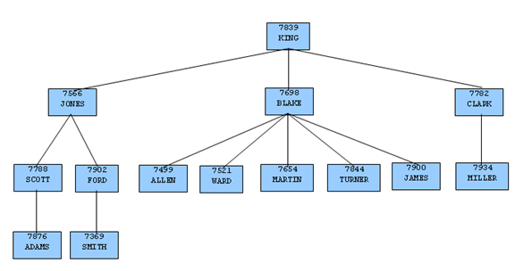

Advanced Server includes enhanced SQL functionality that provides additional flexibility and convenience.

This chapter describes these additions.

## Synonyms

A *synonym* is an identifier that can be used to reference another database object in a SQL statement. A synonym is useful in cases where a database object would normally require full qualification by schema name to be properly referenced in a SQL statement. A synonym defined for that object simplifies the reference to a single, unqualified name.

Advanced Server supports synonyms for:
 - Tables
 - Views
 - Sequences
 - Procedures
 - Functions
 - Types
 - Other synonyms

Neither the referenced schema or referenced object must exist at the time that you create the synonym; a synonym may refer to a non-existent object or schema. A synonym will become invalid if you drop the referenced object or schema. You must explicitly drop a synonym to remove it.

As with any other schema object, Advanced Server uses the search path to resolve unqualified synonym names. If you have two synonyms with the same name, an unqualified reference to a synonym will resolve to the first synonym with the given name in the search path. If public is in your search path, you can refer to a synonym in that schema without qualifying that name.

When Advanced Server executes an SQL command, the privileges of the current user are checked against the synonym’s underlying database object; if the user does not have the proper permissions for that object, the SQL command will fail.

**Creating a Synonym**

Use the CREATE SYNONYM command to create a synonym. The syntax is:

CREATE \[OR REPLACE\] \[PUBLIC\] SYNONYM \[schema.\]syn\_name
FOR object\_schema.object\_name;

**Parameters:**

*syn\_name*

*syn\_name* is the name of the synonym. A synonym name must be unique within a schema.

*schema*

*schema* specifies the name of the schema that the synonym resides in. If you do not specify a schema name, the synonym is created in the first existing schema in your search path.

*object\_name*

*object\_name* specifies the name of the object.

*object\_schema*

*object\_schema* specifies the name of the schema that the object resides in.

Include the REPLACE clause to replace an existing synonym definition with a new synonym definition.

Include the PUBLIC clause to create the synonym in the public schema. The CREATE PUBLIC SYNONYM command creates a synonym that resides in the public schema:

CREATE \[OR REPLACE\] PUBLIC SYNONYM syn\_name FOR object\_schema.object\_name;

This just a shorthand way to write:

CREATE \[OR REPLACE\] SYNONYM public.syn\_name FOR object\_schema.object\_name;

The following example creates a synonym named personnel that refers to the enterprisedb.emp table.

CREATE SYNONYM personnel FOR enterprisedb.emp;

Unless the synonym is schema qualified in the CREATE SYNONYM command, it will be created in the first existing schema in your search path. You can view your search path by executing the following command:

SHOW SEARCH\_PATH;

search\_path

\-----------------------

development,accounting

(1 row)

In our example, if a schema named development does not exist, the synonym will be created in the schema named accounting.

Now, the emp table in the enterprisedb schema can be referenced in any SQL statement (DDL or DML), by using the synonym, personnel:

INSERT INTO personnel VALUES (8142,'ANDERSON','CLERK',7902,'17-DEC-06',1300,NULL,20);

SELECT \* FROM personnel;

empno | ename | job | mgr | hiredate | sal | comm | deptno

\-------+----------+-----------+------+--------------------+---------+---------+--------

7369 | SMITH | CLERK | 7902 | 17-DEC-80 00:00:00 | 800.00 | | 20

7499 | ALLEN | SALESMAN | 7698 | 20-FEB-81 00:00:00 | 1600.00 | 300.00 | 30

7521 | WARD | SALESMAN | 7698 | 22-FEB-81 00:00:00 | 1250.00 | 500.00 | 30

7566 | JONES | MANAGER | 7839 | 02-APR-81 00:00:00 | 2975.00 | | 20

7654 | MARTIN | SALESMAN | 7698 | 28-SEP-81 00:00:00 | 1250.00 | 1400.00 | 30

7698 | BLAKE | MANAGER | 7839 | 01-MAY-81 00:00:00 | 2850.00 | | 30

7782 | CLARK | MANAGER | 7839 | 09-JUN-81 00:00:00 | 2450.00 | | 10

7788 | SCOTT | ANALYST | 7566 | 19-APR-87 00:00:00 | 3000.00 | | 20

7839 | KING | PRESIDENT | | 17-NOV-81 00:00:00 | 5000.00 | | 10

7844 | TURNER | SALESMAN | 7698 | 08-SEP-81 00:00:00 | 1500.00 | 0.00 | 30

7876 | ADAMS | CLERK | 7788 | 23-MAY-87 00:00:00 | 1100.00 | | 20

7900 | JAMES | CLERK | 7698 | 03-DEC-81 00:00:00 | 950.00 | | 30

7902 | FORD | ANALYST | 7566 | 03-DEC-81 00:00:00 | 3000.00 | | 20

7934 | MILLER | CLERK | 7782 | 23-JAN-82 00:00:00 | 1300.00 | | 10

8142 | ANDERSON | CLERK | 7902 | 17-DEC-06 00:00:00 | 1300.00 | | 20

(15 rows)

**Deleting a Synonym**

To delete a synonym, use the command, DROP SYNONYM. The syntax is:

DROP \[PUBLIC\] SYNONYM \[schema.\] syn\_name

**Parameters:**

*syn\_name*

*syn\_name* is the name of the synonym. A synonym name must be unique within a schema.

*schema*

*schema* specifies the name of the schema in which the synonym resides.

Like any other object that can be schema-qualified, you may have two synonyms with the same name in your search path. To disambiguate the name of the synonym that you are dropping, include a schema name. Unless a synonym is schema qualified in the DROP SYNONYM command, Advanced Server deletes the first instance of the synonym it finds in your search path.

You can optionally include the PUBLIC clause to drop a synonym that resides in the public schema. The DROP PUBLIC SYNONYM command drops a synonym that resides in the public schema:

DROP PUBLIC SYNONYM *syn*\_*name*;

The following example drops the synonym, personnel:

DROP SYNONYM personnel;

## Hierarchical Queries

A *hierarchical query* is a type of query that returns the rows of the result set in a hierarchical order based upon data forming a parent-child relationship. A hierarchy is typically represented by an inverted tree structure. The tree is comprised of interconnected *nodes*. Each node may be connected to none, one, or multiple *child* nodes. Each node is connected to one *parent* node except for the top node which has no parent. This node is the *root* node. Each tree has exactly one root node. Nodes that don’t have any children are called *leaf* nodes. A tree always has at least one leaf node - e.g., the trivial case where the tree is comprised of a single node. In this case it is both the root and the leaf.

In a hierarchical query the rows of the result set represent the nodes of one or more trees.

**Note:** It is possible that a single, given row may appear in more than one tree and thus appear more than once in the result set.

The hierarchical relationship in a query is described by the CONNECT BY clause which forms the basis of the order in which rows are returned in the result set. The context of where the CONNECT BY clause and its associated optional clauses appear in the SELECT command is shown below.

SELECT *select\_list* FROM *table\_expression* \[ WHERE ...\]

\[ START WITH *start\_expression* \]

CONNECT BY { PRIOR *parent\_expr* = *child\_expr* |

*child\_expr* = PRIOR *parent\_expr* }

\[ ORDER SIBLINGS BY *column1* \[ ASC | DESC \]

\[, *column2* \[ ASC | DESC \] \] ...

\[ GROUP BY ...\]

\[ HAVING ...\]

\[ *other* ...\]

*select\_list* is one or more expressions that comprise the fields of the result set. *table\_expression* is one or more tables or views from which the rows of the result set originate. *other* is any additional legal SELECT command clauses. The clauses pertinent to hierarchical queries, START WITH, CONNECT BY, and ORDER SIBLINGS BY are described in the following sections.

**Note:** At this time, Advanced Server does not support the use of AND (or other operators) in the CONNECT BY clause.

### Defining the Parent/Child Relationship

For any given row, its parent and its children are determined by the CONNECT BY clause. The CONNECT BY clause must consist of two expressions compared with the equals (=) operator. In addition, one of these two expressions must be preceded by the keyword, PRIOR.

For any given row, to determine its children:
 - Evaluate *parent\_expr* on the given row
 - Evaluate *child\_expr* on any other row resulting from the evaluation of *table\_expression*
 - If *parent\_expr* = *child\_expr*, then this row is a child node of the given parent row
 - Repeat the process for all remaining rows in *table\_expression*. All rows that satisfy the equation in step 3 are the children nodes of the given parent row.

**Note:** The evaluation process to determine if a row is a child node occurs on every row returned by *table\_expression* before the WHERE clause is applied to *table\_expression*.

By iteratively repeating this process treating each child node found in the prior steps as a parent, an inverted tree of nodes is constructed. The process is complete when the final set of child nodes has no children of their own - these are the leaf nodes.

A SELECT command that includes a CONNECT BY clause typically includes the START WITH clause. The START WITH clause determines the rows that are to be the root nodes - i.e., the rows that are the initial parent nodes upon which the algorithm described previously is to be applied. This is further explained in the following section.

### Selecting the Root Nodes

The START WITH clause is used to determine the row(s) selected by *table\_expression* that are to be used as the root nodes. All rows selected by *table\_expression* where *start\_expression* evaluates to true become a root node of a tree. Thus, the number of potential trees in the result set is equal to the number of root nodes. As a consequence, if the START WITH clause is omitted, then every row returned by *table\_expression* is a root of its own tree.

### Organization Tree in the Sample Application

Consider the emp table of the sample application. The rows of the emp table form a hierarchy based upon the mgr column which contains the employee number of the employee’s manager. Each employee has at most, one manager. KING is the president of the company so he has no manager, therefore KING’s mgr column is null. Also, it is possible for an employee to act as a manager for more than one employee. This relationship forms a typical, tree-structured, hierarchical organization chart as illustrated below.

Figure 1 Employee Organization Hierarchy

To form a hierarchical query based upon this relationship, the SELECT command includes the clause, CONNECT BY PRIOR empno = mgr. For example, given the company president, KING, with employee number 7839, any employee whose mgr column is 7839 reports directly to KING which is true for JONES, BLAKE, and CLARK (these are the child nodes of KING). Similarly, for employee, JONES, any other employee with mgr column equal to 7566 is a child node of JONES - these are SCOTT and FORD in this example.

The top of the organization chart is KING so there is one root node in this tree. The START WITH mgr IS NULL clause selects only KING as the initial root node.

The complete SELECT command is shown below.

SELECT ename, empno, mgr

FROM emp

START WITH mgr IS NULL

CONNECT BY PRIOR empno = mgr;

The rows in the query output traverse each branch from the root to leaf moving in a top-to-bottom, left-to-right order. Below is the output from this query.

ename | empno | mgr

\--------+-------+------

KING | 7839 |

JONES | 7566 | 7839

SCOTT | 7788 | 7566

ADAMS | 7876 | 7788

FORD | 7902 | 7566

SMITH | 7369 | 7902

BLAKE | 7698 | 7839

ALLEN | 7499 | 7698

WARD | 7521 | 7698

MARTIN | 7654 | 7698

TURNER | 7844 | 7698

JAMES | 7900 | 7698

CLARK | 7782 | 7839

MILLER | 7934 | 7782

(14 rows)

### Node Level

LEVEL is a pseudo-column that can be used wherever a column can appear in the SELECT command. For each row in the result set, LEVEL returns a non-zero integer value designating the depth in the hierarchy of the node represented by this row. The LEVEL for root nodes is 1. The LEVEL for direct children of root nodes is 2, and so on.

The following query is a modification of the previous query with the addition of the LEVEL pseudo-column. In addition, using the LEVEL value, the employee names are indented to further emphasize the depth in the hierarchy of each row.

SELECT LEVEL, LPAD (' ', 2 \* (LEVEL - 1)) || ename "employee", empno, mgr

FROM emp START WITH mgr IS NULL

CONNECT BY PRIOR empno = mgr;

The output from this query follows.

level | employee | empno | mgr

\-------+-------------+-------+------

1 | KING | 7839 |

2 | JONES | 7566 | 7839

3 | SCOTT | 7788 | 7566

4 | ADAMS | 7876 | 7788

3 | FORD | 7902 | 7566

4 | SMITH | 7369 | 7902

2 | BLAKE | 7698 | 7839

3 | ALLEN | 7499 | 7698

3 | WARD | 7521 | 7698

3 | MARTIN | 7654 | 7698

3 | TURNER | 7844 | 7698

3 | JAMES | 7900 | 7698

2 | CLARK | 7782 | 7839

3 | MILLER | 7934 | 7782

(14 rows)

Nodes that share a common parent and are at the same level are called *siblings*. For example in the above output, employees ALLEN, WARD, MARTIN, TURNER, and JAMES are siblings since they are all at level three with parent, BLAKE. JONES, BLAKE, and CLARK are siblings since they are at level two and KING is their common parent.

### Ordering the Siblings

The result set can be ordered so the siblings appear in ascending or descending order by selected column value(s) using the ORDER SIBLINGS BY clause. This is a special case of the ORDER BY clause that can be used only with hierarchical queries.

The previous query is further modified with the addition of ORDER SIBLINGS BY ename ASC.

SELECT LEVEL, LPAD (' ', 2 \* (LEVEL - 1)) || ename "employee", empno, mgr

FROM emp START WITH mgr IS NULL

CONNECT BY PRIOR empno = mgr

ORDER SIBLINGS BY ename ASC;

The output from the prior query is now modified so the siblings appear in ascending order by name. Siblings BLAKE, CLARK, and JONES are now alphabetically arranged under KING. Siblings ALLEN, JAMES, MARTIN, TURNER, and WARD are alphabetically arranged under BLAKE, and so on.

level | employee | empno | mgr

\-------+-------------+-------+------

1 | KING | 7839 |

2 | BLAKE | 7698 | 7839

3 | ALLEN | 7499 | 7698

3 | JAMES | 7900 | 7698

3 | MARTIN | 7654 | 7698

3 | TURNER | 7844 | 7698

3 | WARD | 7521 | 7698

2 | CLARK | 7782 | 7839

3 | MILLER | 7934 | 7782

2 | JONES | 7566 | 7839

3 | FORD | 7902 | 7566

4 | SMITH | 7369 | 7902

3 | SCOTT | 7788 | 7566

4 | ADAMS | 7876 | 7788

(14 rows)

This final example adds the WHERE clause and starts with three root nodes. After the node tree is constructed, the WHERE clause filters out rows in the tree to form the result set.

SELECT LEVEL, LPAD (' ', 2 \* (LEVEL - 1)) || ename "employee", empno, mgr

FROM emp WHERE mgr IN (7839, 7782, 7902, 7788)

START WITH ename IN ('BLAKE','CLARK','JONES')

CONNECT BY PRIOR empno = mgr

ORDER SIBLINGS BY ename ASC;

The output from the query shows three root nodes (level one) - BLAKE, CLARK, and JONES. In addition, rows that do not satisfy the WHERE clause have been eliminated from the output.

level | employee | empno | mgr

\-------+-----------+-------+------

1 | BLAKE | 7698 | 7839

1 | CLARK | 7782 | 7839

2 | MILLER | 7934 | 7782

1 | JONES | 7566 | 7839

3 | SMITH | 7369 | 7902

3 | ADAMS | 7876 | 7788

(6 rows)

### Retrieving the Root Node with CONNECT\_BY\_ROOT

CONNECT\_BY\_ROOT is a unary operator that can be used to qualify a column in order to return the column’s value of the row considered to be the root node in relation to the current row.

**Note:** A *unary operator* operates on a single operand, which in the case of CONNECT\_BY\_ROOT, is the column name following the CONNECT\_BY\_ROOT keyword.

In the context of the SELECT list, the CONNECT\_BY\_ROOT operator is shown by the following.

SELECT \[... ,\] CONNECT\_BY\_ROOT *column* \[, ...\]

FROM *table\_expression* ...

The following are some points to note about the CONNECT\_BY\_ROOT operator.
 - The CONNECT\_BY\_ROOT operator can be used in the SELECT list, the WHERE clause, the GROUP BY clause, the HAVING clause, the ORDER BY clause, and the ORDER SIBLINGS BY clause as long as the SELECT command is for a hierarchical query.
 - The CONNECT\_BY\_ROOT operator cannot be used in the CONNECT BY clause or the START WITH clause of the hierarchical query.
 - It is possible to apply CONNECT\_BY\_ROOT to an expression involving a column, but to do so, the expression must be enclosed within parentheses.

The following query shows the use of the CONNECT\_BY\_ROOT operator to return the employee number and employee name of the root node for each employee listed in the result set based on trees starting with employees BLAKE, CLARK, and JONES.

SELECT LEVEL, LPAD (' ', 2 \* (LEVEL - 1)) || ename "employee", empno, mgr,

CONNECT\_BY\_ROOT empno "mgr empno",

CONNECT\_BY\_ROOT ename "mgr ename"

FROM emp

START WITH ename IN ('BLAKE','CLARK','JONES')

CONNECT BY PRIOR empno = mgr

ORDER SIBLINGS BY ename ASC;

Note that the output from the query shows that all of the root nodes in columns mgr empno and mgr ename are one of the employees, BLAKE, CLARK, or JONES, listed in the START WITH clause.

level | employee | empno | mgr | mgr empno | mgr ename

\-------+-----------+-------+------+-----------+-----------

1 | BLAKE | 7698 | 7839 | 7698 | BLAKE

2 | ALLEN | 7499 | 7698 | 7698 | BLAKE

2 | JAMES | 7900 | 7698 | 7698 | BLAKE

2 | MARTIN | 7654 | 7698 | 7698 | BLAKE

2 | TURNER | 7844 | 7698 | 7698 | BLAKE

2 | WARD | 7521 | 7698 | 7698 | BLAKE

1 | CLARK | 7782 | 7839 | 7782 | CLARK

2 | MILLER | 7934 | 7782 | 7782 | CLARK

1 | JONES | 7566 | 7839 | 7566 | JONES

2 | FORD | 7902 | 7566 | 7566 | JONES

3 | SMITH | 7369 | 7902 | 7566 | JONES

2 | SCOTT | 7788 | 7566 | 7566 | JONES

3 | ADAMS | 7876 | 7788 | 7566 | JONES

(13 rows)

The following is a similar query, but producing only one tree starting with the single, top-level, employee where the mgr column is null.

SELECT LEVEL, LPAD (' ', 2 \* (LEVEL - 1)) || ename "employee", empno, mgr,

CONNECT\_BY\_ROOT empno "mgr empno",

CONNECT\_BY\_ROOT ename "mgr ename"

FROM emp START WITH mgr IS NULL

CONNECT BY PRIOR empno = mgr

ORDER SIBLINGS BY ename ASC;

In the following output, all of the root nodes in columns mgr empno and mgr ename indicate KING as the root for this particular query.

level | employee | empno | mgr | mgr empno | mgr ename

\-------+-------------+-------+------+-----------+-----------

1 | KING | 7839 | | 7839 | KING

2 | BLAKE | 7698 | 7839 | 7839 | KING

3 | ALLEN | 7499 | 7698 | 7839 | KING

3 | JAMES | 7900 | 7698 | 7839 | KING

3 | MARTIN | 7654 | 7698 | 7839 | KING

3 | TURNER | 7844 | 7698 | 7839 | KING

3 | WARD | 7521 | 7698 | 7839 | KING

2 | CLARK | 7782 | 7839 | 7839 | KING

3 | MILLER | 7934 | 7782 | 7839 | KING

2 | JONES | 7566 | 7839 | 7839 | KING

3 | FORD | 7902 | 7566 | 7839 | KING

4 | SMITH | 7369 | 7902 | 7839 | KING

3 | SCOTT | 7788 | 7566 | 7839 | KING

4 | ADAMS | 7876 | 7788 | 7839 | KING

(14 rows)

By contrast, the following example omits the START WITH clause thereby resulting in fourteen trees.

SELECT LEVEL, LPAD (' ', 2 \* (LEVEL - 1)) || ename "employee", empno, mgr,

CONNECT\_BY\_ROOT empno "mgr empno",

CONNECT\_BY\_ROOT ename "mgr ename"

FROM emp

CONNECT BY PRIOR empno = mgr

ORDER SIBLINGS BY ename ASC;

The following is the output from the query. Each node appears at least once as a root node under the mgr empno and mgr ename columns since even the leaf nodes form the top of their own trees.

level | employee | empno | mgr | mgr empno | mgr ename

\-------+-------------+-------+------+-----------+-----------

1 | ADAMS | 7876 | 7788 | 7876 | ADAMS

1 | ALLEN | 7499 | 7698 | 7499 | ALLEN

1 | BLAKE | 7698 | 7839 | 7698 | BLAKE

2 | ALLEN | 7499 | 7698 | 7698 | BLAKE

2 | JAMES | 7900 | 7698 | 7698 | BLAKE

2 | MARTIN | 7654 | 7698 | 7698 | BLAKE

2 | TURNER | 7844 | 7698 | 7698 | BLAKE

2 | WARD | 7521 | 7698 | 7698 | BLAKE

1 | CLARK | 7782 | 7839 | 7782 | CLARK

2 | MILLER | 7934 | 7782 | 7782 | CLARK

1 | FORD | 7902 | 7566 | 7902 | FORD

2 | SMITH | 7369 | 7902 | 7902 | FORD

1 | JAMES | 7900 | 7698 | 7900 | JAMES

1 | JONES | 7566 | 7839 | 7566 | JONES

2 | FORD | 7902 | 7566 | 7566 | JONES

3 | SMITH | 7369 | 7902 | 7566 | JONES

2 | SCOTT | 7788 | 7566 | 7566 | JONES

3 | ADAMS | 7876 | 7788 | 7566 | JONES

1 | KING | 7839 | | 7839 | KING

2 | BLAKE | 7698 | 7839 | 7839 | KING

3 | ALLEN | 7499 | 7698 | 7839 | KING

3 | JAMES | 7900 | 7698 | 7839 | KING

3 | MARTIN | 7654 | 7698 | 7839 | KING

3 | TURNER | 7844 | 7698 | 7839 | KING

3 | WARD | 7521 | 7698 | 7839 | KING

2 | CLARK | 7782 | 7839 | 7839 | KING

3 | MILLER | 7934 | 7782 | 7839 | KING

2 | JONES | 7566 | 7839 | 7839 | KING

3 | FORD | 7902 | 7566 | 7839 | KING

4 | SMITH | 7369 | 7902 | 7839 | KING

3 | SCOTT | 7788 | 7566 | 7839 | KING

4 | ADAMS | 7876 | 7788 | 7839 | KING

1 | MARTIN | 7654 | 7698 | 7654 | MARTIN

1 | MILLER | 7934 | 7782 | 7934 | MILLER

1 | SCOTT | 7788 | 7566 | 7788 | SCOTT

2 | ADAMS | 7876 | 7788 | 7788 | SCOTT

1 | SMITH | 7369 | 7902 | 7369 | SMITH

1 | TURNER | 7844 | 7698 | 7844 | TURNER

1 | WARD | 7521 | 7698 | 7521 | WARD

(39 rows)

The following illustrates the unary operator effect of CONNECT\_BY\_ROOT. As shown in this example, when applied to an expression that is not enclosed in parentheses, the CONNECT\_BY\_ROOT operator affects only the term, ename, immediately following it. The subsequent concatenation of || ' manages ' || ename is not part of the CONNECT\_BY\_ROOT operation, hence the second occurrence of ename results in the value of the currently processed row while the first occurrence of ename results in the value from the root node.

SELECT LEVEL, LPAD (' ', 2 \* (LEVEL - 1)) || ename "employee", empno, mgr,

CONNECT\_BY\_ROOT ename || ' manages ' || ename "top mgr/employee"

FROM emp

START WITH ename IN ('BLAKE','CLARK','JONES')

CONNECT BY PRIOR empno = mgr

ORDER SIBLINGS BY ename ASC;

The following is the output from the query. Note the values produced under the top mgr/employee column.

level | employee | empno | mgr | top mgr/employee

\-------+-----------+-------+------+----------------------

1 | BLAKE | 7698 | 7839 | BLAKE manages BLAKE

2 | ALLEN | 7499 | 7698 | BLAKE manages ALLEN

2 | JAMES | 7900 | 7698 | BLAKE manages JAMES

2 | MARTIN | 7654 | 7698 | BLAKE manages MARTIN

2 | TURNER | 7844 | 7698 | BLAKE manages TURNER

2 | WARD | 7521 | 7698 | BLAKE manages WARD

1 | CLARK | 7782 | 7839 | CLARK manages CLARK

2 | MILLER | 7934 | 7782 | CLARK manages MILLER

1 | JONES | 7566 | 7839 | JONES manages JONES

2 | FORD | 7902 | 7566 | JONES manages FORD

3 | SMITH | 7369 | 7902 | JONES manages SMITH

2 | SCOTT | 7788 | 7566 | JONES manages SCOTT

3 | ADAMS | 7876 | 7788 | JONES manages ADAMS

(13 rows)

The following example uses the CONNECT\_BY\_ROOT operator on an expression enclosed in parentheses.

SELECT LEVEL, LPAD (' ', 2 \* (LEVEL - 1)) || ename "employee", empno, mgr,

CONNECT\_BY\_ROOT ('Manager ' || ename || ' is emp \# ' || empno)

"top mgr/empno"

FROM emp

START WITH ename IN ('BLAKE','CLARK','JONES')

CONNECT BY PRIOR empno = mgr

ORDER SIBLINGS BY ename ASC;

The following is the output of the query. Note that the values of both ename and empno are affected by the CONNECT\_BY\_ROOT operator and as a result, return the values from the root node as shown under the top mgr/empno column.

level | employee | empno | mgr | top mgr/empno

\-------+-----------+-------+------+-----------------------------

1 | BLAKE | 7698 | 7839 | Manager BLAKE is emp \# 7698

2 | ALLEN | 7499 | 7698 | Manager BLAKE is emp \# 7698

2 | JAMES | 7900 | 7698 | Manager BLAKE is emp \# 7698

2 | MARTIN | 7654 | 7698 | Manager BLAKE is emp \# 7698

2 | TURNER | 7844 | 7698 | Manager BLAKE is emp \# 7698

2 | WARD | 7521 | 7698 | Manager BLAKE is emp \# 7698

1 | CLARK | 7782 | 7839 | Manager CLARK is emp \# 7782

2 | MILLER | 7934 | 7782 | Manager CLARK is emp \# 7782

1 | JONES | 7566 | 7839 | Manager JONES is emp \# 7566

2 | FORD | 7902 | 7566 | Manager JONES is emp \# 7566

3 | SMITH | 7369 | 7902 | Manager JONES is emp \# 7566

2 | SCOTT | 7788 | 7566 | Manager JONES is emp \# 7566

3 | ADAMS | 7876 | 7788 | Manager JONES is emp \# 7566

(13 rows)

### Retrieving a Path with SYS\_CONNECT\_BY\_PATH

SYS\_CONNECT\_BY\_PATH is a function that works within a hierarchical query to retrieve the column values of a specified column that occur between the current node and the root node. The signature of the function is:

> SYS\_CONNECT\_BY\_PATH (*column*, *delimiter*)

The function takes two arguments:

> *column* is the name of a column that resides within a table specified in the hierarchical query that is calling the function.
>
> *delimiter* is the varchar value that separates each entry in the specified column.

The following example returns a list of employee names, and their managers; if the manager has a manager, that name is appended to the result:

edb=\# SELECT level, ename , SYS\_CONNECT\_BY\_PATH(ename, '/') managers
FROM emp
CONNECT BY PRIOR empno = mgr
START WITH mgr IS NULL
ORDER BY level, ename, managers;

level | ename | managers

\-------+--------+-------------------------

1 | KING | /KING

2 | BLAKE | /KING/BLAKE

2 | CLARK | /KING/CLARK

2 | JONES | /KING/JONES

3 | ALLEN | /KING/BLAKE/ALLEN

3 | FORD | /KING/JONES/FORD

3 | JAMES | /KING/BLAKE/JAMES

3 | MARTIN | /KING/BLAKE/MARTIN

3 | MILLER | /KING/CLARK/MILLER

3 | SCOTT | /KING/JONES/SCOTT

3 | TURNER | /KING/BLAKE/TURNER

3 | WARD | /KING/BLAKE/WARD

4 | ADAMS | /KING/JONES/SCOTT/ADAMS

4 | SMITH | /KING/JONES/FORD/SMITH

(14 rows)

Within the result set:
 - The level column displays the number of levels that the query returned.
 - The ename column displays the employee name.
 - The managers column contains the hierarchical list of managers.

The Advanced Server implementation of SYS\_CONNECT\_BY\_PATH does not support use of:
 - SYS\_CONNECT\_BY\_PATH inside CONNECT\_BY\_PATH
 - SYS\_CONNECT\_BY\_PATH inside SYS\_CONNECT\_BY\_PATH

## Extended Functions and Operators

This section describes the extended functions and operators provided in Advanced Server.

### Logical Operators

The usual logical operators are available: AND, OR, NOT

SQL uses a three-valued Boolean logic where the null value represents "unknown". Observe the following truth tables:

Table 3‑3‑1 AND/OR Truth Table

|       |       |         |        |
| ----- | ----- | ------- | ------ |
| a     | b     | a AND b | a OR b |
| True  | True  | True    | True   |
| True  | False | False   | True   |
| True  | Null  | Null    | True   |
| False | False | False   | False  |
| False | Null  | False   | Null   |
| Null  | Null  | Null    | Null   |

Table 3‑3‑2 NOT Truth Table

|       |       |
| ----- | ----- |
| a     | NOT a |
| True  | False |
| False | True  |
| Null  | Null  |

The operators AND and OR are commutative, that is, you can switch the left and right operand without affecting the result.

### Comparison Operators

The usual comparison operators are shown in the following table.

Table 3‑3‑3 Comparison Operators

|          |                          |
| -------- | ------------------------ |
| Operator | Description              |
| \<       | Less than                |
| \>       | Greater than             |
| \<=      | Less than or equal to    |
| \>=      | Greater than or equal to |
| \=       | Equal                    |
| \<\>     | Not equal                |
| \!=      | Not equal                |

Comparison operators are available for all data types where this makes sense. All comparison operators are binary operators that return values of type BOOLEAN; expressions like 1 \< 2 \< 3 are not valid (because there is no \< operator to compare a Boolean value with 3).

In addition to the comparison operators, the special BETWEEN construct is available.

*a* BETWEEN *x* AND *y*

is equivalent to

*a* \>= *x* AND *a* \<= *y*

Similarly,

*a* NOT BETWEEN *x* AND *y*

is equivalent to

*a* \< *x* OR *a* \> *y*

There is no difference between the two respective forms apart from the CPU cycles required to rewrite the first one into the second one internally.

To check whether a value is or is not null, use the constructs

*expression* IS NULL

*expression* IS NOT NULL

Do not write *expression* = NULL because NULL is not "equal to" NULL. (The null value represents an unknown value, and it is not known whether two unknown values are equal.) This behavior conforms to the SQL standard.

Some applications may expect that *expression* = NULL returns true if *expression* evaluates to the null value. It is highly recommended that these applications be modified to comply with the SQL standard.

### Mathematical Functions and Operators

Mathematical operators are provided for many Advanced Server types. For types without common mathematical conventions for all possible permutations (e.g., date/time types) the actual behavior is described in subsequent sections.

The following table shows the available mathematical operators.

Table 3‑3‑4 Mathematical Operators

|          |                                               |          |        |
| -------- | --------------------------------------------- | -------- | ------ |
| Operator | Description                                   | Example  | Result |
| \+       | Addition                                      | 2 + 3    | 5      |
| \-       | Subtraction                                   | 2 – 3    | \-1    |
| \*       | Multiplication                                | 2 \* 3   | 6      |
| /        | Division (integer division truncates results) | 4 / 2    | 2      |
| \*\*     | Exponentiation Operator                       | 2 \*\* 3 | 8      |

The following table shows the available mathematical functions. Many of these functions are provided in multiple forms with different argument types. Except where noted, any given form of a function returns the same data type as its argument. The functions working with DOUBLE PRECISION data are mostly implemented on top of the host system’s C library; accuracy and behavior in boundary cases may therefore vary depending on the host system.

Table 3‑3‑5 Mathematical Functions

|                                                                       |                                                                        |                                                                                                                             |                                      |                      |
| --------------------------------------------------------------------- | ---------------------------------------------------------------------- | --------------------------------------------------------------------------------------------------------------------------- | ------------------------------------ | -------------------- |
| Function                                                              | Return Type                                                            | Description                                                                                                                 | Example                              | Result               |
| ABS(*x*)                                                              | Same as *x*                                                            | Absolute value                                                                                                              | ABS(-17.4)                           | 17.4                 |
| CEIL(DOUBLE PRECISION or NUMBER)                                      | Same as input                                                          | Smallest integer not less than argument                                                                                     | CEIL(-42.8)                          | \-42                 |
| EXP(DOUBLE PRECISION or NUMBER)                                       | Same as input                                                          | Exponential                                                                                                                 | EXP(1.0)                             | 2.7182818284590452   |
| FLOOR(DOUBLE PRECISION or NUMBER)                                     | Same as input                                                          | Largest integer not greater than argument                                                                                   | FLOOR(-42.8)                         | 43                   |
| LN(DOUBLE PRECISION or NUMBER)                                        | Same as input                                                          | Natural logarithm                                                                                                           | LN(2.0)                              | 0.6931471805599453   |
| LOG(*b* NUMBER, *x* NUMBER)                                           | NUMBER                                                                 | Logarithm to base *b*                                                                                                       | LOG(2.0, 64.0)                       | 6.0000000000000000   |
| MOD(*y*, *x*)                                                         | Same as argument types                                                 | Remainder of *y*/*x*                                                                                                        | MOD(9, 4)                            | 1                    |
| NVL(*x*, *y*)                                                         | Same as argument types; where both arguments are of the same data type | If *x* is null, then NVL returns *y*                                                                                        | NVL(9, 0)                            | 9                    |
| POWER(*a* DOUBLE PRECISION, *b* DOUBLE PRECISION)                     | DOUBLE PRECISION                                                       | *a* raised to the power of *b*                                                                                              | POWER(9.0, 3.0)                      | 729.0000000000000000 |
| POWER(*a* NUMBER, *b* NUMBER)                                         | NUMBER                                                                 | *a* raised to the power of *b*                                                                                              | POWER(9.0, 3.0)                      | 729.0000000000000000 |
| ROUND(DOUBLE PRECISION or NUMBER)                                     | Same as input                                                          | Round to nearest integer                                                                                                    | ROUND(42.4)                          | 42                   |
| ROUND(*v* NUMBER, *s* INTEGER)                                        | NUMBER                                                                 | Round to *s* decimal places                                                                                                 | ROUND(42.4382, 2)                    | 42.44                |
| SIGN(DOUBLE PRECISION or NUMBER)                                      | Same as input                                                          | Sign of the argument (-1, 0, +1)                                                                                            | SIGN(-8.4)                           | \-1                  |
| SQRT(DOUBLE PRECISION or NUMBER)                                      | Same as input                                                          | Square root                                                                                                                 | SQRT(2.0)                            | 1.414213562373095    |
| TRUNC(DOUBLE PRECISION or NUMBER)                                     | Same as input                                                          | Truncate toward zero                                                                                                        | TRUNC(42.8)                          | 42                   |
| TRUNC(*v* NUMBER, *s* INTEGER)                                        | NUMBER                                                                 | Truncate to s decimal places                                                                                                | TRUNC(42.4382, 2)                    | 42.43                |
| WIDTH\_BUCKET(*op* NUMBER, *b1* NUMBER, *b2* NUMBER, *count* INTEGER) | INTEGER                                                                | Return the bucket to which *op* would be assigned in an equidepth histogram with *count* buckets, in the range *b1* to *b2* | WIDTH\_BUCKET(5.35, 0.024, 10.06, 5) | 3                    |

The following table shows the available trigonometric functions. All trigonometric functions take arguments and return values of type DOUBLE PRECISION.

Table 3‑3‑6 Trigonometric Functions

|                 |                            |
| --------------- | -------------------------- |
| Function        | Description                |
| ACOS(*x*)       | Inverse cosine             |
| ASIN(*x*)       | Inverse sine               |
| ATAN(*x*)       | Inverse tangent            |
| ATAN2(*x*, *y*) | Inverse tangent of *x*/*y* |
| COS(*x*)        | Cosine                     |
| SIN(*x*)        | Sine                       |
| TAN(*x*)        | Tangent                    |

### String Functions and Operators

This section describes functions and operators for examining and manipulating string values. Strings in this context include values of the types CHAR, VARCHAR2, and CLOB. Unless otherwise noted, all of the functions listed below work on all of these types, but be wary of potential effects of automatic padding when using the CHAR type. Generally, the functions described here also work on data of non-string types by converting that data to a string representation first.

Table 3‑3‑7 SQL String Functions and Operators

|                                                                        |             |                                                                                                                                                                                                                            |                                                                     |              |
| ---------------------------------------------------------------------- | ----------- | -------------------------------------------------------------------------------------------------------------------------------------------------------------------------------------------------------------------------- | ------------------------------------------------------------------- | ------------ |
| Function                                                               | Return Type | Description                                                                                                                                                                                                                | Example                                                             | Result       |
| *string* || *string*                                                   | CLOB        | String concatenation                                                                                                                                                                                                       | 'Enterprise' || 'DB'                                                | EnterpriseDB |
| CONCAT(*string*, *string*)                                             | CLOB        | String concatenation                                                                                                                                                                                                       | 'a' || 'b'                                                          | ab           |
| HEXTORAW(*varchar2*)                                                   | RAW         | Converts a VARCHAR2 value to a RAW value                                                                                                                                                                                   | HEXTORAW('303132')                                                  | '012'        |
| RAWTOHEX(*raw*)                                                        | VARCHAR2    | Converts a RAW value to a HEXADECIMAL value                                                                                                                                                                                | RAWTOHEX('012')                                                     | '303132'     |
| INSTR(*string*, *set*, \[ *start* \[, *occurrence* \] \])              | INTEGER     | Finds the location of a set of characters in a string, starting at position *start* in the string, *string*, and looking for the first, second, third and so on occurrences of the set. Returns 0 if the set is not found. | INSTR('PETER PIPER PICKED a PECK of PICKLED PEPPERS','PI',1,3)      | 30           |
| INSTRB(*string*, *set*)                                                | INTEGER     | Returns the position of the *set* within the *string*. Returns 0 if *set* is not found.                                                                                                                                    | INSTRB('PETER PIPER PICKED a PECK of PICKLED PEPPERS', 'PICK')      | 13           |
| INSTRB(*string*, *set*, *start*)                                       | INTEGER     | Returns the position of the *set* within the *string*, beginning at *start*. Returns 0 if *set* is not found.                                                                                                              | INSTRB('PETER PIPER PICKED a PECK of PICKLED PEPPERS','PICK', 14)   | 30           |
| INSTRB(*string*, *set*, *start*, *occurrence*)                         | INTEGER     | Returns the position of the specified *occurrence* of *set* within the *string*, beginning at *start*. Returns 0 if *set* is not found.                                                                                    | INSTRB('PETER PIPER PICKED a PECK of PICKLED PEPPERS','PICK', 1, 2) | 30           |
| LOWER(*string*)                                                        | CLOB        | Convert *string* to lower case                                                                                                                                                                                             | LOWER('TOM')                                                        | tom          |
| SUBSTR(*string*, *start* \[, *count* \])                               | CLOB        | Extract substring starting from *start* and going for *count* characters. If *count* is not specified, the string is clipped from the start till the end.                                                                  | SUBSTR('This is a test',6,2)                                        | is           |
| SUBSTRB(*string*, *start* \[, *count* \])                              | CLOB        | Same as SUBSTR except *start* and *count* are in number of bytes.                                                                                                                                                          | SUBSTRB('abc',3) (assuming a double-byte character set)             | c            |
| SUBSTR2(*string*, *start* \[, *count* \])                              | CLOB        | Alias for SUBSTR.                                                                                                                                                                                                          | SUBSTR2('This is a test',6,2)                                       | is           |
| SUBSTR2(*string*, *start* \[, *count* \])                              | CLOB        | Alias for SUBSTRB.                                                                                                                                                                                                         | SUBSTR2('abc',3) (assuming a double-byte character set)             | c            |
| SUBSTR4(*string*, *start* \[, *count* \])                              | CLOB        | Alias for SUBSTR.                                                                                                                                                                                                          | SUBSTR4('This is a test',6,2)                                       | is           |
| SUBSTR4(*string*, *start* \[, *count* \])                              | CLOB        | Alias for SUBSTRB.                                                                                                                                                                                                         | SUBSTR4('abc',3) (assuming a double-byte character set)             | c            |
| SUBSTRC(*string*, *start* \[, *count* \])                              | CLOB        | Alias for SUBSTR.                                                                                                                                                                                                          | SUBSTRC('This is a test',6,2)                                       | is           |
| SUBSTRC(*string*, *start* \[, *count* \])                              | CLOB        | Alias for SUBSTRB.                                                                                                                                                                                                         | SUBSTRC('abc',3) (assuming a double-byte character set)             | c            |
| TRIM(\[ LEADING | TRAILING | BOTH \] \[ *characters* \] FROM *string*) | CLOB        | Remove the longest string containing only the characters (a space by default) from the start/end/both ends of the string.                                                                                                  | TRIM(BOTH 'x' FROM 'xTomxx')                                        | Tom          |
| LTRIM(*string* \[, *set*\])                                            | CLOB        | Removes all the characters specified in *set* from the left of a given *string*. If *set* is not specified, a blank space is used as default.                                                                              | LTRIM('abcdefghi', 'abc')                                           | defghi       |
| RTRIM(*string* \[, *set*\])                                            | CLOB        | Removes all the characters specified in *set* from the right of a given *string*. If *set* is not specified, a blank space is used as default.                                                                             | RTRIM('abcdefghi', 'ghi')                                           | abcdef       |
| UPPER(*string*)                                                        | CLOB        | Convert *string* to upper case                                                                                                                                                                                             | UPPER('tom')                                                        | TOM          |

Additional string manipulation functions are available and are listed in the following table. Some of them are used internally to implement the SQL-standard string functions listed in Table 3‑3‑7.

Table 3‑3‑8 Other String Functions

|                                                                                  |                                                             |                                                                                                                                                                                                                                               |                                                     |           |
| -------------------------------------------------------------------------------- | ----------------------------------------------------------- | --------------------------------------------------------------------------------------------------------------------------------------------------------------------------------------------------------------------------------------------- | --------------------------------------------------- | --------- |
| Function                                                                         | Return Type                                                 | Description                                                                                                                                                                                                                                   | Example                                             | Result    |
| ASCII(*string*)                                                                  | INTEGER                                                     | ASCII code of the first byte of the argument                                                                                                                                                                                                  | ASCII('x')                                          | 120       |
| CHR(INTEGER)                                                                     | CLOB                                                        | Character with the given ASCII code                                                                                                                                                                                                           | CHR(65)                                             | A         |
| DECODE(*expr*, *expr1a*, *expr1b* \[, *expr2a*, *expr2b* \]... \[, *default* \]) | Same as argument types of *expr1b*, *expr2b*,..., *default* | Finds first match of *expr* with *expr1a*, *expr2a*, etc. When match found, returns corresponding parameter pair, *expr1b*, *expr2b*, etc. If no match found, returns *default*. If no match found and *default* not specified, returns null. | DECODE(3, 1,'One', 2,'Two', 3,'Three', 'Not found') | Three     |
| INITCAP(*string*)                                                                | CLOB                                                        | Convert the first letter of each word to uppercase and the rest to lowercase. Words are sequences of alphanumeric characters separated by non-alphanumeric characters.                                                                        | INITCAP('hi THOMAS')                                | Hi Thomas |
| LENGTH                                                                           | INTEGER                                                     | Returns the number of characters in a string value.                                                                                                                                                                                           | LENGTH('Côte d''Azur')                              | 11        |
| LENGTHC                                                                          | INTEGER                                                     | This function is identical in functionality to LENGTH; the function name is supported for compatibility.                                                                                                                                      | LENGTHC('Côte d''Azur')                             | 11        |
| LENGTH2                                                                          | INTEGER                                                     | This function is identical in functionality to LENGTH; the function name is supported for compatibility.                                                                                                                                      | LENGTH2('Côte d''Azur')                             | 11        |
| LENGTH4                                                                          | INTEGER                                                     | This function is identical in functionality to LENGTH; the function name is supported for compatibility.                                                                                                                                      | LENGTH4('Côte d''Azur')                             | 11        |
| LENGTHB                                                                          | INTEGER                                                     | Returns the number of bytes required to hold the given value.                                                                                                                                                                                 | LENGTHB('Côte d''Azur')                             | 12        |
| LPAD(*string*, *length* INTEGER \[, *fill* \])                                   | CLOB                                                        | Fill up *string* to size, *length* by prepending the characters, *fill* (a space by default). If *string* is already longer than *length* then it is truncated (on the right).                                                                | LPAD('hi', 5, 'xy')                                 | xyxhi     |
| REPLACE(*string*, *search\_string* \[, *replace\_string* \]                      | CLOB                                                        | Replaces one value in a string with another. If you do not specify a value for *replace\_string*, the *search\_string* value when found, is removed.                                                                                          | REPLACE( 'GEORGE', 'GE', 'EG')                      | EGOREG    |
| RPAD(*string*, *length* INTEGER \[, *fill* \])                                   | CLOB                                                        | Fill up *string* to size, *length* by appending the characters, *fill* (a space by default). If *string* is already longer than *length* then it is truncated.                                                                                | RPAD('hi', 5, 'xy')                                 | hixyx     |
| TRANSLATE(*string*, *from*, *to*)                                                | CLOB                                                        | Any character in *string* that matches a character in the *from* set is replaced by the corresponding character in the *to* set.                                                                                                              | TRANSLATE('12345', '14', 'ax')                      | a23x5     |

### Pattern Matching String Functions

Advanced Server offers support for the REGEXP\_COUNT, REGEXP\_INSTR and REGEXP\_SUBSTR functions. These functions search a string for a pattern specified by a regular expression, and return information about occurrences of the pattern within the string. The pattern should be a POSIX-style regular expression; for more information about forming a POSIX-style regular expression, please refer to the core documentation at:

<http://www.postgresql.org/docs/9.5/static/functions-matching.html>

#### REGEXP\_COUNT

REGEXP\_COUNT searches a string for a regular expression, and returns a count of the times that the regular expression occurs. The signature is:

INTEGER REGEXP\_COUNT
(
*srcstr* TEXT,
*pattern* TEXT,
*position* DEFAULT 1
*modifier* DEFAULT NULL
)

**Parameters**

*srcstr*

*srcstr* specifies the string to search.

*pattern*

*pattern* specifies the regular expression for which REGEXP\_COUNT will search.

*position*

*position* is an integer value that indicates the position in the source string at which REGEXP\_COUNT will begin searching. The default value is 1.

*modifier*

*modifier* specifies values that control the pattern matching behavior. The default value is NULL. For a complete list of the modifiers supported by Advanced Server, please refer to the PostgreSQL core documentation available at:

<http://www.postgresql.org/docs/9.5/static/functions-matching.html>

**Example**

In the following simple example, REGEXP\_COUNT returns a count of the number of times the letter i is used in the character string 'reinitializing':

edb=\# SELECT REGEXP\_COUNT('reinitializing', 'i', 1) FROM DUAL;

regexp\_count

\--------------

5

(1 row)

In the first example, the command instructs REGEXP\_COUNT begins counting in the first position; if we modify the command to start the count on the 6th position:

edb=\# SELECT REGEXP\_COUNT('reinitializing', 'i', 6) FROM DUAL;

regexp\_count

\--------------

3

(1 row)

REGEXP\_COUNT returns 3; the count now excludes any occurrences of the letter i that occur before the 6th position.

#### REGEXP\_INSTR

REGEXP\_INSTR searches a string for a POSIX-style regular expression. This function returns the position within the string where the match was located. The signature is:

INTEGER REGEXP\_INSTR
(
*srcstr* TEXT,
*pattern* TEXT,
*position* INT DEFAULT 1,
*occurrence* INT DEFAULT 1,
*returnparam* INT DEFAULT 0,
*modifier* TEXT DEFAULT NULL,
*subexpression* INT DEFAULT 0,
)

**Parameters**

*srcstr*

*srcstr* specifies the string to search.

*pattern*

*pattern* specifies the regular expression for which REGEXP\_INSTR will search.

*position*

*position* specifies an integer value that indicates the start position in a source string. The default value is 1.

*occurrence*

*occurrence* specifies which match is returned if more than one occurrence of the pattern occurs in the string that is searched. The default value is 1.

*returnparam*

*returnparam* is an integer value that specifies the location within the string that REGEXP\_INSTR should return. The default value is 0. Specify:

> 0 to return the location within the string of the first character that matches *pattern*.
>
> A value greater than 0 to return the position of the first character following the end of the *pattern*.

*modifier*

*modifier* specifies values that control the pattern matching behavior. The default value is NULL. For a complete list of the modifiers supported by Advanced Server, please refer to the PostgreSQL core documentation available at:

> <http://www.postgresql.org/docs/9.5/static/functions-matching.html>

*subexpression*

*subexpression* is an integer value that identifies the portion of the *pattern* that will be returned by REGEXP\_INSTR. The default value of *subexpression* is 0.

If you specify a value for *subexpression*, you must include one (or more) set of parentheses in the *pattern* that isolate a portion of the value being searched for. The value specified by *subexpression* indicates which set of parentheses should be returned; for example, if *subexpression* is 2, REGEXP\_INSTR will return the position of the second set of parentheses.

**Example**

In the following simple example, REGEXP\_INSTR searches a string that contains the a phone number for the first occurrence of a pattern that contains three consecutive digits:

edb=\# SELECT REGEXP\_INSTR('800-555-1212', '\[0-9\]\[0-9\]\[0-9\]', 1, 1) FROM DUAL;

regexp\_instr

\--------------

1

(1 row)

The command instructs REGEXP\_INSTR to return the position of the first occurrence. If we modify the command to return the start of the second occurrence of three consecutive digits:

edb=\# SELECT REGEXP\_INSTR('800-555-1212', '\[0-9\]\[0-9\]\[0-9\]', 1, 2) FROM DUAL;

regexp\_instr

\--------------

5

(1 row)

REGEXP\_INSTR returns 5; the second occurrence of three consecutive digits begins in the fifth position.

#### REGEXP\_SUBSTR

The REGEXP\_SUBSTR function searches a string for a pattern specified by a POSIX compliant regular expression. REGEXP\_SUBSTR returns the string that matches the pattern specified in the call to the function. The signature of the function is:

TEXT REGEXP\_SUBSTR
(
*srcstr* TEXT,
*pattern* TEXT,
*position* INT DEFAULT 1,
*occurrence* INT DEFAULT 1,
*modifier* TEXT DEFAULT NULL,
*subexpression* INT DEFAULT 0
)

**Parameters**

*srcstr*

*srcstr* specifies the string to search.

*pattern*

*pattern* specifies the regular expression for which REGEXP\_SUBSTR will search.

*position*

*position* specifies an integer value that indicates the start position in a source string. The default value is 1.

*occurrence*

*occurrence* specifies which match is returned if more than one occurrence of the pattern occurs in the string that is searched. The default value is 1.

*modifier*

*modifier* specifies values that control the pattern matching behavior. The default value is NULL. For a complete list of the modifiers supported by Advanced Server, refer to the PostgreSQL core documentation available at:

<http://www.postgresql.org/docs/9.5/static/functions-matching.html>

*subexpression*

*subexpression* is an integer value that identifies the portion of the *pattern* that will be returned by REGEXP\_SUBSTR. The default value of *subexpression* is 0.

If you specify a value for *subexpression*, you must include one (or more) set of parentheses in the *pattern* that isolate a portion of the value being searched for. The value specified by *subexpression* indicates which set of parentheses should be returned; for example, if *subexpression* is 2, REGEXP\_SUBSTR will return the value contained within the second set of parentheses.

**Example**

In the following simple example, REGEXP\_SUBSTR searches a string that contains a phone number for the first set of three consecutive digits:

edb=\# SELECT REGEXP\_SUBSTR('800-555-1212', '\[0-9\]\[0-9\]\[0-9\]', 1, 1) FROM DUAL;

regexp\_substr

\---------------

800

(1 row)

It locates the first occurrence of three digits and returns the string (800); if we modify the command to check for the second occurrence of three consecutive digits:

edb=\# SELECT REGEXP\_SUBSTR('800-555-1212', '\[0-9\]\[0-9\]\[0-9\]', 1, 2) FROM DUAL;

regexp\_substr

\---------------

555

(1 row)

REGEXP\_SUBSTR returns 555, the contents of the second substring.

### Pattern Matching Using the LIKE Operator

Advanced Server provides pattern matching using the traditional SQL LIKE operator. The syntax for the LIKE operator is as follows.

*string* LIKE *pattern* \[ ESCAPE *escape-character* \]

*string* NOT LIKE *pattern* \[ ESCAPE *escape-character* \]

Every *pattern* defines a set of strings. The LIKE expression returns TRUE if *string* is contained in the set of strings represented by *pattern*. As expected, the NOT LIKE expression returns FALSE if LIKE returns TRUE, and vice versa. An equivalent expression is NOT (*string* LIKE *pattern*).

If *pattern* does not contain percent signs or underscore, then the pattern only represents the string itself; in that case LIKE acts like the equals operator. An underscore (\_) in *pattern* stands for (matches) any single character; a percent sign (%) matches any string of zero or more characters.

Some examples:

'abc' LIKE 'abc' true

'abc' LIKE 'a%' true

'abc' LIKE '\_b\_' true

'abc' LIKE 'c' false

LIKE pattern matches always cover the entire string. To match a pattern anywhere within a string, the pattern must therefore start and end with a percent sign.

To match a literal underscore or percent sign without matching other characters, the respective character in *pattern* must be preceded by the escape character. The default escape character is the backslash but a different one may be selected by using the ESCAPE clause. To match the escape character itself, write two escape characters.

Note that the backslash already has a special meaning in string literals, so to write a pattern constant that contains a backslash you must write two backslashes in an SQL statement. Thus, writing a pattern that actually matches a literal backslash means writing four backslashes in the statement. You can avoid this by selecting a different escape character with ESCAPE; then a backslash is not special to LIKE anymore. (But it is still special to the string literal parser, so you still need two of them.)

It’s also possible to select no escape character by writing ESCAPE ''. This effectively disables the escape mechanism, which makes it impossible to turn off the special meaning of underscore and percent signs in the pattern.

### Data Type Formatting Functions

The Advanced Server formatting functions (described in Table 3‑3‑9) provide a powerful set of tools for converting various data types (date/time, integer, floating point, numeric) to formatted strings and for converting from formatted strings to specific data types. These functions all follow a common calling convention: the first argument is the value to be formatted and the second argument is a string template that defines the output or input format.

Table 3‑3‑9 Formatting Functions

|                                      |             |                                                                                                |                                                                       |                        |
| ------------------------------------ | ----------- | ---------------------------------------------------------------------------------------------- | --------------------------------------------------------------------- | ---------------------- |
| Function                             | Return Type | Description                                                                                    | Example                                                               | Result                 |
| TO\_CHAR(DATE \[, *format* \])       | VARCHAR2    | Convert a date/time to a string with output, *format*. If omitted default format is DD-MON-YY. | TO\_CHAR(SYSDATE, 'MM/DD/YYYY HH12:MI:SS AM')                         | 07/25/2007 09:43:02 AM |
| TO\_CHAR(TIMESTAMP \[, *format* \])  | VARCHAR2    | Convert a timestamp to a string with output, *format*. If omitted default format is DD-MON-YY. | TO\_CHAR(CURRENT\_TIMESTAMP, 'MM/DD/YYYY HH12:MI:SS AM')              | 08/13/2014 08:55:22 PM |
| TO\_CHAR(INTEGER \[, *format* \])    | VARCHAR2    | Convert an integer to a string with output, *format*                                           | TO\_CHAR(2412, '999,999S')                                            | 2,412+                 |
| TO\_CHAR(NUMBER \[, *format* \])     | VARCHAR2    | Convert a decimal number to a string with output, *format*                                     | TO\_CHAR(10125.35, '999,999.99')                                      | 10,125.35              |
| TO\_CHAR(DOUBLE PRECISION, *format*) | VARCHAR2    | Convert a floating-point number to a string with output, *format*                              | TO\_CHAR(CAST(123.5282 AS REAL), '999.99')                            | 123.53                 |
| TO\_DATE(*string* \[, *format* \])   | DATE        | Convert a date formatted string to a DATE data type                                            | TO\_DATE('2007-07-04 13:39:10', 'YYYY-MM-DD HH24:MI:SS')              | 04-JUL-07 13:39:10     |
| TO\_NUMBER(*string* \[, *format* \]) | NUMBER      | Convert a number formatted string to a NUMBER data type                                        | TO\_NUMBER('2,412-', '999,999S')                                      | \-2412                 |
| TO\_TIMESTAMP(*string*, *format*)    | TIMESTAMP   | Convert a timestamp formatted string to a TIMESTAMP data type                                  | TO\_TIMESTAMP('05 Dec 2000 08:30:25 pm', 'DD Mon YYYY hh12:mi:ss pm') | 05-DEC-00 20:30:25     |

In an output template string (for TO\_CHAR), there are certain patterns that are recognized and replaced with appropriately-formatted data from the value to be formatted. Any text that is not a template pattern is simply copied verbatim. Similarly, in an input template string (for anything but TO\_CHAR), template patterns identify the parts of the input data string to be looked at and the values to be found there.

The following table shows the template patterns available for formatting date values using the TO\_CHAR and TO\_DATE functions.

Table 3‑3‑10 Template Date/Time Format Patterns

<table>
<tbody>
<tr class="odd">
<td>Pattern</td>
<td>Description</td>
</tr>
<tr class="even">
<td>HH</td>
<td>Hour of day (01-12)</td>
</tr>
<tr class="odd">
<td>HH12</td>
<td>Hour of day (01-12)</td>
</tr>
<tr class="even">
<td>HH24</td>
<td>Hour of day (00-23)</td>
</tr>
<tr class="odd">
<td>MI</td>
<td>Minute (00-59)</td>
</tr>
<tr class="even">
<td>SS</td>
<td>Second (00-59)</td>
</tr>
<tr class="odd">
<td>SSSSS</td>
<td>Seconds past midnight (0-86399)</td>
</tr>
<tr class="even">
<td>FF<em>n</em></td>
<td>Fractional seconds where <em>n</em> is an optional integer from 1 to 9 for the number of digits to return. If omitted, the default is 6.</td>
</tr>
<tr class="odd">
<td>AM or A.M. or PM or P.M.</td>
<td>Meridian indicator (uppercase)</td>
</tr>
<tr class="even">
<td>am or a.m. or pm or p.m.</td>
<td>Meridian indicator (lowercase)</td>
</tr>
<tr class="odd">
<td>Y,YYY</td>
<td>Year (4 and more digits) with comma</td>
</tr>
<tr class="even">
<td>YEAR</td>
<td>Year (spelled out)</td>
</tr>
<tr class="odd">
<td>SYEAR</td>
<td>Year (spelled out) (BC dates prefixed by a minus sign)</td>
</tr>
<tr class="even">
<td>YYYY</td>
<td>Year (4 and more digits)</td>
</tr>
<tr class="odd">
<td>SYYYY</td>
<td>Year (4 and more digits) (BC dates prefixed by a minus sign)</td>
</tr>
<tr class="even">
<td>YYY</td>
<td>Last 3 digits of year</td>
</tr>
<tr class="odd">
<td>YY</td>
<td>Last 2 digits of year</td>
</tr>
<tr class="even">
<td>Y</td>
<td>Last digit of year</td>
</tr>
<tr class="odd">
<td>IYYY</td>
<td>ISO year (4 and more digits)</td>
</tr>
<tr class="even">
<td>IYY</td>
<td>Last 3 digits of ISO year</td>
</tr>
<tr class="odd">
<td>IY</td>
<td>Last 2 digits of ISO year</td>
</tr>
<tr class="even">
<td>I</td>
<td>Last 1 digit of ISO year</td>
</tr>
<tr class="odd">
<td>BC or B.C. or AD or A.D.</td>
<td>Era indicator (uppercase)</td>
</tr>
<tr class="even">
<td>bc or b.c. or ad or a.d.</td>
<td>Era indicator (lowercase)</td>
</tr>
<tr class="odd">
<td>MONTH</td>
<td>Full uppercase month name</td>
</tr>
<tr class="even">
<td>Month</td>
<td>Full mixed-case month name</td>
</tr>
<tr class="odd">
<td>month</td>
<td>Full lowercase month name</td>
</tr>
<tr class="even">
<td>MON</td>
<td>Abbreviated uppercase month name (3 chars in English, localized lengths vary)</td>
</tr>
<tr class="odd">
<td>Mon</td>
<td>Abbreviated mixed-case month name (3 chars in English, localized lengths vary)</td>
</tr>
<tr class="even">
<td>mon</td>
<td>Abbreviated lowercase month name (3 chars in English, localized lengths vary)</td>
</tr>
<tr class="odd">
<td>MM</td>
<td>Month number (01-12)</td>
</tr>
<tr class="even">
<td>DAY</td>
<td>Full uppercase day name</td>
</tr>
<tr class="odd">
<td>Day</td>
<td>Full mixed-case day name</td>
</tr>
<tr class="even">
<td>day</td>
<td>Full lowercase day name</td>
</tr>
<tr class="odd">
<td>DY</td>
<td>Abbreviated uppercase day name (3 chars in English, localized lengths vary)</td>
</tr>
<tr class="even">
<td>Dy</td>
<td>Abbreviated mixed-case day name (3 chars in English, localized lengths vary)</td>
</tr>
<tr class="odd">
<td>dy</td>
<td>Abbreviated lowercase day name (3 chars in English, localized lengths vary)</td>
</tr>
<tr class="even">
<td>DDD</td>
<td>Day of year (001-366)</td>
</tr>
<tr class="odd">
<td>DD</td>
<td>Day of month (01-31)</td>
</tr>
<tr class="even">
<td>D</td>
<td>Day of week (1-7; Sunday is 1)</td>
</tr>
<tr class="odd">
<td>W</td>
<td>Week of month (1-5) (The first week starts on the first day of the month)</td>
</tr>
<tr class="even">
<td>WW</td>
<td>Week number of year (1-53) (The first week starts on the first day of the year)</td>
</tr>
<tr class="odd">
<td>IW</td>
<td>ISO week number of year; the first Thursday of the new year is in week 1</td>
</tr>
<tr class="even">
<td>CC</td>
<td>Century (2 digits); the 21st century starts on 2001-01-01</td>
</tr>
<tr class="odd">
<td>SCC</td>
<td>Same as CC except BC dates are prefixed by a minus sign</td>
</tr>
<tr class="even">
<td>J</td>
<td>Julian Day (days since January 1, 4712 BC)</td>
</tr>
<tr class="odd">
<td>Q</td>
<td>Quarter</td>
</tr>
<tr class="even">
<td>RM</td>
<td>Month in Roman numerals (I-XII; I=January) (uppercase)</td>
</tr>
<tr class="odd">
<td>rm</td>
<td>Month in Roman numerals (i-xii; i=January) (lowercase)</td>
</tr>
<tr class="even">
<td>RR</td>
<td>
First 2 digits of the year when given only the last 2 digits of the year. Result is based upon an algorithm using the current year and the given 2-digit year. The first 2 digits of the given 2-digit year will be the same as the first 2 digits of the current year with the following exceptions:

If the given 2-digit year is &lt; 50 and the last 2 digits of the current year is &gt;= 50, then the first 2 digits for the given year is 1 greater than the first 2 digits of the current year.

If the given 2-digit year is &gt;= 50 and the last 2 digits of the current year is &lt; 50, then the first 2 digits for the given year is 1 less than the first 2 digits of the current year.
</td>
</tr>
<tr class="odd">
<td>RRRR</td>
<td>Only affects TO_DATE function. Allows specification of 2-digit or 4-digit year. If 2-digit year given, then returns first 2 digits of year like RR format. If 4-digit year given, returns the given 4-digit year.</td>
</tr>
</tbody>
</table>

Certain modifiers may be applied to any template pattern to alter its behavior. For example, FMMonth is the Month pattern with the FM modifier. The following table shows the modifier patterns for date/time formatting.

Table 3‑3‑11 Template Pattern Modifiers for Date/Time Formatting

|           |                                               |                 |
| --------- | --------------------------------------------- | --------------- |
| Modifier  | Description                                   | Example         |
| FM prefix | Fill mode (suppress padding blanks and zeros) | FMMonth         |
| TH suffix | Uppercase ordinal number suffix               | DDTH            |
| th suffix | Lowercase ordinal number suffix               | DDth            |
| FX prefix | Fixed format global option (see usage notes)  | FX Month DD Day |
| SP suffix | Spell mode                                    | DDSP            |

Usage notes for date/time formatting:
 - FM suppresses leading zeroes and trailing blanks that would otherwise be added to make the output of a pattern fixed-width.
 - TO\_TIMESTAMP and TO\_DATE skip multiple blank spaces in the input string if the FX option is not used. FX must be specified as the first item in the template. For example TO\_TIMESTAMP('2000    JUN', 'YYYY MON') is correct, but TO\_TIMESTAMP('2000    JUN', 'FXYYYY MON') returns an error, because TO\_TIMESTAMP expects one space only.
 - Ordinary text is allowed in TO\_CHAR templates and will be output literally.
 - In conversions from string to timestamp or date, the CC field is ignored if there is a YYY, YYYY or Y,YYY field. If CC is used with YY or Y then the year is computed as (CC-1)\*100+YY.

The following table shows the template patterns available for formatting numeric values.

Table 3‑3‑12 Template Patterns for Numeric Formatting

|            |                                                              |
| ---------- | ------------------------------------------------------------ |
| Pattern    | Description                                                  |
| 9          | Value with the specified number of digits                    |
| 0          | Value with leading zeroes                                    |
| . (period) | Decimal point                                                |
| , (comma)  | Group (thousand) separator                                   |
| $          | Dollar sign                                                  |
| PR         | Negative value in angle brackets                             |
| S          | Sign anchored to number (uses locale)                        |
| L          | Currency symbol (uses locale)                                |
| D          | Decimal point (uses locale)                                  |
| G          | Group separator (uses locale)                                |
| MI         | Minus sign specified in right-most position (if number \< 0) |
| RN or rn   | Roman numeral (input between 1 and 3999)                     |
| V          | Shift specified number of digits (see notes)                 |

Usage notes for numeric formatting:
 - 9 results in a value with the same number of digits as there are 9s. If a digit is not available it outputs a space.
 - TH does not convert values less than zero and does not convert fractional numbers.

V effectively multiplies the input values by 10*n*, where *n* is the number of digits following V. TO\_CHAR does not support the use of V combined with a decimal point. (E.g., 99.9V99 is not allowed.)

The following table shows some examples of the use of the TO\_CHAR and TO\_DATE functions.

Table 3‑3‑13 TO\_CHAR Examples

|                                                         |                           |
| ------------------------------------------------------- | ------------------------- |
| Expression                                              | Result                    |
| TO\_CHAR(CURRENT\_TIMESTAMP, 'Day, DD  HH12:MI:SS')     | 'Tuesday  , 06  05:39:18' |
| TO\_CHAR(CURRENT\_TIMESTAMP, 'FMDay, FMDD  HH12:MI:SS') | 'Tuesday, 6  05:39:18'    |
| TO\_CHAR(-0.1, '99.99')                                 | '  -.10'                  |
| TO\_CHAR(-0.1, 'FM9.99')                                | '-.1'                     |
| TO\_CHAR(0.1, '0.9')                                    | ' 0.1'                    |
| TO\_CHAR(12, '9990999.9')                               | '    0012.0'              |
| TO\_CHAR(12, 'FM9990999.9')                             | '0012.'                   |
| TO\_CHAR(485, '999')                                    | ' 485'                    |
| TO\_CHAR(-485, '999')                                   | '-485'                    |
| TO\_CHAR(1485, '9,999')                                 | ' 1,485'                  |
| TO\_CHAR(1485, '9G999')                                 | ' 1,485'                  |
| TO\_CHAR(148.5, '999.999')                              | ' 148.500'                |
| TO\_CHAR(148.5, 'FM999.999')                            | '148.5'                   |
| TO\_CHAR(148.5, 'FM999.990')                            | '148.500'                 |
| TO\_CHAR(148.5, '999D999')                              | ' 148.500'                |
| TO\_CHAR(3148.5, '9G999D999')                           | ' 3,148.500'              |
| TO\_CHAR(-485, '999S')                                  | '485-'                    |
| TO\_CHAR(-485, '999MI')                                 | '485-'                    |
| TO\_CHAR(485, '999MI')                                  | '485 '                    |
| TO\_CHAR(485, 'FM999MI')                                | '485'                     |
| TO\_CHAR(-485, '999PR')                                 | '\<485\>'                 |
| TO\_CHAR(485, 'L999')                                   | '$ 485'                   |
| TO\_CHAR(485, 'RN')                                     | '        CDLXXXV'         |
| TO\_CHAR(485, 'FMRN')                                   | 'CDLXXXV'                 |
| TO\_CHAR(5.2, 'FMRN')                                   | 'V'                       |
| TO\_CHAR(12, '99V999')                                  | ' 12000'                  |
| TO\_CHAR(12.4, '99V999')                                | ' 12400'                  |
| TO\_CHAR(12.45, '99V9')                                 | ' 125'                    |

#### IMMUTABLE TO\_CHAR(TIMESTAMP, format) Function

There are certain cases of the TO\_CHAR function that can result in usage of an IMMUTABLE form of the function. Basically, a function is IMMUTABLE if the function does not modify the database, and the function returns the same, consistent value dependent upon only its input parameters. That is, the settings of configuration parameters, the locale, the content of the database, etc. do not affect the results returned by the function.

For more information about function volatility categories VOLATILE, STABLE, and IMMUTABLE, please refer to the PostgreSQL core documentation available at:

<http://www.postgresql.org/docs/9.5/static/xfunc-volatility.html>

A particular advantage of an IMMUTABLE function is that it can be used in the CREATE INDEX command to create an index based on that function.

In order for the TO\_CHAR function to use the IMMUTABLE form the following conditions must be satisfied:
 - The first parameter of the TO\_CHAR function must be of data type TIMESTAMP.
 - The format specified in the second parameter of the TO\_CHAR function must not affect the return value of the function based on factors such as language, locale, etc. For example a format of 'YYYY-MM-DD HH24:MI:SS' can be used for an IMMUTABLE form of the function since, regardless of locale settings, the result of the function is the date and time expressed solely in numeric form. However, a format of 'DD-MON-YYYY' cannot be used for an IMMUTABLE form of the function because the 3-character abbreviation of the month may return different results depending upon the locale setting.

Format patterns that result in a non-immutable function include any variations of spelled out or abbreviated months (MONTH, MON), days (DAY, DY), median indicators (AM, PM), or era indicators (BC, AD).

**Note:** The condition specified in the second bullet point applies only for an installation of Advanced Server compatible with Oracle databases. For a PostgreSQL compatible installation of Advanced Server, the TO\_CHAR(TIMESTAMP, *format*) function is locale independent and thus categorized as IMMUTABLE unless the format forces locale dependence with the TM (translation mode) prefix. For example, 'DD-MON-YYYY' would allow the function to be IMMUTABLE, but 'DD-TMMON-YYYY' would not.

For more information about the PostgreSQL TM date/time formatting prefix, please refer to the PostgreSQL core documentation available at:

<http://www.postgresql.org/docs/9.5/static/functions-formatting.html>

For the following example, a table with a TIMESTAMP column is created.

CREATE TABLE ts\_tbl (ts\_col TIMESTAMP);

The following shows the successful creation of an index with the IMMUTABLE form of the TO\_CHAR function. This applies to both an installation compatible with Oracle databases as well as a PostgreSQL compatible installation.

edb=\# CREATE INDEX ts\_idx ON ts\_tbl (TO\_CHAR(ts\_col,'YYYY-MM-DD HH24:MI:SS'));

CREATE INDEX

edb=\# \\dS ts\_idx

Index "public.ts\_idx"

Column | Type | Definition

\---------+-------------------+-------------------------------------------------------------

to\_char | character varying | to\_char(ts\_col, 'YYYY-MM-DD HH24:MI:SS'::character varying)

btree, for table "public.ts\_tbl"

In an installation compatible with Oracle databases, the following results in an error because the format specified in the TO\_CHAR function prevents the use of the IMMUTABLE form since the 3-character month abbreviation, MON, may result in different return values based on the locale setting.

edb=\# CREATE INDEX ts\_idx\_2 ON ts\_tbl (TO\_CHAR(ts\_col, 'DD-MON-YYYY'));

ERROR: functions in index expression must be marked IMMUTABLE

However, for a PostgreSQL compatible installation, the CREATE INDEX command rejected in the preceding example would be accepted because the function is IMMUTABLE since there is no TM prefix in the format.

postgres=\# CREATE INDEX ts\_idx\_2 ON ts\_tbl (TO\_CHAR(ts\_col, 'DD-MON-YYYY'));

CREATE INDEX

postgres=\# \\d ts\_idx\_2

Index "postgres.ts\_idx\_2"

Column | Type | Definition

\---------+------+--------------------------------------

to\_char | text | to\_char(ts\_col, 'DD-MON-YYYY'::text)

btree, for table "postgres.ts\_tbl"

But when the TM prefix is included, the function is not IMMUTABLE, and thus, the index is rejected.

postgres=\# CREATE INDEX ts\_idx\_3 ON ts\_tbl (TO\_CHAR(ts\_col, 'DD-TMMON-YYYY'));

ERROR: functions in index expression must be marked IMMUTABLE

### Date/Time Functions and Operators

Table 3‑3‑15 shows the available functions for date/time value processing, with details appearing in the following subsections. Table 3‑3‑14 illustrates the behaviors of the basic arithmetic operators (+, -).

Table 3‑3‑14 Date/Time Operators

|          |                                                                   |                    |
| -------- | ----------------------------------------------------------------- | ------------------ |
| Operator | Example                                                           | Result             |
| \+       | DATE '2001-09-28' + 7                                             | 05-OCT-01 00:00:00 |
| \+       | TIMESTAMP '2001-09-28 13:30:00' + 3                               | 01-OCT-01 13:30:00 |
| \-       | DATE '2001-10-01' - 7                                             | 24-SEP-01 00:00:00 |
| \-       | TIMESTAMP '2001-09-28 13:30:00' - 3                               | 25-SEP-01 13:30:00 |
| \-       | TIMESTAMP '2001-09-29 03:00:00' - TIMESTAMP '2001-09-27 12:00:00' | @ 1 day 15 hours   |

In the date/time functions of Table 3‑3‑15 the use of the DATE and TIMESTAMP data types are interchangeable.

Table 3‑3‑15 Date/Time Functions

<table>
<tbody>
<tr class="odd">
<td>Function</td>
<td>Return Type</td>
<td>Description</td>
<td>Example</td>
<td>Result</td>
</tr>
<tr class="even">
<td>ADD_MONTHS(DATE, NUMBER)</td>
<td>DATE</td>
<td>Add months to a date; see Section 3.3.8.1.</td>
<td>ADD_MONTHS('28-FEB-97', 3.8)</td>
<td>31-MAY-97 00:00:00</td>
</tr>
<tr class="odd">
<td>CURRENT_DATE</td>
<td>DATE</td>
<td>Current date; see Section 3.3.8.8.</td>
<td>CURRENT_DATE</td>
<td>04-JUL-07</td>
</tr>
<tr class="even">
<td>CURRENT_TIMESTAMP</td>
<td>TIMESTAMP</td>
<td>Returns the current date and time; see Section 3.3.8.8.</td>
<td>CURRENT_TIMESTAMP</td>
<td>04-JUL-07 15:33:23.484</td>
</tr>
<tr class="odd">
<td>EXTRACT(<em>field</em> FROM TIMESTAMP)</td>
<td>DOUBLE PRECISION</td>
<td>Get subfield; see Section 3.3.8.2.</td>
<td>EXTRACT(hour FROM TIMESTAMP '2001-02-16 20:38:40')</td>
<td>20</td>
</tr>
<tr class="even">
<td>LAST_DAY(DATE)</td>
<td>DATE</td>
<td>Returns the last day of the month represented by the given date. If the given date contains a time portion, it is carried forward to the result unchanged.</td>
<td>LAST_DAY('14-APR-98')</td>
<td>30-APR-98 00:00:00</td>
</tr>
<tr class="odd">
<td>LOCALTIMESTAMP [ (<em>precision</em>) ]</td>
<td>TIMESTAMP</td>
<td>Current date and time (start of current transaction); see Section 3.3.8.8.</td>
<td>LOCALTIMESTAMP</td>
<td>04-JUL-07 15:33:23.484</td>
</tr>
<tr class="even">
<td>MONTHS_BETWEEN(DATE, DATE)</td>
<td>NUMBER</td>
<td>Number of months between two dates; see Section 3.3.8.3.</td>
<td>MONTHS_BETWEEN('28-FEB-07', '30-NOV-06')</td>
<td>3</td>
</tr>
<tr class="odd">
<td>NEXT_DAY(DATE, <em>dayofweek</em>)</td>
<td>DATE</td>
<td>Date falling on <em>dayofweek</em> following specified date; see Section 3.3.8.4.</td>
<td>NEXT_DAY('16-APR-07','FRI')</td>
<td>20-APR-07 00:00:00</td>
</tr>
<tr class="even">
<td>NEW_TIME(DATE, VARCHAR, VARCHAR)</td>
<td>DATE</td>
<td>Converts a date and time to an alternate time zone</td>
<td>NEW_TIME(TO_DATE '2005/05/29 01:45', 'AST', 'PST')</td>
<td>
2005/05/29

21:45:00
</td>
</tr>
<tr class="odd">
<td>NUMTODSINTERVAL(NUMBER, INTERVAL)</td>
<td>INTERVAL</td>
<td>Converts a number to a specified day or second interval; see Section   3.3.8.9.</td>
<td>SELECT numtodsinterval(100, ‘hour’);</td>
<td>4 days 04:00:00</td>
</tr>
<tr class="even">
<td>NUMTOYMINTERVAL(NUMBER, INTERVAL)</td>
<td>INTERVAL</td>
<td>Converts a number to a specified year or month interval; see Section   3.3.8.10.</td>
<td>SELECT numtoyminterval(100, ‘month’);</td>
<td>8 years 4 mons</td>
</tr>
<tr class="odd">
<td>ROUND(DATE [, <em>format</em> ])</td>
<td>DATE</td>
<td>Date rounded according to <em>format</em>; see Section 3.3.8.6.</td>
<td>ROUND(TO_DATE('29-MAY-05'),'MON')</td>
<td>01-JUN-05 00:00:00</td>
</tr>
<tr class="even">
<td>SYS_EXTRACT_UTC(TIMESTAMP WITH TIME ZONE)</td>
<td>TIMESTAMP</td>
<td>Returns Coordinated Universal Time</td>
<td>SYS_EXTRACT_UTC(CAST('24-MAR-11 12:30:00PM -04:00' AS TIMESTAMP WITH TIME ZONE))</td>
<td>24-MAR-11 16:30:00</td>
</tr>
<tr class="odd">
<td>SYSDATE</td>
<td>DATE</td>
<td>Returns current date and time</td>
<td>SYSDATE</td>
<td>01-AUG-12 11:12:34</td>
</tr>
<tr class="even">
<td>SYSTIMESTAMP()</td>
<td>TIMESTAMP</td>
<td>Returns current date and time</td>
<td>SYSTIMESTAMP</td>
<td>01-AUG-12 11:11:23.665229 -07:00</td>
</tr>
<tr class="odd">
<td>TRUNC(DATE [<em>format</em>])</td>
<td>DATE</td>
<td>Truncate according to format; see Section 3.3.8.7.</td>
<td>TRUNC(TO_DATE('29-MAY-05'), 'MON')</td>
<td>01-MAY-05</td>
</tr>
<tr class="even">
<td></td>
<td></td>
<td></td>
<td></td>
<td>00:00:00</td>
</tr>
</tbody>
</table>

#### ADD\_MONTHS

The ADD\_MONTHS functions adds (or subtracts if the second parameter is negative) the specified number of months to the given date. The resulting day of the month is the same as the day of the month of the given date except when the day is the last day of the month in which case the resulting date always falls on the last day of the month.

Any fractional portion of the number of months parameter is truncated before performing the calculation.

If the given date contains a time portion, it is carried forward to the result unchanged.

The following are examples of the ADD\_MONTHS function.

SELECT ADD\_MONTHS('13-JUN-07',4) FROM DUAL;

add\_months

\--------------------

13-OCT-07 00:00:00

(1 row)

SELECT ADD\_MONTHS('31-DEC-06',2) FROM DUAL;

add\_months

\--------------------

28-FEB-07 00:00:00

(1 row)

SELECT ADD\_MONTHS('31-MAY-04',-3) FROM DUAL;

add\_months

\--------------------

29-FEB-04 00:00:00

(1 row)

#### EXTRACT

The EXTRACT function retrieves subfields such as year or hour from date/time values. The EXTRACT function returns values of type DOUBLE PRECISION. The following are valid field names:

YEAR

The year field

SELECT EXTRACT(YEAR FROM TIMESTAMP '2001-02-16 20:38:40') FROM DUAL;

date\_part

\-----------

2001

(1 row)

MONTH

The number of the month within the year (1 - 12)

SELECT EXTRACT(MONTH FROM TIMESTAMP '2001-02-16 20:38:40') FROM DUAL;

date\_part

\-----------

2

(1 row)

DAY

The day (of the month) field (1 - 31)

SELECT EXTRACT(DAY FROM TIMESTAMP '2001-02-16 20:38:40') FROM DUAL;

date\_part

\-----------

16

(1 row)

HOUR

The hour field (0 - 23)

SELECT EXTRACT(HOUR FROM TIMESTAMP '2001-02-16 20:38:40') FROM DUAL;

date\_part

\-----------

20

(1 row)

MINUTE

The minutes field (0 - 59)

SELECT EXTRACT(MINUTE FROM TIMESTAMP '2001-02-16 20:38:40') FROM DUAL;

date\_part

\-----------

38

(1 row)

SECOND

The seconds field, including fractional parts (0 - 59)

SELECT EXTRACT(SECOND FROM TIMESTAMP '2001-02-16 20:38:40') FROM DUAL;

date\_part

\-----------

40

(1 row)

#### MONTHS\_BETWEEN

The MONTHS\_BETWEEN function returns the number of months between two dates. The result is a numeric value which is positive if the first date is greater than the second date or negative if the first date is less than the second date.

The result is always a whole number of months if the day of the month of both date parameters is the same, or both date parameters fall on the last day of their respective months.

The following are some examples of the MONTHS\_BETWEEN function.

SELECT MONTHS\_BETWEEN('15-DEC-06','15-OCT-06') FROM DUAL;

months\_between

\----------------

2

(1 row)

SELECT MONTHS\_BETWEEN('15-OCT-06','15-DEC-06') FROM DUAL;

months\_between

\----------------

\-2

(1 row)

SELECT MONTHS\_BETWEEN('31-JUL-00','01-JUL-00') FROM DUAL;

months\_between

\----------------

0.967741935

(1 row)

SELECT MONTHS\_BETWEEN('01-JAN-07','01-JAN-06') FROM DUAL;

months\_between

\----------------

12

(1 row)

#### NEXT\_DAY

The NEXT\_DAY function returns the first occurrence of the given weekday strictly greater than the given date. At least the first three letters of the weekday must be specified - e.g., SAT. If the given date contains a time portion, it is carried forward to the result unchanged.

The following are examples of the NEXT\_DAY function.

SELECT NEXT\_DAY(TO\_DATE('13-AUG-07','DD-MON-YY'),'SUNDAY') FROM DUAL;

next\_day

\--------------------

19-AUG-07 00:00:00

(1 row)

SELECT NEXT\_DAY(TO\_DATE('13-AUG-07','DD-MON-YY'),'MON') FROM DUAL;

next\_day

\--------------------

20-AUG-07 00:00:00

(1 row)

#### NEW\_TIME

The NEW\_TIME function converts a date and time from one time zone to another. NEW\_TIME returns a value of type DATE. The syntax is:

NEW\_TIME(*DATE*, *time\_zone1*, *time\_zone2*)

*time\_zone1* and *time\_zone2* must be string values from the Time Zone column of the following table:

|           |                 |                             |
| --------- | --------------- | --------------------------- |
| Time Zone | Offset from UTC | Description                 |
| AST       | UTC+4           | Atlantic Standard Time      |
| ADT       | UTC+3           | Atlantic Daylight Time      |
| BST       | UTC+11          | Bering Standard Time        |
| BDT       | UTC+10          | Bering Daylight Time        |
| CST       | UTC+6           | Central Standard Time       |
| CDT       | UTC+5           | Central Daylight Time       |
| EST       | UTC+5           | Eastern Standard Time       |
| EDT       | UTC+4           | Eastern Daylight Time       |
| GMT       | UTC             | Greenwich Mean Time         |
| HST       | UTC+10          | Alaska-Hawaii Standard Time |
| HDT       | UTC+9           | Alaska-Hawaii Daylight Time |
| MST       | UTC+7           | Mountain Standard Time      |
| MDT       | UTC+6           | Mountain Daylight Time      |
| NST       | UTC+3:30        | Newfoundland Standard Time  |
| PST       | UTC+8           | Pacific Standard Time       |
| PDT       | UTC+7           | Pacific Daylight Time       |
| YST       | UTC+9           | Yukon Standard Time         |
| YDT       | UTC+8           | Yukon Daylight Time         |

Following is an example of the NEW\_TIME function.

SELECT NEW\_TIME(TO\_DATE('08-13-07 10:35:15','MM-DD-YY HH24:MI:SS'),'AST', 'PST') "Pacific Standard Time" FROM DUAL;

Pacific Standard Time

\---------------------

13-AUG-07 06:35:15

(1 row)

#### ROUND

The ROUND function returns a date rounded according to a specified template pattern. If the template pattern is omitted, the date is rounded to the nearest day. The following table shows the template patterns for the ROUND function.

Table 3‑3‑16 Template Date Patterns for the ROUND Function

|                                     |                                                                                                                                                                                                                                                      |
| ----------------------------------- | ---------------------------------------------------------------------------------------------------------------------------------------------------------------------------------------------------------------------------------------------------- |
| Pattern                             | Description                                                                                                                                                                                                                                          |
| CC, SCC                             | Returns January 1, *cc*01 where *cc* is first 2 digits of the given year if last 2 digits \<= 50, or 1 greater than the first 2 digits of the given year if last 2 digits \> 50; (for AD years)                                                      |
| SYYY, YYYY, YEAR, SYEAR, YYY, YY, Y | Returns January 1, *yyyy* where *yyyy* is rounded to the nearest year; rounds down on June 30, rounds up on July 1                                                                                                                                   |
| IYYY, IYY, IY, I                    | Rounds to the beginning of the ISO year which is determined by rounding down if the month and day is on or before June 30th, or by rounding up if the month and day is July 1st or later                                                             |
| Q                                   | Returns the first day of the quarter determined by rounding down if the month and day is on or before the 15th of the second month of the quarter, or by rounding up if the month and day is on the 16th of the second month or later of the quarter |
| MONTH, MON, MM, RM                  | Returns the first day of the specified month if the day of the month is on or prior to the 15th; returns the first day of the following month if the day of the month is on the 16th or later                                                        |
| WW                                  | Round to the nearest date that corresponds to the same day of the week as the first day of the year                                                                                                                                                  |
| IW                                  | Round to the nearest date that corresponds to the same day of the week as the first day of the ISO year                                                                                                                                              |
| W                                   | Round to the nearest date that corresponds to the same day of the week as the first day of the month                                                                                                                                                 |
| DDD, DD, J                          | Rounds to the start of the nearest day; 11:59:59 AM or earlier rounds to the start of the same day; 12:00:00 PM or later rounds to the start of the next day                                                                                         |
| DAY, DY, D                          | Rounds to the nearest Sunday                                                                                                                                                                                                                         |
| HH, HH12, HH24                      | Round to the nearest hour                                                                                                                                                                                                                            |
| MI                                  | Round to the nearest minute                                                                                                                                                                                                                          |

Following are examples of usage of the ROUND function.

The following examples round to the nearest hundred years.

SELECT TO\_CHAR(ROUND(TO\_DATE('1950','YYYY'),'CC'),'DD-MON-YYYY') "Century" FROM DUAL;

Century

\-------------

01-JAN-1901

(1 row)

SELECT TO\_CHAR(ROUND(TO\_DATE('1951','YYYY'),'CC'),'DD-MON-YYYY') "Century" FROM DUAL;

Century

\-------------

01-JAN-2001

(1 row)

The following examples round to the nearest year.

SELECT TO\_CHAR(ROUND(TO\_DATE('30-JUN-1999','DD-MON-YYYY'),'Y'),'DD-MON-YYYY') "Year" FROM DUAL;

Year

\-------------

01-JAN-1999

(1 row)

SELECT TO\_CHAR(ROUND(TO\_DATE('01-JUL-1999','DD-MON-YYYY'),'Y'),'DD-MON-YYYY') "Year" FROM DUAL;

Year

\-------------

01-JAN-2000

(1 row)

The following examples round to the nearest ISO year. The first example rounds to 2004 and the ISO year for 2004 begins on December 29th of 2003. The second example rounds to 2005 and the ISO year for 2005 begins on January 3rd of that same year.

(An ISO year begins on the first Monday from which a 7 day span, Monday thru Sunday, contains at least 4 days of the new year. Thus, it is possible for the beginning of an ISO year to start in December of the prior year.)

SELECT TO\_CHAR(ROUND(TO\_DATE('30-JUN-2004','DD-MON-YYYY'),'IYYY'),'DD-MON-YYYY') "ISO Year" FROM DUAL;

ISO Year

\-------------

29-DEC-2003

(1 row)

SELECT TO\_CHAR(ROUND(TO\_DATE('01-JUL-2004','DD-MON-YYYY'),'IYYY'),'DD-MON-YYYY') "ISO Year" FROM DUAL;

ISO Year

\-------------

03-JAN-2005

(1 row)

The following examples round to the nearest quarter.

SELECT ROUND(TO\_DATE('15-FEB-07','DD-MON-YY'),'Q') "Quarter" FROM DUAL;

Quarter

\--------------------

01-JAN-07 00:00:00

(1 row)

SELECT ROUND(TO\_DATE('16-FEB-07','DD-MON-YY'),'Q') "Quarter" FROM DUAL;

Quarter

\--------------------

01-APR-07 00:00:00

(1 row)

The following examples round to the nearest month.

SELECT ROUND(TO\_DATE('15-DEC-07','DD-MON-YY'),'MONTH') "Month" FROM DUAL;

Month

\--------------------

01-DEC-07 00:00:00

(1 row)

SELECT ROUND(TO\_DATE('16-DEC-07','DD-MON-YY'),'MONTH') "Month" FROM DUAL;

Month

\--------------------

01-JAN-08 00:00:00

(1 row)

The following examples round to the nearest week. The first day of 2007 lands on a Monday so in the first example, January 18th is closest to the Monday that lands on January 15th. In the second example, January 19th is closer to the Monday that falls on January 22nd.

SELECT ROUND(TO\_DATE('18-JAN-07','DD-MON-YY'),'WW') "Week" FROM DUAL;

Week

\--------------------

15-JAN-07 00:00:00

(1 row)

SELECT ROUND(TO\_DATE('19-JAN-07','DD-MON-YY'),'WW') "Week" FROM DUAL;

Week

\--------------------

22-JAN-07 00:00:00

(1 row)

The following examples round to the nearest ISO week. An ISO week begins on a Monday. In the first example, January 1, 2004 is closest to the Monday that lands on December 29, 2003. In the second example, January 2, 2004 is closer to the Monday that lands on January 5, 2004.

SELECT ROUND(TO\_DATE('01-JAN-04','DD-MON-YY'),'IW') "ISO Week" FROM DUAL;

ISO Week

\--------------------

29-DEC-03 00:00:00

(1 row)

SELECT ROUND(TO\_DATE('02-JAN-04','DD-MON-YY'),'IW') "ISO Week" FROM DUAL;

ISO Week

\--------------------

05-JAN-04 00:00:00

(1 row)

The following examples round to the nearest week where a week is considered to start on the same day as the first day of the month.

SELECT ROUND(TO\_DATE('05-MAR-07','DD-MON-YY'),'W') "Week" FROM DUAL;

Week

\--------------------

08-MAR-07 00:00:00

(1 row)

SELECT ROUND(TO\_DATE('04-MAR-07','DD-MON-YY'),'W') "Week" FROM DUAL;

Week

\--------------------

01-MAR-07 00:00:00

(1 row)

The following examples round to the nearest day.

SELECT ROUND(TO\_DATE('04-AUG-07 11:59:59 AM','DD-MON-YY HH:MI:SS AM'),'J') "Day" FROM DUAL;

Day

\--------------------

04-AUG-07 00:00:00

(1 row)

SELECT ROUND(TO\_DATE('04-AUG-07 12:00:00 PM','DD-MON-YY HH:MI:SS AM'),'J') "Day" FROM DUAL;

Day

\--------------------

05-AUG-07 00:00:00

(1 row)

The following examples round to the start of the nearest day of the week (Sunday).

SELECT ROUND(TO\_DATE('08-AUG-07','DD-MON-YY'),'DAY') "Day of Week" FROM DUAL;

Day of Week

\--------------------

05-AUG-07 00:00:00

(1 row)

SELECT ROUND(TO\_DATE('09-AUG-07','DD-MON-YY'),'DAY') "Day of Week" FROM DUAL;

Day of Week

\--------------------

12-AUG-07 00:00:00

(1 row)

The following examples round to the nearest hour.

SELECT TO\_CHAR(ROUND(TO\_DATE('09-AUG-07 08:29','DD-MON-YY HH:MI'),'HH'),'DD-MON-YY HH24:MI:SS') "Hour" FROM DUAL;

Hour

\--------------------

09-AUG-07 08:00:00

(1 row)

SELECT TO\_CHAR(ROUND(TO\_DATE('09-AUG-07 08:30','DD-MON-YY HH:MI'),'HH'),'DD-MON-YY HH24:MI:SS') "Hour" FROM DUAL;

Hour

\--------------------

09-AUG-07 09:00:00

(1 row)

The following examples round to the nearest minute.

SELECT TO\_CHAR(ROUND(TO\_DATE('09-AUG-07 08:30:29','DD-MON-YY HH:MI:SS'),'MI'),'DD-MON-YY HH24:MI:SS') "Minute" FROM DUAL;

Minute

\--------------------

09-AUG-07 08:30:00

(1 row)

SELECT TO\_CHAR(ROUND(TO\_DATE('09-AUG-07 08:30:30','DD-MON-YY HH:MI:SS'),'MI'),'DD-MON-YY HH24:MI:SS') "Minute" FROM DUAL;

Minute

\--------------------

09-AUG-07 08:31:00

(1 row)

#### TRUNC

The TRUNC function returns a date truncated according to a specified template pattern. If the template pattern is omitted, the date is truncated to the nearest day. The following table shows the template patterns for the TRUNC function.

Table 3‑3‑17 Template Date Patterns for the TRUNC Function

|                                     |                                                                                                                                                  |
| ----------------------------------- | ------------------------------------------------------------------------------------------------------------------------------------------------ |
| Pattern                             | Description                                                                                                                                      |
| CC, SCC                             | Returns January 1, *cc*01 where *cc* is first 2 digits of the given year                                                                         |
| SYYY, YYYY, YEAR, SYEAR, YYY, YY, Y | Returns January 1, *yyyy* where *yyyy* is the given year                                                                                         |
| IYYY, IYY, IY, I                    | Returns the start date of the ISO year containing the given date                                                                                 |
| Q                                   | Returns the first day of the quarter containing the given date                                                                                   |
| MONTH, MON, MM, RM                  | Returns the first day of the specified month                                                                                                     |
| WW                                  | Returns the largest date just prior to, or the same as the given date that corresponds to the same day of the week as the first day of the year  |
| IW                                  | Returns the start of the ISO week containing the given date                                                                                      |
| W                                   | Returns the largest date just prior to, or the same as the given date that corresponds to the same day of the week as the first day of the month |
| DDD, DD, J                          | Returns the start of the day for the given date                                                                                                  |
| DAY, DY, D                          | Returns the start of the week (Sunday) containing the given date                                                                                 |
| HH, HH12, HH24                      | Returns the start of the hour                                                                                                                    |
| MI                                  | Returns the start of the minute                                                                                                                  |

Following are examples of usage of the TRUNC function.

The following example truncates down to the hundred years unit.

SELECT TO\_CHAR(TRUNC(TO\_DATE('1951','YYYY'),'CC'),'DD-MON-YYYY') "Century" FROM DUAL;

Century

\-------------

01-JAN-1901

(1 row)

The following example truncates down to the year.

SELECT TO\_CHAR(TRUNC(TO\_DATE('01-JUL-1999','DD-MON-YYYY'),'Y'),'DD-MON-YYYY') "Year" FROM DUAL;

Year

\-------------

01-JAN-1999

(1 row)

The following example truncates down to the beginning of the ISO year.

SELECT TO\_CHAR(TRUNC(TO\_DATE('01-JUL-2004','DD-MON-YYYY'),'IYYY'),'DD-MON-YYYY') "ISO Year" FROM DUAL;

ISO Year

\-------------

29-DEC-2003

(1 row)

The following example truncates down to the start date of the quarter.

SELECT TRUNC(TO\_DATE('16-FEB-07','DD-MON-YY'),'Q') "Quarter" FROM DUAL;

Quarter

\--------------------

01-JAN-07 00:00:00

(1 row)

The following example truncates to the start of the month.

SELECT TRUNC(TO\_DATE('16-DEC-07','DD-MON-YY'),'MONTH') "Month" FROM DUAL;

Month

\--------------------

01-DEC-07 00:00:00

(1 row)

The following example truncates down to the start of the week determined by the first day of the year. The first day of 2007 lands on a Monday so the Monday just prior to January 19th is January 15th.

SELECT TRUNC(TO\_DATE('19-JAN-07','DD-MON-YY'),'WW') "Week" FROM DUAL;

Week

\--------------------

15-JAN-07 00:00:00

(1 row)

The following example truncates to the start of an ISO week. An ISO week begins on a Monday. January 2, 2004 falls in the ISO week that starts on Monday, December 29, 2003.

SELECT TRUNC(TO\_DATE('02-JAN-04','DD-MON-YY'),'IW') "ISO Week" FROM DUAL;

ISO Week

\--------------------

29-DEC-03 00:00:00

(1 row)

The following example truncates to the start of the week where a week is considered to start on the same day as the first day of the month.

SELECT TRUNC(TO\_DATE('21-MAR-07','DD-MON-YY'),'W') "Week" FROM DUAL;

Week

\--------------------

15-MAR-07 00:00:00

(1 row)

The following example truncates to the start of the day.

SELECT TRUNC(TO\_DATE('04-AUG-07 12:00:00 PM','DD-MON-YY HH:MI:SS AM'),'J') "Day" FROM DUAL;

Day

\--------------------

04-AUG-07 00:00:00

(1 row)

The following example truncates to the start of the week (Sunday).

SELECT TRUNC(TO\_DATE('09-AUG-07','DD-MON-YY'),'DAY') "Day of Week" FROM DUAL;

Day of Week

\--------------------

05-AUG-07 00:00:00

(1 row)

The following example truncates to the start of the hour.

SELECT TO\_CHAR(TRUNC(TO\_DATE('09-AUG-07 08:30','DD-MON-YY HH:MI'),'HH'),'DD-MON-YY HH24:MI:SS') "Hour" FROM DUAL;

Hour

\--------------------

09-AUG-07 08:00:00

(1 row)

The following example truncates to the minute.

SELECT TO\_CHAR(TRUNC(TO\_DATE('09-AUG-07 08:30:30','DD-MON-YY HH:MI:SS'),'MI'),'DD-MON-YY HH24:MI:SS') "Minute" FROM DUAL;

Minute

\--------------------

09-AUG-07 08:30:00

(1 row)

#### CURRENT DATE/TIME

Advanced Server provides a number of functions that return values related to the current date and time. These functions all return values based on the start time of the current transaction.
 - CURRENT\_DATE
 - CURRENT\_TIMESTAMP
 - LOCALTIMESTAMP
 - LOCALTIMESTAMP(precision)

CURRENT\_DATE returns the current date and time based on the start time of the current transaction. The value of CURRENT\_DATE will not change if called multiple times within a transaction.

SELECT CURRENT\_DATE FROM DUAL;

date

\-----------

06-AUG-07

CURRENT\_TIMESTAMP returns the current date and time. When called from a single SQL statement, it will return the same value for each occurrence within the statement. If called from multiple statements within a transaction, may return different values for each occurrence. If called from a function, may return a different value than the value returned by CURRENT\_TIMESTAMP in the caller.

SELECT CURRENT\_TIMESTAMP, CURRENT\_TIMESTAMP FROM DUAL;

current\_timestamp | current\_timestamp

\----------------------------------+----------------------------------

02-SEP-13 17:52:28.361473 +05:00 | 02-SEP-13 17:52:28.361474 +05:00

LOCALTIMESTAMP can optionally be given a precision parameter which causes the result to be rounded to that many fractional digits in the seconds field. Without a precision parameter, the result is given to the full available precision.

SELECT LOCALTIMESTAMP FROM DUAL;

timestamp

\------------------------

06-AUG-07 16:11:35.973

(1 row)

SELECT LOCALTIMESTAMP(2) FROM DUAL;

timestamp

\-----------------------

06-AUG-07 16:11:44.58

(1 row)

Since these functions return the start time of the current transaction, their values do not change during the transaction. This is considered a feature: the intent is to allow a single transaction to have a consistent notion of the “current” time, so that multiple modifications within the same transaction bear the same time stamp. Other database systems may advance these values more frequently.

#### NUMTODSINTERVAL

The NUMTODSINTERVAL function converts a numeric value to a time interval that includes day through second interval units. When calling the function, specify the smallest fractional interval type to be included in the result set. The valid interval types are DAY, HOUR, MINUTE, and SECOND.

The following example converts a numeric value to a time interval that includes days and hours:

SELECT numtodsinterval(100, ‘hour’);

numtodsinterval

\---------------

4 days 04:00:00

(1 row)

The following example converts a numeric value to a time interval that includes minutes and seconds:

SELECT numtodsinterval(100, ‘second’);

numtodsinterval

\---------------

1 min 40 secs

(1 row)

#### NUMTOYMINTERVAL

The NUMTOYMINTERVAL function converts a numeric value to a time interval that includes year through month interval units. When calling the function, specify the smallest fractional interval type to be included in the result set. The valid interval types are YEAR and MONTH.

The following example converts a numeric value to a time interval that includes years and months:

SELECT numtoyminterval(100, ‘month’);

numtoyminterval

\---------------

8 years 4 mons

(1 row)

The following example converts a numeric value to a time interval that includes years only:

SELECT numtoyminterval(100, ‘year’);

numtoyminterval

\---------------

100 years

(1 row)

### Sequence Manipulation Functions

This section describes Advanced Server’s functions for operating on sequence objects. Sequence objects (also called sequence generators or just sequences) are special single-row tables created with the CREATE SEQUENCE command. A sequence object is usually used to generate unique identifiers for rows of a table. The sequence functions, listed below, provide simple, multiuser-safe methods for obtaining successive sequence values from sequence objects.

*sequence*.NEXTVAL

*sequence*.CURRVAL

*sequence* is the identifier assigned to the sequence in the CREATE SEQUENCE command. The following describes the usage of these functions.

NEXTVAL

Advance the sequence object to its next value and return that value. This is done atomically: even if multiple sessions execute NEXTVAL concurrently, each will safely receive a distinct sequence value.

CURRVAL

Return the value most recently obtained by NEXTVAL for this sequence in the current session. (An error is reported if NEXTVAL has never been called for this sequence in this session.) Notice that because this is returning a session-local value, it gives a predictable answer whether or not other sessions have executed NEXTVAL since the current session did.

If a sequence object has been created with default parameters, NEXTVAL calls on it will return successive values beginning with 1. Other behaviors can be obtained by using special parameters in the CREATE SEQUENCE command.

**Important:** To avoid blocking of concurrent transactions that obtain numbers from the same sequence, a NEXTVAL operation is never rolled back; that is, once a value has been fetched it is considered used, even if the transaction that did the NEXTVAL later aborts. This means that aborted transactions may leave unused "holes" in the sequence of assigned values.

### Conditional Expressions

The following section describes the SQL-compliant conditional expressions available in Advanced Server.

#### CASE

The SQL CASE expression is a generic conditional expression, similar to if/else statements in other languages:

CASE WHEN *condition* THEN *result*

\[ WHEN ... \]

\[ ELSE *result* \]

END

CASE clauses can be used wherever an expression is valid. *condition* is an expression that returns a BOOLEAN result. If the result is TRUE then the value of the CASE expression is the *result* that follows the condition. If the result is FALSE any subsequent WHEN clauses are searched in the same manner. If no WHEN *condition* is TRUE then the value of the CASE expression is the *result* in the ELSE clause. If the ELSE clause is omitted and no condition matches, the result is NULL.

An example:

SELECT \* FROM test;

a

\---

1

2

3

(3 rows)

SELECT a,

CASE WHEN a=1 THEN 'one'

WHEN a=2 THEN 'two'

ELSE 'other'

END

FROM test;

a | case

\---+-------

1 | one

2 | two

3 | other

(3 rows)

The data types of all the *result* expressions must be convertible to a single output type.

The following “simple” CASE expression is a specialized variant of the general form above:

CASE *expression*

WHEN *value* THEN *result*

\[ WHEN ... \]

\[ ELSE *result* \]

END

The *expression* is computed and compared to all the *value* specifications in the WHEN clauses until one is found that is equal. If no match is found, the *result* in the ELSE clause (or a null value) is returned.

The example above can be written using the simple CASE syntax:

SELECT a,

CASE a WHEN 1 THEN 'one'

WHEN 2 THEN 'two'

ELSE 'other'

END

FROM test;

a | case

\---+-------

1 | one

2 | two

3 | other

(3 rows)

A CASE expression does not evaluate any subexpressions that are not needed to determine the result. For example, this is a possible way of avoiding a division-by-zero failure:

SELECT ... WHERE CASE WHEN x \<\> 0 THEN y/x \> 1.5 ELSE false END;

#### COALESCE

The COALESCE function returns the first of its arguments that is not null. Null is returned only if all arguments are null.

COALESCE(*value* \[, *value2* \] ... )

It is often used to substitute a default value for null values when data is retrieved for display or further computation. For example:

SELECT COALESCE(description, short\_description, '(none)') ...

Like a CASE expression, COALESCE will not evaluate arguments that are not needed to determine the result; that is, arguments to the right of the first non-null argument are not evaluated. This SQL-standard function provides capabilities similar to NVL and IFNULL, which are used in some other database systems.

#### NULLIF

The NULLIF function returns a null value if *value1* and *value2* are equal; otherwise it returns *value1*.

NULLIF(*value1*, *value2*)

This can be used to perform the inverse operation of the COALESCE example given above:

SELECT NULLIF(value1, '(none)') ...

If *value1* is (none), return a null, otherwise return *value1*.

#### NVL

The NVL function returns the first of its arguments that is not null. NVL evaluates the first expression; if that expression evaluates to NULL, NVL returns the second expression.

NVL(*expr1*, *expr2*)

The return type is the same as the argument types; all arguments must have the same data type (or be coercible to a common type). NVL returns NULL if all arguments are NULL.

The following example computes a bonus for non-commissioned employees, If an employee is a commissioned employee, this expression returns the employees commission; if the employee is not a commissioned employee (that is, his commission is NULL), this expression returns a bonus that is 10% of his salary.

bonus = NVL(emp.commission, emp.salary \* .10)

#### NVL2

NVL2 evaluates an expression, and returns either the second or third expression, depending on the value of the first expression. If the first expression is not NULL, NVL2 returns the value in *expr2*; if the first expression is NULL, NVL2 returns the value in *expr3*.

NVL2(*expr1*, *expr2*, *expr3*)

The return type is the same as the argument types; all arguments must have the same data type (or be coercible to a common type).

The following example computes a bonus for commissioned employees - if a given employee is a commissioned employee, this expression returns an amount equal to 110% of his commission; if the employee is not a commissioned employee (that is, his commission is NULL), this expression returns 0.

bonus = NVL2(emp.commission, emp.commission \* 1.1, 0)

#### GREATEST and LEAST

The GREATEST and LEAST functions select the largest or smallest value from a list of any number of expressions.

GREATEST(*value* \[, *value2* \] ... )

LEAST(*value* \[, *value2* \] ... )

The expressions must all be convertible to a common data type, which will be the type of the result. Null values in the list are ignored. The result will be null only if all the expressions evaluate to null.

Note that GREATEST and LEAST are not in the SQL standard, but are a common extension.

### Aggregate Functions

*Aggregate* functions compute a single result value from a set of input values. The built-in aggregate functions are listed in the following tables.

Table 3‑3‑18 General-Purpose Aggregate Functions

|                     |                                               |                                                                                                                                                                    |                                                                    |
| ------------------- | --------------------------------------------- | ------------------------------------------------------------------------------------------------------------------------------------------------------------------ | ------------------------------------------------------------------ |
| Function            | Argument Type                                 | Return Type                                                                                                                                                        | Description                                                        |
| AVG(*expression*)   | INTEGER, REAL, DOUBLE PRECISION, NUMBER       | NUMBER for any integer type, DOUBLE PRECISION for a floating-point argument, otherwise the same as the argument data type                                          | The average (arithmetic mean) of all input values                  |
| COUNT(\*)           |                                               | BIGINT                                                                                                                                                             | Number of input rows                                               |
| COUNT(*expression*) | Any                                           | BIGINT                                                                                                                                                             | Number of input rows for which the value of expression is not null |
| MAX(*expression*)   | Any numeric, string, date/time, or bytea type | Same as argument type                                                                                                                                              | Maximum value of expression across all input values                |
| MIN(*expression*)   | Any numeric, string, date/time, or bytea type | Same as argument type                                                                                                                                              | Minimum value of expression across all input values                |
| SUM(*expression*)   | INTEGER, REAL, DOUBLE PRECISION, NUMBER       | BIGINT for SMALLINT or INTEGER arguments, NUMBER for BIGINT arguments, DOUBLE PRECISION for floating-point arguments, otherwise the same as the argument data type | Sum of expression across all input values                          |

It should be noted that except for COUNT, these functions return a null value when no rows are selected. In particular, SUM of no rows returns null, not zero as one might expect. The COALESCE function may be used to substitute zero for null when necessary.

The following table shows the aggregate functions typically used in statistical analysis. (These are separated out merely to avoid cluttering the listing of more-commonly-used aggregates.) Where the description mentions *N*, it means the number of input rows for which all the input expressions are non-null. In all cases, null is returned if the computation is meaningless, for example when *N* is zero.

Table 3‑3‑19 Aggregate Functions for Statistics

|                            |                                         |                                                                 |                                                                                                           |
| -------------------------- | --------------------------------------- | --------------------------------------------------------------- | --------------------------------------------------------------------------------------------------------- |
| Function                   | Argument Type                           | Return Type                                                     | Description                                                                                               |
| CORR(*Y*, *X*)             | DOUBLE PRECISION                        | DOUBLE PRECISION                                                | Correlation coefficient                                                                                   |
| COVAR\_POP(*Y*, *X*)       | DOUBLE PRECISION                        | DOUBLE PRECISION                                                | Population covariance                                                                                     |
| COVAR\_SAMP(*Y*, *X*)      | DOUBLE PRECISION                        | DOUBLE PRECISION                                                | Sample covariance                                                                                         |
| REGR\_AVGX(*Y*, *X*)       | DOUBLE PRECISION                        | DOUBLE PRECISION                                                | Average of the independent variable (sum(*X*) / *N*)                                                      |
| REGR\_AVGY(*Y*, *X*)       | DOUBLE PRECISION                        | DOUBLE PRECISION                                                | Average of the dependent variable (sum(*Y*) / *N*)                                                        |
| REGR\_COUNT(*Y*, *X*)      | DOUBLE PRECISION                        | DOUBLE PRECISION                                                | Number of input rows in which both expressions are nonnull                                                |
| REGR\_INTERCEPT(*Y*, *X*)  | DOUBLE PRECISION                        | DOUBLE PRECISION                                                | y-intercept of the least-squares-fit linear equation determined by the (*X*, *Y*) pairs                   |
| REGR\_R2(*Y*, *X*)         | DOUBLE PRECISION                        | DOUBLE PRECISION                                                | Square of the correlation coefficient                                                                     |
| REGR\_SLOPE(*Y*, *X*)      | DOUBLE PRECISION                        | DOUBLE PRECISION                                                | Slope of the least-squares-fit linear equation determined by the (*X*, *Y*) pairs                         |
| REGR\_SXX(*Y*, *X*)        | DOUBLE PRECISION                        | DOUBLE PRECISION                                                | Sum (*X*2) – sum (*X*)2 / *N* (“sum of squares” of the independent variable)        |
| REGR\_SXY(*Y*, *X*)        | DOUBLE PRECISION                        | DOUBLE PRECISION                                                | Sum (*X*\**Y*) – sum (*X*) \* sum (*Y*) / *N* (“sum of products” of independent times dependent variable) |
| REGR\_SYY(*Y*, *X*)        | DOUBLE PRECISION                        | DOUBLE PRECISION                                                | Sum (*Y*2) – sum (*Y*)2 / *N* (“sum of squares” of the dependent variable)          |
| STDDEV(*expression*)       | INTEGER, REAL, DOUBLE PRECISION, NUMBER | DOUBLE PRECISION for floating-point arguments, otherwise NUMBER | Historic alias for STDDEV\_SAMP                                                                           |
| STDDEV\_POP(*expression*)  | INTEGER, REAL, DOUBLE PRECISION, NUMBER | DOUBLE PRECISION for floating-point arguments, otherwise NUMBER | Population standard deviation of the input values                                                         |
| STDDEV\_SAMP(*expression*) | INTEGER, REAL, DOUBLE PRECISION, NUMBER | DOUBLE PRECISION for floating-point arguments, otherwise NUMBER | Sample standard deviation of the input values                                                             |
| VARIANCE(*expression*)     | INTEGER, REAL, DOUBLE PRECISION, NUMBER | DOUBLE PRECISION for floating-point arguments, otherwise NUMBER | Historical alias for VAR\_SAMP                                                                            |
| VAR\_POP(*expression*)     | INTEGER, REAL, DOUBLE PRECISION, NUMBER | DOUBLE PRECISION for floating-point arguments, otherwise NUMBER | Population variance of the input values (square of the population standard deviation)                     |
| VAR\_SAMP(*expression*)    | INTEGER, REAL, DOUBLE PRECISION, NUMBER | DOUBLE PRECISION for floating-point arguments, otherwise NUMBER | Sample variance of the input values (square of the sample standard deviation)                             |

### Subquery Expressions

This section describes the SQL-compliant subquery expressions available in Advanced Server. All of the expression forms documented in this section return Boolean (TRUE/FALSE) results.

#### EXISTS

The argument of EXISTS is an arbitrary SELECT statement, or subquery. The subquery is evaluated to determine whether it returns any rows. If it returns at least one row, the result of EXISTS is TRUE; if the subquery returns no rows, the result of EXISTS is FALSE.

EXISTS(*subquery*)

The subquery can refer to variables from the surrounding query, which will act as constants during any one evaluation of the subquery.

The subquery will generally only be executed far enough to determine whether at least one row is returned, not all the way to completion. It is unwise to write a subquery that has any side effects (such as calling sequence functions); whether the side effects occur or not may be difficult to predict.

Since the result depends only on whether any rows are returned, and not on the contents of those rows, the output list of the subquery is normally uninteresting. A common coding convention is to write all EXISTS tests in the form EXISTS(SELECT 1 WHERE ...). There are exceptions to this rule however, such as subqueries that use INTERSECT.

This simple example is like an inner join on deptno, but it produces at most one output row for each dept row, even though there are multiple matching emp rows:

SELECT dname FROM dept WHERE EXISTS (SELECT 1 FROM emp WHERE emp.deptno = dept.deptno);

dname

\------------

ACCOUNTING

RESEARCH

SALES

(3 rows)

#### IN

The right-hand side is a parenthesized subquery, which must return exactly one column. The left-hand expression is evaluated and compared to each row of the subquery result. The result of IN is TRUE if any equal subquery row is found. The result is FALSE if no equal row is found (including the special case where the subquery returns no rows).

*expression* IN (*subquery*)

Note that if the left-hand expression yields NULL, or if there are no equal right-hand values and at least one right-hand row yields NULL, the result of the IN construct will be NULL, not FALSE. This is in accordance with SQL’s normal rules for Boolean combinations of null values.

As with EXISTS, it’s unwise to assume that the subquery will be evaluated completely.

#### NOT IN

The right-hand side is a parenthesized subquery, which must return exactly one column. The left-hand expression is evaluated and compared to each row of the subquery result. The result of NOT IN is TRUE if only unequal subquery rows are found (including the special case where the subquery returns no rows). The result is FALSE if any equal row is found.

*expression* NOT IN (*subquery*)

Note that if the left-hand expression yields NULL, or if there are no equal right-hand values and at least one right-hand row yields NULL, the result of the NOT IN construct will be NULL, not TRUE. This is in accordance with SQL’s normal rules for Boolean combinations of null values.

As with EXISTS, it’s unwise to assume that the subquery will be evaluated completely.

#### ANY/SOME

The right-hand side is a parenthesized subquery, which must return exactly one column. The left-hand expression is evaluated and compared to each row of the subquery result using the given operator, which must yield a Boolean result. The result of ANY is TRUE if any true result is obtained. The result is FALSE if no true result is found (including the special case where the subquery returns no rows).

*expression* *operator* ANY (*subquery*)

*expression* *operator* SOME (*subquery*)

SOME is a synonym for ANY. IN is equivalent to = ANY.

Note that if there are no successes and at least one right-hand row yields NULL for the operator’s result, the result of the ANY construct will be NULL, not FALSE. This is in accordance with SQL’s normal rules for Boolean combinations of null values.

As with EXISTS, it’s unwise to assume that the subquery will be evaluated completely.

#### ALL

The right-hand side is a parenthesized subquery, which must return exactly one column. The left-hand expression is evaluated and compared to each row of the subquery result using the given operator, which must yield a Boolean result. The result of ALL is TRUE if all rows yield true (including the special case where the subquery returns no rows). The result is FALSE if any false result is found. The result is NULL if the comparison does not return FALSE for any row, and it returns NULL for at least one row.

*expression* *operator* ALL (*subquery*)

NOT IN is equivalent to \<\> ALL. As with EXISTS, it’s unwise to assume that the subquery will be evaluated completely.

### Uniform Resource Locator Functions

This section describes functions that perform operations based on the Uniform Resource Locator. The *Uniform Resource Locator* (URL) is a character string that provides the address of a network resource. Typical usage of URLs is for web pages, which are accessed using the *Hypertext Transfer Protocol* (HTTP) protocol.

#### EDB\_GET\_URL\_AS\_BYTEA

The EDB\_GET\_URL\_AS\_BYTEA function returns content from the user-specified URL in one continuous BYTEA string. The signature is:

BYTEA EDB\_GET\_URL\_AS\_BYTEA
(
*url* TEXT
)

**Parameters**

*url*

*url* is the Uniform Resource Locator from which the function will return content.

**Example**

The following function retrieves the content of the specified URL and displays the first few lines in chunks of 40 bytes (80 hexadecimal characters) per line. The function also returns the total content length in number of bytes.

CREATE OR REPLACE FUNCTION get\_url\_bytea(

p\_url TEXT

) RETURNS INTEGER

AS $$

DECLARE

v\_data BYTEA;

v\_line TEXT;

v\_start INTEGER;

v\_line\_count INTEGER := 0;

v\_line\_length INTEGER := 40;

BEGIN

v\_data := EDB\_GET\_URL\_AS\_BYTEA(p\_url);

FOR i IN 1 .. 10 LOOP

v\_start := (v\_line\_count \* v\_line\_length) + 1;

v\_line := SUBSTR(v\_data, v\_start, v\_line\_length);

RAISE INFO '%', v\_line;

v\_line\_count := v\_line\_count + 1;

END LOOP;

RETURN OCTET\_LENGTH(v\_data);

END;

$$ LANGUAGE 'plpgsql';

The following is the output from the example.

edb=\# SELECT get\_url\_bytea('http://www.enterprisedb.com');

INFO: \\x3c21444f43545950452068746d6c205055424c494320222d2f2f5733432f2f445444205848544d4c

INFO: \\x20312e30205374726963742f2f454e220d0a202022687474703a2f2f7777772e77332e6f72672f54

INFO: \\x522f7868746d6c312f4454442f7868746d6c312d7374726963742e647464223e0d0a3c68746d6c20

INFO: \\x786d6c6e733d22687474703a2f2f7777772e77332e6f72672f313939392f7868746d6c2220786d6c

INFO: \\x3a6c616e673d22656e22206c616e673d22656e22206469723d226c7472223e0d0a0d0a20203c212d

INFO: \\x2d205f5f5f5f5f5f5f5f5f5f5f5f5f5f5f5f5f5f5f5f5f5f5f5f5f5f5f2048454144205f5f5f5f5f

INFO: \\x5f5f5f5f5f5f5f5f5f5f5f5f5f5f5f5f5f5f5f5f5f5f202d2d3e0d0a0d0a20203c686561643e0a3c

INFO: \\x6d65746120687474702d65717569763d22436f6e74656e742d547970652220636f6e74656e743d22

INFO: \\x746578742f68746d6c3b20636861727365743d7574662d3822202f3e0d0a0d0a0d0a202020203c74

INFO: \\x69746c653e456e74657270726973654442207c2054686520506f7374677265732044617461626173

get\_url\_bytea

\---------------

84216

(1 row)

#### EDB\_GET\_URL\_AS\_TEXT

The EDB\_GET\_URL\_AS\_TEXT function returns content from the user-specified URL in one continuous TEXT string. The signature is:

TEXT EDB\_GET\_URL\_AS\_TEXT
(
*url* TEXT
)

**Parameters**

*url*

*url* is the Uniform Resource Locator from which the function will return content.

**Example**

The following function retrieves the content of the specified URL and displays the first few lines in chunks of 80 characters per line. The function also returns the total content length in number of bytes.

CREATE OR REPLACE FUNCTION get\_url\_text(

p\_url TEXT

) RETURNS INTEGER

AS $$

DECLARE

v\_data TEXT;

v\_line TEXT;

v\_start INTEGER;

v\_line\_count INTEGER := 0;

v\_line\_length INTEGER := 80;

BEGIN

v\_data := EDB\_GET\_URL\_AS\_TEXT(p\_url);

FOR i IN 1 .. 5 LOOP

v\_start := (v\_line\_count \* v\_line\_length) + 1;

v\_line := SUBSTR(v\_data, v\_start, v\_line\_length);

RAISE INFO '%', v\_line;

v\_line\_count := v\_line\_count + 1;

END LOOP;

RETURN OCTET\_LENGTH(v\_data);

END;

$$ LANGUAGE 'plpgsql';

The following is the output from the example.

edb=\# SELECT get\_url\_text('http://www.enterprisedb.com');

INFO: \<\!DOCTYPE html PUBLIC "-//W3C//DTD XHTML 1.0 Strict//EN"

"http://www.w3.org/T

INFO: R/xhtml1/DTD/xhtml1-strict.dtd"\>

\<html xmlns="http://www.w3.org/1999/xhtml" xml

INFO: :lang="en" lang="en" dir="ltr"\>

\<\!-- \_\_\_\_\_\_\_\_\_\_\_\_\_\_\_\_\_\_\_\_\_\_\_\_\_\_\_ HEAD \_\_\_\_\_

INFO: \_\_\_\_\_\_\_\_\_\_\_\_\_\_\_\_\_\_\_\_\_\_ --\>

\<head\>

\<meta http-equiv="Content-Type" content="

INFO: text/html; charset=utf-8" /\>

\<title\>EnterpriseDB | The Postgres Databas

get\_url\_text

\--------------

83892

(1 row)

## Table Partitioning

In a partitioned table, one logically large table is broken into smaller physical pieces. Partitioning can provide several benefits:
 - Query performance can be improved dramatically in certain situations, particularly when most of the heavily accessed rows of the table are in a single partition or a small number of partitions. Partitioning allows you to omit the partition column from the front of an index, reducing index size and making it more likely that the heavily used parts of the index fits in memory.
 - When a query or update accesses a large percentage of a single partition, performance may improve because the server will perform a sequential scan of the partition instead of using an index and random access reads scattered across the whole table.
 - A bulk load (or unload) can be implemented by adding or removing partitions, if you plan that requirement into the partitioning design. ALTER TABLE is far faster than a bulk operation. It also entirely avoids the VACUUM overhead caused by a bulk DELETE.
 - Seldom-used data can be migrated to less-expensifve (or slower) storage media.

Table partitioning is worthwhile only when a table would otherwise be very large. The exact point at which a table will benefit from partitioning depends on the application; a good rule of thumb is that the size of the table should exceed the physical memory of the database server.

This document discusses the aspects of table partitioning compatible with Oracle databases that are supported by Advanced Server.

The PostgreSQL 9.5 INSERT… ON CONFLICT DO NOTHING/UPDATE clause (commonly known as UPSERT) is not supported on Oracle-styled partitioned tables. If you include the ON CONFLICT DO NOTHING/UPDATE clause when invoking the INSERT command to add data to a partitioned table, the server will return an error.

### Selecting a Partition Type

When you create a partitioned table, you specify LIST, RANGE, or HASH partitioning rules. The partitioning rules provide a set of constraints that define the data that is stored in each partition. As new rows are added to the partitioned table, the server uses the partitioning rules to decide which partition should contain each row.

Advanced Server can also use the partitioning rules to enforce partition pruning, improving performance when responding to user queries. When selecting a partitioning type and partitioning keys for a table, you should take into consideration how the data that is stored within a table will be queried, and include often-queried columns in the partitioning rules.

***List Partitioning***

When you create a list-partitioned table, you specify a single partitioning key column. When adding a row to the table, the server compares the key values specified in the partitioning rule to the corresponding column within the row. If the column value matches a value in the partitioning rule, the row is stored in the partition named in the rule.

***Range Partitioning***

When you create a range-partitioned table, you specify one or more partitioning key columns. When you add a new row to the table, the server compares the value of the partitioning key (or keys) to the corresponding column (or columns) in a table entry. If the column values satisfy the conditions specified in the partitioning rule, the row is stored in the partition named in the rule.

***Hash Partitioning***

When you create a hash-partitioned table, you specify one or more partitioning key columns. Data is divided into (approx.) equal-sized partitions amongst the specified partitions. When you add a row to a hash-partitioned table, the server computes a hash value for the data in the specified column (or columns), and stores the row in a partition according to the hash value.

***Subpartitioning***

Subpartitioning breaks a partitioned table into smaller subsets that may or may not be stored on the same server. A table is typically subpartitioned by a different set of columns, and may be a different subpartitioning type than the parent partition. If one partition is subpartitioned, then each partition will have at least one subpartition.

If a table is subpartitioned, no data will be stored in any of the partition tables; the data will be stored instead in the corresponding subpartitions.

### Using Partition Pruning

Advanced Server's query planner uses *partition* *pruning* to compute an efficient plan to locate a row (or rows) that matches the conditions specified in the WHERE clause of a SELECT statement. To successfully prune partitions from an execution plan, the WHERE clause must constrain the information that is compared to the partitioning key column specified when creating the partitioned table. When querying a:
 - list-partitioned table, partition pruning is effective when the WHERE clause compares a literal value to the partitioning key using operators like equal (=) or AND.
 - range-partitioned table, partition pruning is effective when the WHERE clause compares a literal value to a partitioning key using operators such as equal (=), less than (\<), or greater than (\>).
 - hash-partitioned table, partition pruning is effective when the WHERE clause compares a literal value to the partitioning key using an operator such as equal (=).

The partition pruning mechanism uses two optimization techniques:
 - Fast Pruning
 - Constraint exclusion

Partition pruning techniques limit the search for data to only those partitions in which the values for which you are searching might reside. Both pruning techniques remove partitions from a query's execution plan, increasing performance.

The difference between the fast pruning and constraint exclusion is that fast pruning understands the relationship between the partitions in an Oracle-partitioned table, while constraint exclusion does not. For example, when a query searches for a specific value within a list-partitioned table, fast pruning can reason that only a specific partition may hold that value, while constraint exclusion must examine the constraints defined for each partition. Fast pruning occurs early in the planning process to reduce the number of partitions that the planner must consider, while constraint exclusion occurs late in the planning process.

***Using Constraint Exclusion***

The constraint\_exclusion parameter controls constraint exclusion. The constraint\_exclusion parameter may have a value of on, off, or partition. To enable constraint exclusion, the parameter must be set to *either* partition or on. By default, the parameter is set to partition.

For more information about constraint exclusion, see:

<http://www.postgresql.org/docs/9.5/static/ddl-partitioning.html>

When constraint exclusion is enabled, the server examines the constraints defined for each partition to determine if that partition can satisfy a query.

When you execute a SELECT statement that *does not* contain a WHERE clause, the query planner must recommend an execution plan that searches the entire table. When you execute a SELECT statement that *does* contain a WHERE clause, the query planner determines in which partition that row would be stored, and sends query fragments to that partition, pruning the partitions that could not contain that row from the execution plan. If you are are not using partitioned tables, disabling constraint exclusion may improve performance.

**Fast Pruning**

Like constraint exclusion, fast pruning can only optimize queries that include a WHERE (or join) clause, and only when the qualifiers in the WHERE clause match a certain form. In both cases, the query planner will avoid searching for data within partitions that cannot possibly hold the data required by the query.

Fast pruning is controlled by a boolean configuration parameter named edb\_enable\_pruning. If edb\_enable\_pruning is ON, Advanced Server will fast prune certain queries. If edb\_enable\_pruning is OFF, the server will disable fast pruning.

Please note: Fast pruning cannot optimize queries against subpartitioned tables or optimize queries against range-partitioned tables that are partitioned on more than one column.

For LIST-partitioned tables, Advanced Server can fast prune queries that contain a WHERE clause that constrains a partitioning column to a literal value. For example, given a LIST-partitioned table such as:

CREATE TABLE sales\_hist(..., country text, ...)
PARTITION BY LIST(country)

(
PARTITION americas VALUES('US', 'CA', 'MX'),
PARTITION europe VALUES('BE', 'NL', 'FR'),
PARTITION asia VALUES('JP', 'PK', 'CN'),
PARTITION others VALUES(DEFAULT)
)

Fast pruning can reason about WHERE clauses such as:

> WHERE country = 'US'
>
> WHERE country IS NULL;

Given the first WHERE clause, fast pruning would eliminate partitions europe, asia, and others because those partitions cannot hold rows that satisfy the qualifier: WHERE country = 'US'.

Given the second WHERE clause, fast pruning would eliminate partitions americas, europe, and asia because because those partitions cannot hold rows where country IS NULL.

The operator specified in the WHERE clause must be an equal sign (=) or the equality operator appropriate for the data type of the partitioning column.

For range-partitioned tables, Advanced Server can fast prune queries that contain a WHERE clause that constrains a partitioning column to a literal value, but the operator may be any of the following:

> \>
> \>=
> \=
> \<=
> \<

Fast pruning will also reason about more complex expressions involving AND and BETWEEN operators, such as:

WHERE size \> 100 AND size \<= 200
WHERE size BETWEEN 100 AND 200

But cannot prune based on expressions involving OR or IN.

For example, when querying a RANGE-partitioned table, such as:

CREATE TABLE boxes(id int, size int, color text)
PARTITION BY RANGE(size)
(
PARTITION small VALUES LESS THAN(100),
PARTITION medium VALUES LESS THAN(200),
PARTITION large VALUES LESS THAN(300)
)

Fast pruning can reason about WHERE clauses such as:

WHERE size \> 100 -- scan partitions 'medium' and 'large'

WHERE size \>= 100 -- scan partitions 'medium' and 'large'

WHERE size = 100 -- scan partition 'medium'

WHERE size \<= 100 -- scan partitions 'small' and 'medium'

WHERE size \< 100 -- scan partition 'small'

WHERE size \> 100 AND size \< 199 -- scan partition 'medium'

WHERE size BETWEEN 100 AND 199 -- scan partition 'medium'

WHERE color = 'red' AND size = 100 -- scan 'medium'

WHERE color = 'red' AND (size \> 100 AND size \< 199) -- scan 'medium'

In each case, fast pruning requires that the qualifier must refer to a partitioning column and literal value (or IS NULL/IS NOT NULL).

Note that fast pruning can also optimize DELETE and UPDATE statements containing WHERE clauses of the forms described above.

### Example - Partition Pruning

The EXPLAIN statement displays the execution plan of a statement. You can use the EXPLAIN statement to confirm that Advanced Server is pruning partitions from the execution plan of a query.

To demonstrate the efficiency of partition pruning, first create a simple table:

CREATE TABLE sales

(

dept\_no number,

part\_no varchar2,

country varchar2(20),

date date,

amount number

)

PARTITION BY LIST(country)

(

PARTITION europe VALUES('FRANCE', 'ITALY'),

PARTITION asia VALUES('INDIA', 'PAKISTAN'),

PARTITION americas VALUES('US', 'CANADA')

);

Then, perform a constrained query that includes the EXPLAIN statement:

EXPLAIN (COSTS OFF) SELECT \* FROM sales WHERE country = 'INDIA';

The resulting query plan shows that the server will scan only the sales\_asia table - the table in which a row with a country value of INDIA would be stored:

edb=\# EXPLAIN (COSTS OFF) SELECT \* FROM sales WHERE country = 'INDIA';

QUERY PLAN

\---------------------------------------------------

Append

\-\> Seq Scan on sales

Filter: ((country)::text = 'INDIA'::text)

\-\> Seq Scan on sales\_asia

Filter: ((country)::text = 'INDIA'::text)

(5 rows)

If you perform a query that searches for a row that matches a value not included in the partitioning key:

EXPLAIN (COSTS OFF) SELECT \* FROM sales WHERE dept\_no = '30';

The resulting query plan shows that the server must look in all of the partitions to locate the rows that satisfy the query:

edb=\# EXPLAIN (COSTS OFF) SELECT \* FROM sales WHERE dept\_no = '30';

QUERY PLAN

\-----------------------------------------

Append

\-\> Seq Scan on sales

Filter: (dept\_no = 30::numeric)

\-\> Seq Scan on sales\_europe

Filter: (dept\_no = 30::numeric)

\-\> Seq Scan on sales\_asia

Filter: (dept\_no = 30::numeric)

\-\> Seq Scan on sales\_americas

Filter: (dept\_no = 30::numeric)

(9 rows)

Constraint exclusion also applies when querying subpartitioned tables:

CREATE TABLE sales

(

dept\_no number,

part\_no varchar2,

country varchar2(20),

date date,

amount number

)

PARTITION BY RANGE(date) SUBPARTITION BY LIST (country)

(
PARTITION "2011" VALUES LESS THAN('01-JAN-2012')

(

SUBPARTITION europe\_2011 VALUES ('ITALY', 'FRANCE'),

SUBPARTITION asia\_2011 VALUES ('PAKISTAN', 'INDIA'),

SUBPARTITION americas\_2011 VALUES ('US', 'CANADA')

),

PARTITION "2012" VALUES LESS THAN('01-JAN-2013')

(

SUBPARTITION europe\_2012 VALUES ('ITALY', 'FRANCE'),

SUBPARTITION asia\_2012 VALUES ('PAKISTAN', 'INDIA'),

SUBPARTITION americas\_2012 VALUES ('US', 'CANADA')

),
PARTITION "2013" VALUES LESS THAN('01-JAN-2014')

(

SUBPARTITION europe\_2013 VALUES ('ITALY', 'FRANCE'),

SUBPARTITION asia\_2013 VALUES ('PAKISTAN', 'INDIA'),

SUBPARTITION americas\_2013 VALUES ('US', 'CANADA')

)

);

When you query the table, the query planner prunes any partitions or subpartitions from the search path that cannot possibly contain the desired result set:

edb=\# EXPLAIN (COSTS OFF) SELECT \* FROM sales WHERE country = 'US' AND date = 'Dec 12, 2012';

QUERY PLAN

\-----------------------------------------------------------------------------

Append

\-\> Seq Scan on sales

Filter: (((country)::text = 'US'::text) AND (date = '12-DEC-12 00:00:00'::timestamp without time zone))

\-\> Seq Scan on sales\_2012

Filter: (((country)::text = 'US'::text) AND (date = '12-DEC-12 00:00:00'::timestamp without time zone))

\-\> Seq Scan on sales\_americas\_2012

Filter: (((country)::text = 'US'::text) AND (date = '12-DEC-12 00:00:00'::timestamp without time zone))

(7 rows)

## Partitioning Command Syntax

The following sections provide information about using the table partitioning syntax supported by Advanced Server.

### CREATE TABLE…PARTITION BY

Use the PARTITION BY clause of the CREATE TABLE command to create a partitioned table with data distributed amongst one or more partitions (and subpartitions). The command syntax comes in the following forms:

***List Partitioning Syntax***

Use the first form to create a list-partitioned table:

CREATE TABLE \[ schema. \]*table\_name*
*table\_definition*

PARTITION BY LIST(*column*)

\[SUBPARTITION BY {RANGE|LIST} (*column*\[, *column* \]...)\]

(*list\_partition\_definition\[, list\_partition\_definition\]...*);

Where *list\_partition\_definition* is:

> PARTITION \[*partition\_name*\]
>
> VALUES (*value*\[, *value*\]...)
>
> \[TABLESPACE *tablespace\_name*\]
>
> \[(*subpartition*, ...)\]

***Range Partitioning Syntax***

Use the second form to create a range-partitioned table:

CREATE TABLE \[ *schema*. \]*table\_name*
*table\_definition*
PARTITION BY RANGE(*column*\[, *column* \]...)

\[SUBPARTITION BY {RANGE|LIST} (*column*\[, *column* \]...)\]

(*range\_partition\_definition\[, range\_partition\_definition\]...*);

Where *range\_partition\_definition* is:

> PARTITION \[*partition\_name*\]
>
> VALUES LESS THAN (*value*\[, *value*\]...)
>
> \[TABLESPACE *tablespace\_name*\]
>
> \[(*subpartition*, ...)\]

***Hash Partitioning Syntax***

Use the third form to create a hash-partitioned table:

CREATE TABLE \[ *schema*. \]*table\_name*

*table\_definition*

PARTITION BY HASH(*column*\[, *column* \]...)
\[SUBPARTITION BY {RANGE|LIST|HASH} (*column*\[, *column* \]...)\]
(*hash\_partition\_definition*\[, *hash\_partition\_definition*\]...);

Where *hash\_partition\_definition* is:

> \[PARTITION *partition\_name*\]
>
> \[TABLESPACE *tablespace\_name*\]
> \[(*subpartition*, ...)\]

***Subpartitioning Syntax***

*subpartition* may be one of the following:

> {*list*\_*subpartition* | *range*\_*subpartition* | *hash\_subpartition*}
>
> where *list*\_*subpartition* is:
>
> SUBPARTITION \[*subpartition\_name*\]
>
> VALUES (*value*\[, *value*\]...)
>
> \[TABLESPACE *tablespace\_name*\]
>
> where *range*\_*subpartition* is:
>
> SUBPARTITION \[*subpartition\_name*\]
>
> VALUES LESS THAN (*value*\[, *value*\]...)
>
> \[TABLESPACE *tablespace\_name*\]
>
> where hash\_subpartition is:
>
> \[SUBPARTITION subpartition\_name\]
>
> \[TABLESPACE tablespace\_name\]

***Description***

The CREATE TABLE… PARTITION BY command creates a table with one or more partitions; each partition may have one or more subpartitions. There is no upper limit to the number of defined partitions, but if you include the PARTITION BY clause, you must specify at least one partitioning rule. The resulting table will be owned by the user that creates it.

Use the PARTITION BY LIST clause to divide a table into partitions based on the values entered in a specified column. Each partitioning rule must specify at least one literal value, but there is no upper limit placed on the number of values you may specify. Include a rule that specifies a matching value of DEFAULT to direct any un-qualified rows to the given partition; for more information about using the DEFAULT keyword, see [Section 3.6](#_Handling_Stray_Values_16).

Use the PARTITION BY RANGE clause to specify boundary rules by which to create partitions. Each partitioning rule must contain at least one column of a data type that has two operators (i.e., a greater-than or equal to operator, and a less-than operator). Range boundaries are evaluated against a LESS THAN clause and are non-inclusive; a date boundary of January 1, 2013 will include only those date values that fall on or before December 31, 2012.

Range partition rules must be specified in ascending order. INSERT commands that store rows with values that exceed the top boundary of a range-partitioned table will fail unless the partitioning rules include a boundary rule that specifies a value of MAXVALUE. If you do not include a MAXVALUE partitioning rule, any row that exceeds the maximum limit specified by the boundary rules will result in an error.

For more information about using the MAXVALUE keyword, see [Section 3.6](#_Handling_Stray_Values_11).

Use the TABLESPACE keyword to specify the name of a tablespace on which a partition or subpartition will reside; if you do not specify a tablespace, the partition or subpartition will reside in the default tablespace.

If a table definition includes the SUBPARTITION BY clause, each partition within that table will have at least one subpartition. Each subpartition may be explicitly defined or system-defined.

If the subpartition is system-defined, the server-generated subpartition will reside in the default tablespace, and the name of the subpartition will be assigned by the server. The server will create:
 - A DEFAULT subpartition if the SUBPARTITION BY clause specifies LIST.
 - A MAXVALUE subpartition if the SUBPARTITION BY clause specifies RANGE.

The server will generate a subpartition name that is a combination of the partition table name and a unique identifier. You can query the ALL\_TAB\_SUBPARTITIONS table to review a complete list of subpartition names.

**Parameters**

*table\_name*

The name (optionally schema-qualified) of the table to be created.

*table\_definition*

> The column names, data types, and constraint information as described in the PostgreSQL core documentation for the CREATE TABLE statement, available at:
>
> <http://www.postgresql.org/docs/9.5/static/sql-createtable.html>

*partition\_name*

The name of the partition to be created. Partition names must be unique amongst all partitions and subpartitions, and must follow the naming conventions for object identifiers.

*subpartition\_name*

The name of the subpartition to be created. Subpartition names must be unique amongst all partitions and subpartitions, and must follow the naming conventions for object identifiers.

*column*

The name of a column on which the partitioning rules are based. Each row will be stored in a partition that corresponds to the *value* of the specified column(s).

(*value*\[, *value*\]...)

Use value to specify a quoted literal value (or comma-delimited list of literal values) by which table entries will be grouped into partitions. Each partitioning rule must specify at least one value, but there is no limit placed on the number of values specified within a rule. value may be NULL, DEFAULT (if specifying a LIST partition), or MAXVALUE (if specifying a RANGE partition).

When specifying rules for a list-partitioned table, include the DEFAULT keyword in the last partition rule to direct any un-matched rows to the given partition. If you do not include a rule that includes a value of DEFAULT, any INSERT statement that attempts to add a row that does not match the specified rules of at least one partition will fail, and return an error.

When specifying rules for a list-partitioned table, include the MAXVALUE keyword in the last partition rule to direct any un-categorized rows to the given partition. If you do not include a MAXVALUE partition, any INSERT statement that attempts to add a row where the partitioning key is greater than the highest value specified will fail, and return an error.

*tablespace\_name*

The name of the tablespace in which the partition or subpartition resides.

#### Example - PARTITION BY LIST

The following example creates a partitioned table (sales) using the PARTITION BY LIST clause. The sales table stores information in three partitions (europe, asia, and americas):

CREATE TABLE sales

(

dept\_no number,

part\_no varchar2,

country varchar2(20),

date date,

amount number

)

PARTITION BY LIST(country)

(

PARTITION europe VALUES('FRANCE', 'ITALY'),

PARTITION asia VALUES('INDIA', 'PAKISTAN'),

PARTITION americas VALUES('US', 'CANADA')

);

The resulting table is partitioned by the value specified in the country column:

acctg=\# SELECT partition\_name, high\_value from ALL\_TAB\_PARTITIONS;

partition\_name | high\_value

\----------------+---------------------

americas | 'US', 'CANADA'

asia | 'INDIA', 'PAKISTAN'

europe | 'FRANCE', 'ITALY'

(3 rows)
 - Rows with a value of US or CANADA in the country column are stored in the americas partition.
 - Rows with a value of INDIA or PAKISTAN in the country column are stored in the asia partition.
 - Rows with a value of FRANCE or ITALY in the country column are stored in the europe partition.

The server would evaluate the following statement against the partitioning rules, and store the row in the europe partition:

INSERT INTO sales VALUES (10, '9519a', 'FRANCE', '18-Aug-2012', '650000');

#### Example - PARTITION BY RANGE

The following example creates a partitioned table (sales) using the PARTITION BY RANGE clause. The sales table stores information in four partitions (q1\_2012, q2\_2012, q3\_2012 and q4\_2012) :

CREATE TABLE sales

(

dept\_no number,

part\_no varchar2,

country varchar2(20),

date date,

amount number

)

PARTITION BY RANGE(date)

(

PARTITION q1\_2012
VALUES LESS THAN('2012-Apr-01'),

PARTITION q2\_2012
VALUES LESS THAN('2012-Jul-01'),

PARTITION q3\_2012
VALUES LESS THAN('2012-Oct-01'),

PARTITION q4\_2012
VALUES LESS THAN('2013-Jan-01')
);

The resulting table is partitioned by the value specified in the date column:

acctg=\# SELECT partition\_name, high\_value from ALL\_TAB\_PARTITIONS;

partition\_name | high\_value

\----------------+---------------

q4\_2012 | '2013-Jan-01'

q3\_2012 | '2012-Oct-01'

q2\_2012 | '2012-Jul-01'

q1\_2012 | '2012-Apr-01'

(4 rows)
 - Any row with a value in the date column before April 1, 2012 is stored in a partition named q1\_2012.
 - Any row with a value in the date column before July 1, 2012 is stored in a partition named q2\_2012.
 - Any row with a value in the date column before October 1, 2012 is stored in a partition named q3\_2012.
 - Any row with a value in the date column before January 1, 2013 is stored in a partition named q4\_2012.

The server would evaluate the following statement against the partitioning rules and store the row in the q3\_2012 partition:

INSERT INTO sales VALUES (10, '9519a', 'FRANCE', '18-Aug-2012', '650000');

#### Example - PARTITION BY HASH

The following example creates a partitioned table (sales) using the PARTITION BY HASH clause. The sales table stores information in three partitions (p1, p2, and p3:

CREATE TABLE sales

(

dept\_no number,

part\_no varchar2,

country varchar2(20),

date date,

amount number

)

PARTITION BY HASH (part\_no)

(

PARTITION p1,

PARTITION p2,

PARTITION p3

);

The table is partitioned by the hash value of the value specified in the part\_no column:

acctg=\# SELECT partition\_name, partition\_position from ALL\_TAB\_PARTITIONS;

partition\_name | partition\_position

\----------------+--------------------

p3 | 3

p2 | 2

p1 | 1

(3 rows)

The server will evaluate the hash value of the part\_no column, and distribute the rows into approximately equal partitions.

#### Example - PARTITION BY RANGE, SUBPARTITION BY LIST

The following example creates a partitioned table (sales) that is first partitioned by the transaction date; the range partitions (q1\_2012, q2\_2012, q3\_2012 and q4\_2012) are then list-subpartitioned using the value of the country column.

CREATE TABLE sales
(
dept\_no number,
part\_no varchar2,
country varchar2(20),
date date,
amount number
)
PARTITION BY RANGE(date)
SUBPARTITION BY LIST(country)
(
PARTITION q1\_2012
VALUES LESS THAN('2012-Apr-01')
(
SUBPARTITION q1\_europe VALUES ('FRANCE', 'ITALY'),
SUBPARTITION q1\_asia VALUES ('INDIA', 'PAKISTAN'),
SUBPARTITION q1\_americas VALUES ('US', 'CANADA')
),
PARTITION q2\_2012
VALUES LESS THAN('2012-Jul-01')
(
SUBPARTITION q2\_europe VALUES ('FRANCE', 'ITALY'),
SUBPARTITION q2\_asia VALUES ('INDIA', 'PAKISTAN'),
SUBPARTITION q2\_americas VALUES ('US', 'CANADA')
),
PARTITION q3\_2012
VALUES LESS THAN('2012-Oct-01')
(
SUBPARTITION q3\_europe VALUES ('FRANCE', 'ITALY'),
SUBPARTITION q3\_asia VALUES ('INDIA', 'PAKISTAN'),
SUBPARTITION q3\_americas VALUES ('US', 'CANADA')
),
PARTITION q4\_2012
VALUES LESS THAN('2013-Jan-01')
(
SUBPARTITION q4\_europe VALUES ('FRANCE', 'ITALY'),
SUBPARTITION q4\_asia VALUES ('INDIA', 'PAKISTAN'),
SUBPARTITION q4\_americas VALUES ('US', 'CANADA')
)
);

This statement creates a table with four partitions; each partition has three subpartitions:

acctg=\# SELECT subpartition\_name, high\_value, partition\_name FROM ALL\_TAB\_SUBPARTITIONS;

subpartition\_name | high\_value | partition\_name

\-------------------+---------------------+----------------

q4\_asia | 'INDIA', 'PAKISTAN' | q4\_2012

q4\_europe | 'FRANCE', 'ITALY' | q4\_2012

q4\_americas | 'US', 'CANADA' | q4\_2012

q3\_americas | 'US', 'CANADA' | q3\_2012

q3\_asia | 'INDIA', 'PAKISTAN' | q3\_2012

q3\_europe | 'FRANCE', 'ITALY' | q3\_2012

q2\_americas | 'US', 'CANADA' | q2\_2012

q2\_asia | 'INDIA', 'PAKISTAN' | q2\_2012

q2\_europe | 'FRANCE', 'ITALY' | q2\_2012

q1\_americas | 'US', 'CANADA' | q1\_2012

q1\_asia | 'INDIA', 'PAKISTAN' | q1\_2012

q1\_europe | 'FRANCE', 'ITALY' | q1\_2012

(12 rows)

When a row is added to this table, the value in the date column is compared to the values specified in the range partitioning rules, and the server selects the partition in which the row should reside. The value in the country column is then compared to the values specified in the list subpartitioning rules; when the server locates a match for the value, the row is stored in the corresponding subpartition.

Any row added to the table will be stored in a subpartition, so the partitions will contain no data.

The server would evaluate the following statement against the partitioning and subpartitioning rulesand store the row in the q3\_europe partition:

INSERT INTO sales VALUES (10, '9519a', 'FRANCE', '18-Aug-2012', '650000');

### ALTER TABLE...ADD PARTITION

Use the ALTER TABLE… ADD PARTITION command to add a partition to an existing partitioned table. The syntax is:

ALTER TABLE *table*\_*name* ADD PARTITION *partition*\_*definition*;

Where *partition\_definition* is:

> {*list\_partition* | *range\_partition* }

and *list*\_*partition* is:

> PARTITION \[*partition\_name*\]
>
> VALUES (*value*\[, *value*\]...)
>
> \[TABLESPACE *tablespace\_name*\]
>
> \[(*subpartition*, ...)\]

and *range\_partition* is:

> PARTITION \[*partition\_name*\]
>
> VALUES LESS THAN (*value*\[, *value*\]...)
>
> \[TABLESPACE *tablespace\_name*\]
>
> \[(*subpartition*, ...)\]

Where *subpartition* is:

> {*list*\_*subpartition* | *range*\_*subpartition | hash\_subpartition*}

and *list*\_*subpartition* is:

> SUBPARTITION \[*subpartition\_name*\]
>
> VALUES (*value*\[, *value*\]...)
>
> \[TABLESPACE *tablespace\_name*\]

and *range*\_*subpartition* is:

> SUBPARTITION \[*subpartition\_name*\]
>
> VALUES LESS THAN (*value*\[, *value*\]...)
>
> \[TABLESPACE *tablespace\_name*\]

***Description***

The ALTER TABLE… ADD PARTITION command adds a partition to an existing partitioned table. There is no upper limit to the number of defined partitions in a partitioned table.

New partitions must be of the same type (LIST, RANGE or HASH) as existing partitions. The new partition rules must reference the same column specified in the partitioning rules that define the existing partition(s).

You cannot use the ALTER TABLE… ADD PARTITION statement to add a partition to a table with a MAXVALUE or DEFAULT rule. Note that you can alternatively use the ALTER TABLE… SPLIT PARTITION statement to split an existing partition, effectively increasing the number of partitions in a table.

RANGE partitions must be specified in ascending order. You cannot add a new partition that precedes existing partitions in a RANGE partitioned table.

Include the TABLESPACE clause to specify the tablespace in which the new partition will reside. If you do not specify a tablespace, the partition will reside in the default tablespace.

If the table is indexed, the index will be created on the new partition.

To use the ALTER TABLE... ADD PARTITION command you must be the table owner, or have superuser (or administrative) privileges.

***Parameters***

*table\_name*

The name (optionally schema-qualified) of the partitioned table.

*partition\_name*

The name of the partition to be created. Partition names must be unique amongst all partitions and subpartitions, and must follow the naming conventions for object identifiers.

*subpartition\_name*

The name of the subpartition to be created. Subpartition names must be unique amongst all partitions and subpartitions, and must follow the naming conventions for object identifiers.

(*value*\[, *value*\]...)

Use *value* to specify a quoted literal value (or comma-delimited list of literal values) by which rows will be distributed into partitions. Each partitioning rule must specify at least one *value*, but there is no limit placed on the number of values specified within a rule. *value* may also be NULL, DEFAULT (if specifying a LIST partition), or MAXVALUE (if specifying a RANGE partition).

For information about creating a DEFAULT or MAXVALUE partition, see [Section 3.6](#_Handling_Stray_Values_11).

*tablespace\_name*

The name of the tablespace in which a partition or subpartition resides.

#### Example - Adding a Partition to a LIST Partitioned Table

The example that follows adds a partition to the list-partitioned sales table. The table was created using the command:

CREATE TABLE sales

(

dept\_no number,

part\_no varchar2,

country varchar2(20),

date date,

amount number

)

PARTITION BY LIST(country)

(

PARTITION europe VALUES('FRANCE', 'ITALY'),

PARTITION asia VALUES('INDIA', 'PAKISTAN'),

PARTITION americas VALUES('US', 'CANADA')

);

The table contains three partitions (americas, asia, and europe) :

acctg=\# SELECT partition\_name, high\_value FROM ALL\_TAB\_PARTITIONS;

partition\_name | high\_value

\----------------+---------------------

americas | 'US', 'CANADA'

asia | 'INDIA', 'PAKISTAN'

europe | 'FRANCE', 'ITALY'

(3 rows)

The following command adds a partition named east\_asia to the sales table:

> ALTER TABLE sales ADD PARTITION east\_asia
> VALUES ('CHINA', 'KOREA');

After invoking the command, the table includes the east\_asia partition:

acctg=\# SELECT partition\_name, high\_value FROM ALL\_TAB\_PARTITIONS;

partition\_name | high\_value

\----------------+---------------------

east\_asia | 'CHINA', 'KOREA'

americas | 'US', 'CANADA'

asia | 'INDIA', 'PAKISTAN'

europe | 'FRANCE', 'ITALY'

(4 rows)

#### Example - Adding a Partition to a RANGE Partitioned Table

The example that follows adds a partition to a range-partitioned table named sales:

CREATE TABLE sales

(

dept\_no number,

part\_no varchar2,

country varchar2(20),

date date,

amount number

)

PARTITION BY RANGE(date)

(

PARTITION q1\_2012
VALUES LESS THAN('2012-Apr-01'),

PARTITION q2\_2012
VALUES LESS THAN('2012-Jul-01'),

PARTITION q3\_2012
VALUES LESS THAN('2012-Oct-01'),

PARTITION q4\_2012
VALUES LESS THAN('2013-Jan-01')

);

The table contains four partitions (q1\_2012, q2\_2012, q3\_2012, and q4\_2012):

acctg=\# SELECT partition\_name, high\_value FROM ALL\_TAB\_PARTITIONS;

partition\_name | high\_value

\----------------+---------------

q4\_2012 | '2013-Jan-01'

q3\_2012 | '2012-Oct-01'

q2\_2012 | '2012-Jul-01'

q1\_2012 | '2012-Apr-01'

(4 rows)

The following command adds a partition named q1\_2013 to the sales table:

> ALTER TABLE sales ADD PARTITION q1\_2013
> VALUES LESS THAN('01-APR-2013');

After invoking the command, the table includes the q1\_2013 partition:

acctg=\# SELECT partition\_name, high\_value FROM ALL\_TAB\_PARTITIONS;

partition\_name | high\_value

\----------------+---------------

q1\_2012 | '2012-Apr-01'

q2\_2012 | '2012-Jul-01'

q3\_2012 | '2012-Oct-01'

q4\_2012 | '2013-Jan-01'

q1\_2013 | '01-APR-2013'

(5 rows)

### ALTER TABLE… ADD SUBPARTITION

The ALTER TABLE… ADD SUBPARTITION command adds a subpartition to an existing subpartitioned partition. The syntax is:

> ALTER TABLE *table*\_*name* MODIFY PARTITION *partition*\_*name*
> ADD SUBPARTITION *subpartition*\_*definition;*

Where *subpartition\_definition* is:

{*list\_subpartition* | *range\_subpartition*}

and *list*\_*subpartition* is:

> SUBPARTITION \[*subpartition\_name*\]
>
> VALUES (*value*\[, *value*\]...)
>
> \[TABLESPACE *tablespace\_name*\]

and *range\_subpartition* is:

> SUBPARTITION \[*subpartition\_name*\]
>
> VALUES LESS THAN (*value*\[, *value*\]...)
>
> \[TABLESPACE *tablespace\_name*\]

**Description**

The ALTER TABLE… ADD SUBPARTITION command adds a subpartition to an existing partition; the partition must already be subpartitioned. There is no upper limit to the number of defined subpartitions.

New subpartitions must be of the same type (LIST, RANGE or HASH) as existing subpartitions. The new subpartition rules must reference the same column specified in the subpartitioning rules that define the existing subpartition(s).

You cannot use the ALTER TABLE… ADD SUBPARTITION statement to add a subpartition to a table with a MAXVALUE or DEFAULT rule , but you can split an existing subpartition with the ALTER TABLE… SPLIT SUBPARTITION statement, effectively adding a subpartition to a table.

You cannot add a new subpartition that precedes existing subpartitions in a range subpartitioned table; range subpartitions must be specified in ascending order.

Include the TABLESPACE clause to specify the tablespace in which the subpartition will reside. If you do not specify a tablespace, the subpartition will be created in the default tablespace.

If the table is indexed, the index will be created on the new subpartition.

To use the ALTER TABLE... ADD SUBPARTITION command you must be the table owner, or have superuser (or administrative) privileges.

**Parameters**

*table\_name*

The name (optionally schema-qualified) of the partitioned table in which the subpartition will reside.

*partition\_name*

The name of the partition in which the new subpartition will reside.

*subpartition\_name*

The name of the subpartition to be created. Subpartition names must be unique amongst all partitions and subpartitions, and must follow the naming conventions for object identifiers.

(*value*\[, *value*\]...)

Use value to specify a quoted literal value (or comma-delimited list of literal values) by which table entries will be grouped into partitions. Each partitioning rule must specify at least one value, but there is no limit placed on the number of values specified within a rule. value may also be NULL, DEFAULT (if specifying a LIST partition), or MAXVALUE (if specifying a RANGE partition).

For information about creating a DEFAULT or MAXVALUE partition, see [Section 3.6](#_Handling_Stray_Values_11).

*tablespace\_name*

The name of the tablespace in which the subpartition resides.

#### Example - Adding a Subpartition to a LIST-RANGE Partitioned Table

The following example adds a RANGE subpartition to the list-partitioned sales table. The sales table was created with the command:

CREATE TABLE sales

(

dept\_no number,

part\_no varchar2,

country varchar2(20),

date date,

amount number

)

PARTITION BY LIST(country)

SUBPARTITION BY RANGE(date)

(

PARTITION europe VALUES('FRANCE', 'ITALY')

(

SUBPARTITION europe\_2011
VALUES LESS THAN('2012-Jan-01'),

SUBPARTITION europe\_2012
VALUES LESS THAN('2013-Jan-01')

),

PARTITION asia VALUES('INDIA', 'PAKISTAN')

(

SUBPARTITION asia\_2011
VALUES LESS THAN('2012-Jan-01'),

SUBPARTITION asia\_2012
VALUES LESS THAN('2013-Jan-01')

),

PARTITION americas VALUES('US', 'CANADA')

(

SUBPARTITION americas\_2011
VALUES LESS THAN('2012-Jan-01'),

SUBPARTITION americas\_2012
VALUES LESS THAN('2013-Jan-01')

)

);

The sales table has three partitions, named europe, asia, and americas. Each partition has two range-defined subpartitions:

acctg=\# SELECT partition\_name, subpartition\_name, high\_value FROM ALL\_TAB\_SUBPARTITIONS;

partition\_name | subpartition\_name | high\_value

\----------------+-------------------+---------------

europe | europe\_2011 | '2012-Jan-01'

europe | europe\_2012 | '2013-Jan-01'

asia | asia\_2011 | '2012-Jan-01'

asia | asia\_2012 | '2013-Jan-01'

americas | americas\_2011 | '2012-Jan-01'

americas | americas\_2012 | '2013-Jan-01'

(6 rows)

The following command adds a subpartition named europe\_2013:

> ALTER TABLE sales MODIFY PARTITION europe
> ADD SUBPARTITION europe\_2013
> VALUES LESS THAN('2014-Jan-01');

After invoking the command, the table includes a subpartition named europe\_2013:

acctg=\# SELECT partition\_name, subpartition\_name, high\_value FROM ALL\_TAB\_SUBPARTITIONS;

partition\_name | subpartition\_name | high\_value

\----------------+-------------------+---------------

europe | europe\_2011 | '2012-Jan-01'

europe | europe\_2012 | '2013-Jan-01'

europe | europe\_2013 | '2014-Jan-01'

asia | asia\_2011 | '2012-Jan-01'

asia | asia\_2012 | '2013-Jan-01'

americas | americas\_2011 | '2012-Jan-01'

americas | americas\_2012 | '2013-Jan-01'

(7 rows)

Note that when adding a new range subpartition, the subpartitioning rules must specify a range that falls *after* any existing subpartitions.

#### Example - Adding a Subpartition to a RANGE-LIST Partitioned Table

The following example adds a LIST subpartition to the RANGE partitioned sales table. The sales table was created with the command:

CREATE TABLE sales

(

dept\_no number,

part\_no varchar2,

country varchar2(20),

date date,

amount number

)

PARTITION BY RANGE(date)
SUBPARTITION BY LIST (country)
(
PARTITION first\_half\_2012 VALUES LESS THAN('01-JUL-2012')
(

SUBPARTITION europe VALUES ('ITALY', 'FRANCE'),

SUBPARTITION americas VALUES ('US', 'CANADA')

),

PARTITION second\_half\_2012 VALUES LESS THAN('01-JAN-2013')
(

SUBPARTITION asia VALUES ('INDIA', 'PAKISTAN')

)
);

After executing the above command, the sales table will have two partitions, named first\_half\_2012 and second\_half\_2012. The first\_half\_2012 partition has two subpartitions, named europe and americas, and the second\_half\_2012 partition has one partition, named asia:

acctg=\# SELECT partition\_name, subpartition\_name, high\_value FROM ALL\_TAB\_SUBPARTITIONS;

partition\_name | subpartition\_name | high\_value

\------------------+-------------------+---------------------

first\_half\_2012 | europe | 'ITALY', 'FRANCE'

first\_half\_2012 | americas | 'US', 'CANADA'

second\_half\_2012 | asia | 'INDIA', 'PAKISTAN'

(3 rows)

The following command adds a subpartition to the second\_half\_2012 partition, named east\_asia:

> ALTER TABLE sales MODIFY PARTITION second\_half\_2012
> ADD SUBPARTITION east\_asia VALUES ('CHINA')*;*

After invoking the command, the table includes a subpartition named east\_asia:

acctg=\# SELECT partition\_name, subpartition\_name, high\_value FROM ALL\_TAB\_SUBPARTITIONS;

partition\_name | subpartition\_name | high\_value

\------------------+-------------------+---------------------

first\_half\_2012 | europe | 'ITALY', 'FRANCE'

first\_half\_2012 | americas | 'US', 'CANADA'

second\_half\_2012 | asia | 'INDIA', 'PAKISTAN'

second\_half\_2012 | east\_asia | 'CHINA'

(4 rows)

### ALTER TABLE...SPLIT PARTITION

Use the ALTER TABLE… SPLIT PARTITION command to divide a single partition into two partitions, and redistribute the partition's contents between the new partitions. The command syntax comes in two forms.

The first form splits a RANGE partition into two partitions:

> ALTER TABLE *table*\_*name* SPLIT PARTITION *partition*\_*name
> * AT (*range*\_*part*\_*value*)
> INTO
> (
> PARTITION *new\_part1
> *\[TABLESPACE *tablespace\_name*\]*,
> *PARTITION *new\_part2
> *\[TABLESPACE *tablespace\_name*\]*
> * );

The second form splits a LIST partition into two partitions:

> ALTER TABLE *table*\_*name* SPLIT PARTITION *partition*\_*name
> * VALUES (*value*\[, *value*\]...)
> INTO
> (
> PARTITION *new\_part1
> * \[TABLESPACE *tablespace\_name*\]*,
> * PARTITION *new\_part2
> * \[TABLESPACE *tablespace\_name*\]*
> * );

**Description**

The ALTER TABLE...SPLIT PARTITION command adds a partition to an existing LIST or RANGE partitioned table. Please note that the ALTER TABLE… SPLIT PARTITION command cannot add a partition to a HASH partitioned table. There is no upper limit to the number of partitions that a table may have.

When you execute an ALTER TABLE...SPLIT PARTITION command, Advanced Server creates two new partitions, and redistributes the content of the old partition between them (as constrained by the partitioning rules).

Include the TABLESPACE clause to specify the tablespace in which a partition will reside. If you do not specify a tablespace, the partition will reside in the default tablespace.

If the table is indexed, the index will be created on the new partition.

To use the ALTER TABLE... SPLIT PARTITION command you must be the table owner, or have superuser (or administrative) privileges.

**Parameters**

*table\_name*

The name (optionally schema-qualified) of the partitioned table.

*partition\_name*

The name of the partition that is being split.

*new\_part1*

The name of the first new partition to be created. Partition names must be unique amongst all partitions and subpartitions, and must follow the naming conventions for object identifiers.

*new\_part1* will receive the rows that meet the subpartitioning constraints specified in the ALTER TABLE… SPLIT SUBPARTITION command.

*new\_part2*

The name of the second new partition to be created. Partition names must be unique amongst all partitions and subpartitions, and must follow the naming conventions for object identifiers.

*new\_part2* will receive the rows are not directed to *new\_part1* by the partitioning constraints specified in the ALTER TABLE… SPLIT PARTITION command.

*range\_part\_value*

> Use *range\_part\_value* to specify the boundary rules by which to create the new partition. The partitioning rule must contain at least one column of a data type that has two operators (i.e., a greater-than-or-equal to operator, and a less-than operator). Range boundaries are evaluated against a LESS THAN clause and are non-inclusive; a date boundary of January 1, 2010 will include only those date values that fall on or before December 31, 2009.

(*value*\[, *value*\]...)

Use *value* to specify a quoted literal value (or comma-delimited list of literal values) by which rows will be distributed into partitions. Each partitioning rule must specify at least one value, but there is no limit placed on the number of values specified within a rule.

For information about creating a DEFAULT or MAXVALUE partition, see [Section 3.6](#_Handling_Stray_Values_17).

*tablespace\_name*

The name of the tablespace in which the partition or subpartition resides.

#### Example - Splitting a LIST Partition

Our example will divide one of the partitions in the list-partitioned sales table into two new partitions, and redistribute the contents of the partition between them. The sales table is created with the statement:

CREATE TABLE sales

(

dept\_no number,

part\_no varchar2,

country varchar2(20),

date date,

amount number

)

PARTITION BY LIST(country)

(

PARTITION europe VALUES('FRANCE', 'ITALY'),

PARTITION asia VALUES('INDIA', 'PAKISTAN'),

PARTITION americas VALUES('US', 'CANADA')

);

The table definition creates three partitions (europe, asia, and americas). The following command adds rows to each partition:

INSERT INTO sales VALUES

(10, '4519b', 'FRANCE', '17-Jan-2012', '45000'),

(20, '3788a', 'INDIA', '01-Mar-2012', '75000'),

(40, '9519b', 'US', '12-Apr-2012', '145000'),

(20, '3788a', 'PAKISTAN', '04-Jun-2012', '37500'),

(40, '4577b', 'US', '11-Nov-2012', '25000'),

(30, '7588b', 'CANADA', '14-Dec-2012', '50000'),

(30, '9519b', 'CANADA', '01-Feb-2012', '75000'),

(30, '4519b', 'CANADA', '08-Apr-2012', '120000'),

(40, '3788a', 'US', '12-May-2012', '4950'),

(10, '9519b', 'ITALY', '07-Jul-2012', '15000'),

(10, '9519a', 'FRANCE', '18-Aug-2012', '650000'),

(10, '9519b', 'FRANCE', '18-Aug-2012', '650000'),

(20, '3788b', 'INDIA', '21-Sept-2012', '5090'),

(40, '4788a', 'US', '23-Sept-2012', '4950'),

(40, '4788b', 'US', '09-Oct-2012', '15000'),

(20, '4519a', 'INDIA', '18-Oct-2012', '650000'),

(20, '4519b', 'INDIA', '2-Dec-2012', '5090');

The rows are distributed amongst the partitions:

acctg=\# SELECT tableoid::regclass, \* FROM sales;

tableoid | dept\_no | part\_no | country | date | amount

\----------------+---------+---------+----------+--------------------+-------

sales\_europe | 10 | 4519b | FRANCE | 17-JAN-12 00:00:00 | 45000

sales\_europe | 10 | 9519b | ITALY | 07-JUL-12 00:00:00 | 15000

sales\_europe | 10 | 9519a | FRANCE | 18-AUG-12 00:00:00 | 650000

sales\_europe | 10 | 9519b | FRANCE | 18-AUG-12 00:00:00 | 650000

sales\_asia | 20 | 3788a | INDIA | 01-MAR-12 00:00:00 | 75000

sales\_asia | 20 | 3788a | PAKISTAN | 04-JUN-12 00:00:00 | 37500

sales\_asia | 20 | 3788b | INDIA | 21-SEP-12 00:00:00 | 5090

sales\_asia | 20 | 4519a | INDIA | 18-OCT-12 00:00:00 | 650000

sales\_asia | 20 | 4519b | INDIA | 02-DEC-12 00:00:00 | 5090

sales\_americas | 40 | 9519b | US | 12-APR-12 00:00:00 | 145000

sales\_americas | 40 | 4577b | US | 11-NOV-12 00:00:00 | 25000

sales\_americas | 30 | 7588b | CANADA | 14-DEC-12 00:00:00 | 50000

sales\_americas | 30 | 9519b | CANADA | 01-FEB-12 00:00:00 | 75000

sales\_americas | 30 | 4519b | CANADA | 08-APR-12 00:00:00 | 120000

sales\_americas | 40 | 3788a | US | 12-MAY-12 00:00:00 | 4950

sales\_americas | 40 | 4788a | US | 23-SEP-12 00:00:00 | 4950

sales\_americas | 40 | 4788b | US | 09-OCT-12 00:00:00 | 15000

(17 rows)

The following command splits the americas partition into two partitions named us and canada:

ALTER TABLE sales SPLIT PARTITION americas
VALUES ('US')
INTO (PARTITION us, PARTITION canada);

A SELECT statement confirms that the rows have been redistributed across the correct partitions:

acctg=\# SELECT tableoid::regclass, \* FROM sales;

tableoid | dept\_no | part\_no | country | date | amount

\--------------+---------+---------+----------+--------------------+--------

sales\_europe | 10 | 4519b | FRANCE | 17-JAN-12 00:00:00 | 45000

sales\_europe | 10 | 9519b | ITALY | 07-JUL-12 00:00:00 | 15000

sales\_europe | 10 | 9519a | FRANCE | 18-AUG-12 00:00:00 | 650000

sales\_europe | 10 | 9519b | FRANCE | 18-AUG-12 00:00:00 | 650000

sales\_asia | 20 | 3788a | INDIA | 01-MAR-12 00:00:00 | 75000

sales\_asia | 20 | 3788a | PAKISTAN | 04-JUN-12 00:00:00 | 37500

sales\_asia | 20 | 3788b | INDIA | 21-SEP-12 00:00:00 | 5090

sales\_asia | 20 | 4519a | INDIA | 18-OCT-12 00:00:00 | 650000

sales\_asia | 20 | 4519b | INDIA | 02-DEC-12 00:00:00 | 5090

sales\_us | 40 | 9519b | US | 12-APR-12 00:00:00 | 145000

sales\_us | 40 | 4577b | US | 11-NOV-12 00:00:00 | 25000

sales\_us | 40 | 3788a | US | 12-MAY-12 00:00:00 | 4950

sales\_us | 40 | 4788a | US | 23-SEP-12 00:00:00 | 4950

sales\_us | 40 | 4788b | US | 09-OCT-12 00:00:00 | 15000

sales\_canada | 30 | 7588b | CANADA | 14-DEC-12 00:00:00 | 50000

sales\_canada | 30 | 9519b | CANADA | 01-FEB-12 00:00:00 | 75000

sales\_canada | 30 | 4519b | CANADA | 08-APR-12 00:00:00 | 120000

(17 rows)

#### Example - Splitting a RANGE Partition

This example divides the q4\_2012 partition (of the range-partitioned sales table) into two partitions, and redistribute the partition's contents. Use the following command to create the sales table:

CREATE TABLE sales

(

dept\_no number,

part\_no varchar2,

country varchar2(20),

date date,

amount number

)

PARTITION BY RANGE(date)

(

PARTITION q1\_2012
VALUES LESS THAN('2012-Apr-01'),

PARTITION q2\_2012
VALUES LESS THAN('2012-Jul-01'),

PARTITION q3\_2012
VALUES LESS THAN('2012-Oct-01'),

PARTITION q4\_2012
VALUES LESS THAN('2013-Jan-01')

);

The table definition creates four partitions (q1\_2012, q2\_2012, q3\_2012, and q4\_2012). The following command adds rows to each partition:

INSERT INTO sales VALUES

(10, '4519b', 'FRANCE', '17-Jan-2012', '45000'),

(20, '3788a', 'INDIA', '01-Mar-2012', '75000'),

(40, '9519b', 'US', '12-Apr-2012', '145000'),

(20, '3788a', 'PAKISTAN', '04-Jun-2012', '37500'),

(40, '4577b', 'US', '11-Nov-2012', '25000'),

(30, '7588b', 'CANADA', '14-Dec-2012', '50000'),

(30, '9519b', 'CANADA', '01-Feb-2012', '75000'),

(30, '4519b', 'CANADA', '08-Apr-2012', '120000'),

(40, '3788a', 'US', '12-May-2012', '4950'),

(10, '9519b', 'ITALY', '07-Jul-2012', '15000'),

(10, '9519a', 'FRANCE', '18-Aug-2012', '650000'),

(10, '9519b', 'FRANCE', '18-Aug-2012', '650000'),

(20, '3788b', 'INDIA', '21-Sept-2012', '5090'),

(40, '4788a', 'US', '23-Sept-2012', '4950'),

(40, '4788b', 'US', '09-Oct-2012', '15000'),

(20, '4519a', 'INDIA', '18-Oct-2012', '650000'),

(20, '4519b', 'INDIA', '2-Dec-2012', '5090');

A SELECT statement confirms that the rows are distributed amongst the partitions as expected:

acctg=\# SELECT tableoid::regclass, \* FROM sales;

tableoid | dept\_no | part\_no | country | date | amount

\---------------+---------+---------+----------+--------------------+--------

sales\_q1\_2012 | 10 | 4519b | FRANCE | 17-JAN-12 00:00:00 | 45000

sales\_q1\_2012 | 20 | 3788a | INDIA | 01-MAR-12 00:00:00 | 75000

sales\_q1\_2012 | 30 | 9519b | CANADA | 01-FEB-12 00:00:00 | 75000

sales\_q2\_2012 | 40 | 9519b | US | 12-APR-12 00:00:00 | 145000

sales\_q2\_2012 | 20 | 3788a | PAKISTAN | 04-JUN-12 00:00:00 | 37500

sales\_q2\_2012 | 30 | 4519b | CANADA | 08-APR-12 00:00:00 | 120000

sales\_q2\_2012 | 40 | 3788a | US | 12-MAY-12 00:00:00 | 4950

sales\_q3\_2012 | 10 | 9519b | ITALY | 07-JUL-12 00:00:00 | 15000

sales\_q3\_2012 | 10 | 9519a | FRANCE | 18-AUG-12 00:00:00 | 650000

sales\_q3\_2012 | 10 | 9519b | FRANCE | 18-AUG-12 00:00:00 | 650000

sales\_q3\_2012 | 20 | 3788b | INDIA | 21-SEP-12 00:00:00 | 5090

sales\_q3\_2012 | 40 | 4788a | US | 23-SEP-12 00:00:00 | 4950

sales\_q4\_2012 | 40 | 4577b | US | 11-NOV-12 00:00:00 | 25000

sales\_q4\_2012 | 30 | 7588b | CANADA | 14-DEC-12 00:00:00 | 50000

sales\_q4\_2012 | 40 | 4788b | US | 09-OCT-12 00:00:00 | 15000

sales\_q4\_2012 | 20 | 4519a | INDIA | 18-OCT-12 00:00:00 | 650000

sales\_q4\_2012 | 20 | 4519b | INDIA | 02-DEC-12 00:00:00 | 5090

(17 rows)

The following command splits the q4\_2012 partition into two partitions named q4\_2012\_p1 and q4\_2012\_p2:

> ALTER TABLE sales SPLIT PARTITION q4\_2012
> AT ('15-Nov-2012')
> INTO
> (
> PARTITION q4\_2012\_p1,
> PARTITION q4\_2012\_p2
> );

A SELECT statement confirms that the rows have been redistributed across the new partitions:

acctg=\# SELECT tableoid::regclass, \* FROM sales;

tableoid | dept\_no | part\_no | country | date |amount

\------------------+---------+---------+----------+--------------------+------

sales\_q1\_2012 | 10 | 4519b | FRANCE | 17-JAN-12 00:00:00 | 45000

sales\_q1\_2012 | 20 | 3788a | INDIA | 01-MAR-12 00:00:00 | 75000

sales\_q1\_2012 | 30 | 9519b | CANADA | 01-FEB-12 00:00:00 | 75000

sales\_q2\_2012 | 40 | 9519b | US | 12-APR-12 00:00:00 |145000

sales\_q2\_2012 | 20 | 3788a | PAKISTAN | 04-JUN-12 00:00:00 | 37500

sales\_q2\_2012 | 30 | 4519b | CANADA | 08-APR-12 00:00:00 |120000

sales\_q2\_2012 | 40 | 3788a | US | 12-MAY-12 00:00:00 | 4950

sales\_q3\_2012 | 10 | 9519b | ITALY | 07-JUL-12 00:00:00 | 15000

sales\_q3\_2012 | 10 | 9519a | FRANCE | 18-AUG-12 00:00:00 |650000

sales\_q3\_2012 | 10 | 9519b | FRANCE | 18-AUG-12 00:00:00 |650000

sales\_q3\_2012 | 20 | 3788b | INDIA | 21-SEP-12 00:00:00 | 5090

sales\_q3\_2012 | 40 | 4788a | US | 23-SEP-12 00:00:00 | 4950

sales\_q4\_2012\_p1 | 40 | 4577b | US | 11-NOV-12 00:00:00 | 25000

sales\_q4\_2012\_p1 | 40 | 4788b | US | 09-OCT-12 00:00:00 | 15000

sales\_q4\_2012\_p1 | 20 | 4519a | INDIA | 18-OCT-12 00:00:00 |650000

sales\_q4\_2012\_p2 | 30 | 7588b | CANADA | 14-DEC-12 00:00:00 | 50000

sales\_q4\_2012\_p2 | 20 | 4519b | INDIA | 02-DEC-12 00:00:00 | 5090

(17 rows)

### ALTER TABLE...SPLIT SUBPARTITION

Use the ALTER TABLE… SPLIT SUBPARTITION command to divide a single subpartition into two subpartitions, and redistribute the subpartition's contents. The command comes in two variations.

The first variation splits a range subpartition into two subpartitions:

> ALTER TABLE *table*\_*name* SPLIT SUBPARTITION *subpartition*\_*name*
> AT (*range*\_*part*\_*value*)
> INTO
> (
> SUBPARTITION *new*\_*subpart1*
> \[TABLESPACE *tablespace*\_*name*\],
> SUBPARTITION *new*\_*subpart2*
> \[TABLESPACE *tablespace*\_*name*\]
> );

The second variation splits a list subpartition into two subpartitions:

> ALTER TABLE *table*\_*name* SPLIT SUBPARTITION *subpartition*\_*name
> * VALUES (*value*\[, *value*\]...)
> INTO
> (
> SUBPARTITION *new*\_*subpart1*
> \[TABLESPACE *tablespace*\_*name*\],
> SUBPARTITION *new*\_*subpart2*
> \[TABLESPACE *tablespace*\_*name*\]
> );

**Description**

The ALTER TABLE...SPLIT SUBPARTITION command adds a subpartition to an existing subpartitioned table. There is no upper limit to the number of defined subpartitions. When you execute an ALTER TABLE...SPLIT SUBPARTITION command, Advanced Server creates two new subpartitions, moving any rows that contain values that are constrained by the specified subpartition rules into *new\_subpart1*, and any remaining rows into *new\_subpart2*.

The new subpartition rules must reference the column specified in the rules that define the existing subpartition(s).

Include the TABLESPACE clause to specify a tablespace in which a new subpartition will reside. If you do not specify a tablespace, the subpartition will be created in the default tablespace.

If the table is indexed, the index will be created on the new subpartition.

To use the ALTER TABLE... SPLIT SUBPARTITION command you must be the table owner, or have superuser (or administrative) privileges.

**Parameters**

*table\_name*

The name (optionally schema-qualified) of the partitioned table.

*subpartition\_name*

The name of the subpartition that is being split.

*new\_subpart1*

The name of the first new subpartition to be created. Subpartition names must be unique amongst all partitions and subpartitions, and must follow the naming conventions for object identifiers.

*new\_subpart1* will receive the rows that meet the subpartitioning constraints specified in the ALTER TABLE… SPLIT SUBPARTITION command.

*new\_subpart2*

The name of the second new subpartition to be created. Subpartition names must be unique amongst all partitions and subpartitions, and must follow the naming conventions for object identifiers.

*new\_subpart2* will receive the rows are not directed to *new\_subpart1* by the subpartitioning constraints specified in the ALTER TABLE… SPLIT SUBPARTITION command.

(*value*\[, *value*\]...)

Use *value* to specify a quoted literal value (or comma-delimited list of literal values) by which table entries will be grouped into partitions. Each partitioning rule must specify at least one value, but there is no limit placed on the number of values specified within a rule. *value* may also be NULL, DEFAULT (if specifying a LIST subpartition), or MAXVALUE (if specifying a RANGE subpartition).

For information about creating a DEFAULT or MAXVALUE partition, see [Section 3.6](#_Handling_Stray_Values_11).

*tablespace\_name*

The name of the tablespace in which the partition or subpartition resides.

#### Example - Splitting a LIST Subpartition

The following example splits a list subpartition, redistributing the subpartition's contents between two new subpartitions. The sample table (sales) was created with the command:

CREATE TABLE sales

(

dept\_no number,

part\_no varchar2,

country varchar2(20),

date date,

amount number

)

PARTITION BY RANGE(date)
SUBPARTITION BY LIST (country)
(
PARTITION first\_half\_2012 VALUES LESS THAN('01-JUL-2012')
(

SUBPARTITION p1\_europe VALUES ('ITALY', 'FRANCE'),

SUBPARTITION p1\_americas VALUES ('US', 'CANADA')

),

PARTITION second\_half\_2012 VALUES LESS THAN('01-JAN-2013')
(

SUBPARTITION p2\_europe VALUES ('ITALY', 'FRANCE'),

SUBPARTITION p2\_americas VALUES ('US', 'CANADA')

)
);

The sales table has two partitions, named first\_half\_2012, and second\_half\_2012. Each partition has two range-defined subpartitions that distribute the partition's contents into subpartitions based on the value of the country column:

acctg=\# SELECT partition\_name, subpartition\_name, high\_value FROM ALL\_TAB\_SUBPARTITIONS;

partition\_name | subpartition\_name | high\_value

\------------------+-------------------+-------------------

second\_half\_2012 | p2\_europe | 'ITALY', 'FRANCE'

first\_half\_2012 | p1\_europe | 'ITALY', 'FRANCE'

second\_half\_2012 | p2\_americas | 'US', 'CANADA'

first\_half\_2012 | p1\_americas | 'US', 'CANADA'

(4 rows)

The following command adds rows to each subpartition:

INSERT INTO sales VALUES

(10, '4519b', 'FRANCE', '17-Jan-2012', '45000'),

(40, '9519b', 'US', '12-Apr-2012', '145000'),

(40, '4577b', 'US', '11-Nov-2012', '25000'),

(30, '7588b', 'CANADA', '14-Dec-2012', '50000'),

(30, '9519b', 'CANADA', '01-Feb-2012', '75000'),

(30, '4519b', 'CANADA', '08-Apr-2012', '120000'),

(40, '3788a', 'US', '12-May-2012', '4950'),

(10, '9519b', 'ITALY', '07-Jul-2012', '15000'),

(10, '9519a', 'FRANCE', '18-Aug-2012', '650000'),

(10, '9519b', 'FRANCE', '18-Aug-2012', '650000'),

(40, '4788a', 'US', '23-Sept-2012', '4950'),

(40, '4788b', 'US', '09-Oct-2012', '15000');

A SELECT statement confirms that the rows are correctly distributed amongst the subpartitions:

acctg=\# SELECT tableoid::regclass, \* FROM sales;

tableoid | dept\_no | part\_no | country| date |amount

\-------------------+---------+---------+--------+--------------------+------

sales\_p1\_europe | 10 | 4519b | FRANCE | 17-JAN-12 00:00:00 | 45000

sales\_p1\_europe | 10 | 4519b | FRANCE | 17-JAN-12 00:00:00 | 45000

sales\_p1\_americas | 40 | 9519b | US | 12-APR-12 00:00:00 | 145000

sales\_p1\_americas | 30 | 9519b | CANADA | 01-FEB-12 00:00:00 | 75000

sales\_p1\_americas | 30 | 4519b | CANADA | 08-APR-12 00:00:00 | 120000

sales\_p1\_americas | 40 | 3788a | US | 12-MAY-12 00:00:00 | 4950

sales\_p2\_europe | 10 | 9519b | ITALY | 07-JUL-12 00:00:00 | 15000

sales\_p2\_europe | 10 | 9519a | FRANCE | 18-AUG-12 00:00:00 | 650000

sales\_p2\_europe | 10 | 9519b | FRANCE | 18-AUG-12 00:00:00 | 650000

sales\_p2\_americas | 40 | 4577b | US | 11-NOV-12 00:00:00 | 25000

sales\_p2\_americas | 30 | 7588b | CANADA | 14-DEC-12 00:00:00 | 50000

sales\_p2\_americas | 40 | 4788a | US | 23-SEP-12 00:00:00 | 4950

sales\_p2\_americas | 40 | 4788b | US | 09-OCT-12 00:00:00 | 15000

(13 rows)

The following command splits the p2\_americas subpartition into two new subpartitions, and redistributes the contents:

> ALTER TABLE sales SPLIT SUBPARTITION p2\_americas*
> * VALUES ('US')
>
> INTO
> (
> SUBPARTITION p2\_us,
> SUBPARTITION p2\_canada
> );

After invoking the command, the p2\_americas subpartition has been deleted; in it's place, the server has created two new subpartitions (p2\_us and p2\_canada):

acctg=\# SELECT partition\_name, subpartition\_name, high\_value FROM ALL\_TAB\_SUBPARTITIONS;

partition\_name | subpartition\_name | high\_value

\------------------+-------------------+-------------------

first\_half\_2012 | p1\_europe | 'ITALY', 'FRANCE'

first\_half\_2012 | p1\_americas | 'US', 'CANADA'

second\_half\_2012 | p2\_europe | 'ITALY', 'FRANCE'

second\_half\_2012 | p2\_canada | 'CANADA'

second\_half\_2012 | p2\_us | 'US'

(5 rows)

Querying the sales table demonstrates that the content of the p2\_americas subpartition has been redistributed:

acctg=\# SELECT tableoid::regclass, \* FROM sales;

tableoid | dept\_no | part\_no | country | date |amount

\-------------------+---------+---------+---------+--------------------+------

sales\_p1\_europe | 10 | 4519b | FRANCE | 17-JAN-12 00:00:00 | 45000

sales\_p1\_europe | 10 | 4519b | FRANCE | 17-JAN-12 00:00:00 | 45000

sales\_p1\_americas | 40 | 9519b | US | 12-APR-12 00:00:00 |145000

sales\_p1\_americas | 30 | 9519b | CANADA | 01-FEB-12 00:00:00 | 75000

sales\_p1\_americas | 30 | 4519b | CANADA | 08-APR-12 00:00:00 |120000

sales\_p1\_americas | 40 | 3788a | US | 12-MAY-12 00:00:00 | 4950

sales\_p2\_europe | 10 | 9519b | ITALY | 07-JUL-12 00:00:00 | 15000

sales\_p2\_europe | 10 | 9519a | FRANCE | 18-AUG-12 00:00:00 |650000

sales\_p2\_europe | 10 | 9519b | FRANCE | 18-AUG-12 00:00:00 |650000

sales\_p2\_us | 40 | 4577b | US | 11-NOV-12 00:00:00 | 25000

sales\_p2\_us | 40 | 4788a | US | 23-SEP-12 00:00:00 | 4950

sales\_p2\_us | 40 | 4788b | US | 09-OCT-12 00:00:00 | 15000

sales\_p2\_canada | 30 | 7588b | CANADA | 14-DEC-12 00:00:00 | 50000

(13 rows)

#### Example - Splitting a RANGE Subpartition

The following example splits a range subpartition, redistributing the subpartition's contents between two new subpartitions. The sample table (sales) was created with the command:

CREATE TABLE sales

(

dept\_no number,

part\_no varchar2,

country varchar2(20),

date date,

amount number

)

PARTITION BY LIST(country)

SUBPARTITION BY RANGE(date)

(

PARTITION europe VALUES('FRANCE', 'ITALY')

(

SUBPARTITION europe\_2011
VALUES LESS THAN('2012-Jan-01'),

SUBPARTITION europe\_2012
VALUES LESS THAN('2013-Jan-01')

),

PARTITION asia VALUES('INDIA', 'PAKISTAN')

(

SUBPARTITION asia\_2011
VALUES LESS THAN('2012-Jan-01'),

SUBPARTITION asia\_2012
VALUES LESS THAN('2013-Jan-01')

),

PARTITION americas VALUES('US', 'CANADA')

(

SUBPARTITION americas\_2011
VALUES LESS THAN('2012-Jan-01'),

SUBPARTITION americas\_2012
VALUES LESS THAN('2013-Jan-01')

)

);

The sales table has three partitions (europe, asia, and americas). Each partition has two range-defined subpartitions that sort the partitions contents into subpartitions by the value of the date column:

acctg=\# SELECT partition\_name, subpartition\_name, high\_value FROM ALL\_TAB\_SUBPARTITIONS;

partition\_name | subpartition\_name | high\_value

\----------------+-------------------+---------------

europe | europe\_2011 | '2012-Jan-01'

europe | europe\_2012 | '2013-Jan-01'

asia | asia\_2011 | '2012-Jan-01'

asia | asia\_2012 | '2013-Jan-01'

americas | americas\_2011 | '2012-Jan-01'

americas | americas\_2012 | '2013-Jan-01'

(6 rows)

The following command adds rows to each subpartition:

INSERT INTO sales VALUES

(10, '4519b', 'FRANCE', '17-Jan-2012', '45000'),

(20, '3788a', 'INDIA', '01-Mar-2012', '75000'),

(40, '9519b', 'US', '12-Apr-2012', '145000'),

(20, '3788a', 'PAKISTAN', '04-Jun-2012', '37500'),

(40, '4577b', 'US', '11-Nov-2012', '25000'),

(30, '7588b', 'CANADA', '14-Dec-2012', '50000'),

(30, '9519b', 'CANADA', '01-Feb-2012', '75000'),

(30, '4519b', 'CANADA', '08-Apr-2012', '120000'),

(40, '3788a', 'US', '12-May-2012', '4950'),

(10, '9519b', 'ITALY', '07-Jul-2012', '15000'),

(10, '9519a', 'FRANCE', '18-Aug-2012', '650000'),

(10, '9519b', 'FRANCE', '18-Aug-2012', '650000'),

(20, '3788b', 'INDIA', '21-Sept-2012', '5090'),

(40, '4788a', 'US', '23-Sept-2012', '4950'),

(40, '4788b', 'US', '09-Oct-2012', '15000'),

(20, '4519a', 'INDIA', '18-Oct-2012', '650000'),

(20, '4519b', 'INDIA', '2-Dec-2012', '5090');

A SELECT statement confirms that the rows are distributed amongst the subpartions:

acctg=\# SELECT tableoid::regclass, \* FROM sales;

tableoid | dept\_no|part\_no| country | date |amount

\---------------------+--------+-------+---------+--------------------+---

sales\_europe\_2012 | 10| 4519b | FRANCE | 17-JAN-12 00:00:00 | 45000

sales\_europe\_2012 | 10| 9519b | ITALY | 07-JUL-12 00:00:00 | 15000

sales\_europe\_2012 | 10| 9519a | FRANCE | 18-AUG-12 00:00:00 | 650000

sales\_europe\_2012 | 10| 9519b | FRANCE | 18-AUG-12 00:00:00 | 650000

sales\_asia\_2012 | 20| 3788a | INDIA | 01-MAR-12 00:00:00 | 75000

sales\_asia\_2012 | 20| 3788a | PAKISTAN| 04-JUN-12 00:00:00 | 37500

sales\_asia\_2012 | 20| 3788b | INDIA | 21-SEP-12 00:00:00 | 5090

sales\_asia\_2012 | 20| 4519a | INDIA | 18-OCT-12 00:00:00 | 650000

sales\_asia\_2012 | 20| 4519b | INDIA | 02-DEC-12 00:00:00 | 5090

sales\_americas\_2012 | 40| 9519b | US | 12-APR-12 00:00:00 | 145000

sales\_americas\_2012 | 40| 4577b | US | 11-NOV-12 00:00:00 | 25000

sales\_americas\_2012 | 30| 7588b | CANADA | 14-DEC-12 00:00:00 | 50000

sales\_americas\_2012 | 30| 9519b | CANADA | 01-FEB-12 00:00:00 | 75000

sales\_americas\_2012 | 30| 4519b | CANADA | 08-APR-12 00:00:00 | 120000

sales\_americas\_2012 | 40| 3788a | US | 12-MAY-12 00:00:00 | 4950

sales\_americas\_2012 | 40| 4788a | US | 23-SEP-12 00:00:00 | 4950

sales\_americas\_2012 | 40| 4788b | US | 09-OCT-12 00:00:00 | 15000

(17 rows)

The following command splits the americas\_2012 subpartition into two new subpartitions, and redistributes the contents:

> ALTER TABLE sales
> SPLIT SUBPARTITION americas\_2012
> AT('2012-Jun-01')
>
> INTO
>
> (
> SUBPARTITION americas\_p1\_2012,
>
> SUBPARTITION americas\_p2\_2012
>
> );

After invoking the command, the americas\_2012 subpartition has been deleted; in it's place, the server has created two new subpartitions (americas\_p1\_2012 and americas\_p2\_2012):

acctg=\# SELECT partition\_name, subpartition\_name, high\_value FROM ALL\_TAB\_SUBPARTITIONS;

partition\_name | subpartition\_name | high\_value

\----------------+-------------------+---------------

europe | europe\_2012 | '2013-Jan-01'

europe | europe\_2011 | '2012-Jan-01'

americas | americas\_2011 | '2012-Jan-01'

americas | americas\_p2\_2012 | '2013-Jan-01'

americas | americas\_p1\_2012 | '2012-Jun-01'

asia | asia\_2012 | '2013-Jan-01'

asia | asia\_2011 | '2012-Jan-01'

(7 rows)

Querying the sales table demonstrates that the subpartition's contents are redistributed:

acctg=\# SELECT tableoid::regclass, \* FROM sales;

tableoid | dept\_no|part\_no|country | date |amount

\-----------------------+--------+-------+--------+-------------------+------- sales\_europe\_2012 | 10| 4519b |FRANCE | 17-JAN-12 00:00:00| 45000

sales\_europe\_2012 | 10| 9519b |ITALY | 07-JUL-12 00:00:00| 15000

sales\_europe\_2012 | 10| 9519a |FRANCE | 18-AUG-12 00:00:00| 650000

sales\_europe\_2012 | 10| 9519b |FRANCE | 18-AUG-12 00:00:00| 650000

sales\_asia\_2012 | 20| 3788a |INDIA | 01-MAR-12 00:00:00| 75000

sales\_asia\_2012 | 20| 3788a |PAKISTAN| 04-JUN-12 00:00:00| 37500

sales\_asia\_2012 | 20| 3788b |INDIA | 21-SEP-12 00:00:00| 5090

sales\_asia\_2012 | 20| 4519a |INDIA | 18-OCT-12 00:00:00| 650000

sales\_asia\_2012 | 20| 4519b |INDIA | 02-DEC-12 00:00:00| 5090

sales\_americas\_p1\_2012| 40| 9519b |US | 12-APR-12 00:00:00| 145000

sales\_americas\_p1\_2012| 30| 9519b |CANADA | 01-FEB-12 00:00:00| 75000

sales\_americas\_p1\_2012| 30| 4519b |CANADA | 08-APR-12 00:00:00| 120000

sales\_americas\_p1\_2012| 40| 3788a |US | 12-MAY-12 00:00:00| 4950

sales\_americas\_p2\_2012| 40| 4577b |US | 11-NOV-12 00:00:00| 25000

sales\_americas\_p2\_2012| 30| 7588b |CANADA | 14-DEC-12 00:00:00| 50000

sales\_americas\_p2\_2012| 40| 4788a |US | 23-SEP-12 00:00:00| 4950

sales\_americas\_p2\_2012| 40| 4788b |US | 09-OCT-12 00:00:00| 15000

(17 rows)

### ALTER TABLE… EXCHANGE PARTITION

The ALTER TABLE…EXCHANGE PARTITION command swaps an existing table with a partition or subpartition. If you plan to add a large quantity of data to a partitioned table, you can use the ALTER TABLE… EXCHANGE PARTITION command to implement a bulk load. You can also use the ALTER TABLE… EXCHANGE PARTITION command to remove old or unneeded data for storage.

The command syntax is available in two forms. The first form swaps a table for a partition:

> ALTER TABLE *target\_table*
> EXCHANGE PARTITION *target\_partition*
> WITH TABLE *source\_table*
> \[(WITH | WITHOUT) VALIDATION\];

The second form swaps a table for a subpartition:

> ALTER TABLE *target\_table*
> EXCHANGE SUBPARTITION *target*\_sub*partition*
> WITH TABLE *source\_table*
> \[(WITH | WITHOUT) VALIDATION\];

This command makes no distinction between a partition and a subpartition:
 - You can exchange a partition with the EXCHANGE PARTITION or EXCHANGE SUBPARTITION clause.
 - You can exchange a subpartition with EXCHANGE PARTITION or EXCHANGE SUBPARTITION clause.

**Description**

When the ALTER TABLE… EXCHANGE PARTITION command completes, the data originally located in the *target\_partition* will be located in the *source\_table*, and the data originally located in the *source\_table* will be located in the *target\_partition*.

The ALTER TABLE… EXCHANGE PARTITION command can exchange partitions in a LIST, RANGE or HASH partitioned table. The structure of the *source\_table* must match the structure of the *target\_table* (both tables must have matching columns and data types), and the data contained within the table must adhere to the partitioning constraints.

Advanced Server accepts the WITHOUT VALIDATION clause, but ignores it; the new table is always validated.

You must own a table to invoke ALTER TABLE… EXCHANGE PARTITION or ALTER TABLE… EXCHANGE SUBPARTITION against that table.

**Parameters**

*target\_table*

The name (optionally schema-qualified) of the table in which the partition resides.

*target\_partition*

The name of the partition or subpartition to be replaced.

*source\_table*

The name of the table that will replace the *target\_partition*.

#### Example - Exchanging a Table for a Partition

The example that follows demonstrates swapping a table for a partition (americas) of the sales table. You can create the sales table with the following command:

CREATE TABLE sales

(

dept\_no number,

part\_no varchar2,

country varchar2(20),

date date,

amount number

)

PARTITION BY LIST(country)

(

PARTITION europe VALUES('FRANCE', 'ITALY'),

PARTITION asia VALUES('INDIA', 'PAKISTAN'),

PARTITION americas VALUES('US', 'CANADA')

);

Use the following command to add sample data to the sales table:

INSERT INTO sales VALUES

(40, '9519b', 'US', '12-Apr-2012', '145000'),

(10, '4519b', 'FRANCE', '17-Jan-2012', '45000'),

(20, '3788a', 'INDIA', '01-Mar-2012', '75000'),

(20, '3788a', 'PAKISTAN', '04-Jun-2012', '37500'),

(10, '9519b', 'ITALY', '07-Jul-2012', '15000'),

(10, '9519a', 'FRANCE', '18-Aug-2012', '650000'),

(10, '9519b', 'FRANCE', '18-Aug-2012', '650000'),

(20, '3788b', 'INDIA', '21-Sept-2012', '5090'),

(20, '4519a', 'INDIA', '18-Oct-2012', '650000'),

(20, '4519b', 'INDIA', '2-Dec-2012', '5090');

Querying the sales table shows that only one row resides in the americas partition:

acctg=\# SELECT tableoid::regclass, \* FROM sales;

tableoid | dept\_no| part\_no | country | date | amount

\---------------+--------+---------+---------+-------------------+-----------

sales\_europe | 10| 4519b | FRANCE | 17-JAN-12 00:00:00| 45000

sales\_europe | 10| 9519b | ITALY | 07-JUL-12 00:00:00| 15000

sales\_europe | 10| 9519a | FRANCE | 18-AUG-12 00:00:00| 650000

sales\_europe | 10| 9519b | FRANCE | 18-AUG-12 00:00:00| 650000

sales\_asia | 20| 3788a | INDIA | 01-MAR-12 00:00:00| 75000

sales\_asia | 20| 3788a | PAKISTAN| 04-JUN-12 00:00:00| 37500

sales\_asia | 20| 3788b | INDIA | 21-SEP-12 00:00:00| 5090

sales\_asia | 20| 4519a | INDIA | 18-OCT-12 00:00:00| 650000

sales\_asia | 20| 4519b | INDIA | 02-DEC-12 00:00:00| 5090

sales\_americas| 40| 9519b | US | 12-APR-12 00:00:00| 145000

(10 rows)

The following command creates a table (n\_america) that matches the definition of the sales table:

CREATE TABLE n\_america

(

dept\_no number,

part\_no varchar2,

country varchar2(20),

date date,

amount number

);

The following command adds data to the n\_america table. The data conforms to the partitioning rules of the americas partition:

INSERT INTO n\_america VALUES

(40, '9519b', 'US', '12-Apr-2012', '145000'),

(40, '4577b', 'US', '11-Nov-2012', '25000'),

(30, '7588b', 'CANADA', '14-Dec-2012', '50000'),

(30, '9519b', 'CANADA', '01-Feb-2012', '75000'),

(30, '4519b', 'CANADA', '08-Apr-2012', '120000'),

(40, '3788a', 'US', '12-May-2012', '4950'),

(40, '4788a', 'US', '23-Sept-2012', '4950'),

(40, '4788b', 'US', '09-Oct-2012', '15000');

The following command swaps the table into the partitioned table:

> ALTER TABLE sales
> EXCHANGE PARTITION americas
> WITH TABLE n\_america;

Querying the sales table shows that the contents of the n\_america table has been exchanged for the content of the americas partition:

acctg=\# SELECT tableoid::regclass, \* FROM sales;

tableoid | dept\_no| part\_no | country | date | amount

\---------------+--------+--------+----------+--------------------+-----------

sales\_europe | 10| 4519b | FRANCE | 17-JAN-12 00:00:00 | 45000

sales\_europe | 10| 9519b | ITALY | 07-JUL-12 00:00:00 | 15000

sales\_europe | 10| 9519a | FRANCE | 18-AUG-12 00:00:00 | 650000

sales\_europe | 10| 9519b | FRANCE | 18-AUG-12 00:00:00 | 650000

sales\_asia | 20| 3788a | INDIA | 01-MAR-12 00:00:00 | 75000

sales\_asia | 20| 3788a | PAKISTAN| 04-JUN-12 00:00:00 | 37500

sales\_asia | 20| 3788b | INDIA | 21-SEP-12 00:00:00 | 5090

sales\_asia | 20| 4519a | INDIA | 18-OCT-12 00:00:00 | 650000

sales\_asia | 20| 4519b | INDIA | 02-DEC-12 00:00:00 | 5090

sales\_americas| 40| 9519b | US | 12-APR-12 00:00:00 | 145000

sales\_americas| 40| 4577b | US | 11-NOV-12 00:00:00 | 25000

sales\_americas| 30| 7588b | CANADA | 14-DEC-12 00:00:00 | 50000

sales\_americas| 30| 9519b | CANADA | 01-FEB-12 00:00:00 | 75000

sales\_americas| 30| 4519b | CANADA | 08-APR-12 00:00:00 | 120000

sales\_americas| 40| 3788a | US | 12-MAY-12 00:00:00 | 4950

sales\_americas| 40| 4788a | US | 23-SEP-12 00:00:00 | 4950

sales\_americas| 40| 4788b | US | 09-OCT-12 00:00:00 | 15000

(17 rows)

Querying the n\_america table shows that the row that was previously stored in the americas partition has been moved to the n\_america table:

acctg=\# SELECT tableoid::regclass, \* FROM n\_america;

tableoid | dept\_no | part\_no | country | date | amount

\-----------+---------+---------+---------+--------------------+------------

n\_america | 40 | 9519b | US | 12-APR-12 00:00:00 | 145000

(1 row)

### ALTER TABLE… MOVE PARTITION

Use the ALTER TABLE… MOVE PARTITION command to move a partition or subpartition to a different tablespace. The command takes two forms.

The first form moves a partition to a new tablespace:

> ALTER TABLE *table*\_*name*
> MOVE PARTITION *partition*\_*name*
> TABLESPACE *tablespace*\_*name*;

The second form moves a subpartition to a new tablespace:

> ALTER TABLE *table*\_*name*
> MOVE SUBPARTITION sub*partition*\_*name*
> TABLESPACE *tablespace*\_*name*;

The command syntax makes no distinctions between a partition and a subpartition:
 - You can move a partition with the MOVE PARTITION or MOVE SUBPARTITION clause.
 - You can move a subpartition with MOVE PARTITION or MOVE SUBPARTITION clause.

**Description**

The ALTER TABLE…MOVE PARTITION command moves a partition or subpartition from it's current tablespace to a different tablespace. The ALTER TABLE… MOVE PARTITION command can move partitions (or subpartitions) of a LIST, RANGE or HASH partitioned (or subpartitioned) table. You must own a table to invoke ALTER TABLE… MOVE PARTITION or ALTER TABLE… MOVE SUBPARTITION.

**Parameters**

*table\_name*

The name (optionally schema-qualified) of the table in which the partition resides.

*partition\_name*

The name of the partition or subpartition to be moved.

*tablespace\_name*

The name of the tablespace to which the partition or subpartition will be moved.

#### Example - Moving a Partition to a Different Tablespace

The following example moves a partition of the sales table from one tablespace to another. First, create the sales table with the command:

CREATE TABLE sales
(
dept\_no number,
part\_no varchar2,
country varchar2(20),
date date,
amount number
)
PARTITION BY RANGE(date)
(
PARTITION q1\_2012 VALUES LESS THAN ('2012-Apr-01'),
PARTITION q2\_2012 VALUES LESS THAN ('2012-Jul-01'),
PARTITION q3\_2012 VALUES LESS THAN ('2012-Oct-01'),
PARTITION q4\_2012 VALUES LESS THAN ('2013-Jan-01') TABLESPACE ts\_1,
PARTITION q1\_2013 VALUES LESS THAN ('2013-Mar-01') TABLESPACE ts\_2
);

Querying the ALL\_TAB\_PARTITIONS view confirms that the partitions reside on the expected servers and tablespaces:

acctg=\# SELECT partition\_name, tablespace\_name FROM ALL\_TAB\_PARTITIONS;

partition\_name | tablespace\_name

\----------------+-------------+-----------------

q1\_2013 | ts\_2

q4\_2012 | ts\_1

q3\_2012 |

q2\_2012 |

q1\_2012 |

(5 rows)

After preparing the target tablespace, invoke the ALTER TABLE… MOVE PARTITION command to move the q1\_2013 partition from a tablespace named ts\_2 to a tablespace named ts\_3:

> ALTER TABLE sales MOVE PARTITION q1\_2013 TABLESPACE ts\_3;

Querying the ALL\_TAB\_PARTITIONS view shows that the move was successful:

acctg=\# SELECT partition\_name, tablespace\_name FROM ALL\_TAB\_PARTITIONS;

partition\_name | tablespace\_name

\----------------+-----------------

q1\_2013 | ts\_3

q4\_2012 | ts\_1

q3\_2012 |

q2\_2012 |

q1\_2012 |

(5 rows)

### ALTER TABLE… RENAME PARTITION

Use the ALTER TABLE… RENAME PARTITION command to rename a table partition. The syntax takes two forms:

> ALTER TABLE *table*\_*name*
> RENAME PARTITION *partition*\_*name*
> TO *new*\_*name*;

and

> ALTER TABLE *table*\_*name*
> RENAME SUBPARTITION *subpartition*\_*name*
> TO *new*\_*name*;

This command makes no distinctions between a partition and a subpartition:
 - You can rename a partition with the RENAME PARTITION or RENAME SUBPARTITION clause.
 - You can rename a subpartition with RENAME PARTITION or RENAME SUBPARTITION clause.

**Description**

The ALTER TABLE… RENAME PARTITION and ALTER TABLE… RENAME SUBPARTITION commands rename a partition or subpartition. You must own the specified table to invoke ALTER TABLE… RENAME PARTITION or ALTER TABLE… RENAME SUBPARTITION.

**Parameters**

*table\_name*

The name (optionally schema-qualified) of the table in which the partition resides.

*partition\_name*

The name of the partition or subpartition to be renamed.

*new\_name*

The new name of the partition or subpartition.

#### Example - Renaming a Partition

The following command creates a list-partitioned table named sales:

CREATE TABLE sales

(

dept\_no number,

part\_no varchar2,

country varchar2(20),

date date,

amount number

)

PARTITION BY LIST(country)

(

PARTITION europe VALUES('FRANCE', 'ITALY'),

PARTITION asia VALUES('INDIA', 'PAKISTAN'),

PARTITION americas VALUES('US', 'CANADA')

);

Query the ALL\_TAB\_PARTITIONS view to display the partition names:

acctg=\# SELECT partition\_name, high\_value FROM ALL\_TAB\_PARTITIONS;

partition\_name | high\_value

\----------------+---------------------

europe | 'FRANCE', 'ITALY'

asia | 'INDIA', 'PAKISTAN'

americas | 'US', 'CANADA'

(3 rows)

The following command renames the americas partition to n\_america:

> ALTER TABLE sales
> RENAME PARTITION americas TO n\_america;

Querying the ALL\_TAB\_PARTITIONS view demonstrates that the partition has been successfully renamed:

acctg=\# SELECT partition\_name, high\_value FROM ALL\_TAB\_PARTITIONS;

partition\_name | high\_value

\----------------+---------------------

europe | 'FRANCE', 'ITALY'

asia | 'INDIA', 'PAKISTAN'

n\_america | 'US', 'CANADA'

(3 rows)

### DROP TABLE

Use the PostgreSQL DROP TABLE command to remove a partitioned table definition, it's partitions and subpartitions, and delete the table contents. The syntax is:

> DROP TABLE *table*\_*name*

**Description**

The DROP TABLE command removes an entire table, and the data that resides in that table. When you delete a table, any partitions or subpartitions (of that table) are deleted as well.

To use the DROP TABLE command, you must be the owner of the partitioning root, a member of a group that owns the table, the schema owner, or a database superuser.

**Parameters**

*table\_name*

The name (optionally schema-qualified) of the partitioned table.

**Example**

To delete a table, connect to the controller node (the host of the partitioning root), and invoke the DROP TABLE command. For example, to delete the sales table, invoke the following command:

> DROP TABLE sales;

The server will confirm that the table has been dropped:

acctg=\# drop table sales;

DROP TABLE

acctg=\#

For more information about the DROP TABLE command, please refer to the PostgreSQL core documentation at:

<http://www.postgresql.org/docs/9.5/static/sql-droptable.html>

### ALTER TABLE… DROP PARTITION

Use the ALTER TABLE… DROP PARTITION command to delete a partition definition, and the data stored in that partition. The syntax is:

> ALTER TABLE *table*\_*name* DROP PARTITION *partition*\_*name;*

**Parameters**

*table\_name*

The name (optionally schema-qualified) of the partitioned table.

*partition\_name*

The name of the partition to be deleted.

**Description**

The ALTER TABLE… DROP PARTITION command deletes a partition and any data stored on that partition. The ALTER TABLE… DROP PARTITION command can drop partitions of a LIST or RANGE partitioned table; please note that this command does not work on a HASH partitioned table. When you delete a partition, any subpartitions (of that partition) are deleted as well.

To use the DROP PARTITION clause, you must be the owner of the partitioning root, a member of a group that owns the table, or have database superuser or administrative privileges.

#### Example - Deleting a Partition

The example that follows deletes a partition of the sales table. Use the following command to create the sales table:

CREATE TABLE sales

(

dept\_no number,

part\_no varchar2,

country varchar2(20),

date date,

amount number

)

PARTITION BY LIST(country)

(

PARTITION europe VALUES('FRANCE', 'ITALY'),

PARTITION asia VALUES('INDIA', 'PAKISTAN'),

PARTITION americas VALUES('US', 'CANADA')

);

Querying the ALL\_TAB\_PARTITIONS view displays the partition names:

acctg=\# SELECT partition\_name, server\_name, high\_value FROM ALL\_TAB\_PARTITIONS;

partition\_name | server\_name | high\_value

\----------------+-------------+---------------------

europe | seattle | 'FRANCE', 'ITALY'

asia | chicago | 'INDIA', 'PAKISTAN'

americas | boston | 'US', 'CANADA'

(3 rows)

To delete the americas partition from the sales table, invoke the following command:

> ALTER TABLE sales DROP PARTITION americas;

Querying the ALL\_TAB\_PARTITIONS view demonstrates that the partition has been successfully deleted:

acctg=\# SELECT partition\_name, server\_name, high\_value FROM ALL\_TAB\_PARTITIONS;

partition\_name | high\_value

\----------------+---------------------

asia | 'INDIA', 'PAKISTAN'

europe | 'FRANCE', 'ITALY'

(2 rows)

### ALTER TABLE… DROP SUBPARTITION

Use the ALTER TABLE… DROP SUBPARTITION command to drop a subpartition definition, and the data stored in that subpartition. The syntax is:

> ALTER TABLE *table*\_*name* DROP SUBPARTITION *subpartition*\_*name;*

**Parameters**

*table\_name*

The name (optionally schema-qualified) of the partitioned table.

*subpartition\_name*

The name of the subpartition to be deleted.

**Description**

The ALTER TABLE… DROP SUBPARTITION command deletes a subpartition, and the data stored in that subpartition. To use the DROP SUBPARTITION clause, you must be the owner of the partitioning root, a member of a group that owns the table, or have superuser or administrative privileges.

#### Example - Deleting a Subpartition

The example that follows deletes a subpartition of the sales table. Use the following command to create the sales table:

CREATE TABLE sales

(

dept\_no number,

part\_no varchar2,

country varchar2(20),

date date,

amount number

)
PARTITION BY RANGE(date)
SUBPARTITION BY LIST (country)
(
PARTITION first\_half\_2012 VALUES LESS THAN('01-JUL-2012')
(

SUBPARTITION europe VALUES ('ITALY', 'FRANCE'),

SUBPARTITION americas VALUES ('CANADA', 'US'),

SUBPARTITION asia VALUES ('PAKISTAN', 'INDIA')

),

PARTITION second\_half\_2012 VALUES LESS THAN('01-JAN-2013')
);

Querying the ALL\_TAB\_SUBPARTITIONS view displays the subpartition names:

acctg=\# SELECT subpartition\_name, high\_value, server\_name FROM ALL\_TAB\_SUBPARTITIONS; subpartition\_name | high\_value | server\_name

\-------------------+---------------------+-------------

europe | 'ITALY', 'FRANCE' | chicago

americas | 'CANADA', 'US' | seattle

asia | 'PAKISTAN', 'INDIA' | boston

(3 rows)

To delete the americas subpartition from the sales table, invoke the following command:

> ALTER TABLE sales DROP SUBPARTITION americas;

Querying the ALL\_TAB\_SUBPARTITIONS view demonstrates that the subpartition has been successfully deleted:

acctg=\# SELECT subpartition\_name, high\_value FROM ALL\_TAB\_SUBPARTITIONS;

subpartition\_name | high\_value

\-------------------+---------------------

europe | 'ITALY', 'FRANCE'

asia | 'PAKISTAN', 'INDIA'

(2 rows)

### TRUNCATE TABLE

Use the TRUNCATE TABLE command to remove the contents of a table, while preserving the table definition. When you truncate a table, any partitions or subpartitions of that table are also truncated. The syntax is:

> TRUNCATE TABLE *table*\_*name*

**Description**

The TRUNCATE TABLE command removes an entire table, and the data that resides in that table. When you delete a table, any partitions or subpartitions (of that table) are deleted as well.

To use the TRUNCATE TABLE command, you must be the owner of the partitioning root, a member of a group that owns the table, the schema owner, or a database superuser.

**Parameters**

*table\_name*

The name (optionally schema-qualified) of the partitioned table.

#### Example - Emptying a Table

The example that follows removes the data from the sales table. Use the following command to create the sales table:

CREATE TABLE sales

(

dept\_no number,

part\_no varchar2,

country varchar2(20),

date date,

amount number

)

PARTITION BY LIST(country)

(

PARTITION europe VALUES('FRANCE', 'ITALY'),

PARTITION asia VALUES('INDIA', 'PAKISTAN'),

PARTITION americas VALUES('US', 'CANADA')

);

Populate the sales table with the command:

INSERT INTO sales VALUES

(10, '4519b', 'FRANCE', '17-Jan-2012', '45000'),

(20, '3788a', 'INDIA', '01-Mar-2012', '75000'),

(40, '9519b', 'US', '12-Apr-2012', '145000'),

(20, '3788a', 'PAKISTAN', '04-Jun-2012', '37500'),

(40, '4577b', 'US', '11-Nov-2012', '25000'),

(30, '7588b', 'CANADA', '14-Dec-2012', '50000'),

(30, '9519b', 'CANADA', '01-Feb-2012', '75000'),

(30, '4519b', 'CANADA', '08-Apr-2012', '120000'),

(40, '3788a', 'US', '12-May-2012', '4950'),

(10, '9519b', 'ITALY', '07-Jul-2012', '15000'),

(10, '9519a', 'FRANCE', '18-Aug-2012', '650000'),

(10, '9519b', 'FRANCE', '18-Aug-2012', '650000'),

(20, '3788b', 'INDIA', '21-Sept-2012', '5090'),

(40, '4788a', 'US', '23-Sept-2012', '4950'),

(40, '4788b', 'US', '09-Oct-2012', '15000'),

(20, '4519a', 'INDIA', '18-Oct-2012', '650000'),

(20, '4519b', 'INDIA', '2-Dec-2012', '5090');

Querying the sales table shows that the partitions are populated with data:

acctg=\# SELECT tableoid::regclass, \* FROM sales;

tableoid |dept\_no | part\_no | country | date | amount

\--------------+--------+---------+----------+--------------------+-----------

sales\_europe | 10 | 4519b | FRANCE | 17-JAN-12 00:00:00 | 45000

sales\_europe | 10 | 9519b | ITALY | 07-JUL-12 00:00:00 | 15000

sales\_europe | 10 | 9519a | FRANCE | 18-AUG-12 00:00:00 | 650000

sales\_europe | 10 | 9519b | FRANCE | 18-AUG-12 00:00:00 | 650000

sales\_asia | 20 | 3788a | INDIA | 01-MAR-12 00:00:00 | 75000

sales\_asia | 20 | 3788a | PAKISTAN | 04-JUN-12 00:00:00 | 37500

sales\_asia | 20 | 3788b | INDIA | 21-SEP-12 00:00:00 | 5090

sales\_asia | 20 | 4519a | INDIA | 18-OCT-12 00:00:00 | 650000

sales\_asia | 20 | 4519b | INDIA | 02-DEC-12 00:00:00 | 5090

sales\_americas| 40 | 9519b | US | 12-APR-12 00:00:00 | 145000

sales\_americas| 40 | 4577b | US | 11-NOV-12 00:00:00 | 25000

sales\_americas| 30 | 7588b | CANADA | 14-DEC-12 00:00:00 | 50000

sales\_americas| 30 | 9519b | CANADA | 01-FEB-12 00:00:00 | 75000

sales\_americas| 30 | 4519b | CANADA | 08-APR-12 00:00:00 | 120000

sales\_americas| 40 | 3788a | US | 12-MAY-12 00:00:00 | 4950

sales\_americas| 40 | 4788a | US | 23-SEP-12 00:00:00 | 4950

sales\_americas| 40 | 4788b | US | 09-OCT-12 00:00:00 | 15000

(17 rows)

To delete the contents of the sales table, invoke the following command:

> TRUNCATE TABLE sales;

Now, querying the sales table shows that the data has been removed but the structure is intact:

acctg=\# SELECT tableoid::regclass, \* FROM sales;

tableoid | dept\_no | part\_no | country | date | amount

\----------+---------+---------+---------+----------+------------

(0 rows)

For more information about the TRUNCATE TABLE command, please see the PostgreSQL documentation at:

<http://www.postgresql.org/docs/9.5/static/sql-truncate.html>

### ALTER TABLE… TRUNCATE PARTITION

Use the ALTER TABLE… TRUNCATE PARTITION command to remove the data from the specified partition, leaving the partition structure intact. The syntax is:

> ALTER TABLE *table\_name* TRUNCATE PARTITION *partition\_name
> * \[{DROP|REUSE} STORAGE\]

**Description**

Use the ALTER TABLE… TRUNCATE PARTITION command to remove the data from the specified partition, leaving the partition structure intact. When you truncate a partition, any subpartitions of that partition are also truncated.

ALTER TABLE… TRUNCATE PARTITION will not cause ON DELETE triggers that might exist for the table to fire, but it will fire ON TRUNCATE triggers. If an ON TRUNCATE trigger is defined for the partition, all BEFORE TRUNCATE triggers are fired before any truncation happens, and all AFTER TRUNCATE triggers are fired after the last truncation occurs.

You must have the TRUNCATE privilege on a table to invoke ALTER TABLE… TRUNCATE PARTITION.

**Parameters**

*table\_name*

The name (optionally schema-qualified) of the partitioned table.

*partition\_name*

The name of the partition to be deleted.

DROP STORAGE and REUSE STORAGE are included for compatibility only; the clauses are parsed and ignored.

#### Example - Emptying a Partition

The example that follows removes the data from a partition of the sales table. Use the following command to create the sales table:

CREATE TABLE sales

(

dept\_no number,

part\_no varchar2,

country varchar2(20),

date date,

amount number

)

PARTITION BY LIST(country)

(

PARTITION europe VALUES('FRANCE', 'ITALY'),

PARTITION asia VALUES('INDIA', 'PAKISTAN'),

PARTITION americas VALUES('US', 'CANADA')

);

Populate the sales table with the command:

INSERT INTO sales VALUES

(10, '4519b', 'FRANCE', '17-Jan-2012', '45000'),

(20, '3788a', 'INDIA', '01-Mar-2012', '75000'),

(40, '9519b', 'US', '12-Apr-2012', '145000'),

(20, '3788a', 'PAKISTAN', '04-Jun-2012', '37500'),

(40, '4577b', 'US', '11-Nov-2012', '25000'),

(30, '7588b', 'CANADA', '14-Dec-2012', '50000'),

(30, '9519b', 'CANADA', '01-Feb-2012', '75000'),

(30, '4519b', 'CANADA', '08-Apr-2012', '120000'),

(40, '3788a', 'US', '12-May-2012', '4950'),

(10, '9519b', 'ITALY', '07-Jul-2012', '15000'),

(10, '9519a', 'FRANCE', '18-Aug-2012', '650000'),

(10, '9519b', 'FRANCE', '18-Aug-2012', '650000'),

(20, '3788b', 'INDIA', '21-Sept-2012', '5090'),

(40, '4788a', 'US', '23-Sept-2012', '4950'),

(40, '4788b', 'US', '09-Oct-2012', '15000'),

(20, '4519a', 'INDIA', '18-Oct-2012', '650000'),

(20, '4519b', 'INDIA', '2-Dec-2012', '5090');

Querying the sales table shows that the partitions are populated with data:

acctg=\# SELECT tableoid::regclass, \* FROM sales;

tableoid | dept\_no | part\_no | country | date | amount

\----------------+---------+---------+----------+--------------------+--------

sales\_europe | 10 | 4519b | FRANCE | 17-JAN-12 00:00:00 | 45000

sales\_europe | 10 | 9519b | ITALY | 07-JUL-12 00:00:00 | 15000

sales\_europe | 10 | 9519a | FRANCE | 18-AUG-12 00:00:00 | 650000

sales\_europe | 10 | 9519b | FRANCE | 18-AUG-12 00:00:00 | 650000

sales\_asia | 20 | 3788a | INDIA | 01-MAR-12 00:00:00 | 75000

sales\_asia | 20 | 3788a | PAKISTAN | 04-JUN-12 00:00:00 | 37500

sales\_asia | 20 | 3788b | INDIA | 21-SEP-12 00:00:00 | 5090

sales\_asia | 20 | 4519a | INDIA | 18-OCT-12 00:00:00 | 650000

sales\_asia | 20 | 4519b | INDIA | 02-DEC-12 00:00:00 | 5090

sales\_americas | 40 | 9519b | US | 12-APR-12 00:00:00 | 145000

sales\_americas | 40 | 4577b | US | 11-NOV-12 00:00:00 | 25000

sales\_americas | 30 | 7588b | CANADA | 14-DEC-12 00:00:00 | 50000

sales\_americas | 30 | 9519b | CANADA | 01-FEB-12 00:00:00 | 75000

sales\_americas | 30 | 4519b | CANADA | 08-APR-12 00:00:00 | 120000

sales\_americas | 40 | 3788a | US | 12-MAY-12 00:00:00 | 4950

sales\_americas | 40 | 4788a | US | 23-SEP-12 00:00:00 | 4950

sales\_americas | 40 | 4788b | US | 09-OCT-12 00:00:00 | 15000

(17 rows)

To delete the contents of the americas partition, invoke the following command:

> ALTER TABLE sales TRUNCATE PARTITION americas;

Now, querying the sales table shows that the content of the americas partition has been removed:

acctg=\# SELECT tableoid::regclass, \* FROM sales;

tableoid | dept\_no | part\_no | country | date | amount

\--------------+---------+---------+----------+--------------------+--------

sales\_europe | 10 | 4519b | FRANCE | 17-JAN-12 00:00:00 | 45000

sales\_europe | 10 | 9519b | ITALY | 07-JUL-12 00:00:00 | 15000

sales\_europe | 10 | 9519a | FRANCE | 18-AUG-12 00:00:00 | 650000

sales\_europe | 10 | 9519b | FRANCE | 18-AUG-12 00:00:00 | 650000

sales\_asia | 20 | 3788a | INDIA | 01-MAR-12 00:00:00 | 75000

sales\_asia | 20 | 3788a | PAKISTAN | 04-JUN-12 00:00:00 | 37500

sales\_asia | 20 | 3788b | INDIA | 21-SEP-12 00:00:00 | 5090

sales\_asia | 20 | 4519a | INDIA | 18-OCT-12 00:00:00 | 650000

sales\_asia | 20 | 4519b | INDIA | 02-DEC-12 00:00:00 | 5090

(9 rows)

While the rows have been removed, the structure of the americas partition is still intact:

acctg=\# SELECT partition\_name, high\_value FROM ALL\_TAB\_PARTITIONS;

partition\_name | high\_value

\----------------+---------------------

europe | 'FRANCE', 'ITALY'

asia | 'INDIA', 'PAKISTAN'

americas | 'US', 'CANADA'

(3 rows)

### ALTER TABLE… TRUNCATE SUBPARTITION

Use the ALTER TABLE… TRUNCATE SUBPARTITION command to remove all of the data from the specified subpartition, leaving the subpartition structure intact. The syntax is:

> ALTER TABLE *table\_name*
> TRUNCATE SUBPARTITION *subpartition\_name
> *\[{DROP|REUSE} STORAGE\]

**Description**

The ALTER TABLE… TRUNCATE SUBPARTITION command removes all data from a specified subpartition, leaving the subpartition structure intact.

ALTER TABLE… TRUNCATE SUBPARTITION will not cause ON DELETE triggers that might exist for the table to fire, but it will fire ON TRUNCATE triggers. If an ON TRUNCATE trigger is defined for the subpartition, all BEFORE TRUNCATE triggers are fired before any truncation happens, and all AFTER TRUNCATE triggers are fired after the last truncation occurs.

You must have the TRUNCATE privilege on a table to invoke ALTER TABLE… TRUNCATE SUBPARTITION.

**Parameters**

*table\_name*

The name (optionally schema-qualified) of the partitioned table.

*subpartition\_name*

The name of the subpartition to be truncated.

The DROP STORAGE and REUSE STORAGE clauses are included for compatibility only; the clauses are parsed and ignored.

#### Example - Emptying a Subpartition

The example that follows removes the data from a subpartition of the sales table. Use the following command to create the sales table:

CREATE TABLE sales

(

dept\_no number,

part\_no varchar2,

country varchar2(20),

date date,

amount number

)

PARTITION BY RANGE(date) SUBPARTITION BY LIST (country)

(
PARTITION "2011" VALUES LESS THAN('01-JAN-2012')

(

SUBPARTITION europe\_2011 VALUES ('ITALY', 'FRANCE'),

SUBPARTITION asia\_2011 VALUES ('PAKISTAN', 'INDIA'),

SUBPARTITION americas\_2011 VALUES ('US', 'CANADA')

),

PARTITION "2012" VALUES LESS THAN('01-JAN-2013')

(

SUBPARTITION europe\_2012 VALUES ('ITALY', 'FRANCE'),

SUBPARTITION asia\_2012 VALUES ('PAKISTAN', 'INDIA'),

SUBPARTITION americas\_2012 VALUES ('US', 'CANADA')

),
PARTITION "2013" VALUES LESS THAN('01-JAN-2014')

(

SUBPARTITION europe\_2013 VALUES ('ITALY', 'FRANCE'),

SUBPARTITION asia\_2013 VALUES ('PAKISTAN', 'INDIA'),

SUBPARTITION americas\_2013 VALUES ('US', 'CANADA')

)

);

Populate the sales table with the command:

INSERT INTO sales VALUES

(10, '4519b', 'FRANCE', '17-Jan-2011', '45000'),

(20, '3788a', 'INDIA', '01-Mar-2012', '75000'),

(40, '9519b', 'US', '12-Apr-2012', '145000'),

(20, '3788a', 'PAKISTAN', '04-Jun-2012', '37500'),

(40, '4577b', 'US', '11-Nov-2012', '25000'),

(30, '7588b', 'CANADA', '14-Dec-2011', '50000'),

(30, '4519b', 'CANADA', '08-Apr-2012', '120000'),

(40, '3788a', 'US', '12-May-2011', '4950'),

(20, '3788a', 'US', '04-Apr-2012', '37500'),

(40, '4577b', 'INDIA', '11-Jun-2011', '25000'),

(10, '9519b', 'ITALY', '07-Jul-2012', '15000'),

(20, '4519b', 'INDIA', '2-Dec-2012', '5090');

Querying the sales table shows that the rows have been distributed amongst the subpartitions:

acctg=\# SELECT tableoid::regclass, \* FROM sales;

tableoid | dept\_no| part\_no| country | date |amount

\--------------------+--------+--------+----------+-------------------+-------

sales\_2011\_europe | 10| 4519b | FRANCE | 17-JAN-11 00:00:00| 45000

sales\_2011\_asia | 40| 4577b | INDIA | 11-JUN-11 00:00:00| 25000

sales\_2011\_americas| 30| 7588b | CANADA | 14-DEC-11 00:00:00| 50000

sales\_2011\_americas| 40| 3788a | US | 12-MAY-11 00:00:00| 4950

sales\_2012\_europe | 10| 9519b | ITALY | 07-JUL-12 00:00:00| 15000

sales\_2012\_asia | 20| 3788a | INDIA | 01-MAR-12 00:00:00| 75000

sales\_2012\_asia | 20| 3788a | PAKISTAN | 04-JUN-12 00:00:00| 37500

sales\_2012\_asia | 20| 4519b | INDIA | 02-DEC-12 00:00:00| 5090

sales\_2012\_americas| 40| 9519b | US | 12-APR-12 00:00:00| 145000

sales\_2012\_americas| 40| 4577b | US | 11-NOV-12 00:00:00| 25000

sales\_2012\_americas| 30| 4519b | CANADA | 08-APR-12 00:00:00| 120000

sales\_2012\_americas| 20| 3788a | US | 04-APR-12 00:00:00| 37500

(12 rows)

To delete the contents of the 2012\_americas partition, invoke the following command:

ALTER TABLE sales TRUNCATE SUBPARTITION "americas\_2012";

Now, querying the sales table shows that the content of the americas\_2012 partition has been removed:

acctg=\# SELECT tableoid::regclass, \* FROM sales;

tableoid | dept\_no|part\_no| country | date | amount

\--------------------+--------+-------+----------+--------------------+-------

sales\_2011\_europe | 10| 4519b | FRANCE | 17-JAN-11 00:00:00 | 45000

sales\_2011\_asia | 40| 4577b | INDIA | 11-JUN-11 00:00:00 | 25000

sales\_2011\_americas| 30| 7588b | CANADA | 14-DEC-11 00:00:00 | 50000

sales\_2011\_americas| 40| 3788a | US | 12-MAY-11 00:00:00 | 4950

sales\_2012\_europe | 10| 9519b | ITALY | 07-JUL-12 00:00:00 | 15000

sales\_2012\_asia | 20| 3788a | INDIA | 01-MAR-12 00:00:00 | 75000

sales\_2012\_asia | 20| 3788a | PAKISTAN | 04-JUN-12 00:00:00 | 37500

sales\_2012\_asia | 20| 4519b | INDIA | 02-DEC-12 00:00:00 | 5090

(8 rows)

While the rows have been removed, the structure of the 2012\_americas partition is still intact:

acctg=\# SELECT subpartition\_name, high\_value FROM ALL\_TAB\_SUBPARTITIONS;

subpartition\_name | high\_value

\-------------------+---------------------

2013\_europe | 'ITALY', 'FRANCE'

2012\_europe | 'ITALY', 'FRANCE'

2011\_europe | 'ITALY', 'FRANCE'

2013\_asia | 'PAKISTAN', 'INDIA'

2012\_asia | 'PAKISTAN', 'INDIA'

2011\_asia | 'PAKISTAN', 'INDIA'

2013\_americas | 'US', 'CANADA'

2012\_americas | 'US', 'CANADA'

2011\_americas | 'US', 'CANADA'

(9

rows)

## Handling Stray Values in a LIST or RANGE Partitioned Table

A DEFAULT or MAXVALUE partition or subpartition will capture any rows that do not meet the other partitioning rules defined for a table.

***Defining a DEFAULT Partition***

A DEFAULT partition will capture any rows that do not fit into any other partition in a LIST partitioned (or subpartitioned) table. If you do not include a DEFAULT rule, any row that does not match one of the values in the partitioning constraints will result in an error. Each LIST partition or subpartition may have its own DEFAULT rule.

The syntax of a DEFAULT rule is:

> PARTITION \[*partition*\_*name*\] VALUES (DEFAULT)

Where *partition\_name* specifies the name of the partition or subpartition that will store any rows that do not match the rules specified for other partititions.

The last example created a list partitioned table in which the server decided which partition to store the data based upon the value of the country column. If you attempt to add a row in which the value of the country column contains a value not listed in the rules, Advanced Server reports an error:

acctg=\# INSERT INTO sales VALUES

acctg-\# (40, '3000x', 'IRELAND', '01-Mar-2012', '45000');

ERROR: inserted partition key does not map to any partition

The following example creates the same table, but adds a DEFAULT partition. The server will store any rows that do not match a value specified in the partitioning rules for europe, asia, or americas partitions in the others partition:

CREATE TABLE sales

(

dept\_no number,

part\_no varchar2,

country varchar2(20),

date date,

amount number

)

PARTITION BY LIST(country)

(

PARTITION europe VALUES('FRANCE', 'ITALY'),

PARTITION asia VALUES('INDIA', 'PAKISTAN'),

PARTITION americas VALUES('US', 'CANADA'),

PARTITION others VALUES (DEFAULT)

);

To test the DEFAULT partition, add row with a value in the country column that does not match one of the countries specified in the partitioning constraints:

> INSERT INTO sales VALUES
> (40, '3000x', 'IRELAND', '01-Mar-2012', '45000');

Querying the contents of the sales table confirms that the previously rejected row is now stored in the sales\_others partition:

acctg=\# SELECT tableoid::regclass, \* FROM sales;

tableoid | dept\_no | part\_no | country | date | amount

\----------------+---------+---------+----------+--------------------+--------

sales\_europe | 10 | 4519b | FRANCE | 17-JAN-12 00:00:00 | 45000

sales\_europe | 10 | 9519b | ITALY | 07-JUL-12 00:00:00 | 15000

sales\_europe | 10 | 9519a | FRANCE | 18-AUG-12 00:00:00 | 650000

sales\_europe | 10 | 9519b | FRANCE | 18-AUG-12 00:00:00 | 650000

sales\_asia | 20 | 3788a | INDIA | 01-MAR-12 00:00:00 | 75000

sales\_asia | 20 | 3788a | PAKISTAN | 04-JUN-12 00:00:00 | 37500

sales\_asia | 20 | 3788b | INDIA | 21-SEP-12 00:00:00 | 5090

sales\_asia | 20 | 4519a | INDIA | 18-OCT-12 00:00:00 | 650000

sales\_asia | 20 | 4519b | INDIA | 02-DEC-12 00:00:00 | 5090

sales\_americas | 40 | 9519b | US | 12-APR-12 00:00:00 | 145000

sales\_americas | 40 | 4577b | US | 11-NOV-12 00:00:00 | 25000

sales\_americas | 30 | 7588b | CANADA | 14-DEC-12 00:00:00 | 50000

sales\_americas | 30 | 9519b | CANADA | 01-FEB-12 00:00:00 | 75000

sales\_americas | 30 | 4519b | CANADA | 08-APR-12 00:00:00 | 120000

sales\_americas | 40 | 3788a | US | 12-MAY-12 00:00:00 | 4950

sales\_americas | 40 | 4788a | US | 23-SEP-12 00:00:00 | 4950

sales\_americas | 40 | 4788b | US | 09-OCT-12 00:00:00 | 15000

sales\_others | 40 | 3000x | IRELAND | 01-MAR-12 00:00:00 | 45000

(18 rows)

Please note that Advanced Server does not have a way to re-assign the contents of a DEFAULT partition or subpartition:
 - You cannot use the ALTER TABLE… ADD PARTITION command to add a partition to a table with a DEFAULT rule, but you can use the ALTER TABLE… SPLIT PARTITION command to split an existing partition.
 - You cannot use the ALTER TABLE… ADD SUBPARTITION command to add a subpartition to a table with a DEFAULT rule, but you can use the ALTER TABLE… SPLIT SUBPARTITION command to split an existing subpartition.

***Defining a MAXVALUE Partition***

A MAXVALUE partition (or subpartition) will capture any rows that do not fit into any other partition in a range-partitioned (or subpartitioned) table. If you do not include a MAXVALUE rule, any row that exceeds the maximum limit specified by the partitioning rules will result in an error. Each partition or subpartition may have its own MAXVALUE partition.

The syntax of a MAXVALUE rule is:

PARTITION \[*partition*\_*name*\] VALUES LESS THAN (MAXVALUE)

Where *partition\_name* specifies the name of the partition that will store any rows that do not match the rules specified for other partititions.

The last example created a range-partitioned table in which the data was partitioned based upon the value of the date column. If you attempt to add a row with a date that exceeds a date listed in the partitioning constraints, Advanced Server reports an error:

acctg=\# INSERT INTO sales VALUES

acctg-\# (40, '3000x', 'IRELAND', '01-Mar-2013', '45000');

ERROR: inserted partition key does not map to any partition

The following CREATE TABLE command creates the same table, but with a MAXVALUE partition. Instead of throwing an error, the server will store any rows that do not match the previous partitioning constraints in the others partition:

CREATE TABLE sales
(
dept\_no number,
part\_no varchar2,
country varchar2(20),
date date,
amount number
)
PARTITION BY RANGE(date)
(
PARTITION q1\_2012 VALUES LESS THAN('2012-Apr-01'),
PARTITION q2\_2012 VALUES LESS THAN('2012-Jul-01'),
PARTITION q3\_2012 VALUES LESS THAN('2012-Oct-01'),
PARTITION q4\_2012 VALUES LESS THAN('2013-Jan-01')
PARTITION others VALUES LESS THAN (MAXVALUE)
);

To test the MAXVALUE partition, add a row with a value in the date column that exceeds the last date value listed in a partitioning rule. The server will store the row in the others partition:

> INSERT INTO sales VALUES
> (40, '3000x', 'IRELAND', '01-Mar-2013', '45000');

Querying the contents of the sales table confirms that the previously rejected row is now stored in the sales\_others partition :

acctg=\# SELECT tableoid::regclass, \* FROM sales;

tableoid | dept\_no | part\_no | country | date | amount

\---------------+---------+---------+----------+--------------------+---------

sales\_q1\_2012 | 10 | 4519b | FRANCE | 17-JAN-12 00:00:00 | 45000

sales\_q1\_2012 | 20 | 3788a | INDIA | 01-MAR-12 00:00:00 | 75000

sales\_q1\_2012 | 30 | 9519b | CANADA | 01-FEB-12 00:00:00 | 75000

sales\_q2\_2012 | 40 | 9519b | US | 12-APR-12 00:00:00 | 145000

sales\_q2\_2012 | 20 | 3788a | PAKISTAN | 04-JUN-12 00:00:00 | 37500

sales\_q2\_2012 | 30 | 4519b | CANADA | 08-APR-12 00:00:00 | 120000

sales\_q2\_2012 | 40 | 3788a | US | 12-MAY-12 00:00:00 | 4950

sales\_q3\_2012 | 10 | 9519b | ITALY | 07-JUL-12 00:00:00 | 15000

sales\_q3\_2012 | 10 | 9519a | FRANCE | 18-AUG-12 00:00:00 | 650000

sales\_q3\_2012 | 10 | 9519b | FRANCE | 18-AUG-12 00:00:00 | 650000

sales\_q3\_2012 | 20 | 3788b | INDIA | 21-SEP-12 00:00:00 | 5090

sales\_q3\_2012 | 40 | 4788a | US | 23-SEP-12 00:00:00 | 4950

sales\_q4\_2012 | 40 | 4577b | US | 11-NOV-12 00:00:00 | 25000

sales\_q4\_2012 | 30 | 7588b | CANADA | 14-DEC-12 00:00:00 | 50000

sales\_q4\_2012 | 40 | 4788b | US | 09-OCT-12 00:00:00 | 15000

sales\_q4\_2012 | 20 | 4519a | INDIA | 18-OCT-12 00:00:00 | 650000

sales\_q4\_2012 | 20 | 4519b | INDIA | 02-DEC-12 00:00:00 | 5090

sales\_others | 40 | 3000x | IRELAND | 01-MAR-13 00:00:00 | 45000

(18 rows)

Please note that Advanced Server does not have a way to re-assign the contents of a MAXVALUE partition or subpartition:
 - You cannot use the ALTER TABLE… ADD PARTITION statement to add a partition to a table with a MAXVALUE rule, but you can use the ALTER TABLE… SPLIT PARTITION statement to split an existing partition.
 - You cannot use the ALTER TABLE… ADD SUBPARTITION statement to add a subpartition to a table with a MAXVALUE rule , but you can split an existing subpartition with the ALTER TABLE… SPLIT SUBPARTITION statement.

## Specifying Multiple Partitioning Keys in a RANGE Partitioned Table

You can often improve performance by specifying multiple key columns for a RANGE partitioned table. If you often select rows using comparison operators (based on a greater-than or less-than value) on a small set of columns, consider using those columns in RANGE partitioning rules.

***Specifying Multiple Keys in a Range-Partitioned Table***

Range-partitioned table definitions may include multiple columns in the partitioning key. To specify multiple partitioning keys for a range-partitioned table, include the column names in a comma-separated list after the PARTITION BY RANGE clause:

CREATE TABLE sales

(

dept\_no number,

part\_no varchar2,

country varchar2(20),

sale\_year number,

sale\_month number,

sale\_day number,

amount number

)

PARTITION BY RANGE(sale\_year, sale\_month)

(

PARTITION q1\_2012
VALUES LESS THAN(2012, 4),

PARTITION q2\_2012
VALUES LESS THAN(2012, 7),

PARTITION q3\_2012
VALUES LESS THAN(2012, 10),

PARTITION q4\_2012
VALUES LESS THAN(2013, 1)

);

If a table is created with multiple partitioning keys, you must specify multiple key values when querying the table to take full advantage of partition pruning:

acctg=\# EXPLAIN SELECT \* FROM sales WHERE sale\_year = 2012 AND sale\_month = 8;

QUERY PLAN

\----------------------------------------------------------------------------- Result (cost=0.00..14.35 rows=2 width=250)

\-\> Append (cost=0.00..14.35 rows=2 width=250)

\-\> Seq Scan on sales (cost=0.00..0.00 rows=1 width=250)

Filter: ((sale\_year = 2012::numeric) AND (sale\_month = 8::numeric))

\-\> Seq Scan on sales\_q3\_2012 sales (cost=0.00..14.35 rows=1 width=250)

Filter: ((sale\_year = 2012::numeric) AND (sale\_month = 8::numeric))

(6 rows)

Since all rows with a value of 8 in the sale\_month column and a value of 2012 in the sale\_year column will be stored in the q3\_2012 partition, Advanced Server searches only that partition.

## Retrieving Information about a Partitioned Table

Advanced Server provides five system catalog views that you can use to view information about the structure of partitioned tables.

***Querying the Partitioning Views***

You can query the following views to retrieve information about partitioned and subpartitioned tables:
 - ALL\_PART\_TABLES
 - ALL\_TAB\_PARTITIONS
 - ALL\_TAB\_SUBPARTITIONS
 - ALL\_PART\_KEY\_COLUMNS
 - ALL\_SUBPART\_KEY\_COLUMNS

The structure of each view is explained in [Section 13.5.1](#_Table_Partitioning_Views_3), *Table Partitioning Views*. If you are using the EDB-PSQL client, you can also discover the structure of a view by entering:

> \\d *view*\_*name*

Where *view\_name* specifies the name of the table partitioning view.

Querying a view can provide information about the structure of a partitioned or subpartitioned table. For example, the following code snippit displays the system-assigned names of a subpartitioned table:

acctg=\# SELECT subpartition\_name, partition\_name FROM ALL\_TAB\_SUBPARTITIONS;

subpartition\_name | partition\_name

\-------------------+----------------

SYS\_SUBP107 | americas

SYS\_SUBP104 | asia

SYS\_SUBP101 | europe

SYS\_SUBP108 | americas

SYS\_SUBP105 | asia

SYS\_SUBP102 | europe

SYS\_SUBP109 | americas

SYS\_SUBP106 | asia

SYS\_SUBP103 | europe

(9 rows)

### Table Partitioning Views - Reference

Query the following catalog views to review detailed information about your partitioned tables.

#### ALL\_PART\_TABLES

The following table lists the information available in the ALL\_PART\_TABLES view:

| Column                      | Type                    | Description                                              |
| --------------------------- | ----------------------- | -------------------------------------------------------- |
| owner                       | name                    | The owner of the table.                                  |
| table\_name                 | name                    | The name of the table.                                   |
| schema\_name                | name                    | The schema in which the table resides.                   |
| partitioning\_type          | text                    | RANGE, LIST or HASH                                      |
| subpartitioning\_type       | text                    | RANGE, LIST, HASH, or NONE                               |
| partition\_count            | bigint                  | The number of partitions.                                |
| def\_subpartition\_count    | integer                 | The default subpartition count - this will always be 0.  |
| partitioning\_key\_count    | integer                 | The number of columns listed in the partition by clause. |
| subpartitioning\_key\_count | integer                 | The number of columns in the subpartition by clause.     |
| status                      | character varying(8)    | This column will always be VALID.                        |
| def\_tablespace\_name       | character varying(30)   | This column will always be NULL.                         |
| def\_pct\_free              | numeric                 | This column will always be NULL.                         |
| def\_pct\_used              | numeric                 | This column will always be NULL.                         |
| def\_ini\_trans             | numeric                 | This column will always be NULL.                         |
| def\_max\_trans             | numeric                 | This column will always be NULL.                         |
| def\_initial\_extent        | character varying(40)   | This column will always be NULL.                         |
| def\_next\_extent           | character varying(40)   | This column will always be NULL.                         |
| def\_min\_extents           | character varying(40)   | This column will always be NULL.                         |
| def\_max\_extents           | character varying(40)   | This column will always be NULL.                         |
| def\_pct\_increase          | character varying(40)   | This column will always be NULL.                         |
| def\_freelists              | numeric                 | This column will always be NULL.                         |
| def\_freelist\_groups       | numeric                 | This column will always be NULL.                         |
| def\_logging                | character varying(7)    | This column will always be YES                           |
| def\_compression            | character varying(8)    | This column will always be NONE                          |
| def\_buffer\_pool           | character varying(7)    | This column will always be DEFAULT                       |
| ref\_ptn\_constraint\_name  | character varying(30)   | This column will always be NULL.                         |
| interval                    | character varying(1000) | This column will always be NULL.                         |

#### ALL\_TAB\_PARTITIONS

The following table lists the information available in the ALL\_TAB\_PARTITIONS view:

| Column              | Type                        | Description                                                                           |
| ------------------- | --------------------------- | ------------------------------------------------------------------------------------- |
| table\_owner        | name                        | The owner of the table.                                                               |
| table\_name         | name                        | The name of the table.                                                                |
| schema\_name        | name                        | The schema in which the table resides.                                                |
| composite           | text                        | YES if the table is subpartioned; NO if it is not subpartitioned.                     |
| partition\_name     | name                        | The name of the partition.                                                            |
| subpartition\_count | bigint                      | The number of subpartitions for this partition.                                       |
| high\_value         | text                        | The partition limit for RANGE partitions, or the partition value for LIST partitions. |
| high\_value\_length | integer                     | The length of high\_value.                                                            |
| partition\_position | integer                     | The ordinal position of this partition.                                               |
| tablespace\_name    | name                        | The tablespace in which this partition resides.                                       |
| pct\_free           | numeric                     | This column will always be 0.                                                         |
| pct\_used           | numeric                     | This column will always be 0.                                                         |
| ini\_trans          | numeric                     | This column will always be 0.                                                         |
| max\_trans          | numeric                     | This column will always be 0.                                                         |
| initial\_extent     | numeric                     | This column will always be NULL.                                                      |
| next\_extent        | numeric                     | This column will always be NULL.                                                      |
| min\_extent         | numeric                     | This column will always be 0.                                                         |
| max\_extent         | numeric                     | This column will always be 0.                                                         |
| pct\_increase       | numeric                     | This column will always be 0.                                                         |
| freelists           | numeric                     | This column will always be NULL.                                                      |
| freelist\_groups    | numeric                     | This column will always be NULL.                                                      |
| logging             | character varying(7)        | This column will always be YES.                                                       |
| compression         | character varying(8)        | This column will always be NONE.                                                      |
| num\_rows           | numeric                     | The approx. number of rows in this partition.                                         |
| blocks              | integer                     | The approx. number of blocks in this partition.                                       |
| empty\_blocks       | numeric                     | This column will always be NULL.                                                      |
| avg\_space          | numeric                     | This column will always be NULL.                                                      |
| chain\_cnt          | numeric                     | This column will always be NULL.                                                      |
| avg\_row\_len       | numeric                     | This column will always be NULL.                                                      |
| sample\_size        | numeric                     | This column will always be NULL.                                                      |
| last\_analyzed      | timestamp without time zone | This column will always be NULL.                                                      |
| buffer\_pool        | character varying(7)        | This column will always be NULL.                                                      |
| global\_stats       | character varying(3)        | This column will always be YES.                                                       |
| user\_stats         | character varying(3)        | This column will always be NO.                                                        |
| backing\_table      | regclass                    | OID of the backing table for this partition.                                          |
| server\_name        | name                        | The name of the server on which the partition resides.                                |

#### ALL\_TAB\_SUBPARTITIONS

The following table lists the information available in the ALL\_TAB\_SUBPARTITIONS view:

| Column                 | Type                        | Description                                                                         |
| ---------------------- | --------------------------- | ----------------------------------------------------------------------------------- |
| table\_owner           | name                        | The name of the owner of the table.                                                 |
| table\_name            | name                        | The name of the table.                                                              |
| schema\_name           | name                        | The name of the schema in which the table resides.                                  |
| partition\_name        | name                        | The name of the partition.                                                          |
| high\_value            | text                        | The subpartition limit for RANGE, or the subpartition value for LIST subpartitions. |
| high\_value\_length    | integer                     | The length of high\_value.                                                          |
| subpartition\_name     | name                        | The name of the subpartition.                                                       |
| subpartition\_position | integer                     | The ordinal position of this subpartition.                                          |
| tablespace\_name       | name                        | The tablespace in which this subpartition resides.                                  |
| pct\_free              | numeric                     | This column will always be 0.                                                       |
| pct\_used              | numeric                     | This column will always be 0.                                                       |
| ini\_trans             | numeric                     | This column will always be 0.                                                       |
| max\_trans             | numeric                     | This column will always be 0.                                                       |
| initial\_extent        | numeric                     | This column will always be NULL.                                                    |
| next\_extent           | numeric                     | This column will always be NULL.                                                    |
| min\_extent            | numeric                     | This column will always be 0.                                                       |
| max\_extent            | numeric                     | This column will always be 0.                                                       |
| pct\_increase          | numeric                     | This column will always be 0.                                                       |
| freelists              | numeric                     | This column will always be NULL.                                                    |
| freelist\_groups       | numeric                     | This column will always be NULL.                                                    |
| logging                | character varying(7)        | This column will always be YES.                                                     |
| compression            | character varying(8)        | This column will always be NONE.                                                    |
| num\_rows              | numeric                     | The approx. number of rows in this subpartition.                                    |
| blocks                 | integer                     | The approx. number of blocks in this subpartition.                                  |
| empty\_blocks          | numeric                     | This column will always be NULL.                                                    |
| avg\_space             | numeric                     | This column will always be NULL.                                                    |
| chain\_cnt             | numeric                     | This column will always be NULL.                                                    |
| avg\_row\_len          | numeric                     | This column will always be NULL.                                                    |
| sample\_size           | numeric                     | This column will always be NULL.                                                    |
| last\_analyzed         | timestamp without time zone | This column will always be NULL.                                                    |
| buffer\_pool           | character varying(7)        | This column will always be NULL.                                                    |
| global\_stats          | character varying(3)        | This column will always be YES.                                                     |
| user\_stats            | character varying(3)        | Thiscolumn will always be NO.                                                       |
| backing\_table         | regclass                    | OID of the backing table for this subpartition.                                     |
| server\_name           | name                        | The name of the server on which the subpartition resides.                           |

#### ALL\_PART\_KEY\_COLUMNS

The following table lists the information available in the ALL\_PART\_KEY\_COLUMNS view:

| Column           | Type         | Description                                                                                                                                            |
| ---------------- | ------------ | ------------------------------------------------------------------------------------------------------------------------------------------------------ |
| owner            | name         | The name of the table owner.                                                                                                                           |
| name             | name         | The name of the table.                                                                                                                                 |
| schema           | name         | The name of the schema on which the table resides.                                                                                                     |
| object\_type     | character(5) | This column will always be TABLE.                                                                                                                      |
| column\_name     | name         | The name of the partitioning key column.                                                                                                               |
| column\_position | integer      | The position of this column within the partitioning key (the first column has a column position of 1, the second column has a column position of 2...) |

#### ALL\_SUBPART\_KEY\_COLUMNS

The following table lists the information available in the ALL\_SUBPART\_KEY\_COLUMNS view:

| Column           | Type         | Description                                                                                                                                               |
| ---------------- | ------------ | --------------------------------------------------------------------------------------------------------------------------------------------------------- |
| owner            | name         | The name of the table owner.                                                                                                                              |
| name             | name         | The name of the table.                                                                                                                                    |
| schema           | name         | The name of the schema on which the table resides.                                                                                                        |
| object\_type     | character(5) | This column will always be TABLE.                                                                                                                         |
| column\_name     | name         | The name of the partitioning key column.                                                                                                                  |
| column\_position | integer      | The position of this column within the subpartitioning key (the first column has a column position of 1, the second column has a column position of 2...) |

