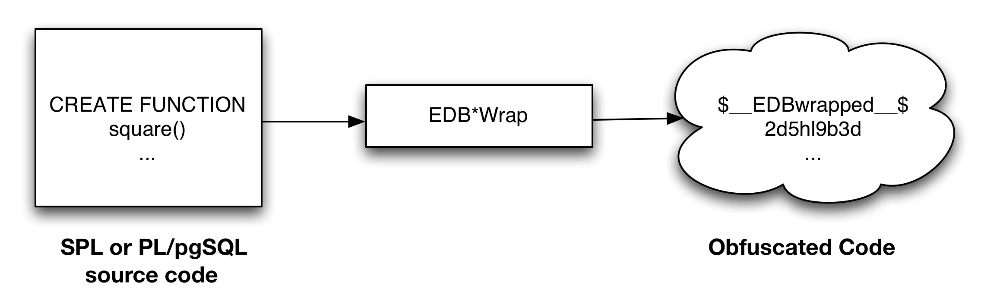

The chapter describes various features providing for added security.

## Protecting Against SQL Injection Attacks

Advanced Server provides protection against SQL injection attacks. A *SQL injection attack* is an attempt to compromise a database by running SQL statements whose results provide clues to the attacker as to the content, structure, or security of that database.

Preventing a SQL injection attack is normally the responsibility of the application developer. The database administrator typically has little or no control over the potential threat. The difficulty for database administrators is that the application must have access to the data to function properly.

*SQL/Protect* is a module that allows a database administrator to protect a database from SQL injection attacks. SQL/Protect provides a layer of security in addition to the normal database security policies by examining incoming queries for common SQL injection profiles.

SQL/Protect gives the control back to the database administrator by alerting the administrator to potentially dangerous queries and by blocking these queries.

### SQL/Protect Overview

This section contains an introduction to the different types of SQL injection attacks and describes how SQL/Protect guards against them.

#### Types of SQL Injection Attacks

There are a number of different techniques used to perpetrate SQL injection attacks. Each technique is characterized by a certain *signature*. SQL/Protect examines queries for the following signatures:

**Unauthorized Relations**

While Advanced Server allows administrators to restrict access to relations (tables, views, etc.), many administrators do not perform this tedious task. SQL/Protect provides a *learn* mode that tracks the relations a user accesses.

This allows administrators to examine the workload of an application, and for SQL/Protect to learn which relations an application should be allowed to access for a given user or group of users in a role.

When SQL/Protect is switched to either *passive* or *active* mode, the incoming queries are checked against the list of learned relations.

**Utility Commands**

A common technique used in SQL injection attacks is to run utility commands, which are typically SQL Data Definition Language (DDL) statements. An example is creating a user-defined function that has the ability to access other system resources.

SQL/Protect can block the running of all utility commands, which are not normally needed during standard application processing.

**SQL Tautology**

The most frequent technique used in SQL injection attacks is issuing a tautological WHERE clause condition (that is, using a condition that is always true).

The following is an example:

WHERE password = 'x' OR 'x'='x'

Attackers will usually start identifying security weaknesses using this technique. SQL/Protect can block queries that use a tautological conditional clause.

**Unbounded DML Statements**

A dangerous action taken during SQL injection attacks is the running of unbounded DML statements. These are UPDATE and DELETE statements with no WHERE clause. For example, an attacker may update all users’ passwords to a known value or initiate a denial of service attack by deleting all of the data in a key table.

#### Monitoring SQL Injection Attacks

This section describes how SQL/Protect monitors and reports on SQL injection attacks.

##### Protected Roles

Monitoring for SQL injection attacks involves analyzing SQL statements originating in database sessions where the current user of the session is a protected role. A *protected role* is an Advanced Server user or group that the database administrator has chosen to monitor using SQL/Protect. (In Advanced Server, users and groups are collectively referred to as *roles*.)

Each protected role can be customized for the types of SQL injection attacks (discussed in Section 4.1.1.1) for which it is to be monitored, thus providing different levels of protection by role and significantly reducing the user maintenance load for DBAs.

**Note:** A role with the superuser privilege cannot be made a protected role. If a protected non-superuser role is subsequently altered to become a superuser, certain behaviors are exhibited whenever an attempt is made by that superuser to issue any command:
 - A warning message is issued by SQL/Protect on every command issued by the protected superuser.
 - The statistic in column superusers of edb\_sql\_protect\_stats is incremented with every command issued by the protected superuser. See Section 4.1.1.2.2 for information on the edb\_sql\_protect\_stats view.
 - When SQL/Protect is in active mode, all commands issued by the protected superuser are prevented from running.

A protected role that has the superuser privilege should either be altered so that it is no longer a superuser, or it should be reverted back to an unprotected role.

##### Attack Attempt Statistics

Each usage of a command by a protected role that is considered an attack by SQL/Protect is recorded. Statistics are collected by type of SQL injection attack as discussed in Section 4.1.1.1.

These statistics are accessible from view edb\_sql\_protect\_stats that can be easily monitored to identify the start of a potential attack.

The columns in edb\_sql\_protect\_stats monitor the following:
 - **username.** Name of the protected role.
 - **superusers.** Number of SQL statements issued when the protected role is a superuser. In effect, any SQL statement issued by a protected superuser increases this statistic. See Section 4.1.1.2.1 for information on protected superusers.
 - **relations.** Number of SQL statements issued referencing relations that were not learned by a protected role. (That is, relations that are not in a role’s protected relations list.)
 - **commands.** Number of DDL statements issued by a protected role.
 - **tautology.** Number of SQL statements issued by a protected role that contained a tautological condition.
 - **dml.** Number of UPDATE and DELETE statements issued by a protected role that did not contain a WHERE clause.

This gives database administrators the opportunity to react proactively in preventing theft of valuable data or other malicious actions.

If a role is protected in more than one database, the role’s statistics for attacks in each database are maintained separately and are viewable only when connected to the respective database.

**Note:** SQL/Protect statistics are maintained in memory while the database server is running. When the database server is shut down, the statistics are saved to a binary file named edb\_sqlprotect.stat in the data/global subdirectory of the Advanced Server home directory.

##### Attack Attempt Queries

Each usage of a command by a protected role that is considered an attack by SQL/Protect is recorded in view edb\_sql\_protect\_queries.

View edb\_sql\_protect\_queries contains the following columns:
 - **username.** Database user name of the attacker used to log into the database server.
 - **ip\_address.** IP address of the machine from which the attack was initiated.
 - **port.** Port number from which the attack originated.
 - **machine\_name.** Name of the machine, if known, from which the attack originated.
 - **date\_time.** Date and time at which the query was received by the database server. The time is stored to the precision of a minute.
 - **query.** The query string sent by the attacker.

The maximum number of offending queries that are saved in edb\_sql\_protect\_queries is controlled by configuration parameter edb\_sql\_protect.max\_queries\_to\_save.

If a role is protected in more than one database, the role’s queries for attacks in each database are maintained separately and are viewable only when connected to the respective database.

### Configuring SQL/Protect

The library file (sqlprotect.so on Linux, sqlprotect.dll on Windows) necessary to run SQL/Protect should already be installed in the lib subdirectory of your Advanced Server home directory.

You will also need the SQL script file sqlprotect.sql located in the share/contrib subdirectory of your Advanced Server home directory.

You must configure the database server to use SQL/Protect, and you must configure each database that you want SQL/Protect to monitor:
 - The database server configuration file, postgresql.conf, must be modified by adding and enabling configuration parameters used by SQL/Protect.
 - Database objects used by SQL/Protect must be installed in each database that you want SQL/Protect to monitor.

**Step 1:** Edit the following configuration parameters in the postgresql.conf file located in the data subdirectory of your Advanced Server home directory.
 - **shared\_preload\_libraries.** Add $libdir/sqlprotect to the list of libraries.
 - **edb\_sql\_protect.enabled.** Controls whether or not SQL/Protect is actively monitoring protected roles by analyzing SQL statements issued by those roles and reacting according to the setting of edb\_sql\_protect.level. When you are ready to begin monitoring with SQL/Protect set this parameter to on. If this parameter is omitted, the default is off.
 - **edb\_sql\_protect.level.** Sets the action taken by SQL/Protect when a SQL statement is issued by a protected role. If this parameter is omitted, the default behavior is passive. Initially, set this parameter to learn. See Section 4.1.2.1.2 for further explanation of this parameter.
 - **edb\_sql\_protect.max\_protected\_roles.** Sets the maximum number of roles that can be protected. If this parameter is omitted, the default setting is 64. See Section 2.1.3.12.8 for information on the maximum range of this parameter.
 - **edb\_sql\_protect.max\_protected\_relations.** Sets the maximum number of relations that can be protected per role. If this parameter is omitted, the default setting is 1024.

> Please note the total number of protected relations for the server will be the number of protected relations times the number of protected roles. Every protected relation consumes space in shared memory. The space for the maximum possible protected relations is reserved during database server startup.
>
> See Section 2.1.3.12.7 for information about the maximum range of this parameter.
 - **edb\_sql\_protect.max\_queries\_to\_save.** Sets the maximum number of offending queries to save in the edb\_sql\_protect\_queries view. If this parameter is omitted, the default setting is 5000. If the number of offending queries reaches the limit, additional queries are not saved in the view, but are accessible in the database server log file. **Note:** The minimum valid value for this parameter is 100. If a value less than 100 is specified, the database server starts using the default setting of 5000. A warning message is recorded in the database server log file. See Section 2.1.3.12.9 for information on the maximum range of this parameter.

The following example shows the settings of these parameters in the postgresql.conf file:

shared\_preload\_libraries = '$libdir/dbms\_pipe,$libdir/edb\_gen,$libdir/sqlprotect'

\# (change requires restart)

.

.

.

edb\_sql\_protect.enabled = off

edb\_sql\_protect.level = learn

edb\_sql\_protect.max\_protected\_roles = 64

edb\_sql\_protect.max\_protected\_relations = 1024

edb\_sql\_protect.max\_queries\_to\_save = 5000

**Step 2:** Restart the database server after you have modified the postgresql.conf file.

**For Linux only:** Run the /etc/init.d/ppas-9.5 script with the restart option as shown by the following:

$ su root

Password:

$ /etc/init.d/ppas-9.5 restart

Restarting Postgres Plus Advanced Server 9.5:

waiting for server to shut down.... done

server stopped

waiting for server to start.... done

server started

Postgres Plus Advanced Server 9.5 restarted successfully

**For Windows only:** Open Control Panel, Administrative Tools, and then Services. Restart the service named ppas-9.5.

!\[image\]\(./images/image4.png)

*Figure 4.2 - Starting the ppas-9.5 service.*

**Step 3:** For each database that you want to protect from SQL injection attacks, connect to the database as a superuser (either enterprisedb or postgres, depending upon your installation options) and run the script sqlprotect.sql located in the share/contrib subdirectory of your Advanced Server home directory. The script creates the SQL/Protect database objects in a schema named sqlprotect.

The following example shows this process to set up protection for a database named edb:

$ /opt/PostgresPlus/9.5AS/bin/psql -d edb -U enterprisedb

Password for user enterprisedb:

psql.bin (9.5.0.0)

Type "help" for help.

edb=\# \\i /opt/PostgresPlus/9.5AS/share/contrib/sqlprotect.sql

CREATE SCHEMA

GRANT

SET

CREATE TABLE

GRANT

CREATE TABLE

GRANT

CREATE FUNCTION

CREATE FUNCTION

CREATE FUNCTION

CREATE FUNCTION

CREATE FUNCTION

CREATE FUNCTION

CREATE FUNCTION

DO

CREATE FUNCTION

CREATE FUNCTION

DO

CREATE VIEW

GRANT

DO

CREATE VIEW

GRANT

CREATE VIEW

GRANT

CREATE FUNCTION

CREATE FUNCTION

SET

#### Selecting Roles to Protect

After the SQL/Protect database objects have been created in a database, you select the roles for which SQL queries are to be monitored for protection, and the level of protection.

##### Setting the Protected Roles List

For each database that you want to protect, you must determine the roles you want to monitor and then add those roles to the *protected roles list* of that database.

**Step 1:** Connect as a superuser to a database that you wish to protect using either psql or Postgres Enterprise Manager Client.

$ /opt/PostgresPlus/9.5AS/bin/psql -d edb -U enterprisedb

Password for user enterprisedb:

psql.bin (9.5.0.0)

Type "help" for help.

edb=\#

**Step 2:** Since the SQL/Protect tables, functions, and views are built under the sqlprotect schema, use the SET search\_path command to include the sqlprotect schema in your search path. This eliminates the need to schema-qualify any operation or query involving SQL/Protect database objects.

edb=\# SET search\_path TO sqlprotect;

SET

**Step 3:** Each role that you wish to protect must be added to the protected roles list. This list is maintained in the table edb\_sql\_protect.

To add a role, use the function protect\_role('*rolename*').

The following example protects a role named appuser.

edb=\# SELECT protect\_role('appuser');

protect\_role

\--------------

(1 row)

You can list the roles that have been added to the protected roles list by issuing the following query:

edb=\# SELECT \* FROM edb\_sql\_protect;

dbid | roleid | protect\_relations | allow\_utility\_cmds | allow\_tautology | allow\_empty\_dml

\-------+--------+-------------------+--------------------+-----------------+-----------------

13917 | 16671 | t | f | f | f

(1 row)

A view is also provided that gives the same information using the object names instead of the Object Identification numbers (OIDs).

edb=\# \\x

Expanded display is on.

edb=\# SELECT \* FROM list\_protected\_users;

\-\[ RECORD 1 \]------+--------

dbname | edb

username | appuser

protect\_relations | t

allow\_utility\_cmds | f

allow\_tautology | f

allow\_empty\_dml | f

##### Setting the Protection Level

Configuration parameter edb\_sql\_protect.level sets the protection level, which defines the behavior of SQL/Protect when a protected role issues a SQL statement. **The defined behavior applies to all roles in the protected roles lists of all databases configured with SQL/Protect in the database server.**

In the postgresql.conf file the edb\_sql\_protect.level configuration parameter can be set to one of the following values to use either learn mode, passive mode, or active mode:
 - **learn.** Tracks the activities of protected roles and records the relations used by the roles. This is used when initially configuring SQL/Protect so the expected behaviors of the protected applications are learned.
 - **passive.** Issues warnings if protected roles are breaking the defined rules, but does not stop any SQL statements from executing. This is the next step after SQL/Protect has learned the expected behavior of the protected roles. This essentially behaves in intrusion detection mode and can be run in production when properly monitored.
 - **active.** Stops all invalid statements for a protected role. This behaves as a SQL firewall preventing dangerous queries from running. This is particularly effective against early penetration testing when the attacker is trying to determine the vulnerability point and the type of database behind the application. Not only does SQL/Protect close those vulnerability points, but it tracks the blocked queries allowing administrators to be alerted before the attacker finds an alternate method of penetrating the system.

If the edb\_sql\_protect.level parameter is not set or is omitted from the configuration file, the default behavior of SQL/Protect is passive.

If you are using SQL/Protect for the first time, set edb\_sql\_protect.level to learn.

#### Monitoring Protected Roles

Once you have configured SQL/Protect in a database, added roles to the protected roles list, and set the desired protection level, you can then activate SQL/Protect in one of learn mode, passive mode, or active mode. You can then start running your applications.

With a new SQL/Protect installation, the first step is to determine the relations that protected roles should be permitted to access during normal operation. Learn mode allows a role to run applications during which time SQL/Protect is recording the relations that are accessed. These are added to the role’s *protected relations list* stored in table edb\_sql\_protect\_rel.

Monitoring for protection against attack begins when SQL/Protect is run in passive or active mode. In passive and active modes, the role is permitted to access the relations in its protected relations list as these were determined to be the relations the role should be able to access during typical usage.

However, if a role attempts to access a relation that is not in its protected relations list, a WARNING or ERROR severity level message is returned by SQL/Protect. The role’s attempted action on the relation may or may not be carried out depending upon whether the mode is passive or active.

##### Learn Mode

**Step 1:** To activate SQL/Protect in learn mode, set the following parameters in the postgresql.conf file as shown below:

edb\_sql\_protect.enabled = on

edb\_sql\_protect.level = learn

**Step 2:** Reload the postgresql.conf file.

Choose Expert Configuration, then Reload Configuration from the Advanced Server application menu.

**Note:** For an alternative method of reloading the configuration file, use the pg\_reload\_conf function. Be sure you are connected to a database as a superuser and execute function pg\_reload\_conf as shown by the following example:

edb=\# SELECT pg\_reload\_conf();

pg\_reload\_conf

\----------------

t

(1 row)

**Step 3:** Allow the protected roles to run their applications.

As an example the following queries are issued in the psql application by protected role appuser:

edb=\> SELECT \* FROM dept;

NOTICE: SQLPROTECT: Learned relation: 16384

deptno | dname | loc

\--------+------------+----------

10 | ACCOUNTING | NEW YORK

20 | RESEARCH | DALLAS

30 | SALES | CHICAGO

40 | OPERATIONS | BOSTON

(4 rows)

edb=\> SELECT empno, ename, job FROM emp WHERE deptno = 10;

NOTICE: SQLPROTECT: Learned relation: 16391

empno | ename | job

\-------+--------+-----------

7782 | CLARK | MANAGER

7839 | KING | PRESIDENT

7934 | MILLER | CLERK

(3 rows)

SQL/Protect generates a NOTICE severity level message indicating the relation has been added to the role’s protected relations list.

In SQL/Protect learn mode, SQL statements that are cause for suspicion are not prevented from executing, but a message is issued to alert the user to potentially dangerous statements as shown by the following example:

edb=\> CREATE TABLE appuser\_tab (f1 INTEGER);

NOTICE: SQLPROTECT: This command type is illegal for this user

CREATE TABLE

edb=\> DELETE FROM appuser\_tab;

NOTICE: SQLPROTECT: Learned relation: 16672

NOTICE: SQLPROTECT: Illegal Query: empty DML

DELETE 0

**Step 4:** As a protected role runs applications, the SQL/Protect tables can be queried to observe the addition of relations to the role’s protected relations list.

Connect as a superuser to the database you are monitoring and set the search path to include the sqlprotect schema.

edb=\# SET search\_path TO sqlprotect;

SET

Query the edb\_sql\_protect\_rel table to see the relations added to the protected relations list:

edb=\# SELECT \* FROM edb\_sql\_protect\_rel;

dbid | roleid | relid

\-------+--------+-------

13917 | 16671 | 16384

13917 | 16671 | 16391

13917 | 16671 | 16672

(3 rows)

The view list\_protected\_rels is provided that gives more comprehensive information along with the object names instead of the OIDs.

edb=\# SELECT \* FROM list\_protected\_rels;

Database | Protected User | Schema | Name | Type | Owner

\----------+----------------+--------+-------------+-------+--------------

edb | appuser | public | dept | Table | enterprisedb

edb | appuser | public | emp | Table | enterprisedb

edb | appuser | public | appuser\_tab | Table | appuser

(3 rows)

##### Passive Mode

Once you have determined that a role’s applications have accessed all relations they will need, you can now change the protection level so that SQL/Protect can actively monitor the incoming SQL queries and protect against SQL injection attacks.

Passive mode is the less restrictive of the two protection modes, passive and active.

**Step 1:** To activate SQL/Protect in passive mode, set the following parameters in the postgresql.conf file as shown below:

edb\_sql\_protect.enabled = on

edb\_sql\_protect.level = passive

**Step 2:** Reload the configuration file as shown in Step 2 of Section 4.1.2.2.1.

Now SQL/Protect is in passive mode. For relations that have been learned such as the dept and emp tables of the prior examples, SQL statements are permitted with no special notification to the client by SQL/Protect as shown by the following queries run by user appuser:

edb=\> SELECT \* FROM dept;

deptno | dname | loc

\--------+------------+----------

10 | ACCOUNTING | NEW YORK

20 | RESEARCH | DALLAS

30 | SALES | CHICAGO

40 | OPERATIONS | BOSTON

(4 rows)

edb=\> SELECT empno, ename, job FROM emp WHERE deptno = 10;

empno | ename | job

\-------+--------+-----------

7782 | CLARK | MANAGER

7839 | KING | PRESIDENT

7934 | MILLER | CLERK

(3 rows)

SQL/Protect does not prevent any SQL statement from executing, but issues a message of WARNING severity level for SQL statements executed against relations that were not learned, or for SQL statements that contain a prohibited signature as shown in the following example:

edb=\> CREATE TABLE appuser\_tab\_2 (f1 INTEGER);

WARNING: SQLPROTECT: This command type is illegal for this user

CREATE TABLE

edb=\> INSERT INTO appuser\_tab\_2 VALUES (1);

WARNING: SQLPROTECT: Illegal Query: relations

INSERT 0 1

edb=\> INSERT INTO appuser\_tab\_2 VALUES (2);

WARNING: SQLPROTECT: Illegal Query: relations

INSERT 0 1

edb=\> SELECT \* FROM appuser\_tab\_2 WHERE 'x' = 'x';

WARNING: SQLPROTECT: Illegal Query: relations

WARNING: SQLPROTECT: Illegal Query: tautology

f1

\----

1

2

(2 rows)

**Step 3:** Monitor the statistics for suspicious activity.

By querying the view edb\_sql\_protect\_stats, you can see the number of times SQL statements were executed that referenced relations that were not in a role’s protected relations list, or contained SQL injection attack signatures. See Section 4.1.1.2.2 for more information on view edb\_sql\_protect\_stats.

The following is a query on edb\_sql\_protect\_stats:

edb=\# SET search\_path TO sqlprotect;

SET

edb=\# SELECT \* FROM edb\_sql\_protect\_stats;

username | superusers | relations | commands | tautology | dml

\----------+------------+-----------+----------+-----------+-----

appuser | 0 | 3 | 1 | 1 | 0

(1 row)

**Step 4:** View information on specific attacks.

By querying the view edb\_sql\_protect\_queries, you can see the SQL statements that were executed that referenced relations that were not in a role’s protected relations list, or contained SQL injection attack signatures. See Section 4.1.1.2.3 for more information on view edb\_sql\_protect\_queries.

The following is a query on edb\_sql\_protect\_queries:

edb=\# SELECT \* FROM edb\_sql\_protect\_queries;

\-\[ RECORD 1 \]+---------------------------------------------

username | appuser

ip\_address |

port |

machine\_name |

date\_time | 20-JUN-14 13:21:00 -04:00

query | INSERT INTO appuser\_tab\_2 VALUES (1);

\-\[ RECORD 2 \]+---------------------------------------------

username | appuser

ip\_address |

port |

machine\_name |

date\_time | 20-JUN-14 13:21:00 -04:00

query | CREATE TABLE appuser\_tab\_2 (f1 INTEGER);

\-\[ RECORD 3 \]+---------------------------------------------

username | appuser

ip\_address |

port |

machine\_name |

date\_time | 20-JUN-14 13:22:00 -04:00

query | INSERT INTO appuser\_tab\_2 VALUES (2);

\-\[ RECORD 4 \]+---------------------------------------------

username | appuser

ip\_address |

port |

machine\_name |

date\_time | 20-JUN-14 13:22:00 -04:00

query | SELECT \* FROM appuser\_tab\_2 WHERE 'x' = 'x';

**Note:** The ip\_address and port columns do not return any information if the attack originated on the same host as the database server using the Unix-domain socket (that is, pg\_hba.conf connection type local).

##### Active Mode

In active mode, disallowed SQL statements are prevented from executing. Also, the message issued by SQL/Protect has a higher severity level of ERROR instead of WARNING.

**Step 1:** To activate SQL/Protect in active mode, set the following parameters in the postgresql.conf file as shown below:

edb\_sql\_protect.enabled = on

edb\_sql\_protect.level = active

**Step 2:** Reload the configuration file as shown in Step 2 of Section 4.1.2.2.1.

The following example illustrates SQL statements similar to those given in the examples of Step 2 in Section 4.1.2.2.2, but executed by user appuser when edb\_sql\_protect.level is set to active:

edb=\> CREATE TABLE appuser\_tab\_3 (f1 INTEGER);

ERROR: SQLPROTECT: This command type is illegal for this user

edb=\> INSERT INTO appuser\_tab\_2 VALUES (1);

ERROR: SQLPROTECT: Illegal Query: relations

edb=\> SELECT \* FROM appuser\_tab\_2 WHERE 'x' = 'x';

ERROR: SQLPROTECT: Illegal Query: relations

The following shows the resulting statistics:

edb=\# SELECT \* FROM sqlprotect.edb\_sql\_protect\_stats;

username | superusers | relations | commands | tautology | dml

\----------+------------+-----------+----------+-----------+-----

appuser | 0 | 5 | 2 | 1 | 0

(1 row)

The following is a query on edb\_sql\_protect\_queries:

edb=\# SELECT \* FROM sqlprotect.edb\_sql\_protect\_queries;

\-\[ RECORD 1 \]+---------------------------------------------

username | appuser

ip\_address |

port |

machine\_name |

date\_time | 20-JUN-14 13:21:00 -04:00

query | CREATE TABLE appuser\_tab\_2 (f1 INTEGER);

\-\[ RECORD 2 \]+---------------------------------------------

username | appuser

ip\_address |

port |

machine\_name |

date\_time | 20-JUN-14 13:22:00 -04:00

query | INSERT INTO appuser\_tab\_2 VALUES (2);

\-\[ RECORD 3 \]+---------------------------------------------

username | appuser

ip\_address | 192.168.2.6

port | 50098

machine\_name |

date\_time | 20-JUN-14 13:39:00 -04:00

query | CREATE TABLE appuser\_tab\_3 (f1 INTEGER);

\-\[ RECORD 4 \]+---------------------------------------------

username | appuser

ip\_address | 192.168.2.6

port | 50098

machine\_name |

date\_time | 20-JUN-14 13:39:00 -04:00

query | INSERT INTO appuser\_tab\_2 VALUES (1);

\-\[ RECORD 5 \]+---------------------------------------------

username | appuser

ip\_address | 192.168.2.6

port | 50098

machine\_name |

date\_time | 20-JUN-14 13:39:00 -04:00

query | SELECT \* FROM appuser\_tab\_2 WHERE 'x' = 'x';

### Common Maintenance Operations

The following describes how to perform other common operations.

You must be connected as a superuser to perform these operations and have included schema sqlprotect in your search path.

#### Adding a Role to the Protected Roles List

To add a role to the protected roles list run protect\_role('*rolename*').

protect\_role('*rolename*')

This is shown by the following example:

edb=\# SELECT protect\_role('newuser');

protect\_role

\--------------

(1 row)

#### Removing a Role From the Protected Roles List

To remove a role from the protected roles list use either of the following functions:

unprotect\_role('*rolename*')

unprotect\_role(*roleoid*)

**Note:** The variation of the function using the OID is useful if you remove the role using the DROP ROLE or DROP USER SQL statement before removing the role from the protected roles list. If a query on a SQL/Protect relation returns a value such as unknown (OID=16458) for the user name, use the unprotect\_role(*roleoid*) form of the function to remove the entry for the deleted role from the protected roles list.

Removing a role using these functions also removes the role’s protected relations list.

The statistics for a role that has been removed are not deleted until you use the drop\_stats function as described in Section 4.1.3.5.

The offending queries for a role that has been removed are not deleted until you use the drop\_queries function as described in Section 4.1.3.6.

The following is an example of the unprotect\_role function:

edb=\# SELECT unprotect\_role('newuser');

unprotect\_role

\----------------

(1 row)

Alternatively, the role could be removed by giving its OID of 16693:

edb=\# SELECT unprotect\_role(16693);

unprotect\_role

\----------------

(1 row)

#### Setting the Types of Protection for a Role

You can change whether or not a role is protected from a certain type of SQL injection attack.

Change the Boolean value for the column in edb\_sql\_protect corresponding to the type of SQL injection attack for which protection of a role is to be disabled or enabled.

Be sure to qualify the following columns in your WHERE clause of the statement that updates edb\_sql\_protect:
 - **dbid.** OID of the database for which you are making the change
 - **roleid.** OID of the role for which you are changing the Boolean settings

For example, to allow a given role to issue utility commands, update the allow\_utility\_cmds column as follows:

UPDATE edb\_sql\_protect SET allow\_utility\_cmds = TRUE WHERE dbid = 13917 AND roleid = 16671;

You can verify the change was made by querying edb\_sql\_protect or list\_protected\_users. In the following query note that column allow\_utility\_cmds now contains t.

edb=\# SELECT dbid, roleid, allow\_utility\_cmds FROM edb\_sql\_protect;

dbid | roleid | allow\_utility\_cmds

\-------+--------+--------------------

13917 | 16671 | t

(1 row)

The updated rules take effect on new sessions started by the role since the change was made.

#### Removing a Relation From the Protected Relations List

If SQL/Protect has learned that a given relation is accessible for a given role, you can subsequently remove that relation from the role’s protected relations list.

Delete its entry from the edb\_sql\_protect\_rel table using any of the following functions:

unprotect\_rel('*rolename*', '*relname*')

unprotect\_rel('*rolename*', '*schema*', '*relname*')

unprotect\_rel(*roleoid*, *reloid*)

If the relation given by *relname* is not in your current search path, specify the relation’s schema using the second function format.

The third function format allows you to specify the OIDs of the role and relation, respectively, instead of their text names.

The following example illustrates the removal of the public.emp relation from the protected relations list of the role appuser.

edb=\# SELECT unprotect\_rel('appuser', 'public', 'emp');

unprotect\_rel

\---------------

(1 row)

The following query shows there is no longer an entry for the emp relation.

edb=\# SELECT \* FROM list\_protected\_rels;

Database | Protected User | Schema | Name | Type | Owner

\----------+----------------+--------+-------------+-------+--------------

edb | appuser | public | dept | Table | enterprisedb

edb | appuser | public | appuser\_tab | Table | appuser

(2 rows)

SQL/Protect will now issue a warning or completely block access (depending upon the setting of edb\_sql\_protect.level) whenever the role attempts to utilize that relation.

#### Deleting Statistics

You can delete statistics from view edb\_sql\_protect\_stats using either of the two following functions:

drop\_stats('*rolename*')

drop\_stats(*roleoid*)

**Note:** The variation of the function using the OID is useful if you remove the role using the DROP ROLE or DROP USER SQL statement before deleting the role’s statistics using drop\_stats('*rolename*'). If a query on edb\_sql\_protect\_stats returns a value such as unknown (OID=16458) for the user name, use the drop\_stats(*roleoid*) form of the function to remove the deleted role’s statistics from edb\_sql\_protect\_stats.

The following is an example of the drop\_stats function:

edb=\# SELECT drop\_stats('appuser');

drop\_stats

\------------

(1 row)

edb=\# SELECT \* FROM edb\_sql\_protect\_stats;

username | superusers | relations | commands | tautology | dml

\----------+------------+-----------+----------+-----------+-----

(0 rows)

The following is an example of using the drop\_stats(*roleoid*) form of the function when a role is dropped before deleting its statistics:

edb=\# SELECT \* FROM edb\_sql\_protect\_stats;

username | superusers | relations | commands | tautology | dml

\---------------------+------------+-----------+----------+-----------+-----

unknown (OID=16693) | 0 | 5 | 3 | 1 | 0

appuser | 0 | 5 | 2 | 1 | 0

(2 rows)

edb=\# SELECT drop\_stats(16693);

drop\_stats

\------------

(1 row)

edb=\# SELECT \* FROM edb\_sql\_protect\_stats;

username | superusers | relations | commands | tautology | dml

\----------+------------+-----------+----------+-----------+-----

appuser | 0 | 5 | 2 | 1 | 0

(1 row)

#### Deleting Offending Queries

You can delete offending queries from view edb\_sql\_protect\_queries using either of the two following functions:

drop\_queries('*rolename*')

drop\_queries(*roleoid*)

**Note:** The variation of the function using the OID is useful if you remove the role using the DROP ROLE or DROP USER SQL statement before deleting the role’s offending queries using drop\_queries('*rolename*'). If a query on edb\_sql\_protect\_queries returns a value such as unknown (OID=16454) for the user name, use the drop\_queries(*roleoid*) form of the function to remove the deleted role’s offending queries from edb\_sql\_protect\_queries.

The following is an example of the drop\_queries function:

edb=\# SELECT drop\_queries('appuser');

drop\_queries

\--------------

5

(1 row)

edb=\# SELECT \* FROM edb\_sql\_protect\_queries;

username | ip\_address | port | machine\_name | date\_time | query

\----------+------------+------+--------------+-----------+-------

(0 rows)

The following is an example of using the drop\_queries(*roleoid*) form of the function when a role is dropped before deleting its queries:

edb=\# SELECT username, query FROM edb\_sql\_protect\_queries;

username | query

\---------------------+----------------------------------------------

unknown (OID=16454) | CREATE TABLE appuser\_tab\_2 (f1 INTEGER);

unknown (OID=16454) | INSERT INTO appuser\_tab\_2 VALUES (2);

unknown (OID=16454) | CREATE TABLE appuser\_tab\_3 (f1 INTEGER);

unknown (OID=16454) | INSERT INTO appuser\_tab\_2 VALUES (1);

unknown (OID=16454) | SELECT \* FROM appuser\_tab\_2 WHERE 'x' = 'x';

(5 rows)

edb=\# SELECT drop\_queries(16454);

drop\_queries

\--------------

5

(1 row)

edb=\# SELECT \* FROM edb\_sql\_protect\_queries;

username | ip\_address | port | machine\_name | date\_time | query

\----------+------------+------+--------------+-----------+-------

(0 rows)

#### Disabling and Enabling Monitoring

If you wish to turn off SQL/Protect monitoring once you have enabled it, perform the following steps:

**Step 1:** Set the configuration parameter edb\_sql\_protect.enabled to off in the postgresql.conf file.

The entry for edb\_sql\_protect.enabled should look like the following:

edb\_sql\_protect.enabled = off

**Step 2:** Reload the configuration file as shown in Step 2 of Section 4.1.2.2.1.

To re-enable SQL/Protect monitoring perform the following steps:

**Step 1:** Set the configuration parameter edb\_sql\_protect.enabled to on in the postgresql.conf file.

The entry for edb\_sql\_protect.enabled should look like the following:

edb\_sql\_protect.enabled = on

**Step 2:** Reload the configuration file as shown in Step 2 of Section 4.1.2.2.1.

### Backing Up and Restoring a SQL/Protect Database

Backing up a database that is configured with SQL/Protect, and then restoring the backup file to a new database require additional considerations to what is normally associated with backup and restore procedures. This is primarily due to the use of Object Identification numbers (OIDs) in the SQL/Protect tables as explained in this section.

**Note:** This section is applicable if your backup and restore procedures result in the re-creation of database objects in the new database with new OIDs such as is the case when using the pg\_dump backup program.

If you are backing up your Advanced Server database server by simply using the operating system’s copy utility to create a binary image of the Advanced Server data files (file system backup method), then this section does not apply.

#### Object Identification Numbers in SQL/Protect Tables

SQL/Protect uses two tables, edb\_sql\_protect and edb\_sql\_protect\_rel, to store information on database objects such as databases, roles, and relations. References to these database objects in these tables are done using the objects’ OIDs, and not the objects’ text names. The OID is a numeric data type used by Advanced Server to uniquely identify each database object.

When a database object is created, Advanced Server assigns an OID to the object, which is then used whenever a reference is needed to the object in the database catalogs. If you create the same database object in two databases, such as a table with the same CREATE TABLE statement, each table is assigned a different OID in each database.

In a backup and restore operation that results in the re-creation of the backed up database objects, the restored objects end up with different OIDs in the new database than what they were assigned in the original database. As a result, the OIDs referencing databases, roles, and relations stored in the edb\_sql\_protect and edb\_sql\_protect\_rel tables are no longer valid when these tables are simply dumped to a backup file and then restored to a new database.

The following sections describe two functions, export\_sqlprotect and import\_sqlprotect, that are used specifically for backing up and restoring SQL/Protect tables in order to ensure the OIDs in the SQL/Protect tables reference the correct database objects after the SQL/Protect tables are restored.

#### Backing Up the Database

The following are the steps to back up a database that has been configured with SQL/Protect.

**Step 1:** Create a backup file using pg\_dump.

The following example shows a plain-text backup file named /tmp/edb.dmp created from database edb using the pg\_dump utility program:

$ cd /opt/PostgresPlus/9.5AS/bin

$ ./pg\_dump -U enterprisedb -Fp -f /tmp/edb.dmp edb

Password:

$

**Step 2:** Connect to the database as a superuser and export the SQL/Protect data using the export\_sqlprotect('*sqlprotect\_file*') function where *sqlprotect\_file* is the fully qualified path to a file where the SQL/Protect data is to be saved.

The enterprisedb operating system account (postgres if you installed Advanced Server in PostgreSQL compatibility mode) must have read and write access to the directory specified in *sqlprotect\_file*.

edb=\# SELECT sqlprotect.export\_sqlprotect('/tmp/sqlprotect.dmp');

> export\_sqlprotect

\-------------------

(1 row)

The files /tmp/edb.dmp and /tmp/sqlprotect.dmp comprise your total database backup.

#### Restoring From the Backup Files

**Step 1:** Restore the backup file to the new database.

The following example uses the psql utility program to restore the plain-text backup file /tmp/edb.dmp to a newly created database named newdb:

$ /opt/PostgresPlus/9.5AS/bin/psql -d newdb -U enterprisedb -f /tmp/edb.dmp

Password for user enterprisedb:

SET

SET

SET

SET

SET

COMMENT

CREATE SCHEMA

.

.

.

**Step 2:** Connect to the new database as a superuser and delete all rows from the edb\_sql\_protect\_rel table.

This step removes any existing rows in the edb\_sql\_protect\_rel table that were backed up from the original database. These rows do not contain the correct OIDs relative to the database where the backup file has been restored.

$ /opt/PostgresPlus/9.5AS/bin/psql -d newdb -U enterprisedb

Password for user enterprisedb:

psql.bin (9.5.0.0)

Type "help" for help.

newdb=\# DELETE FROM sqlprotect.edb\_sql\_protect\_rel;

DELETE 2

**Step 3:** Delete all rows from the edb\_sql\_protect table.

This step removes any existing rows in the edb\_sql\_protect table that were backed up from the original database. These rows do not contain the correct OIDs relative to the database where the backup file has been restored.

newdb=\# DELETE FROM sqlprotect.edb\_sql\_protect;

DELETE 1

**Step 4:** Delete any statistics that may exist for the database.

This step removes any existing statistics that may exist for the database to which you are restoring the backup. The following query displays any existing statistics:

newdb=\# SELECT \* FROM sqlprotect.edb\_sql\_protect\_stats;

username | superusers | relations | commands | tautology | dml

\----------+------------+-----------+----------+-----------+-----

(0 rows)

For each row that appears in the preceding query, use the drop\_stats function specifying the role name of the entry.

For example, if a row appeared with appuser in the username column, issue the following command to remove it:

newdb=\# SELECT sqlprotect.drop\_stats('appuser');

drop\_stats

\------------

(1 row)

**Step 5:** Delete any offending queries that may exist for the database.

This step removes any existing queries that may exist for the database to which you are restoring the backup. The following query displays any existing queries:

edb=\# SELECT \* FROM sqlprotect.edb\_sql\_protect\_queries;

username | ip\_address | port | machine\_name | date\_time | query

\----------+------------+------+--------------+-----------+-------

(0 rows)

For each row that appears in the preceding query, use the drop\_queries function specifying the role name of the entry.

For example, if a row appeared with appuser in the username column, issue the following command to remove it:

edb=\# SELECT sqlprotect.drop\_queries('appuser');

drop\_queries

\--------------

(1 row)

**Step 6:** Make sure the role names that were protected by SQL/Protect in the original database exist in the database server where the new database resides.

If the original and new databases reside in the same database server, then nothing needs to be done assuming you have not deleted any of these roles from the database server.

**Step 7:** Run the function import\_sqlprotect('*sqlprotect\_file*') where *sqlprotect\_file* is the fully qualified path to the file you created in Step 2 of Section 4.1.4.2.

newdb=\# SELECT sqlprotect.import\_sqlprotect('/tmp/sqlprotect.dmp');

> import\_sqlprotect

\-------------------

(1 row)

Tables edb\_sql\_protect and edb\_sql\_protect\_rel are now populated with entries containing the OIDs of the database objects as assigned in the new database. The statistics view edb\_sql\_protect\_stats also now displays the statistics imported from the original database.

The SQL/Protect tables and statistics are now properly restored for this database. This is verified by the following queries on the Advanced Server system catalogs:

newdb=\# SELECT datname, oid FROM pg\_database;

datname | oid

\-----------+-------

template1 | 1

template0 | 13909

edb | 13917

newdb | 16679

(4 rows)

newdb=\# SELECT rolname, oid FROM pg\_roles;

rolname | oid

\--------------+-------

enterprisedb | 10

appuser | 16671

newuser | 16678

(3 rows)

newdb=\# SELECT relname, oid FROM pg\_class WHERE relname IN ('dept','emp','appuser\_tab');

relname | oid

\-------------+-------

appuser\_tab | 16803

dept | 16809

emp | 16812

(3 rows)

newdb=\# SELECT \* FROM sqlprotect.edb\_sql\_protect;

dbid | roleid | protect\_relations | allow\_utility\_cmds | allow\_tautology | allow\_empty\_dml

\-------+--------+-------------------+--------------------+-----------------+-----------------

16679 | 16671 | t | t | f | f

(1 row)

newdb=\# SELECT \* FROM sqlprotect.edb\_sql\_protect\_rel;

dbid | roleid | relid

\-------+--------+-------

16679 | 16671 | 16809

16679 | 16671 | 16803

(2 rows)

newdb=\# SELECT \* FROM sqlprotect.edb\_sql\_protect\_stats;

username | superusers | relations | commands | tautology | dml

\----------+------------+-----------+----------+-----------+-----

appuser | 0 | 5 | 2 | 1 | 0

(1 row)

newedb=\# \\x

Expanded display is on.

nwedb=\# SELECT \* FROM sqlprotect.edb\_sql\_protect\_queries;

\-\[ RECORD 1 \]+---------------------------------------------

username | appuser

ip\_address |

port |

machine\_name |

date\_time | 20-JUN-14 13:21:00 -04:00

query | CREATE TABLE appuser\_tab\_2 (f1 INTEGER);

\-\[ RECORD 2 \]+---------------------------------------------

username | appuser

ip\_address |

port |

machine\_name |

date\_time | 20-JUN-14 13:22:00 -04:00

query | INSERT INTO appuser\_tab\_2 VALUES (2);

\-\[ RECORD 3 \]+---------------------------------------------

username | appuser

ip\_address | 192.168.2.6

port | 50098

machine\_name |

date\_time | 20-JUN-14 13:39:00 -04:00

query | CREATE TABLE appuser\_tab\_3 (f1 INTEGER);

\-\[ RECORD 4 \]+---------------------------------------------

username | appuser

ip\_address | 192.168.2.6

port | 50098

machine\_name |

date\_time | 20-JUN-14 13:39:00 -04:00

query | INSERT INTO appuser\_tab\_2 VALUES (1);

\-\[ RECORD 5 \]+---------------------------------------------

username | appuser

ip\_address | 192.168.2.6

port | 50098

machine\_name |

date\_time | 20-JUN-14 13:39:00 -04:00

query | SELECT \* FROM appuser\_tab\_2 WHERE 'x' = 'x';

Note the following about the columns in tables edb\_sql\_protect and edb\_sql\_protect\_rel:
 - **dbid.** Matches the value in the oid column from pg\_database for newdb
 - **roleid.** Matches the value in the oid column from pg\_roles for appuser

Also note that in table edb\_sql\_protect\_rel, the values in the relid column match the values in the oid column of pg\_class for relations dept and appuser\_tab.

**Step 8:** Verify that the SQL/Protect configuration parameters are set as desired in the postgresql.conf file for the database server running the new database as described throughout sections 0, 4.1.2.1, and 4.1.2.2. Restart the database server or reload the configuration file as appropriate.

You can now monitor the database using SQL/Protect.

## EDB\*Wrap

The EDB\*Wrap utility protects proprietary source code and programs (functions, stored procedures, triggers, and packages) from unauthorized scrutiny. The EDB\*Wrap program translates a file that contains SPL or PL/pgSQL source code (the plaintext) into a file that contains the same code in a form that is nearly impossible to read. Once you have the obfuscated form of the code, you can send that code to Advanced Server and it will store those programs in obfuscated form. While EDB\*Wrap does obscure code, table definitions are still exposed.

Everything you wrap is stored in obfuscated form.  If you wrap an entire package, the package body source, as well as the prototypes contained in the package header and the functions and procedures contained in the package body are stored in obfuscated form.

If you wrap a CREATE PACKAGE statement, you hide the package API from other developers.  You may want to wrap the package body, but not the package header so users can see the package prototypes and other public variables that are defined in the package body.  To allow users to see what prototypes the package contains, use EDB\*Wrap to obfuscate only  the 'CREATE PACKAGE BODY' statement in the edbwrap input file, omitting the 'CREATE PACKAGE' statement. The package header source will be stored plaintext, while the package body source and package functions and procedures will be stored obfuscated.

Once wrapped, source code and programs cannot be unwrapped or debugged. Reverse engineering is possible, but would be very difficult.

The entire source file is wrapped into one unit. Any psql meta-commands included in the wrapped file will not be recognized when the file is executed; executing an obfuscated file that contains a psql meta-command will cause a syntax error. edbwrap does not validate SQL source code - if the plaintext form contains a syntax error, edbwrap will not complain. Instead, the server will report an error and abort the entire file when you try to execute the obfuscated form.

### Using EDB\*Wrap to Obfuscate Source Code

EDB\*Wrap is a command line utility; it accepts a single input source file, obfuscates the contents and returns a single output file. When you invoke the edbwrap utility, you must provide the name of the file that contains the source code to obfuscate. You may also specify the name of the file where edbwrap will write the obfuscated form of the code. edbwrap offers three different command-line styles. The first style is shown by the following:

edbwrap iname=*input\_file* \[oname=*output\_file*\]

The iname=input\_file argument specifies the name of the input file; if input\_file does not contain an extension, edbwrap will search for a file named *input\_file*.sql

The oname=*output\_file* argument (which is optional) specifies the name of the output file; if *output\_file* does not contain an extension, edbwrap will append .plb to the name.

If you do not specify an output file name, edbwrap writes to a file whose name is derived from the input file name: edbwrap strips the suffix (typically .sql) from the input file name and adds .plb.

edbwrap offers two other command-line styles that may feel more familiar:

edbwrap --iname *input\_file* \[--oname *output\_file*\]

edbwrap -i *input\_file* \[-o *output\_file*\]

You may mix command-line styles; the rules for deriving input and output file names are identical regardless of which style you use.

Once edbwrap has produced a file that contains obfuscated code, you typically feed that file into Advanced Server using a client application such as edb-psql. The server executes the obfuscated code line by line and stores the source code for SPL and PL/pgSQL programs in wrapped form.

In summary, to obfuscate code with EDB\*Wrap, you:
 - Create the source code file.
 - Invoke EDB\*Wrap to obfuscate the code.
 - Import the file as if it were in plaintext form.

The following sequence demonstrates edbwrap functionality.

First, create the source code for the list\_emp function (in plaintext form):

$ cat listemp.sql

CREATE OR REPLACE FUNCTION list\_emp() RETURNS VOID

AS $$

DECLARE

v\_empno NUMERIC(4);

v\_ename VARCHAR(10);

emp\_cur CURSOR FOR

SELECT empno, ename FROM emp ORDER BY empno;

BEGIN

OPEN emp\_cur;

RAISE INFO 'EMPNO ENAME';

RAISE INFO '----- -------';

LOOP

FETCH emp\_cur INTO v\_empno, v\_ename;

EXIT WHEN NOT FOUND;

RAISE INFO '% %', v\_empno, v\_ename;

END LOOP;

CLOSE emp\_cur;

RETURN;

END;

$$ LANGUAGE 'plpgsql';

You can import the list\_emp function with a client application such as psql:

$ psql -d edb -U enterprisedb

Password for user enterprisedb:

psql.bin (9.5.0.0)

Type "help" for help.

edb=\# \\i listemp.sql

CREATE FUNCTION

You can view the plaintext source code (stored in the server) by examining the pg\_function system table:

edb=\# SELECT funsrc FROM pg\_function WHERE funname = 'list\_emp';

funsrc

\------------------------------------------------------

\+

DECLARE +

v\_empno NUMERIC(4); +

v\_ename VARCHAR(10); +

emp\_cur CURSOR FOR +

SELECT empno, ename FROM emp ORDER BY empno;+

BEGIN +

OPEN emp\_cur; +

RAISE INFO 'EMPNO ENAME'; +

RAISE INFO '----- -------'; +

LOOP +

FETCH emp\_cur INTO v\_empno, v\_ename; +

EXIT WHEN NOT FOUND; +

RAISE INFO '% %', v\_empno, v\_ename; +

END LOOP; +

CLOSE emp\_cur; +

RETURN; +

END; +

(1 row)

Next, obfuscate the plaintext file with EDB\*Wrap:

$ edbwrap -i listemp.sql

EDB\*Wrap Utility: Release 9.5.0.0

Copyright (c) 2004-2016, EnterpriseDB Corporation. All Rights Reserved.

Using encoding UTF8 for input

Processing listemp.sql to listemp.plb

$

$ cat listemp.plb

$\_\_EDBwrapped\_\_$

UTF8

d6UEwTa69kFnCNAFVOgJqNyQMH7HwCn8dPPFJlkMFSb6YB4meTCGpIIoBnhYpcnxtAU+ZJMAu0Xe

WOTKG5iU9jpjqlwuioYVNa4EHFrf5JtNRTSL8tWhbi78li8ET5SWdU9eSGZiOfSVGi43b21ZWuGc

F8a342iMTy0bozbdl0r1dYku/f2kHnMYoBCi6EukmHik3j/iO1mJp06GHH71FG7BCOgCSW6L4B4x

BDje0MMVbBJveYyHWxBH12Bi8p4KDGy1HDLC8MK9S9EbfKPJbwKPZK37J8Ci9fhWBorfrTtz1k2f

vO1UKaTZGkYH0MIFvcZw6BG24dFL1kH5E2Rk5x4RzRsV2Hm+2LwTuDexs8hgleA3sPB/oZF9umb2

hZYkT5v1Ja7cKBnowdJrJNj/DOFoJcI1pFgG3DgJ

$\_\_EDBwrapped\_\_$

You may notice that the second line of the wrapped file contains an encoding name (in this case, the encoding is UTF8). When you obfuscate a file, edbwrap infers the encoding of the input file by examining the locale. For example, if you are running edbwrap while your locale is set to en\_US.utf8, edbwrap assumes that the input file is encoded in UTF8. Be sure to examine the output file after running edbwrap; if the locale contained in the wrapped file does not match the encoding of the input file, you should change your locale and rewrap the input file.

You can import the obfuscated code into Advanced Server using the same tools that work with plaintext code:

$ psql -d edb -U enterprisedb

Password for user enterprisedb:

psql.bin (9.5.0.0)

Type "help" for help.

edb=\# \\i listemp.plb

CREATE FUNCTION

edb=\# SELECT funsrc FROM pg\_function WHERE funname = 'list\_emp';

funsrc

\------------------------------------------------------------------------------

\+

$\_\_EDBwrapped\_\_$ +

UTF8 +

d6UNH3OTrROsTCLF6NKWq5gWsZxi5giSpg6SmNgWDqHutT8OqqpJZnL5wNtaBxs4B6+inA6qeWCA+

QsTKvmcDNHk3yFneWI33Jeo/DsdVqkIEMrlUsu2ogymEJedHcM1YQFARyx+l0mWBI+yqixE4BNZw+

jSeqiVKAhAckek8JzL9pf0QLFT8TTzzTG61KN7iFQQii0B6C4/GpDlZCmC5oDXt94PR15YcZ5fJq+

p+UThN/uahwIaDu+FQ2AhSxNCxJH1aqjJEnwE9S7jsRvQXQ/yRt4zc7WbfeQMhhLA0E9w+hOy3aS+

CKb6bHF3pVVQLiG6tWpjdWwgTZ7neG+T1EounZC8bKwn +

$\_\_EDBwrapped\_\_$

(1 row)

Invoke the obfuscated code in the same way that you would invoke the plaintext form:

edb=\# SELECT list\_emp();

INFO: EMPNO ENAME

INFO: ----- -------

INFO: 7369 SMITH

INFO: 7499 ALLEN

INFO: 7521 WARD

INFO: 7566 JONES

INFO: 7654 MARTIN

INFO: 7698 BLAKE

INFO: 7782 CLARK

INFO: 7788 SCOTT

INFO: 7839 KING

INFO: 7844 TURNER

INFO: 7876 ADAMS

INFO: 7900 JAMES

INFO: 7902 FORD

INFO: 7934 MILLER

list\_emp

\----------

(1 row)

When you use pg\_dump to back up a database, wrapped programs remain obfuscated in the archive file.

Be aware that audit logs produced by Advanced Server will show wrapped programs in plaintext form. Source code is also displayed in plaintext in SQL error messages generated during the execution of a program.

**Note:** At this time, the bodies of the objects created by the following statements will not be stored in obfuscated form:

CREATE \[OR REPLACE\] TYPE *type\_name* AS OBJECT

CREATE \[OR REPLACE\] TYPE *type\_name* UNDER *type\_name*

CREATE \[OR REPLACE\] TYPE BODY *type\_name*

## Virtual Private Database

*Virtual Private Database* is a type of fine-grained access control using security policies. *Fine-grained access control* in Virtual Private Database means that access to data can be controlled down to specific rows as defined by the security policy.

The rules that encode a security policy are defined in a *policy function*, which is an SPL function with certain input parameters and return value. The *security policy* is the named association of the policy function to a particular database object, typically a table.

**Note:** In Advanced Server, the policy function can be written in any language supported by Advanced Server such as SQL and PL/pgSQL in addition to SPL.

**Note:** The database objects currently supported by Advanced Server Virtual Private Database are tables. Policies cannot be applied to views or synonyms.

The advantages of using Virtual Private Database are the following:
 - Provides a fine-grained level of security. Database object level privileges given by the GRANT command determine access privileges to the entire instance of a database object, while Virtual Private Database provides access control for the individual rows of a database object instance.
 - A different security policy can be applied depending upon the type of SQL command (INSERT, UPDATE, DELETE, or SELECT).
 - The security policy can vary dynamically for each applicable SQL command affecting the database object depending upon factors such as the session user of the application accessing the database object.
 - Invocation of the security policy is transparent to all applications that access the database object and thus, individual applications do not have to be modified to apply the security policy.
 - Once a security policy is enabled, it is not possible for any application (including new applications) to circumvent the security policy except by the system privilege noted by the following.
 - Even superusers cannot circumvent the security policy except by the system privilege noted by the following.

**Note:** The only way security policies can be circumvented is if the EXEMPT ACCESS POLICY system privilege has been granted to a user. The EXEMPT ACCESS POLICY privilege should be granted with extreme care as a user with this privilege is exempted from all policies in the database.

The DBMS\_RLS package provides procedures to create policies, remove policies, enable policies, and disable policies. See Section 9.11 for details on using the DBMS\_RLS package.

