The Open Client Library provides application interoperability with the Oracle Call Interface – an application that was formerly “locked in” can now work with either an Advanced Server or an Oracle database with minimal to no changes to the application code. The EnterpriseDB implementation of the Open Client Library is written in C.

Please note: EnterpriseDB does not support use of the Open Client Library with Oracle Real Application Clusters (RAC) and Oracle Exadata; the aforementioned Oracle products have not been evaluated nor certified with this EnterpriseDB product.

## Comparison with Oracle Call Interface

The following diagram compares the Open Client Library and Oracle Call Interface application stacks.

Figure 3 Open Client Library

## Compiling and Linking a Program

The EnterpriseDB Open Client Library allows applications written using the Oracle Call Interface API to connect to and access an EnterpriseDB database with minimal changes to the C source code. The EnterpriseDB Open Client Library files are named:

> On Linux:
>
> libedboci.so
>
> On Windows:
>
> edboci.dll

The files are installed in the connectors/edb-oci/lib subdirectory.

***Compiling and Linking a Sample Program***

The following example compiles and links the sample program edb\_demo.c in a Linux environment. The edb\_demo.c is located in the connectors/edb-oci/samples subdirectory.

1.  Set the ORACLE\_HOME and EDB\_HOME environment variables.

> Set ORACLE\_HOME to the complete pathname of the Oracle home directory.
>
> For example:
>
> export ORACLE\_HOME=/usr/lib/oracle/xe/app/oracle/product/10.2.0/server
>
> Set EDB\_HOME to the complete pathname of the home directory.
>
> For example:
>
> export EDB\_HOME=/opt/PostgresPlus

2.  Set LD\_LIBRARY\_PATH to the complete path of libpthread.so. By default, libpthread.so is located in /usr/lib.

> export LD\_LIBRARY\_PATH=/usr/lib:$LD\_LIBRARY\_PATH

3.  Set LD\_LIBRARY\_PATH to include the Advanced Server Open Client library. By default, libiconv.so.2 is located in $EDB\_HOME/connectors/edb-oci/lib.

> export
> LD\_LIBRARY\_PATH=$EDB\_HOME/connectors/edb‑oci:$EDB\_HOME/
> connectors/edb-oci/lib:$LD\_LIBRARY\_PATH

4.  Then, compile and link the OCI API program.

> cd $EDB\_HOME/connectors/edb-oci/samples
>
> make

## Ref Cursor Support

The Advanced Server Open Client Library supports the use of REF CURSOR's as OUT parameters in PL/SQL procedures that are compatible with Oracle. Support is provided through the following API's:
 - OCIBindByName
 - OCIBindByPos
 - OCIBindDynamic
 - OCIStmtPrepare
 - OCIStmtExecute
 - OCIStmtFetch
 - OCIAttrGet

OCL also supports the SQLT\_RSET data type.

The following example demonstrates how to invoke a stored procedure that opens a cursor and returns a REF CURSOR as an output parameter. The code sample assumes that a PL/SQL procedure named openCursor (with an OUT parameter of type REF CURSOR) has been created on the database server, and that the required handles have been allocated:

char \* openCursor =
"begin \\
openCursor(:cmdRefCursor); \\
end;";
OCIStmt \*stmtOpenRefCursor;
OCIStmt \*stmtUseRefCursor;

Allocate handles for executing a stored procedure to open and use the REF CURSOR:

/\* Handle for the stored procedure to open the ref cursor \*/
OCIHandleAlloc((dvoid \*) envhp,
(dvoid \*\*) \&stmtOpenRefCursor,
OCI\_HTYPE\_STMT,
0,
(dvoid \*\*) NULL));

/\* Handle for using the Ref Cursor \*/
OCIHandleAlloc((dvoid \*) envhp,
(dvoid \*\*) \&stmtUseRefCursor,
OCI\_HTYPE\_STMT,
0,
(dvoid \*\*) NULL));

Then, prepare the PL/SQL block that is used to open the REF CURSOR:

OCIStmtPrepare(stmtOpenRefCursor,
errhp,
(text \*) openCursor,
(ub4) strlen(openCursor),
OCI\_NTV\_SYNTAX,
OCI\_DEFAULT));

Bind the PL/SQL openCursor OUT parameter:

OCIBindByPos(stmtOpenRefCursor,
\&bndplrc1,
errhp,
1,
(dvoid\*) \&stmtUseRefCursor,
/\* the returned ref cursor \*/
0,
SQLT\_RSET,
/\* SQLT\_RSET type representing cursor \*/
(dvoid \*) 0,
(ub2 \*) 0,
(ub2) 0,
(ub4) 0,
(ub4 \*) 0,
OCI\_DEFAULT));

Use the stmtOpenRefCursor statement handle to call the openCursor procedure:

OCIStmtExecute(svchp,
stmtOpenRefCursor,
errhp,
1,
0,
0,
0,
OCI\_DEFAULT);

At this point, the stmtUseRefCursor statement handle contains the reference to the cursor. To obtain the information, define output variables for the ref cursor:

/\* Define the output variables for the ref cursor \*/
OCIDefineByPos(stmtUseRefCursor,
\&defnEmpNo,
errhp,
(ub4) 1,
(dvoid \*) \&empNo,
(sb4) sizeof(empNo),
SQLT\_INT,
(dvoid \*) 0,
(ub2 \*)0,
(ub2 \*)0,
(ub4) OCI\_DEFAULT));

Then, fetch the first row of the result set into the target variables:

/\* Fetch the cursor data \*/
OCIStmtFetch(stmtUseRefCursor,
errhp,
(ub4) 1,
(ub4) OCI\_FETCH\_NEXT,
(ub4) OCI\_DEFAULT))

## OCL Function Reference

The following tables list the functions supported in the Open Client Library. Note that any and all header files must be supplied by the user. Advanced Server does not supply any such files.

### Connect, Authorize and Initialize Functions

Table 9‑‑ Connect, Authorize, Terminate and Initialize Functions

|                   |                                                                                                                                           |
| ----------------- | ----------------------------------------------------------------------------------------------------------------------------------------- |
| Function          | Description                                                                                                                               |
| OCIBreak          | Aborts the specified OCI function.                                                                                                        |
| OCIEnvCreate      | Create an OCI environment.                                                                                                                |
| OCIEnvInit        | Initialize an OCI environment handle.                                                                                                     |
| OCIInitialize     | Initialize the OCI environment.                                                                                                           |
| OCILogoff         | Release a session.                                                                                                                        |
| OCILogon          | Create a logon connection.                                                                                                                |
| OCILogon2         | Create a logon session in various modes.                                                                                                  |
| OCIReset          | Resets the current operation/protocol.                                                                                                    |
| OCIServerAttach   | Establish an access path to a data source. For information about using the tnsnames.ora file, see [Section 9.6](#ocl-function-reference). |
| OCIServerDetach   | Remove access to a data source.                                                                                                           |
| OCISessionBegin   | Create a user session.                                                                                                                    |
| OCISessionEnd     | End a user session.                                                                                                                       |
| OCISessionGet     | Get session from session pool.                                                                                                            |
| OCISessionRelease | Release a session.                                                                                                                        |
| OCITerminate      | Detach from shared memory subsystem.                                                                                                      |

#### Using the tnsnames.ora File

The OCIServerAttach method uses a connection descriptor specified in the dblink parameter of the tnsnames.ora file. Use the tnsnames.ora file, compatible with Oracle databases, to specify database connection addresses. Advanced Server searches the user's home directory for a file named tnsnames.ora. If Advanced Server doesn't find the tnsnames.ora file in the user's home directory, it searches the path specified by TNS\_ADMIN.

The sample tnsnames.ora file contains:

EDBX =
(DESCRIPTION =
(ADDRESS = (PROTOCOL = TCP)(HOST = localhost)(PORT = 5444))
(CONNECT\_DATA = (SERVER = DEDICATED)(SID = edb))
)

Any parameters not included in the sample, are ignored by the Open Client Library. In the sample, SID refers to the database named edb, in the cluster running on server 'localhost' at port 5444.

A C program call to OCIServerAttach that uses the tnsnames.ora file will look like:

static text \*username = (text \*) "enterprisedb";
static text \*password = (text \*) "edb";
static text \*attach\_str = "EDBX";
OCIServerAttach( srvhp, errhp, attach\_str, strlen(attach\_str), 0);

If you don't have a tnsnames.ora file, supply the connection string parameter in the form //localhost:5444/edbx.

### Handle and Descriptor Functions

Table 9‑7‑2 Handle and Descriptor Functions

|                    |                                                                                                                                                                                                                                                                                                          |
| ------------------ | -------------------------------------------------------------------------------------------------------------------------------------------------------------------------------------------------------------------------------------------------------------------------------------------------------- |
| Function           | Description                                                                                                                                                                                                                                                                                              |
| OCIAttrGet         | Get handle attributes. Advanced server supports the following handle attributes: OCI\_ATTR\_USERNAME, OCI\_ATTR\_PASSWORD, OCI\_ATTR\_SERVER, OCI\_ATTR\_ENV, OCI\_ATTR\_SESSION, OCI\_ATTR\_ROW\_COUNT, OCI\_ATTR\_CHARSET\_FORM, OCI\_ATTR\_CHARSET\_ID, EDB\_ATTR\_STMT\_LEVEL\_TX, OCI\_ATTR\_MODULE |
| OCIAttrSet         | Set handle attributes. Advanced server supports the following handle attributes: OCI\_ATTR\_USERNAME, OCI\_ATTR\_PASSWORD, OCI\_ATTR\_SERVER, OCI\_ATTR\_ENV, OCI\_ATTR\_SESSION, OCI\_ATTR\_ROW\_COUNT, OCI\_ATTR\_CHARSET\_FORM, OCI\_ATTR\_CHARSET\_ID, EDB\_ATTR\_STMT\_LEVEL\_TX, OCI\_ATTR\_MODULE |
| OCIDescriptorAlloc | Allocate and initialize a descriptor.                                                                                                                                                                                                                                                                    |
| OCIDescriptorFree  | Free an allocated descriptor.                                                                                                                                                                                                                                                                            |
| OCIHandleAlloc     | Allocate and initialize a handle.                                                                                                                                                                                                                                                                        |
| OCIHandleFree      | Free an allocated handle.                                                                                                                                                                                                                                                                                |
| OCIParamGet        | Get a parameter descriptor.                                                                                                                                                                                                                                                                              |
| OCIParamSet        | Set a parameter descriptor.                                                                                                                                                                                                                                                                              |

#### EDB\_ATTR\_EMPTY\_STRINGS

By default, Advanced Server will treat an empty string as a NULL value. You can use the EDB\_ATTR\_EMPTY\_STRINGS environment attribute to control the behavior of the OCL when mapping empty strings. To modify the mapping behavior, use the OCIAttrSet() function to set EDB\_ATTR\_EMPTY\_STRINGS to one of the following:

| Value                      | Description                                       |
| -------------------------- | ------------------------------------------------- |
| OCI\_DEFAULT               | Treat an empty string as a NULL value.            |
| EDB\_EMPTY\_STRINGS\_NULL  | Treat an empty string as a NULL value.            |
| EDB\_EMPTY\_STRINGS\_EMPTY | Treat an empty string as a string of zero length. |

To find the value of EDB\_ATTR\_EMPTY\_STRINGS, query OCIAttrGet().

#### EDB\_ATTR\_HOLDABLE

Advanced Server supports statements that execute as WITH HOLD cursors. The EDB\_ATTR\_HOLDABLE attribute specifies which statements execute as WITH HOLD cursors. The EDB\_ATTR\_HOLDABLE attribute can be set to any of the following three values:
 - EDB\_WITH\_HOLD - execute as a WITH HOLD cursor
 - EDB\_WITHOUT\_HOLD - execute using a protocol-level prepared statement
 - OCI\_DEFAULT - see the definition that follows

You can set the attribute in an OCIStmt handle or an OCIServer handle. When you create an OCIServer handle or an OCIStmt handle, the EDB\_ATTR\_HOLDABLE attribute for that handle is set to OCI\_DEFAULT.

You can change the EDB\_ATTR\_HOLDABLE attribute for a handle by calling OCIAttrSet() and retrieve the attribute by calling OCIAttrGet().

When Advanced Server executes a SELECT statement, it examines the EDB\_ATTR\_HOLDABLE attribute in the OCIServer handle. If that attribute is set to EDB\_WITH\_HOLD, the query is executed as a WITH HOLD cursor.

If the EDB\_ATTR\_HOLDABLE attribute in the OCIServer handle is set to EDB\_WITHOUT\_HOLD, the query is executed as a normal prepared statement.

If the EDB\_ATTR\_HOLDABLE attribute in the OCIServer handle is set to OCI\_DEFAULT, Advanced Server uses the value of the EDB\_ATTR\_HOLDABLE attribute in the OCIServer handle (if the EDB\_ATTR\_HOLDABLE attribute in the OCIServer is set to EDB\_WITH\_HOLD, the query executes as a WITH HOLD cursor, otherwise, the query executes as a protocol-prepared statement).

#### EDB\_ATTR\_STMT\_LVL\_TX

Unless otherwise instructed, the OCL library will ROLLBACK the current transaction whenever the server reports an error. If you choose, you can override the automatic ROLLBACK with the edb\_stmt\_level\_tx parameter, which preserves modifications within a transaction, even if one (or several) statements raise an error within the transaction. For more information about edb\_stmt\_level\_tx, see [Section 1.3.4](#edb_stmt_level_tx).

You can use the OCIServer attribute with OCIAttrSet() and OCIAttrGet()to enable or disable EDB\_ATTR\_STMT\_LEVEL\_TX. By default, edb\_stmt\_level\_tx is disabled. To enable edb\_stmt\_level\_tx, the client application must call OCIAttrSet():

OCIServer \*server = myServer;
ub1 enabled = 1;

OCIAttrSet(server, OCI\_HTYPE\_SERVER, \&enabled,
sizeof(enabled), EDB\_ATTR\_STMT\_LEVEL\_TX, err);

To disable edb\_stmt\_level\_tx:

OCIServer \*server = myServer;
ub1 enabled = 0;

OCIAttrSet(server, OCI\_HTYPE\_SERVER, \&enabled,
sizeof(enabled), EDB\_ATTR\_STMT\_LEVEL\_TX, err);

### Bind, Define and Describe Functions

Table 9‑7‑3 Bind, Define, and Describe Functions

|                         |                                                   |
| ----------------------- | ------------------------------------------------- |
| Function                | Description                                       |
| OCIBindByName           | Bind by name.                                     |
| OCIBindByPos            | Bind by position.                                 |
| OCIBindDynamic          | Set additional attributes after bind.             |
| OCIBindArrayOfStruct    | Bind an array of structures for bulk operations.  |
| OCIDefineArrayOfStruct  | Specify the attributes of an array.               |
| OCIDefineByPos          | Define an output variable association.            |
| OCIDefineDynamic        | Set additional attributes for define.             |
| OCIDescribeAny          | Describe existing schema objects.                 |
| OCIStmtGetBindInfo      | Get bind and indicator variable names and handle. |
| OCIUserCallbackRegister | Define a user-defined callback.                   |

### Statement Functions

Table 9‑7‑4 Statement Functions

|                 |                                   |
| --------------- | --------------------------------- |
| Function        | Description                       |
| OCIStmtExecute  | Execute a prepared SQL statement. |
| OCIStmtFetch    | Fetch rows of data (deprecated).  |
| OCIStmtFetch2   | Fetch rows of data.               |
| OCIStmtPrepare  | Prepare a SQL statement.          |
| OCIStmtPrepare2 | Prepare a SQL statement.          |
| OCIStmtRelease  | Release a statement handle.       |

### Transaction Functions

Table 9‑7‑5 Transaction Functions

|                  |                          |
| ---------------- | ------------------------ |
| Function         | Description              |
| OCITransCommit   | Commit a transaction.    |
| OCITransRollback | Roll back a transaction. |

### XA Functions

Table 9‑7‑6 XA Functions

|           |                                 |
| --------- | ------------------------------- |
| Function  | Description                     |
| xaoEnv    | Returns OCL environment handle. |
| xaoSvcCtx | Returns OCL service context.    |

#### xaoSvcCtx

In order to use the xaoSvcCtx function, extensions in the xaoSvcCtx or xa\_open connection string format must be provided as follows:

Oracle\_XA{+*required\_fields* ...}

Where *required\_fields* are the following:

HostName=*host\_ip\_address* specifies the IP address of the Advanced Server database.

PortNumber=*host\_port\_number* specifies the port number on which Advanced Server is running.

SqlNet=*dbname* specifies the database name.

Acc=P/*username*/*password* specifies the database username and password. *password* may be omitted in which case the field is specified as Acc=P/username/.

AppName=*app\_id* specifies a number that identifies the application.

The following is an example of the connection string:

Oracle\_XA+HostName=192.168.1.1+PortNumber=1533+SqlNet=XE+Acc=P/user/password+AppName=1234

### Date and Datetime Functions

Table 9‑7‑7 Date and Datetime Functions

|                              |                                                                                                                   |
| ---------------------------- | ----------------------------------------------------------------------------------------------------------------- |
| Function                     | Description                                                                                                       |
| OCIDateAddDays               | Add or subtract a number of days.                                                                                 |
| OCIDateAddMonths             | Add or subtract a number of months.                                                                               |
| OCIDateAssign                | Assign a date.                                                                                                    |
| OCIDateCheck                 | Check if the given date is valid.                                                                                 |
| OCIDateCompare               | Compare two dates.                                                                                                |
| OCIDateDaysBetween           | Find the number of days between two dates.                                                                        |
| OCIDateFromText              | Convert a string to a date.                                                                                       |
| OCIDateGetDate               | Get the date portion of a date.                                                                                   |
| OCIDateGetTime               | Get the time portion of a date.                                                                                   |
| OCIDateLastDay               | Get the date of the last day of the month.                                                                        |
| OCIDateNextDay               | Get the date of the next day.                                                                                     |
| OCIDateSetDate               | Set the date portion of a date.                                                                                   |
| OCIDateSetTime               | Set the time portion of a date.                                                                                   |
| OCIDateSysDate               | Get the current system date and time.                                                                             |
| OCIDateToText                | Convert a date to a string.                                                                                       |
| OCIDateTimeAssign            | Perform datetime assignment.                                                                                      |
| OCIDateTimeCheck             | Check if the date is valid.                                                                                       |
| OCIDateTimeCompare           | Compare two datetime values.                                                                                      |
| OCIDateTimeConstruct         | Construct a datetime descriptor.                                                                                  |
| OCIDateTimeConvert           | Convert one datetime type to another.                                                                             |
| OCIDateTimeFromArray         | Convert an array of size OCI\_DT\_ARRAYLEN to an OCIDateTime descriptor.                                          |
| OCIDateTimeFromText          | Convert the given string to Oracle datetime type in the OCIDateTime descriptor according to the specified format. |
| OCIDateTimeGetDate           | Get the date portion of a datetime value.                                                                         |
| OCIDateTimeGetTime           | Get the time portion of a datetime value.                                                                         |
| OCIDateTimeGetTimeZoneName   | Get the time zone name portion of a datetime value.                                                               |
| OCIDateTimeGetTimeZoneOffset | Get the time zone (hour, minute) portion of a datetime value.                                                     |
| OCIDateTimeSubtract          | Take two datetime values as input and return their difference as an interval.                                     |
| OCIDateTimeSysTimeStamp      | Get the system current date and time as a timestamp with time zone.                                               |
| OCIDateTimeToArray           | Convert an OCIDateTime descriptor to an array.                                                                    |
| OCIDateTimeToText            | Convert the given date to a string according to the specified format.                                             |

### Interval Functions

Table 9‑7‑8 Interval Functions

|                         |                                                                                              |
| ----------------------- | -------------------------------------------------------------------------------------------- |
| Function                | Description                                                                                  |
| OCIIntervalAdd          | Adds two interval values.                                                                    |
| OCIIntervalAssign       | Copies one interval value into another interval value.                                       |
| OCIIntervalCompare      | Compares two interval values.                                                                |
| OCIIntervalGetDaySecond | Extracts days, hours, minutes, seconds and fractional seconds from an interval.              |
| OCIIntervalSetDaySecond | Modifies days, hours, minutes, seconds and fractional seconds in an interval.                |
| OCIIntervalGetYearMonth | Extracts year and month values from an interval.                                             |
| OCIIntervalSetYearMonth | Modifies year and month values in an interval.                                               |
| OCIIntervalDivide       | Implements division of OCIInterval values by OCINumber values.                               |
| OCIIntervalMultiply     | Implements multiplication of OCIInterval values by OCINumber values.                         |
| OCIIntervalSubtract     | Subtracts one interval value from another interval value.                                    |
| OCIIntervalToText       | Extrapolates a character string from an interval.                                            |
| OCIIntervalCheck        | Verifies the validity of an interval value.                                                  |
| OCIIntervalToNumber     | Converts an OCIInterval value into a OCINumber value.                                        |
| OCIIntervalFromNumber   | Converts a OCINumber value into an OCIInterval value.                                        |
| OCIDateTimeIntervalAdd  | Adds an OCIInterval value to an OCIDatetime value, resulting in an OCIDatetime value.        |
| OCIDateTimeIntervalSub  | Subtracts an OCIInterval value from an OCIDatetime value, resulting in an OCIDatetime value. |
| OCIIntervalFromText     | Converts a text string into an interval.                                                     |
| OCIIntervalFromTZ       | Converts a time zone specification into an interval value.                                   |

### Number Functions

Table 9‑7‑9 Number Functions

|                      |                                                              |
| -------------------- | ------------------------------------------------------------ |
| Function             | Description                                                  |
| OCINumberAbs         | Compute the absolute value.                                  |
| OCINumberAdd         | Adds NUMBERs.                                                |
| OCINumberArcCos      | Compute the arc cosine.                                      |
| OCINumberArcSin      | Compute the arc sine.                                        |
| OCINumberArcTan      | Compute the arc tangent.                                     |
| OCINumberArcTan2     | Compute the arc tangent of two NUMBERs.                      |
| OCINumberAssign      | Assign one NUMBER to another.                                |
| OCINumberCeil        | Compute the ceiling of NUMBER.                               |
| OCINumberCmp         | Compare NUMBERs.                                             |
| OCINumberCos         | Compute the cosine.                                          |
| OCINumberDec         | Decrement a NUMBER.                                          |
| OCINumberDiv         | Divide two NUMBERs.                                          |
| OCINumberExp         | Raise e to the specified NUMBER power.                       |
| OCINumberFloor       | Compute the floor of a NUMBER.                               |
| OCINumberFromInt     | Convert an integer to an Oracle NUMBER.                      |
| OCINumberFromReal    | Convert a real to an Oracle NUMBER.                          |
| OCINumberFromText    | Convert a string to an Oracle NUMBER.                        |
| OCINumberHypCos      | Compute the hyperbolic cosine.                               |
| OCINumberHypSin      | Compute the hyperbolic sine.                                 |
| OCINumberHypTan      | Compute the hyperbolic tangent.                              |
| OCINumberInc         | Increments a NUMBER.                                         |
| OCINumberIntPower    | Raise a given base to an integer power.                      |
| OCINumberIsInt       | Test if a NUMBER is an integer.                              |
| OCINumberIsZero      | Test if a NUMBER is zero.                                    |
| OCINumberLn          | Compute the natural logarithm.                               |
| OCINumberLog         | Compute the logarithm to an arbitrary base.                  |
| OCINumberMod         | Modulo division.                                             |
| OCINumberMul         | Multiply NUMBERs.                                            |
| OCINumberNeg         | Negate a NUMBER.                                             |
| OCINumberPower       | Exponentiation to base e.                                    |
| OCINumberPrec        | Round a NUMBER to a specified number of decimal places.      |
| OCINumberRound       | Round a NUMBER to a specified decimal place.                 |
| OCINumberSetPi       | Initialize a NUMBER to Pi.                                   |
| OCINumberSetZero     | Initialize a NUMBER to zero.                                 |
| OCINumberShift       | Multiply by 10, shifting specified number of decimal places. |
| OCINumberSign        | Obtain the sign of a NUMBER.                                 |
| OCINumberSin         | Compute the sine.                                            |
| OCINumberSqrt        | Compute the square root of a NUMBER.                         |
| OCINumberSub         | Subtract NUMBERs.                                            |
| OCINumberTan         | Compute the tangent.                                         |
| OCINumberToInt       | Convert a NUMBER to an integer.                              |
| OCINumberToReal      | Convert a NUMBER to a real.                                  |
| OCINumberToRealArray | Convert an array of NUMBER to a real array.                  |
| OCINumberToText      | Converts a NUMBER to a string.                               |
| OCINumberTrunc       | Truncate a NUMBER at a specified decimal place.              |

### String Functions

Table 9‑7‑10 String Functions

|                     |                                               |
| ------------------- | --------------------------------------------- |
| Function            | Description                                   |
| OCIStringAllocSize  | Get allocated size of string memory in bytes. |
| OCIStringAssign     | Assign string to a string.                    |
| OCIStringAssignText | Assign text string to a string.               |
| OCIStringPtr        | Get string pointer.                           |
| OCIStringResize     | Resize string memory.                         |
| OCIStringSize       | Get string size.                              |

### Cartridge Services and File I/O Interface Functions

Table 9‑7‑11 Cartridge Services and File I/O Interface Functions

|                  |                                        |
| ---------------- | -------------------------------------- |
| Function         | Description                            |
| OCIFileClose     | Close an open file.                    |
| OCIFileExists    | Test to see if the file exists.        |
| OCIFileFlush     | Write buffered data to a file.         |
| OCIFileGetLength | Get the length of a file.              |
| OCIFileInit      | Initialize the OCIFile package.        |
| OCIFileOpen      | Open a file.                           |
| OCIFileRead      | Read from a file into a buffer.        |
| OCIFileSeek      | Change the current position in a file. |
| OCIFileTerm      | Terminate the OCIFile package.         |
| OCIFileWrite     | Write buflen bytes into the file.      |

### LOB Functions

Table 9‑7‑11 LOB Functions

|                   |                                                    |
| ----------------- | -------------------------------------------------- |
| Function          | Description                                        |
| OCILobRead        | Returns a LOB value (or a portion of a LOB value). |
| OCILOBWriteAppend | Adds data to a LOB value.                          |
| OCILobGetLength   | Returns the length of a LOB value.                 |
| OCILobTrim        | Trims data from the end of a LOB value.            |
| OCILobOpen        | Opens a LOB value for use by other LOB functions.  |
| OCILobClose       | Closes a LOB value.                                |

### Miscellaneous Functions

Table 9‑7‑12 Miscellaneous Functions

<table>
<tbody>
<tr class="odd">
<td>Function</td>
<td>Description</td>
</tr>
<tr class="even">
<td>OCIClientVersion</td>
<td>Return client library version.</td>
</tr>
<tr class="odd">
<td>OCIErrorGet</td>
<td>Return error message.</td>
</tr>
<tr class="even">
<td>OCIPGErrorGet</td>
<td>
Return native error messages reported by libpq or the server. The signature is:

sword OCIPGErrorGet(dvoid *hndlp, ub4 recordno, OraText *errcodep,ub4 errbufsiz, OraText *bufp, ub4 bufsiz, ub4 type)
</td>
</tr>
<tr class="odd">
<td>OCIPasswordChange</td>
<td>Change password.</td>
</tr>
<tr class="even">
<td>OCIPing</td>
<td>Confirm that the connection and server are active.</td>
</tr>
<tr class="odd">
<td>OCIServerVersion</td>
<td>Get the Oracle version string.</td>
</tr>
</tbody>
</table>

### Supported Data Types

Table 9‑7‑13 Supported Data Types

| Function             | Description                       |
| -------------------- | --------------------------------- |
| ANSI\_DATE           | ANSI date                         |
| SQLT\_AFC            | ANSI fixed character              |
| SQLT\_AVC            | ANSI variable character           |
| SQLT\_BDOUBLE        | Binary double                     |
| SQLT\_BIN            | Binary data                       |
| SQLT\_BFLOAT         | Binary float                      |
| SQLT\_CHR            | Character string                  |
| SQLT\_DAT            | Oracle date                       |
| SQLT\_DATE           | ANSI date                         |
| SQLT\_FLT            | Float                             |
| SQLT\_INT            | Integer                           |
| SQLT\_LBI            | Long binary                       |
| SQLT\_LNG            | Long                              |
| SQLT\_LVB            | Longer long binary                |
| SQLT\_LVC            | Longer longs (character)          |
| SQLT\_NUM            | Oracle numeric                    |
| SQLT\_ODT            | OCI date type                     |
| SQLT\_STR            | Zero-terminated string            |
| SQLT\_TIMESTAMP      | Timestamp                         |
| SQLT\_TIMESTAMP\_TZ  | Timestamp with time zone          |
| SQLT\_TIMESTAMP\_LTZ | Timestamp with local time zone    |
| SQLT\_UIN            | Unsigned integer                  |
| SQLT\_VBI            | VCS format binary                 |
| SQLT\_VCS            | Variable character                |
| SQLT\_VNU            | Number with preceding length byte |
| SQLT\_VST            | OCI string type                   |

## Debugger

The Debugger is a tool that gives developers and DBAs the ability to test and debug server-side programs using a graphical, dynamic environment. The types of programs that can be debugged are SPL stored procedures, functions, triggers, and packages as well as PL/pgSQL functions and triggers.

The Debugger is integrated with and invoked from the Postgres Enterprise Manager client. There are two basic ways the Debugger can be used to test programs:
 - **Standalone Debugging.** The Debugger is used to start the program to be tested. You supply any input parameter values required by the program and you can immediately observe and step through the code of the program. Standalone debugging is the typical method used for new programs and for initial problem investigation.
 - **In-Context Debugging.** The program to be tested is initiated by an application other than the Debugger. You first set a *global breakpoint* on the program to be tested. The application that makes the first call to the program encounters the global breakpoint. The application suspends execution at which point the Debugger takes control of the called program. You can then observe and step through the code of the called program as it runs within the context of the calling application. After you have completely stepped through the code of the called program in the Debugger, the suspended application resumes execution. In-context debugging is useful if it is difficult to reproduce a problem using standalone debugging due to complex interaction with the calling application.

The debugging tools and operations are the same whether using standalone or in-context debugging. The difference is in how the program to be debugged is invoked.

The following sections discuss the features and functionality of the Debugger using the standalone debugging method. The directions for starting the Debugger for in-context debugging are discussed in Section 7.5.5.3.

### Configuring the Debugger

Before using the Debugger, edit the postgresql.conf file (located in the data subdirectory of your Advanced Server home directory), adding $libdir/plugin\_debugger to the libraries listed in the shared\_preload\_libraries configuration parameter:

shared\_preload\_libraries = '$libdir/dbms\_pipe,$libdir/edb\_gen,$libdir/plugin\_debugger'

After modifying the shared\_preload\_libraries parameter, you must restart the database server.

### Starting the Debugger

You can use the Postgres Enterprise Manager (PEM) client to access the Debugger for standalone debugging. To open the Debugger, highlight the name of the stored procedure or function you wish to debug in the PEM Object browser panel. Then, navigate through the Tools menu to the Debugging menu and select Debug from the submenu as shown in Figure 7.1.

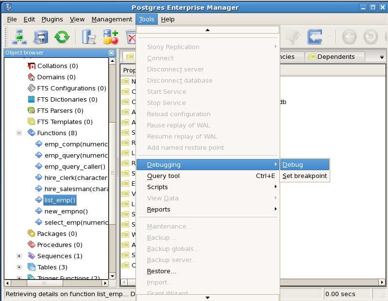

*Figure 7.1 - Starting the Debugger from the Tools menu*

You can also right-click on the name of the stored procedure or function in the PEM client Object Browser, and select Debugging, and the Debug from the context menu as shown in Figure 7.2.

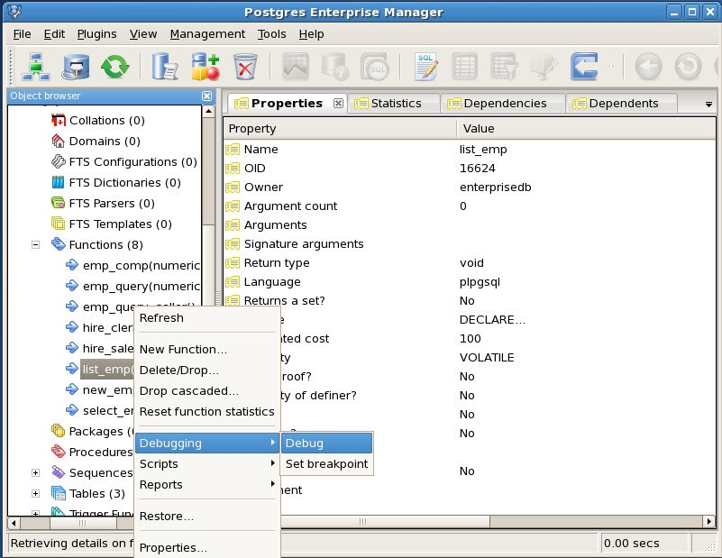

*Figure 7.2 - Starting the Debugger from the object’s context menu*

Note that triggers cannot be debugged using standalone debugging. Triggers must be debugged using in-context debugging. See Section 7.5.5.3 for information on setting a global breakpoint for in-context debugging.

To debug a package, highlight the specific procedure or function under the package node of the package you wish to debug and follow the same directions as for stored procedures and functions.

### The View Data Options Window

You can use the View Data Options window to pass parameter values when you are standalone-debugging a program that expects parameters. When you start the debugger, the View Data Options window opens automatically to display any IN or IN OUT parameters expected by the program. If the program declares no IN or IN OUT parameters, the View Data Options window does not open.

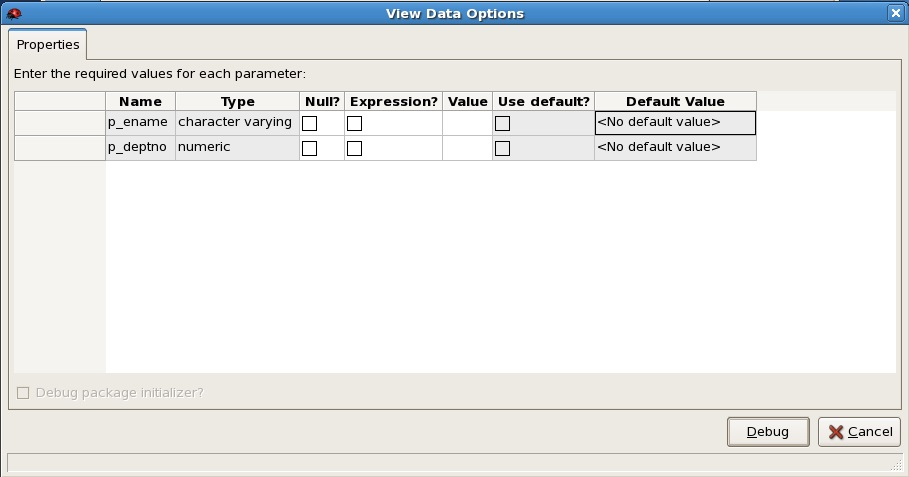

*Figure 7.3 - The View Data Options window*

Use the fields on the View Data Options window (shown in Figure 7.3) to provide a value for each parameter:
 - The Name field contains the formal parameter name.
 - The Type field contains the parameter data type.
 - Check the Null? checkbox to indicate that the parameter is a NULL value.
 - Check the Expression checkbox if the Value field contains an expression.
 - The Value field contains the parameter value that will be passed to the program.
 - Check the Use default? checkbox to indicate that the program should use the value in the Default Value field.
 - The Default Value field contains the default value of the parameter.

Press the Enter key to select the next parameter in the list for data entry, or click on a Value field to select the parameter for data entry.

If you are debugging a procedure or function that is a member of a package that has an initialization section, check the Debug Package Initializer check box to instruct the Debugger to step into the package initialization section, allowing you to debug the initialization section code before debugging the procedure or function. If you do not select the check box, the Debugger executes the package initialization section without allowing you to see or step through the individual lines of code as they are executed.

After entering the desired parameter values, click the OK button to start the debugging process. Click the Cancel button to terminate the Debugger and return control to the PEM client.

**Note:** The View Data Options window does not open during in-context debugging. Instead, the application calling the program to be debugged must supply any required input parameter values.

When you have completed a full debugging cycle by stepping through the program code, the View Data Options window re-opens, allowing you to enter new parameter values and repeat the debugging cycle, or end the debugging session.

### Main Debugger Window

The Main Debugger window (see Figure 7.4) contains three panes:
 - the Program Body pane
 - the Stack pane
 - the Output pane

You can use the debugger menu bar or tool bar icons (located at the top of the debugger window) to access debugging functions.

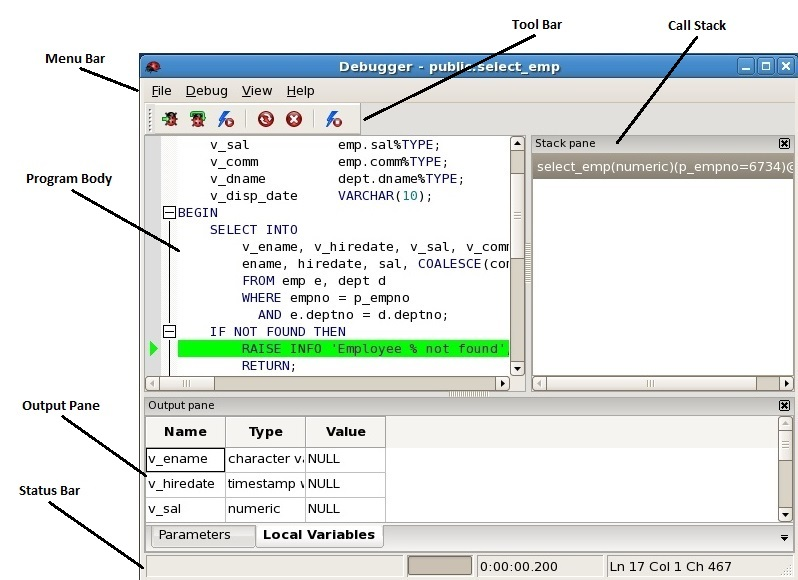

*Figure 7.4 - The Main Debugger window*

Status and error information is displayed in the status bar at the bottom of the Debugger window.

#### The Program Body Pane

The Program Body pane in the upper-left corner of the Debugger window displays the source code of the program that is being debugged.

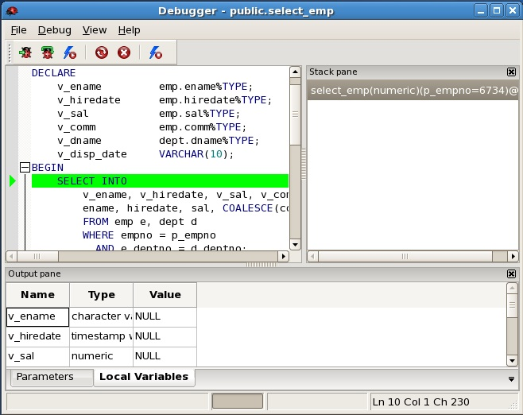

*Figure 7.5 - The Program Body*

Figure 7.5 shows that the Debugger is about to execute the SELECT statement. The green indicator in the program body highlights the next statement to execute.

#### The Stack Pane

The Stack pane displays a list of programs that are currently on the call stack (programs that have been invoked but which have not yet completed). When a program is called, the name of the program is added to the top of the list displayed in the Stack pane; when the program ends, its name is removed from the list.

The Stack pane also displays information about program calls. The information includes:
 - The location of the call within the program
 - The call arguments
 - The name of the program being called

Reviewing the call stack can help you trace the course of execution through a series of nested programs.

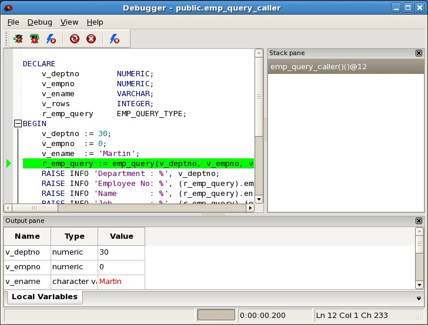

*Figure 7.6 – A debugged program calling a subprogram*

Figure 7.6 shows that emp\_query\_caller is about to call a subprogram named emp\_query. emp\_query\_caller is currently at the top of the call stack.

After the call to emp\_query executes, emp\_query is displayed at the top of the Stack pane, and its code is displayed in the Program Body frame (see Figure 7.7).

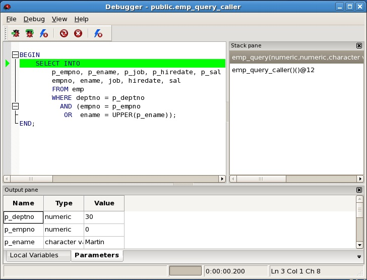

*Figure 7.7 - Debugging the called subprogram*

Upon completion of execution of the subprogram, control returns to the calling program (public.emp\_query\_caller), now displayed at the top of the Stack pane in Figure 7.8.

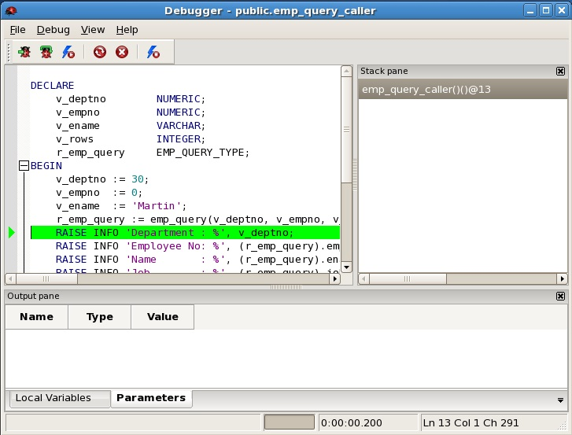

*Figure 7.8 – Control returns from debugged subprogram*

Highlight an entry in the call stack to review detailed information about the selected entry on the tabs in the Output pane. Using the call stack to navigate to another entry in the call stack will not alter the line that is currently executing.

#### The Output Pane

You can use tabs in the Output pane (see Figure 7.9) to view or modify parameter values or local variables, or to view messages generated by RAISE INFO and function results.

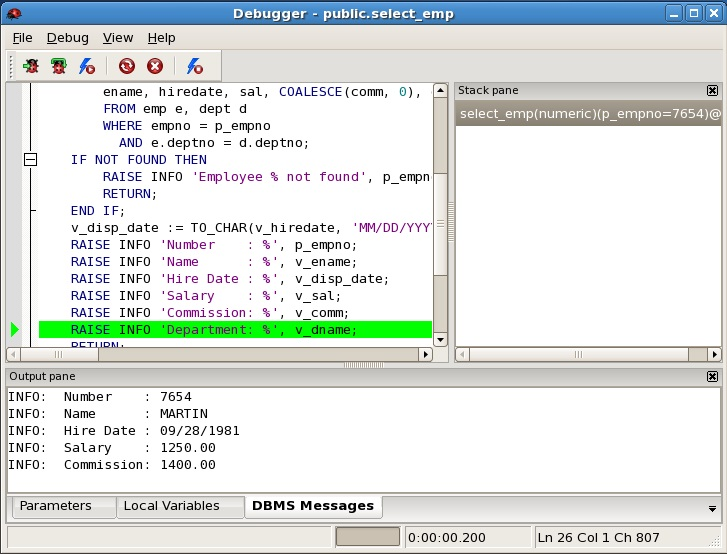

*Figure 7.9 – The DBMS Messages tab of the Output pane.*

Each tab contains a different type of information:
 - The Parameters tab displays the current parameter values.
 - The Local Variables tab displays the value of any variables declared within the program.
 - The DBMS Messages tab displays any results returned by the program as it executes.
 - The Results tab displays program results (if applicable).

#### The Status Bar

The status bar (see Figure 7.10) displays a message when the Debugger pauses, when a runtime error message is encountered, or when execution completes.

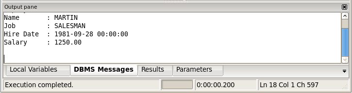

*Figure 7.10 - The Status Bar, indicating Execution completed.*

### Debugging a Program

You can perform the following operations to debug a program:
 - Step through the program one line at a time
 - Execute the program until you reach a breakpoint
 - View and change local variable values within the program

#### Stepping Through the Code

Use the tool bar icons to step through a program with the Debugger:

>  Use the Step Into icon to **e**xecute the line of code currently highlighted by the green bar in the Program Body pane, and then pause execution. If the executed code line is a call to a subprogram, the called subprogram is brought into the Program Body pane, and the first executable line of code of the subprogram is highlighted as the Debugger waits for you to perform an operation on the subprogram.
>
>  Use the Step Over icon to execute a line of code, stepping over any subprograms invoked by that line of code. The subprogram is executed, but not debugged. If the subprogram contains a breakpoint, the debugger will stop at that breakpoint.
>
>  Use the Continue icon to execute the line of code highlighted by the green bar, and continue execution until either a breakpoint is encountered or the last line of the program has been executed.

Figure 7.11 shows the locations of the Step Into, Step Over, and Continue icons on the tool bar:

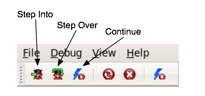

*Figure 7.11 - The Step Into, Step Over, and Continue icons*

The debugging operations are also accessible through the Debug menu, as shown in Figure 7.12.

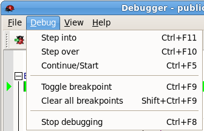

*Figure 7.12 - Debug menu options*

#### Using Breakpoints

As the Debugger executes a program, it pauses whenever it reaches a breakpoint. When the Debugger pauses, you can observe or change local variables, or navigate to an entry in the call stack to observe variables or set other breakpoints. The next step into, step over, or continue operation forces the debugger to resume execution with the next line of code following the breakpoint. There are two types of breakpoints:

***Local Breakpoint -*** A local breakpoint can be set at any executable line of code within a program. The Debugger pauses execution when it reaches a line where a local breakpoint has been set.

***Global Breakpoint -*** A global breakpoint will trigger when *any* session reaches that breakpoint. Set a global breakpoint if you want to perform in-context debugging of a program. When a global breakpoint is set on a program, the debugging session that set the global breakpoint waits until that program is invoked in another session. A global breakpoint can only be set by a superuser.

To create a local breakpoint, left-click in the grey shaded margin to the left of the line of code where you want the local breakpoint set. The Debugger displays a red dot in the margin, indicating a breakpoint has been set at the selected line of code (see Figure 7.13).

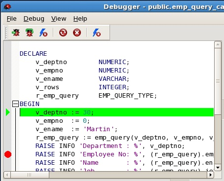

*Figure 7.13 - Set a breakpoint by clicking in left-hand margin*

You can also set a breakpoint by left-clicking in the Program Body to place your cursor, and selecting Toggle Breakpoint from Debug menu or by clicking the Toggle Breakpoint icon (see Figure 7.14). A red dot appears in the left-hand margin indicating a breakpoint has been set as the line of code.

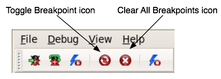

*Figure 7.14 - The breakpoint control icons*

You can set as many local breakpoints as desired. Local breakpoints remain in effect for the duration of a debugging session until they are removed.

**Removing a Local Breakpoint**

To remove a local breakpoint, you can:
 - Left click the mouse on the red breakpoint indicator in the left margin of the Program Body pane. The red dot disappears, indicating that the breakpoint has been removed.
 - Use your mouse to select the location of the breakpoint in the code body, and select Toggle Breakpoint from Debug menu, or click the Toggle Breakpoint icon.

You can remove all of the breakpoints from the program that currently appears in the Program Body frame by selecting Clear all breakpoints from the Debug menu (see Figure 7.15) or by clicking the Clear All Breakpoints icon.

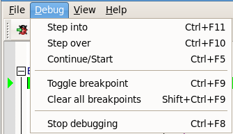

*Figure 7.15 - The breakpoint menu options*

**Note:** When you perform any of the preceding actions, only the breakpoints in the program that currently appears in the Program Body frame are removed. Breakpoints in called subprograms or breakpoints in programs that call the program currently appearing in the Program Body frame are not removed.

#### Setting a Global Breakpoint for In-Context Debugging

To set a global breakpoint for in-context debugging, highlight the stored procedure, function, or trigger on which you wish to set the breakpoint in the Object browser panel. Navigate through the Tools menu to select Debugging, and then Set Breakpoint (see Figure 7.16)

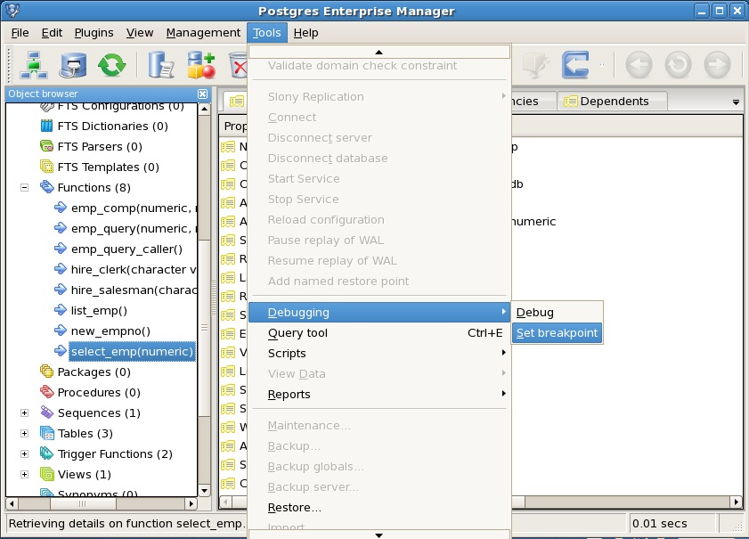

*Figure 7.16 - Setting a global breakpoint from the Tools menu*

Alternatively, you can right-click on the name of the stored procedure, function, or trigger on which you wish to set a global breakpoint and select Debugging, then Set Breakpoint from the context menu as shown in Figure 7.17.

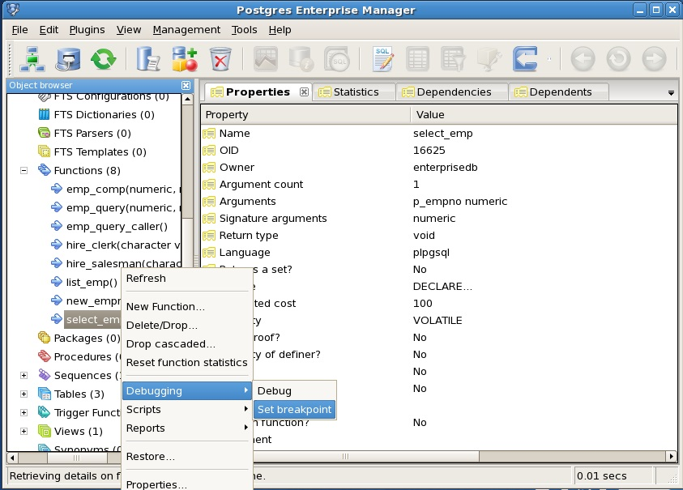

*Figure 7.17 - Setting a global breakpoint from the object's context menu*

To set a global breakpoint on a trigger, expand the table node that contains the trigger, highlight the specific trigger you wish to debug, and follow the same directions as for stored procedures and functions.

To set a global breakpoint in a package, highlight the specific procedure or function under the package node of the package you wish to debug and follow the same directions as for stored procedures and functions.

After you choose Set Breakpoint, the Debugger window opens and waits for an application to call the program to be debugged (see Figure 7.18).

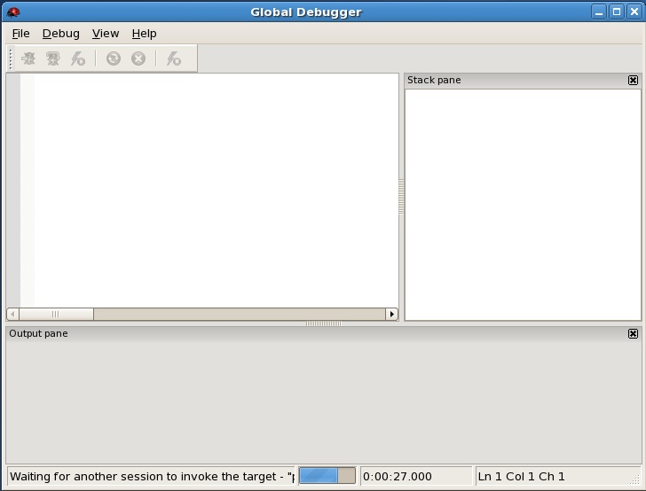

*Figure 7.18 - Waiting for invocation of program to be debugged*

In Figure 7.19, the EDB-PSQL client invokes the select\_emp function (on which a global breakpoint has been set).

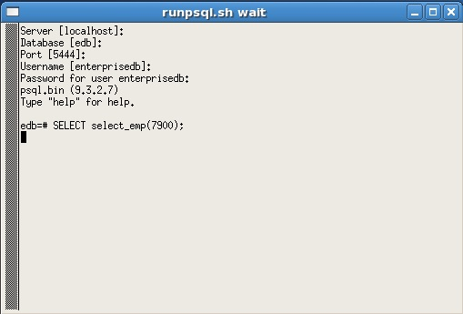

*Figure 7.19 - Application invoking program with a global breakpoint*

The select\_emp function does not complete until you step through the program in the Debugger, which now appears as shown in Figure 7.20.

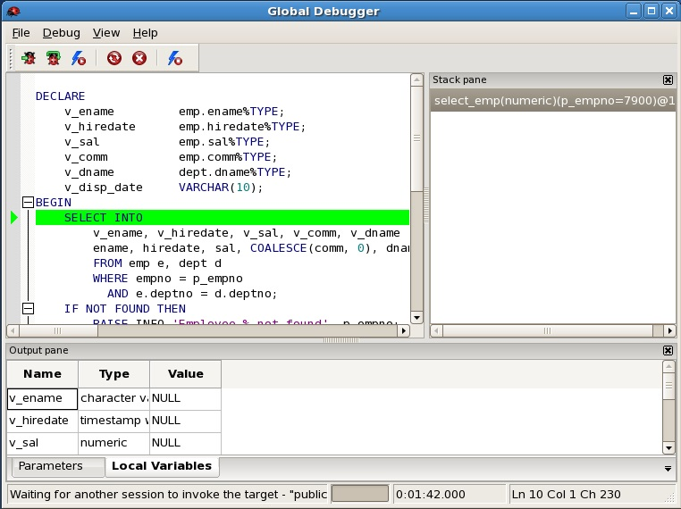

*Figure 7.20 - Program on which a global breakpoint has been set*

You can now debug the program using any of the previously discussed operations such as step into, step over, and continue, or set local breakpoints. When you have stepped through execution of the program, the calling application (EDB-PSQL) regains control as shown in Figure 7.21.

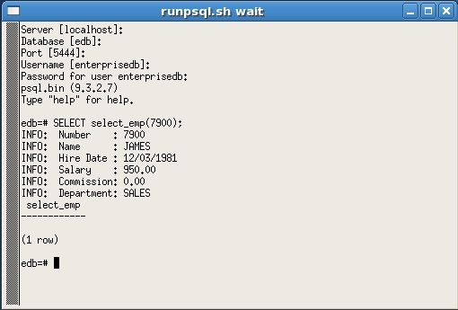

*Figure 7.21 - Application after debugging*

The select\_emp function completes execution and its output is displayed.

At this point, you can end the Debugger session by choosing Exit from the File menu. If you do not end the Debugger session, the next application that invokes the program will encounter the global breakpoint and the debugging cycle will begin again.

#### Exiting the Debugger

To end a Debugger session and exit the Debugger, select Exit from File menu or press Alt-F4 as shown by the following:

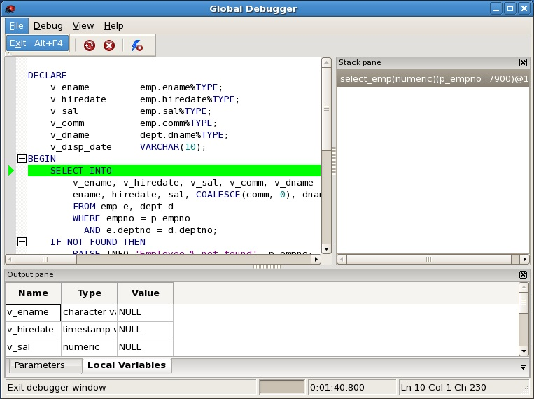

*Figure 7.22 - Exiting from the Debugger*

