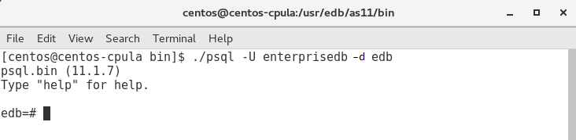

---

title: "Connecting to Advanced Server with psql"
---

`psql` is a command line client application that allows you to execute SQL commands and view the results. To open the psql client, the client must be in your search path. The executable resides in the `bin` directory, under your Advanced Server installation.

Use the following command and options to start the psql client (see Figure 6.2):

> `psql -d edb -U enterprisedb`

<i>Figure 6.2 - Connecting to the server.</i>

Where:

> -`d` specifies the database to which psql will connect;
>
> -`U` specifies the identity of the database user that will be used for the session.

For more information about using the command line client, please refer to the PostgreSQL Core Documentation at:

https://www.postgresql.org/docs/11/static/app-psql.html