# Competitive Research of Documentation Site Information Architecture

by George Song, 2020-11-17T09:59:04-08:00

## Summary

From my perspective, the EDB documentation site has the following primary
purposes:

- Why should I choose PostgreSQL over other relational (or potentially
  document-based) database?
- Why do I need EDB products on top of PostgreSQL?
- How do I do …?
- Feature-by-feature product documentation.
- How do I get help?
- How do I contribute?

It's with these goals in mind that I'm exploring various documentation sites.

## SQLite

<https://www.sqlite.org/docs.html>

I really like the "Overview Documents" and the "Advocacy" sections. The
overviews tell me _why_ I should use SQLite, and the advocacy section tells me
who else is using SQLite and clear wins using SQLite.

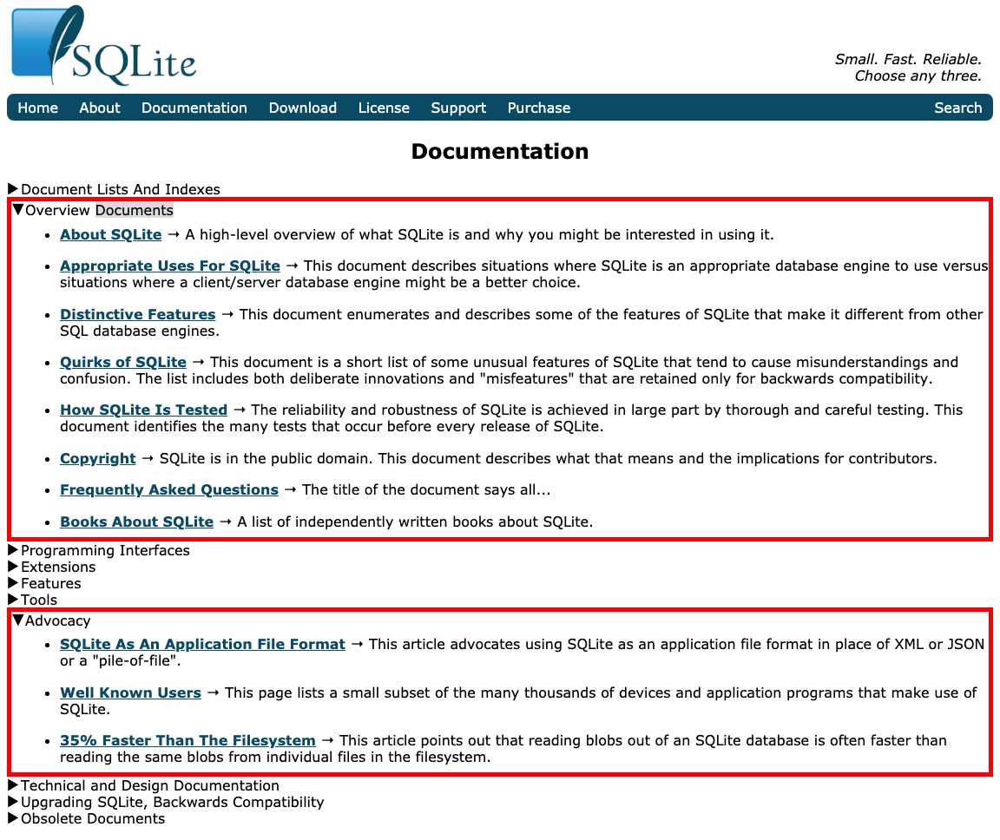

## Firebase

<https://firebase.google.com/docs>

I really like how Firebase encourages me to dive right in, based on the
technology I'm familiar with. It's also nice that the products are broken down
by major goals, but I find the "Firebase by product" section less helpful.

## Prisma

<https://www.prisma.io/docs/>

I like how I just need to spend 5 minutes to get hands-on with Prisma. It's
also great that I know where to go for help if I'm already using Prisma.

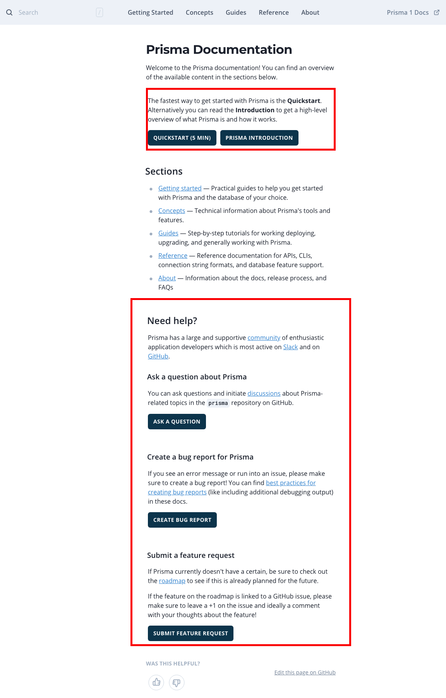

## Hasura

<https://hasura.io/docs/1.0/graphql/core/index.html>

Hasura leads with basic relational database and GraphQL concepts since they
have a fairly novel take on ORM. However, I feel like they could have promoted
the "Learn" section to be more prominent, as I find that's I'm most tempted to
start.

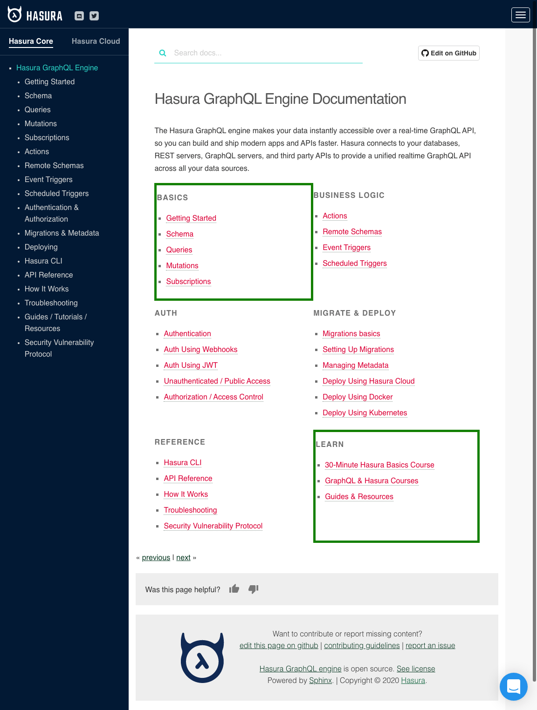

## Apollo

<https://www.apollographql.com/docs/>

I really like how Apollo tells you in one paragraph why you should be
interested in the product, at the top of the page. This kind of messaging is
worth repeating on major landing pages.

I also like how they are specific about a section for newcomers.

The "Recommended workouts" feel really well organized to me as well, depending
on where I am in the development lifecycle with regards to the product.

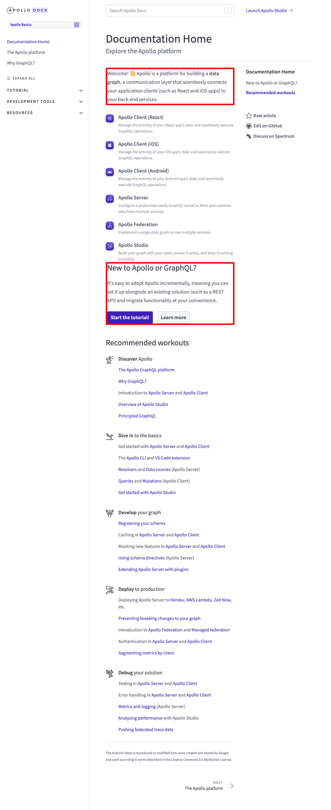

## Active Record

<https://guides.rubyonrails.org/active_record_basics.html>

This example highlights a specific feature of Rails. I like how I'm told
immediately what my takeaways will be. The rest of the document is well
organized in how I would want to learn about this feature.

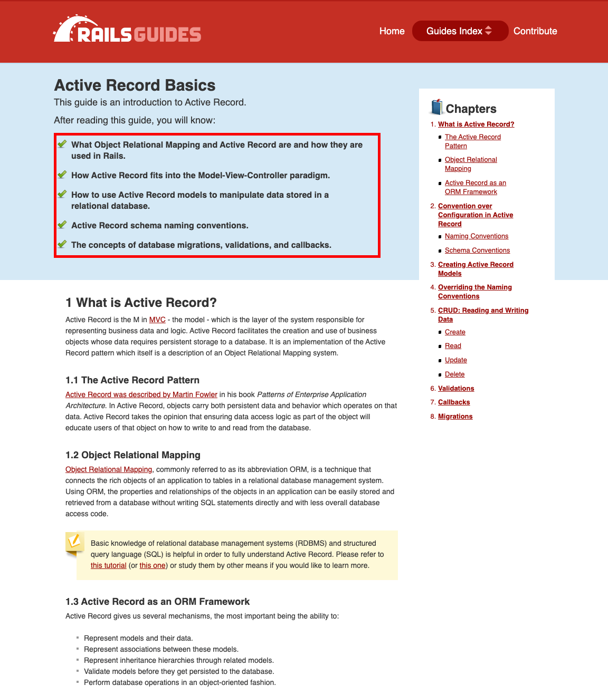

## Django

<https://docs.djangoproject.com/en/3.1/>

I love the first three sections at the top of the Django documentation site:
show me some tutorials, how do I get help, and how do I use this site?

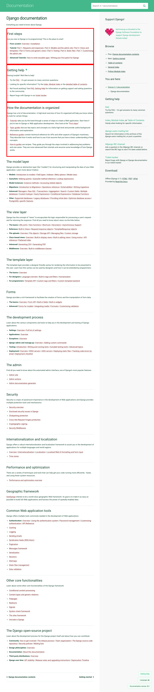

## XState

<https://xstate.js.org/docs/>

I personally think XState does a great job at breaking down the very abstract
tool of state charts. The guides are especially good at teasing out the
practical uses of various components of state charts, building from the simple
concepts up.

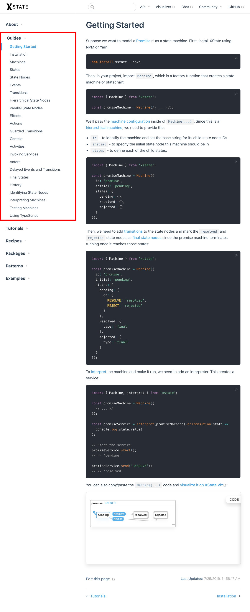

## Auth0

<https://auth0.com/docs>

I really like how Auth0 encourages you to dive right in and provides a path for
three different types of discovery:

- I work on a specific tech stack, how does Auth0 help me?
- I need to accomplish this specific task, how do I do that with Auth0?
- I'm a deep learner and would like to understand Auth0 before diving in.

## Docker

<https://docs.docker.com/>

Docker does a very good job at surfacing relevant, curated content. I
especially like the actionable sections of "How do I?" and "Develop with
Docker." The "Best practices" section is one I personally have read cover to
cover and refer back to periodically.

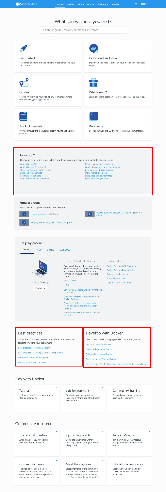

## React

<https://reactjs.org/docs/getting-started.html>

I like how React succinctly tells me what it's for, and presents their
documentation almost as a story that you can read from top to bottom.

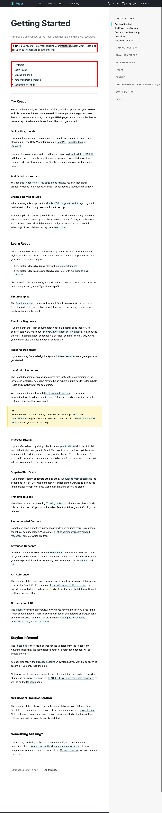

## Vue

<https://v3.vuejs.org/guide/introduction.html>

Vue does a good job addressing people who are familiar with previous versions,
as well as people new to Vue. I love the [Intro to Vue 3][] video course for
people who would rather learn that way.

Vue also defines very clearly what it is right up front.

The rest of the intro is very hands-on, so definitely slanted toward an
audience that learns by doing.

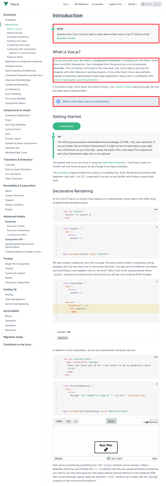

## Svelte

<https://svelte.dev/>

The Svelte site does a good job of combining marketing (why pick Svelte over
React, without mentioning React), and the technical (this is our very simple
philosophy).

As a developer, you see immediately how you tackle the big issues:

- What does a component look like?
- How do I style a component?
- What's the state management story?
- How do I add some animation? (OK, this may not be top of mind immediately.)

Svelte also builds trust by showing you who else is using the tool.

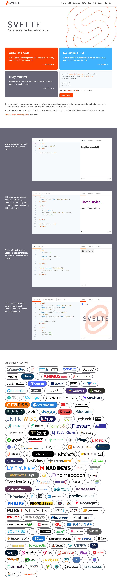

[intro to vue 3]: https://www.vuemastery.com/courses/intro-to-vue-3/intro-to-vue3/
