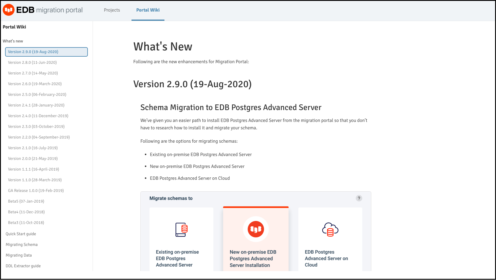

.. raw:: html

.. raw:: latex

    \newpage

***************************************************
`Overview of the Migration Portal Wiki Page`:index:
***************************************************

.. index:: resources
           knowledge base
           repair handlers

The Portal Wiki page provides quick access to information:

* What’s New information
* Quick Start guide
* Migrating Schema
* Migrating Data
* DDL Extractor guide
* Knowledge Base
* Repair handlers
* Migration Portal User's Guide
* FAQs

      *The Migration Portal Wiki page.*
