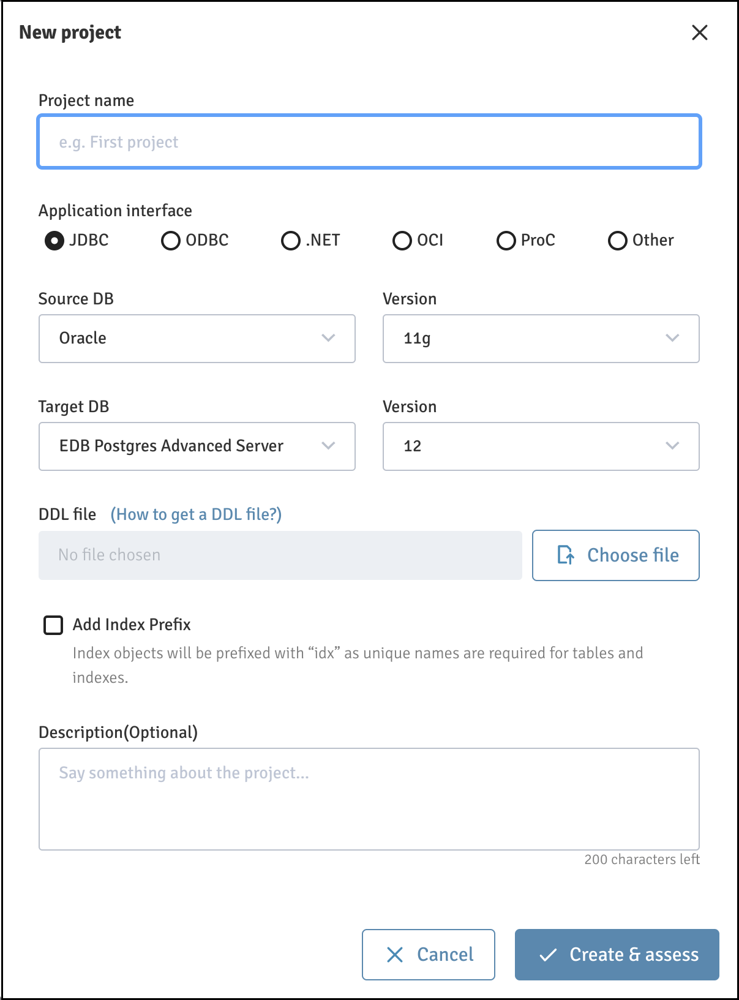
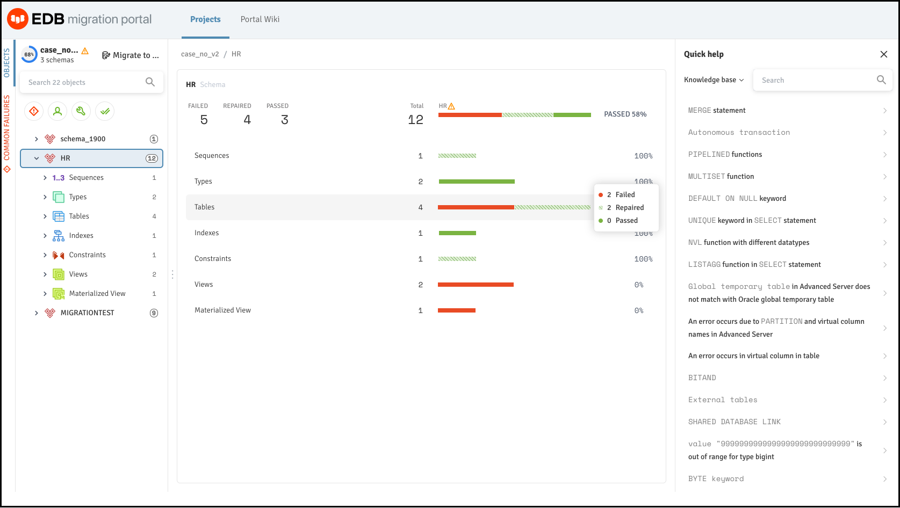
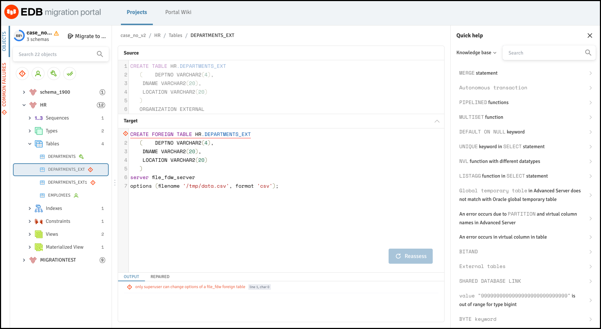
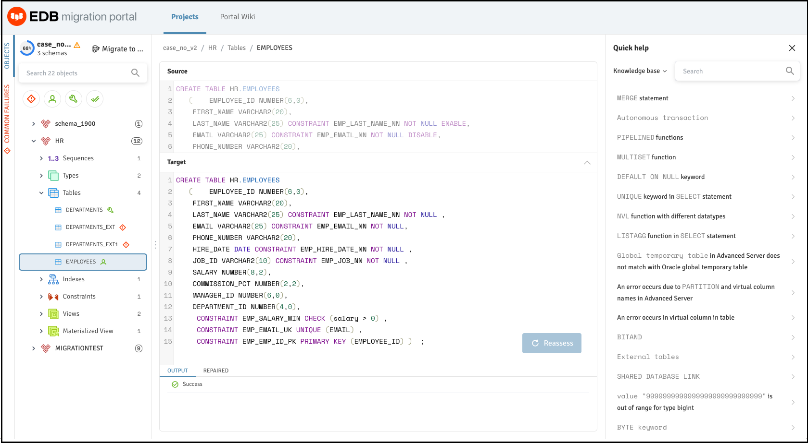
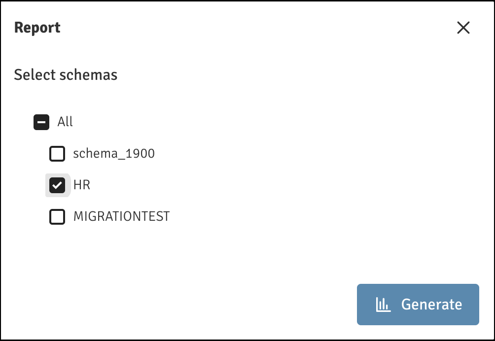

.. raw:: html

.. raw:: latex

    \newpage

***************************************
`Performing a Schema Assessment`:index:
***************************************

To assess an Oracle database schema for compatibility with EDB Postgres Advanced
Server, you must:

1. Navigate to the `Migration Portal <https://migration.enterprisedb.com>`_.

2. Enter your EDB credentials.

3. Click the ``CREATE PROJECT`` icon to create a new project.

   *The Migration Portal New project dialog.*

4. On the ``New project`` dialog, enter the project name in the ``Project name``
   field.

5. Specify project details:

   * Select the radio button next to the ``Application interface``.

   * Select a ``Source DB`` and ``Version`` for the source.

   * Select the ``Target DB`` and ``Version`` for the target.

6. Click ``Choose file`` to upload the .SQL file generated by the latest
   EDB DDL Extractor for Oracle Database.

   **Note**:

   - You should not modify the .SQL file.

   - Only the .SQL file generated by the latest EDB DDL Extractor can be uploaded.

   For more information, refer to the :doc:`Schema Extraction <mp_schema_extraction>` section.

7. Check the box next to ``Add Index Prefix`` to specify an index prefix (``idx``) when creating
   a project to ensure better assessment results, as EDB Postgres Advanced Server does not support the same name for tables and indexes.

8. Click ``Create & assess`` to create a new project and to assess the schemas.

    .. figure:: images/mp_schema_assessment_analysis_result.png
       :alt: migration portal image
       :align: center
       :scale: 45%

       *The Schema analysis result.*

  The analysis tool will review every construct and execute repair actions to improve compatibility with EDB Postgres Advanced Server, and flag any remaining errors that require manual intervention.

9. Verify the DDL objects (e.g., TABLES) that do not show a 100%
   success ratio.

   *Verifying the DDL objects.*

10. Click the objects that are not compatible with EDB Postgres Advanced Server and view
    the details.  At the bottom of the middle panel, you can view repair action details.

   *Incompatible objects are identified.*

11. Refer to the Knowledge Base information in the right panel to locate
    the possible workarounds for the objects that are not immediately
    compatible with EDB Postgres Advanced Server.  You can also view the Knowledge Base
    information on the Portal Wiki page.

.. figure:: images/mp_schema_assessment_errors.png
   :alt: assessment result with errors
   :align: center
   :scale: 35%

   *Assessment result with errors.*

12. On the ``Knowledge Base`` tab, you can enter the error message for the
    incompatible objects with EDB Postgres Advanced Server and click ``Search``.

    The object detail panel displays the workaround or the resolution
    for the failed object. You can manually make the changes on the
    ``Assessment`` tab for that object, and click ``Reassess``.

**Note**: If any failed object passes while reassessing, the dependent
objects for that object are also reassessed.

   *Workaround or resolution for incompatible objects.*

Similarly, you can make all the incompatible objects compatible.

.. Note:: If the information or workaround for incompatible objects is not available in the Knowledge Base, please contact the support team for assistance.

When you have finished working with the DDL, you can either download the modified EDB compatible DDL as a .sql file or migrate the schemas see, `Schema Migration <#mp_schema_migration>`_.

.. raw:: html

.. index:: schema assessment report
.. raw:: latex

    \newpage

.. index:: schema assessment report

Generating an Assessment Report
-------------------------------

Migration Portal’s report functionality provides a high-level assessment
summary of the schemas assessed for your project. In addition, the
report provides details about the failed objects and the cause of
failure.

   *Select schemas for reports.*

To generate a report:

1. Click the ``Report`` button to access the schema selection dialog.

2. Select the schemas that you wish to include in the report.

3. Click ``Generate`` to generate the onscreen report.

.. figure:: images/mp_schema_assessment_schema_report.png
   :alt: schema assessment report html
   :align: center
   :scale: 30%

   *The Schema Assessment Report.*

You can optionally select ``Generate PDF`` to save the report in ``.pdf`` format.
You can also view the count of distinct repair handlers applied to the DDLs under the selected schemas.

.. figure:: images/mp_schema_assessment_schema_report_pdf.png
   :alt: migration portal image
   :align: center
   :scale: 30%

   *The saved pdf report.*
