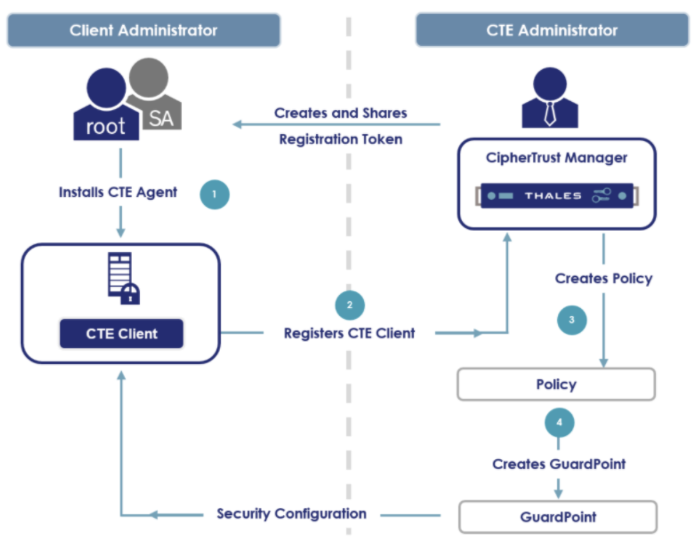
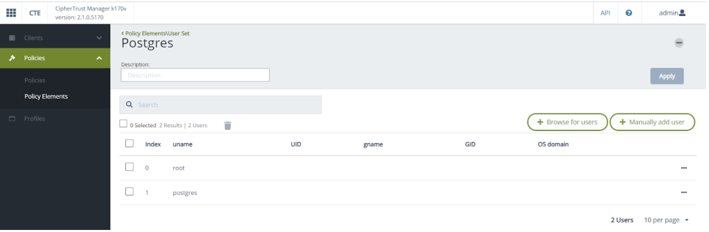
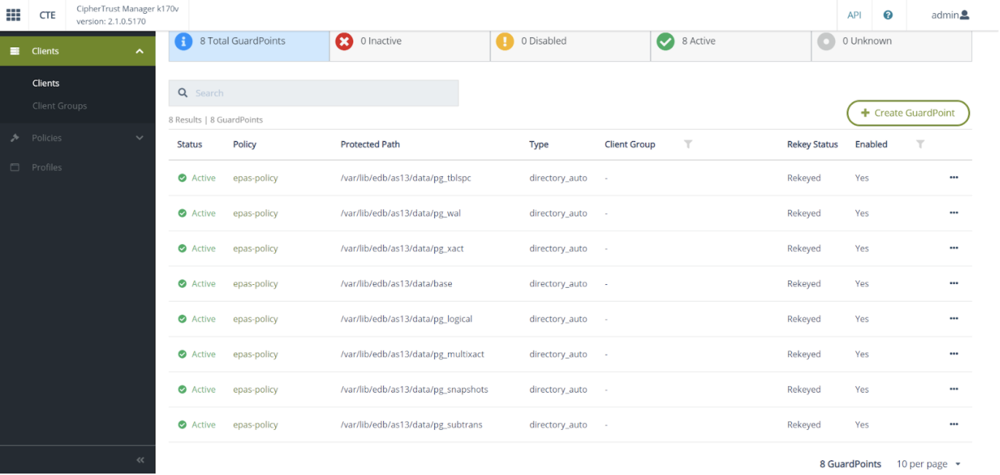

  

<h1 style="text-align: center;">EDB GlobalConnect Technology Partner Implementation Guide</h1>
<h3 style="text-align: center;">Thales CipherTrust Transparent Encryption</h3>

### Partner Information 
|      |  |
| ----------- | ----------- |
| Partner Name      | Thales       |
| Partner Product   |  CipherTrust Transparent Encryption       |
| Web Site      |    https://cpl.thalesgroup.com/encryption    |
| Version & Platform   |  7.1.0, Available platforms: Windows , Linux      |
| Product Description:      |    CipherTrust Transparent Encryption delivers data-at-rest encryption with centralized key management privileged user access control and detailed data access audit logging. This protects data wherever it resides, on- premises, across multiple clouds and within big data, and container environments.   |
| Version & Platform   |  7.1.0, Available platforms: Windows, Linux     |

### Solution Summary
Thales CipherTrust Transparent Encryption (CTE) is designed to meet data security compliance and best practice requirements with minimal disruption. The CTE agents are installed at the operating file-system or device layer, and encryption and decryption is transparent to all applications that run above it. CTE agents are installed on EDB Postgres Advanced and Postgres Extended database servers and protect the database directories. The solution works in conjunction with the FIPS 140-2 up to Level 3 compliant CipherTrust Manager, which centralizes encryption key and policy management for the CipherTrust Data Security Platform.

  

*Note: EDB Postgres Extended with BDR (Bi-Directional Replication) 

### Implementing CTE

Implementing the CipherTrust Transparent Encryption (CTE) solution requires the following components:
1. Postgres Server installed and in operation.
2. CipherTrust Manager installed and operational.
3. A CTE agent installed on the Postgres host registered to the CipherTrust Manager.

The following diagram shows the basic flow of the CTE solution:

  

### Prerequisites
#### Postgres Host
1. Ensure that the Postgres Server is installed and running.
2. For CentOS 7, you need to install the following repository:

  

#### CipherTrust Manager
1. Ensure CipherTrust Manager is installed and running.

  

### Configuring CipherTrust Manager
Logon to the CipherTrust Manager (CM) Web GUI and perform the following steps:

1. **Create  Registration Token**
    a. Navigate to **Key and Access Management** and select **Registration Tokens**. This token will be used for the CTE agent enrollment to CM. 
    b. Select **New Registration Token** to create a new Registration Token. The following screenshot shows a Registration Token created with the name **edb**.

  

2. **Create User Sets**
    a. Navigate to **CTE** and select **Policies, Policy Elements** and then **User Sets**. 
    b. Select **Create User Set** to create a new User Set. The following screenshots show the User Sets created, **Postgres, EnterpriseDB and Barman**.

  

  

  

3. **Create Policies**
    a. Navigate back to **Policies** and select **Create Policy**.
    b. The following screenshots show Live Data Transformation (LDT) policies **postgres-policy, epas-policy and barman-policy**. 

  

  

  

NOTE: The policies include the User Sets **Postgres** and **EnterpriseDB** respectively created in Step 2 and the same Key Rule for the policies: 

  

### Installing CTE Agent

Refer to the following guides from Thales for installing the CTE agent on the Postgres host:

[CTE Agent Quick Start Guide](https://thalesdocs.com/ctp/cte/Books/Online-Files/7.0.0/CTE_Agent_Linux_Quick_Start_Guide_v7.0.0_Doc_v1.pdf)

[CTE Agent Advanced Installation Guide](https://thalesdocs.com/ctp/cte/Books/Online-Files/7.0.0/CTE_Agent_Linux_Adv_Config_Integration_Guide_v7.0.0_Doc_v6.pdf)

NOTE: You will need the **Registration Token** and host address of the **CipherTrust Manager** during the installation.  

After the CTE agent is successfully installed, verify the Postgres host is registered with CM.
1. Log on to the CM Web GUI and navigate to **CTE**.
2. Select **Clients**. The client status should appear as **Healthy** as shown below (you may have to wait a few seconds for the status to get updated).

  

### Using CTE

CTE protects data either at the file level or at the storage device level. A CTE Agent running on the (Postgres) host manages the files behind a GuardPoint by enforcing the policy associated with it, and communicates data access events to the CipherTrust Manager for logging. A GuardPoint is usually associated with a Linux mount point or a Windows volume, but may also be associated with a directory subtree.

  

### Sample User Scenarios

This section describes sample user scenarios of deploying CTE solutions on Postgres hosts such as 
- EDB Postgres Advanced Server
- EDB Postgres Extended with BDR

**EDB Postgres Advanced Server 13 (Single Instance)**

1. Install CTE agent on the Postgres host. 
2. Login to the Postgres host and stop the postgres server.
3. Create the GuardPoints via the CM Web GUI using the **epas-policy** Policy on the postgres host. Set the following directories as the **Protected Path** on the EPAS host (assuming PGDATA is set /var/lib/edb/as13/data on the host):

  

4. Restart the Postgres server on the Postgres host as the user **enterprisedb**.  Make sure you are logged in using ssh (not sudo).

**EDB Postgres Extended with BDR-Always-ON**
The following diagram shows the BDR-Always-ON architecture. For more details, refer to the [BDR-Always-ON Architecture](https://documentation.2ndquadrant.com/tpa/release/21.1-1/architecture-BDR-Always-ON/) documentation.
 
NOTE: The documentation requires EDB access credentials.

  

1. Install CTE agents on all the Postgres and barman nodes.

2. Create a GuardPoint via the CM Web GUI using the **barman-policy** Policy on the directory  **/var/lib/barman/<server-name>**  on the barman node in data center A (DC A). The following screenshot shows a GuardPoint created for the barman node.

  

3. Login to the Standby node in data center A and stop the postgres server.

4. Create a GuardPoint on the Standby node via the CM Web GUI using the postgres-policy Policy on the PGDATA directory **/opt/postgres/data**. 

5. Restart the Postgres server on the Standby node as the user **postgres**.  Make sure you are logged in using ssh (not sudo).

6. Login to the Shadow Master node in data center A and stop the postgres server.

7. Create a GuardPoint on the Shadow Master node via the CM Web GUI using the postgres-policy Policy on the PGDATA directory **/opt/postgres/data**. 

8. Restart the Postgres server on the Shadow Master node as the user **postgres**.  Make sure you are logged in using ssh (not sudo).

9. Login to the Lead Master node in data center A and stop the postgres server.

10. Create a GuardPoint on the Lead Master node via the CM Web GUI using the **postgres-policy** Policy on the PGDATA directory **/opt/postgres/data**. 

11. Restart the Postgres server on the Lead Master node as the user **postgres**.  Make sure you are logged in using ssh (not sudo).

12. The following screenshot shows a GuardPoint created for Lead Master in data center A.

  

13. Repeat steps 2 through 11 for postgres and barman nodes in data center B (DC B).

### Certification environment

|      |  |
| ----------- | ----------- |
| Certification Test Date      | May 19 2021       |
| OS      |  CentOS Linux 7 (Core)      |
| Memory      |  2G      |
| Processor   |  Intel® Xeon® Processor SP Family (“Skylake”)       |
| Cloud Platform      | OpenStack (Kilo)      |
| CPU(s)   |  1     |
| Core(s) per socket  |  1     |
| Socket(s)  |  1     |
| Storage  |  80 GB     |
| CipherTrust Transparent Encryption  |  7.0.0.99     |
| EDB Advanced Server  |  13.2.5     |

|      |  |
| ----------- | ----------- |
| Certification Test Date      | May 19 2021       |
| OS      |  CentOS Linux 7       |
| Cloud Platform      |  AWS      |
| Deployment Tool   |  tpaexec v20.11       |
| BDR-Always-ON  |  3.6.1     |

NOTE: Refer to the [sample config.yml](https://drive.google.com/file/d/1wINpemSrN55Ay4FXQWfIS1acTPFMTih2/view?usp=sharing) for deployment details. 