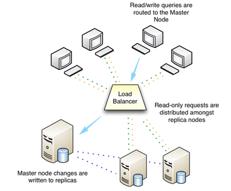

The Ark console and API are designed to help you easily create and manage high-availability database clusters.

!!! Note
    Traditionally, the expression *cluster* refers to a single instance of Postgres managing multiple databases; an EDB Ark database server cluster is a collection of high-availability Postgres server instances that reside in a cloud or on a traditional network.

When you create a new cluster (a group of replicated database servers), EDB Ark initializes one or more Postgres instances (virtual machines) according to your specifications. EDB Ark uses Postgres streaming replication to synchronize replicas in the cluster, and pgpool-II to implement load balancing and connection pooling among all active instances.

The master node of the cluster contains a host operating system with a running instance of Postgres, along with the load balancer. Database modifications are automatically routed to the master node; any modifications to the master node are subsequently propagated to each replica using Postgres streaming replication.

EDB Ark installs Postgres on each replica node in a read-only hot-standby role that automatically duplicates all data found on the master node, and all changes made to that data. In hot-standby mode, the data is available to service user queries providing read scalability to the cluster. In addition, any schema changes made to the master are also replicated to the replica nodes, making development and deployment of application changes easy and seamless without interruption to normal operations.

Replicas provide balanced user support as needed - if any instance in the cluster goes offline, the cluster's load is re-balanced among the remaining servers while the instance is automatically replaced.

When used in the default healing configuration, in the event of a failure of the master node, an existing replica is used to replace the failed master node. While the replica nodes are standing by, they are read-only resources, load balancing client queries without a risk of compromising data integrity.

EDB Ark automatically archives data at regular intervals; you can specify a convenient backup window and how many backups to retain when creating a database cluster. EDB Ark also offers backup on demand - simply click the Backup icon to save a copy of the instance. Automatic backups are retained according to your specifications; while on-demand backups are retained until you delete them. Each backup is a complete copy of the cluster; you can use a backup to restore a cluster.

EDB Ark makes it easy to scale a database cluster:

-   To increase read performance, you can add read replicas to the cluster (manually or automatically).
-   To handle expanding data requirements you can increase the amount of storage available (manually or automatically).
-   To increase the RAM or CPU processing power of the cluster's underlying virtual machine, you can manually scale a cluster into a more appropriate server class.

## Using Ark on an AWS Virtual Private Cloud

EDB Ark can create and manage clusters that reside on Amazon-hosted virtual private clouds (VPCs). A VPC is similar in structure to a traditional network, but provides the scalability and ease of maintenance offered by cloud computing.

A VPC is an isolated network with a unique IP address range and subnet addresses. When deploying a cluster, you can use the Ark console to select the VPC on which the new cluster will reside, or choose to have Ark create a new VPC.

To create a new cluster that resides on a private subnet, log into the Ark console and click the `Launch DB Cluster` button. Use the `Create a new Server Cluster` dialog to provide details about the cluster configuration. Check the box to the left of `Use Private IP addresses` to display only those VPCs which have a NAT gateway configured to support private subnets in the VPC field. Then, use the `VPC` drop-down menu to select a VPC.

After completing the `Step 1` tab, use the `Next` key to continue. Provide information in the fields on each additional tab before selecting the `Launch` button and deploying your cluster into your private subnet. For detailed information about the additional options available when defining a cluster, please see the EDB Ark Getting Started Guide, available via the Ark console dashboard.

Please note: if you use private IP addresses, the master instance is not assigned an elastic IP address. Should a failover occur, the IP address of the master instance will change.

### Using a NAT Gateway

You can deploy the Ark console on a VPC, and use a [network address translation (NAT)](https://docs.aws.amazon.com/AmazonVPC/latest/UserGuide/vpc-nat-gateway.html) gateway to provide access to services outside of the VPC. The NAT gateway allows an instance without a public IP address to securely access services and resources such as yum repositories.

When the Ark console is deployed in a private subnet (or without a public IP address), the console can only communicate with private networks in its own VPC or peered VPCs. Clusters are restricted to deploying into VPCs that have a peering connection to the VPC in which the console is deployed, and the console's VPC.

A [peering connection](https://docs.aws.amazon.com/AmazonVPC/latest/PeeringGuide/Welcome.html) allows you to route traffic between two virtual private clouds without exposing the clouds to outside connections.

Please note: when the Ark console is deployed in a private subnet, the `Use Private IP addresses` option is always `true`.
