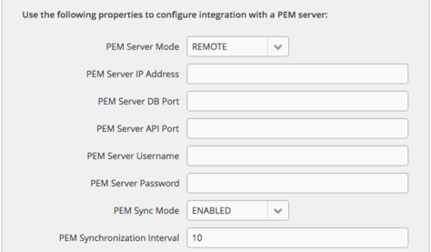
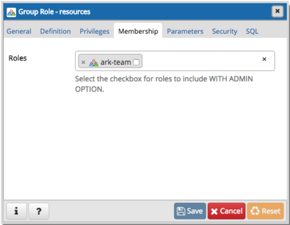
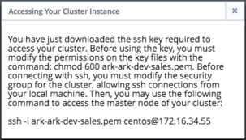

Postgres Enterprise Manager (PEM) is an enterprise management tool designed to assist database administrators, system architects, and performance analysts in administering, monitoring, and tuning PostgreSQL and EnterpriseDB Advanced Server database servers. PEM can manage and monitor a handful of servers or hundreds of servers from a single console, allowing complete control over all aspects of your databases.

A PEM installation consists of a PEM server, one or more PEM agents, and the backing database server (named `pem`). The PEM server includes a web interface that allows you to monitor and manage the database instances that are registered with a PEM agent. A PEM agent is responsible for returning metric information to the PEM server, and performing tasks on the database instances that are registered with that agent.

The Ark console installation includes a pre-configured PEM server, a PEM agent, and the pem backing database. You also have the option of using a remote PEM server to monitor your Ark console. A remote server is a PEM server that has been installed and configured on another host.

Fig. 4.1: Specifying Deployment Details

During deployment, you will be prompted to use the `PEM Server Mode` drop-down listbox to select a deployment mode:

-   Select `DISABLE` to indicate that clusters deployed on the host should not be registered with the PEM server.
-   Select `LOCAL` to indicate that you would like to use the PEM server that resides on your local host. If you select LOCAL, the PEM deployment will use default values assigned by the installer.
    -   The IP address of the PEM server host will be the IP address of the Ark host.
    -   The PEM Server DB Port will monitor port `5432`.
    -   The PEM server database user will be named `postgres`.
    -   The password associated with the PEM server will be the same password as the Ark console.
-   Select `REMOTE` to indicate that you would like to use a PEM server that resides on another host, and provide connection information on the Ark console deployment dialog.
    -   Provide the IP address of the PEM server host in the `PEM Server IP Address` field.
    -   Specify the port monitored for connections by the PEM server in the `PEM Server DB Port` field.
    -   Specify the port monitored for API connections in the `PEM Server API Port` field.
    -   Provide the name that should be used when authenticating with the PEM server in the `PEM Server Username` field.
    -   Provide the password associated with the PEM server user in the `PEM Server Password` field.

If you select `REMOTE`, whenever a new cluster node is created on this console, it will be registered for monitoring by the PEM server. Please note that you must modify the [pg_hba.conf](https://www.postgresql.org/docs/10/static/auth-pg-hba-conf.html) file of the pem database on the remote PEM server to accept connections from the host of the Ark console.

## Syncing with the PEM Server

When you register with PEM during console deployment, the *PEM Sync Mode* field will be enabled. Use the drop-down listbox in the PEM Sync Mode field to specify your preference for synchronizing with the PEM server.

If you select `DISABLED`:

-   Any object that Ark registers with PEM will be owned by the PEM user specified in the PEM Server *Username* field (if the PEM server is a REMOTE server), or by `postgres` (if the PEM server resides on the host of the LOCAL Ark server).
-   Any Ark user that registers with a console instance will not be added as a PEM user.

If you select `ENABLED`:

-   Any Amazon Role or Azure Group that is accessible by the Ark user that is deploying the console is added to the PEM server as a group role. The PEM role created for the project, role, or group is not a login role. To simplify management, each role that represents a project, role, or group is also a member of the PEM `ark-team` group role.

Fig. 4.2: The PEM Group Role dialog

-   Each user that registers with a monitored Ark instance is also created as a PEM login user. The user account will be displayed in the `Login/Group Roles` node of the PEM client tree control. To access the properties dialog for the user, right click on the user name, and select `Properties` from the context menu.

    Each PEM user account that corresponds with a registered Ark user will belong to the `ark-user` role. The PEM user account will also have membership in any `ark-team` roles that have been created to correspond to the project, role, or groups that the Ark user has permission to access.

Fig. 4.3: The PEM Login Role dialog

The PEM user account is not password enabled. To set a password for the account, an administrative user must navigate to the PEM role's `Definition` tab, and provide a password in the `Password` field.

If you use the Ark console to delete an Ark user, the synchronization service will disable the corresponding user on the PEM server. The service will ensure that membership in ark-user is revoked, and the role will no longer be a `LOGIN` role. Please note that the sync service will only modify those roles that are a member of the ark-user team.

The sync service will also ensure that the corresponding pem-team role is deleted if a tenant, group, or role is deleted on an Ark host.

Fig. 4.4: Registering as a login role

Ark will sync with PEM on the schedule specified by the `PEM Synchronization Interval` field. The field accepts interval values in minutes; by default, Ark will attempt to syncronize every 10 minutes.

## Monitoring an Ark Cluster

After deployment, you can access the PEM web interface in your choice of browser:

-   If the PEM server resides on a local host, navigate to: `https://<address_of_ark_server>/pem`
-   If the PEM server resides on a remote host, navigate to: `https://<address_of_remote_pem_server>:<port>/pem`

When prompted, provide the PEM credentials to connect.

Fig. 4.5: Logging on to the PEM Server

If you have registered the Ark console with a remote PEM server during deployment, use the PEM server credentials to connect.

If you have deployed the PEM server locally (on the Ark host), the password associated with the Ark backing database will be used for the PEM server. Unless you have modified the password (either during deployment in the DB User New Password field, or after deployment in the console backing database), the Ark database superuser has the following connection credentials at deployment:

name: `postgres`

password: `0f42d1934a1a19f3d25d6288f2a3272c6143fc5d`

You should [change the password](10_ark_console_management/#ark_console_management) after deployment to a unique password (known only to trusted users).

After authenticating with the server, the PEM web interface allows you to manage your monitored nodes.

Fig. 4.6: The PEM Global Overview

When you launch an Ark cluster on a console that is registered with PEM, Ark will register each node of the cluster with the PEM server for monitoring. Each node of an Ark cluster, and the agent that resides on the node is displayed in a Group-level heading in the PEM web interface `Browser` tree control. The node name is:

`Ark-Cluster<cluster_name>`

Where `<cluster_name>` is the name assigned to the cluster.

Right click on the IP address of a cluster node, and provide the password specified when the cluster was provisioned to authenticate with the database and view the database objects that reside on the cluster in the tree control.

PEM documentation is available via the PEM web interface Help menu, or at [the EnterpriseDB website](https://www.enterprisedb.com/products/edb-postgres-platform/edb-postgres-enterprise-managerpem/).

**Known Limitations**

If your Ark clusters are provisioned with private IP addresses, they may not be reachable from the PEM server. If this is the case, you will not be able to use PEM to remotely browse the database server. PEM agents running on the Ark cluster nodes will be able to report status to the PEM Server.

Please note that the user identifier associated with an Ark cluster (the cluster owner) must be unique across all Ark consoles supported by a given PEM server.

## Registering a PEM Agent

The PEM agent is responsible for executing tasks and reporting statistics from a monitored Postgres instance to the PEM server. The PEM agent is installed by the pem-agent RPM. By default, all engine configurations shipped with the Ark console include the PEM agent.

Fig. 4.7: PEM Architecture

After installing the PEM agent, the agent must be registered on each node that will be monitored by the PEM server. The steps that follow detail registering the PEM agent with the server, and configuring the server to monitor the agent.

Please note that before registering a node for monitoring, you must:

-   modify the `pg_hba.conf` file on the node hosting the PEM server to allow connections from any monitored node.
-   modify the `pg_hba.conf` file on any monitored node, allowing connections from the PEM server.
-   configure the agent on each monitored node.

The steps that follow provide detailed information about each configuration step. The steps assume that you have installed and configured a PEM server; for information about installing and configuring PEM, please visit the EnterpriseDB website at [www.enterprisedb.com](http://www.enterprisedb.com).

**Please note:** when a cluster node is stopped (for example, when scaling down), or if a cluster is deleted, the `Monitoring` tab of the PEM web interface will alert you that the agent on that node is down.

If the cluster has been deleted (and the agent will not resume monitoring), you can use the PEM `Browser` tree control to remove the agent definition from the PEM server. Expand the PEM Agents node of the tree control, and right-click on the name of the deleted agent; then, select `Delete/Drop` from the context menu.

**1. Create an EDB Ark Cluster**

Navigate to the Clusters tab, and create a new cluster that is provisioned using an engine definition that includes the pem-agent RPM package in the list of required RPM packages. For detailed information about creating a new server cluster, please see the `EDB Ark Getting Started Guide`, available through the Ark console's `Dashboard` tab.

**2. Modify the pg_hba.conf file to allow connections to the PEM Server**

The PEM server consists of an instance of PostgreSQL, an associated PostgreSQL database for storage of monitoring data, and a server that provides web services for the PEM web interface. The PEM server may reside on a host outside of a monitored EDB Ark cluster, or on the master node of an Ark cluster.

Before a PEM agent that resides on an Ark cluster can communicate with the PEM server, you must modify the `pg_hba.conf` file of the PostgreSQL database that stores PEM statistics to allow connections from any monitored servers as well as the PEM client.

With your choice of editor, modify the `pg_hba.conf` file of the PEM Server backing database, adding entries for the IP address of the EDB Ark cluster. The connection properties should allow connections that use `cert` and `md5` authentication.

Fig. 4.8: Modifying the pg_hba.conf file

**3. Restart the PEM Server Database**

After modifying the pg_hba.conf file for the PostgreSQL installation that stores statistical information for PEM, you must restart the PEM backing database server to apply the changes. The name of the PEM service is:

`postgresql-<x>`

Where `<x>` specifies the version. For example, the following command restarts a PostgreSQL 10 service:

`service postgresql-10 restart`

Use your platform and version-specific command to restart the PEM server.

**4. Establish an SSH Session with the Monitored Node of the Ark Cluster**

Use the `Download SSH Key` icon on the `Clusters` tab to download the SSH key for your cluster. When you download the key, a popup will open, informing you of the steps required to connect to the master node of your cluster.

Fig. 4.9: Connecting with SSH

Open a terminal window, modify the permissions on the downloaded file, and use the command shown on the popup to establish a connection with the server.

**5. Modify the pg_hba.conf file to Allow Connections from the PEM Server**

Use your choice of editor to modify the pg_hba.conf file on the Ark node. By default, the pg_hba.conf file is located in `/var/lib/ppas/<x.x>/data`, where `<x.x>` specifies the Ark server version.

Add entries to the `pg_hba.conf` file that allow connections from the PEM server.

**6. Restart the Database Server on the Ark Cluster**

After modifying the `pg_hba.conf` file, you must restart the server to apply the changes. The name of the service is `Arkdb`. Use the platform and version specific command for your cluster to restart the `Arkdb` service.

**7. Configuring the PEM Agent**

You must register each PEM agent that resides in an Ark cluster with the PEM server. Using the SSH connection to the cluster node on which the agent resides, navigate into the directory that contains the PEM agent installation:

`cd /usr/pem-7.0/bin`

Then, invoke the PEM agent registration program:

`PGPASSWORD=password ./pemagent --register-agent --pem-server <x.x.x.x> --pem-port <port> --pem-user <user_name>`

Where:

`<x.x.x.x>` specifies the IP address of the PEM server.

`<port>` specifies the port on which the server is listening for connections

`<user_name>` specifies the name of the PEM user.

The program will confirm that the agent was registered successfully.

Fig. 4.10: The agent is registered successfully

After registering the agent, use the following command to ensure that the service is configured to restart when if the node restarts, and that the pemagent service is running:

`chkconfig pemagent on && service pemagent start`

For more information about Postgres Enterprise Manager, and to download PEM documentation, please visit the [EnterpriseDB website](https://www.enterprisedb.com/products/edb-postgres-platform/edb-postgres-enterprise-managerpem) .
