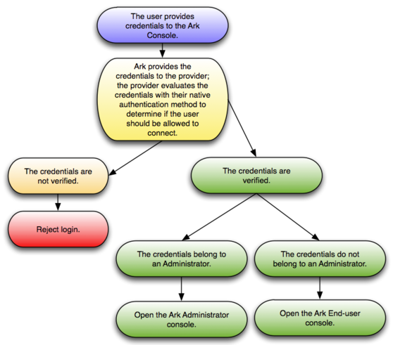

When deploying the console, you can specify the type of authentication used by the Ark console. Authentication can be native password (provided by the service provider), or performed by the PostgreSQL backing database that resides on the host of the Ark console.

**Using Native Password Authentication**

When using native password authentication, an Administrative user must:

-   On AWS: use the `User Administration` section of the Ark `Admin` tab to register Ark users.
-   On Azure: use the Azure console to create user accounts and manage user access.

**Using PostgreSQL Authentication**

Ark supports using the following PostgreSQL authentication types:

-   PASSWORD
-   LDAP
-   RADIUS
-   PAM
-   BSD

For information about configuring authentication on a Postgres server, please consult the [Postgres documentation](https://www.enterprisedb.com/docs/en/10/pg/client-authentication.html) available at the EnterpriseDB website.

If you choose to use PostgreSQL authentication when deploying the Ark console, an Administrative user must:

-   On AWS: add each user to the Ark backing database, and then use the `User Administration` section of the Ark `Admin` tab to register Ark users. On an Amazon host, the user name and associated password specified in the Ark backing database must match the credentials specified when registering the user in the Ark console.
-   On Azure: add each user to the Ark backing database. Registration will be complete when the user logs in to the Ark console.

You can use the psql client to add a user to the postgres database. To use the psql client, SSH to the host of the Ark console; navigate into the `bin` directory, and connect to the psql client with the command:

`./psql –d postgres –U postgres`

When prompted, supply the password of the postgres database user. After connecting to the database, you can use the `CREATE ROLE` command to add a user to the database:

`ADD USER <user_name> WITH PASSWORD <password>;`

Where:

`<user_name>` specifies the name of the Ark user. `<password>` specifies the password associated with the user name.

For detailed information about using the [psql client](https://www.enterprisedb.com/docs/en/10/pg/app-psql.html) please see the Postgres documentation.

After the administrative user adds the end-user, the end-user will complete the registration process by navigating to the URL of the console, and logging in.

## Using Provider Authentication on AWS

If you use authentication provided by Amazon, an Ark Administrative user can use the Ark Administrator's console to add, modify, or delete user accounts.

Fig. 5.1: Using Provider Authentication on AWS

When the user provides credentials to the Ark console, the credentials are passed to Amazon for verification. If the credentials are successfully verified, the role is evaluated to determine if the user should have access to the Administrator console or the end-user console.

## Using PostgreSQL Authentication on AWS

When Postgres authentication is enabled, the first user to log in becomes the service user.

Fig. 5.2: Using PostgreSQL Authentication on AWS

An Ark Administrative user must use a client application (such as psql or PEM) to add each user to the Ark backing database, and then use the User Administration table to register Ark users. The user name and associated password specified in the Ark backing database must match the credentials specified when registering the user in the Ark console. If Ark successfully verifies the credentials, the credentials are passed to Amazon for evaluation to determine console access.

## Using Provider Authentication on Azure

If you use native password authentication provided by Azure you must use the Azure Active Directory console to create and manage user accounts.

Fig. 5.3: Using Provider Authentication on Azure

When the user provides credentials to the Ark console, the credentials are passed to the provider for verification. If the credentials are successfully verified, the role is evaluated to determine if the user should have access to the Administrator console or the end-user console.

## Using PostgreSQL Authentication on Azure

When Postgres authentication is enabled on Azure, the first user to log in to the Ark console becomes the service user. An administrator will be required to use either the PEM web interface or psql to add each successive user to the Ark backing database. User registration will be completed when the end user logs in to the Ark console.

Fig. 5.4: Using PostgreSQL Authentication on Azur

The credentials of the Ark service user are verified by the provider; all other credentials are verified by the Postgres server on the Ark console host. If Ark successfully verifies the credentials, the credentials are then evaluated to determine console access.
