<div id="ark_installing_console_aws" class="registered_link"></div>

The EDB Ark console is distributed through the Amazon AWS Marketplace in an Amazon machine instance. To install the Ark console on your Amazon instance, you will need to:

-   Launch an [Ark instance](#launch_ark_aws) with an Amazon AWS Marketplace AMI.
-   Create an [Amazon role](#creating_aws_service_user) and [register an administrative user](#creating_aws_service_role) .
-   Configure the [Ark console](#config_ark_console) .
-   Create an Amazon role and [register an Ark console user](#create_aws_role_register_ark_user) .

<div id="launch_ark_aws" class="registered_link"></div>

## Launching the Ark Console Instance on AWS

Before launching an AMI into an Amazon VPC, you must ensure that the VPC has access to an [Internet Gateway](http://docs.aws.amazon.com/AmazonVPC/latest/UserGuide/VPC_Internet_Gateway.html). If your VPC does not have access to an Internet Gateway, you can use the Amazon management console to create an Internet Gateway and associate it with your VPC.

Please note: if you are using EC2-Classic networking, you do not need to provide an Internet Gateway.

To launch an Amazon EC2 instance that contains a running copy of the Ark console and the Ark console's backing database, connect to your Amazon AWS Marketplace account and locate the AMI that contains the Ark console. Navigate through the introductory page for the AMI, selecting AWS service options that are appropriate to your application, and agreeing to the `Terms and Conditions`. When you agree to the `Terms and Conditions`, Amazon will process the subscription.

After you subscribe, Amazon will forward an email to the address associated with your user account that includes [launch instructions](http://docs.aws.amazon.com/AWSEC2/latest/UserGuide/launching-instance.html) for the AMI.

Then, use the Amazon launch wizard to launch your instance, noting the requirements that follow on `Step 3` and `Step 6` of the wizard.

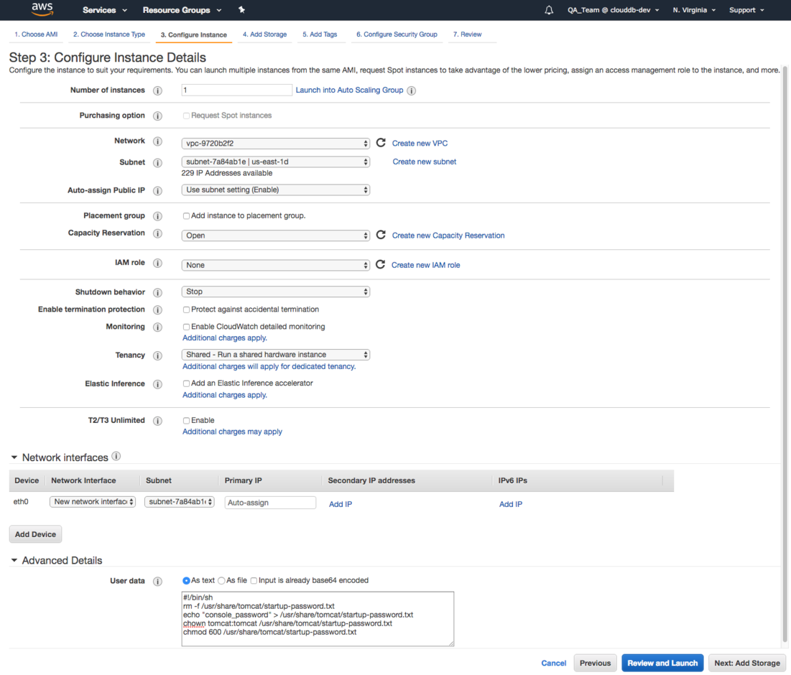

Fig. 6.1: Step 3 - Enabling the startup script

When configuring your instance, you should include the following selections on the `Step 3: Configure Instance Details` dialog of the Amazon launch wizard:

-   Use the `Auto-assign Public IP` drop-down to specify Enable to automatically assign an IP address to the new instance.
-   Use the `Advanced Details` section to provide the text of the script that will start the Ark console setup or recovery dialog.

<!-- end list -->

```text
#!/bin/sh
rm -f /usr/share/tomcat/startup-password.txt
echo "<console_password>" > /usr/share/tomcat/startup-password.txt
chown tomcat:tomcat /usr/share/tomcat/startup-password.txt
chmod 600 /usr/share/tomcat/startup-password.txt
```

Replace the `<console_password>` variable in the script with a password for the console. When the user first connects to the AWS Ark console, they will be required to provide the console password provided in the script.

Continue through the launch wizard; please note that when configuring your security group, the group must allow communication between the nodes of the cluster. When defining the security group, include the rules listed in the table below.

| Rule Type  | Direction | Port or Range | Remote | CIDR Address |
| ---------- | --------- | ------------- | ------ | ------------ |
| All ICMP   | Ingress   |               | CIDR   | 0.0.0.0/0    |
| SSH        |           |               | CIDR   | 0.0.0.0/0    |
| HTTP       |           |               | CIDR   | 0.0.0.0/0    |
| HTTPS      |           |               | CIDR   | 0.0.0.0/0    |
| Custom TCP | Ingress   | 6666          | CIDR   | 0.0.0.0/0    |
| Custom TCP | Ingress   | 7800 to 7999  | CIDR   | 0.0.0.0/0    |
| Custom TCP | Ingress   | 5432          | CIDR   | 0.0.0.0/0    |

**Please Note:**

-   The CIDR addresses specified in the rules for SSH, HTTP, HTTPS, and 5432 can be customized to restrict access to a limited set of users.
-   The CIDR addresses specified for port 6666 and ports 7800 through 7999 must specify a value of `0.0.0.0/0`.
-   The Custom TCP rule that opens ports 7800 through 7999 provides enough ports for 200 cluster connections; the upper limit of the port range can be extended if more than 200 clusters are required.

<div id="create_aws_service_user_and_role" class="registered_link"></div>

## Creating the Amazon AWS Service User and Service Role

Before configuring the Ark console on an Amazon host and creating users, you must create an Amazon service user and service role. Ark uses the service role when performing Ark management functions (such as console backups). The Ark console uses the service role credentials (the cross account keys) to assume the IAM roles assigned to Ark users. This enables Ark to securely manage AWS resources. When configuring the Ark console, you are required to provide the setup dialog with details about the AWS service user and the service role. Specify:

-   the Amazon Role ARN (resource name) that will be used by the Ark service in the `Service Account Role ARN` field.
-   the Amazon external ID that will be used by the Ark service user in the `Service Account External ID` field.
-   the AWS_ACCESS_KEY_ID associated with the AWS role used for account administration in `AWS Access Key` field.
-   the AWS_SECRET_ACCESS_KEY associated with the AWS role used for account administration in `AWS Secret Key` field.

<div id="creating_aws_service_user" class="registered_link"></div>

### Creating the AWS Service User

To create the Ark console's service user account, connect to the Amazon AWS management console, and navigate through the *IAM* menu (Identity and Access Management) to the *Users* dashboard; select the *Add user* button to open the *Add user* dialog.


Fig. 6.2: The AWS Add user dialog

On the `Add user` dialog:

-   Provide a name for the service user account in the `User name` field.
-   Check the box to the left of `Programmatic access`.

Click `Next: Permissions` to continue. Click the `Attach existing policies directly` button, and then the `Create policy` button to open the `Create policy` dialog in a new tab.

When the `Create policy` dialog opens, select the `JSON` tab, and provide the policy definition.

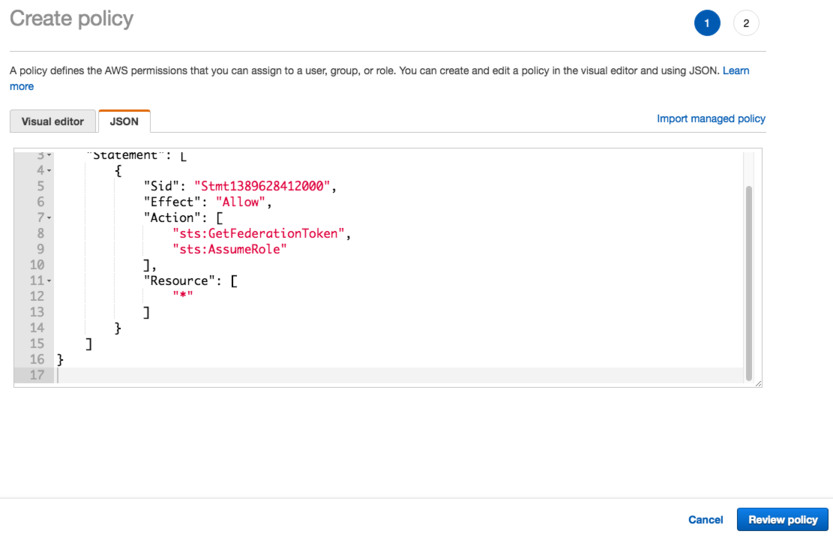

Fig. 6.3: Adding a policy definition

After copying in a policy, click the `Review policy` button to continue.

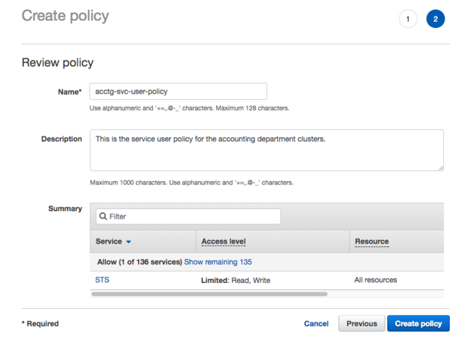

Fig. 6.4: Completing the policy definition

Provide a name and a description for the service policy definition, and click the `Create policy` button to continue.


Fig. 6.5: Attaching the policy

Return to the `Add user` tab, and click the `Refresh` button. Check the box to the left of the new policy, and click `Next:Tags`.

IAM user tags are optional; you can click `Next: Review` to continue.

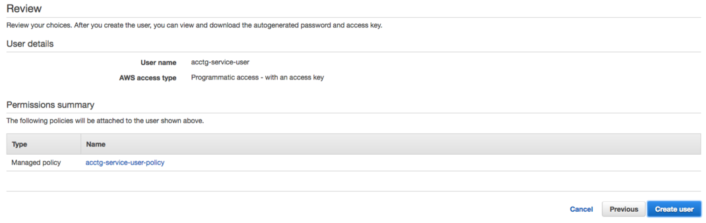

Fig. 6.6: Creating the user

Review the account details, and click the `Create user` button to create the user. The AWS console will confirm that the user has been added successfully.

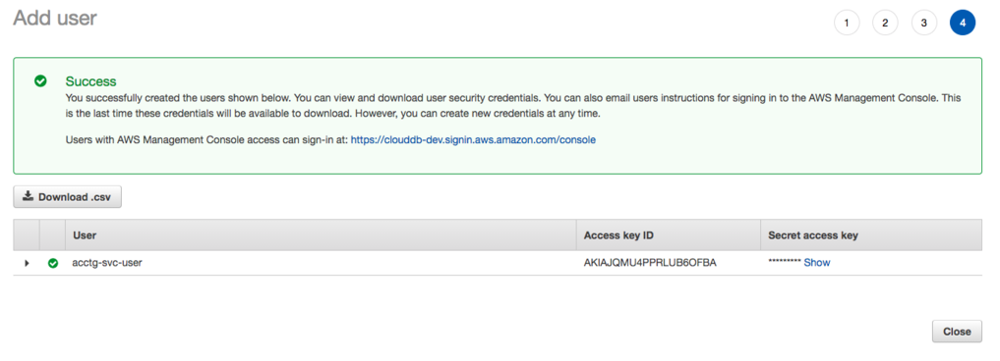

Fig. 6.7: The user is created successfully

Keep a copy of the access key values displayed on the console; you must provide the values when configuring your Ark console:

-   Provide the Access key id in the `AWS Access Key` field on the Ark console setup dialog.
-   Use the `Show` button to display the Secret access key. You must provide the Secret access key in the AWS `Secret Key` field on the Ark console setup dialog.

<div id="creating_aws_service_role" class="registered_link"></div>

### Creating the AWS Service Role

After creating the service user, you must create a service role. Connect to the Amazon management console, and navigate through the Identity and Access Management dashboard to the Roles dashboard. Then, click the `Create role` button to open the `Create role` dialog.


Fig. 6.8: Creating a role

Select the `AWS service` button, and the `EC2 service` type; click `Next: Permissions` to continue.

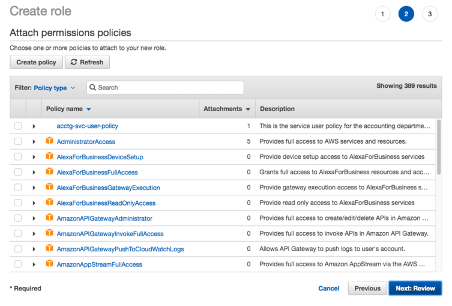

Fig. 6.9: The AWS Attach permissions policies dialog

When the `Attach permissions policies` dialog opens, do not select a policy; instead, click `Next:Tags`, then `Next: Review` to continue.

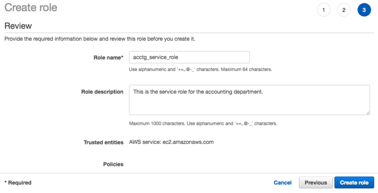

Fig. 6.10: Provide a role name and description

When the `Review` dialog opens, specify a name and description for the new role and click the `Create role` button. The new role will be displayed in the role list on the Amazon IAM Roles page. Click the role name to display detailed information about the role on the `Summary` dialog.


Fig. 6.11: The AWS Summary dialog

The `Summary` dialog will display a Role ARN, but the ARN will not be enabled until the security policy and trust policy are updated. To modify the inline security policy, click the `Add inline policy` button; the button is located on the `Permissions` tab.

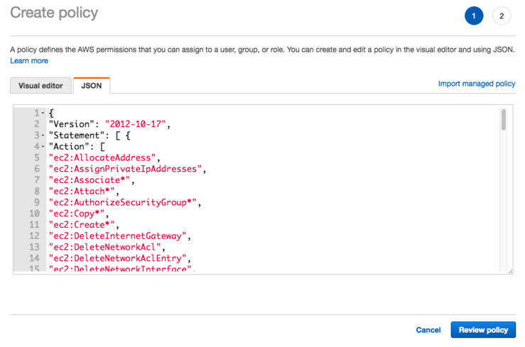

Fig. 6.12: Provide the policy name and contents

Copy the [provided security policy](../17_ark_aws_service_user_security_policy/#ark_aws_service_user_security_policy) into the `JSON` tab on the `Create policy` dialog. After providing security policy information, click `Review Policy` to provide a name for the policy, and return to the role information page.


Fig. 6.13: The policy document

Navigate to the `Trust relationships` tab, and select the `Edit Trust Relationship` button to display the `Policy Document`. Replace the displayed content of the policy document with the provided [Amazon IAM Role Trust Relationship](../16_ark_aws_iam_role_trust_relationship/#ark_aws_iam_role_trust_relationship).

Click the `Update Trust Policy` button to finish.


Fig. 6.14: The role detail summary

The role detail `Summary` will display values that you must provide when configuring your Ark console:

-   The `Role ARN` associated with the service role must be provided in the `Service Account Role ARN` field.
-   The external ID associated with the service role must be provided in the `Service Account External ID` field. You can find this value under the `Conditions` section of the `Trust Relationships` tab.

<div id="config_ark_console" class="registered_link"></div>

## Configuring the Ark Console

After launching the instance in the Amazon console, navigate to the public IP address of the cluster.

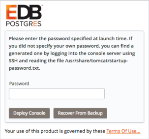

Fig. 6.15: Deploying the console

When prompted, provide the password specified when launching the console, and click `Deploy Console`.


Fig. 6.16: The provider specific console properties

Use fields in the first section of the dialog to provide values that are specific to your Amazon account:

-   Use the `AWS Access Key` field to specify the Amazon access key ID associated with the AWS role that will be used for account administration.
-   Use the `AWS Secret Key` field to specify the Amazon secret key associated with the AWS role that will be used for account administration.
-   Use the `Service Account Role ARN` field to specify the Amazon Role ARN (resource name) that should be used by the Ark service user when performing management functions on behalf of Ark.
-   Use the `Service Account External ID` field to specify the Amazon external ID that should be used by the Ark service user.
-   Use the `Service Account ID` field to specify the identity of the service account.
-   Use the `Service Account Password` field to provide the password associated with the service account.
-   Use the `Enable Self Registration` field to specify if the Ark console should allow self-registration for Ark users; specify `true` to allow self-registration, or `false` to disable self-registration.


Fig. 6.17: Provide general server properties

Use fields in the next section to provide general server properties:

-   Use the `Console DNS Name` field to specify a custom DNS name for the console. The property does not assign the DNS name to the console, but any notification emails that refer to the console will refer to the console by the specified name. If you do not provide a custom DNS name, the IP address of the console will be used in notifications.
-   Use the `Contact Email Address` field to specify the email address that will be included in the body of cluster status notification emails.
-   Use the `Email From Address` field to specify the return email address used on cluster status notification emails.
-   Use the `Notification Email` field to specify the email address to which email notifications about the status of the Ark console will be sent.
-   Set the `CC From Address` field to true to instruct Ark to send a copy of the email to the Email From Address anytime a notification email is sent.
-   Use the `API Timeout field` to specify the number of minutes that an authorization token will be valid for use with the API.
-   Use the `WAL Archive Container` field to specify the name of the object storage container where WAL archives (used for point-in-time recovery) are stored. You must provide a value for this field; once set, this property must not be changed.
    -   The bucket name must be at least 3 and no more than 63 characters long.
    -   The name can contain lowercase letters, numbers, and hyphens; the name must start with and end with a lowercase letter or number.
    -   A series of one or more labels; adjacent labels are separated by a single period (.). A name may not be formatted as an IP address.

For more information, please visit: <http://docs.aws.amazon.com/AmazonS3/latest/dev/BucketRestrictions.html>

-   Use the `Dashboard Docs URL` field to specify the location of the content that will be displayed on the Dashboard tab of the Ark console. If your cluster resides on a network with Internet access, set the parameter to `DEFAULT` to display content (documentation) from EnterpriseDB; to display alternate content, provide the URL of the content. To display no content in the lower half of the `Dashboard` tab, leave the field blank.
-   Use the `Dashboard Hot Topics URL` field to specify the location of the content that will be displayed on the Dashboard tab of the Ark console. If your cluster resides on a network with Internet access, set the parameter to `DEFAULT` to display content (alerts) from EnterpriseDB; to display alternate content, provide the URL of the content. Leave the field blank to omit content.
-   Use the `Enable Console Switcher` field to indicate if the console should display [console switcher](../08_ark_admin_tab/#ark_using_admin_tab) functionality.
-   Set `Enable Postgres Authentication` to `true` to instruct Ark to enforce the authentication method configured on the backing Postgres server. Supported authentication methods include password, LDAP, RADIUS, PAM, and BSD. If `false`, Ark will use the default authentication method (password).
-   Use the `Template Restrict New Users` field to configure the Ark console to make any new user a `Template Only` user by default. You can later modify the user definition in the `User Administration` table to specify that a user is not a template only user.
-   Use the `Cluster Event Retention Limit` field to specify how long the console will keep events for deleted clusters. The default value is 14 days.

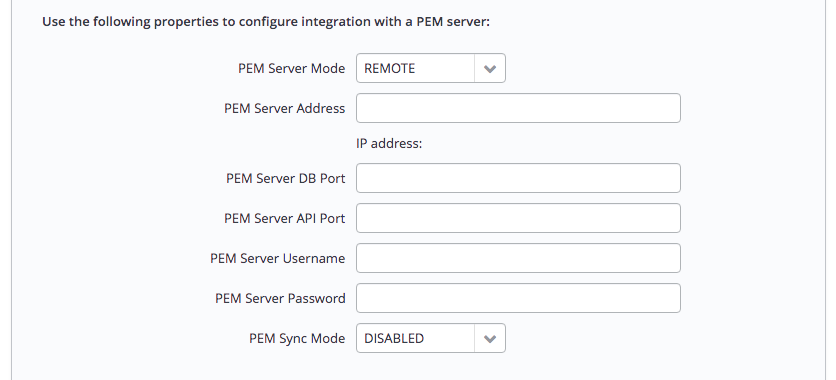

Fig. 6.18: Provide connection details for PEM

Use fields in the next section to provide connection details for a PEM server host; this will allow Ark to register and unregister PEM agents and clusters:

-   Use the `PEM Server Mode` drop-down listbox to select a deployment mode:

Select `DISABLE` to indicate that clusters deployed on the host should not be registered with the PEM server.

Select `LOCAL` to indicate that you would like to use the PEM server that resides on your local host. If you select LOCAL, the PEM deployment will use default values assigned by the installer.

-   The IP address of the PEM server host will be the IP address of the Ark host.
-   The PEM Server Port will monitor port `5432`.
-   The PEM server database user will be named `postgres`.
-   The password associated with the PEM server will be the same password as the Ark console.

Select `REMOTE` to indicate that you would like to use a PEM server that resides on another host, and provide connection information on the Ark console deployment dialog. If you select REMOTE, whenever a new cluster node is created on this console, it will be registered for monitoring by the PEM server.

-   Provide the IP address of the PEM server host in the `PEM Server IP Address` field.
-   Specify the port monitored for connections by the PEM server in the `PEM Server DB Port` field.
-   Specify the port on the PEM server host used for PEM API connection attempts by the Ark server in the `PEM Server API Port` field. Not valid if the PEM server mode is `DISABLED` or `LOCAL`.
-   Provide the name that should be used when authenticating with the PEM server in the `PEM Server Username` field.
-   Provide the password associated with the PEM server user in the `PEM Server Password` field.
-   Use the `PEM Sync Mode` drop-down listbox to `ENABLE` or `DISABLE` synchronization between the Ark server and the PEM server.
-   Use the `PEM Synchronization Interval` field to specify the number of minutes between attempts to synchronize the Ark console with the PEM server.

<div id="saml" class="registered_link"></div>


Fig. 6.19: Provide information about the service provider

If you specify `true` in the `SAML auth enabled` field, the Ark console will display the properties required to use SAML authentication when connecting to the Ark console. Use fields on the deployment dialog to specify SAML authentication properties. Use fields in the next section to provide information about the service provider:

-   Use the `SP Entity ID` field to provide a URI that specifies the identifier of the service provider.
-   Use the `SP Consumer Service URL` field to specify the URL from which the response from the identity provider will be returned.
-   Use the `SP Consumer Service Binding` field to specify the SAML protocol binding to be used when returning the response message from the identity provider.
-   Use the `SP Logout Service URL` field to specify the URL to which the service provider will specify information about where and how the `Logout Response` message MUST be returned to the requester, in this case our service provider.
-   Use the `SP Logout Service Binding` field to specify the SAML protocol binding to be used when returning the `LogoutResponse` or sending the `LogoutRequest` message.
-   Use the `SP Name ID Format` field to specify the constraints on the name identifier that will be used to represent the requested subject.
-   Use the `SP Certificate` field to specify certificate information; this is usually `x509cert`. The private key of the service files are provided by files placed in the `certs` folder.
-   Use the `SP Private Key` field to specify the location of the service providers private key; this must be in `PKCS#8` format.


Fig. 6.20: Provide information about the identity provider

Use fields in the next section to provide information about the identity provider:

-   Use the `IDP Entity ID` field to specify the identifier of the identity provider (this must be a URI).
-   Use the `IDP Sign On URL` field to specify the URL target of the identity provider (where the service provider will send the Authentication Request Message).
-   Use the `IDP Sign On Service Binding` field to specify the SAML protocol binding to be used when returning the response message. This version of Ark only supports the HTTP-Redirect binding.
-   Use the `IDP Logout Service URL` field to specify the URL Location of the identity provider to which the service provider will send a single logout Request.
-   Use the `IDP Logout Service Response URL` field to specify the URL Location of the identity provider to which the service provider will send a single logout response.
-   Use the `IDP Single Logout Service Binding` field to specify the SAML protocol binding to be used when returning the response message.
-   Use the `IDP Certificate` field to specify the Public x509 certificate of the identity provider.

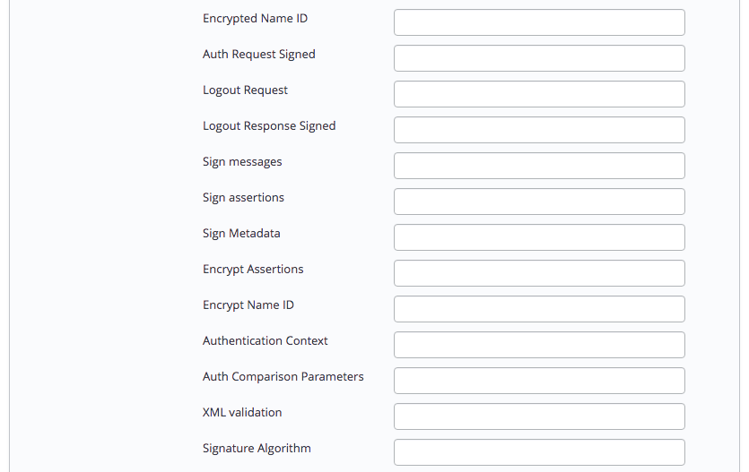

Fig. 6.21: Provide information about your SAML preferences

Use fields in the next section to provide your SAML preferences:

-   Use the `Encrypted Name ID` field to indicate that the name identifier of the `samlp:logoutRequest` sent by this service provider will be encrypted; specify `true` or `false`.
-   Use the `Auth Request Signed` field to indicate if the `samlp:AuthnRequest` messages sent by this service provider will be signed; specify `true` or `false`.
-   Use the `Logout Request` field to indicate if the `samlp:logoutRequest` messages sent by the service provider will be signed; specify `true` or `false`.
-   Use the `Logout Response Signed` field to indicate if the `samlp:logoutResponse` messages sent by the service provider will be signed; specify `true` or `false`.
-   Use the `Sign messages` field to sign the metadata. If you leave the field empty, the metadata will not be signed. If you wish to provide a signature, provide a comma separated `keyFileName`, `certFileName` pair.
-   Use the `Sign assertions` field to indicate a requirement for the `samlp:Response`, `samlp:LogoutRequest`, and `samlp:LogoutResponse` elements received by the service provider to be signed; specify `true` or `false`.
-   Use the `Sign Metadata` field to indicate that the metadata of this service provider must be signed; specify `true` or `false`.
-   Use the `Encrypt Assertions` field to indicate that the assertions received by this service provider must be encrypted; specify `true` or `false`.
-   Use the `Encrypt Name ID` field to indicate that the name identifier received by this service provider must be encrypted; specify `true` or `false`.
-   Use the `Authentication Context` field to specify that `Set Empty` and `no AuthContext` will be sent in the `AuthNRequest`. You can set multiple values in a comma-delimited list.
-   Use the `Auth Comparison Parameters` field to specify that the `authn` comparison parameter to be set; this field defaults to `exact`.
-   Use the `XML validation` field to indicate if the service provider will validate all received xmls; specify `true` or `false`.
-   Use the `Signature Algorithm` field to specify the algorithm that the toolkit will use for the signing process. Specify one of the following:
    -   `http://www.w3.org/2000/09/xmldsig#rsa-sha1`
    -   `http://www.w3.org/2000/09/xmldsig#dsa-sha1`
    -   `http://www.w3.org/2001/04/xmldsig-more#rsa-sha256`
    -   `http://www.w3.org/2001/04/xmldsig-more#rsa-sha384`
    -   `http://www.w3.org/2001/04/xmldsig-more#rsa-sha512`


Fig. 6.22: Provide information about your organization

Use fields in the next section to provide information about your organization:

-   Use the `Organization Name` field to specify the name of the organization for which authentication is being provided.
-   Use the `Display Name` field to specify the display name of the organization.
-   Use the `Organization URL` field to specify the URL of the organization.
-   Use the `Organization Language` field to specify the primary language used by the organization.
-   Use the `Technical Contact Name` field to specify the name of a technical contact.
-   Use the `Technical Email Address` field to specify a contact email address for the technical contact.
-   Use the `Support Contact Name` field to specify the name of a support contact.
-   Use the `SAML Support Email Address` field to specify the email address of the SAML support contact.


Fig. 6.23: Provide console backup information

Use fields in the next section to specify your console backup storage preferences:

-   Use the `Storage Bucket` field to specify the name of the bucket in which backups will be stored.
-   Use the `Console Backup Folder` field to specify the name of the backup folder within the storage bucket.

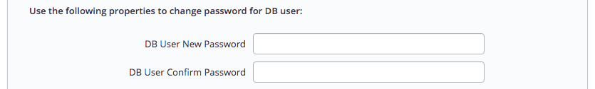

Fig. 6.24: Specify console password preferences

Use fields in the next section to specify database password preferences for the database superuser (`postgres`) on the backing PostgreSQL database (`postgres`):

-   Use the `DB User New Password` field to set the password for the postgres user on the console's backing database (`postgres`).
-   Use the `DB User Confirm Password` field to set the password for the postgres user on the console's backing database (`postgres`).


Fig. 6.25: Select a timezone for the server

Use the last field to specify a timezone for the server:

-   Use the drop-down listbox in the `Timezone` field to select the timezone that will be displayed by the Ark console.

When you've completed the setup dialog, click the `Save` button to validate your changes. The Ark console will prompt you to confirm that you wish to restart the server; when prompted, click the `Restart` button to restart the server and start the Ark console.

<div id="create_aws_role_register_ark_user" class="registered_link"></div>

## Creating an Amazon Role and Registering an Ark Console User

After deploying the console, you must create an Amazon role with an associated security policy that will be applied to the Ark console user. You can use the same security policy for multiple users, or create additional Amazon roles with custom security policies for additional users. Each time you register a user, you will be prompted for a Role ARN. The Role ARN determines which security policy will be applied to that user.

To define an Amazon role, connect to the Amazon management console, and navigate through the `Identity and Access Management` dashboard to the `Roles` dashboard, and click the `Create role` button.


Fig. 6.26: The Create role dialog

When the `Create role` dialog opens, select the `AWS service button` and highlight the `EC2` bar, and click `Next: Permissions` to continue.


Fig. 6.27: The Attach permissions policies dialog

When the `Attach permissions policies` dialog opens, do not specify a policy; instead, click `Next: Review` to continue.

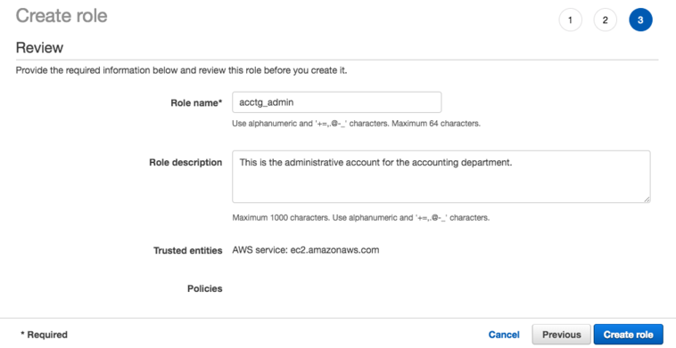

Fig. 6.28: The Review dialog

Use the `Review` dialog to provide a name and a description; then, click `Create role`. The role will be displayed in the role list on the Amazon `IAM Roles` page. Highlight the role name to review account details.


Fig. 6.29: The Summary dialog

The *Summary* dialog will display a Role ARN, but the ARN will not be enabled until the security policy and trust policy are updated.

After completing the `Create Role` wizard, you must modify the inline policy and trust relationship (defined by the security policy) to allow Ark to use the role. Click the `Add inline policy` link to add a security policy. Then, copy the [permission policy text](../15_ark_aws_iam_role_permission_policy/#ark_aws_iam_role_permission_policy) into the `JSON` tab.


Fig. 6.30: Adding a security policy

Then, click `Review Policy` to return to continue to the `Review policy` page and provide a name for the policy. Then, click the `Create policy` button to return to the role summary page.

Select the `Trust relationships` tab, and click the `Edit trust relationship` button to update the trust relationship assigned to the role.


Fig. 6.31: Editing the trust relationship

Replace the displayed content with the [provided policy document](../16_ark_aws_iam_role_trust_relationship/#ark_aws_iam_role_trust_relationship).

!!! Note
    `EDB-ARK-SERVICE` is a placeholder within the trust policy. You must replace the placeholder with the `External ID` provided on the `Step 2` tab of the Ark console `New User Registration` dialog.

To retrieve the `External ID`, open another browser window and navigate to the `Log In` page of your Ark console.


Fig. 6.32: Accessing the New User Registration dialog

Click the `Register` button to open the `New User Registration` dialog.

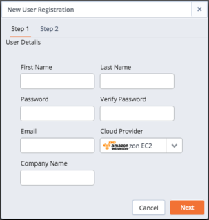

Fig. 6.33: The New User Registration dialog

Enter user information in the `User Details` box located on the `Step 1` tab:

-   Enter your first and last names in the `First Name` and `Last Name` fields.
-   Enter a password that will be associated with the user account, and confirm the password in the `Password` and `Verify Password` fields.
-   Provide an email address in the `Email` field; please note that the email address is used as the Login identity for the user.
-   Use the drop-down listbox in the `Cloud Provider` field to select the host on which the cloud will reside.
-   Enter the name of the company with which you are associated in the `Company Name` field.

When you've completed `Step 1`, click `Next` to open the `Step 2` tab. The `Step 2` tab of the `New User Registration` dialog will display a random `External ID` number. Copy the `External ID` from the `Step 2` dialog into the trust policy, replacing `EDB-ARK-SERVICE`. Please note that you must enclose the External ID in double-quotes ("). Click the `Update Trust Policy` button to save your edits and exit the dialog.


Fig. 6.34: The Summary tab of the Role detail panel

Your Amazon IAM role ARN is displayed on the Amazon role detail panel.


Fig. 6.35: Registering a user on an Amazon EC2 cloud

Enter your Amazon IAM role ARN in the `Role Arn` field on the `Step 2` dialog, and click `Finish` to complete the registration. Select `Cancel` to exit without completing the registration.

After registering your user identity and connection information, you are ready to log in to the Ark console.


Fig. 6.36: The Login/Register dialog

Provide the email address in the `Email` field, and the associated password in the `Password` field, and click `Log In` to connect to the Ark management console.


Fig. 6.37: The Ark dashboard tab

In preparation for non-administrative user to connect, an Administrator should:

1.  Use the Ark console to define a server image for each server that will host a database cluster. For detailed information about using the Ark console to create server images, see [Creating a Server Image](../08_ark_admin_tab/#ark_using_admin_tab).
2.  Use the Ark console to create database engine definitions. For detailed information about defining a database engine, see [Creating a Database Engine](../08_ark_admin_tab/#ark_using_admin_tab)
